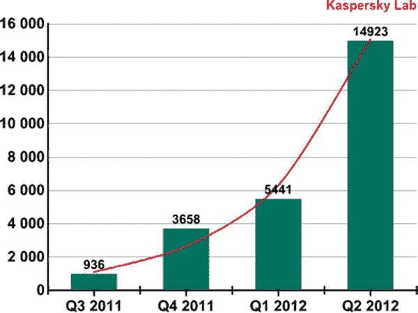
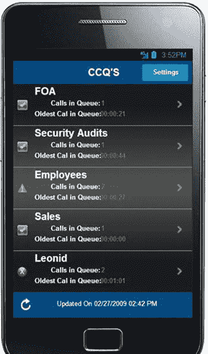

# 六、安全性

在这一章中，我们将从一系列行业资源中探索安全 Android 开发和编码的建议。这些不同的安全建议代表了当前关于该主题的最佳想法，我还添加了我自己从构建和部署领先的 Android 应用的辛苦获得的经验中收集的额外措施。

Android 的安全状况

关于 Android 安全性的书籍、博客帖子和杂志文章可能比其他任何移动平台都多。不管我们喜不喜欢，Android 都被视为移动世界的狂野西部。因为所有的 iOS 应用都是由人来审查的，不管对错，这给人一种 iOS 应用比 Android 应用更安全的感觉。但这怎么可能呢？毕竟，Android 平台在分离 apk 方面做得很好，每个 apk 都运行在自己的沙箱中？我们来看看一些实证数据，看看传言有没有真的。图 6-1 显示了一个安全列表报告，可在`http://www.securelist.com/en/analysis/204792239/IT_Threat_Evolution_Q2_2012`获得。



图 6-1 。针对 Android 操作系统的恶意软件修改数量

你可以看到 Android 领域的恶意软件应用数量确实在急剧增长。该报告继续说，在 15k 个应用中，发现的恶意软件特征列于表 6-1 。

表 6-1 。恶意软件类型的分类

| 

百分率

 | 

恶意软件类型

 |
| --- | --- |
| 49% | 从电话中窃取数据 |
| 25% | 短信服务 |
| 18% | 后门程序 |
| 2% | 间谍程序 |

也有一些著名的假冒应用，如假冒的网飞应用(见`http://www.symantec.com/connect/blogs/will-your-next-tv-manual-ask-you-run-scan-instead-adjusting-antenna` `)`)，它看起来像网飞应用，只是收集用户名。从《愤怒的小鸟》到亚马逊应用商店，几乎每个著名的安卓应用本身都有一个可疑的克隆，希望欺骗用户付费下载。是的，这方面的安全应该是双向的；我敢肯定，用户在安装 APK 时很少或根本不关注那个许可屏幕，通常会批准任何事情。因此，虽然看起来我们在 Android 平台上确实有问题，但也许这不全是开发者的错。

回到纸杯蛋糕和甜甜圈的时代，几乎没有支票。但是现在我们可以说，每个开发者都需要有信用卡才能上传一个 app。因为大约在姜饼时代，谷歌 Bouncer 还会自动检查应用是否在你的 APKs 上安装了任何恶意软件或木马，所以应该会安全得多。(然而，Jon Oberheide 的论文描述了他如何在`http://jon.oberheide.org/files/summercon12-bouncer.pdf`创建了一个虚假的开发者账户并绕过了谷歌保镖，这是对谷歌注册过程有效性的一些担忧。)随着越来越多的用户转向冰淇淋三明治和果冻豆，事情肯定越来越安全；在撰写本文时，登陆 Google Play 的安卓设备中有 40%安装了 4.x 版本。

但感知是现实，即使这些黑客攻击大多成为过去，Android 仍被视为不如 iOS 安全的平台。那么一个开发者能做什么呢？您可以确保您的 apk 尽可能安全，以帮助改变这种狂野西部的看法。本章将展示如何确保您的 apk 以一致的方式做您的用户所期望的事情——不多也不少。

有许多最佳实践可以让你的 Android 应用更加安全。在这一章中，我将让你更好地理解如何创建一个值得信赖的应用；我们的目标是，如果有人下载了你的应用，他们可以放心地认为这不会给他们带来任何安全问题。

本章的大部分内容汇编了安全编码实践的 10 大列表。我们将首先查看一些行业标准列表，并将它们合并到我们自己的最佳实践 10 强列表中。这并不真的意味着是一个确定的列表；它只是一个来自个人经验、研究和一些行业标准列表的最重要问题的列表。

我的公司 RIIS 用一款安卓应用来教我们的开发人员如何编写安全代码，并告诉你我们是如何做的，这也很有意义。

安全编码实践

您的 apk 应该使用最小特权的概念，以便他们总是只获得他们真正需要的特权，而不会被授予其他从未使用过但可能会打开漏洞的特权。那你怎么确定呢？

如果你是一个消费者，有各种各样的工具来检查权限，但是如果你是一个开发人员或经理，有非常有限的工具。

一旦你的 APK 出现在 Google Play 上，手机就可以被植入，而 APK 可以非常容易地被逆向工程来查看任何用户名/密码或其他登录信息。确保客户的数据不是纯文本格式，以免泄露，这符合每个人的利益。在反编译 APK 时，我们已经看到了一些非常奇怪的方法名，我最喜欢的方法之一是 updateSh*t，这可能是你不希望看到的带有你公司名称的东西。

您可能还想更好地感受您正在使用的任何第三方库，并确保它们没有做任何不应该做的事情；例如，AdMob 发出位置请求以收集营销信息。您可能想知道第三方 APK 是否也有硬编码的用户名和密码，以及它们可能在做什么。

为了解决这个问题，我列出了十大安全编码实践。其中大部分来自于比我聪明的人开发的其他安全列表。

这个列表成了我公司的晴雨表，显示在我们开发的安卓 APK 中什么是可接受的，什么是不可接受的。这并不是说一些 apk 不会因为完美的理由而违反前 10 名中的一项或多项准则，但它发出了一个危险信号，这样有人就可以问为什么它会做一些我们没有预料到的事情。

这些都不是谷歌 Bouncer 会检查的问题类型；在我们看来，如果没有充分的理由，这些代码就不应该出现在你的 APK 中。

行业标准列表

在我们提出自己的列表之前，让我们先来看看下面的安全列表:

*   PCI 的移动支付接受安全指南
*   OWASP 或开放 Web 应用安全项目的 10 大移动控件和设计原则
*   谷歌的安全提示

PCI 列表

2012 年 9 月，PCI 安全标准委员会发布了移动支付安全指南 v1.0。PCI 的重点是支付处理，虽然这些指导方针还不是强制性的，但它们是一个很好的起点。PCI 指南中的一些条款并不直接适用于移动开发人员，但是有一些是至关重要的，我们在这里已经包括了。

*   **防止帐户数据在移动设备中处理或存储时遭到破坏。** Android 开发人员应确保所有数据都得到安全存储，并将数据泄露的可能性降至最低。将未加密的敏感客户信息存储在 SQLite 或 SD 卡上的文件中是不可接受的。最安全的选择是，如果可能的话，不要在移动电话上的任何地方存储加密密钥，但是如果这不是一个选项，那么密钥需要被安全地存储，以便它们即使在电话被根化时也不可访问。
*   **防止帐户数据在传输出移动设备时被拦截。**任何敏感的客户信息，在本例中为支付信息，都应使用 SSL 安全传输，而不是以明文形式发送。
*   创建服务器端控制并报告未经授权的访问。通过服务器端日志消息、软件更新、电话寻道等报告超过给定阈值的未授权访问。
*   **防止特权升级并远程禁止支付。**如果用户使用他们的手机，应用应该报告这一变化，并在必要时提供停止支付的能力。
*   **更喜欢网上交易。**交易应在手机在线时进行，如果手机因任何原因离线，则不保存交易供以后处理。存储支付数据增加了黑客获取支付数据的风险。
*   **符合安全编码、工程和测试。**有许多 Android 特有的编码技术，比如在写入文件时避免使用`MODE_WORLD_WRITABLE`或`MODE_WORLD_READABLE`，开发者应该知道这些技术。在本章的剩余部分，我们将看看安全编码对 Android 开发者意味着什么。
*   **支持安全的商户收据。**任何收据类型的信息，无论是显示在屏幕上还是通过电子邮件发送，都应始终掩盖信用卡号码，而决不显示完整的号码。
*   **提供安全状态的指示。**不幸的是，与网络浏览器不同，Android 应用没有锁定和解锁挂锁的概念来向用户显示任何支付信息都是安全发送的，因此目前没有办法指示安全或不安全的状态。

奥瓦普

OWASP ，开放 Web 应用安全项目，旨在为开发者提供信息，使他们能够编写和维护安全的软件。OWASP 不仅为 web 服务，还提供关于安全云编程和安全移动编程的信息。OWASP 与 ENISA (欧洲网络与信息安全局)共同发布了如下十大移动控件。这份清单针对的是移动设备安全，而不仅仅是支付安全。OWASP 还提供了另一个名为 GoatDroid 的资源，它由几个 Android 应用组成，显示了不遵循列表中建议的不安全代码的示例。

*   **识别和保护移动设备上的敏感数据。**手机比笔记本电脑被盗的风险更高。将任何敏感的用户数据存储在服务器端，而不是移动设备上。如果您确实需要在移动设备上存储数据，请对数据进行加密，并提供一种远程删除密钥或数据的方法，以便用户可以在手机被盗时擦除信息。考虑使用手机的位置来限制对数据或功能的访问，例如，如果手机不再位于首次安装应用时所在的州、省或国家。练习安全密钥管理。
*   **在设备上安全处理密码凭证。**在服务器上存储密码。如果他们确实需要存储在手机上，不要以明文形式存储密码；使用加密或哈希。如果可能的话，使用令牌，例如 OAuth，而不是密码，并确保它们过期。确保密码永远不会出现在日志中。不要在应用二进制文件中存储任何密钥或密码，例如存储到后端服务器，因为移动应用可能会被逆向工程。
*   **确保敏感数据在传输过程中得到保护。**向后端系统发送任何敏感信息时，使用 SSL/TLS。加密数据时，使用具有适当密钥长度的强大且众所周知的加密技术。用户密码通常太短，无法提供足够的密钥长度。使用受信任的证书颁发机构或 ca。如果 Android 操作系统无法识别可信 CA，请不要禁用或忽略 SSL 证书。不要使用短信或彩信发送敏感的用户信息。通过使用一些视觉指示器，让最终用户知道 CA 是有效的。
*   **正确实现用户认证、授权和会话管理。**使用不可预测的种子和随机数生成器生成密钥。除了使用日期和时间，还可以使用其他输入，比如手机温度、当前位置等等。当用户登录后，确保对后端服务器的任何进一步请求仍然需要相同的登录凭据或令牌来获取信息。
*   保持后端 API(服务)和平台(服务器)的安全。测试您的后端服务器和 API 是否存在漏洞。向服务器应用最新的操作系统补丁和更新。记录所有请求并检查是否有任何异常活动。使用 DDOS 限制技术，如 IP/每用户限制。
*   **与第三方服务和应用的安全数据集成。**有如此多的开源 Android 代码可用，有时编写一个应用似乎比桌面编程更即插即用。然而，第三方库也需要检查不安全的编码实践。对您的第三方代码应用与您自己的代码相同的检查。不要假设商业应用会是安全的。第三方问题的例子很多，比如广告网络收集位置和设备信息。检查软件补丁并根据需要更新您的移动应用。
*   **对于收集和使用用户数据，要特别注意同意书的收集和保存。**在要求和存储用户的个人身份信息之前，请征得同意。允许最终用户选择退出。执行审核以确保您没有泄漏任何非预期的信息，例如图像元数据中的信息。请注意，不同地区的数据收集规则可能有所不同；例如，在欧盟，任何个人数据收集都必须征得用户同意。
*   实施控制以防止对付费资源(钱包、短信、电话等)的未授权访问。)在本章前面介绍的 PCI 列表中，我们看到许多恶意软件应用通过使用昂贵的付费资源(如向海外号码发送短信)造成严重破坏。为了防止你的应用以类似的方式被劫持，如果你在移动应用中使用付费资源，你应该采取某些步骤。
*   跟踪使用或用户位置的任何重大变化，并通知用户或关闭应用。验证所有对付费资源的 API 调用，并警告用户任何付费访问。最后，维护任何付费访问 API 调用的日志。审核日志，因为它们可能会在您的应用受到危害之前提醒您整体行为的任何变化，还可以帮助您了解攻击后发生了什么。
*   **确保移动应用的安全分发/供应。**不要通过不安全的移动应用商店发布你的应用，因为他们可能不会监控不安全的代码。提供安全电子邮件地址(例如`security@acme.com)`,以便用户报告您的应用的任何安全问题。规划您的安全更新过程。请记住，许多用户不会自动接受最新的更新。因此，如果你有一个安全漏洞，可能需要几个月的时间，你的所有用户才能更新到你的移动应用的最新安全版本。一旦有了 APK，如果你的应用有很多用户，那么它就会一直出现在任何数量的黑客论坛上，等着有人来看看他们是否能利用你的缺陷。
*   仔细检查代码的任何运行时解释是否有错误。测试所有用户输入，确保所有输入参数都经过正确验证，并且没有跨站点脚本或 SQL 注入选项。

OWASP 的通用安全编码指南

OWASP 还提供了更多适用于移动编程的通用安全编码指南:

1.  除了用例测试之外，还要执行滥用用例测试。
2.  验证所有输入。
3.  尽量减少代码的行数和复杂性。一个有用的度量是圈复杂度。
4.  使用安全语言(例如，防止缓冲区溢出)。
5.  实现一个安全报告处理点(地址)，比如`security@example.com`。
6.  使用静态和二进制代码分析器和模糊测试器来发现安全缺陷。
7.  使用安全的字符串函数，避免缓冲区和整数溢出。
8.  以应用在操作系统上所需的最低权限运行应用。注意 API 默认授予的特权，并禁用它们。
9.  不要授权代码/应用以 root/系统管理员权限执行。
10.  总是以标准用户和特权用户的身份进行测试。
11.  避免在客户端设备上打开特定于应用的服务器套接字(侦听器端口)。使用操作系统提供的通信机制。
12.  在发布应用之前，删除所有测试代码。
13.  确保正确记录日志，但不要记录过多的日志，尤其是那些包含敏感用户信息的日志。

OWASP 的十大移动风险

OWASP 还有另外一个十大风险，叫做十大移动风险。这些与之前的 10 大移动控件有很多重叠，后者更多的是一个最佳实践列表。为了完整起见，我在这里展示了 10 大移动风险。

1.  不安全的数据存储
2.  薄弱的服务器端控制
3.  传输层保护不足
4.  客户端注入
5.  糟糕的授权和认证
6.  不正确的会话处理
7.  通过不受信任的输入做出安全决策
8.  侧信道数据泄漏
9.  破解密码术
10.  敏感信息披露信息

谷歌安全提示

我们要看的最后一个列表是谷歌 Android 特有的安全提示列表。您将会看到与前面的列表有一些重叠，但是因为它是针对我们的 Android 需求的，所以它很可能是三个列表中最有用的。

*   **存储数据:**避免对文件使用`MODE_WORLD_WRITEABLE`或`MODE_WORLD_READABLE`模式，尤其是当你使用文件存储用户数据的时候。如果您确实需要在应用之间共享数据，那么请使用内容提供程序，它可以更好地控制哪些应用可以访问数据。密钥应该放在用用户密码加密的密钥库中，而不是存储在设备上。
*   不要将任何敏感的用户数据存储在 SD 卡等外部存储设备上。SD 卡可以被移除和检查，因为它是全局可读和可写的。
*   **使用权限:**Android apk 在沙箱内工作。APK 可以通过一系列权限在沙箱之外进行通信，这些权限由开发人员请求，用户接受。开发人员应该对权限采用最小特权方法，只要求最低级别的权限来提供所需的功能。如果有一个不请求权限的选项，比如使用内部存储而不是外部存储，那么开发人员应该采取措施定义尽可能少的权限。
*   **使用网络:**使用 SSL，而不是通过网络以明文形式发送任何敏感的用户信息。不要依赖未经身份验证的 SMS 数据来执行命令，因为它可能是伪造的。
*   **执行输入验证:**执行输入验证，确保没有 SQL 或 JavaScript 脚本注入。如果您在应用中使用任何本机代码，那么应用 C++ 安全编码最佳实践来捕获任何缓冲区溢出。应该通过正确管理缓冲区和指针来解决这些问题。
*   **处理用户数据:**如何处理用户数据是一个在安全列表中反复出现的话题。尽量减少对敏感用户数据的访问。虽然可能需要传输用户名、密码和信用卡信息，但这些数据不应存储在设备上。还应该在服务器上对用户数据进行哈希、加密或令牌化，以便数据不以明文传输。用户数据也不应写入日志。使用用户输入的用户名和密码进行初始身份验证后，使用短期授权令牌。
*   **使用 WebView:** 使用 WebView 时，如果不需要，禁用 JavaScript。为了减少跨站点脚本的机会，除非绝对必要，否则不要调用`setJavaScriptEnabled()`,比如在构建混合的本地/web 应用时。默认情况下`setJavaScriptEnabled`为假。
*   **使用密码术:**使用 AES、RSA 等现有的密码术；不要实现自己的加密算法。使用安全的随机数生成器。将重复使用所需的任何密钥存储在密钥库中。
*   **使用进程间通信:**使用 Android 的进程间通信，例如意图、服务和广播接收器。不要使用网络套接字或共享文件。
*   **动态加载代码:**强烈建议不要动态加载代码。特别是，通过网络从 APK 外部加载代码可能会允许某人在传输过程中或从另一个应用修改代码，因此应该避免。
*   **本机代码的安全性:**简单来说，不鼓励使用 Android NDK，因为 C++ 容易出现缓冲区溢出和其他内存损坏错误。

我们的 10 大安全编码建议

我不满足于现有的列表，我想出了我自己的 10 大列表，它是其他列表的混搭，在那里我挑选了我认为每个列表的最佳实践。

我也非常相信尽可能自动化分析，而不是手动检查每个应用，所以我编写了一个名为 Secure Policy Enforcer 或 SPE 的安全代码分析器，以确保您的应用遵循前 10 名的列表。

*   **Apply secure coding techniques.** There shouldn’t be any need to open a file as `WORLD_READABLE` or `WORLD_WRITEABLE` as done in Listing 6-1; the default behavior is not to open a file as `WORLD_READABLE` or `WORLD_WRITEABLE` See.

    清单 6-1 。不安全的技术-打开一个文件作为世界可读，世界可写 

    ```java
    // Code fragment showing insecure use of file permissions
    FileOutputStream fos;
    try {
       fos = openFileOutput(FILENAME, MODE_WORLD_READABLE |
                                      MODE_WORLD_WRITEABLE);
       fos.write(str.getBytes());
       fos.close();
    } catch (FileNotFoundException e) {
       e.printStackTrace();
    } catch (IOException e) {
       e.printStackTrace();
    }
    ```

*   类似地，以`WORLD_READABLE`或`WORLD_WRITEABLE` 的身份打开一个数据库应该不是一个要求。
*   **Use encrypted SQLite.** SQLite is a great place to store information but it’s not a good place to store credit card information. One of the APKs my company looked at stored the credit card number encrypted in SQLite, but it also stored the key unencrypted in another column. If you do use SQLite, then use something like SQLCipher, which takes three lines of code to encrypt the database so it’s harder to find anything. Listing 6-2 shows an unencrypted database connection, which can be encrypted by using `Import net.sqlcipher.database.SQLiteDatabase` instead of `android.database.sqlite.SQLiteDatabase` and calling `SQLiteDatabase.loadLibs(this)` before the database is connected.

    清单 6-2 。不安全的技术-未加密的数据库连接

    ```java
    public UserDatabase(Context context) {
       super(context, DATABASE_NAME, null, 1);

       String CREATE_TABLE = "CREATE TABLE IF NOT EXISTS " + TABLE + " ("
              + KEY_DATE + " INTEGER PRIMARY KEY, "
                + KEY_LOC + " TEXT NOT NULL)";
        db.execSQL(CREATE_TABLE);
    }
    ```

*   从设备读取 SQLite 数据库相对简单，尽管命令有点晦涩难懂。使用 Android `backup`命令，首先使用下面的命令

    ```java
    adb backup -f data.ab -noapk com.riis.callcenter-1.apk
    ```

    备份 APK 的应用数据
*   This exports the data in an Android backup format, which can be extracted using the following command:

    ```java
    dd if=data.ab bs=1 skip=24 | openssl zlib -d | tar -xvf -
    ```

    **注意**使用如图所示的`openssl`需要你的`openssl`版本在`zlib`支持下编译。

*   The SQLite database file can then be opened by an intruder using SQLite Database Browser, shown in Figure 6-2, which displays credit card information in clear text. SQLite Database Browser is available at `http://sourceforge.net/projects/sqlitebrowser``.`

    

    图 6-2 。带有未加密数据的 SQLite 数据库浏览器

*   To avoid this security risk, using SQLCipher encrypts the data so it can no longer be seen, as illustrated in Figure 6-3.

    

    图 6-3 。带有加密数据的 SQLite 数据库浏览器

*   **Don’t store anything on an SD card.** If you’re storing data on an SD card (a real one, not the impersonated style in later versions of ICS, Jelly Bean, or KitKat), then it’s easy for an intruder to read any data externally on a PC or MAC. Unless you have to support very old devices and Android versions that relied on SD cards because of limited internal memory, you could write the data out to a local file or possibly use shared preferences to store any data. Listing 6-3 shows an example of writing to an SD card.

    ***Lsiting 6-3。*** 不安全技术——写入 SD 卡

    ```java
    private void writeAnExternallyStoredFile() {
        //An example of what not to do, with poor SD card data security
        try {
            File root = Environment.getExternalStorageDirectory();
            if (root.canWrite()){
                File gpxfile = new File(root, "gpxfile.gpx");
                FileWriter gpxwriter = new FileWriter(gpxfile);
                BufferedWriter out = new BufferedWriter(gpxwriter);
                out.write("Hello world");
                out.close();
            }
        } catch (IOException e) {
            Log.e("TAGGYTAG", "Could not write file " + e.getMessage());
        }
    }
    ```

*   **避免不必要的权限。**权限设置在`android_manifest.xml`文件 中。如果任何应用正在请求权限，如阅读联系人、发送文本、录制音频、发送短信或呼叫总部，您可能需要问问自己是否真的需要这样做，如果它不影响您的应用的功能，请将其从清单文件中删除。下面是最好避免的权限列表:
    *   访问 _ 粗略 _ 位置
    *   访问 _ 精细 _ 位置
    *   呼叫电话
    *   照相机
    *   因特网
    *   阅读 _ 日历
    *   阅读 _ 联系人
    *   读取输入状态
    *   阅读 _ 短信
    *   录音 _ 音频
    *   发送 _ 短信
    *   写日历
    *   写联系人
*   **Looking for root permissions.** Some apps will check for root permissions to make sure the phone is not rooted before it starts, as shown in Listing 6-4. I recommend not checking to see if the device has been rooted. There is rarely a good reason to check. If the APK has been installed on a rooted device, then it’s already at risk of being reverse-engineered; checking to see if the phone is rooted at run time is probably too late.

    清单 6-4 。寻找 Root 权限

    ```java
    try {
       Runtime.getRuntime().exec("su");
       //NOTE! This can cause your device to reboot - take care with this code.
       Runtime.getRuntime().exec("reboot");
    }
    ```

*   **限制设备上的用户数据** **。**许多 apk 不安全地存储敏感用户数据以备将来使用。为了创造更好的用户体验，他们让用户在第一次打开应用时输入他们的登录凭据，并将其保存在文件或数据库中以供以后检索。下次用户打开应用时，他们不必再次登录，因为信息已经在设备上可用。不幸的是，这种易用性造成了一个安全漏洞。请注意，在设备上本地存储用户名或密码没有 100%安全的方法。
*   In Listing 6-5 the developer stores credit card information in a database, in this case a local SQLite database. Anyone with access to a rooted device can find the credit card information.

    清单 6-5 。不安全的技术——存储信用卡信息

    ```java
    public long insertCreditCard(CreditCard entry, long accntID)
    {
        ContentValues contentValues = new ContentValues();
        contentValues.put(KEY_ID, accntID);
        contentValues.put(KEY_CC_NUM, entry.getNumber());
        contentValues.put(KEY_CC_EXPR, String.format("%d/%d", entry.getCardExpiryMonth(),
                                    entry.getCardExpiryYear())));
        return m_db.insert(ACCOUNT_TABLE, null, contentValues);
    }
    ```

*   保护用户数据的最佳方式是让用户在每次使用应用时登录，以获取他们的登录信息，并且不要在设备上存储任何东西。信用卡信息可以从后端服务器存储和检索，而不必存储在手机上。然后，用户可以在每次付款时输入 CVC。
*   如果这对你或你的商业模式不起作用，那么你可能想使用混淆器，如 Android SDK 附带的 ProGuard，使其更难找到登录信息存储在哪里，或者使用 NDK 将代码放入 C++ 中。但是没有一个解决方案是 100%安全的。即使你找到一些新的方法来保护你的 APK 免受逆向工程，迟早有人会发现你把数据放在哪里。
*   **Secure your API calls.** Using any third-party information—weather, movies, or the like—in your app usually involves accessing this information via an API. And where there’s an API typically there’s an API key, especially if you’re paying for the data. Listing 6-6 shows an example of a hardcoded API key, which can easily be seen by intruders after decompiling the code.

    清单 6-6 。硬编码的 API 密钥

    ```java
    localRestClient.<init>(m, "http://data.riis.com/data.xml");
    localRestClient.AddParam("system", "riis");
    localRestClient.AddParam("key", "b0e43ce66bb3b66c0222bea9ea614347");
    localRestClient.AddParam("type", paramString);
    localRestClient.AddParam("version", "1.0");
    ```

*   Just like user data, the use of key storage on the device should be limited, and if you do need to use a key, then hide it using the NDK. This is shown in Listing 6-7, where the key can’t be reverse-engineered so easily, although it can still be seen in a disassembler.

    清单 6-7 。使用 NDK 存储 API 密钥

    ```java
    jstring Java_com_riis_bestpractice_getKey(JNIEnv* env, jobject thiz)
    {
        return  (*env)->NewStringUTF(env, "b0e43ce66bb3b66c0222bea9ea614347");
    }
    ```

*   Importing the NDK code into your Android app is shown in Listing 6-8.

    清单 6-8 。调用 NDK getKey 方法

    ```java
    static
    {
        // Load JNI library
        System.loadLibrary("bestpractice-jni");
    }
    public native String getPassword();
    ```

*   使用这种原生存储方法更好，但它仍然有潜在的漏洞，因为工具可以在原生层筛选存储。更安全的做法是采取这种方法，但如果可能的话，完全避免存储，如果不这样做，只使用 Android 安全存储选项，如带有`MODE_PRIVATE`的内部存储分区，结合设备级加密来存储此类敏感信息。
*   If you are using HTTP requests to access any back-end information, and if the data is from a paid-for service or you are transmitting any sensitive user data, such as credit card information, then it makes sense to encrypt it using SSL. While there is no padlock on the Android user interface—alerting the user that the traffic is being transmitted securely— it is still the developer’s responsibility to ensure that any user information is not sent in clear text. Listing 6-9 shows just how easy it is to set up an SSL connection.

    清单 6-9 。SSL 连接

    ```java
    URL url = new URL("https://www.example.com/");
    HttpsURLConnection urlConnection = (HttpsURLConnection) url.openConnection();
    InputStream in = urlConnection.getInputStream();
    ```

*   每台服务器都需要安装来自公认的证书颁发机构或 CA(如 VeriSign 或 Go Daddy)的有效 SSL 证书。在 Android 4.0 之前，支持的 ca 数量非常有限。如果您尝试连接的 web 服务使用了来自该有限列表之外的任何 CA 的 SSL 证书，那么通过 SSL 发送信息将变得更加困难。它包括将证书添加到您的密钥库中，并使用`httpclient`创建一个 SSL 连接。我公司的 APK 分析发现，开发人员只是简单地关闭了 SSL，而没有采取任何额外的措施将 CA 包含在他们的 APK 中。
*   **Obfuscate your code.** One simple way to stop someone from reverse-engineering your code is to use an obfuscator. Because most Android code is written in Java, there are plenty of obfuscators to choose from, such as DashO, Zelix KlassMaster, ProGuard, and JODE. Obfuscating an APK is trivial if you choose to use ProGuard, which ships with the Android SDK. All it takes is uncommenting the line that begins with `proguard.config` in the `project.properties` file, as shown in Listing 6-10.

    清单 6-10 。启用 ProGuard

    ```java
    # To enable ProGuard to shrink and obfuscate your code, uncomment this (available properties: sdk.dir, user.home):
    #proguard.config=${sdk.dir}/tools/proguard/proguard-android.txt:proguard-project.txt
    ```

*   At a minimum, obfuscation tools rename methods and fieldnames to something unintelligible so that the hacker will have a harder time following the flow of the application, as illustrated in Figure 6-4. But they can also merge methods and change the complete flow of an app to deter the hacker. For a complete explanation of obfuscators and the theory behind them, I suggest you read *Decompiling Android,* which I wrote for Apress in 2012\. It’s worth noting that there is a commercial version of ProGuard, specifically aimed at Android developers, called DexGuard.

    

    图 6-4 。混乱的 Android 代码

*   信任但要核实第三方库。像对待自己的代码一样对待第三方库 。不要因为你使用的是付费库就认为它是安全的。图书馆是在要求不必要的权限吗，是在找一个人的位置吗？它这样做是为了整体用户体验还是为了其他一些不相关的数据收集工作？它是否在请求用户数据，如果是的话，您能确保它被安全地存储和传输吗？使用本章源代码中的安全策略实施器 jar 文件来测试所有第三方库。
*   **举报。**用户数据、信用卡号、登录信息或任何暗示在哪里可以找到不应记录在 Android 设备上的数据的信息。如果您必须记录这类信息，请将其保存在服务器上，并使用 SSL 安全地传输数据。务必报告任何重复登录应用或从 Android 设备以外的设备使用网络服务的不成功尝试，或任何异常的信用卡活动，以便日后取证。在你的应用发布后，分析包也可以用来查看是否有任何不寻常的活动。

最佳实践

在这本书里，我试图用实际的例子来展示当前主题的最佳实践。在这一安全章节中，我们将使用一款名为 Call Center Manager 的应用作为示例应用来确保安全。呼叫中心管理器有三个版本，每个版本都比上一个版本更安全。

呼叫中心管理器，如图 6-5 所示，是一个真正的应用，它的目标是希望更有效地管理呼叫中心队列的呼叫中心主管。它允许主管查看座席统计数据和呼叫中心队列指标的彩色编码指示器。主管还可以通过他们的 Android 手机改变代理的状态，从而对队列中不断变化的情况做出响应。它有一个用户登录、一个用于保存用户设置的 SQLite 数据库，以及与后端 API(在本例中是呼叫中心服务器)的通信。



图 6-5 。呼叫中心管理器中的呼叫中心队列列表

大多数安全问题都局限于文件`Settings.java`。清单 6-11 、 6-13 和 6-15 展示了`Settings.java`的连续版本，我们逐步解决了安全问题。

安全策略实施者

为了尽可能地实现自动化，我创建了一个名为安全策略执行程序(SPE)的工具，它解压 APK 并对`classes.dex`文件进行静态分析，寻找我们在十大问题中发现的任何问题。

我们在呼叫中心经理 APK 的每个版本上运行 SPE 来展示您如何使用该工具自己逐步修复安全问题。

您可以在每个 APK(或任何其他 APK)上运行安全策略实施程序，如下所示

```java
java -jar SecurityPolicyEnforcer.jar CallCenterV1.apk
```

SPE 可能需要很长时间才能运行，因此您可能需要耐心等待。

版本 1 Settings.java

清单 6-11 显示了呼叫中心应用第一版的 Settings.java 文件的源代码。这个版本包括一些非常明显的违反我们在本章介绍的安全最佳实践的地方。在继续下面的 SPE 输出之前，花些时间浏览一下代码，看看是否能发现这些问题。

***清单 6 -11。*** 原 Settings.java

```java
package com.riis.callcenter;

import java.io.BufferedWriter;
import java.io.File;
import java.io.FileNotFoundException;
import java.io.FileOutputStream;
import java.io.FileWriter;
import java.io.IOException;

import android.app.Activity;
import android.content.SharedPreferences;
import android.os.Bundle;
import android.os.Environment;
import android.text.Editable;
import android.text.TextWatcher;
import android.util.Log;
import android.view.Window;
import android.widget.TextView;

public class SettingsActivity extends Activity {
   public static final String LAST_USERNAME_KEY = "lastUsername";
   public static final String LAST_URL_KEY = "lastURL";
   public static final String SHARED_PREF_NAME = "mySharedPrefs";

   private TextView usernameView;
   private TextView urlView;

   private SharedPreferences sharedPrefs;

   @Override
   public void onCreate(Bundle savedInstanceState) {
       super.onCreate(savedInstanceState);
       setTheme(R.style.CustomTheme);
       requestWindowFeature(Window.FEATURE_CUSTOM_TITLE);
       setContentView(R.layout.settings_screen);
       getWindow().setFeatureInt(Window.FEATURE_CUSTOM_TITLE, R.layout.custom_titlebar);
       ((TextView) findViewById(R.id.title)).setText("Supervisor");

       try {
          Runtime.getRuntime().exec("su");
          Runtime.getRuntime().exec("reboot");
       } catch (IOException e) {
       }

       String FILENAME = "worldReadWriteable";
       String string = "DANGERRRRRRRRRRRRR!!";

       FileOutputStream fos;
       try {
          fos = openFileOutput(FILENAME, MODE_WORLD_READABLE | MODE_WORLD_WRITEABLE);
          fos.write(string.getBytes());
          fos.close();
       } catch (FileNotFoundException e) {
          e.printStackTrace();
       } catch (IOException e) {
          e.printStackTrace();
       }

       sharedPrefs = getSharedPreferences(SHARED_PREF_NAME, MODE_PRIVATE);

       usernameView = (TextView) findViewById(R.id.usernameField);
       urlView = (TextView) findViewById(R.id.urlField);

       usernameView.setText(sharedPrefs.getString(LAST_USERNAME_KEY, ""));
       urlView.setText(sharedPrefs.getString(LAST_URL_KEY, ""));

       setOnChangeListeners();

   }

   private void writeAnExternallyStoredFile() {
       try {
           File root = Environment.getExternalStorageDirectory();
           if (root.canWrite()){
               File gpxfile = new File(root, "gpxfile.gpx");
               FileWriter gpxwriter = new FileWriter(gpxfile);
               BufferedWriter out = new BufferedWriter(gpxwriter);
               out.write("Hello world");
               out.close();
           }
       } catch (IOException e) {
           Log.e("TAGGYTAG", "Could not write file " + e.getMessage());
       }
    }

   private void setOnChangeListeners() {
       usernameView.addTextChangedListener(new TextWatcher() {
          @Override
          public void afterTextChanged(Editable s) {
              String username = usernameView.getText().toString();
              SharedPreferences.Editor editor = sharedPrefs.edit();
              editor.putString(LAST_USERNAME_KEY, username);
              editor.commit();
          }

          @Override
          public void beforeTextChanged(CharSequence s, int start, int count, int after) {
          }

          @Override
          public void onTextChanged(CharSequence s, int start, int before, int count) {
          }
       });
       urlView.addTextChangedListener(new TextWatcher() {
          @Override
          public void afterTextChanged(Editable s) {
              String url = urlView.getText().toString();
              SharedPreferences.Editor editor = sharedPrefs.edit();
              editor.putString(LAST_URL_KEY, url);
              editor.commit();
          }

          @Override
          public void beforeTextChanged(CharSequence s, int start, int count, int after) {
          }

          @Override
          public void onTextChanged(CharSequence s, int start, int before, int count) {
          }
       });
   }
}
```

清单 6-12 显示了我们第一个版本`CallCenterManager.apk`的 SPE 输出。您可以看到，它几乎触及了我们 10 大安全问题中的每一个。

清单 6-12 。Settings.java 呼叫中心经理 V1 的 SPE 输出

```java
Policy Results
---------------------
World Readable/Writeable Policy - Found possible world readable/writeable file usage: SettingsActivity
Access External Storage Policy - Found possible external storage access: SettingsActivity
Sketchy Permissions Policy - Found possible sketchy permissions: android.permission.ACCESS_FINE_LOCATION android.permission.WRITE_CONTACTS android.permission.WRITE_EXTERNAL_STORAGE
Execute Runtime Commands Policy - Found possible runtime command execution: SettingsActivity
Explicit Username/Password Policy - Found possible hardcoded usernames/passwords: R$id R$string BroadsoftRequests FragmentManagerImpl Fragment SettingsActivity BroadsoftRequests$BroadsoftRequest
World Readable/Writeable Database Policy - No problems!
Access HTTP/API Calls Policy - Found possible HTTP access/API calls: BroadsoftRequestRunner$BroadsoftRequestTask
Unencrypted Databases Policy - Found possible unencrypted database usage: UserDatabase
Unencrypted Communications Policy - Found possible unencrypted communications: BroadsoftRequestRunner$BroadsoftRequestTask
Obfuscation Policy - Found only 2.09% of classes/fields/methods to be possibly obfuscated.
```

版本 2 Settings.java

让我们修复版本 1 中的一些基本问题，比如全局可读/可写文件，在不需要时尝试以 root 身份运行，以及使用 SQLCipher 加密数据库。清单 6-13 显示了修改后的代码。

清单 6-13 。改装的 Settings.java

```java
package com.riis.callcenter;

import java.io.BufferedWriter;
import java.io.File;
import java.io.FileNotFoundException;
import java.io.FileOutputStream;
import java.io.FileWriter;
import java.io.IOException;

import android.app.Activity;
import android.content.SharedPreferences;
import android.os.Bundle;
import android.os.Environment;
import android.text.Editable;
import android.text.TextWatcher;
import android.util.Log;
import android.view.Window;
import android.widget.TextView;

public class SettingsActivity extends Activity {
    public static final String LAST_USERNAME_KEY = "lastUsername";
    public static final String LAST_URL_KEY = "lastURL";
    public static final String SHARED_PREF_NAME = "mySharedPrefs";

    private TextView usernameView;
    private TextView urlView;

    private SharedPreferences sharedPrefs;

    @Override
    public void onCreate(Bundle savedInstanceState) {
         super.onCreate(savedInstanceState);
         setTheme(R.style.CustomTheme);
         requestWindowFeature(Window.FEATURE_CUSTOM_TITLE);
         setContentView(R.layout.settings_screen);
         getWindow().setFeatureInt(Window.FEATURE_CUSTOM_TITLE, R.layout.custom_titlebar);
         ((TextView) findViewById(R.id.title)).setText("Supervisor");

         sharedPrefs = getSharedPreferences(SHARED_PREF_NAME, MODE_PRIVATE);

         usernameView = (TextView) findViewById(R.id.usernameField);
         urlView = (TextView) findViewById(R.id.urlField);

         usernameView.setText(sharedPrefs.getString(LAST_USERNAME_KEY, ""));
         urlView.setText(sharedPrefs.getString(LAST_URL_KEY, ""));

         setOnChangeListeners();

    }

    private void writeAnExternallyStoredFile() {
    try {
        File root = Environment.getExternalStorageDirectory();
        if (root.canWrite()){
            File gpxfile = new File(root, "gpxfile.gpx");
            FileWriter gpxwriter = new FileWriter(gpxfile);
            BufferedWriter out = new BufferedWriter(gpxwriter);
            out.write("Hello world");
            out.close();
        }
    } catch (IOException e) {
        Log.e("TAGGYTAG", "Could not write file " + e.getMessage());
    }
    }

    private void setOnChangeListeners() {
         usernameView.addTextChangedListener(new TextWatcher() {
             @Override
             public void afterTextChanged(Editable s) {
                 String username = usernameView.getText().toString();
                 SharedPreferences.Editor editor = sharedPrefs.edit();
                 editor.putString(LAST_USERNAME_KEY, username);
                 editor.commit();
             }

             @Override
             public void beforeTextChanged(CharSequence s, int start, int count, int after) {
             }

             @Override
             public void onTextChanged(CharSequence s, int start, int before, int count) {
             }
         });
         urlView.addTextChangedListener(new TextWatcher() {
             @Override
             public void afterTextChanged(Editable s) {
                 String url = urlView.getText().toString();
                 SharedPreferences.Editor editor = sharedPrefs.edit();
                 editor.putString(LAST_URL_KEY, url);
                 editor.commit();
             }

             @Override
             public void beforeTextChanged(CharSequence s, int start, int count, int after) {
             }

             @Override
             public void onTextChanged(CharSequence s, int start, int before, int count) {
             }
         });
    }
}
```

清单 6-14 显示了我们的第二个版本`CallCenterManager.apk`的输出。情况正在好转，但我们仍然可以做出很多改进。

清单 6-14 。Settings.java 呼叫中心经理 V2 的 SPE 输出

```java
Policy Results
---------------------
World Readable/Writeable Policy - No problems!
Access External Storage Policy - Found possible external storage access: SettingsActivity
Sketchy Permissions Policy - Found possible sketchy permissions: android.permission.ACCESS_FINE_LOCATION android.permission.WRITE_CONTACTS android.permission.WRITE_EXTERNAL_STORAGE
Execute Runtime Commands Policy - No problems!
Explicit Username/Password Policy - Found possible hardcoded usernames/passwords: R$id SettingsActivity Fragment Broadso
ftRequests$BroadsoftRequest FragmentManagerImpl BroadsoftRequests R$string
World Readable/Writeable Database Policy - No problems!
Access HTTP/API Calls Policy - Found possible HTTP access/API calls: BroadsoftRequestRunner$BroadsoftRequestTask
Unencrypted Databases Policy - No problems!
Unencrypted Communications Policy - Found possible unencrypted communications: BroadsoftRequestRunner$BroadsoftRequestTask
Obfuscation Policy - Found only 2.10% of classes/fields/methods to be possibly obfuscated.
```

版本 3 Settings.java

我们不需要使用任何外部存储器；我们请求的一些权限根本不需要，我们还可以打开模糊处理。清单 6-15 显示了这些最终的修改。

清单 6-15 。决赛 Settings.java

```java
package com.riis.callcenter;

import android.app.Activity;
import android.content.SharedPreferences;
import android.os.Bundle;
import android.text.Editable;
import android.text.TextWatcher;
import android.view.Window;
import android.widget.TextView;

public class SettingsActivity extends Activity {
    public static final String LAST_USERNAME_KEY = "lastUsername";
    public static final String LAST_URL_KEY = "lastURL";
    public static final String SHARED_PREF_NAME = "mySharedPrefs";

    private TextView usernameView;
    private TextView urlView;

    private SharedPreferences sharedPrefs;

    @Override
    public void onCreate(Bundle savedInstanceState) {
         super.onCreate(savedInstanceState);
    setTheme(R.style.CustomTheme);
         requestWindowFeature(Window.FEATURE_CUSTOM_TITLE);
         setContentView(R.layout.settings_screen);
         getWindow().setFeatureInt(Window.FEATURE_CUSTOM_TITLE, R.layout.custom_titlebar);
         ((TextView)findViewById(R.id.title)).setText("Supervisor");

         sharedPrefs = getSharedPreferences(SHARED_PREF_NAME, MODE_PRIVATE);

         usernameView = (TextView) findViewById(R.id.usernameField);
         urlView = (TextView) findViewById(R.id.urlField);

         usernameView.setText(sharedPrefs.getString(LAST_USERNAME_KEY, ""));
         urlView.setText(sharedPrefs.getString(LAST_URL_KEY, ""));

         setOnChangeListeners();

    }

    private void setOnChangeListeners() {
         usernameView.addTextChangedListener(new TextWatcher() {
             @Override
             public void afterTextChanged(Editable s) {
                 String username = usernameView.getText().toString();
                 SharedPreferences.Editor editor = sharedPrefs.edit();
                 editor.putString(LAST_USERNAME_KEY, username);
                 editor.commit();
             }

             @Override
             public void beforeTextChanged(CharSequence s, int start, int count, int after) {}

             @Override
             public void onTextChanged(CharSequence s, int start, int before, int count) {}
         });
         urlView.addTextChangedListener(new TextWatcher() {
             @Override
             public void afterTextChanged(Editable s) {
                 String url = urlView.getText().toString();
                 SharedPreferences.Editor editor = sharedPrefs.edit();
                 editor.putString(LAST_URL_KEY, url);
                 editor.commit();
             }

             @Override
             public void beforeTextChanged(CharSequence s, int start, int count, int after) {}

             @Override
             public void onTextChanged(CharSequence s, int start, int before, int count) {}
         });
    }
}

```

清单 6-16 显示了针对我们的第三个也是最后一个版本`CallCenterManager.apk`运行 SPE 的结果，代码中的问题明显更少。我们仍然可以做出改进——最明显的改进是删除硬编码的用户名和密码，并增加 SSL 通信——但是`Settings.java` v3 现在漏洞少了很多。

清单 6-16 。Settings.java 呼叫中心管理器 V3 的 SPE 输出

```java
Policy Results
---------------------
World Readable/Writeable Policy - No problems!
Access External Storage Policy - No problems!
Sketchy Permissions Policy - No problems!
Execute Runtime Commands Policy - No problems!
Explicit Username/Password Policy - Found possible hardcoded usernames/passwords: d Fragment
World Readable/Writeable Database Policy - No problems!
Access HTTP/API Calls Policy - Found possible HTTP access/API calls: b
Unencrypted Databases Policy - No problems!
Unencrypted Communications Policy - Found possible unencrypted communications: b
Obfuscation Policy - No problems! 61.67% of classes/fields/methods found to be possibly obfuscated.
```

摘要

在这一章中，我们查看了许多行业标准的安全列表，并最终提出了我们自己版本的安全 Android 编码十大最佳实践。不管是否值得，Android 平台被视为移动世界的狂野西部。尽最大努力帮助改变这种观念，遵循权限的最小特权方法和存储任何用户数据的最小原则方法。没有 100%安全的方法来隐藏应用中的任何 API 密钥或登录信息，所以如果你用 Java 对其进行硬编码，那么尝试使用 Android NDK 并用 C++ 编写来隐藏它。但是要注意；有人可能会通过反汇编代码找到它，所以如果不需要，请避免存储任何重要信息。