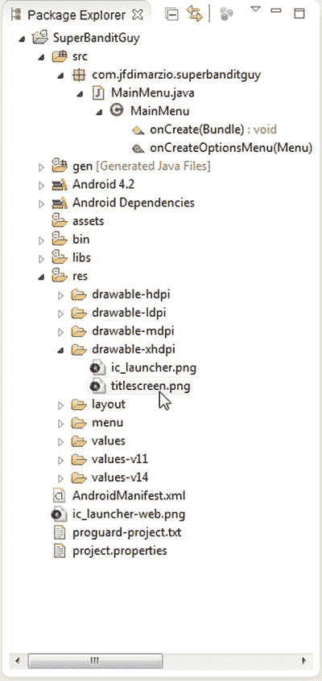
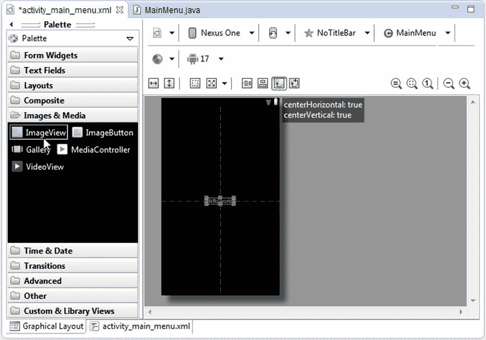
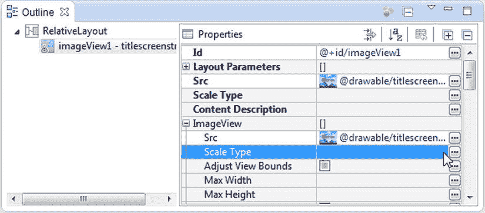
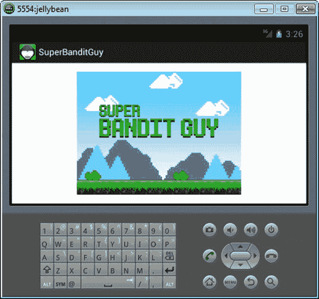
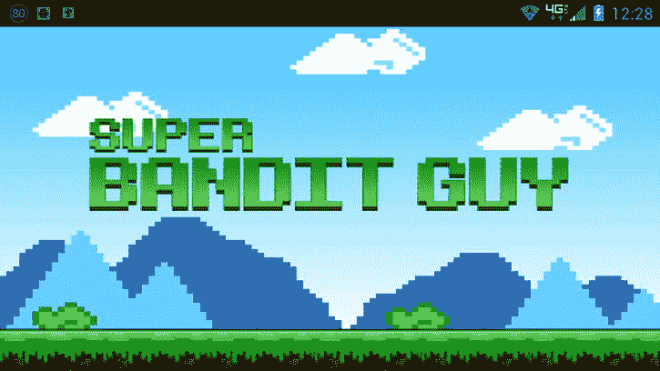

# 二、加载图像

不言而喻，如果你计划开发一个游戏，休闲或其他，你需要使用图像。从背景和字符到菜单和文本的一切都是由图像组成的。Android 可以使用不同的方法将这些图像显示在屏幕上。本章将帮助您解决在 Android 中检索、存储和提供图像时遇到的任何问题。

在 Android 中有两种截然不同的方式来提供图像，每种方式在游戏开发中都有自己的位置。在 Android 中提供图像的第一种方法是使用核心 Android 方法——或者那些不涉及直接使用 OpenGL ES 的方法。这些核心方法需要很少甚至不需要代码就可以使用，但是它们很慢，而且肯定不够灵活，不能用于游戏中主要的面向动作的部分。

在 Android 中提供图像的第二种方法是使用 OpenGL ES。OpenGL ES 快速、灵活，非常适合在游戏中使用；然而，它比核心的 Android 方法需要更多的代码。我们将在这一章中探讨这两个问题。

那么什么时候你会使用一种方法而不是另一种方法呢？

使用 Android 核心方法加载的图像非常适合闪屏、标题屏甚至菜单。给定 Android 活动的架构，使用核心 Android 方法创建包含游戏菜单系统的活动是非常容易的。菜单可以包括在启动游戏线程之前更容易完成的项目，如检查分数、访问在线商店或查看预装的关卡信息。然后，当玩家选择进入游戏时，该菜单可用于启动主游戏线程。一旦进入主游戏线程，OpenGL ES 就可以接管处理更多图形密集型游戏的任务。本章中的解决方案将帮助您解决在 OpenGL ES 中加载图像和使用 Android 核心方法时遇到的许多常见问题。

2.1 使用核心 Android 方法加载图像

问题

在游戏中，有时你可能不需要使用 OpenGL ES 来显示图像；例如，标题和菜单屏幕。然而，在你决定使用 Android 核心方法或 OpenGL ES 之后，你如何在你的项目中存储图像以便 Android 可以访问它们呢？

解决办法

在 Android 中使用之前，图像文件存储在`res`文件夹中。`res`文件夹——或资源文件夹——是存储您的 Android 项目的所有资源的地方。名为`drawable*`的`res`文件夹下有一组子目录。你所有的图片都应该放在一个`drawable`文件夹里。然后使用 Android ImageView 节点将这些图像显示到屏幕上。这是一个完美的解决方案，适用于游戏启动画面或游戏中任何在游戏开始前显示图像的部分。

它是如何工作的

这个解决方案的一个好处是，它可以在没有任何手工编码的情况下完成。一些拖放动作将立即为您设置好这个解决方案。由于这个解决方案有两个部分(存储和显示图像)，让我们分别看一下每个部分。

在 Android 中存储图像

问题的第一部分是你在 Android 中存储图片的位置。您在 Android 项目中使用的所有资源文件都保存在名为`res`的项目目录中。如果您打开您的项目，并在项目浏览器下展开文件系统，您将看到一个名为`res`的根级文件夹；这是存储所有应用内资源的地方，比如字符串和图像。

**注意**如果你使用的是 Eclipse (本书写作时的最新版本是 Juno)，那么你会在包浏览器中看到`res`文件夹。但是，如果您使用的是不同的 IDE，或者根本没有 IDE，那么请找到文件浏览等效项以查看`res`文件夹。

如果您使用的是 IDE，打开`res`文件夹，您应该会找到一些子文件夹。其中一些子文件夹应该以单词`drawable-`开头。你的应用中所有用于存储图片的子文件夹都将以这个单词开头。你还会注意到每个文件夹名称的末尾有一个符号，从`-ldpi`到`-xhdpi`。这是什么意思？

Android 支持许多不同的屏幕尺寸和像素密度。因为你可能想为不同的屏幕尺寸或像素密度提供不同分辨率的图像，Android 为这些图像提供了不同的子文件夹。文件夹名称中的符号表示从小(`drawable-small`)到超大(`drawable-xlarge`)的屏幕尺寸，表示从低密度(`drawable-ldpi`)到超高密度(`drawable-xhdpi`)的像素密度。

**提示**如果你不在乎用来显示图像的屏幕的像素密度，那么你可以把你所有的文件放在默认的`drawable`文件夹中。如果默认情况下您的 IDE 没有创建这个文件夹，您可以随意添加它。当你没有指定要使用的像素密度时，Android 会在这里查看。

我们将在这个例子中使用的图像是我们的虚拟游戏超级强盗的启动画面，如图 2-1 所示。


图 2-1 。超级土匪家伙闪屏图像

只需将这张图片从你的工作文件夹中拖放到正确的`drawable` dpi 文件夹，如图图 2-2 所示。在这种情况下，我使用了`drawable-xhdpi`在平板电脑上进行测试。



图 2-2 。将图像拖动到 res/drawable-xhdpi 文件夹中

这就是将图像导入 Android 的全部内容。

**注意**Android 中使用的所有图像文件名必须以小写字母开头。

加载和显示图像

图像现在可以使用了。为了在屏幕上显示这个图像，您需要创建一个 ImageView 。

**注意**同样，如果您使用的是 Eclipse，那么应该已经为您创建了一个通用布局。如果您没有使用 Eclipse，请按照 IDE 的说明创建一个*主屏幕布局*。

展开布局根文件夹，打开`activity_main_menu.xml`文件。打开布局，展开图像&媒体调色板，定位 ImageView，如图图 2-3 所示。



图 2-3 。定位的 ImageView

现在，将图像从调色板拖到工作区的布局中。在工作区的顶部(再次参考图 2-3 ，您会看到一排菜单图标。选择状态菜单图标将允许您将屏幕布局的方向从纵向更改为横向。我见过在任何方向玩的游戏；然而，对于这个例子，超级强盗家伙是在风景中玩的。因此，在未来的屏幕截图中，方向的变化将是显而易见的。将 ImageView 添加到布局中后，展开 ImageView 属性并选择 Src 属性。点击 Src 属性旁边的省略号将显示可提取资源的列表。

选择正确的图像，如图 2-4 所示。



图 2-4 。使用 ImageView 属性选择正确的图像

编译并运行您的项目。结果应如图 2-5 所示。



图 2-5 。显示启动画面

在这件事结束之前，有一件事你可能想处理一下。注意在图 2-5 中，图像上方有一个动作栏菜单。这是在一些 ide 中默认添加的(在 Android 3.0 和更高版本中)，具体取决于创建项目时选择的 Android 主题。去掉这个动作栏很容易。

返回到项目浏览器，在`res`文件夹中，您应该能够找到名为`values`的文件夹。这个文件夹里有一个名为`styles.xml`的文件。将下面一行添加到`styles.xml`文件中，在您的应用正在使用的样式的样式标签之间。

```java
<item name="android:windowActionBar">false</item>
```

2.2 使用 OpenGL ES 加载图像

在这个食谱中，我提出了两个问题和两个解决方案。你首先要纠正 ImageView 的图像调用 才能在游戏中正常运行。然后，您将看到如何确保 OpenGL ES 在使用 Android 设备时显示正确的图像。

问题 1

ImageView 图像调用 在游戏中使用太慢。

解决方案 1

使用 OpenGL ES 将您的图像写入屏幕。您必须创建一个 OpenGL ES 渲染器、一个`GLSurfaceView`，以及一组顶点和纹理。尽管这种解决方案听起来工作量很大，但是您只需要将大部分工作做一次，然后就可以在整个项目中重用相同的类。

也就是说，渲染器和`GLSurfaceView`只需要为你的游戏创建一次。它们被一遍又一遍地重复使用。解决方案中唯一需要为每个要显示的图像重新创建的部分是定义图像的顶点和纹理。

它是如何工作的

我们将把这个解决方案分成三个部分:创建顶点和纹理，创建渲染器，最后创建`GLSurfaceView`。让我们从创建顶点和纹理开始。

创建顶点和纹理

这是过程中最复杂的部分，也是需要最多代码的部分。但如果慢慢来，应该没问题。此外，鉴于创建顶点和纹理是以某种形式在整个游戏中重复的一部分，您将获得大量代码练习。你用得越多，就会越容易。

就 OpenGL ES 而言，所有的图像都是纹理。纹理应该映射到形状上。您将创建一个原始的正方形来映射您的图像(或纹理)并通过渲染器和`GLSurfaceView`将其显示到屏幕上。

为此，您需要创建一个新的类`SBGSplash`，这涉及到以下步骤，稍后将对所有这些步骤进行描述:

1.  创建一些缓冲区。
2.  创建构造函数。
3.  创建`loadTexture()`方法。
4.  创造`draw()`方法 。

`SBGSplash`类的构造函数将设置你需要与 OpenGL ES 交互的所有变量(见清单 2-1 )。您需要一个数组来保存纹理的映射坐标，一个数组来保存顶点的坐标，一个数组来保存顶点的索引。最后，创建一个引用纹理的资源标识符数组。

***清单 2-1*** 。`SBGSplash` (OpenGL 是 1)

```java
public class SBGSplash {
private int[] textures = new int[1];

private float[]vertices = {
0f, 1f, 0f,
0f, 0f, 0f,
1f, 0f, 0f,
1f, 1f, 0f,
};
private float[] texture = {
1f, 0f,
1f, 1f,
0f, 1f,
0f, 0f,
};
private byte[] indices = {
0,1,2,
0,2,3,
};
public SBGSplash() {
//empty constructor
}
}
```

数组保存了你正在加载的每一个纹理的标识符。您将它硬编码为 1，因为您将只加载一个图像，但是我们将它留得足够灵活，以便您在将来重用，而无需太多的重写。

`vertices`数组列出了一系列的点。这里的每一行代表一个正方形的一个角的 x、y 和 z 值。这个正方形是图像将被纹理化以显示的原始形状。在这种情况下，您正在制作一个屏幕大小的正方形，确保图像覆盖整个屏幕。

`texture`数组表示图像(或纹理)的角与你创建的正方形的角对齐的位置。同样，在这种情况下，你希望纹理覆盖整个正方形，从而覆盖整个背景。

最后，`indices`数组保存了正方形表面的定义。正方形的面被分成两个三角形。该数组中的值是这些三角形按逆时针顺序排列的角。请注意，一条线(两点)重叠(0 和 3)。

如果你使用的是 OpenGL ES 3，你需要在这里添加你的着色器代码，如清单 2-2 所示。

***清单 2-2*** 。`SBGSplash` (OpenGL 是 2/3)

```java
public class SBGSplash {
private final String vertexShaderCode =
"uniform mat4 uMVPMatrix;" +
"attribute vec4 vPosition;" +
"attribute vec2 TexCoordIn;" +
"varying vec2 TexCoordOut;" +
"void main() {" +
"  gl_Position = uMVPMatrix * vPosition;" +
"  TexCoordOut = TexCoordIn;" +
"}";
private final String fragmentShaderCode =
"precision mediump float;" +
"uniform vec4 vColor;" +
"uniform sampler2D TexCoordIn;" +
"uniform float scroll;" +
"varying vec2 TexCoordOut;" +
"void main() {" +
" gl_FragColor = texture2D(TexCoordIn, vec2(TexCoordOut.x + scroll,TexCoordOut.y));"+
"}";
private int[] textures = new int[1];

private float[]vertices = {
0f, 1f, 0f,
0f, 0f, 0f,
1f, 0f, 0f,
1f, 1f, 0f,
};
private float[] texture = {
1f, 0f,
1f, 1f,
0f, 1f,
0f, 0f,
};
private byte[] indices = {
0,1,2,
0,2,3,
};
public SBGSplash() {
//empty constructor
}
}
```

是时候创建类构造函数中也使用的缓冲区了。因为缓冲区和前面代码清单中的变量一样，在类的多个方法中使用，所以我们将在类的主体中设置它们。

创建缓冲区

现在，创建一些我们可以用来保存这些数组的缓冲区(见清单 2-3 )。这些缓冲区将被加载到 OpenGL ES 1 中。

***清单 2-3*** 。缓冲区(OpenGL ES 1)

```java
importjava.nio.ByteBuffer;
importjava.nio.FloatBuffer;

public class SBGSplash {

private FloatBuffervertexBuffer;
private FloatBuffertextureBuffer;
private ByteBufferindexBuffer;

private int[] textures = new int[1];

private float[]vertices = {
0f, 1f, 0f,
0f, 0f, 0f,
1f, 0f, 0f,
1f, 1f, 0f,
};
private float[] texture = {
1f, 0f,
1f, 1f,
0f, 1f,
0f, 0f,
};
private byte[] indices = {
0,1,2,
0,2,3,
};
public SBGSplash() {
}
}
```

OpenGL ES 2 和 3 需要一些额外的缓冲变量，如清单 2-4 所示。

***清单 2-4*** 。缓冲区和变量(OpenGL ES 2/3)

```java
public class SBGSplash {
private final FloatBuffer vertexBuffer;
private final ShortBuffer indexBuffer;
private final FloatBuffer textureBuffer;
private final int mProgram;
private int mPositionHandle;
private int mMVPMatrixHandle;

static final int COORDS_PER_VERTEX = 3;
static final int COORDS_PER_TEXTURE = 2;
private final int vertexStride = COORDS_PER_VERTEX * 4;
public static int textureStride = COORDS_PER_TEXTURE * 4;
private final String vertexShaderCode =
"uniform mat4 uMVPMatrix;" +
"attribute vec4 vPosition;" +
"attribute vec2 TexCoordIn;" +
"varying vec2 TexCoordOut;" +
"void main() {" +
"  gl_Position = uMVPMatrix * vPosition;" +
"  TexCoordOut = TexCoordIn;" +
"}";
private final String fragmentShaderCode =
"precision mediump float;" +
"uniform vec4 vColor;" +
"uniform sampler2D TexCoordIn;" +
"uniform float scroll;" +
"varying vec2 TexCoordOut;" +
"void main() {" +
" gl_FragColor = texture2D(TexCoordIn, vec2(TexCoordOut.x + scroll,TexCoordOut.y));"+
"}";
private int[] textures = new int[1];

private float[]vertices = {
0f, 1f, 0f,
0f, 0f, 0f,
1f, 0f, 0f,
1f, 1f, 0f,
};
private float[] texture = {
1f, 0f,
1f, 1f,
0f, 1f,
0f, 0f,
};
private byte[] indices = {
0,1,2,
 0,2,3,
};
public SBGSplash() {
//empty constructor
}
}
```

缓冲区填充在类的构造函数中。现在，构造函数是空的。下一节描述完成构造函数需要什么代码。

创建构造函数

现在在`SBGSplash`构造函数中用适当的数组填充适当的缓冲区，如清单 2-5 和清单 2-6 所示。

***清单 2-5*** 。构造函数(OpenGL ES 1)

```java
import java.nio.ByteOrder;
import java.nio.ByteBuffer;
import java.nio.FloatBuffer;

public class SBGSplash {

...

public SBGSplash() {

ByteBufferbyteBuf = ByteBuffer.allocateDirect(vertices.length * 4);
byteBuf.order(ByteOrder.nativeOrder());
vertexBuffer = byteBuf.asFloatBuffer();
vertexBuffer.put(vertices);
vertexBuffer.position(0);

byteBuf = ByteBuffer.allocateDirect(texture.length * 4);
byteBuf.order(ByteOrder.nativeOrder());
textureBuffer = byteBuf.asFloatBuffer();
textureBuffer.put(texture);
textureBuffer.position(0);

indexBuffer = ByteBuffer.allocateDirect(indices.length);
indexBuffer.order(ByteOrder.nativeOrder());
indexBuffer.put(indices);
indexBuffer.position(0);
}
}
```

***清单 2-6*** 。构造器(OpenGL ES 2/3)

```java
public class SBGSplash {

...

public SBGSplash() {

ByteBuffer byteBuf = ByteBuffer.allocateDirect(vertices.length * 4);
byteBuf.order(ByteOrder.nativeOrder());
vertexBuffer = byteBuf.asFloatBuffer();
vertexBuffer.put(vertices);
vertexBuffer.position(0);

byteBuf = ByteBuffer.allocateDirect(texture.length * 4);
byteBuf.order(ByteOrder.nativeOrder());
textureBuffer = byteBuf.asFloatBuffer();
textureBuffer.put(texture);
textureBuffer.position(0);

indexBuffer = ByteBuffer.allocateDirect(indices.length);
indexBuffer.order(ByteOrder.nativeOrder());
indexBuffer.put(indices);
indexBuffer.position(0);

int vertexShader = GLES20.glCreateShader(GLES20.GL_VERTEX_SHADER);
GLES20.glShaderSource(vertexShader, vertexShaderCode);
GLES20.glCompileShader(vertexShader);

int fragmentShader = GLES20.glCreateShader(GLES20.GL_FRAGMENT_SHADER);
GLES20.glShaderSource(fragmentShader, fragmentShaderCode);
GLES20.glCompileShader(fragmentShader);

mProgram = GLES20.glCreateProgram();
GLES20.glAttachShader(mProgram, vertexShader);
GLES20.glAttachShader(mProgram, fragmentShader);
GLES20.glLinkProgram(mProgram);
}
}
```

这里的代码应该是不言自明的。你正在用顶点和纹理数组的值创建一个`ByteBuffer` 。请注意，每个数组中的值的数量都乘以 4，以在`ByteBuffer`中分配空间。这是因为数组中的值是浮点数，而浮点数的大小是字节的 4 倍。索引数组是整数，可以直接加载到`indexBuffer` 中。

OpenGL ES 1 代码和 OpenGL ES 2/3 代码之间的唯一区别是 OpenGL ES 2/3 要求着色器附加到程序上。三行代码编译每个着色器并将其附加到程序中。

创建`loadTexture()`方法

接下来，您需要创建`loadTexture()`方法(参见清单 2-7 和清单 2-8 )。`loadTexture()`方法将接收一个图像标识符，然后将图像加载到流中。该流将作为纹理加载到 OpenGL ES 中。在绘制过程中，你将把这个纹理映射到顶点上。

***清单 2-7*** 。`loadTexture()` (OpenGL 是 1)

```java
public class SBGSplash {

...

public SBGSplash() {
...

}

public void loadTexture(GL10 gl,int texture, Context context) {
InputStreamimagestream = context.getResources().openRawResource(texture);
      Bitmap bitmap = null;
android.graphics.Matrix flip = new android.graphics.Matrix();
flip.postScale(-1f, -1f);
try {

bitmap = BitmapFactory.decodeStream(imagestream);

}catch(Exception e){
//handle your exception here
}finally {
//Always clear and close
try {
imagestream.close();
imagestream = null;
} catch (IOException e) {
}
}

gl.glGenTextures(1, textures, 0);
gl.glBindTexture(GL10.GL_TEXTURE_2D, textures[0]);

gl.glTexParameterf(GL10.GL_TEXTURE_2D, GL10.GL_TEXTURE_MIN_FILTER, GL10.GL_NEAREST);
gl.glTexParameterf(GL10.GL_TEXTURE_2D, GL10.GL_TEXTURE_MAG_FILTER, GL10.GL_LINEAR);

GLUtils.texImage2D(GL10.GL_TEXTURE_2D, 0, bitmap, 0);

bitmap.recycle();
   }

}
```

***清单 2-8*** 。`loadTexture()` (OpenGL 是 2/3)

```java
public class SBGSplash {

...

public SBGSplash() {
...

}

public void loadTexture(int texture, Context context) {
InputStream imagestream = context.getResources().openRawResource(texture);
Bitmap bitmap = null;

android.graphics.Matrix flip = new android.graphics.Matrix();
flip.postScale(-1f, -1f);

try {

bitmap = BitmapFactory.decodeStream(imagestream);
imagestream.close();
imagestream = null;

}catch(Exception e){

//handle your exception here

}

GLES20.glGenTextures(1, textures, 0);
GLES20.glBindTexture(GLES20.GL_TEXTURE_2D, textures[0]);

GLES20.glTexParameterf(GLES20.GL_TEXTURE_2D, GLES20.GL_TEXTURE_MIN_FILTER, GLES20.GL_NEAREST);
GLES20.glTexParameterf(GLES20.GL_TEXTURE_2D, GLES20.GL_TEXTURE_MAG_FILTER, GLES20.GL_LINEAR);

GLES20.glTexParameterf(GLES20.GL_TEXTURE_2D, GLES20.GL_TEXTURE_WRAP_S, GLES20.GL_REPEAT);
GLES20.glTexParameterf(GLES20.GL_TEXTURE_2D, GLES20.GL_TEXTURE_WRAP_T, GLES20.GL_REPEAT);

GLUtils.texImage2D(GLES20.GL_TEXTURE_2D, 0, bitmap, 0);

bitmap.recycle();

   }

}
```

`loadTexture()`的第一部分相当简单。它接收标识符并将结果图像加载到位图流中。传递到`openRawResource()`中的`texture`是您的`res`文件夹中一个图像的资源 ID。您将在稍后的解答中通过该测试。然后关闭该流。此外，由于 OpenGL ES 以先入后出的字节顺序显示图像，因此默认情况下图像会上下颠倒。因此，您使用一个`Matrix`通过调用`postScale()`来翻转图像。

然而`loadTexture()`的第二部分在 OpenGL ES 中相当沉重。第一行生成一个纹理指针。这个指针的结构就像一本字典。

```java
gl.glGenTextures(1, textures, 0);
...
GLES20.glGenTextures(1, textures, 0);
```

第一个参数是需要生成的纹理名称的数量。当需要将纹理绑定到一组顶点时，您将通过名称从 OpenGL ES 中调用它们。在这里，你只是加载一个纹理；因此，您只需要生成一个纹理名称。第二个参数是您创建的用于保存每个纹理的数字的数组`int`。同样，现在这个数组中只有一个值。最后，最后一个参数保存指针在数组中的偏移量。因为您的数组是从 0 开始的，所以偏移量为 0。

第二行将纹理绑定到 OpenGL ES 中。

```java
gl.glBindTexture(GL10.GL_TEXTURE_2D, textures[0]);
...
GLES20.glBindTexture(GLES20.GL_TEXTURE_2D, textures[0]);
```

如果你有两个要一起加载的纹理，那么前两行各有两行——一行加载第一个图像，一行加载第二个图像。

接下来的两行处理 OpenGL 如何将纹理映射到顶点上。您希望映射快速进行，但产生清晰的像素。

```java
gl.glTexParameterf(GL10.GL_TEXTURE_2D, GL10.GL_TEXTURE_MIN_FILTER, GL10.GL_NEAREST);
gl.glTexParameterf(GL10.GL_TEXTURE_2D, GL10.GL_TEXTURE_MAG_FILTER, GL10.GL_LINEAR);
...
GLES20.glTexParameterf(GLES20.GL_TEXTURE_2D, GLES20.GL_TEXTURE_MIN_FILTER, GLES20.GL_NEAREST);
GLES20.glTexParameterf(GLES20.GL_TEXTURE_2D, GLES20.GL_TEXTURE_MAG_FILTER, GLES20.GL_LINEAR);
```

最后，在`loadTexture()`方法 的最后两行，您将创建的位图输入流与 1 号纹理相关联。然后位图流被回收。

```java
GLUtils.texImage2D(GL10.GL_TEXTURE_2D, 0, bitmap, 0);

bitmap.recycle();
...
GLUtils.texImage2D(GLES20.GL_TEXTURE_2D, 0, bitmap, 0);
bitmap.recycle();
```

创建`draw()`方法

您需要编写的完成 SBGSplash 类的最后一段代码是将纹理绘制到顶点上的方法(清单 2-9 和 2-10 )。

***清单 2-9*** 。`draw()` (OpenGL 是 1)

```java
...
public class SBGSplash {
...
public void draw(GL10 gl) {

gl.glBindTexture(GL10.GL_TEXTURE_2D, textures[0]);

gl.glFrontFace(GL10.GL_CCW);
gl.glEnable(GL10.GL_CULL_FACE);
gl.glCullFace(GL10.GL_BACK);

gl.glEnableClientState(GL10.GL_VERTEX_ARRAY);
gl.glEnableClientState(GL10.GL_TEXTURE_COORD_ARRAY);

gl.glVertexPointer(3, GL10.GL_FLOAT, 0, vertexBuffer);
gl.glTexCoordPointer(2, GL10.GL_FLOAT, 0, textureBuffer);

gl.glDrawElements(GL10.GL_TRIANGLES, indices.length, GL10.GL_UNSIGNED_BYTE, indexBuffer);

gl.glDisableClientState(GL10.GL_VERTEX_ARRAY);
gl.glDisableClientState(GL10.GL_TEXTURE_COORD_ARRAY);
gl.glDisable(GL10.GL_CULL_FACE);

}

public SBGSplash() {
...

}
public void loadTexture(GL10 gl,int texture, Context context) {
...
   }

}
```

***清单 2-10*** 。`draw()` (OpenGL 是 2/3)

```java
public class SBGSplash {
...
public void draw(GL10 gl) {
GLES20.glUseProgram(mProgram);

mPositionHandle = GLES20.glGetAttribLocation(mProgram, "vPosition");

GLES20.glEnableVertexAttribArray(mPositionHandle);

int vsTextureCoord = GLES20.glGetAttribLocation(mProgram, "TexCoordIn");

GLES20.glVertexAttribPointer(mPositionHandle, COORDS_PER_VERTEX,
GLES20.GL_FLOAT, false,
vertexStride, vertexBuffer);
GLES20.glVertexAttribPointer(vsTextureCoord, COORDS_PER_TEXTURE,
GLES20.GL_FLOAT, false,
textureStride, textureBuffer);
GLES20.glEnableVertexAttribArray(vsTextureCoord);
GLES20.glActiveTexture(GLES20.GL_TEXTURE0);
GLES20.glBindTexture(GLES20.GL_TEXTURE_2D, textures[0]);
int fsTexture = GLES20.glGetUniformLocation(mProgram, "TexCoordOut");
GLES20.glUniform1i(fsTexture, 0);

mMVPMatrixHandle = GLES20.glGetUniformLocation(mProgram, "uMVPMatrix");

GLES20.glUniformMatrix4fv(mMVPMatrixHandle, 1, false, mvpMatrix, 0);

GLES20.glDrawElements(GLES20.GL_TRIANGLES, drawOrder.length,
GLES20.GL_UNSIGNED_SHORT, drawListBuffer);

GLES20.glDisableVertexAttribArray(mPositionHandle);

}

public SBGSplash() {
...

}
public void loadTexture(GL10 gl,int texture, Context context) {
...
   }

}
```

每次你想在屏幕上绘制这个图像的时候，都会调用`draw()`方法，而`loadTexture()`方法只会在你初始化游戏的时候被调用。

这个方法的第一行将纹理绑定到你的目标。纹理被加载并准备使用。

```java
gl.glBindTexture(GL10.GL_TEXTURE_2D, textures[0]);
```

`draw()`方法中接下来的三行告诉 OpenGL ES 启用剔除，基本上不处理任何不在正面的顶点。因为您是在 2D 正交视图中渲染游戏，所以您不希望 OpenGL ES 花费宝贵的处理器时间来处理玩家永远看不到的顶点。现在，你所有的顶点都是面向前方的，但是这是一个很好的代码。

```java
gl.glFrontFace(GL10.GL_CCW);
gl.glEnable(GL10.GL_CULL_FACE);
gl.glCullFace(GL10.GL_BACK);
```

接下来的四行启用顶点和纹理状态，然后顶点和纹理缓冲区被加载到 OpenGL ES 中。

```java
gl.glEnableClientState(GL10.GL_VERTEX_ARRAY);
gl.glEnableClientState(GL10.GL_TEXTURE_COORD_ARRAY);
gl.glVertexPointer(3, GL10.GL_FLOAT, 0, vertexBuffer);
gl.glTexCoordPointer(2, GL10.GL_FLOAT, 0, textureBuffer);
```

最后，纹理被绘制到顶点上，所有启用的状态都被禁用。

```java
gl.glDrawElements(GL10.GL_TRIANGLES, indices.length, GL10.GL_UNSIGNED_BYTE, indexBuffer);
gl.glDisableClientState(GL10.GL_VERTEX_ARRAY);
gl.glDisableClientState(GL10.GL_TEXTURE_COORD_ARRAY);
gl.glDisable(GL10.GL_CULL_FACE);
```

`SBGSplash`课现在结束了。您所需要做的就是创建支持类来帮助在屏幕上显示`SBGSplash`。这是通过渲染完成的。

创建渲染器

创建一个新类，`SBGGameRenderer`。

```java
public class SBGGameRenderer{

}
```

现在你需要实现`GLSurfaceView`的`Renderer`。

```java
importandroid.opengl.GLSurfaceView.Renderer;

public class SBGGameRenderer implements Renderer{

}
```

确保添加未实现的方法。

***清单 2-11*** 。`SBGGameRenderer()`

```java
importjavax.microedition.khronos.egl.EGLConfig;
import javax.microedition.khronos.opengles.GL10;

importandroid.opengl.GLSurfaceView.Renderer;

public class SBGGameRenderer implements Renderer{

@Override
public void onDrawFrame(GL10 gl) {
//TODO Auto-generated method stub

}

@Override
public void onSurfaceChanged(GL10 gl, int width, int height) {

}

@Override
public void onSurfaceCreated(GL10 gl, EGLConfigconfig) {

}
}
```

这些方法的功能应该是不言自明的。当创建`GLSurface`时，调用`onSurfaceCreated()`方法。当视图的大小改变时(包括初始加载)，调用`onSurfaceChanged()`方法。最后，当`Renderer`在屏幕上绘制一帧时，调用`onDrawFrame()`方法。

让我们按照它们被调用的顺序开始编码。首先是`onSurfaceCreated()`方法。

`onSurfaceCreated()`法

在`onSurfaceCreated()`方法中，你将初始化你的 OpenGL ES 并加载你的纹理，如清单 2-12 所示。

***清单 2-12*** 。`onSurfaceCreated()`

```java
public class SBGGameRenderer implements Renderer{

private SBGSplashsplashImage = new SBGSplash();

@Override
public void onDrawFrame(GL10 gl) {
}
@Override
public void onSurfaceChanged(GL10 gl, int width, int height) {
}

@Override
public void onSurfaceCreated(GL10 gl, EGLConfigconfig) {
gl.glEnable(GL10.GL_TEXTURE_2D);
}
}
```

注意，`onSurfaceCreated()`方法将 OpenGL ES ( `GL10 gl`)的一个实例作为参数。当调用`Renderer`时，这将由`GLSurfaceView`传递到方法中。只有在使用 OpenGL ES 1 时才使用它；否则，它将被忽略。您不必担心为此流程创建 GL10 的实例；它会自动为您完成。

接下来，你想告诉 OpenGL ES 测试你的表面中所有物体的深度。这需要一些解释。即使你正在创建一个 2D 游戏，你也需要用 3D 的角度来思考。

想象一下，OpenGL ES 环境是一个舞台。你想在游戏中画的一切都是这个舞台上的演员。现在，想象你正在拍摄演员在舞台上走动的场景。最终的电影是舞台上发生的事情的 2D 再现。如果一个演员在另一个演员前面移动，后面的演员在影片上就看不到了。然而，如果你在电影院看这些演员的现场表演，取决于你坐在哪里，你仍然可以看到后面的演员。

这与 OpenGL ES 在幕后的工作原理是一样的。即使你正在制作一个 2D 游戏，OpenGL ES 也会把所有东西都当作 3D 空间中的 3D 物体来对待。事实上，在 2D 开发和在 OpenGL ES 中进行 3D 开发的唯一区别是你如何告诉 OpenGL ES 渲染最终的场景。因此，你需要注意你的对象在 3D 空间中的位置，以确保它们像 2D 游戏一样正确渲染。通过接下来启用 OpenGL ES 深度测试(见清单 2-13 ，你给了 OpenGL ES 一种测试你的纹理并决定它们应该如何渲染的方法。

***清单 2-13*** 。深度测试

```java
public class SBGBameRenderer implements Renderer{

private SBGSplashsplashImage = new SBGSplash();

@Override
public void onDrawFrame(GL10 gl) {
}
@Override
public void onSurfaceChanged(GL10 gl, int width, int height) {
}

@Override
public void onSurfaceCreated(GL10 gl, EGLConfigconfig) {
gl.glEnable(GL10.GL_TEXTURE_2D);
gl.glClearDepthf(1.0f);
gl.glEnable(GL10.GL_DEPTH_TEST);
gl.glDepthFunc(GL10.GL_LEQUAL);

}
}
```

您将添加到该方法的最后两行代码与混合有关。清单 2-14 中的两行粗体代码将设置 OpenGL 的混合特性来创建透明度。

***清单 2-14*** 。混合

```java
import javax.microedition.khronos.egl.EGLConfig;
import javax.microedition.khronos.opengles.GL10;
import android.opengl.GLSurfaceView.Renderer;

public class SBGGameRenderer implements Renderer{

private SBGSplashsplashImage = new SBGSplash();

@Override
public void onDrawFrame(GL10 gl) {
}
@Override
public void onSurfaceChanged(GL10 gl, int width, int height) {
}

@Override
public void onSurfaceCreated(GL10 gl, EGLConfigconfig) {
gl.glEnable(GL10.GL_TEXTURE_2D);
gl.glClearDepthf(1.0f);
gl.glEnable(GL10.GL_DEPTH_TEST);
gl.glDepthFunc(GL10.GL_LEQUAL);

gl.glEnable(GL10.GL_BLEND);
gl.glBlendFunc(GL10.GL_ONE, GL10.GL_ONE);
}
}
```

在`onSurfaceCreated()`方法中你应该做的下一件事是加载你的纹理。在`onSurfaceChanged()`方法中调用`SGBSplash`的`loadTexture()`。向`loadTexture()`方法传递想要加载的图像的资源标识符。在清单 2-15 中，我使用了`res/drawable`文件夹中名为`titlescreen`的图像。

***清单 2-15*** 。onSurfaceCreated

```java
public class SBGGameRenderer implements Renderer{
private SBGSplashsplashImage = new SBGSplash();

@Override
public void onDrawFrame(GL10 gl) {
}
@Override
public void onSurfaceChanged(GL10 gl, int width, int height) {
}

@Override
public void onSurfaceCreated(GL10 gl, EGLConfigconfig) {
gl.glEnable(GL10.GL_TEXTURE_2D);
gl.glClearDepthf(1.0f);
gl.glEnable(GL10.GL_DEPTH_TEST);
gl.glDepthFunc(GL10.GL_LEQUAL);

gl.glEnable(GL10.GL_BLEND);
gl.glBlendFunc(GL10.GL_ONE, GL10.GL_ONE);

splashImage.loadTexture(gl, R.drawable.titlescreen, context);
}
}
```

注意，`loadTexture()`方法采用了一个上下文参数。让我们修改`SBGGameRenderer`的构造函数，以允许传递应用的上下文(参见清单 2-16 )。当渲染器启动时，可以将上下文传递到构造函数中，并在整个过程中使用。

***清单 2-16*** 。修改的构造函数

```java
public class SBGGameRenderer implements Renderer{

private SBGSplashsplashImage = new SBGSplash();

private Context context;

public SBGGameRenderer(Context appContext){
context = appContext;
}

@Override
public void onDrawFrame(GL10 gl) {
}
@Override
public void onSurfaceChanged(GL10 gl, int width, int height) {
}

@Override
public void onSurfaceCreated(GL10 gl, EGLConfigconfig) {
gl.glEnable(GL10.GL_TEXTURE_2D);
gl.glClearDepthf(1.0f);
gl.glEnable(GL10.GL_DEPTH_TEST);
gl.glDepthFunc(GL10.GL_LEQUAL);

gl.glEnable(GL10.GL_BLEND);
gl.glBlendFunc(GL10.GL_ONE, GL10.GL_ONE);

splashImage.loadTexture(gl, R.drawable.titlescreen, context);
}
}
```

使用 OpenGL ES 2/3 的`onSurfaceCreated()`方法 在代码上稍微轻一点。

```java
@Override
public void onSurfaceCreated(GL10 unused, EGLConfig config) {

GLES20.glClearColor(0.0f, 0.0f, 0.0f, 1.0f);

}
```

在 OpenGL ES 2/3 中，背景颜色正在被清除。这实际上是一个可选步骤，因为无论如何，整个屏幕区域都应该充满游戏图形。

现在，让我们继续讨论`onSurfaceChanged()`方法。

`onSurfacedChanged()`法

`onSurfacedChanged()`方法将处理显示图像所需的所有设置。每次调整屏幕大小时，方向都会改变，并且在初次启动时，会调用此方法。

您需要设置`glViewport()`，然后调用渲染例程来完成`onSurfacedChanged()`方法。

`glViewport()`方法有四个参数。前两个参数是屏幕左下角的 x 和 y 坐标。通常，这些值将是`(0,0)`，因为屏幕的左下角将是 x 轴和 y 轴相交的地方；因此，它是每个的 0 坐标。`glViewport()`方法的下两个参数是视窗的宽度和高度。除非你希望你的游戏比设备的屏幕小，否则这些应该被设置为设备的宽度和高度。参见清单 2-17 。

***清单 2-17*** 。glViewport

```java
public class SBGGameRenderer implements Renderer{

private SBGSplashsplashImage = new SBGSplash();

private Context context;

public SBGGameRenderer(Context appContext){
context = appContext;
}

@Override
public void onDrawFrame(GL10 gl) {
}
@Override
public void onSurfaceChanged(GL10 gl, int width, int height) {

gl.glViewport(0, 0, width,height);
}

@Override
public void onSurfaceCreated(GL10 gl, EGLConfigconfig) {

...

}
}
```

调用方`GLSurfaceView`将向`onSurfacedChanged()`方法发送一个`width`和`height`参数。您可以简单地将`glViewport()`的宽度和高度设置为`GLSurfaceView`发送的相应的`width`和`height`。参见清单 2-18 。

***清单 2-18*** 。宽度和高度

```java
public class SBGGameRenderer implements Renderer{

private SBGSplashsplashImage = new SBGSplash();

private Context context;

public SBGGameRenderer(Context appContext){
context = appContext;
}

@Override
public void onDrawFrame(GL10 gl) {
}
@Override
public void onSurfaceChanged(GL10 unused, int width, int height) {
GLES20.glViewport(0, 0, width, height);
float ratio = (float) width / height;
Matrix.frustumM(mProjMatrix, 0, -ratio, ratio, -1, 1, 3, 7);
}
@Override
public void onSurfaceCreated(GL10 gl, EGLConfigconfig) {

...

}
}
```

**注意**`GLSurfaceView`发送的`width`和`height`将代表设备的宽度和高度减去屏幕顶部的通知栏。

如果`glViewport()`方法代表拍摄场景所用的镜头，那么`glOrthof()`方法就是图像处理器。设置好视口后，你现在要做的就是使用`glOrth0f()`渲染表面。

要访问`glOrthof()`，需要将 OpenGL ES 1 置于投影矩阵模式。OpenGL ES 1 有不同的矩阵模式，让你访问堆栈的不同部分。在本书中，你会接触到大部分，如果不是全部的话。这是你第一次合作。投影矩阵模式允许您访问场景的渲染方式。

要进入投影矩阵模式，需要将`glMatrixMode()`设置为`GL_PROJECTION`，如清单 2-19 所示。

***清单 2-19*** 。glMatrixMode

```java
public class SBGGameRenderer implements Renderer{

private SBGSplashsplashImage = new SBGSplash();

private Context context;

public SBGGameRenderer(Context appContext){
context = appContext;
}

@Override
public void onDrawFrame(GL10 gl) {
}
@Override
public void onSurfaceChanged(GL10 gl, int width, int height) {

gl.glViewport(0, 0, width, height);
gl.glMatrixMode(GL10.GL_PROJECTION);

}

@Override
public void onSurfaceCreated(GL10 gl, EGLConfigconfig) {

...

}
}
```

现在 OpenGL ES 处于投影矩阵模式，你需要加载当前身份(见清单 2-20 )。把身份想象成 OpenGL ES 1 的默认状态。

***清单 2-20*** 。加载身份

```java
public class SBGGameRenderer implements Renderer{

private SBGSplashsplashImage = new SBGSplash();

private Context context;

public SBGGameRenderer(Context appContext){
context = appContext;
}

@Override
public void onDrawFrame(GL10 gl) {
}
@Override
public void onSurfaceChanged(GL10 gl, int width, int height) {

gl.glViewport(0, 0, width, height);

gl.glMatrixMode(GL10.GL_PROJECTION);
gl.glLoadIdentity();

}

@Override
public void onSurfaceCreated(GL10 gl, EGLConfigconfig) {

...

}
}
```

既然身份已经加载，你可以设置`glOrthof()`(见清单 2-21 )。

***清单 2-21*** 。格洛霍夫

```java
public class SBGGameRenderer implements Renderer{

private SBGSplashsplashImage = new SBGSplash();

private Context context;

public SBGGameRenderer(Context appContext){
context = appContext;
}

@Override
public void onDrawFrame(GL10 gl) {
}
@Override

public void onSurfaceChanged(GL10 gl, int width, int height) {

gl.glViewport(0, 0, width,height);

gl.glMatrixMode(GL10.GL_PROJECTION);
gl.glLoadIdentity();
gl.glOrthof(0f, 1f, 0f, 1f, -1f, 1f);

}

@Override
public void onSurfaceCreated(GL10 gl, EGLConfigconfig) {

...

}
}
```

方法将为你的场景建立一个正交的二维渲染。这个调用有六个参数，每个参数定义一个裁剪平面。

剪裁平面向渲染器指示停止渲染的位置。换句话说，任何落在裁剪平面之外的图像都不会被`glOrthof()`拾取。六个剪裁平面是左、右、下、上、近和远。这些代表 x、y 和 z 轴上的点。

现在让我们设置`onDraw()`方法。

`onDrawFrame()`法

该方法将包含对您已经在该解决方案中使用的方法的调用，因此应该很容易理解。然而，它也将包含对`SBGSplash`类的`draw()`方法的调用。参见清单 2-22 。

***清单 2-22*** 。onDrawFrame

```java
public void onDrawFrame(GL10 unused) {
GLES20.glClear(GLES20.GL_COLOR_BUFFER_BIT);
Matrix.setLookAtM(mVMatrix, 0, 0, 0, -3, 0f, 0f, 0f, 0f, 1.0f, 0.0f);
Matrix.multiplyMM(mMVPMatrix, 0, mProjMatrix, 0, mVMatrix, 0);
}
```

这个解决方案的最后一步是设置`GLSurfaceView`并从主活动中调用它。

创建`GLSurfaceView`

创建一个名为`SBGGameView` 的新类，如清单 2-23 所示。

***清单 2-23*** 。`SBGGameView`阶级

```java
importandroid.content.Context;
importandroid.opengl.GLSurfaceView;

public class SBGGameView extends GLSurfaceView {

public SBGGameView(Context context) {
super(context);

setRenderer(new SBGGameRenderer(context));

}
}
```

注意，`GLSurfaceView`的惟一功能是将`Renderer`设置为您创建的`Renderer`的一个实例。现在您可以将`GLSurfaceView`设置为活动的主要内容视图，如清单 2-24 所示。

***清单 2-24*** 。设置`GLSurfaceView`

```java
import com.jfdimarzio.superbanditguy.SBGGameView;
import android.os.Bundle;
import android.app.Activity;

public class MainActivity extends Activity {

private SBGGameViewgameView;

@Override
protected void onCreate(Bundle savedInstanceState) {
super.onCreate(savedInstanceState);
gameView = new SBGGameView(this);
setContentView(gameView);
}
}
```

现在，您应该能够编译和运行您的活动了。图像应如图 2-6 所示。



图 2-6 。使用 OpenGL ES 显示的闪屏

现在，让我们确保使用仿真器显示的图像在设备中以相同的方式工作。

问题 2

OpenGL ES 仅在使用 Android 设备时显示白色图像，但在使用仿真器时工作正常。

解决方案 2

确保图像分辨率是 2 的幂。

它是如何工作的

这是一个相当普遍的问题，幸运的是，这个问题很容易解决。

为了避免这个*白盒，*你必须确保你的图像分辨率是 2 的导数。飞溅的图像(图 2-6 )为 512 x 512。但是我发现 128 x 128 和 64 x 64 也可以。

编辑您的图像并以正确的分辨率重新保存它们将会很快解决这个问题。

2.3 存储不同屏幕分辨率的图像

问题

在你的游戏中，不同的屏幕分辨率有不同的图像。

解决办法

使用`res`文件夹中的多个`drawable-`文件夹存储正确分辨率的图像。

它是如何工作的

Android 作为一个平台，可以支持无数不同的设备屏幕分辨率。如果您要创建不同的图像以在不同的设备屏幕上使用，您需要将这些图像存储在正确的位置。

根据目标设备的屏幕分辨率，表 2-1 提供了一些存储图像的指南。

表 2-1 。推荐的图像存储位置

| 

文件夹

 | 

解决

 |
| --- | --- |
| `res/drawable-ldpi` | 高达 120 dpi |
| `res/drawable-mdpi` | 从 120 到 160 dpi |
| `res/drawable-hdpi` | 从 160 到 240 dpi |
| `res/drawable-xhdpi` | 从 240 到 320 dpi |
| `res/drawable-xxhdi` | 超过 320 dpi |
| `res/drawable-nodpi` | 任何(非指定的)dpi |