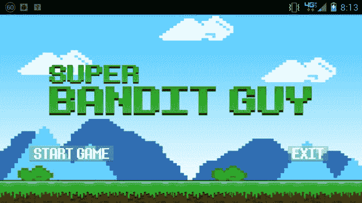

# 四、菜单屏幕

你可能已经制作了一个游戏，或者正在制作中，但是仍然需要一个合适的菜单屏幕来启动它。不要害怕。如果你在为你的游戏创建一个工作菜单屏幕时有问题，这一章应该可以帮助你。

在这一章中，你将找到创建一个双按钮菜单屏幕的解决方案，在所述菜单屏幕上连接按钮以开始和退出游戏，以及在你创建菜单时可能出现的更多问题。

第一个解决方案将为你的游戏提供一个合适的双按钮菜单屏幕。

4.1 创建一个双按钮菜单屏幕

问题

你的游戏需要一个菜单屏幕来向玩家展示选项。

解决办法

使用 Android 布局创建一个菜单，有两个按钮:一个开始游戏，一个退出游戏。

它是如何工作的

虽然你不需要使用完整的例子，但是这个解决方案可以很好地处理为解决第三章的问题而创建的闪屏。如果您确实想一起使用这些解决方案，请将第三章中的`creditscreen.xml` (这是从第一个闪屏淡入的布局)替换为将在该解决方案中创建的 `main_menu.xml`。

第一步是向项目中添加一些图像。图 4-1 中的第一幅图像是菜单屏幕的背景。在这种情况下，我们将使用与游戏启动画面相同的图像，但是您可以随意使用您想要的任何图像。


图 4-1 。菜单屏幕背景

现在你还需要两个图像，每个按钮一个。对于这个解决方案，您将创建一个启动游戏的按钮和一个退出游戏的按钮。图 4-2 和 4-3 分别代表开始按钮图像和退出按钮图像。


图 4-2 。开始按钮图像


图 4-3 。退出按钮图片

**注意**我在最终解决方案中使用的图像由透明背景上的白色文本组成。然而，为了使这些图像在本书中正确显示，背景被填充了灰色。

创建一个名为`main_menu.xml`的新 xml 布局。这个布局将使用`ImageButton`节点保存新的背景图像(在一个`ImageView`中)和两个按钮，如清单 4-1 所示。

***清单 4-1*** 。`main_menu.xml`

```java
<?xml version="1.0" encoding="utf-8"?>
<RelativeLayout xmlns:android="http://schemas.android.com/apk/res/android"
xmlns:tools="http://schemas.android.com/tools"
android:layout_width="match_parent"
android:layout_height="match_parent"
tools:context=".SBGMenuScreen" >

<ImageView
android:id="@+id/imageView1"
android:layout_width="match_parent"
android:layout_height="wrap_content"
android:layout_alignParentBottom="true"
android:layout_alignParentTop="true"
android:contentDescription="@string/splash_screen_description"
android:scaleType="fitXY"
android:src="@drawable/titlescreen" />

<RelativeLayout
android:id="@+id/buttons"
android:layout_width="match_parent"
android:layout_height="wrap_content"
android:layout_alignParentBottom="true"
android:layout_marginBottom="20dp"
android:orientation="horizontal" >
</RelativeLayout>

<ImageButton
android:id="@+id/btnExit"
android:layout_width="wrap_content"
android:layout_height="wrap_content"
android:layout_above="@+id/buttons"
android:layout_alignParentRight="true"
android:layout_marginBottom="50dp"
android:layout_marginRight="55dp"
android:clickable="true"
android:contentDescription="@string/start_description"
android:src="@drawable/exit" />

<ImageButton
android:id="@+id/btnStart"
android:layout_width="wrap_content"
android:layout_height="wrap_content"
android:layout_alignParentLeft="true"
android:layout_alignTop="@+id/btnExit"
android:layout_marginLeft="48dp"
android:clickable="true"
android:contentDescription="@string/exit_description"
android:src="@drawable/start" />

</RelativeLayout>
```

现在您已经有了菜单的布局，您需要一个`Activity`来显示它。在您的游戏项目中创建一个新的`Activity`；在这个例子中，它将被命名为`SBGMenuScreen`。`SBGMenuScreen Activity`应该使用`setContentView()` 来显示新的`main_menu`布局(参见清单 4-2 )。

***清单 4-2*** 。`SBGMenuScreen`布局

```java
public class SBGMenuScreen extends Activity{

@Override
   public void onCreate(Bundle savedInstanceState) {
      super.onCreate(savedInstanceState);
      setContentView(R.layout.main_menu);
   }}
```

你现在有了一个由`Activity`显示的主菜单，但是它在你的游戏项目中处于什么位置呢？

你有两个选择。第一种选择是将`SBGMenuScreen`设置为你游戏的入口点。第二种是使用闪屏淡入菜单。

如果你选择第一个选项，并将`SBGMenuScreen`设置为游戏的主要入口，那么这将是玩家看到的第一个屏幕。在许多情况下，这可能是一个非常有效的解决方案，这个例子就讲到这里了。然而，如果你遵循了第三章中的解决方案，并想继续使用闪屏，这个解决方案的其余部分将解释如何在你的闪屏中显示菜单。

从打开`MainActivity`第三章。这是启动初始屏幕的地方。更改在清单 4-3 中加粗的引用，指向您创建的新`SBGMenuScreenActivity`。

***清单 4-3*** 。启动菜单

```java
public class MainActivity extends Activity {

@Override
protected void onCreate(Bundle savedInstanceState) {
super.onCreate(savedInstanceState);
int GAME_THREAD_DELAY = 4000;
setContentView(R.layout.activity_main);
new Handler().postDelayed(new Thread() {
@Override
public void run() {
Intent mainMenu = new Intent(MainActivity.this, SBGMenuScreen.class);
MainActivity.this.startActivity(mainMenu);
   MainActivity.this.finish();
overridePendingTransition(R.layout.fadein,R.layout.fadeout);
}
}, GAME_THREAD_DELAY);
}

}
```

无论您如何完成您的解决方案，完成的菜单屏幕应如图 4-4 所示。



图 4-4 。菜单屏幕

4.2 焊线菜单按钮

问题

单击按钮时没有响应。

解决办法

使用`OnClickListener()` 对按钮点击做出反应。

它是如何工作的

你的游戏有一个菜单，就像解决方案 4.1 中的那样。然而，当玩家触摸你的按钮时，你的按钮没有反应。这个问题的解决方案比你想象的要简单。要解决这个问题，你需要做的就是创建几个`OnClickListener()`来监听和响应用户与你的按钮的交互。

这个解决方案使用显示菜单的`Activity`。如果您使用配方 4.1 中的解决方案创建了一个菜单，那么您需要打开的文件是`SBGMenuScreen`。 清单 4-4 提供了菜单`Activity`的当前代码。

***清单 4-4*** 。sbg 菜单屏幕

```java
public class SBGMenuScreen extends Activity{

@Override
public void onCreate(Bundle savedInstanceState) {
super.onCreate(savedInstanceState);
setContentView(R.layout.main_menu);
}
```

`SBGMenuScreen`中引用的`main_menu`布局包含以下代码。我给你的是`main_menu`布局的代码，因为这个解决方案需要从布局中调用元素。因此，万一您的菜单布局不完全匹配，您将有一个工作参考。

```java
<?xml version="1.0" encoding="utf-8"?>
<RelativeLayout xmlns:android="http://schemas.android.com/apk/res/android"
xmlns:tools="http://schemas.android.com/tools"
android:layout_width="match_parent"
android:layout_height="match_parent"
tools:context=".SBGMenuScreen" >

<ImageView
android:id="@+id/imageView1"
android:layout_width="match_parent"
android:layout_height="wrap_content"
android:layout_alignParentBottom="true"
android:layout_alignParentTop="true"
android:contentDescription="@string/splash_screen_description"
android:scaleType="fitXY"
android:src="@drawable/titlescreen" />

<RelativeLayout
android:id="@+id/buttons"
android:layout_width="match_parent"
android:layout_height="wrap_content"
android:layout_alignParentBottom="true"
android:layout_marginBottom="20dp"
android:orientation="horizontal" >
</RelativeLayout>

<ImageButton
android:id="@+id/btnExit"
android:layout_width="wrap_content"
android:layout_height="wrap_content"
android:layout_above="@+id/buttons"
android:layout_alignParentRight="true"
android:layout_marginBottom="50dp"
android:layout_marginRight="55dp"
android:clickable="true"
android:contentDescription="@string/start_description"
android:src="@drawable/exit" />

<ImageButton
android:id="@+id/btnStart"
android:layout_width="wrap_content"
android:layout_height="wrap_content"
android:layout_alignParentLeft="true"
android:layout_alignTop="@+id/btnExit"
android:layout_marginLeft="48dp"
android:clickable="true"
android:contentDescription="@string/exit_description"
android:src="@drawable/start" />

</RelativeLayout>
```

解决方案的第一步是创建一对`ImageButton` 变量，并将它们设置为菜单布局中使用的图像按钮。您将用来为图像按钮设置变量的方法是`findViewById()`。

**提示**因为`findViewById()`本身并不知道你正在查找的视图的类型，所以在分配它之前，一定要确保结果是正确的类型。

***清单 4-5*** 。findViewByIf

```java
public class SBGMenuScreen extends Activity{

@Override
   public void onCreate(Bundle savedInstanceState) {
      super.onCreate(savedInstanceState);
      setContentView(R.layout.main_menu);
ImageButton start = (ImageButton)findViewById(R.id.btnStart);
        ImageButton exit = (ImageButton)findViewById(R.id.btnExit);

   }
}
```

所有视图都有方法`setOnClickListener()`。您将使用这个方法为特定的按钮分配一个新的`OnClickListener()`。这就是完成解决方案所需的全部内容。

***清单 4-6*** 。方法

```java
public class SBGMenuScreen extends Activity{

@Override
public void onCreate(Bundle savedInstanceState) {
super.onCreate(savedInstanceState);
setContentView(R.layout.main_menu);

ImageButton start = (ImageButton)findViewById(R.id.btnStart);
ImageButton exit = (ImageButton)findViewById(R.id.btnExit);

start.setOnClickListener(new OnClickListener(){
@Override
public void onClick(View v) {

//TODO all of your startup code

}

});

exit.setOnClickListener(new OnClickListener(){
@Override
public void onClick(View v) {

//TODO all of your exit code

}
});

   }
}
```

每个`OnClickListener()`都有一个`OnClick()`方法。`OnClick()`方法中的代码将在每次按钮的`OnClickListener()`被触发时被执行。替换

当玩家分别按下开始或退出按钮时，`TODO`用您希望执行的代码进行注释。

4.3 启动一个游戏线程

问题

当玩家按下菜单上的开始游戏按钮时，游戏线程需要开始。

解决办法

从开始按钮的`OnClick()`方法中启动游戏`Activity`。

它是如何工作的

这是一个相对简单的解决方案，只需在 start 按钮的`OnClick()`方法中添加几行代码。如果你已经有一个`Activity`用来开始你的游戏，在这里使用它。如果你的游戏还没有`Activity`，创建一个基本的`Activity`，如清单 4-7 所示。

***清单 4-7*** 。*基本活动*

```java
public class SBGGameMain extends Activity {

private SBGGameView gameView;

@Override
public void onCreate(Bundle savedInstanceState) {
super.onCreate(savedInstanceState);
//The content view here represents the GLSurfaceView
//for your game
gameView = new SBGGameView(this);
setContentView(gameView);
}
@Override
protected void onResume() {
super.onResume();
gameView.onResume();
}

@Override
protected void onPause() {
super.onPause();
gameView.onPause();
}

}
```

同样，如果你已经为你的游戏创建了一个`Activity`，在你的解决方案中使用它来代替这个。

启动游戏的唯一步骤是修改连接到开始按钮的`OnClickListener()` a 的`OnClick()`方法。简单地为游戏`Activty`创建一个新的`Intent`，并从`OnClick()`内部启动它，如清单 4-8 所示。

***清单 4-8*** 。从`onClick()` 启动`Activity`

```java
start.setOnClickListener(new OnClickListener(){
@Override
public void onClick(View v) {
//Start the game
Intent game = new Intent(getApplicationContext(),SBGGameMain.class);
SBGMenuScreen.this.startActivity(game);

}

});
```

现在，当玩家按下开始按钮时，你的菜单将干净利落地进入游戏。

4.4 干净地退出一个游戏线程

问题

游戏在退出时需要清理所有线程和正在运行的进程。

解决办法

创建一个方法，在退出游戏前关闭打开的项目。然后，杀死游戏线程。

它是如何工作的

这是一个由两部分组成的解决方案，包括创建一个方法，可以在游戏退出之前调用该方法来完成任何内务处理，然后终止游戏线程。

在玩家关闭游戏之前，您可能需要处理一些任务，例如保存玩家数据、将统计数据更新到中央服务器，甚至是取消正在播放的任何背景音乐。为此，您需要在游戏中的某个地方创建一个可以从主菜单中调用的方法。

在清单 4-9 的中，我创建了一个名为`onExit()`的方法。在`onExit()`中，我正在删除游戏中播放的一些背景音乐。同样，您向`onExit()`添加执行日常工作所需的任何代码。该方法的重要部分是返回一个布尔值。结果为真意味着一切都已处理好，游戏可以退出，而结果为假则需要在游戏退出前进一步处理。

***清单 4-9*** 。`onExit()`

```java
public boolean onExit(View v) {
try
{
//Sample code to stop some background music
Intent bgmusic = new Intent(context, SFMusic.class);
context.stopService(bgmusic);
musicThread.stop();

return true;
}catch(Exception e){
return false;

}

}
```

**提示**`onExit()`方法可以在项目中的任何地方，只要它能看到你想在其中做的任何事情。

现在，为你的退出按钮的`OnClickListener()`修改你的`OnClick()`方法来调用`onExit()`(参见清单 4-10 )。

***清单 4-10*** 。呼叫`onExit()`

```java
exit.setOnClickListener(new OnClickListener(){
@Override
public void onClick(View v) {
boolean clean = false;
clean = onExit(v);
if (clean)
{
}
}
});
```

最后，假设你的`onExit()`返回一个真结果，杀死当前进程并退出(见清单 4-11 )。

***清单 4-11*** 。扼杀游戏进程

```java
exit.setOnClickListener(new OnClickListener(){
@Override
public void onClick(View v) {
boolean clean = false;
clean = engine.onExit(v);
if (clean)
{
int pid= android.os.Process.myPid();
android.os.Process.killProcess(pid);
}
}
});
```

4.5 交换菜单按钮图像

问题

菜单按钮应该改变颜色或图像时，点击。

解决办法

将按钮图像的源指向控制图像交换的 xml 选择器。

它是如何工作的

当玩家选择菜单的按钮图像时，你可能希望通过改变菜单的按钮图像来增加游戏菜单的冲击力。通过创建一个 xml 选择器，可以很容易地实现这一点，该选择器包含指向所需图像的指针，以及显示这些图像的状态。然后，在布局文件中，将指向按钮原始图像文件的源指针替换为 xml 选择器的源指针。

对于这个解决方案，当玩家选择适当的按钮时，您将在图 4-2 和 4-3 中的图像与图 4-5 和 4-6 中的图像之间进行交换。


图 4-5 。新的开始按钮图像


图 4-6 。新的退出按钮图像

原始按钮图像分别被称为`@drawable/start`和`@drawable/exit`。新文件一旦添加到`drawable`文件夹中，就会变成`@drawable/newstart`和`@drawable/newexit`。你可以通过三个步骤来完成。

第一步是创建一个名为`startselector.xml`的新 xml 文件，并确保将其与图像一起放在`drawable`文件夹中。这不是存放 xml 文件的通常位置。通常，您会想到将一个 xml 文件放入`layout`

文件夹。但是，因为该文件将被替换为图像源，所以需要将其放在`drawable`文件夹中。

打开`startselector.xml`文件并创建如清单 4-12 所示的 xml 选择器。

***清单 4-12*** 。`startselector.xml`

```java
<?xml version="1.0" encoding="utf-8"?>
<selector
xmlns:android="http://schemas.android.com/apk/res/android">
<item android:drawable="@drawable/start" />
<item android:state_pressed="true" android:drawable="@drawable/newstart"  />
</selector>
```

选择器中的两个`item`表示您想要换出图像的不同状态。第一个`item`是默认状态。这是将在空闲条件下显示的图像。第二个`item`只有在`state_pressed`为`true`时才显示。因此，当按下按钮时，选择器将向其发送要显示的`newstart`图像。

创建名为`exitselector.xml`的第二个选择器 xml 文件，如清单 4-13 所示。该文件的格式应该与`startselector.xml`文件相同，尽管它将用于更改退出按钮图像。

***清单 4-13*** 。`exitselector.xml`

```java
<?xml version="1.0" encoding="utf-8"?>
<selector
xmlns:android="http://schemas.android.com/apk/res/android">
<item android:drawable="@drawable/exit" />
<item android:state_pressed="true" android:drawable="@drawable/newexit"  />
</selector>
```

这个解决方案的最后一步是更改菜单的布局文件。更改每个按钮的图像源以指向合适的选择器，而不是图像文件(见清单 4-14 )。

***清单 4-14*** 。`main_menu.xml`

```java
<?xml version="1.0" encoding="utf-8"?>
<RelativeLayout xmlns:android="http://schemas.android.com/apk/res/android"
xmlns:tools="http://schemas.android.com/tools"
android:layout_width="match_parent"
android:layout_height="match_parent"
tools:context=".SBGMenuScreen" >

<ImageView
android:id="@+id/imageView1"
android:layout_width="match_parent"
android:layout_height="wrap_content"
android:layout_alignParentBottom="true"
android:layout_alignParentTop="true"
android:contentDescription="@string/splash_screen_description"
android:scaleType="fitXY"
android:src="@drawable/titlescreen" />

<RelativeLayout
android:id="@+id/buttons"
android:layout_width="match_parent"
android:layout_height="wrap_content"
android:layout_alignParentBottom="true"
android:layout_marginBottom="20dp"
android:orientation="horizontal" >
</RelativeLayout>

<ImageButton
android:id="@+id/btnExit"
android:layout_width="wrap_content"
android:layout_height="wrap_content"
android:layout_above="@+id/buttons"
android:layout_alignParentRight="true"
android:layout_marginBottom="50dp"
android:layout_marginRight="55dp"
android:clickable="true"
android:contentDescription="@string/start_description"
android:src="@drawable/exitselector" />

<ImageButton
android:id="@+id/btnStart"
android:layout_width="wrap_content"
android:layout_height="wrap_content"
android:layout_alignParentLeft="true"
android:layout_alignTop="@+id/btnExit"
android:layout_marginLeft="48dp"
android:clickable="true"
android:contentDescription="@string/exit_description"
android:src="@drawable/startselector" />

</RelativeLayout>
```

4.6 锁定屏幕方向

问题

当设备在横向和纵向模式之间移动时，菜单屏幕不应改变方向。

解决办法

锁定屏幕方向，使其无法改变。

它是如何工作的

对于一个常见的问题，这是一个相当简单的解决方案。最快的方法是手动编辑项目的`AndroidManifest.xml`文件。清单文件包含项目活动的主要设置。将游戏的所有屏幕锁定在特定方向是个好主意。

找到主菜单`Activity`的活动标签，并将其锁定为横向模式，如下所示:

```java
<activity android:name="SBGMenuScreen" android:screenOrientation="landscape"></activity>
```