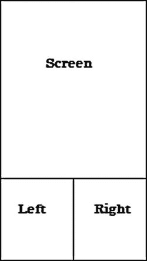
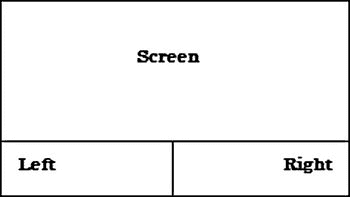

# 五、读取玩家输入

如果这是你第一次为移动设备或平板电脑编写游戏代码，你可能会很快注意到明显缺少输入选项来将玩家的意图反馈到游戏代码中。没有游戏控制器、键盘或鼠标的好处，很难为你的玩家提供复杂的输入系统。

连接游戏来检测和响应设备上的触摸事件并不像表面上看起来那么困难。

让我们来看看使用触摸屏作为游戏输入的一些更常见的问题。

5.1 检测屏幕触摸

问题

您的游戏无法检测到玩家何时触摸了屏幕。

解决办法

使用`onTouchEvent()`检测玩家触摸屏幕的位置和时间。

它是如何工作的

你的 Android 游戏是从一个扩展了`Activity`的类启动的。这个类将用于检测游戏中发生的触摸事件并做出反应。请记住，你的游戏代码和游戏循环将通过`Renderer`在`GLSurfaceView`中运行。但是，您仍然可以使用启动游戏的`Activity`来跟踪玩家在屏幕上的输入。

在您的`Activity`中，按如下方式覆盖`onTouchEvent()`:

```java
@Override
public boolean onTouchEvent(MotionEvent event) {
}
```

`onTouchEvent()`接收一个`MotionEvent`。当事件调用生成时，这个`MotionEvent`由系统自动传入。

`MotionEvent`包含了所有你需要的信息来帮助你判断和解读玩家的行动。从`MotionEvent`中，你可以获得玩家触摸的 x 和 y 坐标、触摸的压力和持续时间等信息，甚至可以确定滑动的方向。

例如，这里您只是简单地获取玩家的触摸坐标:

```java
@Override
public boolean onTouchEvent(MotionEvent event) {
float x = event.getX();
float y = event.getY();
}
```

现在，您可以根据需要对 x 和 y 坐标做出反应。

5.2 检测屏幕多点触摸

问题

您的游戏无法使用`onTouchEvent()` 同时检测多个屏幕触摸。

解决办法

使用`getPointerCount()`和`PointerCoords`帮助检索指针对象，以检测多点触摸输入。

它是如何工作的

传递给`onTouchEvent()`的`MotionEvent`可以跟踪多达五个不同的同时发生的屏幕触摸。这里的概念是遍历所有使用`getPointerCount()`检测到的指针。在圈内，你是

将使用`getPointerID()`来检索每个指针所需的信息。

首先设置你的`onTouchEvent()`并遍历检测到的指针，如清单 5-1 所示。

***清单 5-1*** 。`onTouchEvent()`

```java
@Override
public boolean onTouchEvent(MotionEvent event) {

MotionEvent.PointerCoords[] coords = new MotionEvent.PointerCoords[event.getPointerCount()];

   For(int i = 0; i< event.getPointerCount(); i++)
   {
event.getPointerCoords(i, coords[i]);
   }
}
```

现在，您可以从检测到的每个指针中获得所需的所有信息。将`coord[]`传递到你的游戏循环中，你将获得每个触摸点的 x 和 y 坐标。您还将获得触摸点的方向、压力、大小(面积)以及长轴和短轴的长度。

5.3 将屏幕划分为触摸区域

问题

您需要确定玩家是触摸了屏幕的右侧还是左侧。

解决办法

使用屏幕的高度和宽度来确定玩家触摸了屏幕的哪一侧。

它是如何工作的

你知道如何使用`onTouchEvent()`来确定玩家是否以及何时触摸了屏幕，以及玩家触摸的坐标。当你试图为你的游戏创建一个输入系统时，这是非常有用的信息。你现在面临的问题是试图确定给你的 x 和 y 坐标是否落在屏幕的特定区域内。

假设你正在创建一个平台游戏，玩家可以向左向右跑。你已经设置好了你的`onTouchEvent()`，每次玩家触摸屏幕时，你都要捕捉 x 和 y 坐标。你怎么能轻易地确定这些坐标应该把玩家推向左边还是右边呢？

答案是把屏幕分成触摸区。在这种情况下，我们希望一个区域位于屏幕的左侧，另一个区域位于屏幕的右侧。一些简单的`if`语句可以用来检查玩家在屏幕上触摸的位置。

以平台游戏为例，玩家只能向左和向右移动，你可以把屏幕分成两半，一个代表左边，一个代表右边。你也可以考虑把触摸区放在屏幕底部，玩家的拇指可能会在那里。

这意味着您必须忽略落在左右触摸区上方的任何触摸坐标。看一看图 5-1 和图 5-2 中的图，了解这一概念的直观表示。



图 5-1 。具有左右触摸区的肖像模式



图 5-2 。带左右触摸区的横向模式

创建触摸区域的第一步是获取屏幕的高度。为此，在公共类上创建一个新的`Display`属性，如下所示:

```java
public static Display display;
```

在应用的主`Activity`上，使用`WINDOW_SERVICE`将默认显示复制到这个属性，如清单 5-2 所示。

***清单 5-2*** 。使用`WINDOW_SERVICE`

```java
MyClass.display = ((WindowManager) getSystemService(Context.WINDOW_SERVICE)).getDefaultDisplay();
```

你现在可以在你的游戏代码中决定屏幕的高度和宽度，如清单 5-3 所示。

***清单 5-3*** 。确定高度和宽度

```java
@Override
public boolean onTouchEvent(MotionEvent event) {
//Get the non-touchable area of the screen -
//the upper two-thirds of the screen
int height = MyClass.display.getHeight() / 3;

//The playable area is now the lower third of the screen
int playableArea = MyClass.display.getHeight() - height;
}
```

**警告**这种方法有效，但只有当你的游戏像这个一样使用全屏时才完全有效。如果你的游戏不打算使用全屏，等到游戏的视图加载后再调用`<view>.getHeight()`。

使用值`playableArea` 作为 y 轴值，您可以很容易地判断出您的玩家是否触摸到了屏幕的正确部分。创建一个简单的`if`语句来测试玩家触摸坐标的位置(参见清单 5-4 )。

***清单 5-4*** 。使用`playableArea`

```java
@Override
public boolean onTouchEvent(MotionEvent event) {
//Get the non-touchable area of the screen -
//the upper two-thirds of the screen
int height = MyClass.display.getHeight() / 3;

//The playable area is now the lower third of the screen
 int playableArea = MyClass.display.getHeight() - height;

if (y > playableArea){

//This y coordinate is within the touch zone

}
}
```

现在你知道玩家已经触摸到了屏幕的正确区域，那么就可以通过测试 x 坐标是大于还是小于屏幕中心点来确定触摸区的左右和两侧(见清单 5-5 ) 。

***清单 5-5*** 。测试触摸区域

```java
@Override
public boolean onTouchEvent(MotionEvent event) {
//Get the non-touchable area of the screen -
//the upper two-thirds of the screen
int height = MyClass.display.getHeight() / 3;

//Get the center point of the screen
int center = MyClass.display.getWidth() / 2;

//The playable area is now the lower third of the screen
int playableArea = MyClass.display.getHeight() - height;

if (y > playableArea){

//This y coordinate is within the touch zone

if(x < center){
//The player touched the left
}else{
//The player touched the right
}

}
}
```

您已成功确定玩家触摸了屏幕的左侧还是右侧。将注释替换为您的特定代码，以根据玩家触摸的位置启动操作。

5.4 检测屏幕滑动

问题

你需要确定玩家是否滑动或投掷了屏幕，以及向哪个方向。

解决办法

使用`SimpleOnGestureListener`和然后计算投掷的方向。

它是如何工作的

对于一些游戏——比如《神庙逃亡》——你想让用户滑动或投掷屏幕来指示他们想要移动的方向。例如，向上一扔可能代表一次跳跃。这可能是一种更加通用的玩家输入方法，但是它也需要稍微多一点的设置代码。

实现这一点所需的代码将在与`OnTouchEvent()`相同的`Activity`上运行。事实上，你可以把这两个词——`OnTouchEvent()`和`SimpleOnGestureListener`——结合起来使用。

打开您的`Activity`并实例化一个`SimpleInGestureListener`，如下所示:

```java
GestureDetector.SimpleOnGestureListener gestureListener = new GestureDetector.SimpleOnGestureListener(){
};
```

您需要在手势监听器中实现几个方法。然而，在这个解决方案中，你唯一要使用的是`OnFling()`，它在 清单 5-6 中提供。

***清单 5-6*** 。`OnFling()`

```java
GestureDetector.SimpleOnGestureListener gestureListener = new GestureDetector.SimpleOnGestureListener(){
@Override
public boolean onDown(MotionEvent arg0) {
//TODO Auto-generated method stub
return false;
}

@Override
public boolean onFling(MotionEvent e1, MotionEvent e2, float velocityX,
float velocityY) {
//React to the fling action
return false;
}
@Override
public void onLongPress(MotionEvent e) {
//TODO Auto-generated method stub

}
@Override
public boolean onScroll(MotionEvent e1, MotionEvent e2, float distanceX,
float distanceY) {
//TODO Auto-generated method stub
return false;
}
@Override
public void onShowPress(MotionEvent e) {
//TODO Auto-generated method stub

}
@Override
public boolean onSingleTapUp(MotionEvent e) {
//TODO Auto-generated method stub
return false;
}

};
```

现在，在您的`Activity`中创建一个新变量，如下所示:

```java
private GestureDetector gd;
```

`GestureDetector`将用于抛出手势事件。将`Activity`、的`onCreate()`中的探测器初始化如下:

```java
@Override
public void onCreate(Bundle savedInstanceState) {
super.onCreate(savedInstanceState);
gd = new GestureDetector(this,gestureListener);
}
```

最后，在`OnTouchEvent()`中，扔给`gestureListener`，像这样:

```java
@Override
public boolean onTouchEvent(MotionEvent event) {
returngd.onTouchEvent(event);
}
```

当玩家抛出屏幕时，会执行`OnFling()`方法中的代码。这处理了什么和什么时候；接下来你需要确定什么方向。

注意`OnFling()`有两个`MotionEvent`属性。因为您之前使用过它，所以您知道`MotionEvent`包含一个`getX()`和一个`getY()`，用于获取事件各自的坐标。

这两个事件(`e1`和`e2`)代表投掷的起点和终点。因此，使用每个事件的 x 和 y 坐标，可以计算出玩家向哪个方向移动(参见清单 5-7 ) 。

***清单 5-7*** 。检测投掷运动

```java
float leftMotion = e1.getX() - e2.getX();
float upMotion = e1.getY() - e2.getY();

float rightMotion = e2.getX() - e1.getX();
float downMotion = e2.getY() - e1.getY();

if((leftMotion == Math.max(leftMotion, rightMotion)) && (leftMotion > Math.max(downMotion, upMotion)) )
{
//The player moved left
}

if((rightMotion == Math.max(leftMotion, rightMotion)) && rightMotion > Math.max(downMotion, upMotion) )
{
//The player moved right
}
if((upMotion == Math.max(upMotion, downMotion)) && (upMotion > Math.max(leftMotion, rightMotion)) )
{
//The player moved up
}

if((downMotion == Math.max(upMotion, downMotion)) && (downMotion > Math.max(leftMotion, rightMotion)) )
{
//The player moved down
}
```

现在你可以为你在游戏中需要采取的行动填入适当的代码。

因为这个解决方案绕过了`Activity`一点点，清单 5-8 显示了完成的`Activity`看起来应该是的样子。

***清单 5-8*** 。`SBGGameMain`的完整代码

```java
public class SBGGameMain extends Activity {
private GestureDetector gd;

@Override
public void onCreate(Bundle savedInstanceState) {
super.onCreate(savedInstanceState);
setContentView(myContentView);
gd = new GestureDetector(this,gestureListener);
}
@Override
protected void onResume() {
super.onResume();
}

@Override
protected void onPause() {
super.onPause();
}

@Override
public boolean onTouchEvent(MotionEvent event) {
return gd.onTouchEvent(event);
}

GestureDetector.SimpleOnGestureListener gestureListener = new GestureDetector.SimpleOnGestureListener(){
@Override
public boolean onDown(MotionEvent arg0) {
//TODO Auto-generated method stub
return false;
}

@Override
public boolean onFling(MotionEvent e1, MotionEvent e2, float velocityX,
float velocityY) {

float leftMotion = e1.getX() - e2.getX();
float upMotion = e1.getY() - e2.getY();

float rightMotion = e2.getX() - e1.getX();
float downMotion = e2.getY() - e1.getY();

if((leftMotion == Math.max(leftMotion, rightMotion)) && (leftMotion > Math.max(downMotion, upMotion)) )
{

}

if((rightMotion == Math.max(leftMotion, rightMotion)) && rightMotion > Math.max(downMotion, upMotion) )
{

}
if((upMotion == Math.max(upMotion, downMotion)) && (upMotion > Math.max(leftMotion, rightMotion)) )
{

}

if((downMotion == Math.max(upMotion, downMotion)) && (downMotion > Math.max(leftMotion, rightMotion)) )
{

}
return false;
}
@Override
public void onLongPress(MotionEvent e) {
//TODO Auto-generated method stub

}
@Override
public boolean onScroll(MotionEvent e1, MotionEvent e2, float distanceX,
float distanceY) {
//TODO Auto-generated method stub
return false;
}
@Override
public void onShowPress(MotionEvent e) {
//TODO Auto-generated method stub

}
@Override
public boolean onSingleTapUp(MotionEvent e) {
//TODO Auto-generated method stub
return false;
}

};
}

```

5.5 使用设备加速度计

问题

当玩家倾斜设备时，游戏角色不会移动。

解决办法

使用设备的内置加速度计来检测设备何时向特定方向倾斜，然后相应地移动角色。

它是如何工作的

大多数(如果不是全部的话)Android 设备都包含一个加速度计。这种传感器的一个普遍用途是作为游戏的另一个输入设备。使用来自加速度计的反馈，您可以检测玩家是否倾斜了设备，然后在代码中做出相应的反应。

在清单 5-9 中，你检测玩家是向左还是向右倾斜手机，然后设置适当的变量使角色向倾斜的方向移动。首先，在你的`Activity`类的中实现`SensorEventListener`。然后允许 Eclipse(或您选择的 IDE)添加所需的方法覆盖。

***清单 5-9*** 。SensorEvenListener

```java
public class SBGGameMain extends Activityimplements SensorEventListener{
@Override
public void onCreate(Bundle savedInstanceState) {
//TODO Auto-generated method stub
}
@Override
protected void onResume() {
//TODO Auto-generated method stub
}
@Override
protected void onPause() {
//TODO Auto-generated method stub
}
@Override
public void onAccuracyChanged(Sensor sensor, int accuracy) {
//TODO Auto-generated method stub

}
@Override
public void onSensorChanged(SensorEvent event) {
//TODO Auto-generated method stub
}

}
```

需要几个变量。`prevX`和`prevY`跟踪先前的 x 和 y 轴倾斜位置，以确定倾斜是否有变化。布尔函数`isInitialized`确定先前是否检测到倾斜；如果不是，新值被存储在`prevX`和`prevY`中。静态浮动`NOISE`保存一个值，让您根据环境设备的移动来确定实际的倾斜变化。最后，设置`SensorManager`和加速度计的变量。参见清单 5-10 。

***清单 5-10*** 。传感器管理器

```java
public class SBGGameMain extends Activity implements SensorEventListener{
private float prevX;
private float prevY;
private boolean isInitialized;
private final float NOISE = (float) 2.0;
private SensorManager sensorManager;
private Sensor accelerometer;
@Override
public void onCreate(Bundle savedInstanceState) {
//TODO Auto-generated method stub
}
@Override
protected void onResume() {
//TODO Auto-generated method stub
}
@Override
protected void onPause() {
//TODO Auto-generated method stub
}
@Override
public void onAccuracyChanged(Sensor sensor, int accuracy) {
//TODO Auto-generated method stub

}
@Override
public void onSensorChanged(SensorEvent event) {
//TODO Auto-generated method stub
}

}
```

接下来，在执行`onSensorChanged()`方法中的核心代码之前，在`onCreate()`、`onPause()`和`onResume()`方法中执行一些内务处理(参见清单 5-11 ) 。

***清单 5-11*** 。onSensorChanged

```java
@Override
public void onCreate(Bundle savedInstanceState) {
super.onCreate(savedInstanceState);
gameView = new SBGGameView(this);
setContentView(gameView);

isInitialized= false;
sensorManager= (SensorManager) getSystemService(this.SENSOR_SERVICE);
accelerometer= sensorManager.getDefaultSensor(Sensor.TYPE_ACCELEROMETER);
sensorManager.registerListener(this, accelerometer, SensorManager.SENSOR_DELAY_NORMAL);

}
Override
protected void onResume() {
super.onResume();

sensorManager.registerListener(this, accelerometer, SensorManager.SENSOR_DELAY_NORMAL);

gameView.onResume();

}

@Override
protected void onPause() {
super.onPause();

sensorManager.unregisterListener(this);

gameView.onPause();
}
```

现在是解决方案的核心。当检测到传感器的变化时，触发`onSensorChanged()`方法；在这种情况下，这就是加速度计。捕捉变化，并使用 x 和 y 向量来设置你的`PLAYER_MOVE_LEFT`和`PLAYER_MOVE_JUMP`，如清单 5-12 中的所示。

***清单 5-12*** 。设置玩家动作

```java
public class SBGGameMain extends Activity implements SensorEventListener{
private float prevX;
private float prevY;
private boolean isInitialized;
private final float NOISE = (float) 2.0;
private SensorManager sensorManager;
private Sensor accelerometer;

@Override
public void onCreate(Bundle savedInstanceState) {
super.onCreate(savedInstanceState);
gameView = new SBGGameView(this);
setContentView(gameView);

isInitialized= false;
sensorManager= (SensorManager) getSystemService(this.SENSOR_SERVICE);
accelerometer= sensorManager.getDefaultSensor(Sensor.TYPE_ACCELEROMETER);
sensorManager.registerListener(this, accelerometer, SensorManager.SENSOR_DELAY_NORMAL);

}
@Override
protected void onResume() {
super.onResume();

sensorManager.registerListener(this, accelerometer, SensorManager.SENSOR_DELAY_NORMAL);

gameView.onResume();

}

@Override
protected void onPause() {
super.onPause();

sensorManager.unregisterListener(this);

gameView.onPause();
}

@Override
public void onAccuracyChanged(Sensor sensor, int accuracy) {
//TODO Auto-generated method stub

}
@Override
public void onSensorChanged(SensorEvent event) {
float x = event.values[0];
float y = event.values[1];
if (!isInitialized) {
prevX = x;
prevY = y;
isInitialized = true;
} else {
float deltaX = Math.abs(prevX - x);
float deltaY = Math.abs(prevY - y);
if (deltaX < NOISE) deltaX = (float)0.0;
if (deltaY < NOISE) deltaY = (float)0.0;
prevX = x;
prevY = y;
if (deltaX > deltaY) {
playeraction = PLAYER_MOVE_LEFT;
} else if (deltaY > deltaX) {
playeraction = PLAYER_MOVE_JUMP;
} else {

}
}
}
}
```