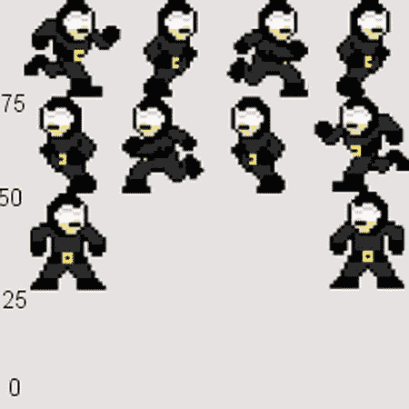

# 六、加载精灵表

很有可能到这个时候，你已经有了 Android 平台上游戏的外壳或雏形。也有可能你已经尝试了动画你的一个或所有的角色，武器，或其他屏幕上的对象没有运气。

如果您尝试过加载单独的图像，您无疑会发现翻转这些图像来创建动画的过程极其缓慢。这个问题的解决方案几乎和视频游戏本身一样古老:精灵表。大多数 2D 的视频游戏仍然采用一种久经考验的动画技术，并且非常适合这项任务；也就是说，创建游戏中需要的动画帧的 sprite 表。

在这一章中，你将使用 sprite sheets 完成一些常见问题的解决方案。

6.1 使用一个精灵表

问题

为动画加载多个独立的图像会占用太多空间，而且速度很慢。

解决办法

使用一个 sprite 表，在一个图像文件中包含所有动画帧。

它是如何工作的

让我们从基础开始。sprite sheet 是一个单独的图像文件，它保存了可用于创建动画 sprite 的所有不同图像。

我们示例游戏的主角——超级强盗——应该能够在屏幕上跑来跑去。这就要求超级强盗的精灵在奔跑时是动画的。动画中的每个图像都被加载到一个名为 sprite sheet 的单个文件中，而不是为动画的每一帧创建一个单独的图像(这样会非常耗费资源，以至于最终的游戏可能都无法加载)。图 6-1 显示了超级强盗家伙奔跑动画的精灵表的细节。


图 6-1 。超级强盗家伙运行(详细)

请注意，动画的不同帧都放在一个文件中，因此减少了存储、调用、交换和显示单独图像所需的资源。

将图像放入您的`res/drawable`文件夹。这与用于任何其他图像文件的过程相同。所有图像文件都可以存储在`res/drawable`文件夹中，然后使用`R.drawable.<imagename>`通过 id 轻松调出。但是，请记住，所有图像名称必须小写，否则您将无法调用它们。

现在的问题是:如何一次只显示一帧，而不是一次显示整个 sprite 工作表？这实际上比看起来容易。使用 OpenGL ES，您将调整该图像或纹理的大小，以便您想要显示的一帧动画一次适合顶点(在下一个解决方案中解释)。记住，在 OpenGL ES 中，你的纹理和顶点可以有不同的大小。

**注意**仅仅因为 OpenGL ES 使用的所有图像都必须是正方形，并不意味着 sprite 表中的每个空间都必须包含一帧动画。虽然我们为超级强盗家伙使用的 4x4sheet 可以容纳 16 帧动画，但我们只使用了 10 帧。

图 6-2 显示了超级强盗正在使用的精灵表。


图 6-2 。超级强盗(全精灵表)

**注意**为了在本书中展示，图像的背景被染成灰色。理想情况下，你的图片应该有透明的背景。

6.2 访问精灵表中的图像

问题

显示一个 sprite 表显示整个图像，而不是需要的单个图像。

解决办法

调整纹理映射以显示所需的 sprite sheet 部分。

它是如何工作的

为了理解这个解决方案是如何工作的，你需要首先理解你的纹理映射到的顶点和纹理对象本身是两个独立的实体，可以彼此独立地操作。这意味着您可以调整大小，移动或改变纹理，而不会影响顶点。

你已经知道图 6-2 中的精灵表包含了让超级强盗看起来像在跑的所有动画帧。然而，如果你尝试使用精灵作为纹理，两件事会立即变得明显。一是纹理出现倒挂；其次，整个 sprite 表被映射到顶点上，而不仅仅是一帧动画。

当 OpenGL 创建一个纹理时，图像被加载到一个字节数组中。当图像被加载到数组中时，图像的第一个字节被加载到数组的后面，接着是第二个字节，依此类推。当 OpenGL 开始从数组中读取纹理信息时，它读取的第一个字节(数组中的第一个字节)实际上是从文件中出来的最后一个字节。所以 OpenGL 的纹理是你原图的反转版。

你需要翻转 OpenGL 中的纹理，使其正面朝上。然后，您需要调整映射到顶点的纹理的大小，以便只有一帧 sprite 工作表是可见的。图 6-3 说明了这个概念。


图 6-3 。将精灵纹理翻转并映射到顶点

首先，让我们注意翻转图像，使其正面朝上。

**提示** OpenGL ES 以同样的方式处理所有图像到纹理的加载，不管它们是否是精灵片。因此，当你的所有图像变成纹理时，它们总是会反过来。解决方案的这一步应该在加载所有纹理时执行。

在您编写的将图像加载到纹理的代码中，实例化一个新的`Matrix`并使用`postScale()`方法创建新的矩阵，该矩阵沿 y 轴翻转纹理。新的矩阵被传递给通常用于加载纹理的`createBitmap()`方法。

在清单 6-1 中，`texture`代表你想要加载的图像的参考 id，在 `drawable`文件夹中可以找到。

***清单 6-1*** 。使用`postScale()`

```java
InputStreamimagestream = context.getResources().openRawResource(texture);
Bitmap bitmap = null;
Bitmap temp = null;

Matrix mtrx = new Matrix();
mtrx.postScale(1f, -1f);

temp = BitmapFactory.decodeStream(imagestream);
bitmap = Bitmap.createBitmap(temp, 0, 0, temp.getWidth(), temp.getHeight(), mtrx, true);

imagestream.close();
imagestream = null;
```

现在你的纹理已经以正确的方式翻转了，是时候调整纹理了，这样只有一帧可以明显地映射到你的顶点。同样，这可以在构建纹理和顶点时加载完成。

你目前用来加载纹理的代码，部分看起来应该像清单 6-2 。

***清单 6-2*** 。纹理数组

```java
privateFloatBuffervertexBuffer;
privateFloatBuffertextureBuffer;
privateByteBufferindexBuffer;

private float[] vertices = {
0f, 0f, 0f,
1f, 0f, 0f,
1f, 1f, 0f,
0f, 1f, 0f,
};

private float[] texture = {
0f, 0f,
1f, 0f,
1f, 1f,
0f, 1f,
};
```

因为 OpenGL ES 中的默认坐标系从 0 到 1，所以清单 6-2 中的数组使用整个纹理。使用这个数组，整个纹理将被映射到顶点上。然而，考虑到图 6-2 中的 sprite 工作表，你一次只想看到 sprite 工作表的四分之一。

**注**图 6-2 中的 sprite 页被分成四行四幅图像(并未全部使用)。因此，每行是整个纹理高度的 25 %,每列是整个纹理宽度的 25%。

修正纹理数组，如清单 6-3 所示，只显示精灵表中的一帧动画。

***清单 6-3*** 。新纹理数组

```java
privateFloatBuffervertexBuffer;
privateFloatBuffertextureBuffer;
privateByteBufferindexBuffer;

private float[] vertices = {
0f, 0f, 0f,
1f, 0f, 0f,
1f, 1f, 0f,
0f, 1f, 0f,
};

private float[] texture = {
0f, 0f,
.25f, 0f,
.25f, .25f,
0f, .25f,
};

```

6.3 改变精灵图框

问题

图像需要从 sprite 表中的一帧变化到另一帧，而不是静态的。

解决办法

通过沿 x 和/或 y 轴平移纹理，从一个 sprite sheet 帧移动到另一个 sprite sheet 帧。

它是如何工作的

在 OpenGL ES 1 中使用`glTranslatef()`方法在坐标系中平移或移动矩阵。要从 sprite 工作表的第一帧切换到第二帧，需要将纹理矩阵沿 x 轴平移 25%。(这是假设你正在使用一个像图 6-2 中那样设置的 sprite 工作表)。

第一步是将 OpenGL ES 置于纹理矩阵模式，从而确保您修改的是纹理的坐标，而不是顶点。以下代码将 OpenGL ES 置于纹理矩阵模式，并将 sprite 工作表的第一帧(左上角)映射到顶点。

```java
gl.glMatrixMode(GL10.GL_TEXTURE);
gl.glLoadIdentity();
gl.glTranslatef(0f,.75f, 0f);
```

注意，传递给`glTranslatef()`的 y 坐标是. 75。在 0–1 的坐标范围内，. 75 对应于 sprite 工作表中第一行帧的左下角。在这个代码示例中，传递给`glTranslatef()`的 x 和 y 坐标分别是 0 和. 75。把这个带到图 6-4 中的图像，(0，. 75)是精灵表第一行第一帧的左下角。图 6-4 显示了 y 轴上的坐标是如何与精灵表对齐的。



图 6-4 。具有 y 轴坐标的 Sprite 工作表

如果你想改变贴图到顶点的纹理到 sprite 表第一行的第二帧，使用`glTranslatef()`方法移动纹理到(. 25，. 75)。0.25 的 x 坐标表示第一行第二帧的 x 轴左下角。

```java
gl.glMatrixMode(GL10.GL_TEXTURE);
gl.glLoadIdentity();
gl.glTranslatef(.25f,.75f, 0f);
```

如果您使用的是 OpenGL ES 2 或 3，更改 sprite 工作表框架的过程是不同的。您将需要添加一对浮点到您的片段着色器。这些浮动将接受框架位置的 x 和 y 坐标值，很像`glTranslatef()`。

首先，将浮点添加到片段着色器代码，如清单 6-4 中的所示。

***清单 6-4*** 。向片段着色器代码添加浮点

```java
private final String fragmentShaderCode =
"precisionmediump float;" +
"uniformvec4vColor;" +
"uniformsampler2DTexCoordIn;" +
"uniform float posX;" +
"uniform float posY;" +
"varyingvec2TexCoordOut;" +
"void main() {" +
"}";
```

接下来，修改片段着色器的`main()`方法来调用`texture2d()`并向其传递清单 6-5 中`posX`和`posY, as shown in` 和的值。

***清单 6-5*** 。修改`main()`方法

```java
private final String fragmentShaderCode =
"precisionmediump float;" +
"uniformvec4vColor;" +
"uniformsampler2DTexCoordIn;" +
"uniform float posX;" +
"uniform float posY;" +
"varyingvec2TexCoordOut;" +
"void main() {" +
" gl_FragColor = texture2D(TexCoordIn, vec2(TexCoordOut.x + posX,TexCoordOut.y + posY));"+
"}";
```

着色器代码现已修改。您需要一种方法将`posX`和`posY`的值传递到着色器代码中。这最终是使用`glUniform1f()`完成的。改变纹理的 x 和 y 位置的代码应该放在对象类的`draw()`方法中。修改方法签名，允许在调用`draw()`时传递坐标。

```java
public void draw(float[] mvpMatrix,float posX, float posY) {
...
}
```

使用`glGetUniformLocation()`获得`posX`和`posY`浮动在着色器中的位置，然后使用`glUniform1f()`分配新值，如清单 6-6 所示。

***清单 6-6*** 。`draw()`

```java
public void draw(float[] mvpMatrix, float posX, float posY) {
GLES20.glUseProgram(mProgram);

mPositionHandle = GLES20.glGetAttribLocation(mProgram, "vPosition");

GLES20.glEnableVertexAttribArray(mPositionHandle);

intvsTextureCoord = GLES20.glGetAttribLocation(mProgram, "TexCoordIn");
GLES20.glVertexAttribPointer(mPositionHandle, COORDS_PER_VERTEX,
GLES20.GL_FLOAT, false,
vertexStride, vertexBuffer);
GLES20.glVertexAttribPointer(vsTextureCoord, COORDS_PER_TEXTURE,
GLES20.GL_FLOAT, false,
textureStride, textureBuffer);
GLES20.glEnableVertexAttribArray(vsTextureCoord);
GLES20.glActiveTexture(GLES20.GL_TEXTURE0);
GLES20.glBindTexture(GLES20.GL_TEXTURE_2D, textures[0]);
intfsTexture = GLES20.glGetUniformLocation(mProgram, "TexCoordOut");
intfsPosX = GLES20.glGetUniformLocation(mProgram, "posX");
intfsPosY = GLES20.glGetUniformLocation(mProgram, "posY");
GLES20.glUniform1i(fsTexture, 0);
GLES20.glUniform1f(fsPosX, posX);
GLES20.glUniform1f(fsPosY, posY);
mMVPMatrixHandle = GLES20.glGetUniformLocation(mProgram, "uMVPMatrix");

GLES20.glUniformMatrix4fv(mMVPMatrixHandle, 1, false, mvpMatrix, 0);

GLES20.glDrawElements(GLES20.GL_TRIANGLES, drawOrder.length,
GLES20.GL_UNSIGNED_SHORT, drawListBuffer);

GLES20.glDisableVertexAttribArray(mPositionHandle);
}

```

6.4 将 Sprite 表中的图像 制作成动画

问题

一个图像需要是一个随时间变化的动画 (就好像角色在跑)。

解决办法

以特定顺序浏览多个 sprite 工作表图像。

它是如何工作的

在这个解决方案中，您将构建在前一个解决方案中使用的`glTranslatef()`和`glUnifor1f()`方法。OpenGL ES 1 的`glTranslatef()`方法已经显示了移动顶点上的贴图纹理，这样只有 sprite sheet 的特定部分是可见的。如果你足够快地执行这个动作，并且有足够的帧数，你将会有动画。

对于这个解决方案，你再次使用图 6-2 中所示的精灵表。这个解决方案也建立在第五章“读取玩家输入”的基础上

创建一个枚举，当玩家触摸屏幕的右侧或左侧时，可以设置该枚举，指示角色应该分别向右或向左跑(见清单 6-7 )。

这些变量应该放在你可以从渲染器和主`Activity` 访问它们的地方。

***清单 6-7*** 。更新玩家移动

```java
public static intplayerAction = 0;
public static final int PLAYER_MOVE_LEFT = 1;
public static final int PLAYER_STAND = 0;
public static final int PLAYER_MOVE_RIGHT = 2;
```

你还需要设置另外六个变量(清单 6-8 )。

***清单 6-8*** 。设置另外六个变量

```java
public static float playerCurrentLocation  = .75f;
public static float currentRunAniFrame  = 0f;
public static float currentStandingFrame   = 0f;

public static final float PLAYER_RUN_SPEED = .25f;
public static final float STANDING_LEFT = 0f;
public static final float STANDING_RIGHT = .75f;
```

`playerCurrentLocation`用于跟踪屏幕上精灵的当前位置。`currentRunAniFrame`用于跟踪精灵表中动画的当前帧，这使得角色看起来在运行。像`currentRunAniFrame`一样，`currentStandingFrame`被用来跟踪精灵表的哪一帧被用来使角色看起来是站着的。

`PLAYER_RUN_SPEED`将用于以特定的间隔在屏幕上移动精灵。结合动画，`PLAYER_RUN_SPEED`用来给人一种角色实际在跑的错觉。最后，`STANDING_LEFT`和`STANDING_RIGHT`变量保存代表角色站立的 sprite 表中两个帧的 x 轴左下角的值。一个框架面向左，另一个面向右。

回头参考第五章，清单 6-9 根据玩家是触摸了屏幕的右侧还是左侧来设置`playerAction`。游戏主`Activity`的`onTouchEvent`被修改为`playerAction`设置为`PLAYER_MOVE_RIGHT`、`PLAYER_MOVE_LEFT`或`PLAYER_STAND` 。

***清单 6-9*** 。`onTouchEvent()`

```java
@Override
publicbooleanonTouchEvent(MotionEvent event) {
float x = event.getX();
float y = event.getY();
DisplayMetricsoutMetrics = new DisplayMetrics();

display.getMetrics(outMetrics);

int height = outMetrics.heightPixels / 4;

int playableArea = outMetrics.heightPixels - height;
if (y >playableArea){
switch (event.getAction()){
case MotionEvent.ACTION_DOWN:
if(x <outMetrics.widthPixels / 2){
playerAction = PLAYER_MOVE_RIGHT;
}else{
playerAction = PLAYER_MOVE_LEFT;
}
break;
case MotionEvent.ACTION_UP:
playerAction = PLAYER_STAND;
break;
}
}

return false;
}
```

接下来，设置一个`case`语句来读取`playerAction`的值。游戏循环包含在`Renderer`的`onDraw()`方法中。该方法在一个常量循环中执行。因此，您可以在`Renderer`中创建一个名为`movePlayer()`的新方法，并从`Renderer`的`onDraw()`方法中调用它。

每次`onDraw()`方法执行，都会调用`movePlayer()`。在`movePlayer()`方法中，你所需要做的就是告诉 OpenGL ES 你想如何翻转精灵页面并“移动”角色。

首先，创建`movePlayer()`方法并设置一个`case`语句来遍历`playerAction`。在清单 6-10 所示的代码中，`goodguy`指的是`SuperBanditGuy`类的实例化。这可以代表你在 游戏中使用的任何职业。

***清单 6-10*** 。`movePlayer()`

```java
private void movePlayer(GL10gl){
if(!goodguy.isDead)
{
switch(playeraction){
case PLAYER_MOVE_RIGHT:

break;

case PLAYER_MOVE_LEFT:

break;

case PLAYER_STAND:

break;
}
}
}
```

在 Recipe 6.3 中，你学习了如何使用`glTanslatef()`和`glUniform1f()`方法从 sprite 工作表的一帧移动到另一帧。这个解决方案中唯一的不同是您将自动化这个过程。这意味着因为`onDraw()`，也就是`movePlayer()`，是在一个循环中被调用的，你必须以这样一种方式编写对`glTranslatef()`的调用，它将在每次被调用时自动从一帧循环到下一帧。清单 6-11 和 6-12 展示了当您想要使用 OpenGL ES 1 和 OpenGL ES 2/3 将字符向右移动时，这段代码的样子。

***清单 6-11*** 。用播放器移动画面(OpenGLES 1)

```java
currentStandingFrame   = STANDING_RIGHT;
playerCurrentLocation  += PLAYER_RUN_SPEED;

currentRunAniFrame  += .25f;
if (currentRunAniFrame> .75f)
{
currentRunAniFrame  = .0f;
}

gl.glMatrixMode(GL10.GL_MODELVIEW);
gl.glLoadIdentity();
gl.glPushMatrix();
gl.glScalef(.15f, .15f, 1f);
gl.glTranslatef(playercurrentlocation, .75f, 0f);
gl.glMatrixMode(GL10.GL_TEXTURE);
gl.glLoadIdentity();
gl.glTranslatef(currentRunAniFrame,.75f, 0.0f);
goodguy.draw(gl,spritesheets,SBG_RUNNING_PTR);
gl.glPopMatrix();
gl.glLoadIdentity();

```

***清单 6-12*** 。用播放器移动帧(OpenGL ES 2/3)

```java
currentStandingFrame   = STANDING_RIGHT;
playerCurrentLocation  += PLAYER_RUN_SPEED;

currentRunAniFrame  += .25f;
if (currentRunAniFrame> .75f)
{
currentRunAniFrame  = .0f;
}

goodguy.draw(mMVPMatrix, currentRunAniFrame, .75f );
```

首先，因为角色跑向右边，当他停止奔跑时，他应该面向右边。因此，`currentStandingFrame`被设置为`STANDING_RIGHT`。然后，`PLAYER_RUN_SPEED`被加到`playercurrentlocation`上，得到一个距离原始位置 0.25 的值。渲染时，精灵会移动到新位置。

下一个块保持动画循环移动。sprite 工作表有四个图像，左下角在 x 轴上分别为 0、. 25、. 50 和. 75。为了实现平滑的动画，您将从第一帧(0)开始，然后添加. 25 以到达第二帧，依此类推。当到达动画的最后一帧(. 75)时，需要从 0 重新开始。一个`if()`语句检查你是否在动画的最后一帧，并重置你回到第一帧。

最后，使用 OpenGL 绘制新的动画帧。注意`glTranslatef()`被调用了两次——一次在模型矩阵模式下，一次在纹理矩阵模式下。当在模型矩阵模式下调用它时，它会移动纹理映射到的顶点的物理位置，从而将角色向右移动。在纹理矩阵模式下调用`glTranslatef()`时，动画的帧前进。

清单 6-13 和 6-14 展示了完成的`movePlayer()`方法，同样使用了 OpenGL ES 1 和 OpenGL ES 2/3T6。

***清单 6-13*** 。已完成`movePlayer()` ( OpenGL ES 1)

```java
private void movePlayer(GL10gl){
if(!goodguy.isDead)
{
switch(playeraction){
case PLAYER_MOVE_RIGHT:
currentStandingFrame   = STANDING_RIGHT;
playerCurrentLocation  += PLAYER_RUN_SPEED;
currentRunAniFrame  += .25f;
if (currentRunAniFrame> .75f)
{
currentRunAniFrame  = .0f;
}

gl.glMatrixMode(GL10.GL_MODELVIEW);
gl.glLoadIdentity();
gl.glPushMatrix();
gl.glScalef(.15f, .15f, 1f);
gl.glTranslatef(playerCurrentLocation, .75f, 0f);
gl.glMatrixMode(GL10.GL_TEXTURE);
gl.glLoadIdentity();
gl.glTranslatef(currentRunAniFrame,.75f, 0.0f);
goodguy.draw(gl,spritesheets,SBG_RUNNING_PTR);
gl.glPopMatrix();
gl.glLoadIdentity();

break;

case PLAYER_MOVE_LEFT:
currentStandingFrame   = STANDING_LEFT;
playerCurrentLocation  -= PLAYER_RUN_SPEED;
currentRunAniFrame  += .25f;
if (currentRunAniFrame> .75f)
{
currentRunAniFrame  = .0f;
}

gl.glMatrixMode(GL10.GL_MODELVIEW);
gl.glLoadIdentity();
gl.glPushMatrix();
gl.glScalef(.15f, .15f, 1f);
gl.glTranslatef(playerCurrentLocation, .75f, 0f);
gl.glMatrixMode(GL10.GL_TEXTURE);
gl.glLoadIdentity();
gl.glTranslatef(currentRunAniFrame,.50f, 0.0f);
goodguy.draw(gl,spritesheets,SBG_RUNNING_PTR);
gl.glPopMatrix();
gl.glLoadIdentity();

break;

case PLAYER_STAND:
gl.glMatrixMode(GL10.GL_MODELVIEW);
gl.glLoadIdentity();
gl.glPushMatrix();
gl.glScalef(.15f, .15f, 1f);
gl.glTranslatef(playerCurrentLocation, .75f, 0f);
gl.glMatrixMode(GL10.GL_TEXTURE);
gl.glLoadIdentity();
gl.glTranslatef(currentStandingFrame,.25f, 0.0f);
goodguy.draw(gl,spritesheets,SBG_RUNNING_PTR);
gl.glPopMatrix();
gl.glLoadIdentity();
break;
}
}
}
```

***清单 6-14*** 。已完成`movePlayer()` (OpenGL ES 2/3)

```java
private void movePlayer(GL10gl){
if(!goodguy.isDead)
{
switch(playeraction){
case PLAYER_MOVE_RIGHT:
currentStandingFrame   = STANDING_RIGHT;
playerCurrentLocation  += PLAYER_RUN_SPEED;
currentRunAniFrame  += .25f;
if (currentRunAniFrame> .75f)
{
currentRunAniFrame  = .0f;
}

goodguy.draw(mMVPMatrix, currentRunAniFrame, .75f );
break;

case PLAYER_MOVE_LEFT:
currentStandingFrame   = STANDING_LEFT;
playerCurrentLocation  -= PLAYER_RUN_SPEED;
currentRunAniFrame  += .25f;
if (currentRunAniFrame> .75f)
{
currentRunAniFrame  = .0f;
}

goodguy.draw(mMVPMatrix, currentRunAniFrame, .50f );
break;

case PLAYER_STAND:
goodguy.draw(mMVPMatrix, currentStandingFrame, .25f );
break;
}
}
}
```