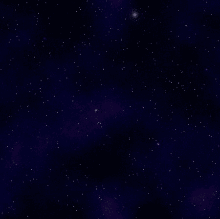

# 七、滚动背景

本章的解决方案将帮助你创建一个游戏的滚动背景。许多游戏类型都有背景图像，当玩家玩游戏时，背景图像会滚动。你可能对如何让游戏的背景图像移动有一些疑问。

在某些情况下，图像会自动滚动。例如，滚动射击和其他“轨道”风格的游戏将有自动滚动的背景。这与其他游戏类型形成对比，例如侧滚平台游戏，其中背景图像将随着玩家的移动而滚动(这在第八章“滚动多个背景”中有所介绍)。

本章将介绍三种加载背景图像、垂直滚动图像和水平滚动图像的解决方案。

7.1 加载背景图像

问题

您的游戏无法使用 OpenGL ES 加载背景图像。

解决办法

创建一个类，可以将图像作为纹理加载，并将其映射到一组顶点 。

它是如何工作的

加载图像以供 OpenGL ES 使用的最简单方法是创建一个自定义类，该类创建所需的所有顶点，并将图像作为纹理映射到这些顶点。因为这个背景将会滚动，所以这个类还需要以一种能够重复的方式映射纹理。如果 OpenGL ES 可以在滚动时重复纹理，背景图像将会看起来好像无限延续。

用于无限滚动的最常见的背景类型之一，也是最容易操作的背景类型之一，是一个星空。星域是点的随机模式，很容易无缝重复。像侧滚射击游戏这样的游戏经常使用星域作为无限滚动的背景。

图 7-1 展示了将在本解决方案中使用的 星域图像。



图 7-1 。星域图像

第一步是将图像添加到项目的正确的`res/drawable`文件夹中。我们已经讨论过将图像添加到项目中，以及可用于此目的的各种文件夹(参见第二章、第三章、第六章、【加载精灵表】了解更多具体信息)。将图像文件添加到项目中后，创建一个新的类。对于这个解决方案，新类的名称将是`SBGBackground()`。

```java
public class SBGBackground {

}
```

在第六章中创建了一个类似的类来加载 spritesheet 角色的图像和顶点。清单 7-1 (用于 OpenGL ES 1)和清单 7-2 (用于 OpenGL ES 2/3)的大部分代码直接来自第六章中的解决方案。

***清单 7-1*** 。`SBGBackground()` (OpenGL 是 1)

```java
public class SBGBackground {

private FloatBuffer vertexBuffer;
private FloatBuffer textureBuffer;
private ByteBuffer indexBuffer;

private int[] textures = new int[1];

private float vertices[] = {
0.0f, 0.0f, 0.0f,
1.0f, 0.0f, 0.0f,
1.0f, 1.0f, 0.0f,
0.0f, 1.0f, 0.0f,
};

private float texture[] = {
0.0f, 0.0f,
1.0f, 0f,
1f, 1.0f,
0f, 1f,
};

private byte indices[] = {
0,1,2,
0,2,3,
};

public SBGBackground() {
      ByteBuffer byteBuf = ByteBuffer.allocateDirect(vertices.length * 4);
byteBuf.order(ByteOrder.nativeOrder());
vertexBuffer = byteBuf.asFloatBuffer();
vertexBuffer.put(vertices);
vertexBuffer.position(0);

byteBuf = ByteBuffer.allocateDirect(texture.length * 4);
byteBuf.order(ByteOrder.nativeOrder());
textureBuffer = byteBuf.asFloatBuffer();
textureBuffer.put(texture);
textureBuffer.position(0);

indexBuffer = ByteBuffer.allocateDirect(indices.length);
indexBuffer.put(indices);
indexBuffer.position(0);
   }

public void draw(GL10 gl) {
gl.glBindTexture(GL10.GL_TEXTURE_2D, textures[0]);

gl.glFrontFace(GL10.GL_CCW);
gl.glEnable(GL10.GL_CULL_FACE);
gl.glCullFace(GL10.GL_BACK);

gl.glEnableClientState(GL10.GL_VERTEX_ARRAY);
gl.glEnableClientState(GL10.GL_TEXTURE_COORD_ARRAY);

gl.glVertexPointer(3, GL10.GL_FLOAT, 0, vertexBuffer);
gl.glTexCoordPointer(2, GL10.GL_FLOAT, 0, textureBuffer);

gl.glDrawElements(GL10.GL_TRIANGLES, indices.length, GL10.GL_UNSIGNED_BYTE, indexBuffer);

gl.glDisableClientState(GL10.GL_VERTEX_ARRAY);
gl.glDisableClientState(GL10.GL_TEXTURE_COORD_ARRAY);
gl.glDisable(GL10.GL_CULL_FACE);
   }
}

```

***清单 7-2*** 。`SBGBackground()` (OpenGL 是 2/3)

```java
class SBGBackground{
private final String vertexShaderCode =
"uniform mat4 uMVPMatrix;" +
"attribute vec4 vPosition;" +
"attribute vec2 TexCoordIn;" +
"varying vec2 TexCoordOut;" +
"void main() {" +
"  gl_Position = uMVPMatrix * vPosition;" +
"  TexCoordOut = TexCoordIn;" +
"}";

private final String fragmentShaderCode =
"precision mediump float;" +
"uniform vec4 vColor;" +
"uniform sampler2D TexCoordIn;" +
"uniform float scroll;" +
"varying vec2 TexCoordOut;" +
"void main() {" +
"}";
private float texture[] = {
 0f, 0f,
.25f, 0f,
.25f, .25f,
0f, .25f,
};

private int[] textures = new int[1];
private final FloatBuffer vertexBuffer;
private final ShortBuffer drawListBuffer;
private final FloatBuffer textureBuffer;
private final int mProgram;
private int mPositionHandle;
private int mMVPMatrixHandle;

static final int COORDS_PER_VERTEX = 3;
static final int COORDS_PER_TEXTURE = 2;
static float squareCoords[] = { -1f,  1f, 0.0f,
-1f, -1f, 0.0f,
1f, -1f, 0.0f,
1f,  1f, 0.0f };

private final short drawOrder[] = { 0, 1, 2, 0, 2, 3 };

private final int vertexStride = COORDS_PER_VERTEX * 4;
public static int textureStride = COORDS_PER_TEXTURE * 4;

public SBGBackground() {
ByteBuffer bb = ByteBuffer.allocateDirect(
bb.order(ByteOrder.nativeOrder());
vertexBuffer = bb.asFloatBuffer();
vertexBuffer.put(squareCoords);
vertexBuffer.position(0);

bb = ByteBuffer.allocateDirect(texture.length * 4);
bb.order(ByteOrder.nativeOrder());
textureBuffer = bb.asFloatBuffer();
textureBuffer.put(texture);
textureBuffer.position(0);

ByteBuffer dlb = ByteBuffer.allocateDirect(
dlb.order(ByteOrder.nativeOrder());
drawListBuffer = dlb.asShortBuffer();
drawListBuffer.put(drawOrder);
drawListBuffer.position(0);

int vertexShader = SBGGameRenderer.loadShader(
GLES20.GL_VERTEX_SHADER,vertexShaderCode);
int fragmentShader = SBGGameRenderer.loadShader(
GLES20.GL_FRAGMENT_SHADER,fragmentShaderCode);

mProgram = GLES20.glCreateProgram();
GLES20.glAttachShader(mProgram, vertexShader);
GLES20.glAttachShader(mProgram, fragmentShader);
GLES20.glLinkProgram(mProgram);
}

public void draw(float[] mvpMatrix) {
GLES20.glUseProgram(mProgram);

mPositionHandle = GLES20.glGetAttribLocation(mProgram, "vPosition");

GLES20.glEnableVertexAttribArray(mPositionHandle);

int vsTextureCoord = GLES20.glGetAttribLocation(mProgram, "TexCoordIn");
GLES20.glVertexAttribPointer(
mPositionHandle, COORDS_PER_VERTEX,
GLES20.GL_FLOAT, false,
vertexStride, vertexBuffer);
GLES20.glVertexAttribPointer(vsTextureCoord, COORDS_PER_TEXTURE,
GLES20.GL_FLOAT, false,
textureStride, textureBuffer);
GLES20.glEnableVertexAttribArray(vsTextureCoord);
GLES20.glActiveTexture(GLES20.GL_TEXTURE0);
GLES20.glBindTexture(GLES20.GL_TEXTURE_2D, textures[0]);
int fsTexture = GLES20.glGetUniformLocation(mProgram, "TexCoordOut");
GLES20.glUniform1i(fsTexture, 0);
mMVPMatrixHandle = GLES20.glGetUniformLocation(mProgram, "uMVPMatrix");

GLES20.glUniformMatrix4fv(mMVPMatrixHandle, 1, false, mvpMatrix, 0);

GLES20.glDrawElements(GLES20.GL_TRIANGLES, drawOrder.length,
GLES20.GL_UNSIGNED_SHORT, drawListBuffer);

GLES20.glDisableVertexAttribArray(mPositionHandle);
}
}
```

这个类以其当前的形式创建顶点、索引和纹理数组。它还包含一个初始化缓冲区的构造函数和一个在需要绘制背景图像时调用的`draw()`方法。基于你在本书之前的解决方案中看到的其他图像类，这个类应该看起来很熟悉。

请特别注意清单 7-1 中加粗的代码行。这一行创建了一个名为`textures`的`int`数组，但是只将其实例化为一个元素。其原因是现有的用于生成纹理名称的 OpenGL ES 方法(`glGenTextures`)只接受一组纹理，因为它是为处理多个纹理而构建的。

现在我们将使用 OpenGL ES 1 和 OpenGL ES 2/3 创建一个名为`loadTexture()`的新方法，这是加载图像文件并将其作为纹理映射到顶点`所需的。对于 OpenGL ES 1，请使用以下内容:`

 ```java`
public void loadTexture(GL10 gl,int texture, Context context) {

}
```

对于 OpenGL ES 2/3，请使用以下内容:

```java
public void loadTexture(int texture, Context context) {

}
```

请注意，该方法的 OpenGL ES 1 版本接受 OpenGL ES 对象、要加载的图像的 ID 和当前 Android 上下文。在这个方法中，您需要从图像创建一个位图(使用传入的 ID)，然后设置一些纹理参数，这些参数将指示 OpenGL ES 如何处理纹理(参见清单 7-3 和 7-4 ) )。

***清单 7-3*** 。`loadTexture()` (OpenGL 是 1)

```java
public void loadTexture(GL10 gl,int texture, Context context) {
InputStream imagestream = context.getResources().openRawResource(texture);
Bitmap bitmap = null;
try {

bitmap = BitmapFactory.decodeStream(imagestream);

}catch(Exception e){

}finally {
try {
imagestream.close();
imagestream = null;
} catch (IOException e) {
}
}

gl.glGenTextures(1, textures, 0);
gl.glBindTexture(GL10.GL_TEXTURE_2D, textures[0]);

gl.glTexParameterf(GL10.GL_TEXTURE_2D, GL10.GL_TEXTURE_MIN_FILTER, GL10.GL_NEAREST);
gl.glTexParameterf(GL10.GL_TEXTURE_2D, GL10.GL_TEXTURE_MAG_FILTER, GL10.GL_LINEAR);

gl.glTexParameterf(GL10.GL_TEXTURE_2D, GL10.GL_TEXTURE_WRAP_S, GL10.GL_REPEAT);
gl.glTexParameterf(GL10.GL_TEXTURE_2D, GL10.GL_TEXTURE_WRAP_T, GL10.GL_REPEAT);

GLUtils.texImage2D(GL10.GL_TEXTURE_2D, 0, bitmap, 0);

bitmap.recycle();
}

```

***清单 7-4*** 。`loadTexture()` (OpenGL 是 2/3)

```java
public void loadTexture(int texture, Context context) {
InputStream imagestream = context.getResources().openRawResource(texture);
Bitmap bitmap = null;

android.graphics.Matrix flip = new android.graphics.Matrix();
flip.postScale(-1f, -1f);

try {

bitmap = BitmapFactory.decodeStream(imagestream);

}catch(Exception e){
//Handle your exceptions here
}finally {
try {
imagestream.close();
imagestream = null;
} catch (IOException e) {
 //Handle your exceptions here
}
}

GLES20.glGenTextures(1, textures, 0);
GLES20.glBindTexture(GLES20.GL_TEXTURE_2D, textures[0]);

GLES20.glTexParameterf(GLES20.GL_TEXTURE_2D, GLES20.GL_TEXTURE_MIN_FILTER, GLES20.GL_NEAREST);
GLES20.glTexParameterf(GLES20.GL_TEXTURE_2D, GLES20.GL_TEXTURE_MAG_FILTER, GLES20.GL_LINEAR);

GLES20.glTexParameterf(GLES20.GL_TEXTURE_2D, GLES20.GL_TEXTURE_WRAP_S, GLES20.GL_REPEAT);
GLES20.glTexParameterf(GLES20.GL_TEXTURE_2D, GLES20.GL_TEXTURE_WRAP_T, GLES20.GL_REPEAT);

GLUtils.texImage2D(GLES20.GL_TEXTURE_2D, 0, bitmap, 0);

bitmap.recycle();
}
```

请特别注意这个方法中加粗的代码。这段代码显式地将纹理设置为沿 x 和 y 轴重复。在 OpenGL ES 中，S 纹理坐标轴指的是 x 笛卡尔轴；t 是指 y 轴。在这个例子中，重复纹理是至关重要的，因为我们使用了一个将被无限重复的星域图像。

既然`SBGBackground()`类已经完成，那么需要将代码添加到利用新类的游戏循环中。完成这个解决方案还需要两个步骤。首先是实例化一个新的`SBGBackground`。然后图像 ID 必须传递给`loadTexture()`方法。

在您的游戏循环中，实例化一个新的`SBGBackground`，如下所示:

```java
private SBGBackground background1 = new SBGBackground();
```

游戏循环包含在 OpenGL ES `Renderer`的实现中。因此，它有一些必需的方法，这些方法在前面的章节中已经详细介绍过了。其中一个方法是`onSurfaceCreated()`，这是加载纹理的代码应该被调用的地方。

```java
public void onSurfaceCreated(GL10 gl, EGLConfig config) {
//TODO Auto-generated method stub

...

background1.loadTexture(gl, R.drawable.starfield, context);
}
```

接下来的两个解决方案将包括滚动已经加载的背景纹理。

7.2 水平滚动背景

问题

背景目前是静态的，应该会水平滚动。

解决办法

在游戏循环中创建一个新类，将背景纹理在 y 轴上平移一个设定的量。

它是如何工作的

这个解决方案的 OpenGL ES 1 版本的第一步是创建两个变量，分别用于跟踪背景纹理的当前位置和平移纹理的值。

```java
int bgScroll1 = 0;
float SCROLL_BACKGROUND_1 = .002f;
```

这些变量可以是您的`Renderer`类的本地变量，或者您可以将它们存储在一个单独的类中。

OpenGL ES `Renderer`实现中的`onDrawFrame()`方法会在游戏循环的每次迭代中被调用。你需要创建一个新的方法，叫做`scrollBackground()`，它又从`onDrawFrame()`方法中被调用(见清单 7-5 )。

***清单 7-5*** 。`scrollBackground()` (OpenGL 是 1)

```java
private void scrollBackground1(GL10 gl){
if (bgScroll1 == Float.MAX_VALUE){
bgScroll1 = 0f;
}

gl.glMatrixMode(GL10.GL_MODELVIEW);
gl.glLoadIdentity();
gl.glPushMatrix();
gl.glScalef(1f, 1f, 1f);
gl.glTranslatef(0f, 0f, 0f);

gl.glMatrixMode(GL10.GL_TEXTURE);
gl.glLoadIdentity();
gl.glTranslatef(0.0f, bgScroll1, 0.0f);

background1.draw(gl);
gl.glPopMatrix();
bgScroll1 +=  SCROLL_BACKGROUND_1;
gl.glLoadIdentity();

}
```

该方法的第一部分测试`bgScroll1`变量的当前值。考虑到浮动有一个上限，这个`if`语句是必要的，以确保你不超载你的浮动。

接下来，在开始使用纹理矩阵之前，将缩放和转换模型矩阵视图。注意，纹理模型的 y 坐标被`bgScroll1`中的值平移。这就是在屏幕上移动背景的原因。

最后，调用`SBGBackground()`类的`draw()`方法，用`SCROLL_BACKGROUND_1`变量中的值增加`bgScroll1`变量，为循环的下一次迭代做准备。

从`onDrawFrame()`方法调用新的`scrollBackground()`方法，背景星域将在屏幕上水平平滑移动。

在 OpenGL ES 2/3 中完成同样的过程略有不同(见清单 7-6 )。控制滚动的变量在 object 类的`draw()`方法中设置。这个变量也可以传递到`draw()`方法中，就像在第六章中用于 spritesheet 解决方案的一样。然而，由于这个背景是自动滚动的，而且是无限滚动的，所以在方法中处理一切更有意义。

***清单 7-6*** 。`scrollBackground()` (OpenGL 是 2/3)

```java
class SBGBackground{
public float scroll = 0;
private final String vertexShaderCode =
"uniform mat4 uMVPMatrix;" +
"attribute vec4 vPosition;" +
"attribute vec2 TexCoordIn;" +
"varying vec2 TexCoordOut;" +
"void main() {" +
"  gl_Position = uMVPMatrix * vPosition;" +
"  TexCoordOut = TexCoordIn;" +
"}";

private final String fragmentShaderCode =
"precision mediump float;" +
"uniform vec4 vColor;" +
"uniform sampler2D TexCoordIn;" +
"uniform float scroll;" +
"varying vec2 TexCoordOut;" +
"void main() {" +
" gl_FragColor = texture2D(TexCoordIn, vec2(TexCoordOut.x + scroll,TexCoordOut.y));"+
"}";
private float texture[] = {
0f, 0f,
.25f, 0f,
.25f, .25f,
0f, .25f,
};

private int[] textures = new int[1];
private final FloatBuffer vertexBuffer;
private final ShortBuffer drawListBuffer;
private final FloatBuffer textureBuffer;
private final int mProgram;
private int mPositionHandle;
private int mMVPMatrixHandle;

static final int COORDS_PER_VERTEX = 3;
static final int COORDS_PER_TEXTURE = 2;
static float squareCoords[] = { -1f,  1f, 0.0f,
-1f, -1f, 0.0f,
1f, -1f, 0.0f,
1f,  1f, 0.0f };

private final short drawOrder[] = { 0, 1, 2, 0, 2, 3 };

private final int vertexStride = COORDS_PER_VERTEX * 4;
public static int textureStride = COORDS_PER_TEXTURE * 4;

public void loadTexture(int texture, Context context) {
      ...
   }
public SBGBackground() {
...
}

public void draw(float[] mvpMatrix) {
scroll += .01f;
GLES20.glUseProgram(mProgram);

mPositionHandle = GLES20.glGetAttribLocation(mProgram, "vPosition");

GLES20.glEnableVertexAttribArray(mPositionHandle);

int vsTextureCoord = GLES20.glGetAttribLocation(mProgram, "TexCoordIn");
GLES20.glVertexAttribPointer(mPositionHandle, COORDS_PER_VERTEX,
GLES20.GL_FLOAT, false,
vertexStride, vertexBuffer);
GLES20.glVertexAttribPointer(vsTextureCoord, COORDS_PER_TEXTURE,
GLES20.GL_FLOAT, false,
textureStride, textureBuffer);
GLES20.glEnableVertexAttribArray(vsTextureCoord);
GLES20.glActiveTexture(GLES20.GL_TEXTURE0);
GLES20.glBindTexture(GLES20.GL_TEXTURE_2D, textures[0]);
int fsTexture = GLES20.glGetUniformLocation(mProgram, "TexCoordOut");
int fsScroll = GLES20.glGetUniformLocation(mProgram, "scroll");
GLES20.glUniform1i(fsTexture, 0);
GLES20.glUniform1f(fsScroll, scroll);
mMVPMatrixHandle = GLES20.glGetUniformLocation(mProgram, "uMVPMatrix");

GLES20.glUniformMatrix4fv(mMVPMatrixHandle, 1, false, mvpMatrix, 0);

GLES20.glDrawElements(GLES20.GL_TRIANGLES, drawOrder.length,
GLES20.GL_UNSIGNED_SHORT, drawListBuffer);

GLES20.glDisableVertexAttribArray(mPositionHandle);
}
}

```

7.3 垂直滚动背景

问题

背景目前是静态的，它应该水平滚动。

解决办法

在游戏循环中创建一个新类，在 x 轴上将背景纹理平移一个设定的量。

它是如何工作的

在前一个解决方案的基础上，只需要做一个改变就可以垂直而不是水平滚动背景，如清单 7-7 和清单 7-8 所示。

***清单 7-7*** 。垂直滚动(OpenGL ES 1)

```java
private void scrollBackground1(GL10 gl){
if (bgScroll1 == Float.MAX_VALUE){
bgScroll1 = 0f;
}

gl.glMatrixMode(GL10.GL_MODELVIEW);
gl.glLoadIdentity();
gl.glPushMatrix();
gl.glScalef(1f, 1f, 1f);
gl.glTranslatef(0f, 0f, 0f);

gl.glMatrixMode(GL10.GL_TEXTURE);
gl.glLoadIdentity();
gl.glTranslatef(bgScroll1, 0.0f, 0.0f);

background1.draw(gl);
gl.glPopMatrix();
bgScroll1 +=  SCROLL_BACKGROUND_1;
gl.glLoadIdentity();

}

```

***清单 7-8*** 。垂直滚动(OpenGL ES 2/3)

```java
private final String fragmentShaderCode =
"precision mediump float;" +
"uniform vec4 vColor;" +
"uniform sampler2D TexCoordIn;" +
"uniform float scroll;" +
"varying vec2 TexCoordOut;" +
"void main() {" +
" gl_FragColor = texture2D(TexCoordIn, vec2(TexCoordOut.x,TexCoordOut.y+ scroll));"+
"}";
```

注意 OpenGL ES 1 方法的`scrollBackground()`中加粗的代码。在`glTranslatef()`方法调用中，`bgScroll1`值已经从 y 轴位置移动到 x 轴位置。这就是使背景垂直滚动而不是水平滚动所需的全部内容。

OpenGL ES 2/3 唯一需要更改的代码是片段着色器。滚动浮动现在被添加到纹理的 y 坐标而不是 x 坐标。`