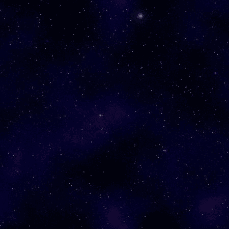
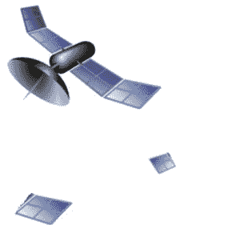
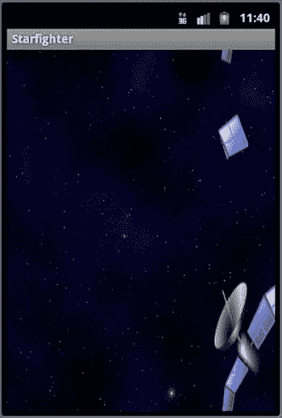

# 八、滚动多个背景

在第七章中，提出了创建可滚动背景的解决方案。虽然该解决方案将帮助您创建一个引人注目的游戏，它可以有更多的深度。

在这一章中，你将会看到在游戏背景中加载和使用两张图片的解决方案。这不仅会让你的游戏更有活力，还能让你以不同的速度滚动两幅图像。

在这一章的最后，给出了以不同速度滚动两幅不同背景图像的解决方案。这给了游戏一个更真实的外观，并增加了平面环境的深度。

8.1 加载两幅背景图像

问题

游戏的背景需要包含两个图像。

解决办法

使用 OpenGL 加载两幅图像来创建一个分层的背景,可以独立滚动以获得更动态的外观。

它是如何工作的

正如在第七章的中所讨论的，加载图像以供 OpenGL ES 使用的最简单的方法是创建一个自定义类来加载所有需要的顶点，并将图像作为纹理映射到这些顶点。

在这个解决方案中，您将复制两个图像到项目的`res`文件夹中。然后，您将实例化为第七章中的解决方案创建的类的两个副本。使用这两个独立的实例，您将在后台加载并绘制两个不同的图像。图 8-1 和 8-2 显示了将在本解决方案中使用的星域图像和碎片域图像。



图 8-1 。星空图像



图 8-2 。碎片区域图像

第一步是将图像添加到项目的正确的`res/drawable`文件夹中。我们之前讨论过将图像添加到项目，以及可用于此目的的各种文件夹。将图像文件添加到项目中后，您可以实例化在第七章中创建的类的两个副本。

这些类需要在包含游戏循环的类中实例化。包含游戏循环的类是 OpenGL ES `Renderer`的一个实现。背景类应该在一个所有的`Renderer`方法都可以访问的位置被实例化。

作为参考，清单 8-1 和 8-2 显示了来自第七章 的`SBGBackground()`类的完整代码。

***清单 8-1*** 。`SBGBackground` (OpenGL 是 1)

```java
public class SBGBackground {

private FloatBuffer vertexBuffer;
private FloatBuffer textureBuffer;
private ByteBuffer indexBuffer;

private int[] textures = new int[1];

private float vertices[] = {
0.0f, 0.0f, 0.0f,
1.0f, 0.0f, 0.0f,
1.0f, 1.0f, 0.0f,
0.0f, 1.0f, 0.0f,
};

private float texture[] = {
0.0f, 0.0f,
1.0f, 0f,
1f, 1.0f,
0f, 1f,
};

private byte indices[] = {
0,1,2,
0,2,3,
};

Public SBGBackground() {
ByteBuffer byteBuf = ByteBuffer.allocateDirect(vertices.length * 4);
byteBuf.order(ByteOrder.nativeOrder());
vertexBuffer = byteBuf.asFloatBuffer();
vertexBuffer.put(vertices);
vertexBuffer.position(0);

byteBuf = ByteBuffer.allocateDirect(texture.length * 4);
byteBuf.order(ByteOrder.nativeOrder());
textureBuffer = byteBuf.asFloatBuffer();
textureBuffer.put(texture);
textureBuffer.position(0);

indexBuffer = ByteBuffer.allocateDirect(indices.length);
indexBuffer.put(indices);
indexBuffer.position(0);
   }

public void draw(GL10gl) {
gl.glBindTexture(GL10.GL_TEXTURE_2D, textures[0]);

gl.glFrontFace(GL10.GL_CCW);
gl.glEnable(GL10.GL_CULL_FACE);
gl.glCullFace(GL10.GL_BACK);

gl.glEnableClientState(GL10.GL_VERTEX_ARRAY);
gl.glEnableClientState(GL10.GL_TEXTURE_COORD_ARRAY);

gl.glVertexPointer(3, GL10.GL_FLOAT, 0, vertexBuffer);
gl.glTexCoordPointer(2, GL10.GL_FLOAT, 0, textureBuffer);

gl.glDrawElements(GL10.GL_TRIANGLES, indices.length, GL10.GL_UNSIGNED_BYTE, indexBuffer);

gl.glDisableClientState(GL10.GL_VERTEX_ARRAY);
gl.glDisableClientState(GL10.GL_TEXTURE_COORD_ARRAY);
gl.glDisable(GL10.GL_CULL_FACE);
   }

public void loadTexture(GL10gl,int texture, Context context) {
InputStream imagestream = context.getResources().openRawResource(texture);
Bitmap bitmap = null;
try {

bitmap = BitmapFactory.decodeStream(imagestream);

}catch(Exception e){

}finally {
try {
imagestream.close();
imagestream = null;
} catch (IOException e) {
}
}

gl.glGenTextures(1, textures, 0);
gl.glBindTexture(GL10.GL_TEXTURE_2D, textures[0]);

gl.glTexParameterf(GL10.GL_TEXTURE_2D, GL10.GL_TEXTURE_MIN_FILTER, GL10.GL_NEAREST);
gl.glTexParameterf(GL10.GL_TEXTURE_2D, GL10.GL_TEXTURE_MAG_FILTER, GL10.GL_LINEAR);

gl.glTexParameterf(GL10.GL_TEXTURE_2D, GL10.GL_TEXTURE_WRAP_S, GL10.GL_REPEAT);
gl.glTexParameterf(GL10.GL_TEXTURE_2D, GL10.GL_TEXTURE_WRAP_T, GL10.GL_REPEAT);

GLUtils.texImage2D(GL10.GL_TEXTURE_2D, 0, bitmap, 0);

bitmap.recycle();
}

}
```

***清单 8-2*** 。`SBGBackground` (OpenGL 是 2/3)

```java
class SBGBackground{
private final String vertexShaderCode =
"uniform mat4 uMVPMatrix;" +
"attribute vec4 vPosition;" +
"attribute vec2 TexCoordIn;" +
"varying vec2 TexCoordOut;" +
"void main() {" +
"  gl_Position = uMVPMatrix * vPosition;" +
"  TexCoordOut = TexCoordIn;" +
"}";

private final String fragmentShaderCode =
"precision mediump float;" +
"uniform vec4 vColor;" +
"uniform sampler2D TexCoordIn;" +
"uniform float scroll;" +
"varying vec2 TexCoordOut;" +
"void main() {" +
" gl_FragColor = texture2D(TexCoordIn, vec2(TexCoordOut.x + scroll,TexCoordOut.y));"+
"}";
private float texture[] = {
0f, 0f,
.25f, 0f,
.25f, .25f,
0f, .25f,
};

Private int[] textures = new int[1];
private final FloatBuffer vertexBuffer;
private final ShortBuffer drawListBuffer;
private final FloatBuffer textureBuffer;
private final int mProgram;
private int mPositionHandle;
private int mMVPMatrixHandle;

static final int COORDS_PER_VERTEX = 3;
static final int COORDS_PER_TEXTURE = 2;
static float squareCoords[] = { -1f,  1f, 0.0f,
 -1f, -1f, 0.0f,
1f, -1f, 0.0f,
1f,  1f, 0.0f };

private final short drawOrder[] = { 0, 1, 2, 0, 2, 3 };

private final int vertexStride = COORDS_PER_VERTEX * 4;
public static int textureStride = COORDS_PER_TEXTURE * 4;

public void loadTexture(int texture, Context context) {
InputStreami magestream = context.getResources().openRawResource(texture);
      Bitmap bitmap = null;

android.graphics.Matrix flip = new android.graphics.Matrix();
flip.postScale(-1f, -1f);
try {

bitmap = BitmapFactory.decodeStream(imagestream);

}catch(Exception e){

}finally {
try {
imagestream.close();
imagestream = null;
} catch (IOException e) {
}
      }

GLES20.glGenTextures(1, textures, 0);
GLES20.glBindTexture(GLES20.GL_TEXTURE_2D, textures[0]);

GLES20.glTexParameterf(GLES20.GL_TEXTURE_2D, GLES20.GL_TEXTURE_MIN_FILTER,
GLES20.GL_NEAREST);
GLES20.glTexParameterf(GLES20.GL_TEXTURE_2D, GLES20.GL_TEXTURE_MAG_FILTER,
GLES20.GL_LINEAR);

GLES20.glTexParameterf(GLES20.GL_TEXTURE_2D, GLES20.GL_TEXTURE_WRAP_S, GLES20.GL_REPEAT);
GLES20.glTexParameterf(GLES20.GL_TEXTURE_2D, GLES20.GL_TEXTURE_WRAP_T, GLES20.GL_REPEAT);

GLUtils.texImage2D(GLES20.GL_TEXTURE_2D, 0, bitmap, 0);

bitmap.recycle();
   }
public SBGBackground() {
ByteBuffer bb = ByteBuffer.allocateDirect(
bb.order(ByteOrder.nativeOrder());
vertexBuffer = bb.asFloatBuffer();
vertexBuffer.put(squareCoords);
vertexBuffer.position(0);

bb = ByteBuffer.allocateDirect(texture.length * 4);
bb.order(ByteOrder.nativeOrder());
textureBuffer = bb.asFloatBuffer();
textureBuffer.put(texture);
textureBuffer.position(0);

ByteBuffer dlb = ByteBuffer.allocateDirect(
dlb.order(ByteOrder.nativeOrder());
drawListBuffer = dlb.asShortBuffer();
drawListBuffer.put(drawOrder);
drawListBuffer.position(0);

int vertexShader = SBGGameRenderer.loadShader(GLES20.GL_VERTEX_SHADER,
vertexShaderCode);
int fragmentShader = SBGGameRenderer.loadShader(GLES20.GL_FRAGMENT_SHADER,
fragmentShaderCode);

mProgram = GLES20.glCreateProgram();
GLES20.glAttachShader(mProgram, vertexShader);
GLES20.glAttachShader(mProgram, fragmentShader);
GLES20.glLinkProgram(mProgram);
}

public void draw(float[] mvpMatrix, float scroll) {
GLES20.glUseProgram(mProgram);

mPositionHandle = GLES20.glGetAttribLocation(mProgram, "vPosition");

GLES20.glEnableVertexAttribArray(mPositionHandle);

int vsTextureCoord = GLES20.glGetAttribLocation(mProgram, "TexCoordIn");
GLES20.glVertexAttribPointer(mPositionHandle, COORDS_PER_VERTEX,
GLES20.GL_FLOAT, false,
vertexStride, vertexBuffer);
GLES20.glVertexAttribPointer(vsTextureCoord, COORDS_PER_TEXTURE,
GLES20.GL_FLOAT, false,
textureStride, textureBuffer);
GLES20.glEnableVertexAttribArray(vsTextureCoord);
GLES20.glActiveTexture(GLES20.GL_TEXTURE0);
GLES20.glBindTexture(GLES20.GL_TEXTURE_2D, textures[0]);
int fsTexture = GLES20.glGetUniformLocation(mProgram, "TexCoordOut");
int fsScroll = GLES20.glGetUniformLocation(mProgram, "scroll");
GLES20.glUniform1i(fsTexture, 0);
GLES20.glUniform1f(fsScroll, scroll);
mMVPMatrixHandle = GLES20.glGetUniformLocation(mProgram, "uMVPMatrix");

GLES20.glUniformMatrix4fv(mMVPMatrixHandle, 1, false, mvpMatrix, 0);

GLES20.glDrawElements(GLES20.GL_TRIANGLES, drawOrder.length,
GLES20.GL_UNSIGNED_SHORT, drawListBuffer);

GLES20.glDisableVertexAttribArray(mPositionHandle);
}
}
```

如果您将这段代码与第七章中的代码进行比较，您应该会注意到 OpenGL ES 2/3 版本的一个小变化。scroll 变量已被移动到构造函数中。这允许您传递滚动量，以便您可以以不同的速率滚动背景的多个实例化。

在你的游戏中实例化两个新的`SBGBackground()`，如下所示:

```java
private SBGBackground background1 = new SBGBackground();
private SBGBackground background2 = new SBGBackground();
```

现在您需要加载图像，并使用`SBGBackground()`的`loadTexture()`方法将它们映射为纹理。加载纹理的代码应该在`Renderer` 的`onSurfaceCreated()`方法中调用。

```java
public void onSurfaceCreated(GL10gl, EGLConfigconfig) {
//TODO Auto-generated method stub

...

background1.loadTexture(gl, R.drawable.starfield, context);
background1.loadTexture(gl, R.drawable.debrisfield, context);
}
```

接下来的两个解决方案将包括滚动背景纹理，现在它们已经被加载了。

8.2 滚动两个背景图像

问题

只有一个背景图像滚动。

解决办法

通过修改每个图像的滚动变量，修改游戏循环，使两个图像都滚动。

它是如何工作的

解决方案的第一步是创建四个变量，分别用于跟踪背景纹理的当前位置和平移纹理的值。

```java
int bgScroll1 = 0;
int bgScroll2 = 0;

float SCROLL_BACKGROUND_1 = .002f;
float SCROLL_BACKGROUND_2 = .002f;
```

这些变量可以是您的`Renderer`类的本地变量，或者您可以将它们存储在一个单独的类中。这个解决方案借鉴了第七章中的一个解决方案。然而，如果你一开始不慢的话，在游戏中跟踪多个移动的元素可能会很棘手。尽量避免跳过这一步，因为很容易错过一个重要的细节。

OpenGL ES `Renderer`实现中的`onDrawFrame()`方法会在游戏循环的每次迭代中被调用。创建一个名为`scrollBackgrounds()`的新方法，它将从`onDrawFrame()`方法中被调用。参见清单 8-3 和清单 8-4 。

***清单 8-3*** 。`scrollBackgrounds()` (OpenGL 是 1)

```java
private void scrollBackgrounds(GL10gl){
if (bgScroll1 == Float.MAX_VALUE){
bgScroll1 = 0f;
}

if (bgScroll2 == Float.MAX_VALUE){
bgScroll2 = 0f;
}

gl.glMatrixMode(GL10.GL_MODELVIEW);
gl.glLoadIdentity();
gl.glPushMatrix();
gl.glScalef(1f, 1f, 1f);
gl.glTranslatef(0f, 0f, 0f);

gl.glMatrixMode(GL10.GL_TEXTURE);
gl.glLoadIdentity();
gl.glTranslatef(0.0f, bgScroll1, 0.0f);

background1.draw(gl);
gl.glPopMatrix();
bgScroll1 +=  SCROLL_BACKGROUND_1;
gl.glLoadIdentity();

gl.glMatrixMode(GL10.GL_TEXTURE);
gl.glLoadIdentity();
gl.glTranslatef(0.0f, bgScroll2, 0.0f);

background2.draw(gl);
gl.glPopMatrix();
bgScroll2 +=  SCROLL_BACKGROUND_2;
gl.glLoadIdentity();

}
```

***清单 8-4*** 。`scrollBackgrounds()` (OpenGL 是 2/3)

```java
private void scrollBackgrounds(GL10gl){
if (bgScroll1 == Float.MAX_VALUE){
bgScroll1 = 0f;
}

if (bgScroll2 == Float.MAX_VALUE){
bgScroll2 = 0f;
}

background1.draw(mMVPMatrix, bgScroll1);
background2.draw(mMVPMatrix, bgScroll2);
bgScroll1 +=  SCROLL_BACKGROUND_1;
bgScroll2 +=  SCROLL_BACKGROUND_2;
}
```

该方法的第一部分测试`bgScroll1`和`bgScroll2`变量的当前值。就像第七章中的一样，`if`声明对于确保你不会让你的浮存金超载是必要的。

视图矩阵和纹理矩阵模型被缩放和转换，以提供背景图像所需的“运动”。

最后，从`onDrawFrame()`方法调用新的`scrollBackgrounds()`方法，两个背景图像应该一起在屏幕上滚动。背景应该出现在图 8-3 中。



图 8-3 。两个背景图像在一起

8.3 以不同的速度滚动两幅背景图像

问题

背景图像不会以不同的速度滚动。

解决办法

通过修改游戏循环以不同速度滚动多个背景图像来增加深度感。

它是如何工作的

在前一个解决方案的基础上，只需要做一个改变就可以以不同的速度滚动背景图像。

理想情况下，为了创造一种人工的深度感，您会希望前景图像(两幅图像中)的滚动速度比背景中最远的图像快。

为了实现这一效果，将先前解决方案中的`SCROLL_BACKGROUND_2`值更改为一个更大的数字。设置的数值越大，图像滚动的速度越快。

```java
int bgScroll1 = 0;
int bgScroll2 = 0;

float SCROLL_BACKGROUND_1 = .002f;
float SCROLL_BACKGROUND_2 = .005f;
```