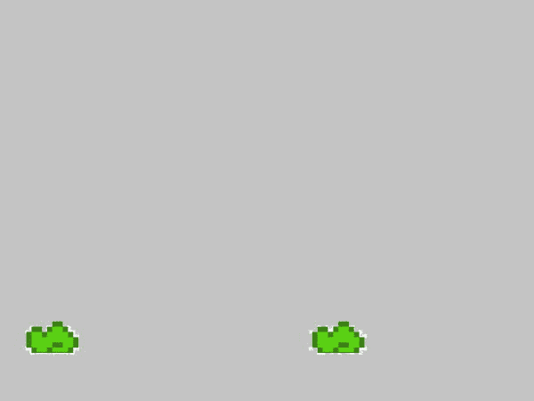

# 九、将背景与角色运动同步

在第八章中，介绍了创建可滚动的多层背景的解决方案。然而，如果你试图同步背景的滚动和角色的移动，你可能会遇到问题。

在这一章中，你会看到两个方法——第一个是在两个方向上滚动多图像背景，第二个是同步背景的滚动和可玩角色的移动。

9.1 向两个方向滚动背景

问题

当玩家可以两个方向奔跑时，背景只向一个方向滚动 。

解决办法

修改背景类以跟踪两个方向的运动。

它是如何工作的

这个解决方案假设你的游戏，可能是一个平台风格的游戏，有一个角色可以向两个方向移动。回想一下流行的平台风格游戏(如超级马里奥兄弟)，很多时候可玩角色可以向右移动以在游戏中前进。人物也可以向左移动，通常是在有限的能力下，来追溯他们的脚步。

在背景可以与角色同步之前，它需要能够在两个方向上移动。这个解决方案将获取一个三幅图像的背景，加载它，向右滚动，然后反向向左滚动。

第一步是将用作背景的三幅图像复制到`res/drawable`文件夹中。图 9-1 到 9-3 代表了我在这个例子中使用的三张图片。请注意，它们是单一背景的图层，已经被拉开，以便它们可以以不同的速度滚动。


图 9-1 。最远的背景层



图 9-2。中间层


图 9-3 。地面层

**注意**为了在本书中打印图像，图像的透明部分被涂成灰色。

一旦图像在项目中，实例化三个`SBGBackground()`类的实例——每个背景层一个。

```java
private SBGBackground background1 = new SBGBackground();
private SBGBackground background2 = new SBGBackground();
private SBGBackground background3 = new SBGBackground();
```

下一步是创建三组变量来控制和跟踪每一层背景的速度和位置。

```java
private float bgScroll1;
private float bgScroll2;
private float bgScroll3;
public static float SCROLL_BACKGROUND_1  = .002f;
public static float SCROLL_BACKGROUND_2  = .003f;
public static float SCROLL_BACKGROUND_3  = .004f;
```

在第七章(清单 7-1 和 7-2)中，给出了一个创建`scrollBackground()`方法的解决方案。

改变方法，允许背景向左或向右滚动，这取决于玩家移动的方向。

在本书的早期，提供了一个允许角色在屏幕上移动的解决方案(使用 spritesheet)。这个解决方案的一部分需要创建一些变量来跟踪玩家的动作。在这个解决方案中使用相同的变量。

```java
public static int playerAction = 0;
public static final int PLAYER_MOVE_LEFT = 1;
public static final int PLAYER_MOVE_RIGHT = 2;
```

**注意**前面提到的变量应该在你收集玩家输入的时候设置。有关这方面的更多信息，请参见第五章和第六章。

使用 OpenGL ES 1 和 2/3 向接受`playerAction`变量的`scrollBackground()`方法添加一个新参数，如下所示。

对于 OpenGL ES 1:

```java
private void scrollBackground1(GL10gl, int direction){

...

}
```

对于 OpenGL ES 2/3:

```java
private void scrollBackground1(int direction){

...

}
```

传递给`scrollBackground()`方法的方向将用于决定如何滚动背景图像。在当前的`scrollBackground()`方法中，下面一行控制图像的滚动:

```java
bgScroll1 +=  SCROLL_BACKGROUND_1;
```

这条线的关键部分是`+=`。要改变滚动方向，需要将操作者从`+=`切换到`-=`。创建一个`switch...case`语句，根据从玩家输入中收集的方向来改变这个操作符。

OpenGL ES 1 和 OpenGL ES 2/3 的`scrollBackground()`方法分别显示在清单 9-1 和清单 9-2 中。

***清单 9-1*** 。`scrollBackground()` (OpenGL 是 1)

```java
private void scrollBackground1(GL10gl, int direction){
if (bgScroll1 == Float.MAX_VALUE){
bgScroll1 = 0f;
}

gl.glMatrixMode(GL10.GL_MODELVIEW);
gl.glLoadIdentity();
gl.glPushMatrix();
gl.glScalef(1f, 1f, 1f);
gl.glTranslatef(0f, 0f, 0f);

gl.glMatrixMode(GL10.GL_TEXTURE);
gl.glLoadIdentity();
gl.glTranslatef(bgScroll1,0.0f, 0.0f);

background1.draw(gl);
gl.glPopMatrix();
switch(direction)
{
case PLAYER_MOVE_RIGHT:
bgScroll1 +=  SCROLL_BACKGROUND_1;
break;
case PLAYER_MOVE_LEFT:
bgScroll1 -=  SCROLL_BACKGROUND_1;
break;
}
gl.glLoadIdentity();

}
```

***清单 9-2*** 。`scrollBackground()` (OpenGL 是 2/3)

```java
private void scrollBackground1(int direction){
if (bgScroll1 == Float.MAX_VALUE){
bgScroll1 = 0f;
}

background1.draw(mMVPMatrix, bgScroll1);
switch(direction)
{
case PLAYER_MOVE_RIGHT:
bgScroll1 +=  SCROLL_BACKGROUND_1;
break;
case PLAYER_MOVE_LEFT:
bgScroll1 -=  SCROLL_BACKGROUND_1;
break;
}
}
```

背景现在将根据传递给`scrollBackground()`方法的方向向右或向左滚动。下一个解决方案将这个方法与玩家的移动联系起来。

9.2 移动背景以响应用户输入

问题

根据玩家的移动，背景不会开始或停止滚动。

解决办法

需要结合`movePlayer()`方法调用`scrollBackground()`方法来控制两个的移动。

它是如何工作的

在第六章中，清单 6-7 给出了一个解决方案，它创建了一个`movePlayer()`方法来促进角色的动画。这个方法需要修改，以允许背景的滚动同步到它。首先，更改它的名称以表明它的新用途。

在 OpenGL ES 1 中:

```java
private void movePlayerAndBackground(GL10gl){

...

}
```

在 OpenGL ES 2/3 中:

```java
private void movePlayerAndBackground(){

...

}
```

注意，在现有的`movePlayer()`方法中，有一个`switch`语句移动播放器(使用 spritesheet)。`switch`语句需要重写，以便当角色到达屏幕的大致中间时，它不再移动(参见清单 9-3 和 9-4 )。角色应该看起来在这一点上运行到位，背景应该滚动到近似运动。

***清单 9-3*** 。`movePlayerAndBackground()` (OpenGL 是 1)

```java
private void movePlayerAndBackground(GL10gl){
background1.draw(gl);
if(!goodguy.isDead)
{
switch(playerAction){
case PLAYER_MOVE_RIGHT:

currentStandingFrame = STANDING_RIGHT;

currentRunAniFrame += .25f;
if (currentRunAniFrame> .75f)
{
currentRunAniFrame = .0f;
}

if(playerCurrentLocation>= 3f)
{
scrollBackground1(gl, playerAction);
gl.glMatrixMode(GL10.GL_MODELVIEW);
gl.glLoadIdentity();
gl.glPushMatrix();
gl.glScalef(.15f, .15f, 1f);
gl.glTranslatef(playerCurrentLocation, .75f, 0f);
gl.glMatrixMode(GL10.GL_TEXTURE);
gl.glLoadIdentity();
gl.glTranslatef(currentRunAniFrame,.50f, 0.0f);
goodguy.draw(gl,spriteSheets,SBG_RUNNING_PTR);
gl.glPopMatrix();
gl.glLoadIdentity();

}else{
playerCurrentLocation += PLAYER_RUN_SPEED;
gl.glMatrixMode(GL10.GL_MODELVIEW);
gl.glLoadIdentity();
gl.glPushMatrix();
gl.glScalef(.15f, .15f, 1f);
gl.glTranslatef(playerCurrentLocation, .75f, 0f);
gl.glMatrixMode(GL10.GL_TEXTURE);
gl.glLoadIdentity();
gl.glTranslatef(currentRunAniFrame,.50f, 0.0f);
goodguy.draw(gl,spriteSheets,SBG_RUNNING_PTR);
gl.glPopMatrix();
gl.glLoadIdentity();

}

break;

case PLAYER_MOVE_LEFT:

currentStandingFrame = STANDING_LEFT;

currentRunAniFrame += .25f;
if (currentRunAniFrame> .75f)
{
currentRunAniFrame = .0f;
}

if(playerCurrentLocation<= 2.5f)
{
scrollBackground1(gl, playerAction);
gl.glMatrixMode(GL10.GL_MODELVIEW);
gl.glLoadIdentity();
gl.glPushMatrix();
gl.glScalef(.15f, .15f, 1f);
gl.glTranslatef(playerCurrentLocation, .75f, 0f);
gl.glMatrixMode(GL10.GL_TEXTURE);
gl.glLoadIdentity();
gl.glTranslatef(currentRunAniFrame,.75f, 0.0f);
goodguy.draw(gl,spriteSheets,SBG_RUNNING_PTR);
gl.glPopMatrix();
gl.glLoadIdentity();

}else{
playerCurrentLocation -= PLAYER_RUN_SPEED;
gl.glMatrixMode(GL10.GL_MODELVIEW);
gl.glLoadIdentity();
gl.glPushMatrix();
gl.glScalef(.15f, .15f, 1f);
gl.glTranslatef(playerCurrentLocation, .75f, 0f);
gl.glMatrixMode(GL10.GL_TEXTURE);
gl.glLoadIdentity();
gl.glTranslatef(currentRunAniFrame,.75f, 0.0f);
goodguy.draw(gl,spriteSheets,SBG_RUNNING_PTR);
gl.glPopMatrix();
gl.glLoadIdentity();

}
break;

case PLAYER_STAND:
gl.glMatrixMode(GL10.GL_MODELVIEW);
gl.glLoadIdentity();
gl.glPushMatrix();
gl.glScalef(.15f, .15f, 1f);
gl.glTranslatef(playerCurrentLocation, .75f, 0f);
gl.glMatrixMode(GL10.GL_TEXTURE);
gl.glLoadIdentity();
gl.glTranslatef(currentStandingFrame,.25f, 0.0f);
goodguy.draw(gl,spriteSheets,SBG_RUNNING_PTR);
gl.glPopMatrix();
gl.glLoadIdentity();
break;
}
}
}
```

***清单 9-4*** 。`movePlayerAndBackground()` (OpenGL 是 2/3)

```java
private void movePlayerAndBackground(){
background1.draw(mMVPMatrix, bgScroll1);
if(!goodguy.isDead)
{
switch(playerAction){
case PLAYER_MOVE_RIGHT:

currentStandingFrame = STANDING_RIGHT;

currentRunAniFrame += .25f;
if (currentRunAniFrame> .75f)
{
currentRunAniFrame = .0f;
}

if(playerCurrentLocation>= 3f)
{
scrollBackground1(playerAction);
goodguy.draw(spriteSheets,SBG_RUNNING_PTR, currentRunAniFrame, .75f);
}else{
playerCurrentLocation += PLAYER_RUN_SPEED;
goodguy.draw(spriteSheets,SBG_RUNNING_PTR, currentRunAniFrame, .50f);
}

break;

case PLAYER_MOVE_LEFT:
currentStandingFrame = STANDING_LEFT;

currentRunAniFrame += .25f;
if (currentRunAniFrame> .75f)
{
currentRunAniFrame = .0f;
}

if(playerCurrentLocation<= 2.5f)
{
scrollBackground1(playerAction);
goodguy.draw(spriteSheets,SBG_RUNNING_PTR, currentRunAniFrame, .75f);

}else{
playerCurrentLocation -= PLAYER_RUN_SPEED;
goodguy.draw(spriteSheets,SBG_RUNNING_PTR, currentRunAniFrame, .50f);
}
break;

case PLAYER_STAND:
goodguy.draw(spriteSheets,SBG_RUNNING_PTR, currentStandingFrame, .25f);

break;
}
}
}
```

角色动画大约在中途停止在屏幕上前进。然后该方法调用`scrollBackground()`方法开始移动背景。