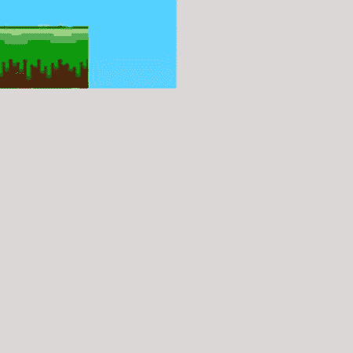
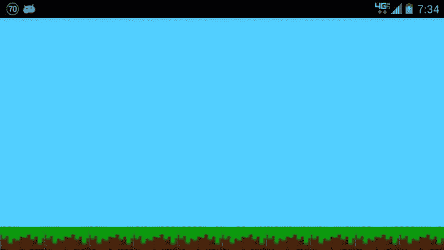

# 十、使用瓷砖建造关卡

在这一章中，你将会看到两种用瓷砖建造关卡的方法。许多 2D 游戏(特别是侧滚平台和自上而下的冒险/RTS 风格的游戏)都实现了用可重复的瓷砖构建的关卡。

如果你在用瓷砖建造关卡时有困难，这一章应该会有帮助。第一个方法是从一个 sprite 表中加载图块并创建一个关卡贴图。第二个配方将使用精灵表和级别映射，然后从瓷砖创建一个完整的级别。

10.1 从子画面表加载图块

问题

用于创建关卡的图块存储在 sprite sheet 中，无法确定在哪个位置使用哪个图块。

解决办法

使用纹理加载器将瓷砖纹理映射到一组顶点，并使用级别映射来指定将哪些瓷砖放置在哪里。

它是如何工作的

这个解决方案需要使用两个类。第一个类包含创建顶点和索引的信息，以及绘制图块的方法。第二个类保存纹理信息。

在第六章的中，提供了加载子画面的解决方案。这些解决方案将纹理加载方法从对象类中分离出来，以允许在一个地方加载和保存多个子画面。这个解决方案将在纹理类上进行扩展，以保存新平铺子画面。像往常一样，首先将你的精灵表复制到项目中。图 10-1 中的所示的这个例子的 sprite 表中有两个图块。一个瓷砖是地面瓷砖，有一些草和一点天空；第二个瓦片是天空瓦片。记住，你的可能有几百个。



图 10-1 。有两个图块的精灵表

`SBGTile()`类 类

将图像添加到项目中后，创建一个新类`SBGTile()`。`SBGTile()`类将设置你的顶点和索引(见清单 10-1 和 10-2 )。该类的结构应该看起来非常熟悉，因为它现在已经在其他几个解决方案中使用；但是，加粗的代码已经更改，允许加载多个 sprite 表。

***清单 10-1*** 。`SBGTile()` (OpenGL 是 1)

```java
public class SBGTile {

private FloatBuffer vertexBuffer;
private FloatBuffer textureBuffer;
private ByteBuffer indexBuffer;

private float vertices[] = {
0.0f, 0.0f, 0.0f,
1.0f, 0.0f, 0.0f,
1.0f, 1.0f, 0.0f,
0.0f, 1.0f, 0.0f,
};

private float texture[] = {
0.0f, 0.0f,
.25f, 0f,
.25f, .25f,
0f, .25f,
};

private byte indices[] = {
0,1,2,
0,2,3,
};

public SBGTile() {
ByteBufferbyteBuf = ByteBuffer.allocateDirect(vertices.length * 4);
byteBuf.order(ByteOrder.nativeOrder());
vertexBuffer = byteBuf.asFloatBuffer();
vertexBuffer.put(vertices);
vertexBuffer.position(0);

byteBuf = ByteBuffer.allocateDirect(texture.length * 4);
byteBuf.order(ByteOrder.nativeOrder());
textureBuffer = byteBuf.asFloatBuffer();
textureBuffer.put(texture);
textureBuffer.position(0);

indexBuffer = ByteBuffer.allocateDirect(indices.length);
indexBuffer.put(indices);
indexBuffer.position(0);
}

public void draw(GL10gl,int[] spriteSheet,int currentSheet) {
gl.glBindTexture(GL10.GL_TEXTURE_2D, spriteSheet[currentSheet - 1]);

gl.glFrontFace(GL10.GL_CCW);
gl.glEnable(GL10.GL_CULL_FACE);
gl.glCullFace(GL10.GL_BACK);

gl.glEnableClientState(GL10.GL_VERTEX_ARRAY);
gl.glEnableClientState(GL10.GL_TEXTURE_COORD_ARRAY);

gl.glVertexPointer(3, GL10.GL_FLOAT, 0, vertexBuffer);
gl.glTexCoordPointer(2, GL10.GL_FLOAT, 0, textureBuffer);

gl.glDrawElements(GL10.GL_TRIANGLES, indices.length, GL10.GL_UNSIGNED_BYTE, indexBuffer);

gl.glDisableClientState(GL10.GL_VERTEX_ARRAY);
gl.glDisableClientState(GL10.GL_TEXTURE_COORD_ARRAY);
gl.glDisable(GL10.GL_CULL_FACE);
}

}
```

***清单 10-2*** 。`SBGTile()` (OpenGL 是 2/3)

```java
class SBGBackground{
private final String vertexShaderCode =
"uniform mat4 uMVPMatrix;" +
"attribute vec4 vPosition;" +
"attribute vec2 TexCoordIn;" +
"varying vec2 TexCoordOut;" +
"void main() {" +
"  gl_Position = uMVPMatrix * vPosition;" +
"  TexCoordOut = TexCoordIn;" +
"}";
private final String fragmentShaderCode =
"precision mediump float;" +
"uniform vec4 vColor;" +
"uniform sampler2D TexCoordIn;" +
"uniform float posX;" +
"uniform float posY;" +
"varying vec2 TexCoordOut;" +
"void main() {" +
" gl_FragColor = texture2D(TexCoordIn, vec2(TexCoordOut.x+
posX,TexCoordOut.y + posY));"+
"}";
private float texture[] = {
0f, 0f,
.25f, 0f,
.25f, .25f,
0f, .25f,
};

private int[] textures = new int[1];
private final FloatBuffer vertexBuffer;
private final ShortBuffer drawListBuffer;
private final FloatBuffer textureBuffer;
private final int mProgram;
private int mPositionHandle;
private int mMVPMatrixHandle;

static final int COORDS_PER_VERTEX = 3;
static final int COORDS_PER_TEXTURE = 2;
static float squareCoords[] = { -1f,  1f, 0.0f,
-1f, -1f, 0.0f,
1f, -1f, 0.0f,
1f,  1f, 0.0f };

private final short drawOrder[] = { 0, 1, 2, 0, 2, 3 };

private final int vertexStride = COORDS_PER_VERTEX * 4;
public static int textureStride = COORDS_PER_TEXTURE * 4;

public SBGBackground() {
ByteBuffer bb = ByteBuffer.allocateDirect(

bb.order(ByteOrder.nativeOrder());
vertexBuffer = bb.asFloatBuffer();
vertexBuffer.put(squareCoords);
vertexBuffer.position(0);

bb = ByteBuffer.allocateDirect(texture.length * 4);
bb.order(ByteOrder.nativeOrder());
textureBuffer = bb.asFloatBuffer();
textureBuffer.put(texture);
textureBuffer.position(0);

ByteBuffer dlb = ByteBuffer.allocateDirect(
dlb.order(ByteOrder.nativeOrder());
drawListBuffer = dlb.asShortBuffer();
drawListBuffer.put(drawOrder);
drawListBuffer.position(0);

int vertexShader = SBGGameRenderer.loadShader(
GLES20.GL_VERTEX_SHADER,vertexShaderCode);
int fragmentShader = SBGGameRenderer.loadShader(
GLES20.GL_FRAGMENT_SHADER,fragmentShaderCode);

mProgram = GLES20.glCreateProgram();
GLES20.glAttachShader(mProgram, vertexShader);
GLES20.glAttachShader(mProgram, fragmentShader);
GLES20.glLinkProgram(mProgram);
}

public void draw(float[] mvpMatrix, float posX, float posY,
int[] spriteSheet, int currentSheet)   {
GLES20.glUseProgram(mProgram);
GLES20.glBindTexture(GLES20.GL_TEXTURE_2D, spriteSheet[currentSheet - 1]);
mPositionHandle = GLES20.glGetAttribLocation(mProgram, "vPosition");
GLES20.glEnableVertexAttribArray(mPositionHandle);
int vsTextureCoord = GLES20.glGetAttribLocation(mProgram, "TexCoordIn");
GLES20.glVertexAttribPointer(mPositionHandle, COORDS_PER_VERTEX,
GLES20.GL_FLOAT, false,
vertexStride, vertexBuffer);
GLES20.glVertexAttribPointer(vsTextureCoord, COORDS_PER_TEXTURE,
GLES20.GL_FLOAT, false,
textureStride, textureBuffer);
GLES20.glEnableVertexAttribArray(vsTextureCoord);
GLES20.glActiveTexture(GLES20.GL_TEXTURE0);
int fsTexture = GLES20.glGetUniformLocation(mProgram, "TexCoordOut");
int fsPosX = GLES20.glGetUniformLocation(mProgram, "posX");
int fsPosY = GLES20.glGetUniformLocation(mProgram, "posY");
GLES20.glUniform1i(fsTexture, 0);
GLES20.glUniform1f(fsPosX, posX);
GLES20.glUniform1f(fsPosY, posY);
mMVPMatrixHandle = GLES20.glGetUniformLocation(mProgram, "uMVPMatrix");

GLES20.glUniformMatrix4fv(mMVPMatrixHandle, 1, false, mvpMatrix, 0);

GLES20.glDrawElements(GLES20.GL_TRIANGLES, drawOrder.length,
GLES20.GL_UNSIGNED_SHORT, drawListBuffer);

GLES20.glDisableVertexAttribArray(mPositionHandle);
}
}
```

请特别注意加粗的行。这些行接受一个代表多个 sprite sheet 纹理的`int`数组，以及一个指示哪个 sprite sheet 用于特定绘制操作的`int`。

`SBGTextures()`类类

现在您需要一个类来处理多个 sprite 表的加载。创建一个名为`SBGTextures()`的新类，如清单 10-3 和清单 10-4 所示。

***清单 10-3*** 。`SBGTextures()` (OpenGL 是 1)

```java
public class SBGTextures {

private int[] textures = new int[2];

public SBGTextures(GL10gl){

gl.glGenTextures(2, textures, 0);

}
public int[] loadTexture(GL10gl,int texture, Context context,int textureNumber) {
InputStream imagestream = context.getResources().openRawResource(texture);
Bitmap bitmap = null;
Bitmap temp = null;

Matrix flip = new Matrix();
flip.postScale(-1f, -1f);

try {

temp = BitmapFactory.decodeStream(imagestream);
bitmap = Bitmap.createBitmap(temp, 0, 0, temp.getWidth(), temp.getHeight(), flip, true);
}catch(Exception e){

}finally {
//Always clear and close
try {
imagestream.close();
imagestream = null;
} catch (IOException e) {
}
}

gl.glBindTexture(GL10.GL_TEXTURE_2D, textures[textureNumber - 1]);

gl.glTexParameterf(GL10.GL_TEXTURE_2D, GL10.GL_TEXTURE_MIN_FILTER, GL10.GL_NEAREST);
gl.glTexParameterf(GL10.GL_TEXTURE_2D, GL10.GL_TEXTURE_MAG_FILTER, GL10.GL_LINEAR);

gl.glTexParameterf(GL10.GL_TEXTURE_2D, GL10.GL_TEXTURE_WRAP_S, GL10.GL_CLAMP_TO_EDGE);
gl.glTexParameterf(GL10.GL_TEXTURE_2D, GL10.GL_TEXTURE_WRAP_T, GL10.GL_CLAMP_TO_EDGE);

GLUtils.texImage2D(GL10.GL_TEXTURE_2D, 0, bitmap, 0);

bitmap.recycle();

return textures;
}
}
```

***清单 10-4*** 。`SBGTextures()` (OpenGL 是 2/3)

```java
public class SBGTextures {

private int[] textures = new int[2];

public SBGTextures(){
}

public void loadTexture(int texture, Context context, int textureNumber) {
InputStream imagestream = context.getResources().openRawResource(texture);
Bitmap bitmap = null;

android.graphics.Matrix flip = new android.graphics.Matrix();
flip.postScale(-1f, -1f);

try {

bitmap = BitmapFactory.decodeStream(imagestream);

}catch(Exception e){
//Handle your exceptions here
}finally {
try {
imagestream.close();
imagestream = null;
} catch (IOException e) {
//Handle your exceptions here
}
}

GLES20.glGenTextures(2, textures, 0);
GLES20.glBindTexture(GLES20.GL_TEXTURE_2D, textures[textureNumber - 1]);

GLES20.glTexParameterf(GLES20.GL_TEXTURE_2D, GLES20.GL_TEXTURE_MIN_FILTER, GLES20.GL_NEAREST);
GLES20.glTexParameterf(GLES20.GL_TEXTURE_2D, GLES20.GL_TEXTURE_MAG_FILTER, GLES20.GL_LINEAR);

GLES20.glTexParameterf(GLES20.GL_TEXTURE_2D, GLES20.GL_TEXTURE_WRAP_S, GLES20.GL_REPEAT);
GLES20.glTexParameterf(GLES20.GL_TEXTURE_2D, GLES20.GL_TEXTURE_WRAP_T, GLES20.GL_REPEAT);

GLUtils.texImage2D(GLES20.GL_TEXTURE_2D, 0, bitmap, 0);

bitmap.recycle();
}
}
```

同样，请注意每个清单中的粗体行。这里使用的`int`数组意味着你可以根据需要扩展你能容纳的独立 sprite 工作表的数量。

实例化所需的类，并在您的`Renderer`中创建一个 sprite 表数组。

```java
private SBGTile tiles = new SBGTile();
private SBGTextures textureloader;
private int[] spriteSheets = new int[2];
```

然后，在`Renderer`的`onSurfaceCreated()`方法中，设置`textureloader`，用它来加载 tiles sprite 表。

```java
textureloader = new SBGTextures(gl);
spriteSheets = textureloader.loadTexture(gl, R.drawable.tiles, context, 1);
```

现在瓷砖(作为一个纹理)可以使用了。但是游戏怎么知道瓷砖放在哪里呢？为此，您需要创建一个关卡地图。

创建关卡地图

关卡地图是游戏应该放置每一个方块的地方。该地图将是一个由`int`组成的二维数组

该图就像一个`int`值的矩阵。每个`int`值代表一个特定的图块。此解决方案中的示例只有两个不同的图块；因此，级别映射将仅由 0 和 1 组成。0 代表地面瓷砖，1 代表天空瓷砖。

将这些级别映射创建为二维数组是存储许多级别的体系结构的一种快速而简单的方法。以下是该解决方案的二维阵列级映射示例。

```java
int map[][] = {
{0,0,0,0,0,0,0,0,0,0},
{1,1,1,1,1,1,1,1,1,1},
{1,1,1,1,1,1,1,1,1,1},
{1,1,1,1,1,1,1,1,1,1},
{1,1,1,1,1,1,1,1,1,1},
{1,1,1,1,1,1,1,1,1,1},
{1,1,1,1,1,1,1,1,1,1},
{1,1,1,1,1,1,1,1,1,1},
{1,1,1,1,1,1,1,1,1,1},
{1,1,1,1,1,1,1,1,1,1},
};
```

在这里，我们创建了一个 10x 10 的 0 和 1 的数组来表示平铺在屏幕上的位置。在下一个解决方案中，您将编写一个 tiles 引擎来读取这个数组，并将 tiles 实际放置在屏幕上的正确位置。

10.2 从瓷砖创建一个级别

问题

您的游戏无法读取关卡地图`int`数组来使用瓷砖创建关卡。

解决办法

创建一个图块引擎，它读入数组并在所需位置写出图块。

它是如何工作的

该解决方案将带您构建一个 tile 引擎。平铺引擎读入级别贴图数组，一次一个维度，然后根据数组中的值绘制平铺。

在前一个解决方案中，我们创建了一个只有两个值的数组，即 0 和 1。这些值对应于 sprite 表中的两个图块。请记住，你可以很容易地有更多的瓷砖，给你一个看起来更精致的水平。

**提示**如果您使用更多的图块，从而在您的数组中有更多的`int`,您将不得不对该图块引擎进行的唯一更改是向`switch...case`语句添加更多的事例。

第一步是在您的`Renderer`中创建一个`drawTiles()`方法。

对于 OpenGL ES 1:

```java
private void drawtiles(GL10 gl, int[][] map){

}
```

对于 OpenGL ES 2/3:

```java
private void drawtiles(int[][] map){

}
```

`drawTiles()`方法将接受您的二维数组地图并遍历它。但是，在遍历数组之前，需要设置两个变量。

这些变量的目的是在您将图块设置到位时转换模型矩阵。这里的概念是，您读入地图数组的第一个元素，然后设置并绘制相应的图块。然后，您必须将模型矩阵平移到屏幕上的下一个位置，以便放置下一个图块。

```java
float tileLocY = 0f;
float tileLocX = 0f;
```

现在，创建一个嵌套的`for`循环，它将迭代 map 数组的两个维度。

```java
for(int x=0; x<10; x++){
for(int y=0; y<10; y++){

}
}
```

如果你使用的是 OpenGL ES 1，第一步就是缩放和转换模型矩阵，然后设置纹理矩阵。

```java
for(int x=0; x<10; x++){
for(int y=0; y<10; y++){

gl.glMatrixMode(GL10.GL_MODELVIEW);
gl.glLoadIdentity();
gl.glPushMatrix();
gl.glScalef(.20f, .20f, 1f);
gl.glTranslatef(tileLocY, tileLocX, 0f);

gl.glMatrixMode(GL10.GL_TEXTURE);
gl.glLoadIdentity();
}
}
```

注意在加粗的代码中，模型矩阵被之前设置的`tileLocY`和`tileLocX`值转换。随着循环的进行，这些变量将递增，以便将下一个图块放置在正确的位置。

下一步是设置一个简单的`switch...case`语句来读取 map 数组的当前元素。

```java
for(int x=0; x<10; x++){
for(int y=0; y<10; y++){

gl.glMatrixMode(GL10.GL_MODELVIEW);
gl.glLoadIdentity();
gl.glPushMatrix();
gl.glScalef(.20f, .20f, 1f);
gl.glTranslatef(tileLocY, tileLocX, 0f);

gl.glMatrixMode(GL10.GL_TEXTURE);
gl.glLoadIdentity();

switch(map[x][y]){
case 1:
break;
case 0:
break;
}
}
}
```

因为，在这一点上，矩阵模式已经被设置为纹理，你在`switch...case`语句中唯一要做的事情就是将 sprite 表转换为正确的 tile 图像。

```java
switch(map[x][y]){
case 1:
gl.glTranslatef(.75f,.75f, 0f);
break;
case 0:
gl.glTranslatef(.75f,1f, 0f);
break;
}
```

**提示**关于使用精灵工作表的更多信息，参见第六章“加载精灵工作表”

瓷砖是在适当的位置，纹理设置为正确的图像。现在绘制图块并增加`tileLocY`变量以移动到下一个位置。

```java
switch(map[x][y]){
case 1:
gl.glTranslatef(.75f,.75f, 0f);
break;
case 0:
gl.glTranslatef(.75f,1f, 0f);
break;
}
tiles.draw(gl, spriteSheets, SBG_TILE_PTR);
tileLocY += .50;
```

剩余的嵌套循环在每个新行上弹出矩阵，并根据需要推进`tileLocX`变量。

如果您使用的是 OpenGL ES 2/3，概念保持不变，但过程略有不同。您仍然需要遍历地图的每个值，并使用一个`switch`语句来处理每种情况。不同之处在于，不像在 OpenGL ES 1 中那样翻译矩阵，您可以简单地将每个图块的位置传递给`drawtiles()`方法。这与你使用 sprite 工作表的过程是一样的(见第六章关于 sprite 工作表的更深入的讨论)。清单 10-5 显示了完成的方法应该是什么样子。完成的 OpenGL ES 2/3 版本的`drawtiles()`如清单 10-6 所示。

***清单 10-5*** 。`drawtiles()` (OpenGL 是 1)

```java
private void drawtiles(GL10gl){
float tileLocY = 0f;
float tileLocX = 0f;
for(int x=0; x<10; x++){
for(int y=0; y<10; y++){

gl.glMatrixMode(GL10.GL_MODELVIEW);
gl.glLoadIdentity();
gl.glPushMatrix();
gl.glScalef(.20f, .20f, 1f);
gl.glTranslatef(tileLocY, tileLocX, 0f);

gl.glMatrixMode(GL10.GL_TEXTURE);
gl.glLoadIdentity();

switch(map[x][y]){
case 1:
gl.glTranslatef(.75f,.75f, 0f);
break;
case 0:
gl.glTranslatef(.75f,1f, 0f);
break;
}
tiles.draw(gl, spriteSheets, SBG_TILE_PTR);
tileLocY += .50;
}
gl.glPopMatrix();
gl.glLoadIdentity();
tileLocY = 0f;
tileLocX += .50;
}
}
```

***清单 10-6*** 。`drawtiles()` (OpenGL 是 2/3)

```java
private void drawtiles(){
float tileLocY = 0f;
float tileLocX = 0f;
Matrix.translateM(mTMatrix, 0, tileLocX, tileLocT, 0);
Matrix.multiplyMM(mMVPMatrix, 0, mTMatrix, 0, mMVPMatrix, 0) ;
for(int x=0; x<10; x++){
for(int y=0; y<10; y++){

switch(map[x][y]){
case 1:
tiles.draw(mMPVMatrix, .75f, .75, spriteSheets, SBG_TILE_PTR);
break;
case 0:
tiles.draw(mMPVMatrix, .75f, .75, spriteSheets, SBG_TILE_PTR);
break;
}

tileLocY += .50;
}
tileLocY = 0f;
tileLocX += .50;
}
}
```

如果你正在使用 OpenGL ES 2/3，确保在你的`Renderer`中设置一个新的翻译矩阵(清单 10-6 中的`mTMatrix`)。平移矩阵的工作是移动瓷砖的位置。它是 OpenGL ES 2/3 版的`glTranslatef()`。下面的代码显示了转换矩阵。

```java
public class SBGGameRenderer implements GLSurfaceView.Renderer {
...
private final float[] mTMatrix = new float[16];
...
@Override
public void onDrawFrame(GL10 unused) {
GLES20.glClear(GLES20.GL_COLOR_BUFFER_BIT);
Matrix.setLookAtM(mVMatrix, 0, 0, 0, -3, 0f, 0f, 0f, 0f, 1.0f, 0.0f);
Matrix.multiplyMM(mMVPMatrix, 0, mProjMatrix, 0, mVMatrix, 0);
drawtiles();

...

}
}
```

由该贴图数组和子画面组合产生的级别显示在图 10-2 中。



图 10-2 。一个简单的关卡，由关卡地图和方块组成

请记住，要利用更多的图块，只需扩展您的`switch...case`语句的范围。