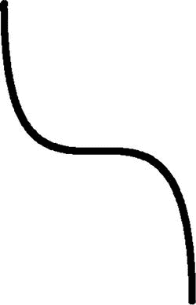

# 十二、移动敌人

在屏幕上移动角色——无论是人、动物、机器人还是车辆——是引人注目的游戏中最重要的部分之一。如果你试图创造一个在游戏中自由移动的角色，你可能会遇到一些问题。

这一章将介绍帮助你在游戏中增加敌人的方法。本章的解决方案包括将敌人装载到游戏中预定的位置，并沿着特定的路径移动敌人。

12.1 将敌人装载到预定位置

问题

游戏没有在正确的位置装载敌人。

解决办法

使用一个类来确定敌人的产卵点在哪里。

它是如何工作的

许多游戏类型都有“繁殖点”,玩家可以在那里繁殖后代。要在这些预定的位置繁殖敌人，你需要在你的敌人职业中添加一些`floats`，然后使用这些`floats`将敌人的模型矩阵转换到繁殖位置。

本章的解决方案将基于一个基本的角色职业，而这个职业又是基于第七章和第八章中的`SBGBackground`职业。鉴于我们现在谈论的是游戏中的敌人，让我们重新命名这个职业`SBGEnemy`。该类的内容应该如清单 12-1 和清单 12-2 所示。

***清单 12-1*** 。`SBGEnemy()` (OpenGL 是 1)

```java
public class SBGEnemy {

private FloatBuffer vertexBuffer;
private FloatBuffer textureBuffer;
private ByteBuffer indexBuffer;

private float vertices[] = {
0.0f, 0.0f, 0.0f,
1.0f, 0.0f, 0.0f,
1.0f, 1.0f, 0.0f,
0.0f, 1.0f, 0.0f,
};

private float texture[] = {
0.0f, 0.0f,
0.25f, 0.0f,
0.25f, 0.25f,
0.0f, 0.25f,
};

private byte indices[] = {
0,1,2,
0,2,3,
};

public SBGEnemy() {

ByteBuffer byteBuf = ByteBuffer.allocateDirect(vertices.length * 4);
byteBuf.order(ByteOrder.nativeOrder());
vertexBuffer = byteBuf.asFloatBuffer();
vertexBuffer.put(vertices);
vertexBuffer.position(0);

byteBuf = ByteBuffer.allocateDirect(texture.length * 4);
byteBuf.order(ByteOrder.nativeOrder());
textureBuffer = byteBuf.asFloatBuffer();
textureBuffer.put(texture);
textureBuffer.position(0);

indexBuffer = ByteBuffer.allocateDirect(indices.length);
indexBuffer.put(indices);
indexBuffer.position(0);
}

public void draw(GL10gl, int[] spriteSheet) {
gl.glBindTexture(GL10.GL_TEXTURE_2D, spriteSheet[0]);
gl.glFrontFace(GL10.GL_CCW);
gl.glEnable(GL10.GL_CULL_FACE);
gl.glCullFace(GL10.GL_BACK);

gl.glEnableClientState(GL10.GL_VERTEX_ARRAY);
gl.glEnableClientState(GL10.GL_TEXTURE_COORD_ARRAY);

gl.glVertexPointer(3, GL10.GL_FLOAT, 0, vertexBuffer);
gl.glTexCoordPointer(2, GL10.GL_FLOAT, 0, textureBuffer);

gl.glDrawElements(GL10.GL_TRIANGLES, indices.length, GL10.GL_UNSIGNED_BYTE, indexBuffer);

gl.glDisableClientState(GL10.GL_VERTEX_ARRAY);
gl.glDisableClientState(GL10.GL_TEXTURE_COORD_ARRAY);
gl.glDisable(GL10.GL_CULL_FACE);
   }

}
```

***清单 12-2*** 。`SBGEnemy()` (OpenGL 是 2/3)

```java
public class SBGEnemy {

private final String vertexShaderCode =
"uniform mat4 uMVPMatrix;" +

"attribute vec4 vPosition;" +
"attribute vec2 TexCoordIn;" +
"varying vec2 TexCoordOut;" +
"void main() {" +
"  gl_Position = uMVPMatrix * vPosition;" +
"  TexCoordOut = TexCoordIn;" +
"}";

private final String fragmentShaderCode =
"precision mediump float;" +
"uniform vec4 vColor;" +
"uniform sampler2D TexCoordIn;" +
"uniform float texX;" +
"uniform float texY;" +
"varying vec2 TexCoordOut;" +
"void main() {" +
" gl_FragColor = texture2D(TexCoordIn, vec2(TexCoordOut.x +
texX,TexCoordOut.y + texY));"+
"}";
private float texture[] = {
0f, 0f,
.25f, 0f,
.25f, .25f,
0f, .25f,
};

private int[] textures = new int[1];
private final FloatBuffer vertexBuffer;
private final ShortBuffer indexBuffer;
private final FloatBuffer textureBuffer;
private final int mProgram;
private int mPositionHandle;
private int mMVPMatrixHandle;

static final int COORDS_PER_VERTEX = 3;
static final int COORDS_PER_TEXTURE = 2;
static float vertices[] = { -1f,  1f, 0.0f,
-1f, -1f, 0.0f,
1f, -1f, 0.0f,
1f,  1f, 0.0f };

private final short indices[] = { 0, 1, 2, 0, 2, 3 };

private final int vertexStride = COORDS_PER_VERTEX * 4;
public static int textureStride = COORDS_PER_TEXTURE * 4;

public SBGEnemy() {

ByteBuffer byteBuf = ByteBuffer.allocateDirect(vertices.length * 4);
byteBuf.order(ByteOrder.nativeOrder());
vertexBuffer = byteBuf.asFloatBuffer();
vertexBuffer.put(vertices);
vertexBuffer.position(0);

byteBuf = ByteBuffer.allocateDirect(texture.length * 4);
byteBuf.order(ByteOrder.nativeOrder());
textureBuffer = byteBuf.asFloatBuffer();
textureBuffer.put(texture);
textureBuffer.position(0);

indexBuffer = ByteBuffer.allocateDirect(indices.length);
indexBuffer.put(indices);
indexBuffer.position(0);

int vertexShader = SBGGameRenderer.loadShader(
GLES20.GL_VERTEX_SHADER, vertexShaderCode);
int fragmentShader = SBGGameRenderer.loadShader(
GLES20.GL_FRAGMENT_SHADER,fragmentShaderCode);

mProgram = GLES20.glCreateProgram();
GLES20.glAttachShader(mProgram, vertexShader);
GLES20.glAttachShader(mProgram, fragmentShader);
GLES20.glLinkProgram(mProgram);
}

public void draw(float[] mvpMatrix, int texX, int texY, int[] spriteSheet) {
GLES20.glUseProgram(mProgram);

mPositionHandle = GLES20.glGetAttribLocation(mProgram, "vPosition");

GLES20.glEnableVertexAttribArray(mPositionHandle);

int vsTextureCoord = GLES20.glGetAttribLocation(mProgram, "TexCoordIn");
GLES20.glVertexAttribPointer(mPositionHandle, COORDS_PER_VERTEX,
GLES20.GL_FLOAT, false,
vertexStride, vertexBuffer);
GLES20.glVertexAttribPointer(vsTextureCoord, COORDS_PER_TEXTURE,
GLES20.GL_FLOAT, false,
textureStride, textureBuffer);
GLES20.glEnableVertexAttribArray(vsTextureCoord);
GLES20.glActiveTexture(GLES20.GL_TEXTURE0);
GLES20.glBindTexture(GLES20.GL_TEXTURE_2D, spriteSheet[0]);

int fsTexture = GLES20.glGetUniformLocation(mProgram, "TexCoordOut");
int fsTexX = GLES20.glGetUniformLocation(mProgram, "texX");
int fsTexY = GLES20.glGetUniformLocation(mProgram, "texY");
GLES20.glUniform1i(fsTexture, 0);
GLES20.glUniform1f(fsTexX, texX);
GLES20.glUniform1f(fsTexY, texY);

mMVPMatrixHandle = GLES20.glGetUniformLocation(mProgram, "uMVPMatrix");

GLES20.glUniformMatrix4fv(mMVPMatrixHandle, 1, false, mvpMatrix, 0);

GLES20.glDrawElements(GLES20.GL_TRIANGLES, drawOrder.length,
GLES20.GL_UNSIGNED_SHORT, indexBuffer);

GLES20.glDisableVertexAttribArray(mPositionHandle);
   }
}
```

然后修改这个类，添加两个 floats。一个浮动将跟踪 x 轴的繁殖位置，另一个浮动将跟踪 y 轴的繁殖位置(见清单 12-3 )。

***清单 12-3*** 。追踪产卵位置的浮标

```java
public class SBGEnemy {

public float posY = 0f;
public float posX = 0f;

...

}
```

在`SBGEnemy`构造函数中将这些浮点数设置到期望的产卵位置(见清单 12-4 )。

***清单 12-4*** 。给位置浮动赋值

```java
public class SBGEnemy {

public float posY = 0f;
public float posX = 0f;
...
public SBGEnemy() {
posX = .25;
posY = .25;
...
}
...

}
```

现在你可以使用 OpenGL ES 1 的`glTranslatef()`方法调用中的`SBGEnemy.posX`和`SBGEnemy.posY`在你绘制敌人的模型矩阵之前将它移动到产卵位置。您可以在 OpenGL ES 2/3 的`Matrix.translateM()`方法中使用相同的属性。在清单 12-5 和清单 12-6 中显示的`spawnEnemy()`方法，可以在你的游戏中创建，以帮助你在一个位置产生敌人。

***清单 12-5*** 。`spawnEnemy()` (OpenGL 是 1)

```java
private SFEnemy enemy = new SFEnemy();

spawnEnemy(){
gl.glMatrixMode(GL10.GL_MODELVIEW);
gl.glLoadIdentity();
gl.glPushMatrix();
gl.glScalef(.25f, .25f, 1f);
gl.glTranslatef(enemy.posX, enemy.posY, 0f);
}
```

***清单 12-6*** 。`spawnEnemy()` (OpenGL 是 2/3)

```java
private SFEnemy enemy = new SFEnemy();

spawnEnemy(){
Matrix.translateM(mTMatrix, 0, enemy.posX, enemy.posY, 0);
Matrix.multiplyMM(mMVPMatrix, 0, mTMatrix, 0, mMVPMatrix, 0);
}

```

12.2 将敌人装载到随机地点

问题

游戏需要在随机的地点产生敌人。

解决办法

修改最后一个解决方案，为产卵的敌人创造“随机”的位置。

它是如何工作的

许多游戏会在随机地点产生敌人。这增加了你游戏的难度，因为它剥夺了预先设定的产卵位置的可预测性。

上一个解决方案中的代码可以很容易地修改，以生成随机的产卵位置。清单 12-7 和 12-8 显示了应该进行的修改，以适应随机的产卵位置。

***清单 12-7*** 。`SBGEnemy()`对于随机位置(OpenGL ES 1)

```java
public class SBGEnemy {

public float posY = 0f;
public float posX = 0f;

private FloatBuffer vertexBuffer;
private FloatBuffer textureBuffer;
private ByteBuffer indexBuffer;

private float vertices[] = {
0.0f, 0.0f, 0.0f,
1.0f, 0.0f, 0.0f,
1.0f, 1.0f, 0.0f,
0.0f, 1.0f, 0.0f,
};

private float texture[] = {
0.0f, 0.0f,
0.25f, 0.0f,
0.25f, 0.25f,
0.0f, 0.25f,
};

private byte indices[] = {
0,1,2,
0,2,3,
};

public SBGEnemy() {
Random randomPos = new Random();
posX = randomPos.nextFloat() * 3;
posY = randomPos.nextFloat() * 3;

ByteBuffer byteBuf = ByteBuffer.allocateDirect(vertices.length * 4);
byteBuf.order(ByteOrder.nativeOrder());
vertexBuffer = byteBuf.asFloatBuffer();
vertexBuffer.put(vertices);
vertexBuffer.position(0);

byteBuf = ByteBuffer.allocateDirect(texture.length * 4);
byteBuf.order(ByteOrder.nativeOrder());
textureBuffer = byteBuf.asFloatBuffer();
textureBuffer.put(texture);
textureBuffer.position(0);

indexBuffer = ByteBuffer.allocateDirect(indices.length);
indexBuffer.put(indices);
indexBuffer.position(0);
}

public void draw(GL10gl, int[] spriteSheet) {
gl.glBindTexture(GL10.GL_TEXTURE_2D, spriteSheet[0]);

gl.glFrontFace(GL10.GL_CCW);
gl.glEnable(GL10.GL_CULL_FACE);
gl.glCullFace(GL10.GL_BACK);

gl.glEnableClientState(GL10.GL_VERTEX_ARRAY);
gl.glEnableClientState(GL10.GL_TEXTURE_COORD_ARRAY);

gl.glVertexPointer(3, GL10.GL_FLOAT, 0, vertexBuffer);
gl.glTexCoordPointer(2, GL10.GL_FLOAT, 0, textureBuffer);

gl.glDrawElements(GL10.GL_TRIANGLES, indices.length, GL10.GL_UNSIGNED_BYTE, indexBuffer);

gl.glDisableClientState(GL10.GL_VERTEX_ARRAY);
gl.glDisableClientState(GL10.GL_TEXTURE_COORD_ARRAY);
gl.glDisable(GL10.GL_CULL_FACE);
   }

}
```

***清单 12-8*** 。`SBGEnemy()`对于随机位置(OpenGL ES 2/3)

```java
public class SBGEnemy {

private final String vertexShaderCode =
"uniform mat4 uMVPMatrix;" +

"attribute vec4 vPosition;" +
"attribute vec2 TexCoordIn;" +
"varying vec2 TexCoordOut;" +
"void main() {" +
"  gl_Position = uMVPMatrix * vPosition;" +
"  TexCoordOut = TexCoordIn;" +
"}";

private final String fragmentShaderCode =
"precision mediump float;" +
"uniform vec4 vColor;" +
"uniform sampler2D TexCoordIn;" +
"uniform float texX;" +
"uniform float texY;" +
"varying vec2 TexCoordOut;" +
"void main() {" +
" gl_FragColor = texture2D(TexCoordIn, vec2(TexCoordOut.x +
texX,TexCoordOut.y + texY));"+
"}";
private float texture[] = {
0f, 0f,
.25f, 0f,
.25f, .25f,
0f, .25f,
};

private int[] textures = new int[1];
private final FloatBuffer vertexBuffer;
private final ShortBuffer indexBuffer;
private final FloatBuffer textureBuffer;
private final int mProgram;
private int mPositionHandle;
private int mMVPMatrixHandle;

static final int COORDS_PER_VERTEX = 3;
static final int COORDS_PER_TEXTURE = 2;
static float vertices[] = { -1f,  1f, 0.0f,
-1f, -1f, 0.0f,
1f, -1f, 0.0f,
1f,  1f, 0.0f };

private final short indices[] = { 0, 1, 2, 0, 2, 3 };

private final int vertexStride = COORDS_PER_VERTEX * 4;
public static int textureStride = COORDS_PER_TEXTURE * 4;

public SBGEnemy() {
Random randomPos = new Random();
posX = randomPos.nextFloat() * 3;
posY = randomPos.nextFloat() * 3;

ByteBuffer byteBuf = ByteBuffer.allocateDirect(vertices.length * 4);
byteBuf.order(ByteOrder.nativeOrder());
vertexBuffer = byteBuf.asFloatBuffer();
vertexBuffer.put(vertices);
vertexBuffer.position(0);

byteBuf = ByteBuffer.allocateDirect(texture.length * 4);
byteBuf.order(ByteOrder.nativeOrder());
textureBuffer = byteBuf.asFloatBuffer();
textureBuffer.put(texture);
textureBuffer.position(0);

indexBuffer = ByteBuffer.allocateDirect(indices.length);
indexBuffer.put(indices);
indexBuffer.position(0);

int vertexShader = SBGGameRenderer.loadShader(
GLES20.GL_VERTEX_SHADER,vertexShaderCode);
int fragmentShader = SBGGameRenderer.loadShader(
GLES20.GL_FRAGMENT_SHADER,fragmentShaderCode);

mProgram = GLES20.glCreateProgram();
GLES20.glAttachShader(mProgram, vertexShader);
GLES20.glAttachShader(mProgram, fragmentShader);
GLES20.glLinkProgram(mProgram);
}

public void draw(float[] mvpMatrix, int texX, int texY, int[] spriteSheet) {
GLES20.glUseProgram(mProgram);

mPositionHandle = GLES20.glGetAttribLocation(mProgram, "vPosition");

GLES20.glEnableVertexAttribArray(mPositionHandle);

int vsTextureCoord = GLES20.glGetAttribLocation(mProgram, "TexCoordIn");
GLES20.glVertexAttribPointer(mPositionHandle, COORDS_PER_VERTEX,
GLES20.GL_FLOAT, false,
vertexStride, vertexBuffer);
GLES20.glVertexAttribPointer(vsTextureCoord, COORDS_PER_TEXTURE,
GLES20.GL_FLOAT, false,
textureStride, textureBuffer);
GLES20.glEnableVertexAttribArray(vsTextureCoord);
GLES20.glActiveTexture(GLES20.GL_TEXTURE0);
GLES20.glBindTexture(GLES20.GL_TEXTURE_2D, spriteSheet[0]);

int fsTexture = GLES20.glGetUniformLocation(mProgram, "TexCoordOut");
int fsTexX = GLES20.glGetUniformLocation(mProgram, "texX");
int fsTexY = GLES20.glGetUniformLocation(mProgram, "texY");
GLES20.glUniform1i(fsTexture, 0);
GLES20.glUniform1f(fsTexX, texX);
GLES20.glUniform1f(fsTexY, texY);

mMVPMatrixHandle = GLES20.glGetUniformLocation(mProgram, "uMVPMatrix");

GLES20.glUniformMatrix4fv(mMVPMatrixHandle, 1, false, mvpMatrix, 0);

GLES20.glDrawElements(GLES20.GL_TRIANGLES, drawOrder.length,
GLES20.GL_UNSIGNED_SHORT, indexBuffer);

GLES20.glDisableVertexAttribArray(mPositionHandle);
   }
}
```

这个解决方案建立在您在前一个解决方案中创建的`posX`和`posY`属性的基础上。不再用静态值填充这些属性，`SBGEnemy`类的构造函数现在将随机填充位置到`posX`和`posY`浮动中。结果就是现在当你从`spanEnemy()`方法调用`SBGEnemy.posX`和`SBGEnemy.posY`的时候，敌人会在屏幕上的随机位置被创造出来。

12.3 沿着路径移动敌人

问题

敌人不会沿着预定的路径移动。

解决办法

使用算法为角色创建自动移动的路径。

它是如何工作的

这个解决方案是为了让你的敌人沿着一条特定的路径移动，这条路径被称为贝塞尔曲线。贝塞尔曲线通常在游戏中使用，因为它们可以通过一个相当简单的算法很容易地产生。他们也可以被修改来创造变化，使游戏变得有趣和不可预测。图 12-1 展示了贝赛尔曲线的样子。



图 12-1 。二次贝塞尔曲线

为了让敌人以二次贝塞尔曲线从屏幕顶部移动到底部，你需要两种方法。您可以创建一个方法来获取贝塞尔曲线上的下一个 x 轴值，并创建一个方法来给出贝塞尔曲线上的下一个 y 轴值。每次你调用这些方法时，你会得到 x 和 y 轴上的下一个特定敌人需要移动到的位置。一旦你有了这些位置，你使用`glTranslatef()`移动模型矩阵到计算的位置。

幸运的是，在贝塞尔曲线上画点相当简单。要构建一条二次贝塞尔曲线，你需要四个笛卡尔点:一个起点，一个终点，以及曲线环绕的两个曲线点。现在我们来回顾一下如何做到这一点。

创建八个新的浮点数来跟踪这些点的 x 和 y 坐标，如清单 12-9 所示。

***清单 12-9*** 。贝塞尔跟踪坐标

```java
public static final float BEZIER_X_1 = 0f;
public static final float BEZIER_X_2 = 1f;
public static final float BEZIER_X_3 = 2.5f;
public static final float BEZIER_X_4 = 3f;
public static final float BEZIER_Y_1 = 0f;
public static final float BEZIER_Y_2 = 2.4f;
public static final float BEZIER_Y_3 = 1.5f;
public static final float BEZIER_Y_4 = 2.6f;
```

修改`SBGEnemy`类，给现有的`posX`和`posY`添加一个`posT`浮动，如清单 12-10 所示。

***清单 12-10*** 。`posT`

```java
public class SBGEnemy {
public float posY = 0f; //the x position of the enemy
public float posX = 0f; //the y position of the enemy
public float posT = 0f; //the t used in calculating a Bezier curve

...
}
```

绘制点的关键值称为 t 位置。t 位置告诉公式您在曲线上的位置，从而允许公式计算该单个位置的 x 或 y 坐标。

提示如果你不理解以下公式背后的数学原理，有很多很好的资源，包括一个 wiki，可以找到贝塞尔曲线。

在你的`SBGEnemy()`类中创建两个方法(参见清单 12-11 )。一种方法用于获取下一个 x 轴值，一种方法用于获取下一个 y 轴值。此外，将随机值添加到`posX`和`posY`浮点中，并将一个设定值添加到`posT`中。

***清单 12-11*** 。播种位置值

```java
public class SBGEnemy {
public float posY = 0f; //the x position of the enemy
public float posX = 0f; //the y position of the enemy
public float posT = 0f; //the t used in calculating a Bezier curve

public SBGEnemy() {
posY = (randomPos.nextFloat() * 4) + 4;
posX = randomPos.nextFloat() * 3;
posT = .012;

}

public float getNextPosX(){

}
public float getNextPosY(){

}

}
```

在 y 轴上的二次贝塞尔曲线上寻找一个点的公式如下:

```java
(y1*(??)) + (y2 * 3 * (??) * (1-t)) + (y3 * 3 * t * (1-t)2) + (y4* (1-t)3)
```

**注意**要得到 x 轴点，只需将前面等式中的 y 替换为 x 即可。

在你的`getNextPosY()` 中使用这个公式来计算你的敌人的位置(见清单 12-12 )。

***清单 12-12*** 。`getNextPosY()`

```java
public class SBGEnemy {
public float posY = 0f; //the x position of the enemy
public float posX = 0f; //the y position of the enemy
public float posT = 0f; //the t used in calculating a Bezier curve

public SBGEnemy() {
posY = (randomPos.nextFloat() * 4) + 4;
posX = randomPos.nextFloat() * 3;
posT = .012;

}

public float getNextPosX(){

}

public float getNextPosY(){
return (float)((BEZIER_Y_1*(posT*posT*posT)) +
(BEZIER_Y_2 * 3 * (posT * posT) * (1-posT)) +
(BEZIER_Y_3 * 3 * posT * ((1-posT) * (1-posT))) +
(BEZIER_Y_4 * ((1-posT) * (1-posT) * (1-posT))));
}

}
```

对 x 轴使用同样的公式，稍作修改，如清单 12-13 所示。

***清单 12-13*** 。`getNextPosX()`

```java
public class SBGEnemy {
public float posY = 0f; //the x position of the enemy
public float posX = 0f; //the y position of the enemy
public float posT = 0f; //the t used in calculating a Bezier curve

public SBGEnemy() {
posY = (randomPos.nextFloat() * 4) + 4;
posX = randomPos.nextFloat() * 3;
posT = sfengine.SCOUT_SPEED;

}

public float getNextPosX(){
return (float)((BEZIER_X_4*(posT*posT*posT)) +
(BEZIER_X_3 * 3 * (posT * posT) * (1-posT)) +
(BEZIER_X_2 * 3 * posT * ((1-posT) * (1-posT))) +
(BEZIER_X_1 * ((1-posT) * (1-posT) * (1-posT))));

 }

public float getNextPosY(){
return (float)((BEZIER_Y_1*(posT*posT*posT)) +
(BEZIER_Y_2 * 3 * (posT * posT) * (1-posT)) +
(BEZIER_Y_3 * 3 * posT * ((1-posT) * (1-posT))) +
(BEZIER_Y_4 * ((1-posT) * (1-posT) * (1-posT))));
}

}
```

注意，当计算 x 轴的右侧时，值是 x1、x2、x3，然后是 x4；然而，从左侧开始，这些点以相反的顺序使用，x4、x3、x2，然后是 x1。

现在，在游戏循环的每次执行中，将`SBGEnemy.posX`设置为`SBGEnemy.getNextPosX()`并将`SBGEnemy.posY`设置为`SBGEnemy.getNextPosY()`，然后将模型矩阵平移到`posX`和`posY`点，就像你一直在做的那样。