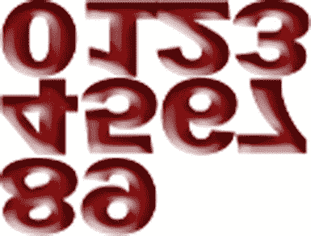

# 十六、得分

到目前为止，本书已经解决了许多与 Android 游戏开发相关的问题。从移动角色到碰撞检测，你的游戏应该进展顺利。然而，一个基本的问题还没有解决:你如何保持得分？

得分是大多数游戏不可或缺的一部分。没有分数，玩家将无法确定他们在游戏中的进展如何，也无法将他们的进展与其他玩家进行比较。从最早的电子游戏开始，分数一直是许多玩家吹嘘的中心。

在这一章中，我将介绍一些与游戏中记分相关的常见问题的解决方案。解决方案应该适用于大多数游戏类型。

16.1 给对象分配点值

问题

该游戏不会因为玩家破坏物品而给其评分。

解决办法

修改对象的类，为其分配分数。

它是如何工作的

这个解决方案包括给对象分配点值，并使用这些值作为玩家的分数。在游戏中给一个对象赋值非常容易，只需要修改对象的类。

在游戏中，物体可以是任何你想要赋值的东西。例如，敌人、易碎物品和屏幕上的目标(如关卡中的路点)都可以被分配一个分值，然后用于计算玩家的分数。

给敌人分配一个点值，修改敌人的职业增加一个名为`pointValue`的属性。在这个例子中，我们将修改在本书中多次使用的`SBGEnemy()`类，并给它赋值 3。

```java
public class SBGEnemy {
public boolean isDead = false;

public int pointValue = 3;
...

}
```

同样的解决方案可以应用到你游戏中的所有职业，给每个职业分配一个分值，这个分值可以用于游戏的总分数。

这个解决方案的另一种实现方式是以毕业的形式。例如，我们可以使用一个类来创建多个对象，每个对象都有不同的点值。看一看下面的类。这个类取自我写的一个突破式游戏，其中一个砖块类被用来创建五种不同的砖块。

类是用 OpenGL ES 1 写的；然而，OpenGL ES 代码对于解决方案并不重要。如果你的游戏是在 OpenGL ES 2/3 中，不要担心，因为对这个类的修改不是特定于 OpenGL ES 版本的，可以很容易地跟随。

***清单 16-1*** 。`PBBrick()`

```java
public class PBBrick {

public float posY = 0f;
public float posX = 0f;
public float posT = 0f;

public boolean isDestroyed = false;

public int brickType = 0;

private FloatBuffer vertexBuffer;
private FloatBuffer textureBuffer;
private ByteBuffer indexBuffer;

private float vertices[] = {
0.0f, 0.0f, 0.0f,
1.0f, 0.0f, 0.0f,
1.0f, .25f, 0.0f,
0.0f, .25f, 0.0f,
};

private float texture[] = {
0.0f, 0.0f,
0.25f, 0.0f,
0.25f, 0.25f,
0.0f, 0.25f,
};

private byte indices[] = {
0,1,2,
0,2,3,
};

public PBBrick(int type) {
brickType = type;

ByteBuffer byteBuf = ByteBuffer.allocateDirect(vertices.length * 4);
byteBuf.order(ByteOrder.nativeOrder());
vertexBuffer = byteBuf.asFloatBuffer();
vertexBuffer.put(vertices);
vertexBuffer.position(0);

byteBuf = ByteBuffer.allocateDirect(texture.length * 4);
byteBuf.order(ByteOrder.nativeOrder());
textureBuffer = byteBuf.asFloatBuffer();
textureBuffer.put(texture);
textureBuffer.position(0);

indexBuffer = ByteBuffer.allocateDirect(indices.length);
indexBuffer.put(indices);
indexBuffer.position(0);
}

public void draw(GL10gl, int[] spriteSheet) {
gl.glBindTexture(GL10.GL_TEXTURE_2D, spriteSheet[0]);

gl.glFrontFace(GL10.GL_CCW);
gl.glEnable(GL10.GL_CULL_FACE);
gl.glCullFace(GL10.GL_BACK);

gl.glEnableClientState(GL10.GL_VERTEX_ARRAY);
gl.glEnableClientState(GL10.GL_TEXTURE_COORD_ARRAY);

gl.glVertexPointer(3, GL10.GL_FLOAT, 0, vertexBuffer);
gl.glTexCoordPointer(2, GL10.GL_FLOAT, 0, textureBuffer);

gl.glDrawElements(GL10.GL_TRIANGLES, indices.length, GL10.GL_UNSIGNED_BYTE, indexBuffer);

gl.glDisableClientState(GL10.GL_VERTEX_ARRAY);
gl.glDisableClientState(GL10.GL_TEXTURE_COORD_ARRAY);
gl.glDisable(GL10.GL_CULL_FACE);
}

}
```

让我们修改这个类，以便为五种不同类型的砖块分配一个从 1 到 5 的不同分值。

***清单 16-2*** 。`PBBrick()`修改

```java
public class PBBrick {

public float posY = 0f;
public float posX = 0f;
public float posT = 0f;

public boolean isDestroyed = false;

public int brickType = 0;

public int pointValue = 0;

private FloatBuffer vertexBuffer;
private FloatBuffer textureBuffer;
private ByteBuffer indexBuffer;

private float vertices[] = {
0.0f, 0.0f, 0.0f,
1.0f, 0.0f, 0.0f,
1.0f, .25f, 0.0f,
0.0f, .25f, 0.0f,
};

private float texture[] = {
0.0f, 0.0f,
0.25f, 0.0f,
0.25f, 0.25f,
0.0f, 0.25f,
};

private byte indices[] = {
0,1,2,
0,2,3,
};

public PBBrick(int type) {
brickType = type;

switch(type){
case 1:
pointValue = 1;
break;
case 2:
pointValue = 2;
break;
case 3:
pointValue = 3;
break;
case 4:
pointValue = 4;
break;
case 5:
pointValue = 5;
break;

}

ByteBuffer byteBuf = ByteBuffer.allocateDirect(vertices.length * 4);
byteBuf.order(ByteOrder.nativeOrder());
vertexBuffer = byteBuf.asFloatBuffer();
vertexBuffer.put(vertices);
vertexBuffer.position(0);

byteBuf = ByteBuffer.allocateDirect(texture.length * 4);
byteBuf.order(ByteOrder.nativeOrder());
textureBuffer = byteBuf.asFloatBuffer();
textureBuffer.put(texture);
textureBuffer.position(0);

indexBuffer = ByteBuffer.allocateDirect(indices.length);
indexBuffer.put(indices);
indexBuffer.position(0);
}

...

}
```

在配方 16.2 中，你将获得分配给游戏对象的分值，并使用它们来创建玩家的分数。

16.2 添加并跟踪分数

问题

游戏不跟踪玩家的分数，即使每个对象都被分配了一个点值。

解决办法

使用游戏角色的职业来追踪整体分数。

它是如何工作的

在这个解决方案中，您将修改玩家角色的类来添加一个属性。该属性将用于跟踪玩家的总得分。修改玩家角色类后，您将修改碰撞检测方法，以便为新的分数属性指定正确的点值。

首先，修改玩家角色类，添加一个名为`overallScore`的新属性。

```java
public class SuperBanditGuy {
public boolean isDead = false;

public int overallScore = 0;
...

}
```

在第十五章中，你创建了一个执行碰撞检测的方法。由于此解决方案假设奖励点数的基础是某种碰撞(例如，破坏一个对象)，因此您将修改碰撞检测方法以在必要时指定点数。

***清单 16-3*** 。`detectCollisions()`

```java
private void detectCollisions(){
for (int y = 1; y <4; y ++){
if (playerFire[y].shotFired){
for (int x = 1; x <10; x++ ){ //assumes you have an array of 10 enemies
if(!enemies[x].isDestroyed){
if (((playerFire[y].posY>= enemies[x].posY
&& playerFire[y].posY<= enemies[x].posY + 1f )  ||
(playerFire[y].posY +.25f>= enemies[x].posY
&& playerFire[y].posY + .25f<= enemies[x].posY + 1f )) &&
((playerFire[y].posX>= enemies[x].posX
&& playerFire[y].posX<= enemies[x].posX + 1f) ||
(playerFire[y].posX + .25f>= enemies[x].posX
&& playerFire[y].posX + 25f<= enemies[x].posX + 1f ))){

//collision detected between enemy and a shot
goodguy.overallScore += enemies[x].pointValue;

}
}
}
}
}
}
```

如前所述，这个方法摘自《??》第十五章。这是一个跟踪十个不同敌人碰撞的基本方法。`enemies[]`数组是一个由`SBGEnemy()`类组成的数组。方法中的`goodguy`只是`SuperBanditGuy()`类的一个实例化。

使用这个解决方案，玩家角色的总分数将会在每次消灭一个敌人时增加。

16.3 将分数写入屏幕

问题

游戏不会在屏幕上显示玩家的分数。

解决办法

使用多个 OpenGL 形状和一个 sprite 表向用户显示分数。

它是如何工作的

若要跟踪乐谱，请在项目中添加一个新的 sprite 表单，其中包含用于显示乐谱的所有数字。在图 16-1 的中可以看到这个斜桅板。



图 16-1 。分数位数 spritesheet

接下来，创建一个名为`SBGScoreTile()` 的新类。这个类将被用于在 OpenGL ES 1 和 OpenGL ES 2/3 中向屏幕显示一个纵向的分数块(参见清单 16-4 和清单 16-5 )。稍后，您将使用 sprite 工作表在图块上显示特定的分数数字。

***清单 16-4*** 。`SBGScoreTile()` (OpenGL 是 1)

```java
public class SBGScoreTile {

private FloatBuffer vertexBuffer;
private FloatBuffer textureBuffer;
private ByteBuffer indexBuffer;

private float vertices[] = {
0.0f, 0.0f, 0.0f,
0.25f, 0.0f, 0.0f,
0.25f, 1.0f, 0.0f,
0.0f, 1.0f, 0.0f,
};

private float texture[] = {
0.0f, 0.0f,
0.25f, 0.0f,
0.25f, 0.25f,
0.0f, 0.25f,
};

private byte indices[] = {
0,1,2,
0,2,3,
};

public SBGScoreTile() {

ByteBuffer byteBuf = ByteBuffer.allocateDirect(vertices.length * 4);
byteBuf.order(ByteOrder.nativeOrder());
vertexBuffer = byteBuf.asFloatBuffer();
vertexBuffer.put(vertices);
vertexBuffer.position(0);

byteBuf = ByteBuffer.allocateDirect(texture.length * 4);
byteBuf.order(ByteOrder.nativeOrder());
textureBuffer = byteBuf.asFloatBuffer();
textureBuffer.put(texture);
textureBuffer.position(0);

indexBuffer = ByteBuffer.allocateDirect(indices.length);
indexBuffer.put(indices);
indexBuffer.position(0);
}

public void draw(GL10gl) {
gl.glBindTexture(GL10.GL_TEXTURE_2D, spriteSheet[0]);

gl.glFrontFace(GL10.GL_CCW);
gl.glEnable(GL10.GL_CULL_FACE);
gl.glCullFace(GL10.GL_BACK);

gl.glEnableClientState(GL10.GL_VERTEX_ARRAY);
gl.glEnableClientState(GL10.GL_TEXTURE_COORD_ARRAY);

gl.glVertexPointer(3, GL10.GL_FLOAT, 0, vertexBuffer);
gl.glTexCoordPointer(2, GL10.GL_FLOAT, 0, textureBuffer);

gl.glDrawElements(GL10.GL_TRIANGLES, indices.length, GL10.GL_UNSIGNED_BYTE, indexBuffer);

gl.glDisableClientState(GL10.GL_VERTEX_ARRAY);
gl.glDisableClientState(GL10.GL_TEXTURE_COORD_ARRAY);
gl.glDisable(GL10.GL_CULL_FACE);
}

}
```

***清单 16-5*** 。`SBGScoreTile()` (OpenGL 是 2/3)

```java
public class SBGScoreTile {

public float scoreX = 0;
public float scoreY = 0;

private final String vertexShaderCode =
"uniform mat4 uMVPMatrix;" +
"attribute vec4 vPosition;" +
"attribute vec2 TexCoordIn;" +
"varying vec2 TexCoordOut;" +
"void main() {" +
"  gl_Position = uMVPMatrix * vPosition;" +
"  TexCoordOut = TexCoordIn;" +
"}";

private final String fragmentShaderCode =
"precision mediump float;" +
"uniform vec4 vColor;" +
"uniform sampler2D TexCoordIn;" +
 "uniform float scoreX;" +
"uniform float scoreY;" +
"varying vec2 TexCoordOut;" +
"void main() {" +
" gl_FragColor = texture2D(TexCoordIn, vec2(TexCoordOut.x +
scoreX,TexCoordOut.y + scoreY));"+
"}";

private float texture[] = {
0f, 0f,
1f, 0f,
1f, 1f,
0f, 1f,
};

private int[] textures = new int[1];
private final FloatBuffer vertexBuffer;
private final ShortBuffer drawListBuffer;
private final FloatBuffer textureBuffer;
private final int program;
private int positionHandle;
private int matrixHandle;

static final int COORDS_PER_VERTEX = 3;
static final int COORDS_PER_TEXTURE = 2;
static float vertices[] = { -1f,  1f, 0.0f,
-1f, -1f, 0.0f,
1f, -1f, 0.0f,
1f,  1f, 0.0f };

private final short indices[] = { 0, 1, 2, 0, 2, 3 };

private final int vertexStride = COORDS_PER_VERTEX * 4;
public static int textureStride = COORDS_PER_TEXTURE * 4;

public void loadTexture(int texture, Context context) {
InputStream imagestream = context.getResources().openRawResource(texture);
      Bitmap bitmap = null;

android.graphics.Matrix flip = new android.graphics.Matrix();
flip.postScale(-1f, -1f);

try {

bitmap = BitmapFactory.decodeStream(imagestream);

}catch(Exception e){

}finally {
try {
imagestream.close();
imagestream = null;
} catch (IOException e) {
}
}

GLES20.glGenTextures(1, textures, 0);
GLES20.glBindTexture(GLES20.GL_TEXTURE_2D, textures[0]);

GLES20.glTexParameterf(GLES20.GL_TEXTURE_2D, GLES20.GL_TEXTURE_MIN_FILTER,
GLES20.GL_NEAREST);
GLES20.glTexParameterf(GLES20.GL_TEXTURE_2D, GLES20.GL_TEXTURE_MAG_FILTER,
GLES20.GL_LINEAR);

GLES20.glTexParameterf(GLES20.GL_TEXTURE_2D, GLES20.GL_TEXTURE_WRAP_S, GLES20.GL_REPEAT);
GLES20.glTexParameterf(GLES20.GL_TEXTURE_2D, GLES20.GL_TEXTURE_WRAP_T, GLES20.GL_REPEAT);

GLUtils.texImage2D(GLES20.GL_TEXTURE_2D, 0, bitmap, 0);
```

`bitmap.recycle();`

```java
}

public SBGScoreTile() {

ByteBuffer byteBuff = ByteBuffer.allocateDirect(
byteBuff.order(ByteOrder.nativeOrder());
vertexBuffer = byteBuff.asFloatBuffer();
vertexBuffer.put(vertices);
vertexBuffer.position(0);

byteBuff = ByteBuffer.allocateDirect(texture.length * 4);
byteBuff.order(ByteOrder.nativeOrder());
textureBuffer = byteBuff.asFloatBuffer();
textureBuffer.put(texture);
textureBuffer.position(0);

ByteBuffer indexBuffer = ByteBuffer.allocateDirect(
indexBuffer.order(ByteOrder.nativeOrder());
drawListBuffer = indexBuffer.asShortBuffer();
drawListBuffer.put(indices);
drawListBuffer.position(0);

int vertexShader = SBGGameRenderer.loadShader(
GLES20.GL_VERTEX_SHADER,vertexShaderCode);
int fragmentShader = SBGGameRenderer.loadShader(
GLES20.GL_FRAGMENT_SHADER, fragmentShaderCode);

program = GLES20.glCreateProgram();
GLES20.glAttachShader(program, vertexShader);
GLES20.glAttachShader(program, fragmentShader);
GLES20.glLinkProgram(program);
}

public void draw(float[] matrix) {

GLES20.glUseProgram(mProgram);

mPositionHandle = GLES20.glGetAttribLocation(mProgram, "vPosition");

GLES20.glEnableVertexAttribArray(mPositionHandle);

int vsTextureCoord = GLES20.glGetAttribLocation(mProgram, "TexCoordIn");
GLES20.glVertexAttribPointer(mPositionHandle, COORDS_PER_VERTEX,
GLES20.GL_FLOAT, false,
vertexStride, vertexBuffer);
GLES20.glVertexAttribPointer(vsTextureCoord, COORDS_PER_TEXTURE,
GLES20.GL_FLOAT, false,
textureStride, textureBuffer);
GLES20.glEnableVertexAttribArray(vsTextureCoord);
GLES20.glActiveTexture(GLES20.GL_TEXTURE0);
GLES20.glBindTexture(GLES20.GL_TEXTURE_2D, textures[0]);
int fsTexture = GLES20.glGetUniformLocation(mProgram, "TexCoordOut");
int fsScoreX = GLES20.glGetUniformLocation(mProgram, "scoreX");
int fsScoreY = GLES20.glGetUniformLocation(mProgram, "scoreY");
GLES20.glUniform1i(fsTexture, 0);
GLES20.glUniform1f(fsScoreX, scoreX);
GLES20.glUniform1f(fsScoreY, scoreY);
mMVPMatrixHandle = GLES20.glGetUniformLocation(mProgram, "uMVPMatrix");

GLES20.glUniformMatrix4fv(mMVPMatrixHandle, 1, false, mvpMatrix, 0);

GLES20.glDrawElements(GLES20.GL_TRIANGLES, drawOrder.length,
GLES20.GL_UNSIGNED_SHORT, drawListBuffer);

GLES20.glDisableVertexAttribArray(mPositionHandle);
}
}
```

绘制时，每个图块应默认为 0。这是在清单 16-6 中完成的，在 OpenGL ES 1 中对纹理矩阵中的坐标 0，0，0 执行`glTranslatef()`，并在 OpenGL ES 2/3 中间接将片段着色器的`TexCoordOut.x`设置为 0(关于 sprite sheets 如何工作的更详细信息，请参见第六章“加载 Sprite Sheet”)。

***清单 16-6*** 。绘制图块(OpenGL ES 1)

```java
gl.glMatrixMode(GL10.GL_TEXTURE);
gl.glLoadIdentity();
gl.glTranslatef(0.0f, 0.0f , 0.0f);
```

***清单 16-7*** 。绘制图块(OpenGL ES 2/3)

```java
SBGScoreTile.scoreX = 0;
SBGScoreTile.scoreY = 0;
```

只需将精灵表推进到分数的正确数字。首先，创建一个`switch...case`语句来设置每个相应数字的 x 和 y 子画面坐标位置。

***清单 16-8*** 。平铺`switch`语句

```java
switch(SuperBanditGuy){
case 0:
x = 0;
y = 0;
break;
case 1:
x = 0;
y = .25;
break;
case 2:
x = 0;
y = .50;
break;
case 3:
x = 0;
y = .75;
break;

...

}
```

最后，使用在`switch`语句中设置的 x 和 y 坐标来显示正确的图块。

***清单 16-9*** 。显示图块(OpenGL ES 1)

```java
gl.glMatrixMode(GL10.GL_TEXTURE);
gl.glLoadIdentity();
gl.glTranslatef(x, y ,0.0f);
```

***清单 16-10*** 。显示图块(OpenGL ES 2/3)

```java
SBGScoreTile.scoreX = x;
SBGScoreTile.scoreY = y;
```