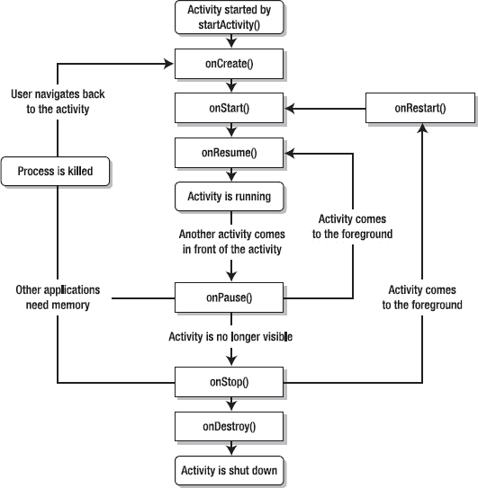
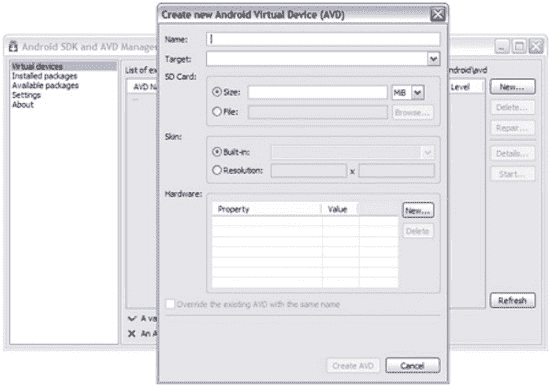

# 一、Android 入门

安卓火热，很多人都在开发安卓应用(简称 app)。也许你也想开发应用，但不确定如何开始。尽管你可以研究谷歌的在线 *Android 开发者指南* ( `[`developer.android.com/guide/index.html`](http://developer.android.com/guide/index.html)`)来获得所需的知识，但你可能会被该指南提供的大量信息淹没。相比之下，本章提供了足够的理论来帮助你理解 Android 的基础知识。这个理论之后是几个秘籍，教你如何开发应用，并准备发布到谷歌的 Android 市场。

### 安卓是什么？

*Android 开发者指南*将 Android 定义为移动设备的*软件栈*——交付全功能解决方案所需的一组软件子系统。这个堆栈包括一个操作系统(Linux 内核的修改版本)，*中间件*(将低级操作系统连接到高级应用的软件)，部分基于 Java，以及关键应用(用 Java 编写)，如网络浏览器(称为浏览器)和联系人管理器(称为联系人)。

Android 提供以下功能:

*   支持重用和替换应用组件的应用框架(将在本章后面讨论)
*   蓝牙、EDGE、3G 和 WiFi 支持(取决于硬件)
*   摄像头、GPS、指南针和加速度计支持(取决于硬件)
*   针对移动设备优化的 Dalvik 虚拟机(DVM)
*   GSM 电话支持(取决于硬件)
*   基于开源 WebKit 引擎的集成浏览器
*   对常见音频、视频和静止图像格式(MPEG4、H.264、MP3、AAC、AMR、JPG、PNG、GIF)的媒体支持
*   由定制 2D 图形库支持的优化图形；基于 OpenGL ES 1.0 规范的 3D 图形(可选硬件加速)
*   用于结构化数据存储的 SQLite

尽管不是 Android 设备软件栈的一部分，Android 丰富的开发环境(包括一个设备仿真器和一个 Eclipse IDE 插件)也可以被认为是 Android 的一个特性。

### 安卓的历史

与你想象的相反，Android 并不是谷歌发明的。相反，Android 最初是由 Android，Inc .开发的，这是一家位于加州帕洛阿尔托的小型创业公司。谷歌于 2005 年 7 月收购了这家公司，并于 2007 年 11 月发布了 Android SDK 的预览版。

2008 年 8 月中旬，谷歌发布了 Android 0.9 SDK 测试版，随后一个月后又发布了 Android 1.0 SDK。Table 1–1 概述了后续的 SDK 更新版本。(从 1.5 版本开始，每个主要版本都有一个基于甜点的代码名称。)

**表 1–1。** *安卓更新发布*

<colgroup><col align="left" valign="top" width="20%"> <col align="left" valign="top" width="75%"></colgroup> 
| **SDK 更新** | **发布日期和变更** |
| :-- | :-- |
| One point one | 谷歌于 2009 年 2 月 9 日发布了 SDK 1.1。变化包括付费应用(通过 Android Market)和“语音搜索”支持。 |
| 基于 Linux 内核 2.6.27 的 1.5(纸杯蛋糕) | 谷歌于 2009 年 4 月 30 日发布了 SDK 1.5。变化包括通过摄像机模式录制和观看视频的能力，将视频上传到 YouTube 和图片上传到 Picasa 的能力，用小工具填充主屏幕的能力，以及动画屏幕过渡。 |
| 基于 Linux 内核 2.6.29 的 1.6(甜甜圈) | 谷歌于 2009 年 9 月 15 日发布了 SDK 1.6。变化包括改进的 Android 市场体验，集成的相机/摄像机/画廊界面，更新的“语音搜索”速度和其他改进，以及更新的搜索体验。 |
| 基于 Linux 内核 2.6.29 的 2.0/2.1(艾克蕾尔) | 谷歌于 2009 年 10 月 26 日发布了 SDK 2.0。变化包括改进的用户界面、新的联系人列表、对 Microsoft Exchange 的支持、数字变焦、改进的谷歌地图(版本 3.1.2)、对浏览器应用的 HTML5 支持、动态壁纸和蓝牙 2.1 支持。

谷歌随后于 2009 年 12 月 3 日发布了 SDK 更新 2.0.1，2010 年 1 月 12 日发布了 SDK 更新 2.1。 |
| 基于 Linux 内核 2.6.32 的 2.2 (Froyo) | 谷歌于 2009 年 5 月 20 日发布了 SDK 2.2。变化包括将 Chrome 的 V8 JavaScript 引擎集成到浏览器应用中，通过蓝牙进行语音拨号和联系人共享，支持 Adobe Flash 10.1，通过 JIT 实现进一步提高应用速度，以及 USB 共享和 WiFi 热点功能。 |
| 2.3(姜饼)基于 Linux 内核 2.6.35.7 | 谷歌在 2010 年 12 月 6 日发布了 SDK 2.3。变化包括新的并发垃圾收集器，提高了应用的响应能力，支持陀螺仪感应，支持 WebM 视频播放和其他视频改进，支持近场通信，以及改进的社交网络功能。本书重点介绍 Android 2.3。

谷歌随后发布了 SDK 2.3.1 修复了一些 bug，以及 SDK 2.3.3，这是一个小功能发布，为 Android 2.3 平台增加了几项改进和 API。 |
| 基于 Linux 2.6.36 的 3.0(蜂巢) | 谷歌于 2011 年 2 月 22 日发布了 SDK 3.0。与之前的版本不同，3.0 版本只专注于平板电脑，如即将发布的第一款平板电脑摩托罗拉变焦(2011 年 2 月 24 日)。除了改进的用户界面，3.0 版本还改进了多任务处理，支持多核处理器，支持硬件加速，并提供了一个重新设计的小部件的 3D 桌面。 |

### 安卓架构

Android 软件栈由顶部的应用、中间的中间件(由应用框架、库和 Android 运行时组成)和底部的带有各种驱动程序的 Linux 内核组成。图 1–1 显示了这种分层架构。

**图 1–1。** *Android 的分层架构由几大部分组成。*

用户关心应用，Android 附带了各种有用的核心应用，包括浏览器、联系人和电话。所有应用都是用 Java 编程语言编写的。应用构成了 Android 架构的顶层。

在应用层的正下方是*应用框架*，这是一组用于创建应用的高级构建模块。应用框架预装在 Android 设备上，由以下组件组成:

*   *活动管理器*:这个组件提供了一个应用的*生命周期*，并维护一个共享的活动堆栈，用于在应用内部和应用之间导航。这两个主题都将在本章后面讨论。
*   *内容提供者*:这些组件封装了可以在应用之间共享的数据(比如浏览器应用的书签)。
*   位置管理器(Location Manager):这个组件使得 Android 设备能够知道自己的物理位置。
*   *通知管理器*:这个组件让一个应用通知用户一个重要的事件(比如一条消息的到达)，而不打断用户当前正在做的事情。
*   *包管理器*:这个组件让一个应用了解当前安装在设备上的其他应用包。(本章稍后将讨论应用包。)
*   *资源管理器*:这个组件让一个应用访问它的资源，这个话题在 Recipe 1–5 中有简要的讨论。
*   *电话管理器*:这个组件让应用了解设备的电话服务。它还处理拨打和接听电话。
*   *视图系统*:该组件管理用户界面元素和面向用户界面的事件生成。(秘籍 1–5 中简要讨论了这些主题。)
*   窗口管理器(Window Manager):这个组件将屏幕空间组织到窗口中，分配绘图表面，并执行其他与窗口相关的任务。

应用框架的组件依赖一组 C/C++ 库来执行它们的工作。开发人员通过框架 API 与以下库进行交互:

*   *FreeType* :这个库支持位图和矢量字体渲染。
*   libc :这个库是标准 C 系统库的 BSD 派生实现，针对基于嵌入式 Linux 的设备进行了调整。
*   *LibWebCore* :这个库提供了一个现代化的快速网络浏览器引擎，支持 Android 浏览器和嵌入式网络视图。它基于 WebKit ( `[`en.wikipedia.org/wiki/WebKit`](http://en.wikipedia.org/wiki/WebKit)`)，也用于谷歌 Chrome 和苹果 Safari 浏览器。
*   *媒体框架*:这些基于 PacketVideo 的 OpenCORE 的库，支持许多流行的音频和视频格式的回放和录制，以及处理静态图像文件。支持的格式包括 MPEG4、H.264、MP3、AAC、AMR、JPEG 和 PNG。
*   *OpenGL | ES* :这些 3D 图形库提供了基于 OpenGL | ES 1.0 APIs 的 OpenGL 实现。他们使用硬件 3D 加速(如果可用)或内置的(高度优化的)3D 软件光栅化器。
*   *SGL* :这个库提供了底层的 2D 图形引擎。
*   SQLite :这个库提供了一个强大的轻量级关系数据库引擎，所有应用都可以使用，Mozilla Firefox 和苹果的 iPhone 也使用这个引擎进行持久存储。
*   SSL:这个库为网络通信提供了基于安全套接字层(基于 SSL)的安全性。
*   *Surface Manager* :这个库管理对显示子系统的访问，并无缝合成来自多个应用的 2D 和 3D 图形层。

Android 提供了一个运行时环境，它由核心库(实现 Apache Harmony Java 版本 5 实现的子集)和 Dalvik 虚拟机(DVM)组成，后者是一个基于处理器寄存器而不是基于堆栈的非 Java 虚拟机。

注意:谷歌的丹·博恩施泰因创造了达尔维克，并以他的一些祖先居住的冰岛渔村命名了这个虚拟机。

每个 Android 应用默认运行在自己的 Linux 进程中，该进程托管一个 Dalvik 实例。该虚拟机的设计使得设备可以高效地运行多个虚拟机。这种效率很大程度上是由于 Dalvik 执行基于 Dalvik 可执行文件(DEX)的文件——DEX 是一种针对最小内存占用进行优化的格式。

**注意:**当应用的任何部分需要执行时，Android 会启动一个进程，当不再需要该进程并且其他应用需要系统资源时，Android 会关闭该进程。

也许您想知道如何让非 Java 虚拟机运行 Java 代码。答案是 Dalvik 不运行 Java 代码。相反，Android 将编译后的 Java 类文件转换成 DEX 格式，Dalvik 执行的就是这些结果代码。

最后，库和 Android 运行时依赖于 Linux 内核(2.6 版)提供底层核心服务，如线程、低级内存管理、网络堆栈、进程管理和驱动程序模型。此外，内核充当硬件和软件堆栈其余部分之间的抽象层。

**安卓安全模式**

Android 的架构包括一个安全模型，可以防止应用执行被认为对其他应用、Linux 或用户有害的操作。这种安全模型主要基于通过标准 Linux 特性(如用户和组 id)的进程级实施，将进程放在安全沙箱中。

默认情况下，沙盒会阻止应用读取或写入用户的私人数据(如联系人或电子邮件)，读取或写入另一个应用的文件，执行网络访问，保持设备唤醒，访问摄像头等。需要访问网络或执行其他敏感操作的应用必须首先获得许可。

Android 以各种方式处理权限请求，通常是根据证书自动允许或拒绝请求，或者提示用户授予或撤销权限。应用所需的权限在应用的清单文件中声明(将在本章后面讨论)，以便在安装应用时 Android 知道它们。这些权限不会随后更改。

### 应用架构

Android 应用的架构不同于桌面应用架构。应用架构基于组件，这些组件通过使用清单描述的意图相互通信，这些意图存储在应用包中。

#### 组件

应用是运行在 Linux 进程中并由 Android 管理的*组件*(活动、服务、内容提供者和广播接收器)的集合。这些组件共享一组资源，包括数据库、首选项、文件系统和 Linux 进程。

**注意:**并非所有这些组件都需要出现在一个应用中。例如，一个应用可能只包含活动，而另一个应用可能包含活动和服务。

这种面向组件的架构允许一个应用重用其他应用的组件，前提是这些其他应用允许重用它们的组件。组件重用减少了整体内存占用，这对于内存有限的设备非常重要。

为了使重用概念具体化，假设您正在创建一个绘图应用，让用户从调色板中选择一种颜色，并假设另一个应用已经开发了一个合适的颜色选择器，并允许该组件被重用。在这种情况下，绘图应用可以调用其他应用的颜色选择器，让用户选择一种颜色，而不是提供自己的颜色选择器。绘图应用不包含其他应用的颜色选择器，甚至也不链接到其他应用。相反，它会在需要时启动其他应用的颜色选择器组件。

当需要应用的任何部分(比如前面提到的颜色选择器)时，Android 会启动一个进程，并为该部分实例化 Java 对象。这就是为什么 Android 的应用没有单一的入口点(例如，没有 C 风格的`main()`功能)。相反，应用使用根据需要实例化和运行的组件。

##### 活动

一个*活动*是一个呈现用户界面的组件，这样用户就可以与应用交互。例如，Android 的联系人应用包括输入新联系人的活动，其电话应用包括拨打电话号码的活动，其计算器应用包括执行基本计算的活动(参见图 1–2)。

**图 1–2。***Android 的计算器应用的主要活动让用户执行基本的计算。*

虽然一个应用可以包含单个活动，但更常见的是应用包含多个活动。例如，Calculator 还包括一个“高级面板”活动，让用户计算平方根、执行三角学以及执行其他高级数学运算。

##### 服务

一个*服务*是一个在后台无限期运行的组件，它不提供用户界面。与活动一样，服务在流程的主线程上运行；它必须产生另一个线程来执行耗时的操作。服务分为本地服务和远程服务。

*   一个*本地服务*与应用的其余部分在相同的进程中运行。这样的服务使得实现后台任务变得容易。
*   一个*远程服务*在一个单独的进程中运行。这种服务允许您执行进程间通信。

**注意:**服务不是一个单独的进程，尽管它可以被指定在一个单独的进程中运行。此外，服务不是线程。相反，一项服务让应用告诉 Android 它想在后台做的事情(即使用户没有直接与应用交互)，并让应用向其他应用公开它的一些功能。

考虑一个服务，它通过一个活动播放音乐来响应用户的音乐选择。用户通过该活动选择要播放的歌曲，并且响应于该选择启动服务。该服务在另一个线程上播放音乐，以防止*应用不响应*对话框(在附录 C 中讨论)出现。

**注意:**使用服务来播放音乐的基本原理是，用户希望即使在启动音乐的活动离开屏幕之后，音乐也能继续播放。

##### 广播接收器

*广播接收器*是接收广播并对其做出反应的组件。许多广播源自系统代码；例如，发出通知来指示时区已经改变或者电池电量低。

应用也可以发起广播。例如，一个应用可能希望让其他应用知道一些数据已经从网络下载到设备，现在可供他们使用。

##### 内容提供商

*内容提供商*是一个组件，它使一个应用的特定数据集可供其他应用使用。数据可以存储在 Android 文件系统、SQLite 数据库或任何其他有意义的方式中。

内容提供者比直接访问原始数据更可取，因为它们将组件代码从原始数据格式中分离出来。这种分离防止了格式改变时的代码中断。

#### 意图

*意图*是描述要执行的操作的消息(例如“发送电子邮件”或“选择照片”)，或者在广播的情况下，提供已经发生的外部事件的描述(例如，设备的摄像头被激活)和正在被宣布的描述。

因为 Android 中几乎所有的东西都包含意图，所以有很多机会用你自己的组件替换现有的组件。例如，Android 提供发送电子邮件的意图。您的应用可以发送该意图来激活标准邮件应用，或者它可以注册一个响应“发送电子邮件”意图的活动，有效地用它自己的活动替换标准邮件应用。

这些消息被实现为`android.content.Intent`类的实例。一个`Intent`对象根据以下项目的某种组合来描述一条消息:

*   *Action* :命名要执行的动作的字符串，或者在广播意图的情况下，命名已经发生并正在报告的动作。动作由`Intent`常量描述，如`ACTION_CALL`(发起电话呼叫)、`ACTION_EDIT`(显示数据供用户编辑)和`ACTION_MAIN`(启动作为初始活动)。您还可以定义自己的操作字符串来激活应用中的组件。这些字符串应该包括应用包作为前缀(例如，`"com.example.project.SELECT_COLOR"`)。
*   *类别*:一个字符串，提供关于应该处理意图的组件种类的附加信息。例如，`CATEGORY_LAUNCHER`表示调用活动应该作为顶级应用出现在设备的应用启动器中。(在秘籍 1–4 中简要讨论了应用启动器。)
*   *组件名*:一个字符串，指定用于 intent 的组件类的完全限定名(包加名称)。组件名称是可选的。如果置位，`Intent`对象被传递给指定类的一个实例。如果没有设置，Android 使用`Intent`对象中的其他信息来定位合适的目标。
*   *Data* :要操作的数据的统一资源标识符(比如联系人数据库中的人员记录)。
*   *Extras* :一组键值对，提供应该交付给处理意图的组件的附加信息。例如，给定一个发送电子邮件的动作，该信息可以包括消息的主题、正文等等。
*   *标志:*位值，指示 Android 如何启动一个活动(例如，该活动应属于哪个任务——任务将在本章稍后讨论)以及如何在启动后处理该活动(例如，该活动是否可被视为最近的活动)。标志由`Intent`类中的常数表示；例如，`FLAG_ACTIVITY_NEW_TASK`指定该活动将成为该活动堆栈上新任务的开始。活动堆栈将在本章后面讨论。
*   *Type* :意图数据的 MIME 类型。通常情况下，Android 会从数据中推断出一种类型。通过指定类型，可以禁用该推断。

意图可以分为显性和隐性。一个*显式意图*通过名称指定目标组件(前面提到的组件名称项被赋值)。因为其他应用的开发人员通常不知道组件名称，所以显式意图通常用于应用内部消息(例如，一个活动启动位于同一应用内的另一个活动)。Android 向指定目标类的实例传递了一个明确的意图。只有`Intent`对象的组件名对确定哪个组件应该得到意图有影响。

一个*隐含意图*没有命名一个目标(组件名没有赋值)。隐式意图通常用于启动其他应用中的组件。Android 搜索最佳组件(执行请求动作的单个活动或服务)或组件(响应广播通知的一组广播接收器)来处理隐含的意图。在搜索过程中，Android 将`Intent`对象的内容与*意图过滤器*进行比较，意图过滤器是与可能接收意图的组件相关联的清单信息。

过滤器通告组件的能力，并且只识别组件可以处理的那些意图。它们向组件开放了接收广告类型的隐含意图的可能性。如果一个组件没有意图过滤器，它只能接收明确的意图。相比之下，带有过滤器的组件可以接收显式和隐式意图。Android 在将意图与意图过滤器进行比较时会参考`Intent`对象的动作、类别、数据和类型。它不考虑额外费用和旗帜。

#### 清单

Android 通过检查应用的 XML 结构清单文件`AndroidManifest.xml`来了解应用的各种组件(以及更多)。例如，清单 1–1 展示了这个文件如何声明一个活动组件。

**清单 1–1。** *声明活动的清单文件*

`<?xml version="1.0" encoding="utf-8"?>
<manifest xmlns:android="http://schemas.android.com/apk/res/android"
          package="com.example.project" android:versionCode="1"
          android:versionName="1.0">
   <application android:label="@string/app_name" android:icon="@drawable/icon">
      <activity android:name=".MyActivity" android:label="@string/app_name">
         <intent-filter>
            <action android:name="android.intent.action.MAIN" />
            <category android:name="android.intent.category.LAUNCHER" />
         </intent-filter>
      </activity>
   </application>
</manifest>`

清单 1–1 以必要的`<?xml version="1.0" encoding="utf-8"?>` prolog 开始，它将该文件标识为 XML 1.0 版文件，其内容根据 UTF-8 编码标准进行编码。

清单 1–1 接下来显示一个`<manifest>`标签，它是这个 XML 文档的根元素；`android`标识 Android 命名空间，`package`标识 app 的 Java 包，`versionCode` / `versionName`标识版本信息。

嵌套在`<manifest>`中的是`<application>`，它是 app 组件标签的父标签。`icon`和`label`属性指的是 Android 设备显示的代表应用的图标和标签资源。(秘籍 1–5 中简要讨论了资源。)

**注意:**资源由前缀`@`标识，后跟资源类别名称(如`string`或`drawable`)、`/`和资源 ID(如`app_name`或`icon`)。

`<application>`标签的`icon`和`label`属性指定缺省值，这些缺省值由标签没有指定这些属性的组件继承。

嵌套在`<application>`中的是`<activity>`，它描述了一个活动组件。这个标签的`name`属性标识了一个实现活动的类(`MyActivity`)。这个名字以句点字符开头，暗示它与`com.example.project`相关。

**注意:**在命令行创建`AndroidManifest.xml`时，句点不存在。然而，当这个文件在 Eclipse 中创建时，这个字符是存在的(在 Recipe 1–10 中讨论过)。无论如何，`MyActivity`是相对于`<manifest>`的`package`值(`com.example.project`)。

嵌套在`<activity>`中的是`<intent-filter>`。这个标签声明了由封闭标签描述的组件的功能。例如，它通过嵌套的`<action>`和`<category>`标签来声明活动组件的功能。

*   `<action>`标识要执行的操作。这个标签的`android:name`属性被分配给`"android.intent.action.MAIN"`，以将活动标识为应用的入口点。
*   `<category>`标识一个组件类别。这个标签的`android:name`属性被分配给`"android.intent.category.LAUNCHER"`来标识需要在应用启动器中显示的活动。

**注:**其他成分同样申报。例如，服务通过`<service>`标签声明，广播接收器通过`<receiver>`标签声明，内容提供商通过`<provider>`标签声明。除了可以在运行时创建的广播接收器之外，清单中没有声明的组件不是由 Android 创建的。

清单还可能包含`<uses-permission>`标签来标识应用需要的权限。例如，一个需要使用摄像头的应用会指定以下标签:`<uses-permission android:name="android.permission.CAMERA" />`。

**注意:** `<uses-permission>`标签嵌套在`<manifest>`标签内。它们出现在与`<application>`标签相同的级别。

在应用安装时，应用请求的权限(通过`<uses-permission>`)由 Android 的包安装程序授予，基于对声明这些权限的应用的数字签名和/或与用户的交互的检查。

应用运行时，不会对用户进行任何检查。它在安装时被授予了特定的权限，可以根据需要使用该功能，或者该权限未被授予，任何使用该功能的尝试都将失败，而不会提示用户。

**注:** `AndroidManifest.xml`提供额外的信息，比如命名应用需要链接的任何库(除了默认的 Android 库)，识别所有应用强制的对其他应用的权限(通过`<permission>`标签)，比如控制谁可以启动应用的活动。

#### App 包

Android 应用是用 Java 编写的。为应用组件编译的 Java 代码被进一步转换成 Dalvik 的 DEX 格式。生成的代码文件以及任何其他所需的数据和资源随后被打包成一个*应用包(APK)* ，一个由`.apk`后缀标识的文件。

APK 不是应用，而是用于分发应用并将其安装在移动设备上。它不是一个应用，因为它的组件可能会重用另一个 APK 的组件，而且(在这种情况下)不是所有的应用都驻留在一个 APK 中。然而，通常称一个 APK 代表一个应用。

APK 必须使用证书(可识别应用的作者)进行签名，该证书的私钥由其开发者持有。证书不需要由证书颁发机构签名。相反，Android 允许用自签名证书对 apk 进行签名，这很典型。(APK 签名在秘籍 1–8 中讨论。)

**APK 文件、用户 id 和安全性**

安装在 Android 设备上的每个 APK 都有自己唯一的 Linux 用户 id，只要 APK 驻留在该设备上，这个用户 ID 就保持不变。

安全强制发生在进程级，所以包含在任何两个 APK 中的代码通常不能在同一个进程中运行，因为每个 APK 的代码需要作为不同的 Linux 用户运行。

然而，通过在每个 APK 的`AndroidManifest.xml`文件中给`<manifest>`标签的`sharedUserId`属性分配相同名称的用户 ID，可以让两个 apk 中的代码在同一个进程中运行。

当你进行这些分配时，你告诉 Android 这两个包将被视为相同的应用，具有相同的用户 id 和文件权限。

为了保持安全性，只有用相同签名签名的两个 apk(并且在其清单中请求相同的`sharedUserId`值)将被给予相同的用户 ID。

### 深度活动

活动由`android.app.Activity`类的子类描述，它是抽象`android.content.Context`类的间接子类。

**注意:** `Context`是一个抽象类，它的方法让应用访问关于它们环境的全局信息(比如它们的资源和文件系统)，并允许应用执行上下文操作，比如启动活动和服务、广播意图和打开私有文件。

`Activity`子类覆盖 Android 在活动生命周期中调用的各种`Activity` *生命周期回调方法*。例如，清单 1–2 中的`SimpleActivity`类扩展了`Activity`，也覆盖了`void onCreate(Bundle bundle)`和`void onDestroy()`生命周期回调方法。

**清单 1–2。** *一种骨骼活动*

`import android.app.Activity;
import android.os.Bundle;

public class **SimpleActivity extends Activity**
{
   @Override
   **public void onCreate(Bundle savedInstanceState)**
   {
      **super.onCreate(savedInstanceState);** // Always call superclass method first.
      System.out.println("onCreate(Bundle) called");
   }
   @Override
   **public void onDestroy()**
   {
      **super.onDestroy();** // Always call superclass method first.
      System.out.println("onDestroy() called");
   }
}`

在清单 1–2 中覆盖的`onCreate(Bundle)`和`onDestroy()`方法首先调用它们的超类对应物，当覆盖`void onStart()`、`void onRestart()`、`void onResume()`、`void onPause()`和`void onStop()`生命周期回调方法时，必须遵循这种模式。

*   首次创建活动时会调用`onCreate(Bundle)`。此方法用于创建活动的用户界面，根据需要创建后台线程，以及执行其他全局初始化。向`onCreate()`传递一个包含活动先前状态的`android.os.Bundle`对象，如果该状态被捕获的话；否则，传递空引用。Android 总是在调用`onCreate(Bundle)`之后调用`onStart()`方法。
*   在活动对用户可见之前调用`onStart()`。Android 在活动来到前台时调用`onStart()`后调用`onResume()`方法，在活动变为隐藏时调用`onStart()`后调用`onStop()`方法。
*   `onRestart()`在活动停止之后，再次开始之前被调用。Android 总是在调用`onRestart()`之后调用`onStart()`。
*   在活动开始与用户交互之前调用`onResume()`。此时，活动获得焦点，用户输入指向该活动。Android 总是在调用`onResume()`之后调用`onPause()`方法，但只是在活动必须暂停的时候。
*   `onPause()`在 Android 即将恢复另一个活动时被调用。此方法通常用于保存未保存的更改、停止可能消耗处理器周期的动画等。它应该很快执行它的工作，因为下一个活动在它返回之前不会恢复。Android 在活动开始与用户交互时调用`onPause()`后调用`onResume()`，在活动变得对用户不可见时调用`onStop()`。
*   当活动对用户不再可见时，调用`onStop()`。这可能是因为该活动正在被销毁，或者因为另一个活动(现有活动或新活动)已经恢复并覆盖了该活动。Android 在活动即将回来与用户交互时调用`onStop(),`后调用`onRestart()`，在活动即将离开时调用`onDestroy()`方法。
*   `onDestroy()`在活动被销毁之前被调用，除非内存紧张，Android 强制杀死活动的进程。在这种情况下，`onDestroy()`永远不会被调用。如果`onDestroy()`被调用，这将是该活动收到的最后一个调用。

**注意:** Android 可以在`onPause()`、`onStop()`或`onDestroy()`返回后随时杀死托管活动的进程。从`onPause()`返回到`onResume()`被调用，活动处于可终止状态。在`onPause()`返回之前，该活动不会再次被取消。

这七种方法定义了活动的整个生命周期，并描述了以下三个嵌套循环:

*   活动的*整个生命周期*被定义为从第一次调用`onCreate(Bundle)`到最后一次调用`onDestroy()`的所有内容。一个活动在`onCreate(Bundle)`执行其所有的初始设置“全局”状态，并在`onDestroy()`释放所有剩余的资源。例如，如果活动有一个线程在后台运行以从网络下载数据，它可能会在`onCreate(Bundle)`中创建该线程，并在`onDestroy()`中停止该线程。
*   活动的*可见生存期*被定义为从调用`onStart()`到相应调用`onStop()`的所有内容。在此期间，用户可以在屏幕上看到活动，尽管它可能不在前台与用户交互。在这两种方法之间，活动可以维护向用户显示自身所需的资源。例如，它可以在`onStart()`中注册一个广播接收器，以监视影响其用户界面的变化，并在用户看不到活动显示的内容时在`onStop()`中注销该对象。当活动在对用户可见和隐藏之间交替时，`onStart()`和`onStop()`方法可以被多次调用。
*   活动的*前台生存期*被定义为从对`onResume()`的调用到对`onPause()`的相应调用的所有内容。在此期间，该活动位于屏幕上所有其他活动的前面，并与用户进行交互。活动可以频繁地在恢复和暂停状态之间转换；例如，`onPause()`在设备进入睡眠或新活动开始时被调用，而`onResume()`在活动结果或新意图被传递时被调用。这两种方法中的代码应该相当轻量级。

**注意:**每个生命周期回调方法都是一个钩子，活动可以覆盖它来执行适当的工作。当活动对象第一次被实例化时，所有活动都必须实现`onCreate(Bundle)`来执行初始设置。许多活动还实现了`onPause()`来提交数据更改，或者准备停止与用户的交互。

Figure 1–3 用这七种方法说明了活动的生命周期。

**图 1–3。** *一个活动的生命周期表明不能保证`onDestroy()`会被调用。*

因为`onDestroy()`可能不会被调用，你不应该指望使用这个方法作为保存数据的地方。例如，如果一个活动正在编辑内容提供商的数据，这些编辑通常应该在`onPause()`中提交。

相比之下，`onDestroy()`通常被实现来释放与活动相关联的资源(比如线程),以便被销毁的活动不会在它的应用的其余部分仍在运行时留下这些东西。

图 1–3 显示一个活动是通过调用`startActivity()`开始的。更具体地说，活动是通过创建一个描述显式或隐式意图的`Intent`对象，并将该对象传递给`Context`的`void startActivity(Intent intent)`方法(启动一个新活动；完成时不返回任何结果)。

或者，可以通过调用`Activity`的`void startActivityForResult(Intent intent, int requestCode)`方法来启动活动。指定的`int`结果作为参数返回给`Activity`的`void onActivityResult(int requestCode, int resultCode, Intent data)`回调方法。

**注意:**响应活动可以通过调用`Activity`的`Intent getIntent()`方法来查看导致其启动的初始意图。Android 调用活动的`void onNewIntent(Intent intent)`方法(也位于`Activity`类中)将任何后续意图传递给活动。

假设你已经创建了一个名为`SimpleActivity`的应用，这个应用由`SimpleActivity`(在清单 1–2 中描述)和`SimpleActivity2`类组成。现在假设您想从`SimpleActivity`的`onCreate(Bundle)`方法中启动`SimpleActivity2`。以下代码片段向您展示了如何启动`SimpleActivity2`:

`Intent intent = new Intent(SimpleActivity.this, SimpleActivity2.class);
SimpleActivity.this.startActivity(intent);`

第一行创建一个描述明确意图的`Intent`对象。它通过将当前`SimpleActivity`实例的引用和`SimpleActivity2`的`Class`实例传递给`Intent(Context packageContext, Class<?> cls)`构造函数来初始化这个对象。

第二行将这个`Intent`对象传递给`startActivity(Intent)`，后者负责启动由`SimpleActivity2.class`描述的活动。如果`startActivity(Intent)`无法找到指定的活动(这不应该发生)，它将抛出一个`android.content.ActivityNotFoundException`实例。

活动必须在应用的`AndroidManifest.xml`文件中声明，否则无法启动(因为它们对 Android 是不可见的)。例如，清单 1–3 中的`AndroidManifest.xml`文件声明了`SimpleActivity`和`SimpleActivity2`——省略号表示与本次讨论无关的内容。

**清单 1–3。** *`SimpleActivity`的清单文件*

`<?xml version="1.0" encoding="utf-8"?>
<manifest xmlns:android="http://schemas.android.com/apk/res/android"
          package="com.example.project" ...>
   <application ...>
      <activity android:name=".SimpleActivity" ...>
         **<intent-filter ...>**
            **<action android:name="android.intent.action.MAIN" />**
            **<category android:name="android.intent.category.LAUNCHER" />**
         **</intent-filter>**
      </activity>
      <activity android:name=".SimpleActivity2" ...>
          **<intent-filter ...>**
              **<action android:name="android.intent.action.VIEW" />**
              **<data android:mimeType="image/jpeg" />**
              **<category android:name="android.intent.category.DEFAULT" />**
          **</intent-filter>**
      </activity>
      ...
   </application>
</manifest>`

清单 1–3 揭示了`SimpleActivity`和`SimpleActivity2`中的每一个都通过嵌套在`<activity>`中的`<intent-filter>`标签与一个意图过滤器相关联。`SimpleActivity2`的`<intent-filter>`标签帮助 Android 确定当`Intent`对象的值匹配以下标签值时，该活动将被启动:

*   `<action>`的`android:name`属性被赋予`"android.intent.action.VIEW"`
*   `<data>`的`android:mimeType`属性被指定为`"image/jpeg"` MIME 类型——附加属性(如`android:path`)通常用于定位要查看的数据
*   `<category>`的`android:name`属性被分配给`"android.intent.category.DEFAULT"`，以允许在没有明确指定其组件的情况下启动活动。

以下代码片段向您展示了如何隐式启动`SimpleActivity2`:

`Intent intent = new Intent();
intent.setAction("android.intent.action.VIEW");
intent.setType("image/jpeg");
intent.addCategory("android.intent.category.DEFAULT");
SimpleActivity.this.startActivity(intent);`

前四行创建一个描述隐含意图的`Intent`对象。传递给`Intent`的`Intent setAction(String action)`、`Intent setType(String type)`和`Intent addCategory(String category)`方法的值指定了意图的动作、MIME 类型和类别。它们帮助 Android 将`SimpleActivity2`识别为要启动的活动。

**活动、任务和活动栈**

Android 将一系列相关活动称为一个*任务*，并提供一个*活动堆栈*(也称为*历史堆栈*或*后台堆栈*)来记住这个序列。启动任务的活动是推入堆栈的初始活动，称为*根活动*。该活动通常是用户通过设备的应用启动器选择的活动。当前正在运行的活动位于堆栈的顶部。

当当前活动启动另一个活动时，新活动被推送到堆栈上并获得焦点(成为正在运行的活动)。前一个活动保留在堆栈上，但已停止。当活动停止时，系统保留其用户界面的当前状态。

当用户按下设备的 BACK 键时，当前活动从堆栈中弹出(活动被销毁)，之前的活动作为正在运行的活动恢复操作(其用户界面的先前状态被恢复)。

堆栈中的活动永远不会重新排列，只会从堆栈中推出和弹出。当当前活动启动时，活动被推到堆栈上，当用户使用 BACK 键离开时，活动弹出堆栈。因此，堆栈作为“后进先出”的对象结构运行。

每当用户按 BACK 时，堆栈中的一个活动就会弹出来显示前一个活动。这一直持续到用户返回到主屏幕或者任务开始时正在运行的任何活动。当所有活动都从堆栈中移除时，任务就不再存在。

查看 Google 在线 Android 文档中的“任务和后台堆栈”部分，了解更多关于活动和任务的信息:`[`developer.android.com/guide/topics/fundamentals/tasks-and-back-stack.html`](http://developer.android.com/guide/topics/fundamentals/tasks-and-back-stack.html)`。

### 深度服务

服务由抽象的`android.app.Service`类的子类描述，它是`Context`的间接子类。

子类覆盖了 Android 在服务生命周期中调用的各种生命周期回调方法。例如，清单 1–4 中的`SimpleService`类扩展了`Service`，也覆盖了`void onCreate()`和`void onDestroy()`生命周期回调方法。

**清单 1–4。** *一款骨骼服，版本 1*

`import android.app.Service;

public class **SimpleService extends Service**
{
   @Override
   **public void onCreate()**
   {
      System.out.println("onCreate() called");
   }
   @Override
   **public void onDestroy()**
   {` `      System.out.println("onDestroy() called");
   }
   @Override
   **public IBinder onBind(Intent intent)**
   {
      System.out.println(`"`onBind(Intent) never called`"`);
      return null;
   }
}`

最初创建服务时调用`onCreate()`,删除服务时调用`onDestroy()`。因为它是抽象的，`IBinder onBind(Intent intent)`生命周期回调方法(将在本节稍后描述)必须总是被覆盖，即使只是为了返回`null`，这表明该方法被忽略。

**注意:** `Service`子类通常会覆盖`onCreate()`和`onDestroy()`来执行初始化和清理。与`Activity`的`onCreate(Bundle)`和`onDestroy()`方法不同，`Service`的`onCreate()`方法不会被重复调用，它的`onDestroy()`方法总是被调用。

服务的生命周期发生在调用时间`onCreate()`和返回时间`onDestroy()`之间。与活动一样，服务在`onCreate()`中初始化，在`onDestroy()`中清理。例如，音乐回放服务可以在`onCreate()`中创建播放音乐的线程，并在`onDestroy()`中停止该线程。

本地服务通常通过`Context`的`ComponentName startService(Intent intent)`方法启动，该方法返回一个`android.content.ComponentName`实例来标识启动的服务组件，如果服务不存在，则返回空引用。此外，`startService(Intent)`导致了如图图 1–4 所示的生命周期。

**图 1–4。** *由`startService(Intent)`启动的服务的生命周期以调用`onStartCommand(Intent, int, int)`为特征。*

对`startService(Intent)`的调用导致对`onCreate(),`的调用，随后是对`int onStartCommand(Intent intent, int flags, int startId)`的调用。后一种生命周期回调方法取代了不推荐使用的`void onStart(Intent intent, int startId)`方法，使用以下参数进行调用:

*   `intent`是传递给`startService(Intent)`的`Intent`对象。
*   `flags`可以提供关于开始请求的附加数据，但通常设置为 0。
*   `startID`是描述该启动请求的唯一整数。服务可以将这个值传递给`Service`的`boolean stopSelfResult(int startId)`方法来停止自己。

`onStartCommand(Intent, int, int)`处理`Intent`对象，通常返回常量`Service.START_STICKY`来表示服务将继续运行，直到被显式停止。此时，服务正在运行并将继续运行，直到发生以下事件之一:

*   另一个组件通过调用`Context`的`boolean stopService(Intent intent)`方法来停止服务。无论`startService(Intent)`被呼叫的频率如何，只需要一次`stopService(Intent)`呼叫。
*   服务通过调用`Service`的重载`stopSelf()`方法之一，或者调用`Service`的`stopSelfResult(int)`方法来停止自身。

在`stopService(Intent)`、`stopSelf()`或`stopSelfResult(int)`被调用后，Android 调用`onDestroy()`让服务执行清理任务。

**注意:**调用`startService(Intent)`启动服务时，`onBind(Intent)`不被调用。

清单 1–5 展示了一个可以在`startService(Intent)`方法的上下文中使用的框架服务类。

**清单 1–5。** *骨骼服，第二版*

`import android.app.Service;

public class **SimpleService extends Service**
{
   @Override
   **public void onCreate()**
   {
      System.out.println("onCreate() called");
   }
   @Override
   **public int onStartCommand(Intent intent, int flags, int startId)**
   {
      System.out.println("onStartCommand(Intent, int, int) called");
      return **START_STICKY**;
   }
   @Override
   **public void onDestroy()**
   {
      System.out.println("onDestroy() called");
   }` `   @Override
   **public IBinder onBind(Intent intent)**
   {
      System.out.println("onBind(Intent) never called");
      return null;
   }
}`

下面的代码片段假定位于清单 1–2 的`SimpleActivity`类的`onCreate()`方法中，通过一个明确的意图，使用`startService(Intent)`来启动清单 1–5 的`SimpleService`类的一个实例:

`Intent intent = new Intent(SimpleActivity.this, SimpleService.class);
SimpleActivity.this.startService(intent);`

远程服务通过`Context`的`boolean bindService(Intent service, ServiceConnection conn, int flags)`方法启动，该方法连接到一个正在运行的服务，在必要时创建服务，当成功连接时返回‘true’。`bindService(Intent, ServiceConnection, int)`导致了由图 1–5 所示的生命周期。

**图 1–5。** *由`bindService(Intent, ServiceConnection, int)`启动的服务的生命周期不包括对`onStartCommand(Intent, int, int)`的调用。*

对`bindService(Intent, ServiceConnection, int)`的调用导致对`onCreate()`的调用，然后是对`onBind(Intent)`的调用，后者返回客户端用来与服务交互的*通信通道*(实现`android.os.IBinder`接口的类的实例)。

客户端与服务的交互如下:

1.  The client subclasses `android.content.ServiceConnection` and overrides this class's abstract `void onServiceConnected(ComponentName className, IBinder service)` and `void onServiceDisconnected(ComponentName name)` methods in order to receive information about the service as the service is started and stopped. When `bindService(Intent, ServiceConnection, int)` returns true, the former method is called when a connection to the service has been established; the `IBinder` argument passed to this method is the same value returned from `onBind(Intent)`. The latter method is called when a connection to the service has been lost.

    当承载服务的进程崩溃或被终止时，通常会发生连接丢失。`ServiceConnection`实例本身并没有被删除——到服务的绑定将保持活动状态，当服务下次运行时，客户端将收到对`onServiceConnected(ComponentName, IBinder)`的调用。

2.  客户端将`ServiceConnection`子类对象传递给`bindService(Intent, ServiceConnection, int)`。

客户端通过调用`Context`的`void unbindService(ServiceConnection conn)`方法断开与服务的连接。服务重新启动后，此组件不再接收呼叫。如果没有其他组件绑定到该服务，则允许该服务随时停止。

在服务停止之前，Android 用传递给`unbindService(ServiceConnection)`的`Intent`对象调用服务的`boolean onUnbind(Intent intent)`生命周期回调方法。假设`onUnbind(Intent)`没有返回‘true’，这告诉 Android 在每次客户端随后绑定到服务时调用服务的`void onRebind(Intent intent)`生命周期回调方法，Android 调用`onDestroy()`来销毁服务。

清单 1–6 展示了一个可以在`bindService(Intent, ServiceConnection, int)`方法的上下文中使用的框架服务类。

**清单 1–6。** *骨骼服，第三版*

`import android.app.Service;

public class SimpleService extends Service
{
   **public class SimpleBinder extends Binder**
   {
      **SimpleService getService()**
      {
         return **SimpleService.this;**
      }
   }
   **private final IBinder binder = new SimpleBinder();**
   @Override` `   public IBinder onBind(Intent intent)
   {
      **return binder;**
   }
   @Override
   public void onCreate()
   {
      System.out.println("onCreate() called");
   }
   @Override
   public void onDestroy()
   {
      System.out.println("onDestroy() called");
   }
}`

清单 1–6 首先声明了一个扩展了`android.os.Binder`类的`SimpleBinder`内部类。`SimpleBinder`声明了一个返回`SimpleService`子类实例的`SimpleService getService()`方法。

**注:** `Binder`与`IBinder`接口一起支持远程过程调用机制，用于进程间的通信。尽管这个例子假设服务和应用的其他部分在同一个进程中运行，但是仍然需要`Binder`和`IBinder`。

清单 1–6 接下来实例化`SimpleBinder`并将实例的引用分配给私有`binder`字段。该字段的值从随后覆盖的`onBind(Intent)`方法返回。

让我们假设清单 1–2 中的`SimpleActivity`类声明了一个名为`ss` ( `private SimpleService ss;`)的私有`SimpleService`字段。继续，让我们假设下面的代码片段包含在`SimpleActivity`的`onCreate(Bundle)`方法中:

`ServiceConnection sc = new ServiceConnection()
{
   public void onServiceConnected(ComponentName className, IBinder service)
   {
      ss = ((SimpleService.SimpleBinder) service).getService();
      System.out.println("Service connected");
   }
   public void onServiceDisconnected(ComponentName className)
   {
      ss = null; System.out.println("Service disconnected");
   }
};
bindService(new Intent(SimpleActivity.this, SimpleService.class), sc,
            Context.BIND_AUTO_CREATE);`

这段代码首先实例化了一个`ServiceConnection`子类。覆盖的`onServiceConnected(ComponentName, IBinder)`方法使用`service`参数调用`SimpleBinder`的`getService()`方法并保存结果。

虽然它必须存在，但是覆盖的`onServiceDisconnected(ComponentName)`方法永远不应该被调用，因为`SimpleService`和`SimpleActivity`在同一个进程中运行。

接下来，代码片段将`ServiceConnection`子类对象，以及将`SimpleService`标识为意图目标的意图和`Context.BIND_AUTO_CREATE`(创建持久连接)传递给`bindService(Intent, ServiceConnection, int)`。

**注意:**一个服务可以被启动(用`startService(Intent)`)并绑定连接(用`bindService(Intent, ServiceConnection, int)`)。在这种情况下，只要服务启动，Android 就会保持服务运行，或者一个或多个带有`BIND_AUTO_CREATE`标志的连接已经连接到服务。一旦这两种情况都不成立，服务的`onDestroy()`方法被调用，服务被终止。从`onDestroy()`返回后，所有清理工作，如停止线程或注销广播接收器，都应完成。

无论您如何启动服务，应用的`AndroidManifest.xml`文件都必须包含该组件的条目。下面的条目声明了`SimpleService`:

`<service android:name=".SimpleService">
</service>`

**注意:**虽然前面的例子使用了`bindService(Intent, ServiceConnection, int)`来启动一个本地服务，但是使用这个方法来启动一个远程服务更为典型。第五章向你介绍远程服务。

### 深度广播接收器

广播接收器由抽象`android.content.BroadcastReceiver`类的子类和覆盖`BroadcastReceiver`的抽象`void onReceive(Context context, Intent intent)`方法的类来描述。例如，清单 1–7 中的`SimpleBroadcastReceiver`类扩展了`BroadcastReceiver`并覆盖了这个方法。

**清单 1–7。** *一个骨骼广播接收器*

`public class **SimpleBroadcastReceiver extends BroadcastReceiver**
{
   @Override
   **public void onReceive(Context context, Intent intent)**
   {
      System.out.println("onReceive(Context, Intent) called");
   }
}`

通过创建一个`Intent`对象并将该对象传递给任意一个`Context`的广播方法(比如`Context`的重载`sendBroadcast()`方法)来启动一个广播接收器，这些方法将消息广播给所有感兴趣的广播接收器。

下面的代码片段，假定位于清单 1–2 的`SimpleActivity`类的`onCreate()`方法中，启动清单 1–7 的`SimpleBroadcastReceiver`类的一个实例:

`Intent intent = new Intent(SimpleActivity.this, SimpleBroadcastReceiver.class);
intent.putExtra("message", "Hello, broadcast receiver!");
SimpleActivity.this.sendBroadcast(intent);`

调用`Intent`的`Intent putExtra(String name, String value)`方法将消息存储为一个键/值对。和`Intent`的其他`putExtra()`方法一样，这个方法返回一个对`Intent`对象的引用，这样方法调用可以链接在一起。

除非您动态创建一个广播接收器，`AndroidManifest.xml`必须有一个此组件的条目。下面的条目声明了`SimpleBroadcastReceiver`:

`<receiver android:name=".SimpleBroadcastReceiver">
</receiver>`

### 深度内容提供商

内容提供者由抽象类`android.content.ContentProvider`的子类和覆盖抽象方法`ContentProvider`的类来描述(例如`String getType(Uri uri)`)。例如，清单 1–8 中的`SimpleContentProvider`类扩展了`ContentProvider`并覆盖了这些方法。

**清单 1–8。** *一个骨架内容提供商*

`public class **SimpleContentProvider extends ContentProvider**
{
   @Override
   **public int delete(Uri uri, String selection, String[] selectionArgs)**
   {
      System.out.println("delete(Uri, String, String[]) called");
      return 0;
   }
   @Override
   **public String getType(Uri uri)**
   {
      System.out.println("getType(Uri) called");
      return null;
   }
   @Override
   **public Uri insert(Uri uri, ContentValues values)**
   {
      System.out.println("insert(Uri, ContentValues) called");
      return null;
   }
   @Override
   **public boolean onCreate()**
   {
      System.out.println("onCreate() called");` `      return false;
   }
   @Override
   **public Cursor query(Uri uri, String[] projection, String selection,**
                       **String[] selectionArgs, String sortOrder)**
   {
      System.out.println("query(Uri, String[], String, String[], String) called");
      return null;
   }
   @Override
   **public int update(Uri uri, ContentValues values, String selection,**
                     **String[] selectionArgs)**
   {
      System.out.println("update(Uri, ContentValues, String, String[]) called");
      return 0;
   }
}`

客户端不会实例化`SimpleContentProvider`并直接调用这些方法。相反，它们实例化抽象类`android.content.ContentResolver`的一个子类，并调用它的方法(比如`public final Cursor query(Uri uri, String[] projection, String selection, String[] selectionArgs, String sortOrder)`)。

**注意:**一个`ContentResolver`实例可以和任何内容提供者对话；它与提供者合作来管理任何涉及的进程间通信。

`AndroidManifest.xml`该组件必须有一个条目。下面的条目声明了`SimpleContentProvider`:

`<provider android:name=".SimpleContentProvider">
</provider>`

#### 1–1。安装 Android SDK

##### 问题

您已经阅读了之前的 Android 介绍，并渴望开发您的第一个 Android 应用。但是，你必须安装 Android SDK 2.3 才能开发应用。

##### 解决方案

谷歌为 Windows、基于英特尔的 Mac OS X 和 Linux 操作系统提供了 Android SDK 2.3 发行版文件。下载并解压缩适用于您的平台的文件，并将其解压缩的主目录移动到一个方便的位置。您可能还想更新 PATH 环境变量，以便可以从文件系统中的任何地方访问 SDK 的命令行工具。

在下载和安装该文件之前，您必须了解 SDK 的要求。如果您的开发平台不满足这些要求，您就不能使用 SDK。

Android SDK 2.3 支持以下操作系统:

*   Windows XP (32 位)、Vista (32 位或 64 位)或 Windows 7 (32 位或 64 位)
*   Mac OS X 10.5.8 或更高版本(仅限 x86)
*   Linux(在 Ubuntu Linux，Lucid Lynx 上测试):需要 GNU C 库(`glibc` ) 2.11 或更高版本。64 位发行版必须能够运行 32 位应用。要了解如何添加对 32 位应用的支持，请参阅位于`[`developer.android.com/sdk/installing.html#troubleshooting`](http://developer.android.com/sdk/installing.html#troubleshooting)`的 Ubuntu Linux 安装说明。

你会很快发现 Android SDK 2.3 被组织成各种组件:SDK 工具、SDK 平台工具、不同版本的 *Android 平台*(也称为 Android 软件栈)、SDK 插件、Windows 的 USB 驱动程序、示例和离线文档。每个组件都需要最小数量的磁盘存储空间；所需空间总量取决于您选择安装的组件:

*   *SDK 工具*:SDK 的工具需要大约 35MB 的磁盘存储空间，必须安装。
*   *SDK 平台工具*:SDK 的平台工具需要大约 6MB 的磁盘存储空间，必须安装。
*   *Android 平台*:每个 Android 平台对应一个特定版本的 Android，需要大约 150MB 的磁盘存储空间。必须至少安装一个 Android 平台。
*   *SDK 附加组件*:每个可选的 SDK 附加组件(如 Google APIs 或第三方供应商的 API 库)需要大约 100MB 的磁盘存储空间。
*   *用于 Windows 的 USB 驱动程序*:用于 Windows 平台的可选 USB 驱动程序需要大约 10MB 的磁盘存储空间。如果你在 Mac OS X 或 Linux 上开发，你不需要安装 USB 驱动。
*   *样例*:每个 Android 平台的可选 app 样例都需要大约 10MB 的磁盘存储空间。
*   *离线文档*:您可以选择下载文档，这样即使没有连接到互联网也可以查看，而不必在线访问 Android 文档。脱机文档需要大约 250MB 的磁盘存储空间。

最后，您应该确保安装了以下附加软件:

*   JDK 5 或 JDK 6:你需要安装其中一个 Java 开发工具包(JDK)来编译 Java 代码。仅仅安装 Java 运行时环境(JRE)是不够的。
*   *Apache Ant*:Linux 和 Mac 需要安装 Ant 1 . 6 . 5 或更高版本，Windows 需要安装 Ant 1.7 或更高版本，这样才能构建 Android 项目。

**注意:**如果您的开发平台上已经安装了一个 JDK，请花点时间确保它符合前面列出的版本要求(5 或 6)。一些 Linux 发行版可能包含 JDK 1.4，Android 开发不支持该版本。此外，Gnu 编译器 Java 版也不受支持。

##### 它是如何工作的

将浏览器指向`[`developer.android.com/sdk/index.html`](http://developer.android.com/sdk/index.html)`，下载`android-sdk_r08-windows.zip` (Windows)、`android-sdk_r08-mac_86.zip` (Mac OS X)和`android-sdk_r08-linux_86.tgz` (Linux)中的一个。

**注意:** Windows 开发者可以选择下载并运行`installer_r08-windows.exe`。这个工具可以自动完成安装过程中的所有工作。

比如你运行 Windows XP，下载`android-sdk_r08-windows.zip`。在解压缩这个文件之后，将解压缩的`android-windows-sdk`主目录移动到文件系统中一个方便的位置；例如，您可能会将未归档的`C:\unzipped\android-sdk_r08-windows\android-sdk-windows`主目录移动到 C:驱动器上的根目录，从而产生`C:\android-sdk-windows`。

**注意:**要完成安装，请将`tools`子目录添加到 PATH 环境变量中，这样您就可以从文件系统中的任何地方访问 SDK 的命令行工具。

对`android-windows-sdk`的后续检查显示，该主目录包含以下子目录和文件:

*   *`add-ons`* :这个最初为空的目录存储了来自谷歌和其他厂商的插件；例如，Google APIs 附加组件就存储在这里。
*   *`platforms`* :这个最初为空的目录将 Android 平台存储在单独的子目录中。例如，Android 2.3 将存储在一个`platforms`子目录中，而 Android 2.2 将存储在另一个`platforms`子目录中。
*   *`tools`* :这个目录包含一组平台无关的开发和剖析工具。该目录中的工具可能会随时更新，与 Android 平台版本无关。
*   *`SDK Manager.exe`* :一个启动 Android SDK 和 AVD 管理器工具的特殊工具，您可以使用它向您的 SDK 添加组件。
*   *`SDK Readme.txt`* :告诉您如何执行 SDK 的初始设置，包括如何在所有平台上启动 Android SDK 和 AVD 管理器工具。

`tools`目录包含各种有用的工具，包括:

*   *`android`* :创建和更新 Android 项目；用新的平台、插件和文档更新 Android SDK 以及创建、删除和查看 Android 虚拟设备(在秘籍 1–3 中讨论)。
*   *`emulator`* :运行一个完整的 Android 软件栈，下至内核级，包括一组您可以访问的预装应用(如浏览器)。
*   *`sqlite3`* :管理 Android 应用创建的 SQLite 数据库。
*   *`zipalign`* :对 APK 文件进行归档对齐优化。

#### 1–2。安装 Android 平台

##### 问题

安装 Android SDK 不足以开发 Android 应用；您还必须安装至少一个 Android 平台。

##### 解决方案

使用`SDK Manager`工具安装一个 Android 平台。

##### 它是如何工作的

运行`SDK Manager`。该工具呈现了 *Android SDK 和 AVD 管理器*对话框，随后是*刷新源*和*选择安装包*对话框。

*Android SDK 和 AVD 管理器*识别虚拟设备、已安装的软件包和可用的软件包。它还允许您配置代理服务器和其他设置。

出现此对话框时，对话框右侧列表中的已安装软件包条目会突出显示，列表右侧的窗格会标识所有已安装的软件包。如果你是第一次安装 Android，这个面板显示只安装了 Android SDK 工具(修订版 8)组件。

**注意:**您也可以使用`android`工具显示 *Android SDK 和 AVD 管理器*对话框。通过在命令行中单独指定`android`来完成这项任务。以这种方式显示时， *Android SDK 和 AVD 管理器*突出显示虚拟设备，而不是已安装的软件包。

显示该对话框后，`SDK Manager`扫描 Google 的服务器，寻找可安装的组件包。*刷新源*对话框显示其进度。

在`SDK Manager`完成扫描后，它会出现*选择要安装的软件包*对话框(参见图 1–6)让你选择你想要安装的 SDK 组件。

**图 1–6。** *软件包列表标识了那些可以安装的软件包。*

**注意:** Google 建议您在安装 SDK 组件之前禁用任何活动的防病毒软件。否则，您可能会遇到一个 *SDK 管理器:未能安装*对话框，告诉您无法重命名或移动文件夹，并告诉您暂时禁用防病毒软件，然后单击对话框的“是”按钮重试。

*选择要安装的软件包*对话框显示了一个软件包列表，其中列出了那些可以安装的软件包。它在已接受安装的软件包旁边显示复选标记，在拒绝安装的软件包旁边显示 x。

对于突出显示的软件包,“软件包说明和许可证”提供了软件包说明、依赖于正在安装的此软件包的其他软件包列表、有关包含该软件包的归档文件的信息以及其他信息。此外，您可以选择一个单选按钮来接受或拒绝该包。

**注意:**在某些情况下，一个 SDK 组件可能需要另一个组件或 SDK 工具的特定最低版本。除了记录这些依赖关系的包描述&许可证之外，如果有需要解决的依赖关系，开发工具会用调试警告通知您。

因为这本书关注的是 Android 2.3，所以你需要安装的包只有 Android SDK 平台-工具，修订版 1 和 SDK 平台 Android 2.3，API 9，修订版 1。通过单击各自窗格上的拒绝单选按钮，可以取消选中所有其他选中的包条目。

**注意:**如果你计划开发能在装有早期版本 Android 的设备上运行的应用，你可能想在那些版本旁边留下复选标记。然而，此时没有必要这样做；您可以随时回来通过`SDK Manager`添加这些版本。

确保只检查了这些条目后，单击 Install 按钮开始安装。图 1–7 显示了产生的*安装档案*对话框。

**图 1–7。** *安装归档文件对话框显示下载和安装每个选定的软件包归档文件的进度。*

你可能会遇到 *ADB 重启*对话框，它告诉你一个依赖于 Android Debug Bridge (ADB)的包已经更新，并询问你是否要现在重启 ADB。点击是按钮，关闭*亚行重启*，然后在*安装档案*对话框中点击关闭。

现在，您应该看到 Android SDK 和 AVD 管理器的已安装软件包窗格，除了显示 Android SDK 工具修订版 8 之外，还显示 Android SDK 平台工具修订版 1 和 SDK 平台 Android 2.3、 API 9 修订版 1。您还应该观察以下新子目录:

*   `platform-tools`(在`android-sdk-windows`中)
*   `android-9`(在`android-sdk-windows/platforms`中)

`platform-tools`包含开发工具，可能会随着每个平台版本的发布而更新。其工具包括`aapt` (Android 素材打包工具——查看、创建、更新兼容 Zip 的档案(`.zip`、`.jar`、`.apk`)；并将资源编译成二进制素材)、`adb`(Android Debug Bridge——管理仿真器实例或 Android 驱动的设备的状态)、`dx` (Dalvik 可执行文件——从 Java `.class`文件生成 Android 字节码)。`android-9`存储 Android 2.3 数据和面向用户界面的文件。

**提示**您可能希望将`platform-tools`添加到 PATH 环境变量中，这样您就可以从文件系统中的任何地方访问这些工具。

**可用软件包和组件更新检测**

与可用软件包对应的窗格显示可用于安装的软件包。它默认提供来自谷歌 Android 仓库和第三方插件(来自谷歌和三星)的软件包，但你可以添加其他托管自己的 Android SDK 插件的网站，然后从这些网站下载 SDK 插件。

例如，假设一家移动运营商或设备制造商提供了他们自己的 Android 设备支持的附加 API 库。为了使用其库来帮助开发应用，您必须安装运营商/设备制造商的 Android SDK 插件。

如果运营商或设备制造商在其网站上托管了 SDK 附加存储库文件，您必须按照以下步骤将网站添加到 SDK 管理器:

1.  从列表框中选择可用的包。
2.  单击结果窗格上的添加附加站点按钮，并将网站的`repository.xml`文件的 URL 输入到结果对话框的文本字段中。单击确定。

网站上提供的任何 SDK 组件都将出现在可用软件包下。

现有 SDK 组件的新版本偶尔会发布，并通过 SDK 存储库提供。在大多数情况下，假设您的环境中已经安装了这些组件，您会希望尽快下载新的修订版。

了解组件更新的最简单方法是访问“可用软件包”窗格。当您发现有新的版本可用时，使用`SDK Manager`将其下载并安装到您的环境中，使用与安装 Android 2.3 平台相同的方式。新组件将取代旧组件安装，但不会影响您的应用。

#### 1–3。创建 Android 虚拟设备

##### 问题

安装 Android SDK 和 Android 平台后，您就可以开始创建 Android 应用了。然而，你将无法通过`emulator`工具运行这些应用，直到你创建了一个 *Android 虚拟设备(AVD)* ，一个代表 Android 设备的设备配置。

##### 解决方案

使用`SDK Manager`工具创建一个 AVD。

##### 它是如何工作的

如有必要，运行`SDK Manager`。点击左侧列表中 *Android SDK 和 AVD Manager* 对话框的虚拟设备条目。您应该会看到图 1–8 中所示的窗格。

**图 1–8。** *初始没有安装 avd。*

单击新建按钮。图 1–9 显示了产生的*创建新的 Android 虚拟设备(AVD)* 对话框。

**图 1–9。** *一个 AVD 由名称、目标平台、SD 卡、皮肤、硬件属性组成。*

Figure 1–9 揭示了一个 AVD 有一个名字，目标是一个特定的 Android 平台，可以模拟 SD 卡，并提供一个具有一定屏幕分辨率的皮肤。输入 **`test_AVD`** 作为名称，选择`Android 2.3 – API Level 9`作为目标平台，输入 **`100`** 作为 SD 卡的大小字段。选择`Android 2.3 – API Level 9`会导致为皮肤选择`Default (HVGA)`，其`Abstracted LCD density`属性设置为`160`每英寸点数(dpi)。

**注意:**如果你已经安装了 Android 2.3.1，选择`Android 2.3.1 – API Level 9`会导致`Default (WVGA800)`被选择为皮肤，并且`Abstracted LCD density`属性被设置为`240` dpi。此外，还存在设置为`24`兆字节的`Max VM application heap size`属性。

输入之前的值并保持屏幕默认值后，通过单击创建 AVD 完成 AVD 创建。图 1–8 中的 AVD 窗格现在将包含一个`test_AVD`条目。

**注意:**在创建您计划用来测试编译后的应用的 AVD 时，请确保目标平台的 API 级别高于或等于您的应用所需的 API 级别。换句话说，如果您计划在 AVD 上测试您的应用，您的应用将无法访问比 AVD API 级别支持的 API 更新的平台 API。

虽然使用`SDK Manager`创建 AVD 更容易，但是您也可以通过指定`android create avd -n *name* -t *targetID* [-option *value*]...`使用`android`工具来完成这项任务。给定这个语法， *`name`* 标识设备配置(如`target_AVD`)， *`targetID`* 是标识目标 Android 平台的整数 id(可以通过执行`android list targets`获得这个整数 ID)，而`[-option *value*]...`标识一系列选项(如 SD 卡大小)。

如果您没有指定足够的选项，`android`会提示创建一个自定义硬件配置文件。如果您不想要自定义硬件配置文件，而希望使用默认的硬件仿真选项，请按 Enter 键。例如，`android create avd -n test_AVD -t 1`命令行会创建一个名为`test_AVD`的 AVD。这个命令行假设 1 对应于 Android 2.3 平台，并提示创建自定义硬件配置文件。

**注意:**每个 AVD 都是一个独立的设备，有自己的用户数据专用存储器、自己的 SD 卡等等。当您使用 AVD 启动`emulator`工具时，该工具会从 AVD 的目录中加载用户数据和 SD 卡数据。默认情况下，`emulator`将用户数据、SD 卡数据和缓存存储在分配给 AVD 的目录中。

#### 1–4 岁。启动 AVD

##### 问题

您必须启动 AVD，这可能需要几分钟时间，然后才能在其上安装和运行应用，并想知道如何完成这项任务。

##### 解决方案

使用`SDK Manager`工具启动 AVD。或者，使用`emulator`工具启动 AVD。

##### 它是如何工作的

参考图 1–8，您会注意到一个禁用的启动按钮。创建 AVD 条目后，此按钮不再被禁用。单击 Start 运行`emulator`工具，突出显示的 AVD 条目作为仿真器的设备配置。

出现一个*启动选项*对话框。此对话框标识 AVD 的外观和屏幕密度。它还提供了未选中的复选框，用于缩放模拟器显示的分辨率以匹配物理设备的屏幕大小，以及擦除用户数据。

**注意:**当你更新你的应用时，你会定期打包并安装在模拟器上，模拟器会在用户数据磁盘分区中保存应用及其状态数据。为了确保应用在更新时正常运行，您可能需要删除模拟器的用户数据分区，这可以通过选中擦除用户数据来完成。

单击 Launch 按钮启动带有 AVD 的仿真器。`SDK Manager`通过短暂显示一个*启动 Android 模拟器*对话框来响应，然后是命令窗口(在 Windows XP 上)，最后显示模拟器窗口。

模拟器窗口分为左窗格和右窗格，左窗格在黑色背景上显示 Android 徽标，右窗格显示手机控件和键盘。图 1–10 显示了`test_AVD`装置的这些窗格。

**图 1–10。** *模拟器窗口左边是主屏幕，右边是手机控件和键盘。*

如果你以前用过 Android 设备，你可能对主屏幕、手机控制和键盘很熟悉。如果没有，请记住以下几点:

*   *主屏幕*是一个特殊的应用，可以作为使用 Android 设备的起点。
*   主屏幕(以及每个应用屏幕)上方会出现一个状态栏。*状态栏*显示当前时间、电池剩余电量等信息；并且还提供对通知的访问。
*   主屏幕显示壁纸背景。单击电话控制中的菜单按钮，然后在弹出菜单中单击壁纸以更改壁纸。
*   主屏幕在顶部附近显示谷歌搜索小部件。一个*小工具*是一个微型应用视图，可以嵌入到主屏幕和其他应用中，并接收定期更新。
*   主屏幕在底部附近显示了*应用启动器*。启动器显示图标，用于启动常用的电话和浏览器应用，并显示所有已安装应用的矩形网格，随后通过双击它们的图标来启动这些应用。
*   主屏幕由多个窗格组成。单击应用启动器任一侧的点，将当前窗格替换为左侧或右侧的下一个窗格——点的数量表示左侧或右侧剩余待访问的窗格数量。或者，在应用启动器的中间图标上按住鼠标指针，以调出微型窗格图标列表；点按这些图标之一以显示相应的主屏幕面板。
*   房子图标电话控制按钮带你从任何地方到主屏幕。
*   菜单电话控制按钮为当前运行的应用提供特定于应用的选项菜单。
*   弯曲的箭头图标电话控制键可让您返回到活动堆栈中的上一个活动。

当 AVD 运行时，您可以通过使用鼠标“触摸”触摸屏和键盘“按下”AVD 键来进行交互。Table 1–2 显示了 AVD 键和键盘键之间的映射。

**表 1–2。***AVD 键和键盘键之间的映射*

<colgroup><col align="left" valign="top" width="45%"> <col align="left" valign="top" width="50%"></colgroup> 
| **AVD 密钥** | **键盘按键** |
| :-- | :-- |
| 主页 | 家 |
| 菜单(左软键) | F2 或向上翻页 |
| 星形(右软键) | Shift-F2 或向下翻页 |
| 背部 | 经济社会委员会 |
| 呼叫/拨号按钮 | 第三子代 |
| 挂断/结束呼叫按钮 | 法乐四联症 |
| 搜索 | F5 |
| 电源按钮 | F7 |
| 音量调高按钮 | 键盘+Ctrl-5 |
| 音量调低按钮 | 键盘减号，Ctrl-F6 |
| 相机按钮 | Ctrl-小键盘 _5，Ctrl-F3 |
| 切换到以前的布局方向(纵向或横向) | 键盘 _7，Ctrl-F11 |
| 切换到下一个布局方向 | 键盘 _9，Ctrl-F12 |
| 打开/关闭手机网络 | F8 |
| 切换代码分析 | F9(仅带`-trace`启动选项) |
| 切换全屏模式 | Alt-Enter |
| 切换轨迹球模式 | F6 |
| 暂时进入轨迹球模式(按键时) | 删除 |
| DPad 左/上/右/下 | 键盘 _4/8/6/2 |
| DPad 中心点击 | 键盘 _5 |
| 洋葱α增加/减少 | 小键盘 _ 乘法(*) /小键盘 _ 除法(/) |

**提示:**在使用键盘按键之前，您必须首先禁用开发计算机上的 NumLock。

表 1–2 指的是切换代码分析环境中的`-trace`启动选项。当通过`emulator`工具启动 AVD 时，该选项允许您将分析结果存储在一个文件中。

例如，`emulator -avd test_AVD-trace results.txt`启动设备配置仿真器`test_AVD`，当您按下 F9 时，还会将分析结果存储在`results.txt`中。再次按 F9 停止代码分析。

图 1–10 在标题栏显示 5554:test_AVD。5554 值标识了一个控制台端口，您可以使用它来动态查询和控制 AVD 的环境。

**注意:** Android 最多支持 16 个并发执行的 avd。每个 AVD 都分配有一个从 5554 开始的偶数控制台端口号。

您可以通过指定`telnet localhost *console-port*`连接到 AVD 的控制台。例如，指定`telnet localhost 5554`来连接 test_AVD 的控制台。Figure 1–11 向您展示了在 Windows XP 上生成的命令窗口。

**图 1–11。** *单独键入命令名以获得特定命令的帮助。*

#### 1–5。UC 简介

##### 问题

现在，您已经安装了 Android SDK，安装了 Android 平台，并创建和启动了 AVD，您已经准备好创建一个应用，并在 AVD 上安装和运行这个应用。尽管你可以基于清单 1–2 的`SimpleActivity`类创建一个应用，你可能会发现这个菜谱的`UC`应用更有趣(也更有用)。

##### 解决方案

`UC`(Units Converter 的首字母缩写)是一个让你在单位类型之间转换的应用。例如，您可以将特定的摄氏度数转换为其等效的华氏度数，将特定的磅数转换为其等效的千克数，等等。

##### 它是如何工作的

`UC`由一个单独的活动(也称为`UC`)组成，该活动提供了一个用户界面(显示在秘籍 1–7 中),该界面包括一个输入/输出文本字段，用于输入要转换的单位数并显示转换结果，一个微调器，用于选择转换，以及用于清除文本字段、执行转换和关闭应用的按钮。

清单 1–9 展示了`UC`活动的源代码。

**清单 1–9。** *执行单位换算的活动*

`// UC.java

package com.apress.uc;

import android.app.Activity;

import android.os.Bundle;

import android.text.Editable;
import android.text.TextWatcher;

import android.view.View;

import android.widget.AdapterView;
import android.widget.ArrayAdapter;
import android.widget.Button;
import android.widget.EditText;
import android.widget.Spinner;

public class UC extends Activity
{
   private int position = 0;

   private double[] multipliers =` `{
      0.0015625,         // Acres to square miles
      101325.0,          // Atmospheres to Pascals
      100000.0,          // Bars to Pascals
      0,                 // Degrees Celsius to Degrees Fahrenheit (placeholder)
      0,                 // Degrees Fahrenheit to Degrees Celsius (placeholder)
      0.00001,           // Dynes to Newtons
      0.3048,            // Feet/Second to Metres/Second
      0.0284130625,      // Fluid Ounces (UK) to Litres
      0.0295735295625,   // Fluid Ounces (US) to Litres
      746.0,             // Horsepower (electric) to Watts
      735.499,           // Horsepower (metric) to Watts
      1/1016.0469088,    // Kilograms to Tons (UK or long)
      1/907.18474,       // Kilograms to Tons (US or short)
      1/0.0284130625,    // Litres to Fluid Ounces (UK)
      1/0.0295735295625, // Litres to Fluid Ounces (US)
      331.5,             // Mach Number to Metres/Second
      1/0.3048,          // Metres/Second to Feet/Second
      1/331.5,           // Metres/Second to Mach Number
      0.833,             // Miles/Gallon (UK) to Miles/Gallon (US)
      1/0.833,           // Miles/Gallon (US) to Miles/Gallon (UK)
      100000.0,          // Newtons to Dynes
      1/101325.0,        // Pascals to Atmospheres
      0.00001,           // Pascals to Bars
      640.0,             // Square Miles to Acres
      1016.0469088,      // Tons (UK or long) to Kilograms
      907.18474,         // Tons (US or short) to Kilograms
      1/746.0,           // Watts to Horsepower (electic)
      1/735.499          // Watts to Horsepower (metric)
   };

   @Override
   public void onCreate(Bundle savedInstanceState)
   {
      super.onCreate(savedInstanceState);
      setContentView(R.layout.main);

      final EditText etUnits = (EditText) findViewById(R.id.units);

      final Spinner spnConversions = (Spinner) findViewById(R.id.conversions);
      ArrayAdapter<CharSequence> aa;
      aa = ArrayAdapter.
             createFromResource(this, R.array.conversions,
                                android.R.layout.simple_spinner_item);
      aa.setDropDownViewResource(android.R.layout.simple_spinner_item);
      spnConversions.setAdapter(aa);

      AdapterView.OnItemSelectedListener oisl;
      oisl = new AdapterView.OnItemSelectedListener()
      {
         @Override
         public void onItemSelected(AdapterView<?> parent, View view,
                                    int position, long id)
         {
            UC.this.position = position;
         }` `@Override
         public void onNothingSelected(AdapterView<?> parent)
         {
            System.out.println("nothing");
         }
      };
      spnConversions.setOnItemSelectedListener(oisl);

      final Button btnClear = (Button) findViewById(R.id.clear);
      AdapterView.OnClickListener ocl;
      ocl = new AdapterView.OnClickListener()
      {
         @Override
         public void onClick(View v)
         {
            etUnits.setText("");
         }
      };
      btnClear.setOnClickListener(ocl);
      btnClear.setEnabled(false);

      final Button btnConvert = (Button) findViewById(R.id.convert);
      ocl = new AdapterView.OnClickListener()
      {
         @Override
         public void onClick(View v)
         {
            String text = etUnits.getText().toString();
            double input = Double.parseDouble(text);
            double result = 0;
            if (position == 3)
               result = input*9.0/5.0+32; // Celsius to Fahrenheit
            else
            if (position == 4)
               result = (input-32)*5.0/9.0; // Fahrenheit to Celsius
            else
               result = input*multipliers[position];
            etUnits.setText(""+result);
         }
      };
      btnConvert.setOnClickListener(ocl);
      btnConvert.setEnabled(false);

      Button btnClose = (Button) findViewById(R.id.close);
      ocl = new AdapterView.OnClickListener()
      {
         @Override
         public void onClick(View v)
         {
            finish();
         }
      };
      btnClose.setOnClickListener(ocl);

      TextWatcher tw;
      tw = new TextWatcher()
      {` `         @Override
         public void afterTextChanged(Editable s)
         {
         }

         @Override
         public void beforeTextChanged(CharSequence s, int start, int count,
                                       int after)
         {
         }

         @Override
         public void onTextChanged(CharSequence s, int start, int before,
                                   int count)
         {
            if (etUnits.getText().length() == 0)
            {
               btnClear.setEnabled(false);
               btnConvert.setEnabled(false);
            }
            else
            {
               btnClear.setEnabled(true);
               btnConvert.setEnabled(true);
            }
         }
      };
      etUnits.addTextChangedListener(tw);
   }
}`

清单 1–9 以一个注释开始，这个注释可以方便地识别描述活动的源文件(`UC.java`)。这个清单接下来给出了一个包语句，它命名了包(`com.apress.uc`)，其中存储了源文件的`UC`类，后面是一系列导入各种 Android API 类型的导入语句。

**提示:**你要熟悉 Android API 的包组织，以便在 Google 的 Android API reference ( `[`developer.android.com/reference/packages.html`](http://developer.android.com/reference/packages.html)`)中快速找到 API 类型。随着您对 Android 应用开发的深入研究，您会希望快速找到关于这些类型的文档。

清单 1–9 接下来描述了`UC`类，它扩展了`Activity`。这个类首先声明了`position`和`multipliers`字段:

*   `position`存储通过微调器选择的转换的从零开始的索引，默认为 0(微调器显示的第一个转换)。在该字段中存储微调器的位置简化了选择要执行的适当转换。
*   `multipliers`存储一个乘数值数组，每个条目对应一个微调器值。通过将输入值乘以`multipliers[position]`进行转换。然而，有两个例外:摄氏度到华氏度和华氏度到摄氏度。这些转换是单独处理的，因为它们也需要加法或减法运算。

应用的所有工作都发生在覆盖的`onCreate(Bundle)`方法中:不需要其他方法，这有助于保持这个应用的简单。

首先调用它的同名超类方法，这是一个所有覆盖活动方法都必须遵循的规则。

然后这个方法执行`setContentView(R.layout.main)`来建立应用的用户界面。

`R.layout.main`标识一个*资源*，一段应用代码所需的数据，你通过将它存储在一个单独的文件中来独立于代码维护它。

**注意:**资源简化了应用维护，使用户界面更容易适应不同的屏幕尺寸，并便于应用适应不同的语言。

您将此资源 ID 解释如下:

*   `R`是构建应用时生成的类的名称(由`aapt`工具生成)。这个类被命名为`R`，因为它的内容标识了各种资源(比如布局、图像、字符串和颜色)。
*   `layout`是嵌套在`R`中的类的名称。其 id 存储在该类中的所有资源描述特定的布局资源。每种资源都与一个以相似方式命名的嵌套类相关联。例如，`string`标识字符串资源。
*   `main`是在`layout`中声明的`int`常量的名称。该资源 ID 标识主布局资源。具体来说，`main`是指存储主屏幕布局信息的`main.xml`文件。`main`是`UC`唯一的布局资源。

`R.layout.main`被传递给`Activity`的`void setContentView(int layoutResID)`方法，告诉 Android 使用`main.xml`中存储的布局信息创建一个用户界面屏幕。在幕后，Android 创建了在`main.xml`中描述的用户界面组件，并根据`main.xml`的布局数据将它们放置在屏幕上。

该用户界面基于*视图*(用户界面组件的抽象)和*视图组*(将相关用户界面组件分组的视图)。视图是子类化`android.view.View`类的实例，类似于 Java 组件。视图组是抽象类`android.view.ViewGroup`的子类，类似于 Java 容器。Android 将特定的视图(如按钮或微调器)称为*小部件*。

**注意:**不要把这里的 widget 和 Android 主屏幕上显示的 widget 混淆了。虽然使用了相同的术语，但是用户界面部件和主屏幕部件是不同的。

继续，`onCreate(Bundle)`执行`final EditText etUnits = (EditText) findViewById(R.id.units);`。该语句首先调用`View`的`View findViewById(int id)`方法，找到`main.xml`中声明的标识为`units`的`EditText`视图，实例化`android.widget.EditText`并初始化为该视图的声明信息，然后将该对象的引用保存在局部变量`etUnits`中。这个变量是`final`，因为它是从一个匿名内部类中访问的。

以类似的方式，`final Spinner spnConversions = (Spinner) findViewById(R.id.conversions);`使用存储在`main.xml`中的声明性信息实例化`android.widget.Spinner`类，并保存结果对象引用以供后续访问。

**注意:**虽然从维护的角度来看，最好通过布局资源声明用户界面屏幕，并让 Android 代表您创建窗口小部件并将其添加到布局中，但 Android 允许您在需要时选择创建窗口小部件并以编程方式进行布局。

`onCreate(Bundle)`接下来通过首先调用`android.widget.ArrayAdapter`类的`ArrayAdapter<CharSequence> createFromResource(Context context, int textArrayResId, int textViewResId)`方法来处理没有文本显示的 spinner 对象，该方法返回一个向 spinner 提供文本消息的数组适配器:

*   `context`需要一个`Context`实例来标识当前的应用组件，它恰好是由关键字`this`指定的当前活动。
*   `textArrayResId`需要存储字符串的数组资源的 ID(比如`"Degrees Celsius to Degrees Fahrenheit"`)，这些字符串恰好标识不同种类的转换。传递给该参数的`R.array.conversions`参数将`conversions`标识为一个包含转换字符串的`array`资源的名称，并在一个名为`arrays.xml`的文件中指定(稍后将在该秘籍中描述)。
*   `textViewResId`需要用于创建旋转器外观的`layout`资源的 ID。传递给该参数的`android.R.layout.simple_spinner_item`参数是存储在`android`包的`R`类的嵌套`layout`类中的预定义 ID。`simple_spinner_item`描述了一个类似 Java Swing combobox 的旋转器。

调用`createFromResource(Context, int, int)`后，`onCreate(Bundle)`调用`ArrayAdapter`的`void setDropDownViewResource(int resource)`方法，参数为 `android.R.layout.simple_spinner_item`。该方法调用创建微调器的下拉视图部分。

现在已经创建了数组适配器，并用适当的单位转换字符串和布局信息进行了初始化，`onCreate(Bundle)`通过调用`spnConversions.setAdapter(aa);`将这些信息附加到微调器上。这个方法调用允许 spinner 小部件访问这些信息，并向用户显示一个转换列表。

**注意:** `Spinner`从它的抽象`android.widget.AdapterView<T extends Adapter>`祖先类继承了`void setAdapter(T)`方法。

`UC`需要跟踪当前选择的微调项目，以便它可以执行适当的转换。`onCreate(Bundle)`通过向微调器注册一个侦听器来实现这一点，微调器通过将微调器的位置分配给(前面提到的)`position`变量来响应项目选择事件。

`onCreate(Bundle)`首先实例化一个实现`ArrayAdapter`的嵌套`OnItemSelectedListener`接口的匿名类，然后通过调用`AdapterView`的`void setOnItemSelectedListener(AdapterView.OnItemSelectedListener listener)`方法向 spinner 注册这个实例。

每当用户选择一个新项目时，`OnItemSelectedListener`的`void onItemSelected(AdapterView<?> parent, View view, int position, long id)`方法就会被调用，这是保存位置的最佳位置。虽然不需要，但配套的`void onNothingSelected(AdapterView<?> parent)`方法也必须实现。

随着微调器的消失，`onCreate(Bundle)`将注意力转向创建清除、转换和关闭按钮。对于每个按钮，它调用`findByViewId(int)`从`main.xml`获取按钮信息，然后实例化`android.widget.Button`类。

然后使用`AdapterView`的嵌套`onClickListener`接口来创建监听器对象，每当用户单击按钮时，就会调用这些对象的`void onClick(View v)`方法。每个监听器通过调用`AdapterView`的`void setOnItemClickListener(AdapterView.OnItemClickListener listener)`方法注册到它的`Button`对象。

Clear 按钮的 click listener 简单地执行`etUnits.setText("")`来清除用户输入或来自`etUnits`文本字段的转换结果。关闭按钮的点击监听器同样简单；它调用`finish()`终止当前活动和`UC` app。相比之下，Convert 按钮的 click listener 有更多的工作要完成:

1.  获取`etUnits`文本字段的内容作为`String`对象:`String text = etUnits.getText().toString();`。
2.  将这个`String`对象解析为双精度浮点值:`double input = Double.parseDouble(text);`。
3.  根据`position`的值:`result = input*9.0/5.0+32;`、`result = (input-32)*5.0/9.0;`或`result = input*multipliers[position];`进行转换并保存结果。
4.  用`result` : `etUnits.setText(""+result);`更新`etUnits`。

还有一项任务需要`onCreate(Bundle)`执行:确保当`etUnits`为空时，清除和转换按钮被禁用。毕竟，清除一个空的文本字段是没有意义的，当试图解析一个空的文本字段时,`parseDouble()`会抛出一个异常。

`onCreate(Bundle)`通过`android.widget.TextView`的`void addTextChangedListener(TextWatcher watcher)`方法向`etUnits`文本字段注册一个*文本观察器*(其类实现`android.text.TextWatcher`接口的对象)来完成这项任务。`TextView`是`EditText`的超类。

`TextWatcher`声明了`void afterTextChanged(Editable s)`、`void beforeTextChanged(CharSequence s, int start, int count, int after)`和`void onTextChanged(CharSequence s, int start, int before, int count)`方法。只有后一种方法被覆盖以启用或禁用“清除”和“转换”按钮。

`onTextChanged(s, int, int, int)`首先计算`etUnits.getText().length()`，返回文本字段的长度。如果长度为 0(空文本字段)，按钮通过`btnClear.setEnabled(false);`和`btnConvert.setEnabled(false);`被禁用。否则，通过`btnClear.setEnabled(true);`和`btnConvert.setEnabled(true);`使能。

`UC`的大部分资源都存储在 XML 文件中。例如，`UC`的小部件和布局信息存储在`main.xml`中，如清单 1–10 所示。

**清单 1–10。**??`main.xml`文件存储部件和布局信息

`<?xml version="1.0" encoding="utf-8"?>
<LinearLayout xmlns:android="http://schemas.android.com/apk/res/android"
   android:orientation="vertical"
   android:layout_width="fill_parent"
   android:layout_height="fill_parent"
   android:gravity="center_vertical"
   android:background="@drawable/gradientbg"
   android:padding="5dip">
   <LinearLayout android:layout_width="fill_parent"
      android:layout_height="wrap_content">
      <TextView android:layout_width="wrap_content"
         android:layout_height="wrap_content"
         android:layout_marginRight="10dip"
         android:text="@string/units"
         android:textColor="#000000"
         android:textSize="15sp"
         android:textStyle="bold"/>
      <EditText android:id="@+id/units"
         android:layout_width="fill_parent"
         android:layout_height="wrap_content"
         android:hint="type a number"
         android:inputType="numberDecimal|numberSigned"
         android:maxLines="1"/>
   </LinearLayout>` `   <Spinner android:id="@+id/conversions"
      android:layout_width="fill_parent"
      android:layout_height="wrap_content"
      android:prompt="@string/prompt"/>
   <LinearLayout android:layout_width="fill_parent"
      android:layout_height="wrap_content">
      <Button android:id="@+id/clear"
         android:layout_width="fill_parent"
         android:layout_height="wrap_content"
         android:layout_weight="1"
         android:text="@string/clear"/>
      <Button android:id="@+id/convert"
         android:layout_width="fill_parent"
         android:layout_height="wrap_content"
         android:layout_weight="1"
         android:text="@string/convert"/>
      <Button android:id="@+id/close"
         android:layout_width="fill_parent"
         android:layout_height="wrap_content"
         android:layout_weight="1"
         android:text="@string/close"/>
   </LinearLayout>
</LinearLayout>`

清单 1–10 从声明一个`<LinearLayout>`标签开始，该标签指定了一个*布局*(一个视图组，以某种方式在 Android 设备的屏幕上排列包含的视图)，用于在屏幕上水平或垂直排列包含的小部件和嵌套布局。

标签指定了几个属性来控制这个线性布局。这些属性包括以下内容:

*   `orientation`将线性布局标识为水平或垂直。默认方向是水平的。`"horizontal"`和`"vertical"`是唯一可以分配给该属性的合法值。
*   `layout_width`标识布局的宽度。合法值包括`"fill_parent"`(占据整个宽度)和`"wrap_content"`(仅占据视图所需的宽度)。`fill_parent`在 Android 2.2 中更名为`match_parent`，但仍被支持和广泛使用。
*   `layout_height`标识布局的高度。合法值包括`"fill_parent"`(占据整个高度)和`"wrap_content"`(只占据视图要求的高度)。`fill_parent`在 Android 2.2 中更名为`match_parent`，但仍被支持和广泛使用。
*   `gravity`标识布局相对于屏幕的位置。例如，`"center_vertical"`指定布局应该在屏幕上垂直居中。
*   `background`通过*资源引用*识别背景图像或渐变(以`@`字符开始的特殊语法)。例如，`"@drawable/gradientbg"`引用了一个名为`gradientbg`的*可绘制资源*(一个图像或图形)。
*   `padding`标识要添加到布局中的空间，以提供其自身和屏幕边缘之间的边界。`"5dip"`是指五个*与密度无关的像素*，虚拟像素单元，应用可以用它来以与屏幕密度无关的方式表达布局尺寸/位置。

**注意:**一个与密度无关的像素相当于 160 dpi 屏幕上的一个物理像素，这是 Android 假定的基线密度。在运行时，Android 透明地处理所需 dip 单位的任何缩放，基于使用中的屏幕的实际密度。倾角单位通过等式像素=倾角*(密度/ 160)转换为屏幕像素。例如，在 240 dpi 的屏幕上，1 个 dip 等于 1.5 个物理像素。Google 建议使用 dip 单位来定义应用的用户界面，以确保 UI 在不同屏幕上的正确显示。

第二个线性布局已嵌套在第一个线性布局内。因为没有指定`orientation`属性，这个布局水平地布置它的部件。与父布局一样，`layout_width`被分配给`"fill_parent"`。然而，`layout_height`被赋予了`"wrap_content"`以防止这种嵌套布局占据整个屏幕。

嵌套的线性布局封装了 textview 和 edittext 元素。textview 元素描述一个小部件，作为 edittext 元素描述的小部件的标签。除了`layout_width`和`layout_height`之外，`<textview>`标签还提供以下属性:

*   `layout_marginRight`指定 textview 小工具右侧要保留的空间量；已经选择了 10 个与密度无关的像素作为空间量。
*   `text`标识此小部件显示的文本。文本通过`@string/units`来标识，它是对标准`strings.xml`资源文件中`units`条目的字符串资源引用(参见清单 1–12)。这个条目的值是文本。
*   `textColor`标识文本的颜色。颜色以`#*RRGGBB*`格式指定—`#00000`标识黑色。
*   `textSize`标识文本的大小。尺寸被指定为`"15sp"`，它被解释为 15 个与缩放无关的像素(用户通过设备设置选择缩放)。Google 建议指定与缩放无关的像素(让用户缩放文本)或与设备无关的像素(防止用户缩放文本)。
*   `textStyle`标识文本样式，如粗体或斜体。样式设置为`"bold"`以强调文本，使其在屏幕上突出显示。

`<edittext>`标签提供了以下属性:

*   标识这个小部件元素，以便可以从代码中引用它。通过使用以前缀`@+id`开始的特殊语法来指定资源标识符。例如，`"@+id/units"`将这个 edittext 小部件标识为`units`；通过指定`R.id.units`从代码中引用这个小部件资源。
*   `hint`标识在没有输入任何内容时出现在文本字段中的字符串。它为用户提供了一个提示，告诉用户应该在文本字段中输入什么样的数据。没有为该属性分配字符串资源引用，而是分配了`"type a number"`文字字符串来说明以下问题:虽然您可以在资源(甚至代码)中嵌入文字字符串值，但是您确实应该将它们存储在单独的`strings.xml`资源文件中，以便于将应用本地化为不同的语言，例如法语或德语。
*   `inputType`标识您希望用户输入的数据类型。默认情况下，可以输入任何字符。因为当需要一个数字时这是不可接受的，`"numberDecimal|numberSigned"`被分配给`inputType`。该字符串指定只能输入十进制数字。此外，这些数字可能是负数。
*   `maxLines`限制可输入文本字段的文本行数。`"1"`赋值表示只能输入一行文本。

在线性布局元素下面是一个名为`conversions`的微调元素。这个元素被声明为填充屏幕的宽度，而不是屏幕的高度。此外，其`prompt`属性被赋予`"@string/prompt"`以提示用户(在下拉视图上，如图图 1–15 所示)选择转换。

在 spinner 元素下面是另一个嵌套的线性布局，封装了清除、转换和关闭按钮。每个按钮都分配了一个唯一的 ID，因此可以从代码中引用它。它的`layout_weight`属性被赋予与其他按钮的`layout_weight`属性相同的值，这样每个按钮都有相同的宽度(看起来更好)。

Android 允许您将形状资源(如矩形或椭圆形)声明为 XML 文件。这些形状可以用直角或圆角、渐变背景和其他属性来声明。例如，清单 1–11 引入了一个带有渐变背景的矩形。

**清单 1–11。***`gradientbg.xml`文件存储一个渐变形状来给活动的背景着色*

`<?xml version="1.0" encoding="utf-8"?>
<shape xmlns:android="http://schemas.android.com/apk/res/android">
   <gradient android:startColor="#fccb06"
      android:endColor="#fd6006"
      android:angle="270"/>
   <corners android:radius="10dp"/>
</shape>`

`<shape>`标签通过它的`shape`属性引入一个形状。如果该属性不存在，形状默认为矩形。

嵌套的`<gradient>`标签根据渐变定义形状的颜色，渐变是通过`startColor`、`endColor`和`angle`属性指定的。`angle`属性指定渐变扫过矩形的方向。如果`angle`不存在，角度默认为 0 度。

嵌套的`<corners>`标签决定了矩形是否有角。如果此标签存在，其属性标识每个或所有角的圆度。例如，清单 1–11 中的`radius`属性指定每个角的半径为 10 个与密度无关的像素—`dp`是`dip`的同义词。

字符串应该分开存储，以便于文本的本地化。Android 要求字符串存储在名为`strings.xml`的文件中，如清单 1–12 所示。

**清单 1–12。**??`strings.xml`存储应用字符串的文件

`<?xml version="1.0" encoding="utf-8"?>
<resources>
   <string name="app_name">Units Converter</string>
   <string name="clear">Clear</string>
   <string name="close">Close</string>
   <string name="convert">Convert</string>
   <string name="prompt">Select a conversion</string>
   <string name="units">Units</string>
</resources>`

`strings.xml`文件将其字符串存储为嵌套在 resources 元素中的一系列字符串元素。每个`<string>`标签需要一个唯一的`name`属性，其内容标识字符串，并从代码或其他资源中引用。字符串文本放在`<string>`和`</string>`标签之间。

最后，转换字符串数组存储在`arrays.xml`中。清单 1–13 展示了这个标准文件的内容。

**清单 1–13。***`arrays.xml`文件存储了一组转换字符串*

`<?xml version="1.0" encoding="utf-8"?>
<resources>
   <string-array name="conversions">
      <item>Acres to Square Miles</item>
      <item>Atmospheres to Pascals</item>
      <item>Bars to Pascals</item>
      <item>Degrees Celsius to Degrees Fahrenheit</item>
      <item>Degrees Fahrenheit to Degrees Celsius</item>
      <item>Dynes to Newtons</item>
      <item>Feet/Second to Metres/Second</item>
      <item>Fluid Ounces (UK) to Litres</item>
      <item>Fluid Ounces (US) to Litres</item>
      <item>Horsepower (electric) to Watts</item>
      <item>Horsepower (metric) to Watts</item>
      <item>Kilograms to Tons (UK or long)</item>
      <item>Kilograms to Tons (US or short)</item>
      <item>Litres to Fluid ounces (UK)</item>
      <item>Litres to Fluid ounces (US)</item>` `      <item>Mach Number to Metres/Second</item>
      <item>Metres/Second to Feet/Second</item>
      <item>Metres/Second to Mach Number</item>
      <item>Miles/Gallon (UK) to Miles/Gallon (US)</item>
      <item>Miles/Gallon (US) to Miles/Gallon (UK)</item>
      <item>Newtons to Dynes</item>
      <item>Pascals to Atmospheres</item>
      <item>Pascals to Bars</item>
      <item>Square Miles to Acres</item>
      <item>Tons (UK or long) to Kilograms</item>
      <item>Tons (US or short) to Kilograms</item>
      <item>Watts to Horsepower (electric)</item>
      <item>Watts to Horsepower (metric)</item>
   </string-array>
</resources>`

Android 允许你在`arrays.xml`中存储不同类型数据的数组。例如，`<string-array>`表示数组包含字符串。这个标签需要一个`name`属性，其值唯一地标识这个数组。每个数组项都是通过将其内容放在`<item>`和`</item>`标签之间来指定的。

#### 1–6 岁。创建统一通信

##### 问题

您想学习如何使用 Android SDK 的命令行工具创建`UC`，但不确定如何完成这项任务。

##### 解决方案

使用`android`工具创建`UC`，然后使用`ant`构建这个项目。

##### 它是如何工作的

创建`UC`的第一步是使用`android`工具创建一个项目。以这种方式使用时，`android`要求您遵守以下语法(为了可读性，该语法分布在多行中):

`android create project --target *target_ID*
                       --name *your_project_name*
                       --path /*path*/*to*/*your*/*project*/*project_name*
                       --activity *your_activity_name*
                       --package *your_package_namespace*`

除了指定项目名称的`--name`(或`–n`)(如果提供，此名称将在您构建应用时用于生成的`.apk`文件名)，以下所有选项都是必需的:

*   `--target`(或`-t`)选项指定了应用的构建目标。 *`target_ID`* 值是标识 Android 平台的整数值。您可以通过调用`android list targets`来获得这个值。如果您只安装了 Android 2.3 平台，这个命令应该输出一个标识为 integer ID 1 的 Android 2.3 平台目标。
*   `--path`(或`-p`)选项指定项目目录的位置。如果目录不存在，则创建该目录。
*   `--activity`(或`-a`)选项指定默认活动类的名称。生成的 classfile 在`/*path*/*to*/*your*/*project*/*project_name*/*src*/*your_package_namespace*/`中创建，如果没有指定`--name`(或`-n`)的话，它将被用作`.apk`文件名。
*   `--package`(或`-k`)选项指定项目的包名称空间，它必须遵循 Java 语言中指定的包规则。

假设一个 Windows XP 平台，并假设一个`C:\prj\dev`层次结构，其中`UC`项目将存储在`C:\prj\dev\UC`中，从文件系统中的任何地方调用以下命令来创建`UC`:

`android create project -t 1 -p C:\prj\dev\UC -a UC -k com.apress.uc`

该命令创建各种目录，并向其中一些目录添加文件。它在`C:\prj\dev\UC`中专门创建了以下文件和目录结构:

*   `AndroidManifest.xml`是正在构建的应用的清单文件。该文件与之前通过`--activity`或`-a`选项指定的`Activity`子类同步。
*   `bin`是 Apache Ant 构建脚本的输出目录。
*   `build.properties`是构建系统的可定制属性文件。您可以编辑此文件以覆盖 Apache Ant 使用的默认构建设置，并提供一个指向您的密钥库和密钥别名的指针，以便构建工具可以在以发布模式构建您的应用时对其进行签名(在方法 1–8 中讨论)。
*   `build.xml`是该项目的 Apache Ant 构建脚本。
*   `default.properties`是构建系统的默认属性文件。不要修改这个文件。
*   `libs`必要时包含私有库。
*   `local.properties`包含 Android SDK 主目录的位置。
*   `proguard.cfg`包含了 *ProGuard* 的配置数据，这是一个 SDK 工具，允许开发人员将他们的代码混淆(使代码很难逆向工程)作为发布版本的一个集成部分。
*   `res`包含项目资源。
*   `src`包含项目的源代码。

`res`包含以下目录:

*   `drawable-hdpi`包含用于高密度屏幕的可绘制资源(如图标)。
*   `drawable-ldpi`包含低密度屏幕的可提取资源。
*   `drawable-mdpi`包含中密度屏幕的可抽取资源。清单 1–11 中的`gradientbg.xml`文件存储在这个目录中。
*   `layout`包含布局文件。清单 1–10 中的`main.xml`文件存储在这个目录中。
*   `values`包含值文件。清单 1–12 的`strings.xml`和清单 1–13 的`arrays.xml`文件都存储在这个目录下。

另外，`src`包含了`com\apress\uc`目录结构，最后的`uc`子目录包含了一个骨架`UC.java`源文件。这个框架文件的内容被替换为清单 1–9。

假设`C:\prj\dev\UC`是最新的，在 Apache 的`ant`工具的帮助下构建这个应用，默认处理这个目录的`build.xml`文件。在命令行中，指定`ant`，后跟`debug`或`release`，以指示构建模式:

*   *调试模式*:搭建 app 进行测试调试。构建工具用调试密钥对结果 APK 进行签名，并用`zipalign`优化 APK。指定`ant debug`。
*   *发布方式*:构建 app 发布给用户。您必须用您的私钥签署结果 APK，然后用`zipalign`优化 APK。(我将在本章后面讨论这些任务。)指定`ant release`。

通过从`C:\prj\dev\UC`目录调用`ant debug`在调试模式下构建`UC`。该命令创建一个包含`ant`生成的`R.java`文件的`gen`子目录(在`com\apress\uc`目录层次中)，并将创建的`UC-debug.apk`文件存储在`bin`子目录中。

#### 1–7 岁。安装和运行统一通信

##### 问题

您希望在之前启动的 AVD 上安装刚刚创建的`UC-debug.apk`包文件，并运行此应用。

##### 解

使用`adb`工具安装`UC`。导航到应用启动屏幕运行`UC`。

##### 它是如何工作的

假设 AVD 仍在运行，执行`adb install C:\prj\dev\UC\bin\UC-debug.apk`在 AVD 上安装`UC-debug.apk`。几分钟后，您应该会看到类似以下内容的几条消息:

`411 KB/s (19770 bytes in 0.046s)
        pkg: /data/local/tmp/UC-debug.apk
Success`

在主屏幕上，单击应用启动器图标(主屏幕底部居中的矩形网格图标)并向下滚动结果屏幕上的应用图标列表。图 1–12 显示了单位转换器应用入口。

**图 1–12。** *高亮显示的单位转换器应用条目显示一个自定义图标(在一个`icon.png`文件中，该文件包含在本书的代码中)，该图标也存储在`drawable-mdpi`中。*

点击单位转换器图标，您应该会看到如图图 1–13 所示的屏幕。

**图 1–13。**??【单位】文本框提示用户输入一个数字。

在单位文本框中输入 **37** ，你会看到如图图 1–14 所示的屏幕。

**图 1–14。** *清除和转换按钮不再被禁用。*

点击微调按钮，您将看到如图图 1–15 所示的屏幕。

**图 1–15。** *微调器在其转换名称下拉列表的顶部显示提示。*

选择“摄氏度至华氏度”，您将看到类似于 Figure 1–16 的屏幕。

**图 1–16。** *点击转换后，单位文本框显示转换结果。*

点击关闭以终止应用并返回到如图 Figure 1–12 所示的启动器屏幕。

**注意:**虽然`UC`看起来运行正常，但是在发布应用之前，应该对它(以及任何其他应用的)代码进行单元测试，以验证代码是正确的。谷歌在线 Android 开发者指南在`[`developer.android.com/guide/topics/testing/index.html`](http://developer.android.com/guide/topics/testing/index.html)`的“测试”部分深入探讨了这个话题。

#### 1–8。准备 UC 进行发布

##### 问题

您对`UC`工作正常感到满意，现在您想准备将其发布到 Google 的 Android Market 或另一个发布服务。

##### 解决方案

在发布诸如`UC`之类的应用之前，您应该对该应用进行版本化。然后，在发布模式下构建应用，并对其应用包进行签名和对齐。

##### 它是如何工作的

谷歌的在线*安卓开发者指南* ( `[`developer.android.com/guide/index.html`](http://developer.android.com/guide/index.html)`)提供了关于发布应用的大量信息。这份秘籍没有重复指南的信息，而是介绍了准备`UC`出版的必要步骤。

###### 版本 UC

Android 允许你通过其`versionCode`和`versionName`属性在`AndroidManifest.xml`的`<manifest>`标签中指定版本信息来给你的应用添加版本信息。

`versionCode`被赋予一个表示应用代码版本的整数值。该值是一个整数，以便其他应用可以通过编程对其进行评估，例如检查升级或降级关系。尽管您可以将该值设置为任何所需的整数，但您应该确保应用的每个后续版本都使用更大的值。Android 不强制执行这种行为，但是在后续版本中增加值是规范的。

`versionName`被赋予一个字符串值，表示应用代码的发布版本，应该显示给用户(由应用显示)。这个值是一个字符串，因此您可以将应用版本描述为一个`<*major*>.<*minor*>.<*point*>`字符串，或者任何其他类型的绝对或相对版本标识符。和`android:versionCode`一样，Android 不把这个值用于任何内部目的。发布服务可以提取`versionName`值以显示给用户。

`UC`的`AndroidManifest.xml`文件中的`<manifest>`标签包括一个初始化为`"1"`的`versionCode`属性和一个初始化为`"1.0"`的`versionName`属性。

###### 在发布模式下构建 UC

假设 Windows XP 是以前的`C:\prj\dev\UC`目录，并且该目录是当前目录，则执行以下命令行:

`ant release`

该命令行生成`UC-unsigned.apk`并将该文件存储在`bin`目录中。它还输出一条消息，说明这个 APK 必须签名并与`zipalign`对齐。

###### 签署 UC 的 App 包

Android 要求所有安装的应用都要用证书进行数字签名，证书的私钥由应用的开发者持有。Android 使用证书作为识别应用作者和在应用之间建立信任关系的手段；它不使用证书来控制用户可以安装哪些应用。证书不需要由证书颁发机构签名:Android 应用使用自签名证书是完全允许的，也是典型的。

**注意:** Android 只在安装时测试签名者证书的到期日期。如果应用的签名者证书在应用安装后过期，应用将继续正常运行。

在您可以签署`UC-unsigned.apk`之前，您必须获得一个合适的私钥。如果满足以下条件，则私钥是合适的:

*   该键表示应用要标识的个人、公司或组织实体。
*   密钥的有效期超过了应用的预期寿命。谷歌建议有效期超过 25 年。如果你计划在 Android Market 上发布应用，请记住，有效期必须在 2033 年 10 月 22 日之后结束。如果应用是用有效期在该日期之前过期的密钥签名的，则不能上传该应用。
*   密钥不是由 Android SDK 工具生成的调试密钥。

JDK 的`keytool`工具用于创建合适的私钥。下面的命令行(为了可读性分成两行)使用`keytool`来生成这个密钥:

`keytool -genkey -v -keystore uc-release-key.keystore -alias uc_key -keyalg RSA
        -keysize 2048 -validity 10000`

指定了以下命令行参数:

*   `-genkey`使`keytool`生成一个公钥和一个私钥(密钥对)。
*   `-v`启用详细输出。
*   `-keystore`标识存储私钥的*密钥库*(一个文件)；在命令行中，密钥库被命名为`uc-release-key.keystore`。
*   `-alias`标识密钥的别名(在实际签名操作期间指定别名时，仅使用前八个字符)；在命令行中，别名被命名为`uc_key`。
*   `-keyalg`指定生成密钥时使用的加密算法；虽然支持`DSA`和`RSA`，但是`RSA`是在命令行中指定的。
*   `-keysize`指定每个生成密钥的大小(以比特为单位)；因为 Google 建议使用 2048 位或更高的密钥大小(默认大小为 1024 位)，所以在命令行中指定了`2048`。
*   `-validity`指定密钥保持有效的期限(以天为单位)(Google 推荐值为 10000 或更大)；`10000`是在命令行指定的。

`keytool`提示您输入密码(以保护对密钥库的访问)，并再次输入相同的密码。然后，它会提示您输入姓名、您的组织单位名称、您的组织名称、您的城市或地区名称、您的州或省的名称，以及您的组织单位的两个字母的国家代码。

`keytool`随后提示您指出该信息是否正确(通过键入`yes`并按 Enter，或按 Enter 表示否)。假设您输入了`yes`，`keytool`允许您为密钥选择不同的密码，或者使用与密钥库相同的密码。

**注意:**保管好你的私人密钥。否则，您的应用创作身份和用户信任可能会受到影响。以下是保护您的私钥安全的一些提示:

*为密钥库和密钥选择强密码。

*用`keytool`生成密钥时，不要在命令行提供`-storepass`和`-keypass` 选项。如果这样做，您的密码将出现在您的 shell 历史记录中，您计算机上的任何用户都可以访问。

*当用`jarsigner`给你的应用签名时，不要在命令行提供`-storepass`和`-keypass`选项(原因和上一篇技巧中提到的一样)。

*不要把你的私人密码匙交给或借给任何人，也不要让未经授权的人知道你的密钥库和密码匙。

`keytool`在当前目录下创建`uc-release-key.keystore`。您可以通过执行以下命令行来查看该密钥库的信息:

`keytool -list -v -keystore uc-release-key.keystore`

请求密钥库密码后，`keytool`输出密钥库中的条目数(应该是 1)和证书信息。

JDK 的`jarsigner`工具用于签署`UC-unsigned.apk`。假设`C:\prj\dev\UC`是当前目录，该目录包含`keytool`创建的`uc-release-key.keystore`文件，该目录包含一个包含`UC-unsigned.apk`的`bin`子目录，执行以下命令行对该文件进行签名:

`jarsigner -verbose -keystore uc-release-key.keystore bin/UC-unsigned.apk uc_key`

指定了以下命令行参数:

*   `-verbose`启用详细输出。
*   `-keystore`标识存储私钥的密钥库；`uc-release-key.keystore`是在命令行指定的。
*   `bin/UC-unsigned.apk`标识正在签名的 APK 的位置和名称。
*   `uc-key`标识之前为私钥创建的别名。

`jarsigner`提示您输入之前通过`keytool`指定的密钥库密码。然后，该工具输出类似于以下内容的消息:

`   adding: META-INF/MANIFEST.MF
   adding: META-INF/UC_KEY.SF
   adding: META-INF/UC_KEY.RSA
  signing: res/layout/main.xml
  signing: AndroidManifest.xml
  signing: resources.arsc
  signing: res/drawable-hdpi/icon.png
  signing: res/drawable-ldpi/icon.png
  signing: res/drawable-mdpi/gradientbg.xml
  signing: res/drawable-mdpi/icon.png
  signing: classes.dex`

执行`jarsigner -verify bin/UC-unsigned.apk`以验证`UC-unsigned.apk`已被签署。

假设成功，您应该会注意到一条“`jar verified.`”消息。假设失败，您应该会注意到以下消息:

`no manifest.
jar is unsigned. (signatures missing or not parsable)`

###### 对齐 UC 的 App 包

作为性能优化，Android 要求签名的 APK 的未压缩内容相对于文件的开头对齐，并为此提供了`zipalign` SDK 工具。根据 Google 的文档，APK 中所有未压缩的数据，如图像或原始文件，都是以 4 字节为边界对齐的。

`zipalign`需要以下语法将输入 APK 与输出 APK 对齐:

`zipalign [-f] [-v] <*alignment*>*infile.apkoutfile.apk*`

指定了以下命令行参数:

*   如果存在的话，`-f`强制覆盖`outfile.apk`。
*   `-v`启用详细输出。
*   `alignment`指定 APK 内容在此字节数边界上对齐；似乎`zipalign`忽略了除了`4.`之外的任何值
*   `infile.apk`标识要对齐的已签名的 APK 文件。
*   `outfile.apk`标识生成的已签名和校准的 APK 文件。

假设`C:\prj\dev\UC\bin`是当前目录，执行下面的命令行将`UC-unsigned.apk`与`UC.apk`对齐:

`zipalign –f –v 4 UC-unsigned.apk UC.apk`

`zipalign`需要以下语法来验证现有 APK 是否对齐:

`zipalign -c -v <*alignment*>*existing.apk*`

指定了以下命令行参数:

*   `-c`确认`existing.apk.`的对准
*   `-v`启用详细输出。
*   `alignment`指定 APK 内容在此字节数边界上对齐；似乎`zipalign`忽略了除了`4.`之外的任何值
*   `infile.apk`标识要对齐的已签名的 APK 文件。

执行以下命令行，验证`UC.apk`是否对齐:

`zipalign –c –v 4 UC.apk`

`zipalign`显示 APK 条目列表，指出哪些是压缩的，哪些不是，随后是验证成功或验证失败消息。

#### 1–9。迁移到 Eclipse

##### 问题

您更喜欢使用 Eclipse IDE 开发应用。

##### 解决方案

要使用 Eclipse 开发应用，您需要安装一个 IDE，比如 Eclipse Classic 3.6.1。此外，您需要安装 ADT 插件。

##### 它是如何工作的

在使用 Eclipse 开发 Android 应用之前，您必须至少完成以下三项任务中的前两项:

1.  安装 Android SDK 和至少一个 Android 平台(参见方法 1–1 和 1–2)。还必须安装 JDK 5 或 JDK 6。
2.  为 Eclipse IDE 安装一个与 Android SDK 和 Android 开发工具(ADT)插件兼容的 Eclipse 版本。
3.  安装 ADT 插件。

您应该按照显示的顺序完成这些任务。在安装 Eclipse 之前不能安装 ADT 插件，在安装 Android SDK 和至少一个 Android 平台之前不能配置或使用 ADT 插件。

**有益的 ADT 插件**

虽然不使用 ADT 插件也可以在 Eclipse 中开发 Android 应用，但是使用这个插件创建、调试和开发这些应用要快得多，也容易得多。

ADT 插件提供以下功能:

*   它让您可以从 Eclipse IDE 内部访问其他 Android 开发工具。例如，ADT 允许您访问 Dalvik Debug Monitor Server (DDMS)工具的许多功能，允许您截取屏幕截图、管理端口转发、设置断点以及直接从 Eclipse 查看线程和进程信息。
*   它提供了一个新的项目向导，帮助您快速创建和设置新 Android 应用所需的所有基本文件。
*   它自动化并简化了构建 Android 应用的过程。
*   它提供了一个 Android 代码编辑器，帮助您为 Android 清单和资源文件编写有效的 XML。
*   它允许您将项目导出到签名的 APK 中，然后分发给用户。

在学习如何安装 Eclipse 之后，您将学习如何安装 ADT 插件。

Eclipse.org 网站提供了几个满足不同要求的 IDE 包供下载。Google 对您应该下载和安装哪个 IDE 包提出了一些规定和建议:

*   安装 Eclipse 3.4 (Ganymede)或更高版本的 IDE 包。
*   确保正在下载的 Eclipse 包包含 Eclipse JDT (Java 开发工具)插件。大多数软件包都包含这个插件。
*   您应该安装 Eclipse Classic(版本 3.5.1 和更高版本)、Eclipse IDE for Java Developers 或 Eclipse IDE for Java EE Developers 包中的一个。

完成以下步骤来安装 Eclipse Classic 3.6.1:

1.  将浏览器指向位于`[www.eclipse.org/downloads/packages/eclipse-classic-361/heliossr1](http://www.eclipse.org/downloads/packages/eclipse-classic-361/heliossr1)`的 Eclipse Classic 3.6.1 页面。
2.  通过单击本页右侧下载链接框中的链接之一，选择适当的分发文件。例如，您可以单击 Windows 32 位平台。
3.  单击下载链接，将分发文件保存到硬盘上。例如，你可以将`eclipse-SDK-3.6.1–win32.zip`保存到你的硬盘上。
4.  解压缩分发文件并将`eclipse`主目录移动到一个方便的位置。例如，您可以将`eclipse`移动到您的`C:\Program Files`目录中。
5.  您可能还想为位于`eclipse`主目录中的`eclipse`应用创建一个桌面快捷方式。

完成以下步骤以安装 ADT 插件的最新版本:

1.  启动 Eclipse。
2.  第一次启动 Eclipse 时，您会在闪屏后发现一个*工作区启动器*对话框。您可以使用此对话框选择存储项目的工作空间文件夹。您还可以告诉 Eclipse 在以后的启动中不要显示这个对话框。更改或保留默认文件夹设置，然后单击确定。
3.  一旦 Eclipse 显示了它的主窗口，从 Help 菜单中选择 Install New Software。
4.  在出现的*安装*对话框的可用软件窗格中点击添加按钮。
5.  在随后出现的*添加存储库*对话框中，在名称字段中输入远程站点的名称(例如 **`Android Plugin`** )，并在位置字段中输入 **`[`dl-ssl.google.com/android/eclipse/`](https://dl-ssl.google.com/android/eclipse/)`** 。单击确定。
6.  现在，您应该会在出现在*安装*对话框中间的列表中看到开发者工具。
7.  选中开发者工具旁边的复选框，这将自动选中嵌套的 Android DDMS、Android 开发工具和 Android 层次结构查看器复选框。单击下一步。
8.  出现的安装细节窗格列出了 Android DDMS、Android 开发工具和 Android Hierarchy Viewer。单击“下一步”阅读并接受许可协议，安装所有依赖项，然后单击“完成”。
9.  出现一个*安装软件*对话框，并负责安装。如果遇到*安全警告*对话框，点击确定。
10.  最后，Eclipse 会显示一个*软件更新*对话框，提示您重启这个 IDE。单击“立即重新启动”按钮重新启动。

**提示:**如果在第 5 步中获取插件有困难，请尝试在位置字段中指定`http`而不是`https`(出于安全原因，首选`https`)。

要完成 ADT 插件的安装，您必须通过修改 Eclipse 中的 ADT 首选项来配置这个插件，以指向 Android SDK 主目录。通过完成以下步骤来完成此任务:

1.  从“窗口”菜单中选择“首选项”，打开“首选项”面板。对于 Mac OS X，从 Eclipse 菜单中选择 Preferences。
2.  从左侧面板中选择 Android。
3.  单击 SDK 位置文本字段旁边的浏览按钮，找到您下载的 SDK 的主目录(例如`C:\android-sdk-windows`)。
4.  单击应用，然后单击确定。

**注意:**关于安装 ADT 插件的更多信息，以及遇到困难时的帮助信息，请查看谷歌在线 *Android 开发者指南*中的 Eclipse 页面的 ADT 插件(`[`developer.android.com/sdk/eclipse-adt.html`](http://developer.android.com/sdk/eclipse-adt.html)`)。

#### 1–10。用 Eclipse 开发统一通信

##### 问题

现在您已经安装了 Eclipse Classic 3.6.1 和 ADT 插件，您想学习如何使用这个 IDE/插件来开发`UC`。

##### 解

您首先需要创建一个名为`UC`的 Android Eclipse 项目。然后引入不同的源文件，并将资源拖到不同的目录中。最后，通过从菜单栏中选择 Run 来执行`UC`。

##### 它是如何工作的

用 Eclipse 开发`UC`的第一个任务是创建一个新的 Android 项目。完成以下步骤来创建该项目:

1.  如果没有运行，启动 Eclipse。
2.  从“文件”菜单中选择“新建”,然后从弹出菜单中选择“项目”。
3.  在 *New Project* 对话框中，展开向导树中的 Android 节点，选择该节点下的 Android 项目分支，点击 Next 按钮。
4.  在出现的*新 Android 项目*对话框中，将`UC`输入到项目名称文本字段中。输入的名称标识了存储`UC`项目的文件夹。
5.  如果未选中，请选择“在工作区中创建新项目”单选按钮。
6.  在构建目标下，选择适当的 Android 目标作为`UC`的构建目标。这个目标指定了您希望您的应用在哪个 Android 平台上构建。假设您只安装了 Android 2.3 平台，那么只有这个构建目标应该出现，并且应该已经被选中。
7.  在属性下，在应用名称文本字段中输入 **`Units Converter`** 。这个人类可读的标题将出现在 Android 设备上。继续，在包名文本字段中输入 **`com.apress.uc`** 。该值是包名称空间(遵循与 Java 编程语言中的包相同的规则)，所有源代码都将驻留在该名称空间中。选中创建活动复选框(如果未选中),并在此复选框旁边的文本字段中输入`UC`作为应用启动活动的名称。未选中此复选框时，文本字段被禁用。最后，在 Min SDK 版本文本字段中输入**整数`9`** ，以确定在 Android 2.3 平台上正确运行`UC`所需的最低 API 级别。
8.  单击完成。

Eclipse 通过在 Eclipse 工作区目录中创建一个包含以下子目录和文件的`UC`目录来做出响应:

*   *`.settings`* :该目录包含一个`org.eclipse.jdt.core.prefs`文件，记录项目特定的设置。
*   *`assets`* :该目录用于存储非结构化层次的文件。存储在该目录中的任何内容都可以通过原始字节流由应用检索。
*   *`bin`* :您的 APK 文件存储在这里。
*   *`gen`* :生成的`R.java`文件存储在反映包层次结构的子目录结构中(如`com\apress\uc`)。
*   *`res`* : App 资源存放在各个子目录中。
*   *`src`* : App 源代码按照包层次存储。
*   *`.classpath`* :这个文件存储了项目的类路径信息，以便可以定位到项目所依赖的外部库。
*   *`.project`* :这个文件包含了重要的项目信息，比如项目的种类，包含了哪些构建者，项目附加了哪些链接资源。
*   *`AndroidManifest.xml`* :该文件包含`UC`的舱单信息。
*   *`default.properties`* :该文件包含项目设置。
*   *`Proguard`。cfg* :该文件包含 ProGuard 配置数据。

关闭欢迎选项卡。Eclipse 提供了如图图 1–17 所示的用户界面。

**图 1–17。** *Eclipse 的用户界面围绕着一个菜单栏、一个工具栏、几个窗口(比如 Package Explorer 和 Outline)、一个状态栏和一个为编辑器窗口保留的空白区域。*

这个用户界面被称为*工作台*。“包资源管理器”窗口出现在左侧，并提供一个可展开的节点列表，这些节点标识当前工作区中的各个项目及其组件。图 1–17 显示`UC`是工作区中唯一的项目。

要了解 Eclipse 如何组织`UC` 项目，请单击该节点左侧的+图标。图 1–18 展示了一个扩展的项目层次结构。

**图 1–18。** *点击额外的+图标显示更多`UC`的文件组织。*

双击`UC.java node`。Eclipse 通过显示图 1–19 中显示的`UC.java`窗口做出响应。

**图 1–19。**【UC.java 揭示骨骼内容。

用清单 1–9 中的替换`UC.java`的框架内容，忽略 Eclipse 报告的错误。稍后您将更正这些错误。

完成以下步骤，将必要的资源引入此项目:

1.  双击`main.xml`节点。Eclipse 以图形布局模式显示 main.xml 编辑器窗口。
2.  点击窗口下方的`main.xml`选项卡，切换到文本模式。用清单 1–10 替换窗口内容。
3.  双击`strings.xml`节点。Eclipse 在资源模式下显示一个`strings.xml`编辑器窗口。
4.  单击窗口下方的 strings.xml 选项卡切换到文本模式。用清单 1–12 替换窗口内容。
5.  右键单击“值”节点，从弹出菜单中选择“新建”，然后选择“其他”。出现一个*新*对话框。
6.  展开向导列表中的 XML 节点，选择 XML 文件，然后单击下一步。在下一个窗格中，将文件名字段中的`NewFile.xml`替换为`arrays.xml`；单击完成。
7.  Eclipse 在设计模式下显示一个 arrays.xml 编辑器窗口。点按窗口下方的源标签以切换到文本模式。用清单 1–13 替换窗口内容。
8.  右键单击`drawable-mdpi`节点，从弹出菜单中选择新建，然后选择其他。出现一个*新的*对话框。
9.  展开向导列表中的 XML 节点，选择 XML 文件，然后单击下一步。在下一个窗格中，将文件名字段中的`NewFile.xml`替换为`gradientbg.xml`；单击完成。
10.  Eclipse 在设计模式下显示一个`gradientbg.xml`编辑器窗口。点按窗口下方的源标签以切换到文本模式。用清单 1–11 替换窗口内容。
11.  右键单击`drawable-mdpi`下的`icon.png`节点。从弹出菜单中选择删除，并删除该节点。
12.  将本章代码档案中的`icon.png`文件复制到剪贴板。右键单击`drawable-mdpi`并从弹出菜单中选择粘贴。

从菜单栏中选择运行，并从出现的下拉菜单中选择运行。在出现的*运行方式*对话框中，选择 Android 应用并点击确定。

如果一切顺利，Eclipse 将使用`test_AVD`设备启动`emulator`工具，安装`UC`应用，并使该应用开始运行(参见图 1–13)。

**注意:** Eclipse 为 Android 应用开发提供的支持远远超出了本秘籍的范围。例如，如果您需要调试一个失败的 Android 应用，您可以通过从窗口菜单中选择打开透视图，然后从弹出菜单中选择其他，然后从*打开透视图*对话框中选择 DDMS 来启动 Dalvik 调试监视器服务。要了解 DDMS，请查看 J Beer 的“如何使用谷歌 Android 的 Dalvik 调试监控服务(DDMS)工具”教程(`[www.brighthub.com/mobile/google-android/articles/25023.aspx](http://www.brighthub.com/mobile/google-android/articles/25023.aspx)`)和 James Sugrue 的“调试 Android:使用 DDMS 查看引擎盖下”教程(`[`java.dzone.com/articles/debugging-android-using-ddms`](http://java.dzone.com/articles/debugging-android-using-ddms)`)。

关于通过 Eclipse/ADT 插件开发 Android 应用的更多见解，请查看 Lars Vogel 的“Android 开发教程-姜饼”教程(`[www.vogella.de/articles/Android/article.html](http://www.vogella.de/articles/Android/article.html)`)。

### 总结

Android 让许多为这个平台开发(甚至销售)应用的人兴奋不已。现在加入进来还为时不晚，本章将带您快速浏览 Android 的关键概念和开发工具。

您首先了解到 Android 是一个用于移动设备的软件堆栈，这个堆栈由应用、中间件和 Linux 操作系统组成。然后，您了解了 Android 的历史，包括已经发布的各种 SDK 更新。

你接下来遇到了 Android 的分层架构，它包括顶部的应用；应用框架、C/C++ 库和作为中间件的 Dalvik 虚拟机；底部是 Linux 内核的修改版本。

接下来，您会看到应用架构，它基于组件(活动、服务、广播接收器和内容提供者)，这些组件通过使用意图相互通信，由清单描述，并存储在应用包中。

然后，您学习了如何通过子类化`android.app.Activity`类来实现活动，通过子类化抽象`android.app.Service`类来实现服务，通过子类化抽象`android.content.BroadcastReceiver`类来实现广播接收器，以及通过子类化抽象`android.content.ContentProvider`类来实现内容提供者。

在这一点上，第一章脱离了这个基本理论，通过一系列的秘籍关注实际问题。最初的方法集中在安装 Android SDK 和 Android 平台，创建 AVD，并用这个 AVD 启动仿真器。

下一批秘籍向您介绍了一个样本单位转换器应用。他们还向您展示了如何创建这个应用，如何将它安装在模拟器上，如何从模拟器上运行它，以及如何准备发布版本以发布到 Google 的 Android Market。

在命令行环境中使用命令行工具可能会很乏味。出于这个原因，最后的两个方法关注于迁移到 Eclipse IDE，并向您展示了如何在这个图形环境的上下文中开发 Units Converter。

在探索 Units Converter 应用时，向您介绍了一些用户界面概念。第二章通过介绍关注各种 Android 用户界面技术的方法，构建了这些概念。