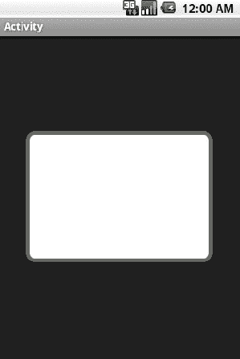

# 二、用户界面秘籍

Android 平台设计用于在各种不同的设备类型、屏幕尺寸和屏幕分辨率上运行。为了帮助开发人员应对这一挑战，Android 提供了丰富的用户界面组件工具包，可以根据他们特定应用的需求进行利用和定制。Android 还非常依赖可扩展的 XML 框架和资源限定符集来创建能够适应这些环境变化的动态布局。在这一章中，我们来看看一些实用的方法来构建这个框架，以满足您特定的开发需求。

#### 2–1。自定义窗口

##### 问题

默认的窗口元素不适合您的应用。

##### 解决方案

**(API 一级)**

使用主题和`WindowManager`自定义窗口属性和功能。无需任何定制，Android 应用中的活动将加载默认的系统主题，看起来有点像 Figure 2–1。

窗口颜色是黑色的，在活动的顶部有一个标题栏(通常是灰色的)。状态栏显示在所有东西的上方，下方有轻微的阴影效果。这些都是由窗口控制的应用的可定制方面，可以为整个应用或特定活动进行设置。

**图 2–1。** *一场裸奔活动*

##### 它是如何工作的

###### 用主题定制窗口属性

Android 中的主题是一种适用于整个应用或活动的外观样式。应用主题时有两种选择:使用系统主题或创建自定义主题。无论哪种情况，都会在 AndroidManifest.xml 文件中应用一个主题，如清单 2–1 所示。

**清单 2–1。** *AndroidManifest.xml*

`<?xml version="1.0" encoding="utf-8"?>
<manifest xmlns:android="http://schemas.android.com/apk/res/android"
    …>
    <!—Apply to the application tag for a global theme -->
    <application android:theme="THEME_NAME"
        …>
        <!—Apply to the activity tag for an individual theme -->
        <activity android:name=".Activity" android:theme="THEME_NAME"
            …>
            <intent-filter>
                  …
            </intent-filter>
        </activity>
    </application>
</manifest>`

**系统主题**

Android 框架打包的 styles.xml 包含一些主题选项，并设置了一些有用的自定义属性。在 SDK 文档中引用 R.style 将提供完整的列表，但这里有一些有用的示例:

*   主题。not title bar:从应用了此主题的组件中移除标题栏。
*   主题。移除标题栏和状态栏，填满整个屏幕。
*   主题。对话:让活动看起来像对话的有用主题。
*   主题。壁纸 **(API Level 5):** 应用用户选择的壁纸作为窗口背景。

清单 2–2 是通过设置`AndroidManifest.xml`文件中的`android:theme`属性应用于整个应用的系统主题示例:

**清单 2–2。** *应用上设置了主题的清单*

`<?xml version="1.0" encoding="utf-8"?>
<manifest xmlns:android="http://schemas.android.com/apk/res/android"
    …>
    <!—Apply to the application tag for a global theme -->
    <application android:theme="Theme.NoTitleBar"
        …>
        …
    </application>
</manifest>`

**自定义主题**

有时提供的系统选择是不够的。毕竟，窗口中的一些可定制元素甚至没有在系统选项中提及。定义一个自定义主题来完成这项工作很简单。

如果还没有，在项目的 res/values 路径中创建一个`styles.xml`文件。记住，主题只是在更大范围内应用的样式，所以它们是在同一个地方定义的。与窗口定制相关的主题方面可以在 SDK 的 R.attr 参考中找到，但这里是最常见的项目:

*   `android:windowNoTitle`
    *   控制是否移除默认标题栏。
    *   设置为`true`移除标题栏。
*   `android:windowFullscreen`
    *   控制是否删除系统状态栏。
    *   设置为`true`以移除状态栏并填充整个屏幕。
*   `android:windowBackground`
    *   作为背景应用的颜色或可绘制资源
    *   设置为颜色或可绘制值或资源
*   `android:windowContentOverlay`
    *   放置在窗口内容前景上的 Drawable。默认情况下，这是状态栏下方的阴影。
    *   设置为任何资源来代替默认的状态栏阴影，或者设置为 null(XML 中的`@null`)来移除它。
*   `android:windowTitleBackgroundStyle`
    *   应用于窗口标题视图的样式
    *   设置为任何样式资源。
*   `android:windowTitleSize`
    *   窗口标题视图的高度
    *   设置为任何维度或维度资源
*   `android:windowTitleStyle`
    *   应用于窗口标题文本的样式
    *   设置为任何样式资源

清单 2–3 是一个创建两个定制主题的 styles.xml 文件的例子:

*   `MyTheme.One: No title bar and the default status bar shadow removed`
*   `MyTheme.Two: Fullscreen with a custom background image`

**清单 2–3。** *带有两个自定义主题的 RES/values/styles . XML*

`<?xml version="1.0" encoding="utf-8"?>
<resources>
    
    
</resources>`

请注意，主题(或样式)也可能指示从其继承属性的父主题，因此不需要从头开始创建整个主题。在这个例子中，我们选择继承 Android 的默认系统主题，只定制我们需要区分的属性。所有平台主题都在 Android 包的`res/values/themes.xml`中定义。有关更多细节，请参考 SDK 关于样式和主题的文档。

清单 2–4 展示了如何将这些主题应用到 AndroidManifest.xml 中的单个活动实例:

**清单 2–4。** *以每个活动设定的主题显现*

`<?xml version="1.0" encoding="utf-8"?>
<manifest xmlns:android="http://schemas.android.com/apk/res/android"
    …>
    <!—Apply to the application tag for a global theme -->
    <application
        …>
        <!—Apply to the activity tag for an individual theme -->
        <activity android:name=".ActivityOne" android:theme="MyTheme.One"
            …>
            <intent-filter>
                  …
            </intent-filter>
        </activity>
        <activity android:name=".ActivityTwo" android:theme="MyTheme.Two"
            …>
            <intent-filter>
                  …
            </intent-filter>
        </activity>

    </application>
</manifest>`

**在代码中定制窗口特性**

除了使用样式 XML 之外，窗口属性也可以从活动中的 Java 代码定制。这种方法向开发人员开放了一个稍有不同的特性集供定制，尽管与 XML 样式有一些重叠。

通过代码定制窗口包括在为活动设置内容视图之前，使用`Activity.requestWindowFeature()`方法为每个特性变化向系统发出请求。

**注意:**所有使用`Activity.requestWindowFeature()`的扩展窗口功能的请求必须在调用`Activity.setContentView()`之前提出。此后所做的任何更改都不会发生。

您可以从该窗口请求的功能及其含义定义如下:

*   `FEATURE_CUSTOM_TITLE:`设置自定义布局资源为活动标题视图。
*   `FEATURE_NO_TITLE:`从活动中删除标题视图。
*   在标题中使用确定的(0-100%)进度条。
*   `FEATURE_INDETERMINATE_PROGRESS:`在标题视图中使用一个小的不确定(圆形)进度指示器。
*   `FEATURE_LEFT_ICON:`在标题视图的左侧包含一个小标题图标。
*   `FEATURE_RIGHT_ICON:`在标题视图的右侧包含一个小标题图标。

**FEATURE_CUSTOM_TITLE**

使用这个窗口特性将标准标题替换为完全自定义的布局资源(参见清单 2–5)。

**清单 2–5。** *活动设置自定义标题布局*

`protected void onCreate(Bundle savedInstanceState) {
    super.onCreate(savedInstanceState);
    //Request window features before setContentView
    requestWindowFeature(Window.FEATURE_CUSTOM_TITLE);
    setContentView(R.layout.main);

    //Set the layout resource to use for the custom title
    getWindow().setFeatureInt(Window.FEATURE_CUSTOM_TITLE, R.layout.custom_title);

}`

**注意:**因为此功能完全取代了默认标题视图，所以它不能与任何其他窗口功能标志结合使用。

**特征编号标题**

使用此窗口功能移除标准标题视图(参见清单 2–6)。

**清单 2–6。** *活动移除标准标题视图*

`protected void onCreate(Bundle savedInstanceState) {
    super.onCreate(savedInstanceState);
    //Request window features before setContentView
    requestWindowFeature(Window.FEATURE_NO_TITLE);
    setContentView(R.layout.main);

}`

**注意:**因为此功能完全删除了默认标题视图，所以它不能与任何其他窗口功能标志结合使用。

**功能 _ 进度**

使用此窗口功能访问窗口标题中确定的进度条。进度可以设置为从 0 (0%)到 10000 (100%)之间的任何值(参见清单 2–7)。)

**清单 2–7。** *使用窗口进度条的活动*

`protected void onCreate(Bundle savedInstanceState) {
    super.onCreate(savedInstanceState);
    //Request window features before setContentView
    requestWindowFeature(Window.FEATURE_PROGRESS);
    setContentView(R.layout.main);

    //Set the progress bar visibility
    setProgressBarVisibility(true);
    //Control progress value with setProgress
    setProgress(0);
    //Setting progress to 100% will cause it to disappear
    setProgress(10000);

}`

**特征 _ 不确定 _ 进度**

使用此窗口功能访问不确定的进度指示器，以显示后台活动。由于这个指示器是不确定的，它只能被显示或隐藏(见清单 2–8)。

**清单 2–8。** *使用窗口不定进度条的活动*

`protected void onCreate(Bundle savedInstanceState) {
    super.onCreate(savedInstanceState);
    //Request window features before setContentView
    requestWindowFeature(Window.FEATURE_INDETERMINATE_PROGRESS);
    setContentView(R.layout.main);

    //Show the progress indicator
    setProgressBarIndeterminateVisibility(true);

    //Hide the progress indicator
setProgressBarIndeterminateVisibility(false);
}`

**特征 _ 左侧 _ 图标**

使用这个窗口特性在标题视图的左侧放置一个小的可绘制图标(参见清单 2–9)。

**清单 2–9。** *活动使用功能图标*

`protected void onCreate(Bundle savedInstanceState) {
    super.onCreate(savedInstanceState);
    //Request window features before setContentView
    requestWindowFeature(Window.FEATURE_LEFT_ICON);
    setContentView(R.layout.main);

    //Set the layout resource to use for the custom title
    setFeatureDrawableResource(Window.FEATURE_LEFT_ICON, R.drawable.icon);
}`

**特征 _ 右键 _ 图标**

使用这个窗口特性来放置一个右对齐的小可绘制图标(见清单 2–10)。

**清单 2–10。** *活动使用功能图标*

`protected void onCreate(Bundle savedInstanceState) {
    super.onCreate(savedInstanceState);
    //Request window features before setContentView
    requestWindowFeature(Window.FEATURE_RIGHT_ICON);
    setContentView(R.layout.main);

    //Set the layout resource to use for the custom title
    setFeatureDrawableResource(Window.FEATURE_RIGHT_ICON, R.drawable.icon);
}`

**注意:** FEATURE_RIGHT_ICON 不一定表示图标会放在标题文字的右侧。

图 2–2 显示了同时启用所有图标和进度功能的活动。请注意此视图中所有元素的相对位置。

**图 2–2。** *在 Froyo 之前的活动(左)和 Froyo 之后的活动(右)中启用的窗口功能*

注意，在 8 (Froyo)之前的 API 级别中，`RIGHT`功能图标的布局仍然在标题文本的左侧。API Levels 8 和更高版本纠正了这个问题，现在在视图的右侧显示图标，尽管仍然在不确定进度指示器的左侧，如果它是可见的话。

#### 2–2。创建和显示视图

##### 问题

应用需要视图元素来显示信息并与用户交互。

##### 解决方案

**(API 一级)**

无论是使用 Android SDK 中众多可用视图和小部件之一，还是创建自定义显示，所有应用都需要视图来与用户交互。在 Android 中创建用户界面的首选方法是用 XML 定义它们，并在运行时扩展它们。

Android 中的视图结构是一棵树，根通常是活动或窗口的内容视图。视图组是管理一个或多个子视图显示的特殊视图，这些子视图可以是另一个视图组，并且树会继续增长。所有标准布局类都源自 ViewGroup，是 XML 布局文件根节点的最常见选择。

##### 它是如何工作的

让我们用两个按钮实例和一个接受用户输入的 EditText 来定义一个布局。我们可以在 res/layout/中定义一个名为 main.xml 的文件，内容如下(见清单 2–11)。

**清单 2–11。** *res/layout/main.xml*

`<LinearLayout xmlns:android="http://schemas.android.com/apk/res/android"
  android:layout_width="fill_parent"
  android:layout_height="fill_parent"
  android:orientation="vertical">
  <EditText
    android:id="@+id/editText"
    android:layout_width="fill_parent"
    android:layout_height="wrap_content"
  />
  <LinearLayout
    android:layout_width="fill_parent"
    android:layout_height="wrap_content"
    android:orientation="horizontal">
    <Button
      android:id="@+id/save"
      android:layout_width="wrap_content"
      android:layout_height="wrap_content"` `      android:text="Save"
    />
    <Button
      android:id="@+id/cancel"
      android:layout_width="wrap_content"
      android:layout_height="wrap_content"
      android:text="Cancel"
    />
  </LinearLayout>
</LinearLayout>`

`LinearLayout`是一个`ViewGroup`，它以水平或垂直的方式一个接一个地布置元素。在`main.xml`中，`EditText`和内`LinearLayout`依次垂直排列。内部`LinearLayout`(按钮)的内容水平排列。带有`android:id`值的视图元素是需要在 Java 代码中引用的元素，以便进一步定制或显示。

要使这个布局显示活动的内容，它必须在运行时膨胀。用一个方便的方法重载了`Activity.setContentView()`方法，只需要布局 ID 值。在这种情况下，在活动中设置布局就像这样简单:

`public void onCreate(Bundle savedInstanceState) {
    super.onCreate(savedInstanceState);
    setContentView(R.layout.main);
    //Continue Activity initialization
}`

除了提供 ID 值(main.xml 自动具有 R.layout.main 的 ID)之外，不需要任何东西。如果布局在附加到窗口之前需要更多的定制，您可以手动放大它，并在将其添加为内容视图之前做一些工作。清单 2–12 放大了相同的布局，并在显示之前添加了第三个按钮。

**清单 2–12。** *显示前的布局修改*

`public void onCreate(Bundle savedInstanceState) {
    super.onCreate(savedInstanceState);
    //Inflate the layout file
    LinearLayout layout = (LinearLayout)getLayoutInflater().inflate(R.layout.main, null);
    //Add a new button
    Button reset = new Button(this);
    reset.setText("Reset Form");
    layout.addView(reset,
        new LinearLayout.LayoutParams(LayoutParams.FILL_PARENT, LayoutParams.WRAP_CONTENT));

    //Attach the view to the window
    setContentView(layout);
}`

在这个实例中，XML 布局在活动代码中使用一个`LayoutInflater`展开，它的`inflate()`方法返回展开视图的句柄。由于 `LayoutInflater.inflate()`返回一个视图，我们必须将它转换成 XML 中的特定子类，以便不仅仅是将它附加到窗口。

**注意:**XML 布局文件中的根元素是从`LayoutInflater.inflate()`返回的视图元素。

#### 2–3 岁。监控点击动作

##### 问题

当用户点击视图时，应用需要做一些工作。

##### 解决方案

**(API 一级)**

确保视图对象是可点击的，并附加一个视图。OnClickListener 来处理事件。默认情况下，SDK 中的许多小部件已经是可点击的，例如按钮、图像按钮和复选框。然而，通过在 XML 中设置`android:clickable="true"`或从代码中调用`View.setClickable(true)`，任何视图都可以接收点击事件。

##### 它是如何工作的

要接收和处理 click 事件，创建一个 OnClickListener 并将其附加到 view 对象。在本例中，视图是在根布局中定义的按钮，如下所示:

`<Button
  android:id="@+id/myButton"
  android:layout_width="wrap_content"
  android:layout_height="wrap_content"
  android:text="My Button"
/>`

在活动代码中，通过按钮的`android:id`值和附加的监听器来检索按钮(参见清单 2–13)。

**清单 2–13。** *在按钮上设置监听器*

`public void onCreate(Bundle savedInstanceState) {
    super.onCreate(savedInstanceState);
    //Retrieve the button object
    Button myButton = (Button)findViewById(R.id.myButton);
    //Attach the listener
    myButton.setOnClickListener(clickListener);
}

//Listener object to handle the click events
View.OnClickListener clickListener = new View.OnClickListener() {
    public void onClick(View v) {
        //Code to handle the click event
    {
};`

**(API 4 级)**

从 API Level 4 开始，有一种更有效的方法来附加基本的点击监听器以查看小部件。视图小部件可以在 XML 中设置`android:onClick`属性，运行时会使用 Java 反射在事件发生时调用所需的方法。如果我们修改前面的示例以使用此方法，按钮的 XML 将变成如下所示:

`<Button
  android:layout_width="wrap_content"
  android:layout_height="wrap_content"
  android:text="My Button"
  android:onClick="onMyButtonClick"
/>`

在这个例子中不再需要`android:id`属性，因为我们在代码中引用它的唯一原因是为了添加监听器。这也简化了 Java 代码，看起来像清单 2–14。

**清单 2–14。**XML 中附加的*监听器*

`public void onCreate(Bundle savedInstanceState) {
    super.onCreate(savedInstanceState);
    //No code required here to attach the listener
}

public void onMyButtonClick(View v) {
    //Code to handle the click event
}`

#### 2–4 岁。独立于解决方案的素材

##### 问题

您的应用使用的图形素材不能很好地使用 Android 的传统机制在更高分辨率的屏幕上放大图像。

##### 解决方案

**(API 4 级)**

使用资源限定符，并为每个素材提供多种大小。Android SDK 定义了四种类型的屏幕分辨率或密度，如下所示:

*   低(ldpi): 120dpi
*   中等(mdpi): 160dpi
*   高(hdpi): 240dpi
*   超高(xhdpi): 320dpi(在 **API Level 8** 中添加)

默认情况下，一个 Android 项目可能只有一个存储所有图形资源的`res/drawable/`目录。在这种情况下，Android 将在中等分辨率的屏幕上以 1:1 的比例显示这些图像。当应用在更高分辨率的屏幕上运行时，Android 会将图像放大到 150%(xhdpi 为 200%)，这可能会导致质量下降。

##### 它是如何工作的

为避免此问题，建议您以不同的分辨率提供每个图像资源的多个副本，并将它们放入资源限定的目录路径中。

*   `res/drawable-ldpi/`
    *   mdpi 时大小的 75%
*   `res/drawable-mdpi/`
    *   记为原始图像大小
*   `res/drawable-hdpi/`
    *   mdpi 时大小的 150%
*   `res/drawable-xhdpi/`
    *   mdpi 时大小的 200%
    *   仅当应用支持 API 级别 8 作为最低目标时

图像在所有目录中必须具有相同的文件名。例如，如果您在 AndroidManifest.xml 中保留了默认的图标值(即`android:icon="@drawable/icon"`)，那么您将在项目中放置以下资源文件。

`res/drawable-ldpi/icon.png`(36×36 像素)

`res/drawable-mdpi/icon.png` (48x48 像素)

`res/drawable-hdpi/icon.png`(72×72 像素)

`res/drawable-xhdpi/icon.png` (96x96 像素，如果支持的话)

Android 将选择适合设备分辨率的素材，并将其作为应用图标显示在启动器屏幕上，从而不会缩放，也不会损失图像质量。

作为另一个例子，一个徽标图像要在整个应用中的几个地方显示，在中等分辨率的设备上是 200x200 像素。应该使用资源限定符以所有支持的大小提供该图像。

`res/drawable-ldpi/logo.png` (150x150 像素)

`res/drawable-mdpi/logo.png`(200×200 像素)

`res/drawable-hdpi/logo.png`(300×300 像素)

这个应用不支持超高分辨率显示，所以我们只提供三个图像。当需要引用这个资源时，只需使用`@drawable/logo`(来自 XML)或`R.drawable.logo`(来自 Java 代码)，Android 就会显示相应的资源。

#### 2–5 岁。锁定活动方向

##### 问题

您的应用中的某个活动不应该被允许旋转，或者旋转需要来自应用代码的更直接的干预。

##### 解决方案

**(API 一级)**

使用 AndroidManifest.xml 文件中的静态声明，可以修改每个单独的活动以锁定纵向或横向。这只能应用于`<activity>`标签，所以不能对整个应用范围执行一次。只需将`android:screenOrientation="portrait"`或`android:screenOrientation="landscape"`添加到`<activity>`元素，它们将始终显示在指定的方向，而不管设备如何定位。

还有一个选项可以在名为“behind”的 XML 中传递。如果一个 Activity 元素设置了`android:screenOrientation="behind"`，它将从堆栈中的前一个 Activity 中获取它的设置。这对于活动匹配其发起者的锁定方向来说是一种非常有用的方法，可以实现一些稍微更动态的行为。

##### 它是如何工作的

在清单 2–15 中描述的示例 AndroidManifest.xml 有三个活动。其中两个被锁定为纵向(MainActivity 和 ResultActivity)，而 UserEntryActivity 被允许旋转，大概是因为用户可能希望旋转并使用物理键盘。

**清单 2–15。**

`<?xml version="1.0" encoding="utf-8"?>
<manifest xmlns:android="http://schemas.android.com/apk/res/android"
      package="com.examples.rotation"
      android:versionCode="1"
      android:versionName="1.0">
    <application android:icon="@drawable/icon" android:label="@string/app_name">
        <activity android:name=".MainActivity"
            android:label="@string/app_name"
            android:screenOrientation="portrait">
            <intent-filter>
                <action android:name="android.intent.action.MAIN" />
                <category android:name="android.intent.category.LAUNCHER" />
            </intent-filter>
        </activity>
        <activity android:name=".ResultActivity"
            android:screenOrientation="portrait" />
        <activity android:name=".UserEntryActivity" />
    </application>
</manifest>`

#### 2–6 岁。动态定向锁定

##### 问题

存在屏幕不应该旋转的情况，但是这种情况是暂时的，或者取决于用户的愿望。

##### 解决方案

**(API 一级)**

使用 Android 中的请求方向机制，应用可以调整用于显示活动的屏幕方向，将其固定到特定的方向或将其释放给设备来决定。这是通过使用`Activity.setRequestedOrientation()`方法完成的，该方法从`ActivityInfo.screenOrientation`属性分组中获取一个整数常量。

默认情况下，请求的方向设置为`SCREEN_ORIENTATION_UNSPECIFIED`，这允许设备自己决定应该使用哪个方向。这通常是基于设备的物理方向的决定。使用`Activity.getRequestedOrientation()`也可以随时检索当前请求的方向。

##### 它是如何工作的

###### 用户旋转锁定按钮

作为一个例子，让我们创建一个 ToggleButton 实例，它控制是否锁定当前方向，允许用户在任何时候控制活动是否应该改变方向。

在 main.xml 布局中的某处，定义了一个 ToggleButton 实例:

`<ToggleButton
    android:id="@+id/toggleButton"
    android:layout_width="wrap_content"
    android:layout_height="wrap_content"
    android:textOff="Lock"
    android:textOn="LOCKED"
/>`

在活动代码中，我们将创建一个按钮状态监听器，该监听器根据按钮的当前值锁定和释放屏幕方向(参见清单 2–16)。

**清单 2–16。** *动态锁定/解锁屏幕方向的活动*

`public class LockActivity extends Activity {

    protected void onCreate(Bundle savedInstanceState) {
        super.onCreate(savedInstanceState);
        setContentView(R.layout.main);

        //Get handle to the button resource
        ToggleButton toggle = (ToggleButton)findViewById(R.id.toggleButton);
        //Set the default state before adding the listener
        if( getRequestedOrientation() != ActivityInfo.SCREEN_ORIENTATION_UNSPECIFIED ) {
            toggle.setChecked(true);
        } else {
            toggle.setChecked(false);
        }
        //Attach the listener to the button
        toggle.setOnCheckedChangeListener(listener);
    }

    OnCheckedChangeListener listener = new OnCheckedChangeListener() {
        public void onCheckedChanged(CompoundButton buttonView, boolean isChecked) {
            int current = getResources().getConfiguration().orientation;
            if(isChecked) {
                switch(current) {
                case Configuration.ORIENTATION_LANDSCAPE:
                    setRequestedOrientation(ActivityInfo.SCREEN_ORIENTATION_LANDSCAPE);
                    break;
                case Configuration.ORIENTATION_PORTRAIT:
                    setRequestedOrientation(ActivityInfo.SCREEN_ORIENTATION_PORTRAIT);
                    break;
                default:
                    setRequestedOrientation(ActivityInfo.SCREEN_ORIENTATION_UNSPECIFIED);
                }
            } else {
                setRequestedOrientation(ActivityInfo.SCREEN_ORIENTATION_UNSPECIFIED);
            }
        }
    }

}`

监听器中的代码是这个秘籍的关键成分。如果用户按下按钮并切换到 on 状态，则通过存储来自`Resources.getConfiguration()`的`orientation`参数读取当前方位。配置对象和请求的方向使用不同的常量来映射状态，所以我们打开当前的方向，用适当的常量调用`setRequestedOrientation()`。

**注意:**如果请求一个不同于当前状态的方向，并且您的活动在前台，则该活动将立即改变以适应该请求。

如果用户按下按钮，它切换到关闭状态，我们不再想锁定方向，所以再次用`SCREEN_ORIENTATION_UNSPECIFIED`常量调用`setRequestedOrientation()`将控制返回给设备。如果设备方向指示活动与应用锁定的位置不同，这也可能导致立即发生变化。

**注意:**设置一个请求方向并不能*而不是*阻止默认活动生命周期的发生。如果设备配置发生变化(键盘滑出或设备方向改变)，活动仍然会被销毁和重新创建，因此所有关于保持活动状态的规则仍然适用。

#### 2–7 岁。手动处理旋转

##### 问题

在轮换期间销毁和重新创建活动的默认行为会导致应用出现不可接受的性能损失。

如果没有定制，Android 将通过完成当前的 Activity 实例并在其位置上创建一个新的、适合新配置的 Activity 实例来响应配置更改。这可能会导致不适当的性能损失，因为必须保存 UI 状态，并完全重新构建 UI。

##### 解决方案

**(API 一级)**

利用`android:configChanges` manifest 参数来指示 Android 某个活动将在没有运行时帮助的情况下处理旋转事件。这不仅减少了 Android 销毁和重新创建活动实例的工作量，还减少了应用的工作量。在活动实例保持不变的情况下，应用不必花费时间来保存和恢复当前状态，以保持对用户的一致性。

注册一个或多个配置变更的活动将通过`Activity.onConfigurationChanged()`回调方法得到通知，在这里它可以执行与变更相关的任何必要的手动处理。

为了完全处理旋转，活动应该注册两个配置更改参数:`orientation`和`keyboardHidden`。`orientation`参数记录器件方向改变时的任何事件的活动。`keyboardHidden`参数记录用户滑入或滑出物理键盘时事件的活动。虽然后者可能不是直接感兴趣的，但如果你没有注册这些事件，Android 将在事件发生时重新创建你的活动，这可能会破坏你在处理旋转方面的努力。

##### 它是如何工作的

这些参数被添加到 AndroidManifest.xml 中的任何`<activity>`元素，如下所示:

`<activity android:name=".MyActivity" android:configChanges="orientation|keyboardHidden" />`

可以在同一个赋值语句中注册多个更改，在它们之间使用管道“|”字符。因为这些参数不能应用于`<application>`元素，所以每个单独的活动都必须在 AndroidManifest.xml 中注册。

注册活动后，配置更改会导致调用活动的`onConfigurationChanged()`方法。清单 2–17 是一个简单的活动定义，可以用来处理变更发生时收到的回调。

**清单 2–17。** *手动管理轮换的活动*

`public class MyActivity extends Activity {

    @Override
    protected void onCreate(Bundle savedInstanceState) {
        //Calling super is required
        super.onCreate(savedInstanceState);
        //Load view resources
        loadView();
    }

    @Override
    public void onConfigurationChanged(Configuration newConfig) {
        //Calling super is required
        super.onConfigurationChanged(newConfig);
        //Store important UI state
        saveState();
        //Reload the view resources
        loadView();
    }

    private void saveState() {
        //Implement any code to persist the UI state
    }

    private void loadView() {
        setContentView(R.layout.main);

        //Handle any other required UI changes upon a new configuration
        //Including restoring and stored state
    }
}`

**注意:** Google 不建议以这种方式处理旋转，除非这是应用性能所必需的。所有特定于配置的资源都必须手动加载，以响应每个更改事件。

值得注意的是，Google 建议在活动轮换时允许默认的重新创建行为，除非您的应用的性能需要绕过它。首先，这是因为如果你将替代资源存储在资源限定的目录中(比如用于横向布局的`res/layout-land/`),你将失去 Android 为加载替代资源提供的所有帮助。

在示例活动中，所有处理视图布局的代码都被抽象为私有方法`loadView()`，从`onCreate()`和`onConfigurationChanged()`中调用。在这种方法中，像`setContentView()`这样的代码被放置以确保适当的布局被加载以匹配配置。

调用`setContentView()`将完全重新加载视图，因此任何重要的 UI 状态仍然需要保存，并且不需要像`onSaveInstanceState()`和`onRestoreInstanceState()`这样的生命周期回调的帮助。为此，该示例实现了一个名为`saveState()`的方法。

#### 2–8 岁。创建弹出式菜单操作

##### 问题

您希望在用户选择用户界面的某个部分时，为用户提供多种操作。

##### 解决方案

**(API 一级)**

显示一个`ContextMenu`或`AlertDialog`以响应用户操作。

##### 它是如何工作的

###### 上下文菜单

使用一个`ContextMenu`是一个有用的解决方案，特别是当你想在一个`ListView`或其他`AdapterView`中基于一个项目点击提供一个动作列表的时候。这是因为`ContextMenu.ContextMenuInfo`对象提供了关于所选择的特定项目的有用信息，比如 id 和位置，这可能有助于构建菜单。

首先在 res/menu/中创建一个 XML 文件来定义菜单本身；我们称之为`contextmenu.xml`(见清单 2–18)。

**清单 2–18。***RES/menu/context menu . XML*

`<?xml version="1.0" encoding="utf-8"?>
<menu xmlns:android="http://schemas.android.com/apk/res/android">
  <item
    android:id="@+id/menu_delete"
    android:title="Delete Item"
  />
  <item
    android:id="@+id/menu_copy"
    android:title="Copy Item"
  />
  <item
    android:id="@+id/menu_edit"
    android:title="Edit Item"
  />
</menu>`

然后，利用`Activity`中的`onCreateContextMenu()`和`onContextItemSelected()`展开菜单并处理用户选择(参见清单 2–19)。

**清单 2–19。** *利用自定义菜单的活动*

`@Override
public void onCreateContextMenu(ContextMenu menu, View v, ContextMenu.ContextMenuInfo menuInfo) {
    super.onCreateContextMenu(menu, v, menuInfo);
    getMenuInflater().inflate(R.menu.contextmenu, menu);
    menu.setHeaderTitle("Choose an Option");
}

@Override
public boolean onContextItemSelected(MenuItem item) {
    //Switch on the item’s ID to find the action the user selected
    switch(item.getItemId()) {
    case R.id.menu_delete:
        //Perform delete actions
        return true;
    case R.id.menu_copy:
        //Perform copy actions
        return true;
    case R.id.menu_edit:
        //Perform edit actions
        return true;
    }
    return super.onContextItemSelected(item);
}`

为了激发这些回调方法，您必须注册将触发菜单的视图。实际上，这将视图的`View.OnCreateContextMenuListener`设置为当前的`Activity`:

`@Override
protected void onCreate(Bundle savedInstanceState) {
    super.onCreate(savedInstanceState);
    //Register a button for context events
    Button button = new Button(this);
    registerForContextMenu(button);

    setContentView(button);
}`

这个秘籍的关键要素是调用`Activity.openContextMenu()`方法来随时手动触发菜单。Android 中的默认行为是当长按发生时，许多视图显示一个`ContextMenu`作为主点击动作的替代。然而，在这种情况下，我们希望菜单成为主要动作，所以我们从动作监听器方法中调用`openContextMenu()`:

`public void onClick(View v) {
    openContextMenu(v);
}`

将所有的部分绑在一起，我们有一个简单的`Activity`来注册一个按钮，当点击时显示我们的菜单(见清单 2–20)。

**清单 2–20。** *利用上下文动作菜单的活动*

`public class MyActivity extends Activity {

    protected void onCreate(Bundle savedInstanceState) {
        super.onCreate(savedInstanceState);
        //Register a button for context events
        Button button = new Button(this);
        button.setText("Click for Options");
        button.setOnClickListener(listener);
        registerForContextMenu(button);

        setContentView(button);
    }

    View.OnClickListener listener = new View.OnClickListener() {
        public void onClick(View v) {
            openContextMenu(v);
        }
    };

    @Override
    public void onCreateContextMenu(ContextMenu menu, View v,
                ContextMenu.ContextMenuInfo menuInfo) {
        super.onCreateContextMenu(menu, v, menuInfo);
        getMenuInflater().inflate(R.menu.contextmenu, menu);
        menu.setHeaderTitle("Choose an Option");
    }

    @Override
    public boolean onContextItemSelected(MenuItem item) {
        //Switch on the item’s ID to find the action the user selected
        switch(item.getItemId()) {
        case R.id.menu_delete:
            //Perform delete actions
            return true;
        case R.id.menu_copy:
            //Perform copy actions
            return true;
        case R.id.menu_edit:
            //Perform edit actions
            return true;
        }
        return super.onContextItemSelected(item);
    }

}`

结果应用如图 2–3 中的所示。

**图 2–3。** *上下文动作菜单*

###### 警报对话框

使用`AlertDialog.Builder`可以构建一个类似的 AlertDialog，但是带有一些额外的选项。AlertDialog 是一个非常通用的类，用于创建简单的弹出窗口以获得用户的反馈。用 AlertDialog。构建器、单选或多选列表、按钮和消息字符串都可以轻松地添加到一个紧凑的小部件中。

为了说明这一点，让我们创建与使用 AlertDialog 之前相同的弹出选择。这一次，我们将在选项列表的底部添加一个取消按钮(参见清单 2–21)。

**清单 2–21。** *使用报警对话框的动作菜单*

`public class MyActivity extends Activity {

    AlertDialog actions;

    @Override
    protectedvoid onCreate(Bundle savedInstanceState) {
        super.onCreate(savedInstanceState);
        setTitle("Activity");
        Button button = new Button(this);
        button.setText("Click for Options");
        button.setOnClickListener(buttonListener);

        AlertDialog.Builder builder = new AlertDialog.Builder(this);
        builder.setTitle("Choose an Option");
        String[] options = {"Delete Item","Copy Item","Edit Item"};
        builder.setItems(options, actionListener);
        builder.setNegativeButton("Cancel", null);
        actions = builder.create();

        setContentView(button);
    }

    //List selection action handled here
    DialogInterface.OnClickListener actionListener =
            new DialogInterface.OnClickListener() {
        @Override
        public void onClick(DialogInterface dialog, int which) {
            switch(which) {
            case 0: //Delete
                break;
            case 1: //Copy
                break;
            case 2: //Edit
                break;
            default:
                break;
            }
        }
    };

    //Button action handled here (pop up the dialog)
    View.OnClickListener buttonListener = new View.OnClickListener() {
        @Override
        public void onClick(View v) {
            actions.show();
        }
    };
}`

在这个例子中，我们创建了一个新的`AlertDialog.Builder`实例，并使用它的便利方法来添加:

*   一个标题，使用`setTitle()`
*   可选择的选项列表，使用带有字符串数组的`setItems()`(也适用于数组资源)
*   一个取消按钮，使用`setNegativeButton()`

我们附加到列表项的侦听器返回哪个列表项被选为我们提供的数组中的从零开始的索引，因此 switch 语句检查适用的三种情况中的每一种。我们为 cancel 按钮的侦听器传入 null，因为在这个实例中，我们只是希望 Cancel 关闭对话框。如果在 cancel 上有一些重要的工作要做，可以将另一个侦听器传递给`setNegativeButton()`方法。

当按下按钮时，生成的应用现在看起来像 Figure 2–4。

**图 2–4。** *警报对话框动作菜单*

#### 2–9。自定义选项菜单

##### 问题

当用户按下硬件菜单按钮时，您的应用需要做的不仅仅是显示标准菜单。

##### 解决方案

**(API 一级)**

截取菜单按钮的`KeyEvent`,代之以一个自定义视图。

##### 它是如何工作的

通过重写`onKeyDown()`或`onKeyUp()`方法，可以在`Activity`或`View`内部拦截该事件:

`@Override
public boolean onKeyUp(int keyCode, KeyEvent event) {
    if(keyCode == KeyEvent.KEYCODE_MENU) {
        //Create and display a custom menu view
        //Return true to consume the event
        return true;
    }
    //Pass other events along their way up the chain
    return super.onKeyUp(keyCode, event);
}`

**注意:** `Activity.onKeyDown()`和`Activity.onKeyUp()`只有在其子视图首先处理事件时才被调用。在使用这些事件时，返回一个真值是很重要的，这样它们就不会被错误地传递到链上。

下一个例子展示了一个`Activity`,当用户按下菜单键时，它显示一组包装在一个简单的`AlertDialog`中的定制按钮，代替传统的选项菜单。在清单 2–22 中，我们将在 res/layout/中为按钮创建一个布局，并将其命名为 custommenu.xml

**清单 2–22。*RES/layout/custom menu . XML***

`<?xml version="1.0" encoding="utf-8"?>
<LinearLayoutxmlns:android="http://schemas.android.com/apk/res/android"
  android:layout_width="fill_parent"
  android:layout_height="wrap_content"
  android:orientation="horizontal">
  <ImageButton
    android:layout_width="fill_parent"
    android:layout_height="wrap_content"
    android:layout_weight="1"
    android:src="@android:drawable/ic_menu_send"
  />
  <ImageButton
    android:layout_width="fill_parent"
    android:layout_height="wrap_content"
    android:layout_weight="1"
    android:src="@android:drawable/ic_menu_save"
  />
  <ImageButton
    android:layout_width="fill_parent"
    android:layout_height="wrap_content"
    android:layout_weight="1"
    android:src="@android:drawable/ic_menu_search"
  />
  <ImageButton
    android:layout_width="fill_parent"
    android:layout_height="wrap_content"
    android:layout_weight="1"
    android:src="@android:drawable/ic_menu_preferences"
  />
</LinearLayout>`

这是一个有四个重量相等的按钮的布局(所以空间在屏幕上是均匀的)，显示了 Android 中的一些默认菜单图像。在清单 2–23 中，我们可以放大这个布局，并将其作为视图应用于`AlertDialog`。

**清单 2–23。** *活动覆盖菜单动作*

`public class MyActivity extends Activity {

MenuDialog menuDialog;
privateclass MenuDialog extends AlertDialog {

    public MenuDialog(Context context) {
        super(context);
        setTitle("Menu");
        View menu = getLayoutInflater().inflate(R.layout.custommenu, null);
        setView(menu);
    }

    @Override
    public boolean onKeyUp(int keyCode, KeyEvent event) {
        if(keyCode == KeyEvent.KEYCODE_MENU) {
            dismiss();
            returntrue;
        }
        returnsuper.onKeyUp(keyCode, event);
    }
}

@Override
public boolean onKeyUp(int keyCode, KeyEvent event) {
    if(keyCode == KeyEvent.KEYCODE_MENU) {
        if(menuDialog == null) {
            menuDialog = new MenuDialog(this);
        }
        menuDialog.show();
        return true;
    }
    return super.onKeyUp(keyCode, event);
}

}`

在这里，我们选择监视`Activity.onKeyUp()`方法，如果是菜单按压，则通过创建和显示`AlertDialog`的自定义子类来处理事件。

这个例子为对话框创建了一个自定义类，这样我们就可以扩展`AlertDialog.onKeyUp()`方法，在用户再次按下菜单按钮时关闭自定义菜单。我们不能在`Activity`中处理这个事件，因为`AlertDialog`在前台时会消耗所有的关键事件。我们这样做是为了匹配 Android 标准菜单的现有功能，因此不会破坏用户对应用行为的预期。

当加载前一个活动，并按下菜单按钮时，我们得到类似于 Figure 2–5 的结果。

**图 2–5。** *自定义选项菜单*

#### 2–10。自定义后退按钮

##### 问题

您的应用需要以自定义方式处理用户按下硬件后退按钮的情况。

##### 解决方案

**(API 一级)**

类似于覆盖菜单按钮的功能，硬件后退按钮向您的`Activity`发送一个`KeyEvent`，它可以在您的应用代码中被拦截和处理。

##### 它是如何工作的

与秘籍 2–9 的方式相同，覆盖`onKeyDown()`将赋予您控制权:

`@Override
public boolean onKeyDown(int keyCode, KeyEvent event) {
    if(keyCode == KeyEvent.KEYCODE_BACK) {
        //Implement a custom back function
        //Return true to consume the event
        return true;
    }
    //Pass other events along their way up the chain
    return super.onKeyDown(keyCode, event);
}`

**注意:**覆盖硬件按钮事件时应小心。所有的硬件按钮在整个 Android 系统中都有一致的功能，在这些界限之外调整功能会让用户感到困惑和不安。

与前面的例子不同，您不能可靠地使用`onKeyUp()`，因为默认行为(比如完成当前活动)发生在按键被按下时，而不是在按键被释放时。由于这个原因，`onKeyUp()`通常永远不会被调用返回键。

**(API 等级 5)**

从艾克蕾尔开始，SDK 包含了`Activity.onBackPressed()`回调方法。如果您的应用面向 SDK 级别 5 或更高，则可以重写此方法以执行自定义处理。

`@Override
public void onBackPressed() {
    //Custom back button processing
    //Must manually finish when complete
    finish();
}`

这个方法的默认实现只是简单地为您调用`finish()`，所以如果您希望活动在您的处理完成后关闭，这个实现将需要直接调用`finish()`。

#### 2–11。模拟主屏幕按钮

##### 问题

您的应用需要采取与用户按下硬件 HOME 按钮相同的动作。

##### 解决方案

**(API 一级)**

用户点击 Home 按钮的动作向系统发送一个`Intent`，告诉它加载 HOME 活动。这与在应用中启动任何其他活动没有什么不同；你只需要构建适当的意图来获得效果。

##### 它是如何工作的

在活动中您希望此操作发生的任何位置添加以下行:

`Intent intent = new Intent(Intent.ACTION_MAIN);
intent.addCategory(Intent.CATEGORY_HOME);
startActivity(intent);`

此函数的一个常见用途是覆盖 back 按钮以返回主页，而不是返回到上一个活动。这在前台活动下的所有内容都可能受到保护的情况下(例如，登录屏幕)很有用，并且让默认的后退按钮行为发生可能会允许对系统进行不安全的访问。下面是一个使用这两者来使某个活动在按下 back 时调出主屏幕的示例:

`@Override
public boolean onKeyDown(int keyCode, KeyEvent event) {
    if(keyCode == KeyEvent.KEYCODE_BACK) {
        Intent intent = new Intent(Intent.ACTION_MAIN);
        intent.addCategory(Intent.CATEGORY_HOME);
        startActivity(intent);
        returntrue;
    }
    returnsuper.onKeyDown(keyCode, event);
}`

#### 2–12 岁。_monitoring_textview_changes

##### 问题

您的应用需要持续监控 TextView 小部件(如 EditText)中的文本变化。

##### 解决方案

**(API 一级)**

实现`android.text.TextWatcher`接口。`TextWatcher`在更新文本的过程中提供了三种回调方法:

`public void beforeTextChanged(CharSequence s, int start, int count, int after);
public void onTextChanged(CharSequence s, int start, int before, int count);
public void afterTextChanged(Editable s);`

`beforeTextChanged()`和`onTextChanged()`方法主要是作为通知提供的，因为您实际上不能在这两个方法中对 CharSequence 进行更改。如果你试图截取输入到视图中的文本，当`afterTextChanged()`被调用时，可能会发生变化。

##### 它是如何工作的

要用一个`TextView`注册一个`TextWatcher`实例，调用`TextView.addTextChangedListener()`方法。从语法上注意到一个`TextView`可以注册多个`TextWatcher`。

###### 字符计数器示例

TextWatcher 的一个简单用法是创建一个实时字符计数器，它在用户键入或删除信息时跟随 EditText。清单 2–24 是一个示例活动，它为此实现了 TextWatcher，向 EditText 小部件注册，并在活动标题中打印字符数。

**清单 2–24。** *人物计数器活动*

`public class MyActivity extends Activity implements TextWatcher {

EditText text;
int textCount;

    @Override
    protected void onCreate(Bundle savedInstanceState) {
        super.onCreate(savedInstanceState);
        //Create an EditText widget and add the watcher
        text = new EditText(this);
        text.addTextChangedListener(this);

        setContentView(text);
    }

    /* TextWatcher Implemention Methods */
    public void beforeTextChanged(CharSequence s, int start, int count, int after) { }

    public void onTextChanged(CharSequence s, int start, int before, int end) {
        textCount = text.getText().length();
        setTitle(String.valueOf(textCount));
    }

    public void afterTextChanged(Editable s) { }

}`

因为我们的需求不包括修改插入的文本，所以我们可以从`onTextChanged()`开始读取计数，一旦文本发生变化，就会这样做。其他方法未被使用，并保留为空。

###### 货币格式化程序示例

SDK 有一些预定义的`TextWatcher`实例来格式化文本输入；`PhoneNumberFormattingTextWatcher`就是其中之一。他们的工作是在用户输入时应用标准格式，减少输入清晰数据所需的击键次数。

在清单 2–25 中，我们创建了一个 CurrencyTextWatcher 来将货币符号和分隔符插入到文本视图中。

**清单 2–25。** *货币格式器*

`public class CurrencyTextWatcher implements TextWatcher {

    boolean mEditing;

    public CurrencyTextWatcher() {
        mEditing = false;
}

    public synchronizedvoid afterTextChanged(Editable s) {
        if(!mEditing) {
            mEditing = true;

            //Strip symbols
            String digits = s.toString().replaceAll("\\D", "");
            NumberFormat nf = NumberFormat.getCurrencyInstance();
            try{
                String formatted = nf.format(Double.parseDouble(digits)/100);
                s.replace(0, s.length(), formatted);
            } catch (NumberFormatException nfe) {
                    s.clear();
            }

            mEditing = false;
        }
    }

    public void beforeTextChanged(CharSequence s, int start, int count, int after) { }

    public void onTextChanged(CharSequence s, int start, int before, int count) { }

}`

**注意:**对`afterTextChanged()`中的`Editable`值进行更改将导致`TextWatcher`方法被再次调用(毕竟，您只是更改了文本)。因此，编辑的自定义 TextWatcher 实现应该使用布尔值或其他某种跟踪机制来跟踪编辑来自何处，否则您可能会创建一个无限循环。

我们可以将这个自定义文本格式化程序应用于活动中的 EditText(参见清单 2–26)。

**清单 2–26。** *使用货币格式化程序的活动*

`public class MyActivity extends Activity {

    EditText text;

    @Override
    protected void onCreate(Bundle savedInstanceState) {
        super.onCreate(savedInstanceState);
        text = new EditText(this);
        text.addTextChangedListener(new CurrencyTextWatcher());

        setContentView(text);
    }

}`

如果您使用这个格式化程序格式化用户输入，用 XML 定义 EditText，那么这将非常方便，这样您就可以应用`android:inputType`和`android:digits`约束来轻松地保护字段，防止输入错误。特别是，在 EditText 中添加`android:digits="0123456789."`(注意小数点后面的句号)将保护这个格式化程序和用户。

#### 2–13 岁。滚动文本视图滚动条

##### 问题

您希望创建一个“ticker”视图，在屏幕上不断滚动其内容。

##### 解决方案

**(API 一级)**

使用`TextView`的内置选框功能。当一个`TextView`的内容太大而不适合它的边界时，默认情况下文本会被截断。这种截断可以使用`android:ellipsize`属性进行配置，该属性可以设置为以下选项之一:

*   没有人
    *   默认。
    *   截断文本的结尾，不带可视指示器。
*   开始
    *   在视图的开头用省略号截断文本的开头。
*   中间
    *   用视图中间的省略号截断文本的中间。
*   目标
    *   用视图末尾的省略号截断文本的结尾。
*   选取框
    *   不要省略；选中时动画显示和滚动文本。

**注意:**当`TextView`被选中时，选框功能仅用于动画和滚动文本。将`android:ellipsize`属性单独设置为 marquee 不会激活视图。

##### 它是如何工作的

为了创建无限重复的自动跑马灯，我们向 XML 布局添加了一个 TextView，如下所示:

`<TextView
  android:id="@+id/ticker"
  android:layout_width="fill_parent"
  android:layout_height="wrap_content"
  android:singleLine="true"
  android:scrollHorizontally="true"
  android:ellipsize="marquee"
  android:marqueeRepeatLimit="marquee_forever"
/>`

配置该视图的关键属性是最后四个。如果没有`android:singleLine`和`android:scrollHorizontally`，文本视图将不能正确地布局，以允许文本比视图长(这是滚动条滚动的一个关键要求)。设置`android:ellipsize`和`android:marqueeRepeatLimit`允许滚动发生，并且持续不确定的时间量。重复限制也可以设置为任何整数值，这将重复滚动动画很多次，然后停止。

在 XML 中正确设置 TextView 属性后，Java 代码必须将 selected 状态设置为 true，这将启用滚动动画:

`TextView ticker = (TextView)findViewById(R.id.ticker);
ticker.setSelected(true);`

如果您需要让动画基于用户界面中的某些事件开始和停止，只需每次分别用 true 或 false 调用`setSelected()`。

#### 2–14 岁。动画视图

##### 问题

您的应用需要将一个视图对象制作成动画，或者作为一种过渡，或者作为一种效果。

##### 解决方案

**(API 一级)**

一个`Animation`对象可以应用于任何视图，并使用`View.startAnimation()`方法运行；这将立即运行动画。你也可以使用`View.setAnimation()`来安排一个动画，并将对象附加到一个视图中，但不要立即运行它。在这种情况下，`Animation`必须设置其开始时间参数。

##### 它是如何工作的

###### 系统动画

为了方便起见，Android SDK 提供了一些可以应用于视图的过渡动画，可以在运行时使用`AnimationUtils`类加载这些动画:

*   滑动并淡入
    *   `AnimationUtils.makeInAnimation()`
    *   使用布尔参数确定幻灯片是向左还是向右。
*   向上滑动并淡入
    *   `AnimationUtils.makeInChildBottomAnimation()`
    *   视图总是从底部向上滑动。
*   滑动并淡出
    *   `AnimationUtils.makeOutAnimation()`
    *   使用布尔参数确定幻灯片是向左还是向右。
*   淡出
    *   `AnimationUtils.loadAnimation()`
    *   将 int 参数设置为`android.R.anim.fade_out.`
*   渐显
    *   `AnimationUtils.loadAnimation()`
    *   将 int 参数设置为`android.R.anim.fade_in.`

**注意:**这些过渡动画只是暂时改变视图的绘制方式。如果要永久添加或删除对象，还必须设置视图的可见性参数。

清单 2–27 显示了每个按钮点击事件中视图的出现和消失。

**清单 2–27。** *res/layout/main.xml*

`<?xml version="1.0" encoding="utf-8"?>
<LinearLayout xmlns:android="http://schemas.android.com/apk/res/android"
  android:orientation="vertical"
  android:layout_width="fill_parent"
  android:layout_height="fill_parent">
  <Button
    android:id="@+id/toggleButton"
    android:layout_width="fill_parent"
    android:layout_height="wrap_content"
    android:text="Click to Toggle"
  />
  <View
    android:id="@+id/theView"
    android:layout_width="fill_parent"
    android:layout_height="wrap_content"
    android:background="#AAA"
  />
</LinearLayout>`

在清单 2–28 中，按钮上的每一个用户动作都会以动画形式切换其下方灰色视图的可见性。

**清单 2–28。** *活动动画视图转场*

`public class AnimateActivity extends Activity implements View.OnClickListener {

    View viewToAnimate;

    @Override
    public void onCreate(Bundle savedInstanceState) {
        super.onCreate(savedInstanceState);
        setContentView(R.layout.main);

        Button button = (Button)findViewById(R.id.toggleButton);
        button.setOnClickListener(this);

        viewToAnimate = findViewById(R.id.theView);
    }

    @Override
    public void onClick(View v) {
        if(viewToAnimate.getVisibility() == View.VISIBLE) {
            //If the view is visible already, slide it out to the right
            Animation out = AnimationUtils.makeOutAnimation(this, true);
            viewToAnimate.startAnimation(out);
            viewToAnimate.setVisibility(View.INVISIBLE);
        } else {
            //If the view is hidden, do a fade_in in-place
            Animation in = AnimationUtils.loadAnimation(this, android.R.anim.fade_in);
            viewToAnimate.startAnimation(in);
            viewToAnimate.setVisibility(View.VISIBLE);
        }
    }
}`

视图通过向右滑动并同时淡出来隐藏，而视图简单地在显示时淡入到位。我们在这里选择了一个简单的`View`作为目标来演示任何 UI 元素(因为它们都是`View`的子类)都可以用这种方式制作动画。

###### 自定义动画

创建自定义动画，通过缩放、旋转和变换视图来添加效果，也可以为用户界面提供宝贵的附加内容。在 Android 中，我们可以创建以下动画元素:

*   阿尔法动画
    *   动画显示视图透明度的变化。
*   旋转模拟
    *   动画显示视图旋转的变化。
    *   旋转发生的点是可配置的。默认情况下，左上角被选中。
*   缩放动画
    *   动画显示视图比例(大小)的变化。
    *   刻度变化的中心点是可配置的。默认情况下，左上角被选中。
*   翻译形象化
    *   动画显示视图位置的变化。

让我们通过创建一个在图像上创建“硬币翻转”效果的示例应用来说明如何构建和添加一个自定义动画对象(参见清单 2–30)。

**清单 2–29。** *res/layout/main.xml*

`<?xml version="1.0" encoding="utf-8"?>
<RelativeLayout xmlns:android="http://schemas.android.com/apk/res/android"
  android:layout_width="fill_parent"
  android:layout_height="fill_parent">
  <ImageView
    android:id="@+id/flip_image"
    android:layout_width="wrap_content"
    android:layout_height="wrap_content"
    android:layout_centerInParent="true"
  />
</RelativeLayout>`

**清单 2–30。** *带自定义动画的活动*

`public class Flipper extends Activity {

    boolean isHeads;
    ScaleAnimation shrink, grow;
    ImageView flipImage;

    @Override
    public void onCreate(Bundle savedInstanceState) {
        super.onCreate(savedInstanceState);
        setContentView(R.layout.main);

        flipImage = (ImageView)findViewById(R.id.flip_image);
        flipImage.setImageResource(R.drawable.heads);
        isHeads = true;

        shrink = new ScaleAnimation(1.0f, 0.0f, 1.0f, 1.0f,
                           ScaleAnimation.RELATIVE_TO_SELF, 0.5f,
                           ScaleAnimation.RELATIVE_TO_SELF, 0.5f);
        shrink.setDuration(150);
        shrink.setAnimationListener(new Animation.AnimationListener() {
            @Override
            public void onAnimationStart(Animation animation) {}

            @Override
            public void onAnimationRepeat(Animation animation) {}

            @Override
            public void onAnimationEnd(Animation animation) {
                if(isHeads) {
                    isHeads = false;
                    flipImage.setImageResource(R.drawable.tails);
                } else {
                    isHeads = true;
                    flipImage.setImageResource(R.drawable.heads);
                }
                flipImage.startAnimation(grow);
            }
        });
        grow = new ScaleAnimation(0.0f, 1.0f, 1.0f, 1.0f,
                         ScaleAnimation.RELATIVE_TO_SELF, 0.5f,
                         ScaleAnimation.RELATIVE_TO_SELF, 0.5f);
        grow.setDuration(150);
    }

    @Override
    public boolean onTouchEvent(MotionEvent event) {
        if(event.getAction() == MotionEvent.ACTION_DOWN) {
            flipImage.startAnimation(shrink);
            returntrue;
        }
        returnsuper.onTouchEvent(event);
    }
}`

该示例包括以下相关组件:

*   硬币头部和尾部的两个图像资源(我们将其命名为 heads.png 和尾巴)。
    *   这些图像可以是放置在 res/drawable 中的任何双图像资源。ImageView 默认显示头像。
*   两个 ScaleAnimation 对象
    *   缩小:将图像中心的宽度从全宽缩小到零。
    *   增长:将图像宽度从零增加到围绕中心的全部。
*   匿名 AnimationListener 按顺序链接两个动画

自定义动画对象可以用 XML 或代码来定义。在下一节中，我们将看看如何将动画制作成 XML 资源。这里我们使用下面的构造函数创建了两个`ScaleAnimation`对象:

`ScaleAnimation(
  float fromX,
  float toX,
  float fromY,
  float toY,
  int pivotXType,
  float pivotXValue,
  int pivotYType,
  float pibotYValue
)`

前四个参数是要应用的水平和垂直比例因子。请注意，在示例中，X 从 100–0%收缩到 0–100%增长，而 Y 始终保持 100%。

其余参数定义了动画播放时视图的锚点。在这种情况下，我们告诉应用锚定视图的中点，并在视图收缩时将两边都拉向中间。对于扩展图像来说，情况正好相反:中心保持不变，图像向其原始边缘扩展。

Android 本身并没有办法将多个动画对象按顺序链接在一起，所以我们使用了一个`Animation.AnimationListener`来实现这个目的。监听器有方法通知动画何时开始、重复和完成。在这种情况下，我们只对后者感兴趣，这样当收缩动画完成时，我们可以在它之后自动启动增长动画。

示例中使用的最后一个方法是用`setDuration()`方法来设置动画持续时间。这里提供的值是以毫秒为单位的，所以我们的整个抛硬币过程需要 300 毫秒，每个`ScaleAnimation`需要 150 毫秒。

###### 动画集

很多时候，您正在搜索创建的自定义动画需要前面描述的基本类型的组合；这就是`AnimationSet`变得有用的地方。`AnimationSet`定义一组应该同时运行的动画。默认情况下，所有动画将一起开始，并在各自的持续时间内完成。

在本节中，我们还将展示如何使用 Android 首选的 XML 资源方法来定义自定义动画。XML 动画应该在项目的 res/anim/文件夹中定义。支持以下标签，它们都可以是动画的根节点或子节点:

*   `<alpha>`:alpha animation 对象
*   `<rotate>`:旋转动画对象
*   `<scale>`:一个 ScaleAnimation 对象
*   `<translate>`:translate animation 对象
*   `<set>`:动画 t

但是，只有`<set>`标签可以是父标签并包含其他动画标签。

在这个例子中，让我们看看硬币投掷动画，并添加另一个维度。我们将每个 ScaleAnimation 与 TranslateAnimation 作为一个集合进行配对。理想的效果是图像在“翻转”时在屏幕上上下滑动为此，在清单 2–31 和清单 2–32 中，我们将在两个 XML 文件中定义我们的动画，并将它们放在 res/anim/中。第一个是 grow.xml。

**清单 2–31。*RES/anim/grow . XML***

`<?xml version="1.0" encoding="utf-8"?>
<set xmlns:android="http://schemas.android.com/apk/res/android">
  <scale
    android:duration="150"
    android:fromXScale="0.0"
    android:toXScale="1.0"
    android:fromYScale="1.0"
    android:toYScale="1.0"
    android:pivotX="50%"
    android:pivotY="50%"
  />
<translate
    android:duration="150"
    android:fromXDelta="0%"
    android:toXDelta="0%"
    android:fromYDelta="50%"
    android:toYDelta="0%"
  />
</set>`

后面是 shrink.xml:

**清单 2–32。** *res/anim/shrink.xml*

`<?xml version="1.0" encoding="utf-8"?>
<set xmlns:android="http://schemas.android.com/apk/res/android">
<scale
    android:duration="150"
    android:fromXScale="1.0"
    android:toXScale="0.0"
    android:fromYScale="1.0"
    android:toYScale="1.0"
    android:pivotX="50%"
    android:pivotY="50%"
  />
  <translate
    android:duration="150"
    android:fromXDelta="0%"
    android:toXDelta="0%"
    android:fromYDelta="0%"
    android:toYDelta="50%"
  />
</set>`

定义比例值与以前在代码中使用构造函数时没有任何不同。但是，有一点需要注意，那就是 pivot 参数的单位定义样式。所有可以定义为`ABSOULUTE`、`RELATIVE_TO_SELF`或`RELATIVE_TO_PARENT`的动画尺寸都使用以下 XML 语法:

*   `ABSOLUTE`:用浮点值表示实际像素值(如“5.0”)。
*   `RELATIVE_TO_SELF`:使用 0-100 之间的百分比值(如“50%”)。
*   `RELATIVE_TO_PARENT`:使用带后缀“p”的百分比值(例如，“25%p”)。

定义了这些动画文件后，我们可以修改前面的例子来加载这些集合(参见清单 2–33 和 2–34)。

**清单 2–33。** *res/layout/main.xml*

`<?xml version="1.0" encoding="utf-8"?>
<RelativeLayout xmlns:android="http://schemas.android.com/apk/res/android"
  android:layout_width="fill_parent"
  android:layout_height="fill_parent">
  <ImageView
    android:id="@+id/flip_image"
    android:layout_width="wrap_content"
    android:layout_height="wrap_content"
    android:layout_centerInParent="true"
  />
</RelativeLayout>`

**清单 2–34。** *活动使用动画集*

`public class Flipper extends Activity {

    boolean isHeads;
    Animation shrink, grow;
    ImageView flipImage;

    @Override
    public void onCreate(Bundle savedInstanceState) {
        super.onCreate(savedInstanceState);
        setContentView(R.layout.main);

        flipImage = (ImageView)findViewById(R.id.flip_image);
        flipImage.setImageResource(R.drawable.heads);
        isHeads = true;

        shrink = AnimationUtils.loadAnimation(this, R.anim.shrink);
        shrink.setAnimationListener(new Animation.AnimationListener() {
            @Override
            public void onAnimationStart(Animation animation) {}

            @Override
            public void onAnimationRepeat(Animation animation) {}

            @Override
            public void onAnimationEnd(Animation animation) {
                if(isHeads) {
                    isHeads = false;
                    flipImage.setImageResource(R.drawable.tails);
                } else {
                    isHeads = true;
                    flipImage.setImageResource(R.drawable.heads);
                }
                flipImage.startAnimation(grow);
            }
        });
        grow = AnimationUtils.loadAnimation(this, R.anim.grow);
    }

    @Override
    public boolean onTouchEvent(MotionEvent event) {
        if(event.getAction() == MotionEvent.ACTION_DOWN) {
            flipImage.startAnimation(shrink);
            returntrue;
        }
        returnsuper.onTouchEvent(event);
    }
}`

结果是硬币会翻转，而且每次翻转都会在屏幕的 y 轴上轻微地上下滑动。

#### 2–15 岁。创建可绘制的背景

##### 问题

您的应用需要创建带有渐变和圆角的自定义背景，并且您不想浪费时间缩放大量图像文件。

##### 解决方案

**(API 一级)**

使用 Android 最强大的 XML 资源系统实现:创建可绘制的形状。当您能够这样做时，将这些视图创建为 XML 资源是有意义的，因为它们本身是可伸缩的，并且当设置为背景时，它们将适合视图的边界。

当使用`<shape>`标签在 XML 中定义 drawable 时，实际结果是一个`GradientDrawable`对象。您可以将对象定义为矩形、椭圆形、直线形或环形；虽然矩形是最常用的背景。特别是，当使用矩形时，可以为形状定义以下参数:

*   拐角半径
    *   定义用于倒圆所有四个角的半径，或定义单独的半径以不同的方式倒圆每个角
*   梯度
    *   线性、径向或扫描
    *   两个或三个颜色值
    *   方向为 45 度的任意倍数(0 表示从左到右，90 表示从下到上，依此类推。)
*   纯色
    *   填充形状的单色
    *   也定义了渐变，不太好
*   中风
    *   形状周围的边框
    *   定义宽度和颜色
*   尺寸和填充

##### 它是如何工作的

为视图创建静态背景图像可能很棘手，因为图像通常必须以多种尺寸创建，才能在所有设备上正确显示。如果预期视图的大小会根据其内容动态变化，那么这个问题就更复杂了。

为了避免这个问题，我们在 res/drawable 中创建了一个 XML 文件来描述一个形状，我们可以将它作为任何视图的`android:background`属性来应用。

###### 渐变列表视图行

这种技术的第一个例子是创建一个渐变矩形，它适合作为`ListView`中单独行的背景。这个形状的 XML 在清单 2–35 中定义。

**清单 2–35。***RES/drawable/back gradient . XML*

`<?xml version="1.0" encoding="utf-8"?>
<shape xmlns:android="http://schemas.android.com/apk/res/android"
  android:shape="rectangle">
  <gradient
    android:startColor="#EFEFEF"
    android:endColor="#989898"
    android:type="linear"
    android:angle="270"
  />
</shape>`

这里我们选择了两种灰度之间的线性渐变，从上到下。如果我们想给渐变添加第三种颜色，我们可以给`<gradient>`标签添加一个`android:middleColor`属性。

现在，这个 drawable 可以被任何用来创建你的 ListView 的自定义项目的视图或布局引用(我们将在 Recipe 2–23 中讨论更多关于创建这些视图的内容)。通过将属性`android:background="@drawable/backgradient"`添加到视图的 XML 中，或者在 Java 代码中调用`View.setBackgroundResource(R.drawable.backgradient)`，drawable 将被添加为背景。

**高级提示:**XML 中对颜色的限制是三个，但是`GradientDrawable`的构造函数接受一个用于颜色的`int[]`参数，您可以传递任意多的颜色。

当我们将这个 drawable 作为背景应用到`ListView`中的行时，结果将类似于图 2–6。

**图 2–6。** *渐变可绘制为行背景*

###### 圆形视图组

XML drawables 的另一个常见用途是为一个布局创建一个背景，该布局将一些小部件可视化地组合在一起。为了美观，圆角和细边框也经常使用。XML 中定义的这个形状看起来像清单 2–36 中的。

**清单 2–36。***RES/drawable/round back . XML*

`<?xml version="1.0" encoding="utf-8"?>
<shape xmlns:android="http://schemas.android.com/apk/res/android"
  android:shape="rectangle">
  <solid
    android:color="#FFF"
  />
  <corners
    android:radius="10dip"
  />
  <stroke
    android:width="5dip"
    android:color="#555"
  />
</shape>`

在这种情况下，我们选择白色作为填充颜色，灰色作为边框线条。正如前面的例子中提到的，通过将属性`android:background="@drawable/roundback"`包含到视图的 XML 中，或者在 Java 代码中调用`View.setBackgroundResource(R.drawable.roundback)`，这个 drawable 可以被任何视图或布局作为背景引用。

当作为背景应用于视图时，结果如图 2–7 所示。

**图 2–7。** *带边框的圆角矩形作为视图背景*

#### 2–16。创建自定义状态绘图

##### 问题

您想要定制一个元素，比如具有多种状态(默认、按下、选中等等)的`Button`或`CheckBox`。

##### 解决方案

**(API 一级)**

创建一个可应用于元素的状态列表。无论您是用 XML 定义自己的可绘制图形，还是使用图像，Android 都通过另一个 XML 元素`<selector>`提供了创建多个图像的单个引用以及它们应该可见的条件的方法。

##### 它是如何工作的

让我们来看一个示例状态列表 drawable，并讨论它的各个部分:

`<?xml version="1.0" encoding="utf-8"?>
<selector xmlns:android="http://schemas.android.com/apk/res/android">
  <item android:state_enabled="false" android:drawable="@drawable/disabled" />
  <itemandroid:state_pressed="true"android:drawable="@drawable/selected" />
  <item android:state_focused="true"android:drawable="@drawable/selected" />
  <item android:drawable="@drawable/default" />
</selector>`

**注意:**`<selector>`是订单特定的。Android 将在遍历列表时返回它完全匹配的第一个状态的 drawable。在确定将哪些状态属性应用于每个项目时，请记住这一点。

列表中的每一项都标识了为使被引用的可提取项成为被选中项而必须生效的状态。如果需要匹配多个状态值，可以为一个项目添加多个状态参数。Android 将遍历列表，选择第一个符合当前视图所有标准的状态。因此，将您的正常或默认状态放在列表的底部，不附加任何标准，这被认为是一个好的做法。

下面是最常用的状态属性列表。所有这些都是布尔值:

*   `state_enabled`
    *   视图将从`isEnabled().`返回的值
*   `state_pressed`
    *   用户在触摸屏上按下视图。
*   `state_focused`
    *   视图有焦点。
*   `state_selected`
    *   用户使用按键或数字键盘选择视图。
*   `state_checked`
    *   可检查视图将从`isChecked().`返回的值

现在，让我们看看如何将这些状态列表 drawables 应用到不同的视图中。

###### 按钮和可点击的部件

像 Button 这样的小部件被设计成当视图在上述状态中移动时，它们的背景可以改变。因此，XML 中的`android:background`属性或`View.setBackgroundDrawable()`方法是附加状态列表的合适方法。清单 2–37 是一个在 RES/drawable/called button _ States . XML 中定义的文件示例:

**清单 2–37。***RES/drawable/button _ States . XML*

`<?xml version="1.0" encoding="utf-8"?>
<selector xmlns:android="http://schemas.android.com/apk/res/android">
  <item android:state_enabled="false" android:drawable="@drawable/disabled" />
  <itemandroid:state_pressed="true"android:drawable="@drawable/selected" />
  <item android:drawable="@drawable/default" />
</selector>`

这里列出的三个`@drawable`资源是选择器要在其中切换的项目中的图像。正如我们在上一节中提到的，如果没有其他条目包含与当前视图匹配的状态，那么最后一个条目将作为默认值返回，因此我们不需要在那个条目上包含一个匹配的状态。将它附加到 XML 中定义的视图，如下所示:

`<Button
  android:layout_width="wrap_content"
  android:layout_height="wrap_content"
  android:text="My Button"
  android:background="@drawable/button_states"
/>`

###### 复选框和可检查的小部件

许多实现 Checkable 接口的小部件，如 CheckBox 和 CompoundButton 的其他子类，具有稍微不同的改变状态的机制。在这些情况下，背景与状态没有关联，自定义 drawable 来表示“选中”状态是通过另一个名为 button 的属性来完成的。在 XML 中，这是`android:button`属性，而在代码中,`CompoundButton.setButtonDrawable()`方法应该可以做到这一点。

清单 2–38 是一个在 RES/drawable/called check _ States . XML 中定义的文件的例子。同样，列出的`@drawable`资源意味着引用要切换的项目中的图像。

**清单 2–38。***RES/drawable/check _ States . XML*

`<?xml version="1.0" encoding="utf-8"?>
  <selector xmlns:android="http://schemas.android.com/apk/res/android">
  <item android:state_enabled="false" android:drawable="@drawable/disabled" />
  <itemandroid:state_checked="true"android:drawable="@drawable/checked" />
  <item android:drawable="@drawable/unchecked" />
</selector>`

并附加到 XML 中的复选框:

`<CheckBox
  android:layout_width="wrap_content"
  android:layout_height="wrap_content"
  android:button="@drawable/check_states"
/>`

#### 2–17 岁。将遮罩应用到图像

##### 问题

您需要应用一个图像或形状作为剪辑蒙版来定义应用中第二个图像的可见边界。

##### 解决方案

**(API 一级)**

使用 2D 图形和一个`PorterDuffXferMode`，你可以将任意蒙版(以另一个位图的形式)应用于位图图像。该秘籍的基本步骤如下:

1.  创建一个可变位图(空白)，并在其中绘制一个画布。
2.  首先在画布上绘制蒙版图案。
3.  将`PorterDuffXferMode`涂在油漆上。
4.  使用传输模式在画布上绘制源图像。

其中的关键成分是`PorterDuffXferMode`，它考虑了绘制操作过程中源对象和目标对象的当前状态。目标是现有的画布数据，源是当前操作中应用的图形数据。

有许多模式参数可以与此相关联，它们对结果产生不同的影响，但是对于掩蔽，我们感兴趣的是使用`PorterDuff.Mode.SRC_IN`模式。该模式将只在源和目的重叠的位置绘制，绘制的像素将来自源；换句话说，源被目标的边界截断。

##### 它是如何工作的

###### 圆角位图

这种技术的一个非常常见的用途是在将位图图像显示在`ImageView`中之前对其应用圆角。对于这个例子，Figure 2–8 是我们将要遮罩的原始图像。

**图 2–8。** *原始源图像*

我们将首先在画布上创建一个圆角半径为所需的圆角矩形，这将作为图像的“蒙版”。然后，当我们将源图像绘制到同一个画布上时，应用`PorterDuff.Mode.SRC_IN`变换，结果将是带有圆角的源图像。

这是因为 SRC_IN 传输模式告诉 paint 对象只在源和目标(我们已经绘制的圆角矩形)重叠的画布位置上绘制像素，并且绘制的像素来自源。清单 2–39 是活动内部的代码。

**清单 2–39。** *将圆角矩形蒙版应用于位图的活动*

`public class MaskActivity extends Activity {
    /** Called when the activity is first created. */
    @Override
    public void onCreate(Bundle savedInstanceState) {
        super.onCreate(savedInstanceState);
        ImageView iv = new ImageView(this);

        //Create and load images (immutable, typically)
        Bitmap source = BitmapFactory.decodeResource(getResources(), R.drawable.dog);

        //Create a *mutable* location, and a canvas to draw into it
        Bitmap result = Bitmap.createBitmap(source.getWidth(), source.getHeight(), Config.ARGB_8888);
        Canvas canvas = new Canvas(result);
        Paint paint = new Paint(Paint.ANTI_ALIAS_FLAG);

        //Create and draw the rounded rectangle "mask" first
        RectF rect = new RectF(0,0,source.getWidth(),source.getHeight());
        float radius = 25.0f;
        paint.setColor(Color.BLACK);
        canvas.drawRoundRect(rect, radius, radius, paint);
        //Switch over and paint the source using the transfer mode
        paint.setXfermode(new PorterDuffXfermode(Mode.SRC_IN));
        canvas.drawBitmap(source, 0, 0, paint);
        paint.setXfermode(null);

        iv.setImageBitmap(result);
        setContentView(iv);
    }
}`

您努力的结果显示在图 2–9 中。

**图 2–9。** *应用了圆角矩形蒙版的图像*

###### 任意遮罩图像

让我们看一个更有趣的例子。在这里，我们拍摄了两幅图像，一幅是源图像，另一幅是代表我们想要应用的蒙版的图像——在这种情况下，是一个倒置的三角形(见图 2–10)。

**图 2–10。** *【原始源图像】(左)和任意遮罩图像(右)*

选取的蒙版图像不必符合此处选取的样式，蒙版为黑色像素，其他地方为透明像素。但是，这是保证系统完全按照您的预期绘制遮罩的最佳选择。清单 2–40 是简单的活动代码，用于屏蔽图像并将其显示在视图中。

**清单 2–40。** *将任意蒙版应用于位图的活动*

`public class MaskActivity extends Activity {

@Override
    public void onCreate(Bundle savedInstanceState) {
        super.onCreate(savedInstanceState);
        ImageView iv = new ImageView(this);

        //Create and load images (immutable, typically)
        Bitmap source = BitmapFactory.decodeResource(getResources(), R.drawable.dog);
        Bitmap mask = BitmapFactory.decodeResource(getResources(), R.drawable.triangle);

        //Create a *mutable* location, and a canvas to draw into it
        Bitmap result = Bitmap.createBitmap(source.getWidth(), source.getHeight(), Config.ARGB_8888);
        Canvas canvas = new Canvas(result);
        Paint paint = new Paint(Paint.ANTI_ALIAS_FLAG);

        //Draw the mask image first, then paint the source using the transfer mode
        canvas.drawBitmap(mask, 0, 0, paint);
        paint.setXfermode(new PorterDuffXfermode(Mode.SRC_IN));
        canvas.drawBitmap(source, 0, 0, paint);
        paint.setXfermode(null);

        iv.setImageBitmap(result);
        setContentView(iv);
    }
}`

和以前一样，我们首先在画布上绘制蒙版，然后使用`PorterDuff.Mode.SRC_IN`模式绘制源图像，只绘制与现有蒙版像素重叠的源像素。结果看起来有点像图 2–11。

**图 2–11。** *应用了蒙版的图像*

###### 请在家里试试这个

以这种方式应用`PorterDuffXferMode`来混合两个图像可以创建许多有趣的结果。尝试使用相同的示例代码，但是将`PorterDuff.Mode`参数改为许多其他选项中的一个。每种模式都会以稍微不同的方式混合两个位图。玩得开心！

#### 2–18 岁。创建持久的对话

##### 问题

您希望创建一个用户对话框，其中包含多个输入字段或一些其他信息集，如果设备旋转，这些信息需要持久化。

##### 解决方案

**(API 一级)**

根本不要使用对话框；创建一个以对话为主题的活动。对话框是托管对象，当设备在可见的情况下旋转时必须正确处理，否则会导致窗口管理器中的引用泄漏。您可以通过让您的活动使用像 `Activity.showDialog()`和`Activity.dismissDialog()`这样的方法来呈现对话框来减轻这个问题，但是这只能解决一个问题。

该对话框没有任何自己的机制来通过循环保持状态，并且该作业(根据设计)退回到呈现它的活动。这导致了额外的工作，以确保对话框在被关闭之前可以传回或保存输入其中的任何值。

如果您有一个界面要呈现给用户，它需要持久化状态并通过旋转保持面向前方，一个更好的解决方案是让它成为一个活动。这允许该对象访问用于保存/恢复状态的全套生命周期回调方法。此外，作为一个活动，它不需要在轮换期间被管理为解除和再次呈现，这消除了泄漏引用的担心。使用`Theme.Dialog`系统主题，您仍然可以从用户的角度使活动表现得像一个对话框。

##### 它是如何工作的

清单 2–41 是一个简单活动的例子，在文本视图中有一个标题和一些文本。

**清单 2–41。** *主题为对话的活动*

`public class DialogActivity extends Activity {
    @Override
    public void onCreate(Bundle savedInstanceState) {
        super.onCreate(savedInstanceState);
        setTitle("Activity");
        TextView tv = new TextView(this);
        tv.setText("I'm Really An Activity!");
        //Add some padding to keep the dialog borders away
        tv.setPadding(15, 15, 15, 15);
        setContentView(tv);
    }
}`

我们可以在应用的 AndroidManifest.xml 文件中将对话框主题应用于该活动(参见 Figure 2–42)。

**清单 2–42。** *清单以对话主题*设置上述活动

`<?xml version="1.0" encoding="utf-8"?>
<manifest xmlns:android="http://schemas.android.com/apk/res/android"
      package="com.examples.dialogs"
      android:versionCode="1"
      android:versionName="1.0">
    <application android:icon="@drawable/icon" android:label="@string/app_name">
        <activity android:name=".DialogActivity"
                  android:label="@string/app_name"
                  android:theme="@android:style/Theme.Dialog">
            <intent-filter>
                <action android:name="android.intent.action.MAIN" />
                <category android:name="android.intent.category.LAUNCHER" />
            </intent-filter>
        </activity>
    </application>
</manifest>`

注意`android:theme="@android:style/Theme.Dialog"`参数，它创建了一个对话框的外观和感觉，具有成熟活动的所有优点。当您运行该应用时，您将看到如图图 2–12 所示的屏幕。

**图 2–12。** *将对话主题应用到活动中*

请注意，尽管这是一个用于所有意图和目的的活动，但它可以作为用户界面内部的一个对话框，部分覆盖其下的活动(在本例中是主屏幕)。

#### 2–19 岁。实施特定情况的布局

##### 问题

您的应用必须是通用的，可以在不同的屏幕尺寸和方向上运行。您需要为每个实例提供不同的布局资源。

##### 解决方案

**(API 4 级)**

构建多个布局文件，并使用资源限定符让 Android 选择合适的布局。我们将看看如何使用资源来创建针对不同屏幕方向和大小的资源。

##### 它是如何工作的

###### 特定方向

要为活动创建不同的资源，以便在纵向和横向中使用，请使用以下限定词:

*   *资源*-土地
*   *资源*-端口

这适用于所有资源类型，但在这种情况下最常见的是用布局来实现。因此，项目中没有 res/layout/目录，而是有一个 res/layout-port/和一个 res/layout-land/目录。

**注意:**包含默认资源目录而不使用限定符是一个很好的做法。如果 Android 运行在不符合你列出的任何特定标准的设备上，这给了它一些依靠。

###### 尺寸特定

还有屏幕尺寸限定符(物理尺寸，不要与像素密度混淆)，我们可以用它来定位平板电脑等大屏幕设备。在大多数情况下，一个单一的布局将足以满足所有物理屏幕尺寸的手机。但是，您可能希望向平板电脑布局添加更多功能，以帮助填充用户必须操作的明显更多的屏幕空间。对于物理屏幕大小，以下资源限定符是可接受的:

*   *资源*-小型
*   *资源*-中等
*   *资源*-大

因此，要在一个通用应用中包含一个平板电脑专用的布局，我们还可以添加一个 RES/layout-large/目录。

###### 举例

让我们来看一个将此付诸实践的快速示例。我们将定义一个活动，在代码中加载一个布局资源。但是，这种布局将在资源中定义三次，以在纵向、横向和平板电脑上产生不同的结果。首先是活动，如清单 2–43 所示。

**清单 2–43。** *简单活动加载一个布局*

`public class UniversalActivity extends Activity {

    @Override
    public void onCreate(Bundle savedInstanceState) {
        super.onCreate(savedInstanceState);
        setContentView(R.layout.main);
    }
}`

我们现在将在 res/layout/main.xml 中定义一个默认/纵向布局(参见清单 2–44)。

**清单 2–44。** *res/layout/main.xml*

`<?xml version="1.0" encoding="utf-8"?>
<!-- PORTRAIT/DEFAULT LAYOUT -->
<LinearLayout xmlns:android="http://schemas.android.com/apk/res/android"
  android:orientation="vertical"
  android:layout_width="fill_parent"
  android:layout_height="fill_parent">
  <TextView  
    android:layout_width="fill_parent"
    android:layout_height="wrap_content"
    android:text="This is a vertical layout for PORTRAIT"
  />
  <Button
    android:layout_width="wrap_content"
    android:layout_height="wrap_content"
    android:text="Button One"
  />
  <Button
    android:layout_width="wrap_content"
    android:layout_height="wrap_content"
    android:text="Button Two"
  />
</LinearLayout>`

以及位于 res/layout-land/main.xml 中的风景版本(见图 2–45)。

**清单 2–45。***RES/layout-land/main . XML*

`<?xml version="1.0" encoding="utf-8"?>
<!-- LANDSCAPE LAYOUT -->
<LinearLayout xmlns:android="http://schemas.android.com/apk/res/android"
  android:orientation="horizontal"
  android:layout_width="fill_parent"
  android:layout_height="fill_parent">
  <TextView  
    android:layout_width="wrap_content"
    android:layout_height="wrap_content"
    android:text="The is a horizontal layout for LANDSCAPE"
  />
  <Button
    android:layout_width="wrap_content"
    android:layout_height="wrap_content"
    android:text="Button One"
  />
  <Button
    android:layout_width="wrap_content"
    android:layout_height="wrap_content"
    android:text="Button Two"
  />
</LinearLayout>`

我们现在已经重新安排了布局，使其在横向屏幕上呈水平状态。

res/layout-large/main.xml 中的平板电脑版本(请参见 Figure 2–46)。

**清单 2–46。***RES/layout-large/main . XML*

`<?xml version="1.0" encoding="utf-8"?>
<!-- LARGE LAYOUT -->
<LinearLayout xmlns:android="http://schemas.android.com/apk/res/android"
  android:orientation="vertical"
  android:layout_width="fill_parent"
  android:layout_height="fill_parent">
  <TextView  
    android:layout_width="fill_parent"
    android:layout_height="wrap_content"
    android:text="This is the layout for TABLETS"
  />
  <Button
    android:layout_width="wrap_content"
    android:layout_height="wrap_content"
    android:text="Button One"
  />
  <Button
    android:layout_width="wrap_content"
    android:layout_height="wrap_content"
    android:text="Button Two"
  />
  <Button
    android:layout_width="wrap_content"
    android:layout_height="wrap_content"
    android:text="Button Three"
  />
  <Button
    android:layout_width="wrap_content"
    android:layout_height="wrap_content"
    android:text="Button Four"
  />
</LinearLayout>`

因为我们有更多的屏幕空间可以使用，所以有几个额外的按钮供用户交互。

现在，当我们运行应用时，你可以看到 Android 如何选择合适的布局来匹配我们的配置，无论是在手机上纵向和横向(参见图 2–13)，还是在更大的平板电脑屏幕上运行(参见图 2–14)。

**图 2–13。** *纵向和横向布局*

**图 2–14。** *大型(平板)布局*

###### 后期添加

在 API Level 9 (Android 2.3)中，增加了一个资源限定符来支持“超大”屏幕:

*   *资源* -xlarge

根据 SDK 文档，传统的“大”屏幕大约在 5 到 7 英寸的范围内。“超大”的新定义涵盖了大约 7 到 10 英寸以上的屏幕。

如果您的应用是针对 API Level 9 构建的，那么您也应该将您的平板电脑布局包含在 res/layout-xlarge/目录中。请记住，运行 Android 2.2 或更早版本的表只会将 res/layout-large/识别为有效的限定符。

#### 2–20。自定义键盘操作

##### 问题

您想要自定义软键盘的 enter 键的外观、用户点击它时发生的操作或两者。

##### 解

**(API 三级)**

为使用键盘输入数据的 widget 自定输入法(IME)选项。

##### 它是如何工作的

###### 自定义回车键

当键盘在屏幕上可见时，return 键上的文本通常具有基于视图中可聚焦项目顺序的动作。当未指定时，如果视图中有更多可移动的焦点，键盘将显示“下一个”动作，或者如果当前关注最后一个项目，键盘将显示“完成”动作。然而，通过在视图的 XML 中设置`android:imeOptions`值，可以为每个输入视图定制这个值。下面列出了您可以设置来自定义 return 键的值:

*   actionUnspecified:默认显示设备选择的动作
    *   行动事件将是 IME_NULL
*   actionGo:显示“Go”作为回车键
    *   行动事件将是 IME _ 行动 _ 去
*   actionSearch:显示一个搜索窗口作为 return 键
    *   活动事件将是 IME _ 活动 _ 搜索
*   actionSend:显示“Send”作为回车键
    *   活动事件将是 IME _ 活动 _ 发送
*   actionNext:显示“Next”作为返回键
    *   行动事件将是 IME _ 行动 _ 下一个
*   actionDone:显示“Done”作为返回键
    *   活动事件将是 IME _ 活动 _ 完成

让我们看一个带有两个可编辑文本字段的示例布局，如清单 2–47 所示。第一个将在 return 键上显示搜索玻璃，第二个将显示“Go”

**清单 2–47。***EditText 小工具上带有自定义输入选项的布局*

`<LinearLayout xmlns:android="http://schemas.android.com/apk/res/android"
  android:layout_width="fill_parent"
  android:layout_height="fill_parent"
  android:orientation="vertical">
  <EditText
    android:id="@+id/text1"
    android:layout_width="fill_parent"
    android:layout_height="wrap_content"
    android:imeOptions="actionSearch"
  />
  <EditText
    android:id="@+id/text2"
    android:layout_width="fill_parent"
    android:layout_height="wrap_content"
    android:imeOptions="actionGo"
/>
</LinearLayout>`

键盘的最终显示会有所不同，因为一些制造商特定的 UI 套件包括不同的键盘，但在纯 Google UI 上的结果将显示为如图图 2–15。

**图 2–15。** *回车键*自定义输入选项的结果

**注意:**自定义编辑器选项仅适用于软输入法。更改该值不会影响用户在物理硬件键盘上按 return 键时生成的事件。

###### 自定义动作

定制当用户按下回车键时发生的事情和调整它的显示一样重要。覆盖任何动作的默认行为只需要将一个`TextView.OnEditorActionListener`附加到感兴趣的视图。让我们继续上面的示例布局，这次为两个视图添加一个自定义动作(参见清单 2–48)。

**清单 2–48。** *活动实现自定义键盘动作*

`public class MyActivity extends Activity implements OnEditorActionListener {

    @Override
    public void onCreate(Bundle savedInstanceState) {
        super.onCreate(savedInstanceState);
        setContentView(R.layout.main);

        //Add the listener to the views
        EditText text1 = (EditText)findViewById(R.id.text1);
        text1.setOnEditorActionListener(this);
        EditText text2 = (EditText)findViewById(R.id.text2);
        text2.setOnEditorActionListener(this);
    }

    @Override
    public boolean onEditorAction(TextView v, int actionId, KeyEvent event) {
        if(actionId == IME_ACTION_SEARCH) {
            //Handle search key click
            return true;
        }
        if(actionId == IME_ACTION_GO) {
            //Handle go key click
            return true;
        }
        return false;
    }
}`

布尔返回值`onEditorAction()`告诉系统您的实现是否已经使用了该事件，或者是否应该将它传递给下一个可能的响应者(如果有的话)。当您的实现处理事件时，返回 true 非常重要，这样就不会发生其他处理。但是，当您不处理事件时返回 false 也同样重要，这样您的应用就不会从系统的其余部分窃取关键事件。

#### 2–21。解除软键盘

##### 问题

您需要用户界面上的一个事件来隐藏或消除屏幕上的软键盘。

##### 解

**(API 三级)**

使用`InputMethodManager.hideSoftInputFromWindow()`方法明确告诉输入法管理器隐藏任何可见的输入法。

##### 它是如何工作的

下面是一个如何在`View.OnClickListener`中调用这个方法的例子:

`public void onClick(View view) {
    InputMethodManager imm = (InputMethodManager)getSystemService(
            Context.INPUT_METHOD_SERVICE);
    imm.hideSoftInputFromWindow(view.getWindowToken(), 0);
}`

注意`hideSoftInputFromWindow()`将 IBinder 窗口令牌作为参数。这可以通过`View.getWindowToken()`从当前附加到窗口的任何视图对象中检索。在大多数情况下，特定事件的回调方法要么引用正在进行编辑的 TextView，要么引用被点击以生成事件的视图(如按钮)。这些视图是获取窗口令牌并将其传递给`InputMethodManager`的最方便的对象。

#### 2 至 22 日。自定义适配器视图空视图

##### 问题

当 AdapterView (ListView、GridView 等)有空数据集时，您希望显示自定义视图。

##### 解决方案

**(API 一级)**

将您希望显示的视图布置在 AdapterView 所在的树中，并调用`AdapterView.setEmptyView()`让 AdapterView 管理它。AdapterView 将根据附加的 ListAdapter 的`isEmpty()`方法的结果在它自己和它的空视图之间切换可见性参数。

**重要提示:**确保在布局中包含 AdapterView 和空视图。AdapterView 仅更改两个对象的可见性参数；它不会在布局树中插入或删除它们。

##### 它是如何工作的

下面是用一个简单的文本视图作为空的。首先，一个包括两个视图的布局，如清单 2–49 所示。

**清单 2–49。** *包含 AdapterView 和一个空视图的布局*

`<?xml version="1.0" encoding="utf-8"?>
<FrameLayout xmlns:android="http://schemas.android.com/apk/res/android"
  android:layout_width="fill_parent"
  android:layout_height="fill_parent">
  <TextView
    android:id="@+id/myempty"
    android:layout_width="fill_parent"
    android:layout_height="wrap_content"
    android:text="No Items to Display"
  />
  <ListView
    android:id="@+id/mylist"
    android:layout_width="fill_parent"
    android:layout_height="fill_parent"
  />
</FrameLayout>`

然后，在活动中，给 ListView 一个对空视图的引用，这样它就可以被管理了(参见清单 2–50)。

**清单 2–50。** *连接空视图和列表的活动*

`public void onCreate(Bundle savedInstanceState) {
    super.onCreate(savedInstanceState);
    ListView list = (ListView)findViewById(R.id.mylist);
    TextView empty = (TextView)findViewById(R.id.myempty);
    //Attach the reference
    list.setEmptyView(empty);

    //Continue adding adapters and data to the list

}`

###### 让空虚变得有趣

空视图不必像单一的文本视图那样简单和乏味。让我们试着让事情对用户更有用一点，并在列表为空时添加一个刷新按钮(参见清单 2–51)。

**清单 2–51。** *交互空布局*

`<?xml version="1.0" encoding="utf-8"?>
<FrameLayout xmlns:android="http://schemas.android.com/apk/res/android"
  android:layout_width="fill_parent"
  android:layout_height="fill_parent">
  <LinearLayout
    android:id="@+id/myempty"
    android:layout_width="fill_parent"
    android:layout_height="wrap_content"
    android:orientation="vertical">
    <TextView
      android:layout_width="fill_parent"
      android:layout_height="wrap_content"
      android:text="No Items to Display"
    />
    <Button
      android:layout_width="fill_parent"
      android:layout_height="wrap_content"
      android:text="Tap Here to Refresh"
    />
  </LinearLayout>
  <ListView
    android:id="@+id/mylist"
    android:layout_width="fill_parent"
    android:layout_height="fill_parent"
  />
</FrameLayout>`

现在，使用与前面相同的活动代码，我们已经将整个布局设置为空视图，并为用户添加了处理数据缺失的功能。

#### 2–23。自定义 ListView 行

##### 问题

您的应用需要为 ListView 中的每一行使用更加定制的外观。

##### 解决方案

**(API 一级)**

创建一个定制的 XML 布局，并将其传递给一个公共适配器，或者扩展您自己的适配器。然后，您可以应用自定义状态绘图来覆盖每一行的背景和选定状态。

##### 它是如何工作的

###### 单纯的习俗

如果您的需求很简单，请创建一个可以连接到现有 ListAdapter 以进行填充的布局。我们将以 ArrayAdapter 为例。ArrayAdapter 可以接受要扩展的自定义布局资源的参数，以及该布局中要用数据填充的一个 TextView 的 ID。让我们为背景和满足这些要求的布局创建一些自定义的 drawables(参见清单 2–52 到 2–54)。

**清单 2–52。***RES/drawable/row _ background _ default . XML*

`<?xml version="1.0" encoding="utf-8"?>
<shape xmlns:android="http://schemas.android.com/apk/res/android"
  android:shape="rectangle">
  <gradient
    android:startColor="#EFEFEF"
    android:endColor="#989898"
    android:type="linear"
    android:angle="270"
  />
</shape>`

**清单 2–53。***RES/drawable/row _ background _ pressed . XML*

`<?xml version="1.0" encoding="utf-8"?>
<shape xmlns:android="http://schemas.android.com/apk/res/android"
  android:shape="rectangle">
  <gradient
    android:startColor="#0B8CF2"
    android:endColor="#0661E5"
    android:type="linear"
    android:angle="270"
  />
</shape>`

**清单 2–54。***RES/drawable/row _ background . XML*

`<?xml version="1.0" encoding="utf-8"?>
<selector xmlns:android="http://schemas.android.com/apk/res/android">
  <item android:state_pressed="true" android:drawable="@drawable/row_background_pressed"/>
  <item android:drawable="@drawable/row_background_default"/>
</selector>`

清单 2–55 显示了一个自定义布局，其中文本完全居中，而不是向左对齐。

**清单 2–55。***RES/layout/custom _ row . XML*

`<?xml version="1.0" encoding="utf-8"?>
<LinearLayout xmlns:android="http://schemas.android.com/apk/res/android"
  android:layout_width="fill_parent"
  android:layout_height="wrap_content"
  android:padding="10dip"
  android:background="@drawable/row_background">
  <TextView
    android:id="@+id/line1"
    android:layout_width="wrap_content"
    android:layout_height="wrap_content"
    android:layout_gravity="center"
    />
</LinearLayout>`

此布局将自定义渐变状态列表集作为其背景；为列表中的每个项目设置默认状态和按下状态。现在，既然我们已经定义了一个与 ArrayAdapter 所期望的相匹配的布局，我们可以创建一个并在我们的列表中设置它，而不需要任何进一步的定制(参见清单 2–56)。

**清单 2–56。** *活动使用自定义行布局*

`public void onCreate(Bundle savedInstanceState) {
    super.onCreate(savedInstanceState);
    ListView list = new ListView(this);
    ArrayAdapter<String> adapter = new ArrayAdapter<String>(this,
                R.layout.custom_row,
                R.id.line1,
                new String[] {"Bill","Tom","Sally","Jenny"});
    list.setAdapter(adapter);

    setContentView(list);
}`

###### 适应更复杂的选择

有时定制列表行也意味着扩展 ListAdapter。如果在一行中有多条数据，或者其中任何一条都不是文本，通常会出现这种情况。在这个例子中，让我们再次使用自定义 drawables 作为背景，但是让布局更有趣一些(参见清单 2–57)。

**清单 2–57。***RES/layout/custom _ row . XML 修改后*

`<?xml version="1.0" encoding="utf-8"?>
<RelativeLayout xmlns:android="http://schemas.android.com/apk/res/android"
  android:layout_width="fill_parent"
  android:layout_height="wrap_content"
  android:orientation="horizontal"
  android:padding="10dip">
  <ImageView
    android:id="@+id/leftimage"
    android:layout_width="32dip"
    android:layout_height="32dip"
  />
  <ImageView
    android:id="@+id/rightimage"
    android:layout_width="32dip"
    android:layout_height="32dip"
    android:layout_alignParentRight="true"
  />

  <TextView
    android:id="@+id/line1"
    android:layout_width="fill_parent"
    android:layout_height="wrap_content"
    android:layout_toLeftOf="@id/rightimage"
    android:layout_toRightOf="@id/leftimage"
    android:layout_centerVertical="true"
    android:gravity="center_horizontal"
  />
</RelativeLayout>`

这种布局包含相同的居中 TextView，但每边都以 ImageView 为边界。为了将这种布局应用到 ListView，我们需要在 SDK 中扩展一个 ListAdapters。扩展哪一个取决于列表中显示的数据源。如果数据仍然只是一个简单的字符串数组，并且扩展 ArrayAdapter 就足够了。如果数据更复杂，可能需要对抽象 BaseAdapter 进行全面扩展。唯一需要扩展的方法是`getView()`，它控制列表中每一行的显示方式。

在我们的例子中，数据是一个简单的字符串数组，所以我们将创建一个 ArrayAdapter 的简单扩展(参见清单 2–58)。

**清单 2–58。** *活动和自定义 ListAdapter 来显示新的布局*

`public class MyActivity extends Activity {

    public void onCreate(Bundle savedInstanceState) {
        super.onCreate(savedInstanceState);
        ListView list = new ListView(this);
        setContentView(list);

        CustomAdapter adapter = new CustomAdapter(this,
                    R.layout.custom_row,
                    R.id.line1,
                    new String[] {"Bill","Tom","Sally","Jenny"});
        list.setAdapter(adapter);

    }

    privateclass CustomAdapter extends ArrayAdapter<String> {

        public CustomAdapter(Context context, int layout, int resId, String[] items) {
            //Call through to ArrayAdapter implementation
            super(context, layout, resId, items);
        }

        @Override
        public View getView(int position, View convertView, ViewGroup parent) {
            View row = convertView;
            //Inflate a new row if one isn’t recycled
            if(row == null) {
                row = getLayoutInflater().inflate(R.layout.custom_row, parent, false);
            }

            String item = getItem(position);
            ImageView left = (ImageView)row.findViewById(R.id.leftimage);
            ImageView right = (ImageView)row.findViewById(R.id.rightimage);
            TextView text = (TextView)row.findViewById(R.id.line1);

            left.setImageResource(R.drawable.icon);
            right.setImageResource(R.drawable.icon);
            text.setText(item);

            return row;
        }
    }
}`

注意，我们使用相同的构造函数来创建适配器的实例，因为它是从`ArrayAdapter`继承的。因为我们覆盖了适配器的视图显示机制，所以现在将`R.layout.custom_row`和`R.id.line1`传递给构造函数的唯一原因是它们是构造函数的必需参数；在这个例子中，它们不再有用了。

现在，当 ListView 想要显示一行时，它将调用其适配器上的`getView()`,这是我们定制的，因此我们可以控制每行如何返回。向`getView()` 方法传递一个名为 convertView 的参数，这对性能非常重要。XML 的布局膨胀是一个昂贵的过程，为了最小化它对系统的影响，`ListView`在列表滚动时回收视图。如果一个回收的视图可供重用，它将作为 convertView 传递到`getView()`中。尽可能重用这些视图，而不是增加新的视图，以保持列表的滚动性能快速响应。

在本例中，调用`getItem()`获取列表中该位置的当前值(我们的字符串数组)，然后在`TextView`上为该行设置该值。我们还可以将每行中的图像设置为对数据有意义的内容，尽管为了简单起见，这里将它们设置为应用图标。

#### 2–24。制作 ListView 节标题

##### 问题

您希望创建一个包含多个节的列表，每个节的顶部都有一个标题。

##### 解决方案

**(API 一级)**

使用这里定义的 SimplerExpandableListAdapter 代码和一个`ExpandableListView`。Android 没有正式的可扩展方法来创建列表中的部分，但是它提供了`ExpandableListView`小部件和相关的适配器，用于处理分段列表中的二维数据结构。缺点是 SDK 提供的处理这些数据的适配器对于简单的数据结构来说很麻烦。

##### 它是如何工作的

输入 SimplerExpandableListAdapter(参见清单 2–59)，它是 BaseExpandableListAdapter 的一个扩展，作为一个例子，它处理一个`Array`字符串数组，其中一个单独的字符串数组用于部分标题。

**清单 2–59。**??【SimplerExpandableListAdapter】

`public class SimplerExpandableListAdapter extends BaseExpandableListAdapter {
    private Context mContext;
    private String[][] mContents;
    private String[] mTitles;

    public SimplerExpandableListAdapter(Context context, String[] titles, String[][] contents) {
        super();
        //Check arguments
        if(titles.length != contents.length) {
            thrownew IllegalArgumentException("Titles and Contents must be the same size.");
        }

        mContext = context;
        mContents = contents;
        mTitles = titles;
    }

    //Return a child item
    @Override
    public String getChild(int groupPosition, int childPosition) {
        return mContents[groupPosition][childPosition];
    }

    //Return a item's id
    @Override
    public long getChildId(int groupPosition, int childPosition) {
        return 0;
    }

    //Return view for each item row
    @Override
    public View getChildView(int groupPosition, int childPosition,
            boolean isLastChild, View convertView, ViewGroup parent) {
        TextView row = (TextView)convertView;
        if(row == null) {
            row = new TextView(mContext);
        }
        row.setText(mContents[groupPosition][childPosition]);
        return row;
    }

    //Return number of items in each section
    @Override
    public int getChildrenCount(int groupPosition) {
        return mContents[groupPosition].length;
    }

    //Return sections
    @Override
    public String[] getGroup(int groupPosition) {
        return mContents[groupPosition];
    }

    //Return the number of sections
    @Override
    public int getGroupCount() {
        return mContents.length;
    }

    //Return a section's id
    @Override
    public long getGroupId(int groupPosition) {
        return 0;
    }

    //Return a view for each section header
    @Override
    public View getGroupView(int groupPosition, boolean isExpanded,
            View convertView, ViewGroup parent) {
        TextView row = (TextView)convertView;
        if(row == null) {
            row = new TextView(mContext);
        }
        row.setTypeface(Typeface.DEFAULT_BOLD);
        row.setText(mTitles[groupPosition]);
        return row;
    }

    @Override
    public boolean hasStableIds() {
        returnfalse;
    }

    @Override
    public boolean isChildSelectable(int groupPosition, int childPosition) {
        returntrue;
    }

}`

现在我们可以创建一个简单的数据结构，并用它来填充一个示例活动中的`ExpandableListView`(参见清单 2–60)。

**清单 2–60。** *使用 SImplerExpandableListAdapter 的活动*

`public void onCreate(Bundle savedInstanceState) {
    super.onCreate(savedInstanceState);
    //Set up an expandable list
    ExpandableListView list = new ExpandableListView(this);
    list.setGroupIndicator(null);
    list.setChildIndicator(null);
    //Set up simple data and the new adapter
    String[] titles = {"Fruits","Vegetables","Meats"};
    String[] fruits = {"Apples","Oranges"};
    String[] veggies = {"Carrots","Peas","Broccoli"};
    String[] meats = {"Pork","Chicken"};
    String[][] contents = {fruits,veggies,meats};
    SimplerExpandableListAdapter adapter = new SimplerExpandableListAdapter(this, titles, contents);

    list.setAdapter(adapter);
    setContentView(list);
}`

###### 那该死的扩张

以这种方式使用 ExpandableListView 有一个问题:它会扩展。ExpandableListView 设计用于在点击标题时展开和折叠组标题下的子数据。此外，默认情况下，所有组都是折叠的，因此您只能看到标题项。

在某些情况下，这可能是理想的行为，但如果您只想添加节标题，通常就不是这样了。在这种情况下，需要采取两个额外的步骤:

1.  在活动代码中，展开所有组。类似于`for(int i=0; i < adapter.getGroupCount(); i++) {
        list.expandGroup(i);
    }`
2.  在适配器中，重写 onGroupCollapsed()以强制重新扩展。这将需要向适配器添加对列表小部件的引用。`@Override
    public void onGroupCollapsed(int groupPosition) {
        list.expandGroup(groupPosition);
    }`

#### 2–25 岁。创建复合控件

##### 问题

您需要创建一个自定义小部件，它是现有元素的集合。

##### 解决方案

**(API 一级)**

通过扩展通用视图组和添加功能来创建自定义小部件。创建自定义或可重用用户界面元素的最简单、最强大的方法之一是利用 Android SDK 提供的现有小部件创建复合控件。

##### 它是如何工作的

`ViewGroup`及其子类`LinearLayout`、`RelativeLayout`等等，通过帮助您放置组件，为您提供了简化这一过程的工具，因此您可以更加关注添加的功能。

###### 文字影像按钮

让我们通过制作一个 Android SDK 本身没有的小部件来创建一个例子:一个包含图像或文本作为其内容的按钮。为此，我们将创建 TextImageButton 类，它是`FrameLayout`的扩展。它将包含一个用于处理文本内容的`TextView`，以及一个用于图像内容的`ImageView`(参见清单 2–61)。

**清单 2–61。** *自定义 TextImageButton 小工具*

`public class TextImageButton extends FrameLayout {

    private ImageView imageView;
    private TextView textView;

    /* Constructors */
    public TextImageButton(Context context) {
        this(context, null);
    }

    public TextImageButton(Context context, AttributeSet attrs) {
        this(context, attrs, 0);
    }

    public TextImageButton(Context context, AttributeSet attrs, int defaultStyle) {
        super(context, attrs, defaultStyle);
        imageView = new ImageView(context, attrs, defaultStyle);
        textView = new TextView(context, attrs, defaultStyle);
        //create layout parameters
        FrameLayout.LayoutParams params = new FrameLayout.LayoutParams(
                    LayoutParams.FILL_PARENT, LayoutParams.FILL_PARENT);
        //Add the views
        this.addView(imageView, params);
        this.addView(textView, params);

        //Make this view interactive
        setClickable(true);
        setFocusable(true);
        //Set the default system button background
        setBackgroundResource(android.R.drawable.btn_default);

        //If image is present, switch to image mode
        if(imageView.getDrawable() != null) {
            textView.setVisibility(View.GONE);
            imageView.setVisibility(View.VISIBLE);
        } else {
            textView.setVisibility(View.VISIBLE);
            imageView.setVisibility(View.GONE);
        }
    }

    /* Accessors */
    public void setText(CharSequence text) {
        //Switch to text
        textView.setVisibility(View.VISIBLE);
        imageView.setVisibility(View.GONE);
        //Apply text
        textView.setText(text);
    }

    public void setImageResource(int resId) {
        //Switch to image
        textView.setVisibility(View.GONE);
        imageView.setVisibility(View.VISIBLE);
        //Apply image
        imageView.setImageResource(resId);
    }

    public void setImageDrawable(Drawable drawable) {
        //Switch to image
        textView.setVisibility(View.GONE);
        imageView.setVisibility(View.VISIBLE);
        //Apply image
        imageView.setImageDrawable(drawable);
    }
}`

SDK 中的所有小部件都有三个构造函数。第一个构造函数只将上下文作为参数，通常用于在代码中创建新视图。剩下的两个在从 XML 展开视图时使用，其中 XML 文件中定义的属性作为 AttributeSet 参数传入。在这里，我们使用 Java 的`this()`符号将前两个构造函数深化到真正完成所有工作的那个。以这种方式构建自定义控件可以确保我们仍然可以在 XML 布局中定义该视图。如果不实现属性化的构造函数，这是不可能的。

构造函数创建一个`TextView`和`ImageView`，并将它们放入布局中。默认情况下，FrameLayout 不是一个交互式视图，因此构造函数使控件可点击和可聚焦，以便它可以处理用户交互事件；我们还在视图上设置了系统的默认按钮背景，以提示用户这个小部件是交互式的。剩下的代码根据作为属性传入的数据设置默认显示模式(文本或图像)。

添加访问器函数是为了方便以后切换按钮内容。如果内容发生变化，这些函数还负责在文本和图像模式之间进行切换。

因为这个自定义控件不在`android.view`或`android.widget`包中，所以当它在 XML 布局中使用时，我们必须使用完全限定名。清单 2–62 和 2–63 展示了一个显示定制小部件的示例活动。

**清单 2–62。** *res/layout/main.xml*

`<?xml version="1.0" encoding="utf-8"?>
<LinearLayout xmlns:android="http://schemas.android.com/apk/res/android"
  android:layout_width="fill_parent"
  android:layout_height="fill_parent"
  android:orientation="vertical">
  <com.examples.customwidgets.TextImageButton
    android:layout_width="wrap_content"
    android:layout_height="wrap_content"
    android:textColor="#000"
    android:text="Click Me!"
  />
  <com.examples.customwidgets.TextImageButton
    android:layout_width="wrap_content"
    android:layout_height="wrap_content"
    android:src="@drawable/icon"
  />
</LinearLayout>`

**清单 2–63。** *活动使用新的自定义小部件*

`public class MyActivity extends Activity {

    @Override
    public void onCreate(Bundle savedInstanceState) {
        super.onCreate(savedInstanceState);
        setContentView(R.layout.main);
    }
}`

请注意，我们仍然可以使用传统的属性来定义要显示的文本或图像等属性。这是因为我们用属性化的构造函数来构造每个项目(FrameLayout、TextView 和 ImageView ),所以每个视图设置它感兴趣的参数，而忽略其余的。

如果我们定义一个活动来使用这个布局，结果看起来像 Figure 2–16。

**图 2–16。** *以文本和图像两种模式显示的 TextImageButton】*

### 需要了解的有用工具:DroidDraw

第一章介绍了一款名为`UC`的单位换算安卓应用。除了探索`UC`的源代码，本章还探索了这个应用的资源，从描述应用主屏幕布局的`main.xml`布局文件开始。

即使对于高级开发人员来说，手工编写布局和其他资源文件也是一件乏味的事情。为此，Brendan Burns 教授创造了一个名为 DroidDraw 的工具。

DroidDraw 是一个基于 Java 的工具，它有助于构建 Android 应用的用户界面。此工具不生成应用逻辑。相反，它生成 XML 布局和其他资源信息，这些信息可以合并到另一个开发工具的应用项目中。

#### 获取并启动 DroidDraw

DroidDraw 由`droiddraw.org`网站托管。从这个网站的主页上，您可以试用 DroidDraw 作为一个 Java 小程序，也可以下载适用于 Mac OS X、Windows 和 Linux 平台的 DroidDraw 应用。

例如，点击主页面的 Windows 链接并下载`droiddraw-r1b18.zip`以获得 DroidDraw for Windows。(发行版 1，Build 18 是撰写本文时最新的 DroidDraw 版本。)

解压缩`droiddraw-r1b18.zip`，你会发现用于启动 DroidDraw 的`droiddraw.exe`和`droiddraw.jar`(一个可执行的 JAR 文件)。从 Windows 资源管理器中，双击任一文件名启动该工具。

**提示:**指定`java -jar droiddraw.jar`通过 JAR 文件在命令行启动 DroidDraw。

图 2–17 展示了 DroidDraw 的用户界面。

**图 2–17。** *DroidDraw 的用户界面展示了一个 Android 设备屏幕的模型。*

#### 探索 DroidDraw 的用户界面

图 2–17 展示了一个简单的用户界面，包括一个菜单栏、一个屏幕区域、一个选项卡区域和一个输出区域。您可以少量拖动每个区域的边框来放大或缩小该区域。

菜单栏由文件、编辑、属性和帮助菜单组成。文件显示以下菜单项:

*   *打开*:打开一个安卓布局文件(如`main.xml`)
*   *保存*:将当前布局信息保存到上次打开的布局文件中。如果没有打开布局文件，将显示一个对话框。
*   *另存为*:显示一个对话框，提示用户输入布局文件名，并将当前布局信息保存到该文件中。
*   *退出*:退出 DroidDraw。未保存的更改将会丢失。

“编辑”菜单提供以下菜单项:

*   *剪切*:从输出区域中删除所选文本及其右侧的字符。
*   *复制*:将选择的文本从输出区复制到剪贴板。
*   *粘贴*:将剪贴板的内容粘贴到当前选择的内容上，或者粘贴到输出区域的当前插入符号位置。
*   *全选*:选择输出区的全部内容。
*   *清除屏幕*:从屏幕区域显示的用户界面中移除所有的小工具和布局信息。
*   *从标签*设置 id:不是将文本`"@+id/widget29"`分配给小部件的`android:id` XML 属性，而是将小部件的值(如按钮的 OK 文本)分配给`android:id`；例如`"@+id/Ok"`。下次生成 XML 布局信息时，该文本将显示在输出区域中。

与文件和编辑菜单不同，项目菜单的菜单项似乎没有完全实现。

帮助菜单提供以下菜单项:

*   *教程*:将默认浏览器指向`http://www.droiddraw.org/tutorial.html`，探索一些有趣的 DroidDraw 教程。
*   *关于*:呈现一个简单的关于对话框，没有任何版本信息。
*   *捐赠*:将默认浏览器指向 PayPal 网站进行捐赠，以支持 DroidDraw 的持续开发。

屏幕区域呈现正在构建的 Android 屏幕的视觉反馈。它还提供了根布局和屏幕尺寸下拉列表框，用于选择哪个布局作为最终的父布局(选项包括 AbsoluteLayout、LinearLayout、RelativeLayout、ScrollView 和 TableLayout)，以及选择目标屏幕尺寸，以便您知道用户界面在该屏幕上显示时的外观(选项包括 QVGA 横向、QVGA 纵向、HVGA 横向和 HVGA 纵向)。

选项卡式区域提供了一个小部件选项卡，其小部件可以被拖动到屏幕上；一个布局选项卡，其布局可以被拖动到屏幕上；一个属性选项卡，用于输入所选小部件/布局的属性值；一个字符串/颜色/数组选项卡，用于输入这些资源；以及一个支持选项卡，用于进行捐赠。

最后，输出区域提供了一个 textarea，当您单击它的 Generate 按钮时，它会显示所显示屏幕的 XML 等价物。Load 按钮似乎没有完成任何有用的事情(尽管它似乎可以撤销一个清除屏幕的操作)。

#### 创建简单的屏幕

假设您正在构建一个应用，它显示(通过 textview 组件)一个随机选择的著名语录来响应按钮点击。你决定使用 DroidDraw 来构建应用的单一屏幕。

启动 DroidDraw，将 HVGA 肖像作为屏幕大小，并将 AbsoluteLayout 替换为 LinearLayout 作为根布局，以便在垂直列中显示 textview 和 button 组件。

**注:**与 Android 选择水平作为`LinearLayout`的默认方向不同，DroidDraw 选择垂直作为默认方向。

在 Widgets 选项卡上，选择 TextView 并将其拖到屏幕上。选择属性选项卡，在宽度文本字段中输入`fill_parent`，在高度文本字段中输入`100px`，在文本文本字段中输入`Quotation`。单击应用；图 2–18 显示了结果屏幕。

**图 2–18。** *文本视图组件出现在屏幕顶部。*

在 Widgets 选项卡上，选择按钮并将其拖动到屏幕上。选择属性选项卡，在宽度文本字段中输入`fill_parent`，在文本文本字段中输入`Get Quote`。单击应用；图 2–19 显示了结果屏幕。

**图 2–19。** *按钮组件出现在 textview 组件下面。*

从文件菜单中选择另存为，将该屏幕的 XML 保存到名为`main.xml`的资源文件中。正如你在第一章的中了解到的，这个文件最终被放在一个 Android 项目的`res`目录的`layout`子目录中。

或者，您可以单击 Generate 按钮(在输出区域的底部)来生成屏幕的 XML(参见清单 2–64)，选择该文本(通过 Edit 的 Select All 菜单项)，并将其复制到剪贴板(通过 Edit 的 copy 菜单项)以备后用。

**清单 2–64。** *main.xml*

`<?xml version="1.0" encoding="utf-8"?>
<LinearLayout
  android:id="@+id/widget27"
  android:layout_width="fill_parent"
  android:layout_height="fill_parent"
  xmlns:android="http://schemas.android.com/apk/res/android"
  android:orientation="vertical"
  >
<TextView
  android:id="@+id/widget29"
  android:layout_width="fill_parent"
  android:layout_height="100px"
  android:text="Quotation"
  >
</TextView>
<Button
  android:id="@+id/widget30"
  android:layout_width="fill_parent"
  android:layout_height="wrap_content"
  android:text="Get Quote"
  >
</Button>
</LinearLayout>`

DroidDraw 将文本分配给 XML 属性，而不是使用资源引用。例如，清单 2–64 将`“Quotation”`而不是`@string/quotation`分配给`TextView`元素的`android:text`属性。

尽管从维护的角度来看嵌入字符串是不方便的，但是您可以使用 strings 选项卡输入字符串资源名称/值对，然后单击 Save 按钮将这些资源保存到一个`strings.xml`文件中，并在以后手动输入引用。

### 总结

正如你所看到的，Android 在提供的 SDK 中提供了一些非常灵活和可扩展的用户界面工具。正确利用这些工具意味着你可以不用担心你的应用在今天运行 Android 的各种设备上看起来和感觉上是否一样。

在这一章中，我们探讨了如何使用 Android 的资源框架为多个设备提供资源。您看到了处理静态图像以及创建自己的可绘制图像的技术。我们研究了如何覆盖窗口装饰的默认行为以及系统输入方法。我们研究了通过动画视图增加用户价值的方法。最后，我们通过创建新的定制控件和定制用于显示数据集的 AdapterViews 来扩展默认工具包。

在下一章中，我们将看看如何使用 SDK 与外界交流；访问网络资源并与其他设备通话。