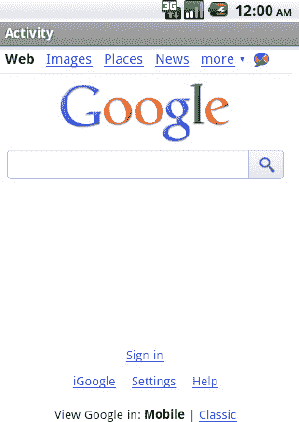
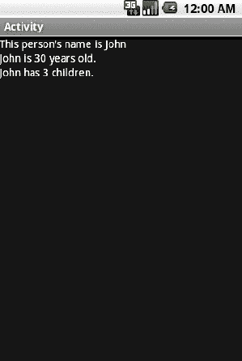

# 三、通信和网络

许多成功的移动应用的关键是它们与远程数据源连接和交互的能力。Web 服务和 API 在当今世界非常丰富，允许应用与任何服务进行交互，从天气预报到个人财务信息。将这些数据放在用户手中，并使其可以从任何地方访问，这是移动平台的最大优势之一。Android 建立在谷歌所熟知的网络基础之上，为与外界交流提供了丰富的工具集。

#### 3–1。显示 Web 信息

##### 问题

来自 Web 的 HTML 或图像数据需要在应用中呈现，无需任何修改或处理。

##### 解决方案

**(API 一级)**

在`WebView`中显示信息。`WebView`是一个视图小部件，可以嵌入到任何布局中，在您的应用中显示本地和远程的 Web 内容。`WebView`基于与 Android 浏览器应用相同的开源 WebKit 技术；为应用提供相同级别的功能和能力。

##### 它是如何工作的

在显示从网上下载的资源时，`WebView`有一些非常令人满意的特性，尤其是二维滚动(同时水平和垂直于)和缩放控件。一个`WebView`可以是存放大图像的完美地方，比如一个体育场地图，用户可能想要平移和缩放。在这里，我们将讨论如何使用本地和远程素材来实现这一点。

###### 显示网址

最简单的情况是通过向`WebView`提供资源的 URL 来显示 HTML 页面或图像。以下是这种技术在您的应用中的一些实际用途:

*   无需离开应用即可访问您的公司网站
*   显示 web 服务器上的实时内容页面，如 FAQ 部分，无需升级应用即可更改。
*   显示用户希望使用平移/缩放进行交互的大图像资源。

让我们来看一个简单的例子，它加载了一个非常流行的网页，但是在一个活动的内容视图中，而不是打开浏览器(参见清单 3–1 和 3–2)。

**清单 3–1。** *包含 WebView 的活动*

`public class MyActivity extends Activity {
    @Override
    public void onCreate(Bundle savedInstanceState) {
        super.onCreate(savedInstanceState);

        WebView webview = new WebView(this);
        //Enable JavaScript support
        webview.getSettings().setJavaScriptEnabled(true);
        webview.loadUrl("http://www.google.com/");

        setContentView(webview);
    }
}`

**注意:**默认情况下，`WebView`禁用 JavaScript 支持。如果您正在显示的内容需要 JavaScript，请确保在`WebView.WebSettings`对象中启用它。

**清单 3–2。** *AndroidManifest.xml 设置所需权限*

`<?xml version="1.0" encoding="utf-8"?>
<manifest xmlns:android="http://schemas.android.com/apk/res/android"
      package="com.examples.webview"
      android:versionCode="1"
      android:versionName="1.0">
    <application android:icon="@drawable/icon" android:label="@string/app_name">
        <activity android:name=".MyActivity">
            <intent-filter>
                <action android:name="android.intent.action.MAIN" />
                <category android:name="android.intent.category.LAUNCHER" />
            </intent-filter>`
`        </activity>
    </application>
    <uses-permission android:name="android.permission.INTERNET" />
</manifest>`

**重要提示:**如果你加载到`WebView`的内容是远程的，AndroidManifest.xml 必须声明它使用了`android.permission.INTERNET`权限。

结果显示您的活动中的 HTML 页面(参见 Figure 3–1)。

**图 3–1。** *网页视图中的 HTML 页面*

###### 本地素材

`WebView`在显示本地内容时也非常有用，可以利用 HTML/CSS 格式或它为内容提供的平移/缩放行为。您可以使用 Android 项目的`assets`目录来存储您希望在`WebView`中显示的资源，比如大图像或 HTML 文件。为了更好地组织素材，您还可以在素材下创建目录来存储文件。

`WebView.loadUrl()`可以显示使用 *file:///android_asset/ <资源路径>* URL schema 下存储的素材。例如，如果文件`android.jpg`被放在素材目录中，那么可以使用

`file:///android_asset/android.jpg`

如果同样的文件放在 assets 下名为`images`的目录中，`WebView`可以用 URL 加载它

`file:///android_assimg/android.jpg`

另外，`WebView.loadData()`会将存储在字符串资源或变量中的原始 HTML 加载到视图中。使用这种技术，预先格式化的 HTML 文本可以存储在`res/values/strings.xml`中，或者从远程 API 下载并显示在应用中。

清单 3–3 和 3–4 展示了一个示例活动，其中两个`WebView`小部件相互垂直堆叠。上面的视图显示了存储在素材目录中的一个大图像文件，下面的视图显示了存储在应用字符串资源中的一个 HTML 字符串。

**清单 3–3。** *res/layout/main.xml*

`<LinearLayout xmlns:android="http://schemas.android.com/apk/res/android"
  android:layout_width="fill_parent"
  android:layout_height="fill_parent"
  android:orientation="vertical">
  <WebView
    android:id="@+id/upperview"
    android:layout_width="fill_parent"
    android:layout_height="fill_parent"
    android:layout_weight="1"
  />
  <WebView
    android:id="@+id/lowerview"
    android:layout_width="fill_parent"
    android:layout_height="fill_parent"
    android:layout_weight="1"
  />
</LinearLayout>`

**清单 3–4。** *显示本地网页内容的活动*

`public class MyActivity extends Activity {
    @Override
    public void onCreate(Bundle savedInstanceState) {
        super.onCreate(savedInstanceState);
        setContentView(R.layout.main);

        WebView upperView = (WebView)findViewById(R.id.upperview);
        //Zoom feature must be enabled
        upperView.getSettings().setBuiltInZoomControls(true);
        upperView.loadUrl("file:///android_asset/android.jpg");

        WebView lowerView = (WebView)findViewById(R.id.lowerview);
        String htmlString =
            "<h1>Header</h1>
This is HTML text <i>Formatted in italics</i>
";
        lowerView.loadData(htmlString, "text/html", "utf-8");
    }
}`

显示活动时，每个 WebView 占据屏幕垂直空间的一半。HTML 字符串按预期格式化，而大图像可以水平和垂直滚动；用户甚至可以放大或缩小(参见图 3–2)。

**图 3–2。** *显示本地资源的两个网页视图*

#### 3–2。拦截 WebView 事件

##### 问题

您的应用使用 WebView 来显示内容，但也需要监听和响应用户在页面上单击的链接。

##### 解决方案

**(API 一级)**

安装一个`WebViewClient`并将其连接到`WebView`上。`WebViewClient`和`WebChromeClient`是两个 WebKit 类，允许应用获得事件回调并定制`WebView`的行为。默认情况下，如果没有`WebViewClient`出现，`WebView`会将一个 URL 传递给要处理的`ActivityManager`，这通常会导致在浏览器应用中加载任何点击的链接，而不是当前的`WebView`。

##### 工作原理

在清单 3–5 中，我们创建了一个带有`WebView`的活动，它将处理自己的 URL 加载。

**清单 3–5。** *使用 WebView 处理 URL 的活动*

`public class MyActivity extends Activity {
    @Override
    public void onCreate(Bundle savedInstanceState) {
        super.onCreate(savedInstanceState);

        WebView webview = new WebView(this);
        webview.getSettings().setJavaScriptEnabled(true);
        //Add a client to the view
        webview.setWebViewClient(new WebViewClient());
        webview.loadUrl("http://www.google.com");
        setContentView(webview);
    }
}`

在这个例子中，简单地提供一个普通的`WebViewClient`到`WebView`允许它自己处理任何 URL 请求，而不是把它们传递给`ActivityManager`，所以点击一个链接将在同一个视图中加载所请求的页面。这是因为默认实现只是为 shouldOverrideUrlLoading()返回 false，这告诉客户端将 URL 传递给 WebView，而不是应用。

在下一个案例中，我们将利用`WebViewClient.shouldOverrideUrlLoading()`回调来拦截和监控用户活动(参见清单 3–6)。

**清单 3–6。** *拦截 WebView URLs 的活动*

`public class MyActivity extends Activity {
    @Override
    public void onCreate(Bundle savedInstanceState) {
        super.onCreate(savedInstanceState);

        WebView webview = new WebView(this);
        webview.getSettings().setJavaScriptEnabled(true);
        //Add a client to the view
        webview.setWebViewClient(mClient);
        webview.loadUrl("http://www.google.com");
        setContentView(webview);
    }

    private WebViewClient mClient = new WebViewClient() {
        @Override
        public boolean shouldOverrideUrlLoading(WebView view, String url) {
            Uri request = Uri.parse(url);

            if(TextUtils.equals(request.getAuthority(), "www.google.com")) {
                //Allow the load
                return false;
            }

            Toast.makeText(MyActivity.this, "Sorry, buddy", Toast.LENGTH_SHORT).show();
            returntrue;
        }`
`    };
}`

在这个例子中，`shouldOverrideUrlLoading()`根据传递的 url 决定是否将内容加载回这个`WebView`中，防止用户离开 Google 的站点。返回 URL 的主机名部分，我们用它来检查用户点击的链接是否在谷歌的域名上([www.google.com](http://www.google.com))。如果我们可以验证该链接是指向另一个 Google 页面的，那么返回 false 将允许`WebView`加载内容。如果没有，我们通知用户并返回 true 告诉`WebViewClient`应用已经处理了这个 URL，并且不允许`WebView`加载它。

这种技术可以更复杂，应用实际上通过做一些有趣的事情来处理 URL。甚至可以开发一个定制的模式来创建应用和`WebView`内容之间的完整接口。

#### 3–3 岁。使用 JavaScript 访问 WebView

##### 问题

您的应用需要访问显示在`WebView`中的当前内容的原始 HTML，以读取或修改特定的值。

##### 解决方案

**(API 一级)**

创建一个 JavaScript 接口来连接`WebView`和应用代码。

##### 它是如何工作的

`WebView.addJavascriptInterface()`将一个 Java 对象绑定到 JavaScript，这样就可以在`WebView`中调用它的方法。使用这个接口，JavaScript 可以用来在您的应用代码和`WebView`的 HTML 之间编组数据。

**注意:**允许 JavaScript 控制您的应用本身就存在安全威胁，允许远程执行应用代码。应该考虑到这种可能性来使用这个接口。

让我们来看一个实际例子。清单 3–7 展示了一个简单的 HTML 表单，它将从本地素材加载到 WebView 中。清单 3–8 是一个使用两个 JavaScript 函数在 WebView 中的活动首选项和内容之间交换数据的活动。

**清单 3–7。** *assets/form.html*

`<!DOCTYPE HTML PUBLIC "-//W3C//DTD HTML 4.01//EN"
    "http://www.w3.org/TR/html4/strict.dtd">
<html>
<form name="input" action="form.html" method="get">
Enter Email: <input type="text" id="emailAddress" />
<input type="submit" value="Submit" />
</form>
</html>`

**清单 3–8。** *活动与 JavaScript 桥接口*

`public class MyActivity extends Activity {
    @Override
    public void onCreate(Bundle savedInstanceState) {
        super.onCreate(savedInstanceState);

        WebView webview = new WebView(this);
        webview.getSettings().setJavaScriptEnabled(true);
        webview.setWebViewClient(mClient);
        //Attach the custom interface to the view
        webview.addJavascriptInterface(new MyJavaScriptInterface(), "BRIDGE");

        setContentView(webview);
        //Load the form
        webview.loadUrl("file:///android_asset/form.html");
    }

    private static final String JS_SETELEMENT =         "javascript:document.getElementById('%s').value='%s'";
    private static final String JS_GETELEMENT =
        "javascript:window.BRIDGE.storeElement('%s',document.getElementById('%s').value)";
    private static final String ELEMENTID = "emailAddress";

    private WebViewClient mClient = new WebViewClient() {
        @Override
        public boolean shouldOverrideUrlLoading(WebView view, String url) {
            //Before leaving the page, attempt to retrieve the email using JavaScript
            view.loadUrl(String.format(JS_GETELEMENT, ELEMENTID, ELEMENTID));
            return false;
        }

        @Override
        public void onPageFinished(WebView view, String url) {
            //When page loads, inject address into page using JavaScript
            SharedPreferences prefs = getPreferences(Activity.MODE_PRIVATE);
            view.loadUrl(String.format(JS_SETELEMENT, ELEMENTID,
                prefs.getString(ELEMENTID, "")));
        }
    };

    privateclass MyJavaScriptInterface {
        //Store an element in preferences
        @SuppressWarnings("unused")
        public void storeElement(String id, String element) {
            SharedPreferences.Editor edit =
                getPreferences(Activity.MODE_PRIVATE).edit();
            edit.putString(id, element);`
`            edit.commit();
            //If element is valid, raise a Toast
            if(!TextUtils.isEmpty(element)) {
                Toast.makeText(MyActivity.this, element, Toast.LENGTH_SHORT).show();
            }
        }
    }
}`

在这个有点做作的例子中，单个元素表单是用 HTML 创建的，并显示在 WebView 中。在活动代码中，我们在 id 为“emailAddress”的`WebView`中查找一个表单值，并在每次通过`shouldOverrideUrlLoading()`回调点击页面上的链接(在本例中，是表单的提交按钮)时，将其值保存到`SharedPreferences`。每当页面加载完成时(即`onPageFinished()`被调用)，我们试图将当前值从`SharedPreferences`注入回`web form`。

创建了一个名为`MyJavaScriptInterface`的 Java 类，它定义了方法`storeElement()`。当创建视图时，我们调用`WebView.addJavascriptInterface()`方法将这个对象附加到视图上，并将其命名为桥。调用该方法时，String 参数是一个名称，用于引用 JavaScript 代码内部的接口。

我们在这里定义了两个 JavaScript 方法作为常量字符串，`JS_GETELEMENT`和`JS_SETELEMENT`。这些方法通过传递给在 WebView 上执行。`loadUrl()`注意，`JS_GETELEMENT`是对调用我们的自定义接口函数(引用为`BRIDGE.storeElement`)的引用，该函数将调用`MyJavaScripInterface`上的方法，并将表单元素的值存储在 preferences 中。如果从表单中检索到的值不为空，也会引发一个`Toast`。

任何 JavaScript 都可以以这种方式在 WebView 上执行，并且它不需要作为自定义界面的一部分包含在方法中。例如，`JS_SETELEMENT`使用纯 JavaScript 来设置页面上表单元素的值。

这种技术的一个流行应用是记住用户可能需要在应用中输入的表单数据，但是表单必须是基于 Web 的，例如 Web 应用的预订表单或付款表单，它没有较低级别的 API 可以访问。

#### 3–4 岁。下载图像文件

##### 问题

您的应用需要从 Web 或其他远程服务器下载并显示图像。

##### 解

**(API 三级)**

使用`AsyncTask`在后台线程中下载数据。`AsyncTask`是一个包装器类，让线程化长时间运行的操作进入后台变得无痛而简单；以及用内部线程池管理并发性。除了处理后台线程之外，还在操作执行之前、期间和之后提供了回调方法，允许您在主 UI 线程上进行任何所需的更新。

##### 它是如何工作的

在下载图像的上下文中，让我们创建一个名为 WebImageView 的 ImageView 的子类，它将从远程源缓慢加载图像，并在图像可用时立即显示。下载将在`AsyncTask`操作中执行(参见清单 3–9)。

**清单 3–9。** *WebImageView*

`public class WebImageView extends ImageView {

    private Drawable mPlaceholder, mImage;

    public WebImageView(Context context) {
        this(context, null);
    }

    public WebImageView(Context context, AttributeSet attrs) {
        this(context, attrs, 0);
    }

    public WebImageView(Context context, AttributeSet attrs, int defaultStyle) {
        super(context, attrs, defaultStyle);
    }

    public void setPlaceholderImage(Drawable drawable) {
        mPlaceholder = drawable;
        if(mImage == null) {
            setImageDrawable(mPlaceholder);
        }
    }

    public void setPlaceholderImage(int resid) {
        mPlaceholder = getResources().getDrawable(resid);
        if(mImage == null) {
            setImageDrawable(mPlaceholder);
        }
    }

    public void setImageUrl(String url) {
        DownloadTask task = new DownloadTask();
        task.execute(url);`
`    }

    private class DownloadTask extends AsyncTask<String, Void, Bitmap> {
        @Override
        protected Bitmap doInBackground(String... params) {
            String url = params[0];
            try {
                URLConnection connection = (new URL(url)).openConnection();
                InputStream is = connection.getInputStream();
                BufferedInputStream bis = new BufferedInputStream(is);

                ByteArrayBuffer baf = new ByteArrayBuffer(50);
                int current = 0;
                while ((current = bis.read()) != -1) {
                    baf.append((byte)current);
                }
                byte[] imageData = baf.toByteArray();
                return BitmapFactory.decodeByteArray(imageData, 0, imageData.length);
            } catch (Exception exc) {
                return null;
            }
        }

        @Override
        protectedvoid onPostExecute(Bitmap result) {
            mImage = new BitmapDrawable(result);
            if(mImage != null) {
                setImageDrawable(mImage);
            }
        }
    };
}`

如您所见，`WebImageView`是 Android `ImageView`小部件的简单扩展。`setPlaceholderImage()`方法允许一个本地的 drawable 被设置为显示图像，直到远程内容下载完成。一旦使用`setImageUrl()`给视图一个远程 URL，大部分有趣的工作就开始了，此时定制的 AsyncTask 开始工作。

注意，`AsyncTask`是强类型的，有三个输入参数值、进度值和结果值。在这种情况下，一个字符串被传递给任务的 execute 方法，后台操作应该返回一个位图。中间值，即进度，我们在这个例子中没有使用，所以它被设置为 Void。当扩展`AsyncTask`时，唯一需要实现的方法是`doInBackground()`，它定义了要在后台线程上运行的工作块。在前面的示例中，这是连接到所提供的远程 URL 并下载图像数据的地方。完成后，我们试图从下载的数据中创建一个`Bitmap`。如果在任何一点发生错误，操作将中止并返回 null。

在`AsyncTask`中定义的其他回调方法，如`onPreExecute()`、`onPostExecute()`和`onProgressUpdate(),`在主线程上被调用，目的是更新用户界面。在前面的例子中，`onPostExecute()`用于用结果数据更新视图的图像。

**重要提示:** Android UI 类不是线程安全的。确保使用发生在主线程上的回调方法之一来更新 UI。不要从`doInBackground()`内更新视图。

清单 3–10 和 3–11 展示了一个在活动中使用这个类的简单例子。因为这个类不是`android.widget`或`android.view`包的一部分，所以当在 XML 中使用它时，我们必须使用完全限定的包名。

**清单 3–10。** *res/layout/main.xml*

`<?xml version="1.0" encoding="utf-8"?>
<LinearLayout xmlns:android="http://schemas.android.com/apk/res/android"
  android:layout_width="fill_parent"
  android:layout_height="fill_parent"
  android:orientation="vertical">
  <com.examples.WebImageView
    android:id="@+id/webImage"
    android:layout_width="wrap_content"
    android:layout_height="wrap_content"
  />
</LinearLayout>`

**清单 3–11。** *范例活动*

`public class WebImageActivity extends Activity {
    @Override
    public void onCreate(Bundle savedInstanceState) {
        super.onCreate(savedInstanceState);
        setContentView(R.layout.main);

        WebImageView imageView = (WebImageView)findViewById(R.id.webImage);
        imageView.setPlaceholderImage(R.drawable.icon);
        imageView.setImageUrl("http://apress.com/resource/weblogo/Apress_120x90.gif");
    }
}`

在这个例子中，我们首先设置一个本地图像(应用图标)作为`WebImageView`占位符。该图像立即显示给用户。然后，我们告诉视图从 Web 上获取一个 press 徽标的图像。如前所述，这将在后台下载图像，并在完成后替换视图中的占位符图像。正是这种创建后台操作的简单性使得 Android 团队将`AsyncTask`称为“无痛线程”。

#### 3–5 岁。完全在后台下载

##### 问题

应用必须下载大量资源到设备上，例如电影文件，而不需要用户保持应用活动。

##### 解

**(API 9 级)**

使用`DownloadManager` API。`DownloadManager`是添加到 SDK 中的一项服务，API 级别为 9，允许长时间运行的下载完全由系统进行移交和管理。使用这项服务的主要优点是，`DownloadManager`将继续尝试下载资源，通过失败，连接改变，甚至设备重启。

##### 它是如何工作的

清单 3–12 是一个使用 DownloadManager 处理大型图像文件下载的示例活动。完成后，图像将显示在 ImageView 中。每当您使用 DownloadManager 从 Web 访问内容时，一定要在应用的清单中声明您正在使用`android.permission.INTERNET`。

**清单 3–12。** *下载管理器示例活动*

`public class DownloadActivity extends Activity {

    private staticfinal String DL_ID = "downloadId";
    private SharedPreferences prefs;

    private DownloadManager dm;
    private ImageView imageView;

    @Override
    publicvoid onCreate(Bundle savedInstanceState) {
        super.onCreate(savedInstanceState);
        imageView = new ImageView(this);
        setContentView(imageView);

        prefs = PreferenceManager.getDefaultSharedPreferences(this);
        dm = (DownloadManager)getSystemService(DOWNLOAD_SERVICE);
    }

    @Override
    publicvoid onResume() {
        super.onResume();

        if(!prefs.contains(DL_ID)) {
            //Start the download
            Uri resource = Uri.parse("http://www.bigfoto.com/dog-animal.jpg");
            DownloadManager.Request request = new DownloadManager.Request(resource);
            request.setAllowedNetworkTypes(Request.NETWORK_MOBILE |
                Request.NETWORK_WIFI);
            request.setAllowedOverRoaming(false);
            //Display in the notification bar
            request.setTitle("Download Sample");
            long id = dm.enqueue(request);
            //Save the unique id
            prefs.edit().putLong(DL_ID, id).commit();
        } else {
            //Download already started, check status`
`            queryDownloadStatus();
        }

        registerReceiver(receiver,
            newIntentFilter(DownloadManager.ACTION_DOWNLOAD_COMPLETE));
    }

    @Override
    publicvoid onPause() {
        super.onPause();
        unregisterReceiver(receiver);
    }

    private BroadcastReceiver receiver = new BroadcastReceiver() {
        @Override
        publicvoid onReceive(Context context, Intent intent) {
            queryDownloadStatus();
        }
    };

    privatevoid queryDownloadStatus() {
        DownloadManager.Query query = new DownloadManager.Query();
        query.setFilterById(prefs.getLong(DL_ID, 0));
        Cursor c = dm.query(query);
        if(c.moveToFirst()) {
                int status = c.getInt(c.getColumnIndex(DownloadManager.COLUMN_STATUS));
                switch(status) {
                case DownloadManager.STATUS_PAUSED:
                case DownloadManager.STATUS_PENDING:
                case DownloadManager.STATUS_RUNNING:
                    //Do nothing, still in progress
                    break;
                case DownloadManager.STATUS_SUCCESSFUL:
                    //Done, display the image
                    try {
                        ParcelFileDescriptor file =
                            dm.openDownloadedFile(prefs.getLong(DL_ID, 0));
                        FileInputStream fis =
                            new ParcelFileDescriptor.AutoCloseInputStream(file);
                        imageView.setImageBitmap(BitmapFactory.decodeStream(fis));
                    } catch (Exception e) {
                        e.printStackTrace();
                    }
                    break;
                case DownloadManager.STATUS_FAILED:
                    //Clear the download and try again later
                    dm.remove(prefs.getLong(DL_ID, 0));
                    prefs.edit().clear().commit();
                    break;
                }
            }
        }

    }`

**重要:**截至本书出版之日，SDK 中有一个 bug 抛出异常，声称`android.permission.ACCESS_ALL_DOWNLOADS`需要使用`DownloadManager`。这个异常实际上是在`android.permission.INTERNET`不在你的清单中时抛出的。

这个例子在`Activity.onResume()`方法中完成了所有有用的工作，因此应用可以在用户每次返回活动时确定下载的状态。管理器中的下载可以通过调用`DownloadManager.enqueue()`时返回的长 ID 值来引用。在本例中，我们将该值保存在应用的首选项中，以便随时监控和检索下载的内容。

在第一次启动示例应用时，会创建一个`DownloadManager.Request`对象来表示要下载的内容。至少，这个请求需要远程资源的`Uri`。然而，在请求上设置许多有用的属性来控制它的行为。一些有用的属性包括:

*   `Request.setAllowedNetworkTypes()`
*   设置可以检索下载的特定网络类型。
*   `Request.setAllowedOverRoaming()`
*   设置设备处于漫游连接时是否允许下载。
*   `Request.setTitle()`
*   为下载设置要在系统通知中显示的标题。
*   `Request.setDescription()`
*   为下载设置要在系统通知中显示的描述。

一旦获得了 ID，应用就使用该值来检查下载的状态。通过注册一个`BroadcastReceiver`来监听`ACTION_DOWNLOAD_COMPLETE`广播，应用将通过在活动的 ImageView 上设置图像文件来对下载完成做出反应。如果下载完成时活动暂停，在下次恢复时将检查状态并设置`ImageView`内容。

值得注意的是，`ACTION_DOWNLOAD_COMPLETE`是由`DownloadManager`为它可能管理的每个下载发送的广播。因此，我们仍然需要检查我们感兴趣的下载 ID 是否真的准备好了。

###### 目的地

在清单 3–12 的例子中，我们从未告诉 `DownloadManager`将文件放在哪里。相反，当我们想要访问文件时，我们使用保存在首选项中的 ID 值的`DownloadManager.openDownloadedFile()`方法来获得一个`ParcelFileDescriptor`，它可以被转换成应用可以读取的流。这是获取下载内容的简单直接的方法，但是需要注意一些注意事项。

如果没有特定的目的地，文件将被下载到共享的下载缓存中，系统保留随时删除文件以回收空间的权利。因此，以这种方式下载是一种快速获取数据的便捷方式，但如果您需要更长期的下载，则应使用`DownloadManager.Request`方法之一在外部存储器上指定一个永久目的地:

*   `Request.setDestinationUri()`
    *   将目标设置为位于外部存储器上的文件 Uri。
*   `Request.setDestinationInExternalFilesDir()`
    *   将目标设置为外部存储器上的隐藏目录。
*   `Request.setDestinationInExternalPublicDir()`
    *   将目标设置为外部存储器上的公共目录。

**注意:**所有写入外部存储器的目标方法都需要你的应用在清单中声明使用`android.permission.WRITE_EXTERNAL_STORAGE`。

当调用`DownloadManager.remove()`从管理器列表中清除条目或者用户清除下载列表时，没有明确目的地的文件也经常被删除；在这些情况下，系统不会删除下载到外部存储器的文件。

#### 3–6 岁。访问 REST API

##### 问题

您的应用需要通过 HTTP 访问 RESTful API，以便与远程主机的 web 服务进行交互。

##### 解决方案

**(API 三级)**

在 AsyncTask 中使用 Apache HTTP 类。Android 包括 Apache HTTP 组件库，它提供了一种创建到远程 API 的连接的健壮方法。Apache 库包含一些类，可以轻松地创建 GET、POST、PUT 和 DELETE 请求，并提供对 SSL、cookie 存储、身份验证以及特定 API 在其 HttpClient 中可能具有的其他 HTTP 需求的支持。

REST 代表具象状态转移，是当今 web 服务的一种常见架构风格。RESTful APIs 通常使用标准 HTTP 动词来创建对远程资源的请求，响应通常以结构化文档格式返回，如 XML、JSON 或逗号分隔值(CSV)。

##### 它是如何工作的

清单 3–13 是一个 AsyncTask，它可以处理任何 HttpUriRequest 并返回字符串响应。

**清单 3–13。** *AsyncTask 处理 HttpRequest*

`public class RestTask extends AsyncTask<HttpUriRequest, Void, String> {

    public static final String HTTP_RESPONSE = "httpResponse";

    private Context mContext;
    private HttpClient mClient;
    private String mAction;

    public RestTask(Context context, String action) {
        mContext = context;
        mAction = action;
        mClient = new DefaultHttpClient();
    }

    public RestTask(Context context, String action, HttpClient client) {
        mContext = context;
        mAction = action;
        mClient = client;
    }

    @Override
    protected String doInBackground(HttpUriRequest... params) {
        try{
            HttpUriRequest request = params[0];
            HttpResponse serverResponse = mClient.execute(request);

            BasicResponseHandler handler = new BasicResponseHandler();
            String response = handler.handleResponse(serverResponse);
            return response;
        } catch (Exception e) {
            e.printStackTrace();
            return null;
        }
    }

    @Override
    protectedvoid onPostExecute(String result) {
        Intent intent = new Intent(mAction);
        intent.putExtra(HTTP_RESPONSE, result);
        //Broadcast the completion
        mContext.sendBroadcast(intent);
    }

}`

`RestTask`可以使用或不使用 HttpClient 参数来构造。允许这样做的原因是多个请求可以使用同一个客户机对象。如果您的 API 需要 cookies 来维护一个会话，或者如果有一组特定的必需参数很容易设置一次(如 SSL 存储)，这将非常有用。任务接受一个`HttpUriRequest`参数进行处理(其中`HttpGet`、`HttpPost`、`HttpPut`和`HttpDelete`都是子类)并执行它。

一个`BasicResponseHandler`处理响应，这是一个方便的类，它将我们的任务从需要检查响应错误中抽象出来。如果响应代码是 1XX 或 2XX，将返回字符串形式的 HTTP 响应，但是如果响应代码是 300 或更大，将抛出 HttpResponseException。

在与 API 的交互完成之后，这个类的最后一个重要部分存在于`onPostExecute()`中。在构造时，RestTask 将一个字符串参数作为一个`Intent`的动作，这个动作被广播回所有监听器，API 响应被封装为一个额外的。这种广播是通知 API 调用者数据已准备好进行处理的机制。

现在让我们使用这个强大的新工具来创建一些基本的 API 请求。在下面的例子中，我们使用 Yahoo！搜索 REST API。这个 API 对于每个请求只有两个必需的参数:

*   阿皮德
*   用于标识发出请求应用的唯一值
*   询问
*   表示要执行的搜索查询的字符串

访问[`developer.yahoo.com/search`](http://developer.yahoo.com/search)了解更多关于这个 API 的信息。

###### 获取示例

GET 请求是许多公共 API 中最简单也是最常见的请求。必须随请求一起发送的参数被编码到 URL 字符串本身中，因此不需要提供额外的数据。让我们创建一个 GET 请求来搜索“Android”(参见清单 3–14)。

**清单 3–14。** *执行 API 获取请求的活动*

`public class SearchActivity extends Activity {

    private static final String SEARCH_ACTION = "com.examples.rest.SEARCH";
    private static final String SEARCH_URI =
           "http://search.yahooapis.com/WebSearchService/V1/webSearch?appid=%s&query=%s";

    private TextView result;
    private ProgressDialog progress;

    @Override
    public void onCreate(Bundle savedInstanceState) {
        super.onCreate(savedInstanceState);`
`        result = new TextView(this);
        setContentView(result);

        //Create the search request
        try{
            String url = String.format(SEARCH_URI, "YahooDemo","Android");
            HttpGet searchRequest = new HttpGet( new URI(url) );

            RestTask task = new RestTask(this,SEARCH_ACTION);
            task.execute(searchRequest);
            //Display progress to the user
            progress = ProgressDialog.show(this, "Searching", "Waiting For Results...",
                true);
        } catch (Exception e) {
            e.printStackTrace();
        }
    }

    @Override
    public void onResume() {
        super.onResume();
        registerReceiver(receiver, new IntentFilter(SEARCH_ACTION));
    }

    @Override
    public void onPause() {
        super.onPause();
        unregisterReceiver(receiver);
    }

    private BroadcastReceiver receiver = new BroadcastReceiver() {
        @Override
        public void onReceive(Context context, Intent intent) {
            //Clear progress indicator
            if(progress != null) {
                progress.dismiss();
            }
            String response = intent.getStringExtra(RestTask.HTTP_RESPONSE);
            //Process the response data (here we just display it)
            result.setText(response);
        }
    };
}`

在这个例子中，我们用我们想要连接的 URL 创建了我们需要的 HTTP 请求类型(在这个例子中，是对 search.yahooapis.com 的 GET 请求)。URL 存储为一个常量格式的字符串，Yahoo！API (appid 和 query)是在运行时创建请求之前添加的。

创建一个`RestTask`,它带有一个独特的动作字符串，在完成时将被广播，然后任务被执行。该示例还定义了一个`BroadcastReceiver`，并为发送给`RestTask`的同一个动作注册了它。当任务完成时，这个接收器将捕获广播，API 响应可以被解包和处理。我们将在菜谱 3–7 和 3–8 中讨论如何解析结构化的 XML 和 JSON 响应，所以现在这个例子只是向用户界面显示原始响应。

###### 帖子示例

很多时候，API 要求您提供一些数据作为请求的一部分，可能是认证令牌或搜索查询的内容。API 将要求您通过 HTTP POST 发送请求，因此这些值可能会被编码到请求正文中，而不是 URL 中。让我们再次运行对“Android”的搜索，但是这次使用一个帖子(参见清单 3–15)。

**清单 3–15。** *执行 API POST 请求的活动*

`public class SearchActivity extends Activity {

    private static final String SEARCH_ACTION = "com.examples.rest.SEARCH";
    private static final String SEARCH_URI =
            "http://search.yahooapis.com/WebSearchService/V1/webSearch";
    private static final String SEARCH_QUERY = "Android";

    private TextView result;
    private ProgressDialog progress;

    @Override
    public void onCreate(Bundle savedInstanceState) {
        super.onCreate(savedInstanceState);
        setTitle("Activity");
        result = new TextView(this);
        setContentView(result);

        //Create the search request
        try{
            HttpPost searchRequest = new HttpPost( new URI(SEARCH_URI) );
            List<NameValuePair> parameters = new ArrayList<NameValuePair>();
            parameters.add(new BasicNameValuePair("appid","YahooDemo"));
            parameters.add(new BasicNameValuePair("query",SEARCH_QUERY));
            searchRequest.setEntity(new UrlEncodedFormEntity(parameters));

            RestTask task = new RestTask(this,SEARCH_ACTION);
            task.execute(searchRequest);
            //Display progress to the user
            progress = ProgressDialog.show(this, "Searching", "Waiting For Results...",
true);
        } catch (Exception e) {
            e.printStackTrace();
        }
    }

    @Override
    public void onResume() {
        super.onResume();
        registerReceiver(receiver, new IntentFilter(SEARCH_ACTION));
    }

    @Override
    public void onPause() {
        super.onPause();
        unregisterReceiver(receiver);
    }`

`    private BroadcastReceiver receiver = new BroadcastReceiver() {
        @Override
        public void onReceive(Context context, Intent intent) {
            //Clear progress indicator
            if(progress != null) {
                progress.dismiss();
            }
            String response = intent.getStringExtra(RestTask.HTTP_RESPONSE);
            //Process the response data (here we just display it)
            result.setText(response);
        }
    };
}`

注意，在这个例子中，传递给 API 执行搜索所需的参数被编码到一个`HttpEntity`中，而不是直接在请求 URL 中传递。在这种情况下创建的请求是一个`HttpPost`实例，它仍然是`HttpUriRequest`的子类(像`HttpGet`)，所以我们可以使用同一个`RestTask`来运行操作。与 GET 示例一样，我们将讨论解析结构化的 XML 和 JSON 响应，就像 Recipes 3–7 和 3–8 中的这个一样，所以现在这个示例只是向用户界面显示原始响应。

**注意:**Android SDK 捆绑的 Apache 库不支持多部分 HTTP POSTs。但是，来自公共可用的`org.apache.http.mime`库的`MultipartEntity`是兼容的，可以作为外部资源引入到您的项目中。

###### 基本认证

使用 API 的另一个常见需求是某种形式的身份验证。针对 REST API 认证的标准正在出现，比如 OAuth 2.0，但是最常见的认证方法仍然是基于 HTTP 的基本用户名和密码认证。在清单 3–16 中，我们修改了`RestTask`以支持每个请求的 HTTP 报头中的认证。

**清单 3–16。** *带基本认证的 rest task*

`public class RestAuthTask extends AsyncTask<HttpUriRequest, Void, String> {

    publicstaticfinal String HTTP_RESPONSE = "httpResponse";

    private static final String AUTH_USER = "user@mydomain.com";
    private static final String AUTH_PASS = "password";

    private Context mContext;
    private AbstractHttpClient mClient;
    private String mAction;

    public RestAuthTask(Context context, String action, boolean authenticate) {
        mContext = context;
        mAction = action;`
`        mClient = new DefaultHttpClient();
        if(authenticate) {
            UsernamePasswordCredentials creds =
                    new UsernamePasswordCredentials(AUTH_USER, AUTH_PASS);
            mClient.getCredentialsProvider().setCredentials(AuthScope.ANY, creds);
        }
    }

    public RestAuthTask(Context context, String action, AbstractHttpClient client) {
        mContext = context;
        mAction = action;
        mClient = client;
    }

    @Override
    protected String doInBackground(HttpUriRequest... params) {
        try{
            HttpUriRequest request = params[0];
            HttpResponse serverResponse = mClient.execute(request);

            BasicResponseHandler handler = new BasicResponseHandler();
            String response = handler.handleResponse(serverResponse);
            return response;
        } catch (Exception e) {
            e.printStackTrace();
            return null;
        }
    }

    @Override
    protectedvoid onPostExecute(String result) {
        Intent intent = new Intent(mAction);
        intent.putExtra(HTTP_RESPONSE, result);
        //Broadcast the completion
        mContext.sendBroadcast(intent);
    }

}`

Apache 范例中的`HttpClient`增加了基本认证。由于我们的示例任务允许传入一个特定的客户机对象以供使用，该对象可能已经具有必要的身份验证凭证，因此我们只修改了创建默认客户机的情况。在这种情况下，使用用户名和密码字符串创建一个`UsernamePasswordCredentials`实例，然后在客户端的`CredentialsProvider`上进行设置。

#### 3–7 岁。解析 JSON

##### 问题

您的应用需要解析来自 API 或其他源的响应，这些响应是用 JavaScript 对象符号(JSON)格式化的。

##### 解

**(API 一级)**

使用 Android 中内置的 org.json 解析器类。SDK 附带了一组非常有效的类，用于解析 org.json 包中的 JSON 格式的字符串。只需从格式化的字符串数据中创建一个新的`JSONObject`或`JSONArray`，您将拥有一组访问器方法来从其中获取原始数据或嵌套的`JSONObject`和`JSONArray`。

##### 它是如何工作的

默认情况下，这个 JSON 解析器是严格的，这意味着当遇到无效的 JSON 数据或无效的键时，它会异常中止。如果没有找到请求的值，以“get”为前缀的访问器方法将抛出一个`JSONException`。在某些情况下，这种行为并不理想，对于，有一组附带的方法以“opt”为前缀。当找不到所请求的键值时，这些方法将返回 null，而不是抛出异常。此外，它们中的许多都有一个重载版本，该版本也接受一个 fallback 参数来返回，而不是 null。

让我们看一个如何将 JSON 字符串解析成有用片段的例子。考虑清单 3–17 中的 JSON。

**清单 3–17。** *例子 JSON*

`{
    "person": {
        "name": "John",
        "age": 30,
        "children": [
            {
                "name": "Billy"
                "age": 5
            },
            {
                "name": "Sarah"
                "age": 7
            },
            {
                "name": "Tommy"
                "age": 9
            }
        ]
    }
}`

这用三个值定义了一个对象:name(字符串)、age(整数)和 children。名为“children”的参数是另外三个对象的数组，每个对象都有自己的名字和年龄。如果我们使用 org.json 来解析这些数据，并在 TextViews 中显示一些元素，它看起来就像清单 3–18 和清单 3–19 中的例子。

**清单 3–18。** *res/layout/main.xml*

`<?xml version="1.0" encoding="utf-8"?>
<LinearLayout xmlns:android="http://schemas.android.com/apk/res/android"
  android:layout_width="fill_parent"
  android:layout_height="fill_parent"
  android:orientation="vertical">
  <TextView
    android:id="@+id/line1"
    android:layout_width="fill_parent"
    android:layout_height="wrap_content"
  />
  <TextView
    android:id="@+id/line2"
    android:layout_width="fill_parent"
    android:layout_height="wrap_content"
  />
  <TextView
    android:id="@+id/line3"
    android:layout_width="fill_parent"
    android:layout_height="wrap_content"T
  />
</LinearLayout>`

**清单 3–19。** *示例 JSON 解析活动*

`public class MyActivity extends Activity {
    private static final String JSON_STRING =
        "{\"person\":{\"name\":\"John\",\"age\":30,\"children\":         [{\"name\":\"Billy\",\"age\":5}," + "\"name\":\"Sarah\",\"age\":7},         {\"name\":\"Tommy\",\"age\":9}]}}";

    @Override
    public void onCreate(Bundle savedInstanceState) {
        super.onCreate(savedInstanceState);
        setContentView(R.layout.main);

        TextView line1 = (TextView)findViewById(R.id.line1);
        TextView line2 = (TextView)findViewById(R.id.line2);
        TextView line3 = (TextView)findViewById(R.id.line3);
        try {
            JSONObject person = (new JSONObject(JSON_STRING)).getJSONObject("person");
            String name = person.getString("name");
            line1.setText("This person's name is " + name);
            line2.setText(name + " is " + person.getInt("age") + " years old.");
            line3.setText(name + " has " + person.getJSONArray("children").length()
                + " children.");
        } catch (JSONException e) {
            e.printStackTrace();
        }
    }
}`

对于这个例子，JSON 字符串被硬编码为一个常量。创建活动时，字符串被转换成 JSONObject，此时它的所有数据都可以作为键-值对来访问，就像存储在地图或字典中一样。所有的业务逻辑都包装在一个 try/catch 语句中，因为我们使用严格的方法来访问数据。

函数`JSONObject.getString()`、`JSONObject.getInt()`用于读取原始数据并放入`TextView`；`getJSONArray()`方法取出嵌套的“子”数组。`JSONArray`使用与`JSONObject`相同的访问器方法来读取数据，但是它们将数组中的索引作为参数，而不是键的名称。此外，`JSONArray`可以返回它的长度，我们在示例中使用它来显示这个人有几个孩子。

示例应用的结果如图 3–3 所示。

**图 3–3。** *显示活动中解析的 JSON 数据*

###### 调试窍门

JSON 是一种非常有效的符号；然而，对于人类来说，读取原始的 JSON 字符串可能很困难，这使得调试解析问题变得很困难。您正在解析的 JSON 通常来自远程数据源，或者您并不完全熟悉，出于调试目的，您需要显示它。JSONObject 和 JSONArray 都有一个重载的`toString()`方法，该方法接受一个整数参数，以返回和缩进的方式漂亮地打印数据，使其更容易破译。经常在一个比较麻烦的部分加上`myJsonObject.toString(2)`这样的东西，可以节省时间，也不会头疼。

#### 3–8。解析 XML

##### 问题

您的应用需要解析来自 API 或其他源的 XML 格式的响应。

##### 解决方案

**(API 一级)**

实现`org.xml.sax.helpers.DefaultHandler`的子类，使用基于事件的 SAX 解析数据。Android 有三种主要方法可以用来解析 XML 数据:DOM、SAX 和 Pull。其中实现最简单、最节省内存的是 SAX 解析器。SAX 解析通过遍历 XML 数据并在每个元素的开头和结尾生成回调事件来工作。

##### 它是如何工作的

为了进一步描述这一点，让我们看看请求 RSS/ATOM 新闻提要时返回的 XML 格式(参见清单 3–20)。

**清单 3–20。** *RSS 基本结构*

`<rss version="2.0">
  <channel>
    <item>
      <title></title>
      <link></link>
      <description></description>
    </item>
    <item>
      <title></title>
      <link></link>
      <description></description>
    </item>
    <item>
      <title></title>
      <link></link>
      <description></description>
    </item>
    …
  </channel>
</rss>`

在每个`<title>`、`<link>`和`<description>`标签之间是与每个项目相关的值。使用 SAX，我们可以将这些数据解析成一个项目数组，然后应用可以在列表中向用户显示这些项目(参见清单 3–21)。

**清单 3–21。**??【自定义处理程序】解析 RSS

`public class RSSHandlerextends DefaultHandler {

    public class NewsItem {
        public String title;
        public String link;
        public String description;

        @Override
        public String toString() {
            return title;
        }
    }

    private StringBuffer buf;
    private ArrayList <NewsItem> feedItems;
    private NewsItem item;

    privateboolean inItem = false;

    public ArrayList<NewsItem> getParsedItems() {
        return feedItems;
    }

    //Called at the head of each new element
    @Override
    public void startElement(String uri, String name, String qName, Attributes atts) {
        if("channel".equals(name)) {
            feedItems = new ArrayList<NewsItem>();
        } elseif("item".equals(name)) {
            item = new NewsItem();
            inItem = true;
        } elseif("title".equals(name) && inItem) {
            buf = new StringBuffer();
        } elseif("link".equals(name) && inItem) {
            buf = new StringBuffer();
        } elseif("description".equals(name) && inItem) {
            buf = new StringBuffer();
        }
    }

    //Called at the tail of each element end
    @Override
    public void endElement(String uri, String name, String qName) {
        if("item".equals(name)) {
            feedItems.add(item);
            inItem = false;
        } elseif("title".equals(name) && inItem) {
            item.title = buf.toString();
        } elseif("link".equals(name) && inItem) {
            item.link = buf.toString();
        } elseif("description".equals(name) && inItem) {
            item.description = buf.toString();
        }

        buf = null;
    }`

`    //Called with character data inside elements
    @Override
    public void characters(char ch[], int start, int length) {
        //Don't bother if buffer isn't initialized
        if(buf != null) {
            for (int i=start; i<start+length; i++) {
                buf.append(ch[i]);
            }
        }
    }
}`

通过`startElement()`和`endElement()`在每个元素的开头和结尾通知`RSSHandler`。在这两者之间，组成元素值的字符被传递到`characters()`回调中。

1.  当解析器遇到第一个元素时，条目列表被初始化。
2.  当遇到每个 item 元素时，会初始化一个新的 NewsItem 模型。
3.  在每个 item 元素内部，数据元素被捕获到 StringBuffer 中，并被插入到 NewsItem 的成员中。
4.  当到达每个项目的末尾时，NewsItem 将被添加到列表中。
5.  解析完成后，feedItems 是提要中所有项目的完整列表。

让我们通过使用 Recipe 3–6 中的 API 示例中的一些技巧来下载 RSS 格式的最新谷歌新闻(参见清单 3–22)来看看这一点。

**清单 3–22。** *解析 XML 并显示项目的活动*

`public class FeedActivity extends Activity {
    private static final String FEED_ACTION = "com.examples.rest.FEED";
    private static final String FEED_URI = "http://news.google.com/?output=rss";

    private ListView list;
    private ArrayAdapter<NewsItem> adapter;

    @Override
    public void onCreate(Bundle savedInstanceState) {
        super.onCreate(savedInstanceState);

        list = new ListView(this);
        adapter = new ArrayAdapter<NewsItem>(this, android.R.layout.simple_list_item_1,
            android.R.id.text1);
        list.setAdapter(adapter);
        list.setOnItemClickListener(new AdapterView.OnItemClickListener() {
            @Override
            public void onItemClick(AdapterView<?> parent, View v, int position,
            long id) {`
`                NewsItem item = adapter.getItem(position);
                //Launch the link in the browser
                Intent intent = new Intent(Intent.ACTION_VIEW);
                intent.setData(Uri.parse(item.link));
                startActivity(intent);
            }
        });

        setContentView(list);
    }

    @Override
    public void onResume() {
        super.onResume();
        registerReceiver(receiver, new IntentFilter(FEED_ACTION));
        //Retrieve the RSS feed
        try{
            HttpGet feedRequest = new HttpGet( new URI(FEED_URI) );
            RestTask task = new RestTask(this,FEED_ACTION);
            task.execute(feedRequest);
        } catch (Exception e) {
            e.printStackTrace();
        }
    }

    @Override
    public void onPause() {
        super.onPause();
        unregisterReceiver(receiver);
    }

    private BroadcastReceiver receiver = new BroadcastReceiver() {
        @Override
        public void onReceive(Context context, Intent intent) {
            String response = intent.getStringExtra(RestTask.HTTP_RESPONSE);

            try {
                //Parse the response data using SAX
                SAXParserFactory factory = SAXParserFactory.newInstance();
                SAXParser p = factory.newSAXParser();
                RSSHandler parser = new RSSHandler();
                //Run the parsing operation
                p.parse(new InputSource(new StringReader(response)), parser);
                //Clear all current items from the list
                adapter.clear();
                //Add all items from the parsed XML
                for(NewsItem item : parser.getParsedItems()) {
                    adapter.add(item);
                }
                //Tell adapter to update the view
                adapter.notifyDataSetChanged();
            } catch (Exception e) {
                e.printStackTrace();
            }
        }
    };
}`

该示例被修改为显示一个`ListView`，它将由来自 RSS 提要的解析后的条目填充。在这个例子中，我们向列表中添加了一个`OnItemClickListener`,它将在浏览器中启动新闻条目的链接。

一旦数据从`BroadcastReceiver`中的 API 返回，Android 内置的 SAXParser 就会处理遍历 XML 字符串的工作。`SAXParser.parse()`使用我们的`RSSHandler`的一个实例来处理 XML，这导致处理程序的 feedItems 列表被填充。接收者然后遍历所有解析过的条目，并将它们添加到一个`ArrayAdapter`中，以便在`ListView`中显示。

#### 3–8 岁。接收短信

##### 问题

您的应用必须对传入的 SMS 消息(通常称为文本消息)做出反应。

##### 解决方案

**(API 一级)**

注册一个`BroadcastReceiver`来监听传入的消息，并在`onReceive()`中处理它们。每当有短信传入时，操作系统就会用`android.provider.Telephony.SMS_RECEIVED`动作触发一个广播意图。您的应用可以注册一个 BroadcastReceiver 来过滤这个意图并处理传入的数据。

**注意:**接收该广播并不妨碍系统的其他应用也接收它。默认的消息应用将仍然接收和显示任何传入的短信。

##### 它是如何工作的

在之前的秘籍中，我们将`BroadcastReceiver`定义为活动的私有内部成员。在这种情况下，最好单独定义接收者，并使用`<receiver>`标签在 AndroidManifest.xml 中注册它。这将允许您的接收器处理传入的事件，即使您的应用是不活跃的。清单 3–23 和 3–24 显示了一个示例接收器，它监控所有收到的短信，并在一个有趣的聚会到来时举杯庆祝。

**清单 3–23。** *传入短信广播接收器*

`public class SmsReceiver extends BroadcastReceiver {
    private static final String SHORTCODE = "55443";`

`    @Override
    public void onReceive(Context context, Intent intent) {
        Bundle bundle = intent.getExtras();

        Object[] messages = (Object[])bundle.get("pdus");
        SmsMessage[] sms = new SmsMessage[messages.length];
        //Create messages for each incoming PDU
        for(int n=0; n < messages.length; n++) {
            sms[n] = SmsMessage.createFromPdu((byte[]) messages[n]);
        }
        for(SmsMessage msg : sms) {
            //Verify if the message came from our known sender
            if(TextUtils.equals(msg.getOriginatingAddress(), SHORTCODE)) {
                Toast.makeText(context,
                        "Received message from the mothership: "+msg.getMessageBody(),
                        Toast.LENGTH_SHORT).show();
            }
        }
    }
}`

**清单 3–24。***Partial Android manifest . XML*

`<?xml version="1.0" encoding="utf-8"?>
<manifest …>
    <application …>
      <receiver android:name=".SmsReceiver">
        <intent-filter>
          <action android:name="android.provider.Telephony.SMS_RECEIVED" />
        </intent-filter>
      </receiver>
    </application>
    <uses-permission android:name="android.permission.RECEIVE_SMS" />
</manifest>`

**重要提示:**接收短信需要在清单中声明`android.permission.RECEIVE_SMS`权限！

传入的 SMS 消息通过广播意图的附加内容作为字节数组的对象数组来传递，每个字节数组代表一个 SMS 分组数据单元(PDU)。`SmsMessage.createFromPdu()`是一种方便的方法，允许我们从原始 PDU 数据创建`SmsMessage`对象。设置工作完成后，我们可以检查每条消息，以确定是否有一些有趣的东西需要处理。在示例中，我们将每条消息的源地址与一个已知的短代码进行比较，并在短代码到达时通知用户。

在示例中启动 Toast 的地方，您可能希望向用户提供一些更有用的东西。也许 SMS 消息包含您的应用的 offer 代码，您可以启动适当的活动在应用中向用户显示该信息。

#### 3–9。发送短信

##### 问题

您的应用必须发出传出的 SMS 消息。

##### 解决方案

**(API 4 级)**

使用`SMSManager`发送文本和数据短信。`SMSManager`是一个系统服务，处理发送 SMS 并向应用提供关于操作状态的反馈。`SMSManager`提供使用`SmsManager.sendTextMessage()`和`SmsManager.sendMultipartTextMessage()`发送文本信息，或使用`SmsManager.sendDataMessage()`发送数据信息的方法。这些方法中的每一个都采用 PendingIntent 参数来将发送操作的状态和消息传递传递回请求的目的地。

##### 它是如何工作的

让我们来看一个简单的示例活动，它发送 SMS 消息并监控其状态(参见清单 3–25)。

**清单 3–25。** *活动发送短信*

`public class SmsActivity extends Activity {
    private static final String SHORTCODE = "55443";
    private static final String ACTION_SENT = "com.examples.sms.SENT";
    private static final String ACTION_DELIVERED = "com.examples.sms.DELIVERED";

    @Override
    public void onCreate(Bundle savedInstanceState) {
        super.onCreate(savedInstanceState);

        Button sendButton = new Button(this);
        sendButton.setText("Hail the Mothership");
        sendButton.setOnClickListener(new View.OnClickListener() {
            @Override
            public void onClick(View v) {
                sendSMS("Beam us up!");
            }
        });

        setContentView(sendButton);
    }

    privatevoid sendSMS(String message) {
        PendingIntent sIntent = PendingIntent.getBroadcast(this, 0,
            new Intent(ACTION_SENT), 0);
        PendingIntent dIntent = PendingIntent.getBroadcast(this, 0,
            new Intent(ACTION_DELIVERED), 0);
        //Monitor status of the operation`
`        registerReceiver(sent, new IntentFilter(ACTION_SENT));
        registerReceiver(delivered, new IntentFilter(ACTION_DELIVERED));
        //Send the message
        SmsManager manager = SmsManager.getDefault();
        manager.sendTextMessage(SHORTCODE, null, message, sIntent, dIntent);
    }

    private BroadcastReceiver sent = new BroadcastReceiver(){
        @Override
        public void onReceive(Context context, Intent intent) {
            switch (getResultCode()){
            case Activity.RESULT_OK:
                //Handle sent success
                break;
            case SmsManager.RESULT_ERROR_GENERIC_FAILURE:
            case SmsManager.RESULT_ERROR_NO_SERVICE:
            case SmsManager.RESULT_ERROR_NULL_PDU:
            case SmsManager.RESULT_ERROR_RADIO_OFF:
                //Handle sent error
                break;
            }

            unregisterReceiver(this);
        }
    };

    private BroadcastReceiver delivered = new BroadcastReceiver(){
        @Override
        public void onReceive(Context context, Intent intent) {
            switch (getResultCode()){
            case Activity.RESULT_OK:
                //Handle delivery success
                break;
            case Activity.RESULT_CANCELED:
                //Handle delivery failure
                break;
            }

            unregisterReceiver(this);
        }
    };
}`

**重要提示:**发送短信需要在清单中声明`android.permission.SEND_SMS`权限！

在本例中，每当用户点击按钮时，就会通过`SMSManager`发送一条 SMS 消息。因为`SMSManager`是一个系统服务，所以必须调用静态的`SMSManager.getDefault()`方法来获得对它的引用。`sendTextMessage()`以目的地址(号码)、服务中心地址、消息为参数。服务中心地址应该为空，以允许`SMSManager`使用系统默认值。

注册了两个`BroadcastReceiver`来接收将要发送的回调意图:一个用于发送操作的状态，另一个用于交付的状态。只有当操作挂起时，才会注册接收器，一旦处理了意图，它们就会注销自己。

#### 3–10。通过蓝牙通信

##### 问题

您希望利用蓝牙通信在应用中的设备之间传输数据。

##### 解决方案

**(API 等级 5)**

使用 API Level 5 中引入的蓝牙 API 来创建对等连接。蓝牙是一种非常流行的无线技术，如今几乎所有的移动设备都采用了这种技术。许多用户认为蓝牙是他们的移动设备与无线耳机连接或与汽车立体声系统集成的一种方式。然而，蓝牙也可以是开发者在他们的应用中创建对等连接的一种简单而有效的方式。

##### 它是如何工作的

**重要提示:**Android 模拟器目前不支持蓝牙。为了执行本例中的代码，它必须在 Android 设备上运行。此外，为了适当地测试功能，需要两个设备同时运行应用。

###### 蓝牙点对点

清单 3–26 到 3–28 展示了一个使用蓝牙找到附近其他用户并快速交换联系信息的例子(在本例中，只是一个电子邮件地址)。通过发现可用的“服务”并通过引用其唯一的 128 位 UUID 值连接到这些服务，从而通过蓝牙建立连接。这意味着您想要使用的服务的 UUID 必须提前被发现或知道。

在本例中，同一应用在连接两端的两台设备上运行，因此我们可以自由地在代码中将 UUID 定义为常数，因为两台设备都将引用它。

**注意:**为了确保您选择的 UUID 是独一无二的，请使用网上众多免费 UUID 生成器中的一个。

**清单 3–26。**Android manifest . XML

`<?xml version="1.0" encoding="utf-8"?>
<manifest xmlns:android="http://schemas.android.com/apk/res/android"
      android:versionCode="1"
      android:versionName="1.0" package="com.examples.bluetooth">
    <application android:icon="@drawable/icon" android:label="@string/app_name"
        <activity android:name=".ExchangeActivity"
                  android:label="@string/app_name">
            <intent-filter>
                <action android:name="android.intent.action.MAIN" />
                <category android:name="android.intent.category.LAUNCHER" />
            </intent-filter>
        </activity>
    </application>
    <uses-sdk android:minSdkVersion="5" />

    <uses-permission android:name="android.permission.BLUETOOTH"/>
    <uses-permission android:name="android.permission.BLUETOOTH_ADMIN"/>
</manifest>`

**重要提示:**记住`android.permission.BLUETOOTH`必须在清单中声明才能使用这些 API。此外，必须声明`android.permission.BLUETOOTH_ADMIN`,以便对首选项(如可发现性)进行更改，并启用/禁用适配器。

**清单 3–27。** *res/layout/main.xml*

`<?xml version="1.0" encoding="utf-8"?>
<RelativeLayout xmlns:android="http://schemas.android.com/apk/res/android"
  android:layout_width="fill_parent"
  android:layout_height="fill_parent">
  <TextView
    android:id="@+id/label"
    android:layout_width="wrap_content"
    android:layout_height="wrap_content"
    android:textAppearance="?android:attr/textAppearanceLarge"
    android:text="Enter Your Email:"
  />
  <EditText
    android:id="@+id/emailField"
    android:layout_width="fill_parent"
    android:layout_height="wrap_content"
    android:layout_below="@id/label"
    android:singleLine="true"
    android:inputType="textEmailAddress"
  />
  <Button
    android:id="@+id/scanButton"
    android:layout_width="fill_parent"
    android:layout_height="wrap_content"
    android:layout_alignParentBottom="true"
    android:text="Connect and Share"
  />
  <Button`
`    android:id="@+id/listenButton"
    android:layout_width="fill_parent"
    android:layout_height="wrap_content"
    android:layout_above="@id/scanButton"
    android:text="Listen for Sharers"
  />
</RelativeLayout>`

本例的用户界面由一个供用户输入电子邮件地址的`EditText`和两个启动通信的按钮组成。标题为“监听共享者”的按钮将设备置于监听模式。在这种模式下，设备将接受任何试图与之连接的设备并与之通信。标题为“连接和共享”的按钮将设备置于搜索模式。在这种模式下，设备搜索当前正在监听的任何设备并建立连接(参见清单 3–28)。

**清单 3–28。** *蓝牙交流活动*

`public classExchangeActivity extends Activity {

    // Unique UUID for this application (generated from the web)
    private static final UUID MY_UUID =
        UUID.fromString("321cb8fa-9066-4f58-935e-ef55d1ae06ec");
    //Friendly name to match while discovering
    private static final String SEARCH_NAME = "bluetooth.recipe";

    BluetoothAdapter mBtAdapter;
    BluetoothSocket mBtSocket;
    Button listenButton, scanButton;
    EditText emailField;

    @Override
    public void onCreate(Bundle savedInstanceState) {
        super.onCreate(savedInstanceState);
        requestWindowFeature(Window.FEATURE_INDETERMINATE_PROGRESS);
        setContentView(R.layout.main);

        //Check the system status
        mBtAdapter = BluetoothAdapter.getDefaultAdapter();
        if(mBtAdapter == null) {
            Toast.makeText(this, "Bluetooth is not supported.",                 Toast.LENGTH_SHORT).show();
            finish();
            return;
        }
        if (!mBtAdapter.isEnabled()) {
            Intent enableIntent = new Intent(BluetoothAdapter.ACTION_REQUEST_ENABLE);
            startActivityForResult(enableIntent, REQUEST_ENABLE);
        }

        emailField = (EditText)findViewById(R.id.emailField);
        listenButton = (Button)findViewById(R.id.listenButton);
        listenButton.setOnClickListener(new View.OnClickListener() {
            @Override
            public void onClick(View v) {
                //Make sure the device is discoverable first
                if (mBtAdapter.getScanMode() !=`
`                            BluetoothAdapter.SCAN_MODE_CONNECTABLE_DISCOVERABLE) {
                    Intent discoverableIntent = new
                            Intent(BluetoothAdapter.ACTION_REQUEST_DISCOVERABLE);
                    discoverableIntent.putExtra(BluetoothAdapter.                             EXTRA_DISCOVERABLE_DURATION, 300);
                    startActivityForResult(discoverableIntent, REQUEST_DISCOVERABLE);
                    return;
                }
                startListening();
            }
        });
        scanButton = (Button)findViewById(R.id.scanButton);
        scanButton.setOnClickListener(new View.OnClickListener() {
            @Override
            public void onClick(View v) {
                mBtAdapter.startDiscovery();
                setProgressBarIndeterminateVisibility(true);
            }
        });
    }

    @Override
    public void onResume() {
        super.onResume();
        //Register the activity for broadcast intents
        IntentFilter filter = new IntentFilter(BluetoothDevice.ACTION_FOUND);
        registerReceiver(mReceiver, filter);
        filter = new IntentFilter(BluetoothAdapter.ACTION_DISCOVERY_FINISHED);
        registerReceiver(mReceiver, filter);
    }

    @Override
    public void onPause() {
        super.onPause();
        unregisterReceiver(mReceiver);
    }

    @Override
    public void onDestroy() {
        super.onDestroy();
        try {
            if(mBtSocket != null) {
                mBtSocket.close();
            }
        } catch (IOException e) {
            e.printStackTrace();
        }
    }

    private static final int REQUEST_ENABLE = 1;
    private static final int REQUEST_DISCOVERABLE = 2;

    @Override
    protectedvoid onActivityResult(int requestCode, int resultCode, Intent data) {
        switch(requestCode) {
        case REQUEST_ENABLE:
            if(resultCode != Activity.RESULT_OK) {`
`                Toast.makeText(this, "Bluetooth Not Enabled.",                     Toast.LENGTH_SHORT).show();
                finish();
            }
            break;
        case REQUEST_DISCOVERABLE:
            if(resultCode == Activity.RESULT_CANCELED) {
                Toast.makeText(this, "Must be discoverable.",
                    Toast.LENGTH_SHORT).show();
            } else {
                startListening();
            }
            break;
        default:
            break;
        }
    }

    //Start a server socket and listen
    privatevoid startListening() {
        AcceptTask task = new AcceptTask();
        task.execute(MY_UUID);
        setProgressBarIndeterminateVisibility(true);
    }

    //AsyncTask to accept incoming connections
    privateclass AcceptTask extends AsyncTask<UUID,Void,BluetoothSocket> {

        @Override
        protected BluetoothSocket doInBackground(UUID... params) {
            String name = mBtAdapter.getName();
            try {
                //While listening, set the discovery name to a specific value
                mBtAdapter.setName(SEARCH_NAME);
                BluetoothServerSocket socket =
                    mBtAdapter.listenUsingRfcommWithServiceRecord("BluetoothRecipe", params[0]);
                BluetoothSocket connected = socket.accept();
                //Reset the BT adapter name
                mBtAdapter.setName(name);
                return connected;
            } catch (IOException e) {
                e.printStackTrace();
                mBtAdapter.setName(name);
                return null;
            }
        }

        @Override
        protectedvoid onPostExecute(BluetoothSocket socket) {
            if(socket == null) {
                return;
            }
            mBtSocket = socket;
            ConnectedTask task = new ConnectedTask();
            task.execute(mBtSocket);
        }`

`}

    //AsyncTask to receive a single line of data and post
    privateclass ConnectedTask extends AsyncTask<BluetoothSocket,Void,String> {

        @Override
        protected String doInBackground(BluetoothSocket... params) {
            InputStream in = null;
            OutputStream out = null;
            try {
                //Send your data
                out = params[0].getOutputStream();
                out.write(emailField.getText().toString().getBytes());
                //Receive the other's data
                in = params[0].getInputStream();
                byte[] buffer = newbyte[1024];
                in.read(buffer);
                //Create a clean string from results
                String result = new String(buffer);
                //Close the connection
                mBtSocket.close();
                return result.trim();
            } catch (Exception exc) {
                return null;
            }
        }

        @Override
        protectedvoid onPostExecute(String result) {
            Toast.makeText(ExchangeActivity.this, result, Toast.LENGTH_SHORT).show();
            setProgressBarIndeterminateVisibility(false);
        }
    }

    // The BroadcastReceiver that listens for discovered devices
    private BroadcastReceiver mReceiver = new BroadcastReceiver() {
        @Override
        public void onReceive(Context context, Intent intent) {
            String action = intent.getAction();

            // When discovery finds a device
            if (BluetoothDevice.ACTION_FOUND.equals(action)) {
                // Get the BluetoothDevice object from the Intent
                BluetoothDevice device =
                    intent.getParcelableExtra(BluetoothDevice.EXTRA_DEVICE);
                if(TextUtils.equals(device.getName(), SEARCH_NAME)) {
                    //Matching device found, connect
                    mBtAdapter.cancelDiscovery();
                    try {
                        mBtSocket = device.createRfcommSocketToServiceRecord(MY_UUID);
                        mBtSocket.connect();
                        ConnectedTask task = new ConnectedTask();
                        task.execute(mBtSocket);
                    } catch (IOException e) {
                        e.printStackTrace();
                    }`
`                }
            //When discovery is complete
            } elseif (BluetoothAdapter.ACTION_DISCOVERY_FINISHED.equals(action)) {
                setProgressBarIndeterminateVisibility(false);
            }

        }
    };
}`

当应用首次启动时，它会对设备的蓝牙状态进行一些基本的检查。如果`BluetoothAdapter.getDefaultAdapter()`返回 null，则表明设备不支持蓝牙，应用将不再运行。即使设备上有蓝牙，应用也必须启用蓝牙才能使用它。如果蓝牙被禁用，启用适配器的首选方法是向系统发送一个意图，并以`BluetoothAdapter.ACTION_REQUEST_ENABLE`作为操作。这将通知用户问题，并允许他们启用蓝牙。可以使用 enable()方法手动启用`BluetoothAdapter`，但是我们强烈建议您不要这样做，除非您已经通过其他方式请求了用户的许可。

蓝牙验证后，应用等待用户输入。如前所述，该示例可以在每个设备上设置为两种模式之一，即监听模式或搜索模式。让我们看看每种模式的路径。

**Listen Mode**

点击“监听共享者”按钮，应用开始监听传入的连接。为了让设备接受来自它可能不知道的设备的传入连接，它必须被设定为可被发现。应用通过检查适配器的扫描模式是否等于`SCAN_MODE_CONNECTABLE_DISCOVERABLE`来验证这一点。如果适配器不满足此要求，则向系统发送另一个意图，通知用户他们应该允许设备可被发现，类似于用于请求启用蓝牙的方法。如果用户接受这个请求，活动将返回一个结果，该结果等于他们允许设备被发现的时间长度；如果他们取消请求，活动将返回`Activity.RESULT_CANCELED`。我们的例子监视用户在`onActivityResult()`取消，并在这些条件下结束。

如果用户允许发现，或者如果设备已经被发现，则创建并执行`AcceptTask`。该任务为我们定义的服务的指定 UUID 创建一个侦听器套接字，并在等待传入的连接请求时阻塞。一旦收到有效的请求，它就会被接受，应用进入连接模式。

在设备侦听期间，其蓝牙名称被设置为一个已知的唯一值(`SEARCH_NAME`)，以加快发现过程(我们将在“搜索模式”部分了解更多原因)。一旦建立了连接，就恢复了适配器的默认名称。

##### 搜索模式

点击“连接和共享”按钮，让应用开始搜索要连接的另一台设备。它通过启动蓝牙发现过程并在广播接收器中处理结果来实现这一点。当通过`BluetoothAdapter.startDiscovery()`开始发现时，Android 将在两种情况下通过广播异步回调:当发现另一个设备时，以及当该过程完成时。

当活动对用户可见时，私有接收器`mReceiver`一直被注册，并将通过每个新发现的设备接收广播。回想一下关于监听模式的讨论，监听设备的设备名称被设置为唯一值。在每次发现时，接收器检查设备名称是否与我们已知的值匹配，并在找到一个时尝试连接。这对发现过程的速度很重要，因为否则验证每个设备的唯一方法是尝试连接到特定的服务 UUID，并查看操作是否成功。蓝牙连接过程是重量级的，而且很慢，只有在必要的时候才应该这样做，以保持事情运行良好。

这种匹配设备的方法还使用户无需手动选择要连接的设备。该应用足够智能以找到运行相同应用并处于监听模式的另一设备来完成传输。删除用户还意味着该值应该是唯一的和模糊的，以避免找到其他可能意外具有相同名称的设备。

找到匹配的设备后，我们取消发现过程(因为它也是重量级的，会降低连接速度),并连接到服务的 UUID。成功连接后，应用进入连接模式。

**Connected Mode**

一旦连接，两个设备上的应用将创建一个`ConnectedTask`来发送和接收用户联系信息。连接的`BluetoothSocket`有一个`InputStream`和一个`OutputStream`可用于进行数据传输。首先，电子邮件文本字段的当前值被打包并写入`OutputStream`。然后，读取`InputStream`以接收远程设备的信息。最后，每个设备获取它接收到的原始数据，并将其打包成一个干净的字符串显示给用户。

`ConnectedTask.onPostExecute()`方法的任务是向用户显示交换的结果；目前，这是通过用接收到的内容举杯庆祝来完成的。交易完成后，连接关闭，两台设备处于相同的模式，并准备执行另一次交换。

有关这个主题的更多信息，请查看 Android SDK 提供的 BluetoothChat 示例应用。这个应用很好地演示了如何为用户在设备之间发送聊天消息建立一个长期连接。

###### 超越安卓的蓝牙

正如我们在本节开始时提到的，除了手机和平板电脑之外，蓝牙还存在于许多无线设备中。RFCOMM 接口也存在于像蓝牙调制解调器和串行适配器这样的设备中。用于在 Android 设备之间创建对等连接的相同 API 也可以用于连接到其他嵌入式蓝牙设备，以实现监控和控制的目的。

与这些嵌入式设备建立连接的关键是获得它们支持的 RFCOMM 服务的 UUID。和前面的例子一样，通过适当的 UUID，我们可以创建一个蓝牙套接字并传输数据。然而，由于 UUID 不像上一个例子中那样为人所知，我们必须有一个发现和获得它的方法。

SDK 中有这种功能，尽管没有记录下来，并且在将来的版本中可能会有变化。

**Discover a UUID**

快速浏览一下 BluetoothDevice 的源代码(由于 Android 的开源根),可以发现有几个隐藏的方法可以返回远程设备的 UUID 信息。最简单的使用方法是名为`getUuids()`的同步(阻塞)方法，它返回引用每个服务的`ParcelUuid`对象的数组。但是，由于该方法当前是隐藏的，所以必须使用 Java 反射来调用它。下面是一个使用反射从远程设备读取服务记录的 UUIDs 的示例方法:

`public ParcelUuid servicesFromDevice(BluetoothDevice device) {
    try {
        Class cl = Class.forName("android.bluetooth.BluetoothDevice");
        Class[] par = {};
        Method method = cl.getMethod("getUuids", par);
        Object[] args = {};
        ParcelUuid[] retval = (ParcelUuid[])method.invoke(device, args);
        return retval;
    } catch (Exception e) {
        e.printStackTrace();
        return null;
    }
}`

该流程还有一个名为`fetchUuidsWithSdp()`的异步版本，可以以同样的方式调用。因为它是异步的，所以结果通过广播意图返回。为`android.bleutooth.device.action.UUID`注册一个`BroadcastReceiver`(注意 Bluetooth 的拼写错误)以获得一个带有为该设备发现的 UUIDs 的回调。获得的`ParcelUuid`数组是一个额外的传递，其意图由`android.bluetooth.device.extra.UUID`引用，它与同步示例的结果相同。

#### 3–11。查询网络可达性

##### 问题

您的应用需要知道网络连接的变化。

##### 解决方案

**(API 一级)**

用`ConnectivityManager`监控设备的连接性。移动应用设计中要考虑的最重要的问题之一是网络并不总是可用的。随着人们的移动，网络的速度和能力会发生变化。因此，使用网络资源的应用应该始终能够检测到这些资源是否可达，并在不可达时通知用户。

除了可达性之外，ConnectivityManager 还可以为应用提供有关连接类型的信息。这使得你可以决定是否下载一个大文件，因为用户目前正在漫游，这可能会花费他们一大笔钱。

##### 它是如何工作的

清单 3–26 创建了一个包装器方法，您可以将它放在代码中以检查网络连接。

**清单 3–29。** *ConnectivityManager 包装器*

`public boolean isNetworkReachable() {
    ConnectivityManager mManager =
            (ConnectivityManager)context.getSystemService(Context.CONNECTIVITY_SERVICE);
    NetworkInfo current = mManager.getActiveNetworkInfo();
    if(current == null) {
        return false;
    }
    return (current.getState() == NetworkInfo.State.CONNECTED);
}`

检查网络状态的大部分工作都是由这个包装器完成的，这个包装器方法是为了简化每次检查所有可能的网络路径。注意，如果没有可用的活动数据连接，`ConnectivityManager.getActiveNetworkInfo()`将返回 null，因此我们必须首先检查这种情况。如果存在活动网络，我们可以检查其状态，这将返回以下内容之一:

1.  不连贯的
2.  连接
3.  连接的
4.  分离

当状态恢复为已连接时，网络被认为是稳定的，我们可以利用它来访问远程资源。

每当网络请求失败时，调用可达性检查，并通知用户他们的请求由于缺乏连通性而失败，这被认为是一种良好的做法。清单 3–30 是网络访问失败时这样做的一个例子。

**清单 3–30。** *通知用户连接失败*

`try {
    //Attempt to access network resource
    //May throw HttpResponseException or some other IOException on failure
} catch (Exception e) {
    if( !isNetworkReachable() ) {
        AlertDialog.Builder builder = new AlertDialog.Builder(context);
        builder.setTitle("No Network Connection");
        builder.setMessage("The Network is unavailable. Please try your request again later.");
        builder.setPositiveButton("OK",null);
        builder.create().show();
    }
}`

###### 确定连接类型

如果知道用户是否连接到一个对带宽收费的网络也很重要，我们可以在活动的网络连接上调用`NetworkInfo.getType()`(参见清单 3–31)。

**清单 3–31。** *连接管理器带宽检查*

`public boolean isWifiReachable() {
    ConnectivityManager mManager =
            (ConnectivityManager)context.getSystemService(Context.CONNECTIVITY_SERVICE);
    NetworkInfo current = mManager.getActiveNetworkInfo();
    if(current == null) {
        return false;
    }
    return (current.getType() == ConnectivityManager.TYPE_WIFI);
}`

这种可达性检查的修改版本确定用户是否连接到 WiFi 连接，通常指示他们在带宽不收费的情况下具有更快的连接。

### 总结

在当今的互联世界中，将 Android 应用连接到网络和网络服务是增加用户价值的绝佳方式。Android 用于连接网络和其他远程主机的框架使得添加这一功能变得简单明了。我们已经探索了如何将 Web 标准引入到您的应用中，使用 HTML 和 JavaScript 与用户交互，但是是在本地上下文中。您还看到了如何使用 Android 从远程服务器下载内容，并在您的应用中使用这些内容。我们还揭示了 web 服务器并不是唯一值得连接的主机，它使用蓝牙和 SMS 从一个设备直接与另一个设备通信。在下一章，我们将看看如何使用 Android 提供的工具与设备的硬件资源进行交互。