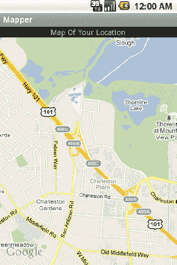
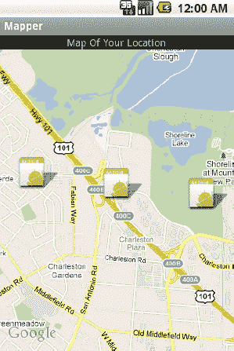
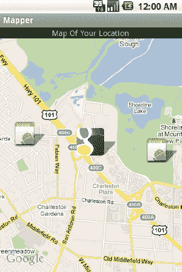
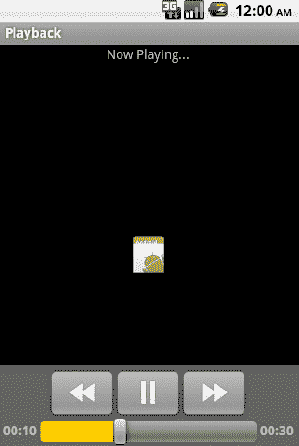
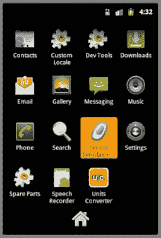
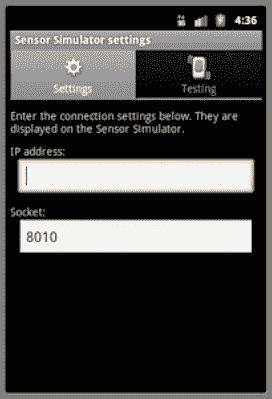
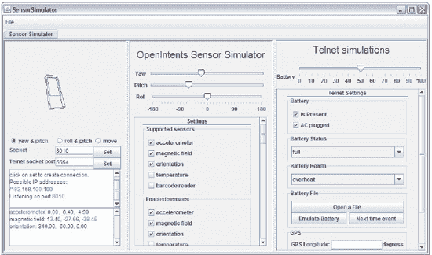
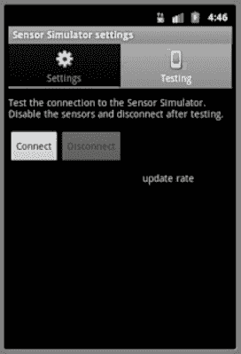
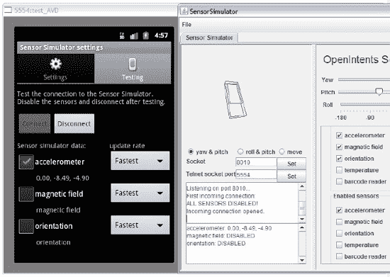

# 四、与设备硬件和介质交互

将应用软件与设备硬件集成为创造只有移动平台才能提供的独特用户体验提供了机会。使用麦克风和摄像头捕捉媒体允许应用通过照片或录制的问候融入个人风格。传感器和位置数据的集成可以帮助您开发应用来回答相关问题，如“我在哪里？”“我在看什么？”

在这一章中，我们将探讨如何使用 Android 提供的位置、媒体和传感器 API 来为您的应用增加移动设备带来的独特价值。

#### 4–1。集成设备位置

##### 问题

您希望利用设备的功能来报告其在应用中的当前物理位置。

##### 解决方案

**(API 一级)**

利用 Android `LocationManager`提供的后台服务。移动应用通常可以为用户提供的最强大的好处之一是能够通过包含基于用户当前位置的信息来添加上下文。应用可能会要求`LocationManager`定期提供设备位置的更新，或者只是在检测到设备移动了很远的距离时才提供。

使用 Android 定位服务时，应注意尊重设备电池和用户的意愿。使用设备的 GPS 获得精细的位置定位是一个电力密集型过程，如果持续开着，会很快耗尽用户设备的电池。出于这个原因，以及其他原因，Android 允许用户禁用某些位置数据来源，如设备的 GPS。当您的应用决定如何获取位置时，必须遵守这些设置。

每个位置源也伴随着准确度的折衷。GPS 将返回更精确的位置(几米以内)，但需要更长的时间来定位，并消耗更多的能量；而网络位置通常会精确到几公里，但是返回得更快并且使用更少的功率。在决定访问哪些源时，考虑应用的要求；如果您的应用只希望显示当地城市的信息，也许 GPS 定位是不必要的。

**重要提示:**在应用中使用定位服务时，请记住`android.permission.ACCESS_COARSE_LOCATION`或`android.permission.ACCESS_FINE_LOCATION`必须在应用清单中声明。如果你声明了`android.permission.ACCESS_FINE_LOCATION`，你不需要两者，因为它也包含了粗略的权限。

##### 它是如何工作的

在为活动或服务中的用户位置创建简单的监视器时，我们需要考虑一些操作:

1.  确定我们要使用的源是否已启用。如果不是，决定是否要求用户启用它或尝试其他来源。
2.  使用合理的最小距离和更新间隔值注册更新。
3.  不再需要更新时注销更新以节省设备电量。

在清单 4–1 中，我们注册了一个活动来监听用户可见的位置更新，并在屏幕上显示该位置。

**清单 4–1。** *活动监控位置更新*

`publicclass MyActivity extends Activity {

    LocationManager manager;
    Location currentLocation;

    TextView locationView;

    @Override
    public void onCreate(Bundle savedInstanceState) {
        super.onCreate(savedInstanceState);` `locationView = new TextView(this);
        setContentView(locationView);

        manager = (LocationManager)getSystemService(Context.LOCATION_SERVICE);
    }

    @Override
    public void onResume() {
        super.onResume();
        if(!manager.isProviderEnabled(LocationManager.GPS_PROVIDER)) {
            //Ask the user to enable GPS
            AlertDialog.Builder builder = new AlertDialog.Builder(this);
            builder.setTitle("Location Manager");
            builder.setMessage("We want to use your location, but GPS is currently disabled.\n"
                    +"Would you like to change these settings now?");
            builder.setPositiveButton("Yes", new DialogInterface.OnClickListener() {
                @Override
                public void onClick(DialogInterface dialog, int which) {
                    //Launch settings, allowing user to make a change
                    Intent i = new Intent(Settings.ACTION_LOCATION_SOURCE_SETTINGS);
                    startActivity(i);
                }
            });
            builder.setNegativeButton("No", new DialogInterface.OnClickListener() {
                @Override
                public void onClick(DialogInterface dialog, int which) {
                    //No location service, no Activity
                    finish();
                }
            });
            builder.create().show();
        }

        //Get a cached location, if it exists
        currentLocation = manager.getLastKnownLocation(LocationManager.GPS_PROVIDER);
        updateDisplay();
        //Register for updates
        int minTime = 5000;
        float minDistance = 0;
        manager.requestLocationUpdates(LocationManager.GPS_PROVIDER,
                minTime, minDistance, listener);
    }

    @Override
    public void onPause() {
        super.onPause();
        manager.removeUpdates(listener);
    }

    //Update text view
    privatevoid updateDisplay() {
        if(currentLocation == null) {
            locationView.setText("Determining Your Location...");
        } else {
            locationView.setText(String.format("Your Location:\n%.2f, %.2f",
                    currentLocation.getLatitude(),` `                    currentLocation.getLongitude()));
        }
    }

    //Handle location callback events
    private LocationListener listener = new LocationListener() {

        @Override
        public void onLocationChanged(Location location) {
            currentLocation = location;
            updateDisplay();
        }

        @Override
        public void onProviderDisabled(String provider) { }

        @Override
        public void onProviderEnabled(String provider) { }

        @Override
        public void onStatusChanged(String provider, int status, Bundle extras) { }

    };
}`

本例选择严格使用设备的 GPS 来获取位置更新。因为它是此活动功能的关键要素，所以每次恢复后承担的第一个主要任务是检查`LocationManager.GPS_PROVIDER`是否仍然启用。如果出于某种原因，用户禁用了此功能，我们会询问他们是否愿意启用 GPS，让他们有机会纠正这种情况。应用没有能力为用户做到这一点，所以如果他们同意，我们使用意图动作`Settings.ACTION_LOCATION_SOURCE_SETTINGS`启动一个活动，这将调出设备设置，以便用户可以启用 GPS。

一旦 GPS 处于活动状态并且可用，该活动就会注册一个`LocationListener`来通知位置更新。除了提供者类型和目的地侦听器之外，`LocationManager.requestLocationUpdates()`方法还接受两个重要参数:

*   `minTime`
    *   更新之间的最小时间间隔，以毫秒为单位。
    *   将此项设置为非零值允许位置提供者在再次更新之前休息大约指定的时间。
    *   这是一个保存功率的参数，并且不应该被设置为任何低于最小可接受更新速率的值。
*   `minDistance`
    *   发送下一次更新之前设备必须移动的距离，单位为米。
    *   将此项设置为非零将阻止更新，直到确定设备至少移动了这么多。

在本例中，我们要求发送更新的频率不超过每五秒钟一次，而不考虑位置是否发生了显著变化。当这些更新到达时，注册的监听器的`onLocationChanged()`方法被调用。请注意，当不同提供者的状态发生变化时，LocationListener 也会得到通知，尽管我们在这里没有利用这些回调。

**注意:**如果是在某个服务或其他后台操作中接收更新，Google 建议最小时间间隔不低于 60000(60 秒)。

该示例保存了对它接收到的最新位置的运行引用。最初，通过调用`getLastKnownLocation()`将该值设置为提供者缓存的最后一个已知位置，如果提供者没有缓存的位置值，则可能返回 null。对于每个传入的更新，位置值被重置，并且用户界面显示被更新以反映新的变化。

#### 4–2。映射位置

##### 问题

您希望在地图上为用户显示一个或多个位置。

##### 解决方案

**(API 一级)**

向用户展示地图的最简单方法是用位置数据创建一个意图，并将其传递给 Android 系统，以便在地图应用中启动。在后面的章节中，我们将更深入地研究这种方法来完成许多不同的任务。此外，可以使用 Google Maps API SDK 插件提供的`MapView`和`MapActivity`将地图嵌入到您的应用中。

Maps API 是核心 SDK 的附加模块，尽管它们仍然捆绑在一起。如果您还没有 Google APIs SDK，请打开 SDK 管理器，您会发现在“第三方插件”下列出了每个 API 级别的包。

为了在您的应用中使用 Maps API，必须首先从 Google 获得 API 密钥。此密钥是使用签名应用的私钥生成的。如果没有 API 键，可以使用映射类，但不会向应用返回地图切片。

**注:**欲了解关于 SDK 的更多信息，并获取 API 密钥，请访问[`code . Google . com/Android/add-ons/Google-APIs/mapkey . html`](http://code.google.com/android/add-ons/google-apis/mapkey.html)。还要注意，Android 对所有在调试模式下运行的应用使用相同的签名密钥(比如当它们从 IDE 中运行时)，因此一个密钥可以为您在测试阶段开发的所有应用服务。

如果您在仿真器中运行代码进行测试，那么该仿真器必须使用 SDK 目标构建，该目标包括 Google APIs for mapping 以正确运行。如果从命令行创建模拟器，这些目标被命名为“Google Inc.:GoogleAPIs:X”，其中“X”是 API 版本指示器。如果您从 ide(比如 Eclipse)内部创建模拟器，那么目标具有类似的命名约定“Google API(Google Inc .)–X”，其中“X”是 API 版本指示符。

有了 API 密匙和合适的测试平台，就可以开始了。

##### 它是如何工作的

要显示地图，只需在一个`MapActivity`中创建一个`MapView`的实例。在 XML 布局中，必须传递给`MapView`的一个必需属性是从 Google 获得的 API 键。参见清单 4–2。

**清单 4–2。** *布局中的典型 MapView*

`<com.google.android.maps.MapView
  android:layout_width="fill_parent"
  android:layout_height="fill_parent"
  android:enabled="true"
  android:clickable="true"
  android:apiKey="API_KEY_STRING_HERE"
/>`

**注意:**当将`MapView`添加到 XML 布局中时，必须包括完全限定的包名，因为该类不存在于`android.view`或`android.widget`中。

尽管 MapView 也可以从代码中实例化，但 API 键仍然需要作为构造函数参数:

`MapView map = new MapView(this, "API_KEY_STRING_HERE");`

此外，应用清单必须声明它对 Maps 库的使用，Maps 库双重地充当 Android Market 过滤器，将应用从没有此功能的设备上删除。

现在，让我们来看一个例子，它将最后一个已知的用户位置放在地图上并显示出来。参见清单 4–3。

**清单 4–3。**Android manifest . XML

`<?xml version="1.0" encoding="utf-8"?>
<manifest xmlns:android="http://schemas.android.com/apk/res/android"
    package="com.examples.mapper"
    android:versionCode="1"
    android:versionName="1.0">
    <uses-sdk android:minSdkVersion="3" />
    <uses-permission android:name="android.permission.ACCESS_FINE_LOCATION" />
    <uses-permission android:name="android.permission.INTERNET" />

    <application android:icon="@drawable/icon" android:label="@string/app_name">
        <activity android:name=".MyActivity"
            android:label="@string/app_name">
            <intent-filter>
                <action android:name="android.intent.action.MAIN" />
                <category android:name="android.intent.category.LAUNCHER" />
            </intent-filter>
        </activity>

        <uses-library android:name="com.google.android.maps"></uses-library>

    </application>
</manifest>`

请注意为 INTERNET 和 ACCESS_FINE_LOCATION 声明的权限。后者是必需的，因为这个例子是挂钩回`LocationManager`来获取缓存的位置值。清单中必须存在的另一个关键要素是引用 Google Maps API 的`<uses-library>`标签。Android 需要这个项目来正确地将外部库链接到您的应用构建中，但它还有另一个目的。Android Market 使用库声明来过滤应用，因此它不能安装在没有配备正确映射库的设备上。参见清单 4–4。

**清单 4–4。** *res/layout/main.xml*

`<?xml version="1.0" encoding="utf-8"?>
<LinearLayout xmlns:android="http://schemas.android.com/apk/res/android"
  android:orientation="vertical"
  android:layout_width="fill_parent"
  android:layout_height="fill_parent">
  <TextView  
    android:layout_width="fill_parent"
    android:layout_height="wrap_content"
    android:gravity="center_horizontal"
    android:text="Map Of Your Location"
  />
  <com.google.android.maps.MapView
    android:id="@+id/map"
    android:layout_width="fill_parent"
    android:layout_height="fill_parent"
    android:enabled="true"
    android:clickable="true"
    android:apiKey="YOUR_API_KEY_HERE"
  />
</LinearLayout>`

记下您必须输入的必需 API 密钥的位置。另外，请注意，`MapView`不必是活动布局中唯一的东西，尽管事实上它必须在`MapActivity`中膨胀。参见清单 4–5。

**清单 4–5。** *显示缓存位置的地图活动*

`publicclass MyActivity extends MapActivity {

    MapView map;
    MapController controller;

    @Override
    public void onCreate(Bundle savedInstanceState) {
        super.onCreate(savedInstanceState);
        setContentView(R.layout.main);

        map = (MapView)findViewById(R.id.map);
        controller = map.getController();

        LocationManager manager =
            (LocationManager)getSystemService(Context.LOCATION_SERVICE);
        Location location = manager.getLastKnownLocation(LocationManager.GPS_PROVIDER);
        int lat, lng;
        if(location != null) {
            //Convert to microdegrees
            lat = (int)(location.getLatitude() * 1000000);
            lng = (int)(location.getLongitude() * 1000000);
        } else {
            //Default to Google HQ
            lat = 37427222;
            lng = -122099167;
        }
        GeoPoint mapCenter = new GeoPoint(lat,lng);
        controller.setCenter(mapCenter);
        controller.setZoom(15);
    }

    //Required abstract method, return false
    @Override
    protectedboolean isRouteDisplayed() {
        return false;
    }
}`

此活动获取最新的用户位置，并将地图居中于该点。所有对地图的控制都是通过一个`MapController`实例来完成的，我们通过调用`MapView.getController()`来获得这个实例；控制器可用于平移、缩放和调整屏幕上的地图。在这个例子中，我们使用控制器的`setCenter()`和`setZoom()`方法来调整地图显示。

`MapController.setCenter()`将一个`GeoPoint`作为它的参数，这个参数与我们从 Android 服务接收到的`Location`略有不同。主要区别在于`GeoPoint`用微度(或度数* 1E6)来表示纬度和经度，而不是用表示整度的十进制值。因此，我们必须在将`Location`值应用到地图之前对其进行转换。

`MapController.setZoom()`允许地图以编程方式缩放到指定级别，介于 1 和 21 之间。默认情况下，地图将缩放到级别 1，SDK 文档将其定义为全局视图，每增加一个级别，地图将放大两倍。参见图 4–1。

**图 4–1。** *用户位置地图*

您可能会注意到的第一件事是，地图没有在位置点上显示任何指示器(如大头针)。在 Recipe 4–3 中，我们将创建这些注释，并描述如何定制它们。

#### 4–3 岁。注释地图

##### 问题

除了显示以特定位置为中心的地图之外，您的应用还需要添加注释，以便更明显地标记该位置。

##### 解决方案

**(API 一级)**

为地图创建一个自定义的`ItemizedOverlay`,包括所有要标记的点。`ItemizedOverlay`是一个抽象基类，它处理`MapView`上各个项目的所有绘图。项目本身是`OverlayItem`的实例，它是一个模型类，定义名称、副标题和可绘制标记来描述地图上的点。

##### 它是如何工作的

让我们创建一个实现，它将获取一个 GeoPoints 数组，并使用相同的可绘制标记在地图上绘制它们。参见清单 4–6。

**清单 4–6。** *基本明细实现*

`public class LocationOverlay extends ItemizedOverlay<OverlayItem> {
    private List<GeoPoint> mItems;

    public LocationOverlay(Drawable marker) {
        super( boundCenterBottom(marker) );
    }

    public void setItems(ArrayList<GeoPoint> items) {
        mItems = items;
        populate();
    }

    @Override
    protected OverlayItem createItem(int i) {
        returnnew OverlayItem(mItems.get(i), null, null);
    }

    @Override
    publicint size() {
        return mItems.size();
    }

    @Override
    protected boolean onTap(int i) {
        //Handle a tap event here
        return true;
    }
}`

在这个实现中，构造函数使用一个`Drawable`来表示放置在地图上每个位置的标记。覆盖图中使用的`Drawable`必须有适当的界限，而`boundCenterBottom()`是一个方便的方法来处理这个问题。具体来说，它应用了边界，使得`Drawable`上接触地图位置的点将位于底部像素行的中心。

ItemizedOverlay 有两个必须被覆盖的抽象方法:`createItem()`，它必须返回声明类型的对象，以及`size()`，它返回被管理的项目的数量。这个例子获取了一个`GeoPoint`的列表，并将它们全部包装到`OverlayItem`中。一旦所有数据都出现并准备好显示，就应该在覆盖图中调用`populate()`方法，在这个例子中是在`setItems()`的末尾。

让我们将这个覆盖图应用到地图上，使用默认的应用图标作为标记，在 Google HQ 周围绘制三个自定义位置。参见清单 4–7。

**清单 4–7。** *活动使用自定义地图叠加*

`public class MyActivity extends MapActivity {

    MapView map;
    MapController controller;

    @Override
    public void onCreate(Bundle savedInstanceState) {
        super.onCreate(savedInstanceState);
        setContentView(R.layout.main);

        map = (MapView)findViewById(R.id.map);
        controller = map.getController();

        ArrayList<GeoPoint> locations = new ArrayList<GeoPoint>();
        //Google HQ @ 37.427,-122.099
        locations.add(new GeoPoint(37427222,-122099167));
        //Subtract 0.01 degrees
        locations.add(new GeoPoint(37426222,-122089167));
        //Add 0.01 degrees
        locations.add(new GeoPoint(37428222,-122109167));

        LocationOverlay myOverlay =
            new LocationOverlay(getResources().getDrawable(R.drawable.icon));
        myOverlay.setItems(locations);
        map.getOverlays().add(myOverlay);
        controller.setCenter(locations.get(0));
        controller.setZoom(15);

    }
    //Required abstract method, return false
    @Override
    protected boolean isRouteDisplayed() {
        return false;
    }

}`

运行时，该活动产生如图图 4–2 所示的显示。

**图 4–2。** *地图与详解*

请注意`MapView`和`ItemizedOverlay`是如何在标记上绘制阴影的。

但是，如果我们想要定制每个项目，使其显示不同的标记图像，该怎么办呢？我们该怎么做？通过显式设置项目的标记，可以为每个项目返回一个自定义的`Drawable`。在这种情况下，提供给`ItemizedOverlay`构造函数的 Drawable 只是一个缺省值，如果不存在自定义覆盖的话。考虑对实现进行修改，如清单 4–8 所示。

**清单 4–8。** *用自定义标记逐项覆盖*

`public class LocationOverlay extends ItemizedOverlay<OverlayItem> {
    private List<GeoPoint> mItems;
    private List<Drawable> mMarkers;

    public LocationOverlay(Drawable marker) {
        super( boundCenterBottom(marker) );
    }

    public void setItems(ArrayList<GeoPoint> items, ArrayList<Drawable> drawables) {
        mItems = items;
        mMarkers = drawables;
        populate();
    }

    @Override
    protected OverlayItem createItem(int i) {
        OverlayItem item = new OverlayItem(mItems.get(i), null, null);` `        item.setMarker( boundCenterBottom(mMarkers.get(i)) );
        return item;
    }

    @Override
    publicint size() {
        return mItems.size();
    }

    @Override
    protected boolean onTap(int i) {
        //Handle a tap event here
        return true;
    }
}`

通过这一修改，创建的 OverlayItems 现在可以接收一个定制的标记图像，其形式为与图像列表中的项目索引相匹配的有界的`Drawable`。如果您设置的`Drawable`有状态，当选择或触摸该项目时，将显示按下和聚焦状态。我们修改后使用新实现的例子看起来像清单 4–9。

**清单 4–9。** *提供自定义标记的示例活动*

`public class MyActivity extends MapActivity {

    MapView map;
    MapController controller;

    @Override
    public void onCreate(Bundle savedInstanceState) {
        super.onCreate(savedInstanceState);
        setContentView(R.layout.main);

        map = (MapView)findViewById(R.id.map);
        controller = map.getController();

        ArrayList<GeoPoint> locations = new ArrayList<GeoPoint>();
        ArrayList<Drawable> images = new ArrayList<Drawable>();

        //Google HQ 37.427,-122.099
        locations.add(new GeoPoint(37427222,-122099167));
        images.add(getResources().getDrawable(R.drawable.logo));
        //Subtract 0.01 degrees
        locations.add(new GeoPoint(37426222,-122089167));
        images.add(getResources().getDrawable(R.drawable.icon));
        //Add 0.01 degrees
        locations.add(new GeoPoint(37428222,-122109167));
        images.add(getResources().getDrawable(R.drawable.icon));

        LocationOverlay myOverlay =
            new LocationOverlay(getResources().getDrawable(R.drawable.icon));
        myOverlay.setItems(locations, images);
        map.getOverlays().add(myOverlay);
        controller.setCenter(locations.get(0));
        controller.setZoom(15);` `    }

    //Required abstract method, return false
    @Override
    protected boolean isRouteDisplayed() {
        return false;
    }
}`

现在，我们的示例为它希望在地图上显示的每个项目提供了一个离散的图像。具体来说，我们已经决定用一个版本的 Google 徽标来代表实际的 Google HQ 位置，同时用相同的标记保留其他两个点。参见图 4–3。

**图 4–3。** *用自定义标记覆盖地图*

###### 让他们交互

也许您注意到了 LocationOverlay 中定义的`onTap()`方法，但从未提及。`ItemizedOverlay`基本实现的另一个很好的特性是，它处理点击测试，并且当它点击一个特定的项目时，有一个方便的方法来引用该项目的索引。通过这个方法，您可以敬酒、显示对话框、开始一个新的活动，或者任何其他适合用户点击注释获取更多信息的操作。

###### 我呢？

Android 的地图 API 还包括一个特殊的覆盖图来绘制用户位置，即`MyLocationOverlay`。这个覆盖图使用起来非常简单，但是只有当它所在的活动可见时才应该启用它。否则，不必要的资源使用将导致设备性能下降和电池寿命延长。参见清单 4–10。

**清单 4–10。** *添加 MyLocationOverlay*

`public class MyActivity extends MapActivity {

    MapView map;
    MyLocationOverlay myOverlay;

    @Override
    public void onCreate(Bundle savedInstanceState) {
        super.onCreate(savedInstanceState);
        setContentView(R.layout.main);

        map = (MapView)findViewById(R.id.map);
        myOverlay = new MyLocationOverlay(this, map);
        map.getOverlays().add(myOverlay);
    }

    @Override
    public void onResume() {
        super.onResume();
        myOverlay.enableMyLocation();
    }

    @Override
    public void onPause() {
        super.onResume();
        myOverlay.disableMyLocation();
    }

    //Required abstract method, return false
    @Override
    protected boolean isRouteDisplayed() {
        return false;
    }
}`

这将在用户的最新位置上显示一个标准的点或箭头标记(取决于指南针是否在使用),并且只要启用覆盖，就会随着用户的移动进行跟踪。

使用`MyLocationOverlay`的关键是在不使用时禁用其功能(当活动不可见时)，并在需要时重新启用它们。就像使用`LocationManager`一样，这确保了这些服务不会消耗不必要的能量。

#### 4–4。捕捉图像和视频

##### 问题

您的应用需要利用设备的摄像头来捕捉媒体，无论是静态图像还是短视频剪辑。

##### 解决方案

**(API 三级)**

向 Android 发送一个意向，将控制权转移给相机应用，并返回用户捕获的图像。Android 确实包含用于直接访问相机硬件、预览和拍摄快照或视频的 API。但是，如果您的唯一目标是使用用户熟悉界面的摄像头简单地获取媒体内容，那么没有比移交更好的解决方案了。

##### 它是如何工作的

让我们来看看如何使用相机应用拍摄静态图像和视频剪辑。

###### 图像捕捉

让我们来看一个示例活动，当按下“拍照”按钮时，该活动将激活相机应用，并以位图的形式接收该操作的结果。参见清单 4–11 和清单 4–12。

**清单 4–11。** *res/layout/main.xml*

`<?xml version="1.0" encoding="utf-8"?>
<LinearLayout xmlns:android="http://schemas.android.com/apk/res/android"
  android:orientation="vertical"
  android:layout_width="fill_parent"
  android:layout_height="fill_parent">
  <Button
    android:id="@+id/capture"
    android:layout_width="fill_parent"
    android:layout_height="wrap_content"
    android:text="Take a Picture"
  />
  <ImageView
    android:id="@+id/image"
    android:layout_width="fill_parent"
    android:layout_height="fill_parent"
    android:scaleType="centerInside"
  />
</LinearLayout>`

**清单 4–12。** *活动捕捉图像*

`public class MyActivity extends Activity {

    privatestaticfinalintREQUEST_IMAGE = 100;

    Button captureButton;
    ImageView imageView;

    @Override
    public void onCreate(Bundle savedInstanceState) {
        super.onCreate(savedInstanceState);
        setContentView(R.layout.main);

        captureButton = (Button)findViewById(R.id.capture);
        captureButton.setOnClickListener(listener);

        imageView = (ImageView)findViewById(R.id.image);
    }

    @Override
    protected void onActivityResult(int requestCode, int resultCode, Intent data) {
        if(requestCode == REQUEST_IMAGE&& resultCode == Activity.RESULT_OK) {
            //Process and display the image
            Bitmap userImage = (Bitmap)data.getExtras().get("data");
            imageView.setImageBitmap(userImage);
        }
    }

    private View.OnClickListener listener = new View.OnClickListener() {
        @Override
        public void onClick(View v) {
            Intent intent = new Intent(MediaStore.ACTION_IMAGE_CAPTURE);
            startActivityForResult(intent, REQUEST_IMAGE);
        }
    };
}`

该方法捕获图像并返回一个缩小的位图作为“数据”字段中的额外内容。如果您需要捕获图像并需要将全尺寸图像保存在某处，在开始捕获之前，将图像目的地的`Uri`插入意图的`MediaStore.EXTRA_OUTPUT`字段。参见清单 4–13。

**清单 4–13。** *全尺寸图像捕捉到文件*

`public class MyActivity extends Activity {

    private static final int REQUEST_IMAGE = 100;

    Button captureButton;
    ImageView imageView;
    File destination;

    @Override
    public void onCreate(Bundle savedInstanceState) {
        super.onCreate(savedInstanceState);
        setContentView(R.layout.main);` `        captureButton = (Button)findViewById(R.id.capture);
        captureButton.setOnClickListener(listener);

        imageView = (ImageView)findViewById(R.id.image);

        destination = new File(Environment.getExternalStorageDirectory(),"image.jpg");
    }

    @Override
    protected void onActivityResult(int requestCode, int resultCode, Intent data) {
        if(requestCode == REQUEST_IMAGE&& resultCode == Activity.RESULT_OK) {
            try {
                FileInputStream in = new FileInputStream(destination);
                BitmapFactory.Options options = new BitmapFactory.Options();
                options.inSampleSize = 10; //Downsample by 10x

                Bitmap userImage = BitmapFactory.decodeStream(in, null, options);
                imageView.setImageBitmap(userImage);
            } catch (Exception e) {
                e.printStackTrace();
            }
        }
    }

    private View.OnClickListener listener = new View.OnClickListener() {
        @Override
        public void onClick(View v) {
            Intent intent = new Intent(MediaStore.ACTION_IMAGE_CAPTURE);
            //Add extra to save full-image somewhere
            intent.putExtra(MediaStore.EXTRA_OUTPUT, Uri.fromFile(destination));
            startActivityForResult(intent, REQUEST_IMAGE);
        }
    };
}`

此方法将指示相机应用将图像存储在其他地方(在本例中，在设备的 SD 卡上存储为“image.jpg”)，并且结果不会按比例缩小。当操作返回后要检索图像时，我们现在直接进入我们告诉相机存储的文件位置。

然而，使用`BitmapFactory.Options`，我们仍然在显示到屏幕之前缩小图像，以避免一次将全尺寸位图加载到内存中。还要注意，这个例子选择了一个位于设备外部存储器上的文件位置，这需要在 API 级别 4 及以上声明`android.permission.WRITE_EXTERNAL_STORAGE`权限。如果您的最终解决方案将文件写在其他地方，这可能是不必要的。

###### 视频拍摄

使用这种方法捕捉视频剪辑同样简单，尽管产生的结果略有不同。在任何情况下，实际的视频剪辑数据都不会直接在 Intent extras 中返回，并且总是保存到目标文件位置。以下两个参数可以作为额外参数传递:

1.  `MediaStore.EXTRA_VIDEO_QUALITY`
    1.  描述用于捕获视频的质量级别的整数值。
    2.  低质量的允许值为 0，高质量的允许值为 1。
2.  `MediaStore.EXTRA_OUTPUT`
    1.  保存视频内容的 Uri 目标位置。
    2.  如果不存在，视频将保存在设备的标准位置。

当视频记录完成时，数据保存的实际位置作为结果意图的数据字段中的`Uri`返回。让我们看一个类似的例子，它允许用户记录并保存他们的视频，然后将保存的位置显示回屏幕。参见清单 4–14 和清单 4–15。

**清单 4–14。** *res/layout/main.xml*

`<?xml version="1.0" encoding="utf-8"?>
<LinearLayout xmlns:android="http://schemas.android.com/apk/res/android"
  android:orientation="vertical"
  android:layout_width="fill_parent"
  android:layout_height="fill_parent">
  <Button
    android:id="@+id/capture"
    android:layout_width="fill_parent"
    android:layout_height="wrap_content"
    android:text="Take a Video"
  />
  <TextView
    android:id="@+id/file"
    android:layout_width="fill_parent"
    android:layout_height="fill_parent"
  />
</LinearLayout>`

**清单 4–15。** *活动捕捉一个视频片段*

`public class MyActivity extends Activity {

    private static final int REQUEST_VIDEO = 100;

    Button captureButton;
    TextView text;
    File destination;

    @Override
    public void onCreate(Bundle savedInstanceState) {
        super.onCreate(savedInstanceState);
        setContentView(R.layout.main);

        captureButton = (Button)findViewById(R.id.capture);
        captureButton.setOnClickListener(listener);

        text = (TextView)findViewById(R.id.file);` `        destination = new File(Environment.getExternalStorageDirectory(),"myVideo");
    }

    @Override
    protected void onActivityResult(int requestCode, int resultCode, Intent data) {
        if(requestCode == REQUEST_VIDEO&& resultCode == Activity.RESULT_OK) {
            String location = data.getData().toString();
            text.setText(location);
        }
    }

    private View.OnClickListener listener = new View.OnClickListener() {
        @Override
        public void onClick(View v) {
            Intent intent = new Intent(MediaStore.ACTION_VIDEO_CAPTURE);
            //Add (optional) extra to save video to our file
            intent.putExtra(MediaStore.EXTRA_OUTPUT, Uri.fromFile(destination));
            //Optional extra to set video quality
            intent.putExtra(MediaStore.EXTRA_VIDEO_QUALITY, 0);
            startActivityForResult(intent, REQUEST_VIDEO);
        }
    };
}`

这个例子和前面保存图像的例子一样，将录制的视频放在设备的 SD 卡上(对于 API 级别 4+需要`android.permission.WRITE_EXTERNAL_STORAGE`权限)。为了启动这个过程，我们向媒体商店发送一个意向。ACTION_VIDEO_CAPTURE 动作字符串给系统。Android 将启动默认的相机应用来处理视频录制，并在录制完成时返回一个 OK 结果。我们通过调用`onActivityResult()`回调方法中的`Intent.getData()`来检索数据作为 Uri 存储的位置，然后向用户显示该位置。

此示例明确要求使用低质量设置拍摄视频，但此参数是可选的。如果`MediaStore.EXTRA_VIDEO_QUALITY`不在请求意图中，设备通常会选择使用高质量拍摄。

在提供了`MediaStore.EXTRA_OUTPUT`的情况下，返回的`Uri`应该与您请求的位置相匹配，除非出现错误，导致应用无法写入该位置。如果不提供该参数，返回值将是一个`content://Uri`，用于从系统的 MediaStore 内容提供商检索媒体。

稍后，在方法 4–8 中，我们将研究在您的应用中播放该媒体的实用方法。

#### 4–5。制作自定相机覆盖图

##### 问题

许多应用需要更直接地访问摄像头，或者是为了覆盖控件的自定义用户界面，或者是为了显示关于通过基于位置和方向传感器的信息可见的内容的元数据(增强现实)。

##### 解决方案

**(API 等级 5)**

在自定义活动中直接连接到摄像机硬件。Android 提供 API 来直接访问设备的摄像头，以获取预览提要和拍摄照片。当应用的需求增长到不仅仅是简单地抓拍并返回一张照片以供显示时，我们可以访问这些。

**注意:**因为我们在这里对摄像机采取了更直接的方法，所以需要在清单中声明`android.permission.CAMERA`权限。

##### 它是如何工作的

我们从创建一个`SurfaceView`开始，这是一个用于实时绘图的专用视图，我们将在其中附加相机的预览流。这为我们提供了一个视图中的实时预览，我们可以在活动中以我们选择的任何方式进行布局。从那以后，只需添加适合应用上下文的其他视图和控件。让我们来看看代码(参见清单 4–16 和清单 4–17)。

**注:**这里使用的`Camera`级是`android.hardware.Camera`，不要和`android.graphics.Camera`混淆。确保在应用中导入了正确的引用。

**清单 4–16。** *res/layout/main.xml*

`<?xml version="1.0" encoding="utf-8"?>
<RelativeLayout xmlns:android="http://schemas.android.com/apk/res/android"
  android:layout_width="fill_parent"
  android:layout_height="fill_parent">
  <SurfaceView
    android:id="@+id/preview"
    android:layout_width="fill_parent"
    android:layout_height="fill_parent"
  />
</RelativeLayout>`

**清单 4–17。** *活动展示现场摄像预览*

`import android.hardware.Camera;

publicclass PreviewActivity extends Activity implements SurfaceHolder.Callback {

    Camera mCamera;
    SurfaceView mPreview;

    @Override
    public void onCreate(Bundle savedInstanceState) {
        super.onCreate(savedInstanceState);
        setContentView(R.layout.main);

        mPreview = (SurfaceView)findViewById(R.id.preview);
        mPreview.getHolder().addCallback(this);
        mPreview.getHolder().setType(SurfaceHolder.SURFACE_TYPE_PUSH_BUFFERS);

        mCamera = Camera.open();
    }

    @Override
    public void onPause() {
        super.onPause();
        mCamera.stopPreview();
    }

    @Override
    public void onDestroy() {
        super.onDestroy();
        mCamera.release();
    }

    //Surface Callback Methods
    @Override
    public void surfaceChanged(SurfaceHolder holder, int format, int width, int height)
    {
        Camera.Parameters params = mCamera.getParameters();
        //Get all the devices's supported sizes and pick the first (largest)
        List<Camera.Size> sizes = params.getSupportedPreviewSizes();
        Camera.Size selected = sizes.get(0);
        params.setPreviewSize(selected.width,selected.height);
        mCamera.setParameters(params);

        mCamera.startPreview();
    }

    @Override
    public void surfaceCreated(SurfaceHolder holder) {
        try {
            mCamera.setPreviewDisplay(mPreview.getHolder());
        } catch (Exception e) {
            e.printStackTrace();
        }
    }

    @Override
    public void surfaceDestroyed(SurfaceHolder holder) { }
}`

**注意:**如果你在模拟器上测试，没有摄像头可以预览。模拟器显示什么来模拟预览取决于您运行的版本。要验证此代码是否正常工作，请在您的特定模拟器上打开 Camera 应用，并注意预览效果。这个示例中应该会出现相同的显示。

在这个例子中，我们创建了一个填充窗口的`SurfaceView`，并告诉它我们的活动将被通知所有的`SurfaceHolder`回调。摄像机在完全初始化之前不能在表面上显示预览信息，所以我们一直等到调用`surfaceCreated()`来将视图的`SurfaceHolder`附加到`Camera`实例。类似地，我们等待调整预览的大小并开始绘制，直到表面被赋予其大小，这发生在调用`surfaceChanged()`时。

调用`Parameters.getSupportedPreviewSizes()`会返回设备可以接受的所有尺寸的列表，它们通常按从大到小的顺序排列。在本例中，我们选择第一个(因此也是最大的)预览分辨率，并用它来设置大小。

**注意:**在 2.0 (API Level 5)之前的版本中，对于`Parameters.setPreviewSize()`，直接从该方法中传递高度和宽度参数是可以接受的；但在 2.0 和更高版本中，相机只会将其预览设置为设备支持的分辨率之一。否则尝试将导致异常。

`Camera.startPreview()`开始在表面上实时绘制摄像机数据。请注意，预览始终以横向显示。在 Android 2.2 (API Level 8)之前，官方没有办法调整预览显示的旋转。因此，建议使用摄像机预览的活动将其方向固定为清单中的`android:screenOrientation=“landscape”`以匹配。

相机服务一次只能由一个应用访问。因此，一旦不再需要摄像机，请立即致电`Camera.release()`,这一点很重要。在示例中，当活动结束时，我们不再需要摄像机，因此这个调用发生在`onDestroy()`中。

###### 后来的补充

如果您的应用以它们为目标，那么在 API 的较高版本中有两个附加功能也是有用的:

*   `Camera.setDisplayOrientation(int degrees)`
    *   API 等级 8 可用(安卓 2.2)。
    *   将实时预览设置为 0 度、90 度、180 度或 270 度。0 映射到默认的横向方向。
*   `Camera.open(int which)`
    *   API 级(安卓 2.3)可用。
    *   支持多个摄像头(主要是正面和背面摄像头)。
    *   取 0 到`getNumberOfCameras()` -1 的参数。

###### 照片覆盖

现在，我们可以在前面的示例中添加任何适合在相机预览顶部显示的控件或视图。让我们修改预览，以包括一个取消和快照照片按钮。参见清单 4–18 和清单 4–19。

**清单 4–18。** *res/layout/main.xml*

`<?xml version="1.0" encoding="utf-8"?>
<RelativeLayout xmlns:android="http://schemas.android.com/apk/res/android"
  android:layout_width="fill_parent"
  android:layout_height="fill_parent">
  <SurfaceView
    android:id="@+id/preview"
    android:layout_width="fill_parent"
    android:layout_height="fill_parent"
  />
  <RelativeLayout
    android:layout_width="fill_parent"
    android:layout_height="100dip"
    android:layout_alignParentBottom="true"
    android:gravity="center_vertical"
    android:background="#A000">
    <Button
      android:layout_width="100dip"
      android:layout_height="wrap_content"
      android:text="Cancel"
      android:onClick="onCancelClick"
    />
    <Button
      android:layout_width="100dip"
      android:layout_height="wrap_content"
      android:layout_alignParentRight="true"
      android:text="Snap Photo"
      android:onClick="onSnapClick"
    />
  </RelativeLayout>
</RelativeLayout>`

**清单 4–19。** *添加了照片控件的活动*

`public class PreviewActivity extends Activity implements
                SurfaceHolder.Callback, Camera.ShutterCallback, Camera.PictureCallback {

    Camera mCamera;
    SurfaceView mPreview;

    @Override` `public void onCreate(Bundle savedInstanceState) {
        super.onCreate(savedInstanceState);
        setContentView(R.layout.main);

        mPreview = (SurfaceView)findViewById(R.id.preview);
        mPreview.getHolder().addCallback(this);
        mPreview.getHolder().setType(SurfaceHolder.SURFACE_TYPE_PUSH_BUFFERS);

        mCamera = Camera.open();
    }

    @Override
    public void onPause() {
        super.onPause();
        mCamera.stopPreview();
    }

    @Override
    public void onDestroy() {
        super.onDestroy();
        mCamera.release();
        Log.d("CAMERA","Destroy");
    }

    public void onCancelClick(View v) {
        finish();
    }

    public void onSnapClick(View v) {
        //Snap a photo
        mCamera.takePicture(this, null, null, this);
    }

    //Camera Callback Methods
    @Override
    public void onShutter() {
        Toast.makeText(this, "Click!", Toast.LENGTH_SHORT).show();
    }

    @Override
    public void onPictureTaken(byte[] data, Camera camera) {

        //Store the picture off somewhere
        //Here, we chose to save to internal storage
        try {
            FileOutputStream out = openFileOutput("picture.jpg", Activity.MODE_PRIVATE);
            out.write(data);
            out.flush();
            out.close();
        } catch (FileNotFoundException e) {
            e.printStackTrace();
        } catch (IOException e) {
            e.printStackTrace();
        }

        //Must restart preview
        camera.startPreview();` `    }

    //Surface Callback Methods
    @Override
    public void surfaceChanged(SurfaceHolder holder, int format, int width, int height) {
        Camera.Parameters params = mCamera.getParameters();
        List<Camera.Size> sizes = params.getSupportedPreviewSizes();
        Camera.Size selected = sizes.get(0);
        params.setPreviewSize(selected.width,selected.height);
        mCamera.setParameters(params);

        mCamera.setDisplayOrientation(90);
        mCamera.startPreview();
    }

    @Override
    public void surfaceCreated(SurfaceHolder holder) {
        try {
            mCamera.setPreviewDisplay(mPreview.getHolder());
        } catch (Exception e) {
            e.printStackTrace();
        }
    }

    @Override
    public void surfaceDestroyed(SurfaceHolder holder) { }
}`

在这里，我们添加了一个简单的，部分透明的覆盖，包括一对相机操作的控制。取消所采取的行动是微不足道的；我们简单地完成活动。然而，在手动拍摄照片并将照片返回到应用时，Snap Photo 引入了更多的相机 API。一个用户动作将启动`Camera.takePicture()`方法，该方法接受一系列回调指针。

注意，本例中的活动实现了另外两个接口:`Camera.ShutterCallback`和`Camera.PictureCallback`。前者在尽可能接近图像被捕获的时刻被调用(当“快门”关闭时)，而后者可以在图像的不同形式可用的多个实例中被调用。

takePicture()的参数是单个`ShutterCallback`，最多三个`PictureCallback`实例。将在以下时间调用`PictureCallback`(按照它们作为参数出现的顺序):

1.  在用原始图像数据捕获图像之后
    1.  这可能会在内存有限的设备上返回 null。
2.  在用缩放的图像数据(称为后视图像)处理图像之后
    1.  这可能会在内存有限的设备上返回 null。
3.  在用 JPEG 图像数据压缩图像之后

这个例子只关心当 JPEG 准备好的时候被通知。因此，这也是最后一次回调，也是预览必须再次启动的时间点。如果在拍照后没有再次调用`startPreview()`,那么表面上的预览将保持冻结在捕获的图像上。

#### 4–6 岁。录制音频

##### 问题

您有一个应用需要利用设备麦克风来记录音频输入。

##### 解决方案

**(API 一级)**

使用`MediaRecorder`捕捉音频并将其保存到文件中。

##### 它是如何工作的

MediaRecorder 使用起来非常简单。您只需要提供一些关于用于编码的文件格式和数据存储位置的基本信息。清单 4–20 和 4–21 提供了一个将音频文件录制到设备的 SD 卡上的示例，用于监控用户操作的开始和停止时间。

**重要提示:**为了使用`MediaRecorder`记录音频输入，您还必须在应用清单中声明`android.permission.RECORD_AUDIO`权限。

**清单 4–20。** *res/layout/main.xml*

`<?xml version="1.0" encoding="utf-8"?>
<LinearLayout xmlns:android="http://schemas.android.com/apk/res/android"
  android:orientation="vertical"
  android:layout_width="fill_parent"
  android:layout_height="fill_parent">
  <Button
    android:id="@+id/startButton"
    android:layout_width="fill_parent"
    android:layout_height="wrap_content"
    android:text="Start Recording"
  />
  <Button
    android:id="@+id/stopButton"
    android:layout_width="fill_parent"
    android:layout_height="wrap_content"
    android:text="Stop Recording"
    android:enabled="false"
  />
</LinearLayout>`

**清单 4–21。** *活动录音*

`public class RecordActivity extends Activity {

    private MediaRecorder recorder;
    private Button start, stop;
    File path;

    @Override
    public void onCreate(Bundle savedInstanceState) {
        super.onCreate(savedInstanceState);
        setContentView(R.layout.main);

        start = (Button)findViewById(R.id.startButton);
        start.setOnClickListener(startListener);
        stop = (Button)findViewById(R.id.stopButton);
        stop.setOnClickListener(stopListener);

        recorder = new MediaRecorder();
        path = new File(Environment.getExternalStorageDirectory(),"myRecording.3gp");

        resetRecorder();
    }

    @Override
    public void onDestroy() {
        super.onDestroy();
        recorder.release();
    }

    private void resetRecorder() {
        recorder.setAudioSource(MediaRecorder.AudioSource.MIC);
        recorder.setOutputFormat(MediaRecorder.OutputFormat.THREE_GPP);
        recorder.setAudioEncoder(MediaRecorder.AudioEncoder.DEFAULT);
        recorder.setOutputFile(path.getAbsolutePath());
        try {
            recorder.prepare();
        } catch (Exception e) {
            e.printStackTrace();
        }
    }

    private View.OnClickListener startListener = new View.OnClickListener() {
        @Override
        public void onClick(View v) {
            try {
                recorder.start();

                start.setEnabled(false);
                stop.setEnabled(true);
            } catch (Exception e) {
                e.printStackTrace();
            }
        }
    };

    private View.OnClickListener stopListener = new View.OnClickListener() {
        @Override` `        public void onClick(View v) {
            recorder.stop();
            resetRecorder();

            start.setEnabled(true);
            stop.setEnabled(false);
        }
    };
}`

这个例子的用户界面非常简单。有两个按钮，用户可以根据录制状态交替使用。当用户按下 start 时，我们启用 stop 按钮并开始记录。当用户按下 stop 时，我们重新启用 start 按钮，并将记录器重置为再次运行。

MediaRecorder 的设置非常简单。我们在 SD 卡上创建一个名为“myRecording.3gp”的文件，并在`setOutputFile()`中传递路径。其余的设置方法告诉录像机使用设备麦克风作为输入(音频源。MIC)，并使用默认编码器为输出创建 3GP 文件格式。

现在，你可以使用任何设备的文件浏览器或媒体播放器应用来播放这个音频文件。稍后，在方法 4–8 中，我们将指出如何通过应用播放音频。

#### 4–7 岁。添加语音识别

##### 问题

您的应用需要语音识别技术来解释语音输入。

##### 解决方案

**(API 三级)**

使用`android.speech`包的类来利用每个 Android 设备的内置语音识别技术。每一个配备语音搜索的 Android 设备(从 Android 1.5 开始提供)都为应用提供了使用内置`SpeechRecognizer`处理语音输入的能力。

要激活这个过程，应用只需向系统发送一个`RecognizerIntent`，识别服务将记录语音输入并对其进行处理；返回一个字符串列表，表明识别器认为它听到了什么。

##### 它是如何工作的

让我们来看看这项技术的实际应用。参见清单 4–22。

**清单 4–22。** *活动发起并处理语音识别*

`public class RecognizeActivity extends Activity {

    private static final int REQUEST_RECOGNIZE = 100;

    TextView tv;

    @Override
    public void onCreate(Bundle savedInstanceState) {
        super.onCreate(savedInstanceState);
        tv = new TextView(this);
        setContentView(tv);

        Intent intent = new Intent(RecognizerIntent.ACTION_RECOGNIZE_SPEECH);
        intent.putExtra(RecognizerIntent.EXTRA_LANGUAGE_MODEL,
                        RecognizerIntent.LANGUAGE_MODEL_FREE_FORM);
        intent.putExtra(RecognizerIntent.EXTRA_PROMPT, "Tell Me Your Name");
        try {
            startActivityForResult(intent, REQUEST_RECOGNIZE);
        } catch (ActivityNotFoundException e) {
            //If no recognizer exists, download one from Android Market
            AlertDialog.Builder builder = new AlertDialog.Builder(this);
            builder.setTitle("Not Available");
            builder.setMessage("There is currently no recognition application installed."
                +"  Would you like to download one?");
            builder.setPositiveButton("Yes", new DialogInterface.OnClickListener() {
                @Override
                public void onClick(DialogInterface dialog, int which) {
                    //Download, for example, Google Voice Search
                    Intent marketIntent = new Intent(Intent.ACTION_VIEW);
                    marketIntent.setData
                        (Uri.parse("market://details?id=com.google.android.voicesearch"));
                }
            });
            builder.setNegativeButton("No", null);
            builder.create().show();
        }
    }

    @Override
    protected void onActivityResult(int requestCode, int resultCode, Intent data) {
        if(requestCode == REQUEST_RECOGNIZE&& resultCode == Activity.RESULT_OK) {
            ArrayList<String> matches =                 data.getStringArrayListExtra(RecognizerIntent.EXTRA_RESULTS);
            StringBuilder sb = new StringBuilder();
            for(String piece : matches) {
                sb.append(piece);
                sb.append('\n');
            }
            tv.setText(sb.toString());
        } else {
            Toast.makeText(this, "Operation Canceled", Toast.LENGTH_SHORT).show();
        }
    }
}`

**注意:**如果你在模拟器中测试你的应用，要注意 Android Market 和任何语音识别器都不太可能安装。最好在设备上测试这个例子的操作。

这个例子在应用启动时自动启动语音识别活动，并要求用户“告诉我你的名字”。收到用户的语音并处理结果后，Activity 返回用户可能说过的内容列表。这个列表是按照概率排序的，所以在很多情况下，简单地称`matches.get(0)`为最佳选择并继续前进是明智的。但是，该活动获取所有返回值，并出于娱乐目的将它们显示在屏幕上。

当启动`SpeechRecognizer`时，有许多额外的东西可以传递，目的是定制行为。本例使用了两种最常见的方法:

*   额外 _ 语言 _ 模型
    *   帮助微调来自语音处理器的结果的值。
    *   典型的语音到文本查询应该使用 LANGUAGE_MODEL_FREE_FORM 选项。
    *   如果进行较短的请求类型查询，LANGUAGE_MODEL_WEB_SEARCH 可能会产生更好的结果。
*   额外提示
    *   显示为用户语音提示的字符串值。

除此之外，传递一些其他参数也是有用的:

*   额外 _ 最大 _ 结果
    *   设置返回结果的最大数量的整数。
*   额外语言
    *   请求以不同于当前系统默认语言的语言返回结果。
    *   有效 IETF 标签的字符串值，如“en-US”或“es”

#### 4–8 岁。播放音频/视频

##### 问题

应用需要在设备上播放本地或远程的音频或视频内容。

##### 解

**(API 一级)**

使用`MediaPlayer`播放本地或流媒体。无论内容是音频还是视频，本地还是远程，`MediaPlayer`都将高效地连接、准备和播放相关媒体。在这个菜谱中，我们还将探索使用`MediaController`和`VideoView`作为简单的方法来将交互和视频播放包含到活动布局中。

##### 它是如何工作的

**注意:**在期望播放特定的媒体剪辑或流之前，请阅读开发者文档的“Android 支持的媒体格式”部分以验证支持。

###### 音频播放

让我们看一个简单的例子，只用`MediaPlayer`来播放声音。参见清单 4–23。

**清单 4–23。** *活动播放本地声音*

`public class PlayActivity extends Activity implements MediaPlayer.OnCompletionListener {

    Button mPlay;
    MediaPlayer mPlayer;

    @Override
    public void onCreate(Bundle savedInstanceState) {
        super.onCreate(savedInstanceState);

        mPlay = new Button(this);
        mPlay.setText("Play Sound");
        mPlay.setOnClickListener(playListener);

        setContentView(mPlay);
    }

    @Override
    public void onDestroy() {
        super.onDestroy();
        if(mPlayer != null) {
            mPlayer.release();
        }
    }

    private View.OnClickListener playListener = new View.OnClickListener() {

        @Override
        public void onClick(View v) {
            if(mPlayer == null) {
                try {
                    mPlayer = MediaPlayer.create(PlayActivity.this, R.raw.sound);` `                    mPlayer.start();
                } catch (Exception e) {
                    e.printStackTrace();
                }
            } else {
                mPlayer.stop();
                mPlayer.release();
                mPlayer = null;
            }
        }
    };

    //OnCompletionListener Methods
    @Override
    public void onCompletion(MediaPlayer mp) {
        mPlayer.release();
        mPlayer = null;
    }

}`

此示例使用一个按钮来开始和停止本地声音文件的回放，该文件存储在项目的 res/raw 目录中。`MediaPlayer.create()`是一种具有多种形式的便利方法，旨在一步完成玩家对象的构建和准备。本例中使用的表单引用了一个本地资源 ID，但是也可以使用`create()`来访问和播放远程资源

`MediaPlayer.create(Context context, Uri uri);`

创建后，该示例立即开始播放声音。声音播放时，用户可以再次按下按钮停止播放。该活动还实现了`MediaPlayer.OnCompletionListener`接口，因此当播放操作正常完成时，它会收到一个回调。

在这两种情况下，一旦停止播放，MediaPlayer 实例就会被释放。这种方法允许资源仅在被使用时才被保留，并且声音可以被播放多次。为了确保资源不会被不必要地保留，当活动被销毁时，如果它仍然存在，玩家也会被释放。

如果您的应用需要播放许多不同的声音，您可以考虑在播放结束时调用`reset()`而不是`release()`。但是记住，当玩家不再被需要的时候(或者活动结束了)，还是要给`release()`打电话。

###### 音频播放器

除了简单的回放之外，如果应用需要为用户创建一种交互式体验，以便能够播放、暂停和搜索媒体，该怎么办？MediaPlayer 上有一些方法可以用自定义 UI 元素来实现所有这些功能，但是 Android 也提供了 MediaController 视图，所以您不必这么做。参见列表 4–24 和 4–25。

**清单 4–24。** *res/layout/main.xml*

`<?xml version="1.0" encoding="utf-8"?>
<LinearLayout xmlns:android="http://schemas.android.com/apk/res/android"
  android:id="@+id/root"
  android:orientation="vertical"
  android:layout_width="fill_parent"
  android:layout_height="fill_parent">
  <TextView
    android:layout_width="wrap_content"
    android:layout_height="wrap_content"
    android:layout_gravity="center_horizontal"
    android:text="Now Playing..."
  />
  <ImageView
    android:id="@+id/coverImage"
    android:layout_width="fill_parent"
    android:layout_height="fill_parent"
    android:scaleType="centerInside"
  />
</LinearLayout>`

**清单 4–25。** *用媒体控制器播放音频的活动*

`public class PlayerActivity extends Activity implements
            MediaController.MediaPlayerControl, MediaPlayer.OnBufferingUpdateListener {

    MediaController mController;
    MediaPlayer mPlayer;
    ImageView coverImage;

    int bufferPercent = 0;

    @Override
    public void onCreate(Bundle savedInstanceState) {
        super.onCreate(savedInstanceState);
        setContentView(R.layout.main);

        coverImage = (ImageView)findViewById(R.id.coverImage);

        mController = new MediaController(this);
        mController.setAnchorView(findViewById(R.id.root));
    }

    @Override
    public void onResume() {
        super.onResume();
        mPlayer = new MediaPlayer();
        //Set the audio data source
        try {
            mPlayer.setDataSource(this, Uri.parse("URI_TO_REMOTE_AUDIO"));
            mPlayer.prepare();
        } catch (Exception e) {
            e.printStackTrace();
        }
        //Set an image for the album cover
        coverImage.setImageResource(R.drawable.icon);` `mController.setMediaPlayer(this);
        mController.setEnabled(true);
    }

    @Override
    public void onPause() {
        super.onPause();
        mPlayer.release();
        mPlayer = null;
    }

    @Override
    public boolean onTouchEvent(MotionEvent event) {
        mController.show();
        return super.onTouchEvent(event);
    }

    //MediaPlayerControl Methods
    @Override
    public int getBufferPercentage() {
        return bufferPercent;
    }

    @Override
    public int getCurrentPosition() {
        return mPlayer.getCurrentPosition();
    }

    @Override
    public int getDuration() {
        return mPlayer.getDuration();
    }

    @Override
    public boolean isPlaying() {
        return mPlayer.isPlaying();
    }

    @Override
    public void pause() {
        mPlayer.pause();
    }

    @Override
    public void seekTo(int pos) {
        mPlayer.seekTo(pos);
    }

    @Override
    public void start() {
        mPlayer.start();
    }

    //BufferUpdateListener Methods
    @Override
    public void onBufferingUpdate(MediaPlayer mp, int percent) {
        bufferPercent = percent;` `    }

    //Android 2.0+ Target Callbacks
    public boolean canPause() {
        return true;
    }

    public boolean canSeekBackward() {
        return true;
    }

    public boolean canSeekForward() {
        return true;
    }
}`

这个例子创建了一个简单的音频播放器，它显示与正在播放的音频相关联的艺术家或封面艺术的图像(我们只是在这里将其设置为应用图标)。该示例仍然使用 MediaPlayer 实例，但是这一次我们没有使用`create()`便利方法来创建它。相反，我们在创建实例后使用`setDataSource()`来设置内容。当以这种方式附加内容时，播放器不会自动准备好，所以我们还必须调用`prepare()`来准备好播放器以供使用。

此时，音频准备开始。我们希望`MediaController`能够处理所有的回放控制，但是`MediaController`只能附加到实现了`MediaController.MediaPlayerControl`接口的对象上。奇怪的是，`MediaPlayer`本身并没有实现这个接口，所以我们指定 Activity 来做这项工作。该接口包含的七个方法中有六个实际上是由`MediaPlayer`实现的，所以我们直接调用这些方法。

**后期添加:**如果您的应用面向 API Level 5 或更高版本，那么在`MediaController.MediaPlayerControl`接口中有三个额外的方法要实现:

`canPause()
canSeekBackward()
canSeekForward()`

这些方法只是告诉系统我们是否希望允许这些操作在这个控件中发生，所以我们的例子为所有三个返回`true`。如果你的目标是一个较低的 API 级别，这些方法不是必需的(这就是为什么我们没有在它们上面提供`@Override`注释)，但是你可以在以后的版本上运行时实现它们以获得最好的结果。

需要使用`MediaController`的最后一个方法是`getBufferPercentage()`。为了获得这些数据，该活动还负责实现`MediaPlayer.OnBufferingUpdateListener`，它会随着缓冲百分比的变化而更新。

MediaController 的实现有一个技巧。它被设计成一个小部件，在自己的窗口中浮动在一个活动视图之上，一次只能看到几秒钟。因此，我们没有在内容视图的 XML 布局中实例化小部件，而是在代码中实例化。通过调用`setAnchorView()`在媒体控制器和内容视图之间建立链接，这也决定了控制器在屏幕上的显示位置。在这个例子中，我们将它锚定到根布局对象，因此它将显示在屏幕的底部。如果`MediaController`锚定到层次结构中的子视图，它将显示在该子视图的旁边。

此外，由于控制器的独立窗口，不得从`onCreate()`内部调用`MediaController.show()`，这样做会导致致命的异常。
`MediaController`设计为默认隐藏，由用户激活。在这个例子中，我们覆盖了活动的`onTouchEvent()`方法，以便每当用户点击屏幕时显示控制器。除非用参数 0 调用`show()`，否则它会在该参数标注的时间后淡出。在没有任何参数的情况下调用`show()`告诉它在默认超时(大约三秒)后淡出。参见图 4–4。

**图 4–4。** *使用媒体控制器的活动*

现在，音频回放的所有功能都由标准控制器小部件处理。本例中使用的版本`setDataSource()`采用了一个 Uri，使得适合于从 ContentProvider 或远程位置加载音频。请记住，所有这些都可以很好地处理本地音频文件和使用备用形式的`setDataSource()`的资源。

###### 视频播放器

播放视频时，通常需要一整套播放控件来播放、暂停和查找内容。此外，MediaPlayer 必须有一个对 SurfaceHolder 的引用，它可以在该 surface holder 上绘制视频帧。正如我们在前面的例子中提到的，Android 提供 API 来完成所有这些工作，并创建自定义的视频播放体验。然而，在许多情况下，最有效的前进方式是让 SDK 提供的类，即`MediaController`和`VideoView`，来完成所有繁重的工作。

我们来看一个在活动中创建视频播放器的例子。参见清单 4–26。

**清单 4–26。** *活动播放视频内容*

`public class VideoActivity extends Activity {

    VideoView videoView;
    MediaController controller;

    @Override
    public void onCreate(Bundle savedInstanceState) {
        super.onCreate(savedInstanceState);
        videoView = new VideoView(this);

        videoView.setVideoURI( Uri.parse("URI_TO_REMOTE_VIDEO") );
        controller = new MediaController(this);
        videoView.setMediaController(controller);
        videoView.start();

        setContentView(videoView);
    }

    @Override
    public void onDestroy() {
        super.onDestroy();
        videoView.stopPlayback();
    }
}`

此示例将远程视频位置的 URI 传递给 VideoView，并告诉它处理其余部分。VideoView 也可以嵌入到更大的 XML 布局层次结构中，尽管它通常是惟一的东西，并且是全屏显示的，所以在代码中设置为布局树中的惟一视图并不少见。

有了`VideoView`，和`MediaController`的交互就简单多了。`VideoView`实现了`MediaController.MediaPlayerControl`接口，因此不需要额外的粘合逻辑来使控件起作用。`VideoView`也在内部处理控制器到自身的锚定，所以它显示在屏幕上适当的位置。

###### 处理重定向

关于使用 MediaPlayer 类处理远程内容，我们还有最后一点要注意。如今，网络上的许多媒体内容服务器并不公开展示视频容器的直接 URL。出于跟踪或安全的目的，公共媒体 URL 通常会在到达真正的媒体内容之前重定向一次或多次。

MediaPlayer 不处理此重定向过程，当显示重定向的 URL 时会返回错误。

如果您无法直接检索要在应用中显示的内容的位置，该应用必须在将 URL 传递给 MediaPlayer 之前跟踪重定向路径。清单 4–27 是一个简单的 AsyncTask 跟踪程序的例子。

**清单 4–27。** *RedirectTracerTask*

`public class RedirectTracerTask extends AsyncTask<Uri, Void, Uri> {

    private VideoView mVideo;
    private Uri initialUri;

    public RedirectTracerTask(VideoView video) {
        super();
        mVideo = video;
    }

    @Override
    protected Uri doInBackground(Uri... params) {
        initialUri = params[0];
        String redirected = null;
        try {
          URL url = new URL(initialUri.toString());
          HttpURLConnection connection = (HttpURLConnection)url.openConnection();
          //Once connected, see where you ended up
          redirected = connection.getHeaderField("Location");

          return Uri.parse(redirected);
        } catch (Exception e) {
          e.printStackTrace();
          return null;
        }
    }

    @Override
    protected void onPostExecute(Uri result) {
        if(result != null) {
            mVideo.setVideoURI(result);
        } else {
            mVideo.setVideoURI(initialUri);
        }
    }

}`

这个助手类通过从 HTTP 头中检索最终位置来跟踪它。如果提供的 Uri 中没有重定向，后台操作将返回 null，在这种情况下，原始 Uri 将被传递给 VideoView。使用这个助手类，您现在可以将位置传递给视图，如下所示:

`VideoView videoView = new VideoView(this);
RedirectTracerTask task = new RedirectTracerTask(videoView);
Uri location = Uri.parse("URI_TO_REMOTE_VIDEO");

task.execute(location);`

#### 4–9。创建倾斜监视器

##### 问题

您的应用需要来自设备加速度计的反馈，而不仅仅是了解设备是纵向还是横向。

##### 解决方案

**(API 三级)**

使用`SensorManager`接收来自加速度传感器的持续反馈。`SensorManager`提供一个通用抽象接口，用于在 Android 设备上使用传感器硬件。加速度计只是应用可以注册以接收定期更新的众多传感器之一。

##### 它是如何工作的

**重要提示:**设备传感器，比如加速度计，不存在于模拟器中。如果您无法在 Android 设备上测试`SensorManager`代码，您将需要使用 SensorSimulator 等工具将传感器事件注入系统。SensorSimulator 要求修改此示例以使用不同的`SensorManager`接口进行测试；请参阅本章末尾的“有用的工具:传感器模拟器”了解更多信息。

该示例活动向`SensorManager`注册加速度计更新，并在屏幕上显示数据。原始的 X/Y/Z 数据显示在屏幕底部的`TextView`中，但此外，设备的“倾斜”通过一个简单的图形在`TableLayout`中的四个视图中可视化。参见列表 4–28 和 4–29。

**注意:**我们还建议您将`android:screenOrientation=“portrait”`或`android:screenOrientation=“landscape”`添加到应用的清单中，以防止活动在您移动和倾斜设备时试图旋转。

**清单 4–28。** *res/layout/main.xml*

`<?xml version="1.0" encoding="utf-8"?>
<RelativeLayout xmlns:android="http://schemas.android.com/apk/res/android"
  android:layout_width="fill_parent"
  android:layout_height="fill_parent">
  <TableLayout
    android:layout_width="fill_parent"
    android:layout_height="fill_parent"
    android:stretchColumns="0,1,2">
    <TableRow
      android:layout_weight="1">` `      <View
        android:id="@+id/top"
        android:layout_column="1"
      />
    </TableRow>
    <TableRow
      android:layout_weight="1">
      <View
        android:id="@+id/left"
        android:layout_column="0"
      />
      <View
        android:id="@+id/right"
        android:layout_column="2"
      />
    </TableRow>
    <TableRow
      android:layout_weight="1">
      <View
        android:id="@+id/bottom"
        android:layout_column="1"
      />
    </TableRow>
  </TableLayout>
  <TextView  
    android:id="@+id/values"
    android:layout_width="fill_parent"
    android:layout_height="wrap_content"
    android:layout_alignParentBottom="true"
  />
</RelativeLayout>`

**清单 4–29。** *倾斜监控活动*

`public class TiltActivity extends Activity implements SensorEventListener {

    private SensorManager mSensorManager;
    private Sensor mAccelerometer;
    private TextView valueView;
    private View mTop, mBottom, mLeft, mRight;

    public void onCreate(Bundle savedInstanceState) {
        super.onCreate(savedInstanceState);
        setContentView(R.layout.main);

        mSensorManager = (SensorManager)getSystemService(SENSOR_SERVICE);
        mAccelerometer = mSensorManager.getDefaultSensor(Sensor.TYPE_ACCELEROMETER);

        valueView = (TextView)findViewById(R.id.values);
        mTop = findViewById(R.id.top);
        mBottom = findViewById(R.id.bottom);
        mLeft = findViewById(R.id.left);
        mRight = findViewById(R.id.right);
    }

    protected void onResume() {
        super.onResume();` `        mSensorManager.registerListener(this, mAccelerometer,
            SensorManager.SENSOR_DELAY_UI);
    }

    protected void onPause() {
        super.onPause();
        mSensorManager.unregisterListener(this);
    }

    public void onAccuracyChanged(Sensor sensor, int accuracy) { }

    public void onSensorChanged(SensorEvent event) {
        float[] values = event.values;
        float x = values[0]/10;
        float y = values[1]/10;
        int scaleFactor;

        if(x > 0) {
            scaleFactor = (int)Math.min(x*255, 255);
            mRight.setBackgroundColor(Color.TRANSPARENT);
            mLeft.setBackgroundColor(Color.argb(scaleFactor, 255, 0, 0));
        } else {
            scaleFactor = (int)Math.min(Math.abs(x)*255, 255);
            mRight.setBackgroundColor(Color.argb(scaleFactor, 255, 0, 0));
            mLeft.setBackgroundColor(Color.TRANSPARENT);
        }

        if(y > 0) {
            scaleFactor = (int)Math.min(y*255, 255);
            mTop.setBackgroundColor(Color.TRANSPARENT);
            mBottom.setBackgroundColor(Color.argb(scaleFactor, 255, 0, 0));
        } else {
            scaleFactor = (int)Math.min(Math.abs(y)*255, 255);
            mTop.setBackgroundColor(Color.argb(scaleFactor, 255, 0, 0));
            mBottom.setBackgroundColor(Color.TRANSPARENT);
        }
        //Display the raw values
        valueView.setText(String.format("X: %1$1.2f, Y: %2$1.2f, Z: %3$1.2f",
                values[0], values[1], values[2]));
    }
}`

从纵向观看设备屏幕的角度来看，设备加速计上三个轴的方向如下:

*   x:水平轴，正指向右侧
*   y:正向上的垂直轴
*   z:正对着你的垂直轴

当活动对用户可见时(在`onResume()`和`onPause()`之间)，它向`SensorManager`注册以接收关于加速度计的更新。注册时，`registerListener()`的最后一个参数定义了更新速率。所选的值`SENSOR_DELAY_UI,`是接收更新并在每次更新时直接修改用户界面的最快推荐速率。

对于每个新的传感器值，用一个`SensorEvent`值调用我们注册的监听器的`onSensorChanged()`方法；该事件包含 X/Y/Z 加速度值。

**快速科学笔记:**加速度计测量由于施加的力而产生的加速度。当设备处于静止状态时，唯一作用于其上的力是重力(~9.8 米/秒 2 )。每个轴上的输出值是这个力(向下指向地面)和每个方向向量的乘积。当两者平行时，该值将达到最大值(~9.8-10)。当两者垂直时，该值将处于最小值(~0.0)。因此，平放在桌子上的设备的 X 和 Y 读数都为~0.0，z 读数为~9.8。

示例应用在屏幕底部的 TextView 中显示每个轴的原始加速度值。此外，还有一个由四个`View`组成的网格，以上/下/左/右的模式排列，我们根据方向按比例调整这个网格的背景颜色。当设备完全平坦时，X 和 Y 都应该接近零，整个屏幕将是黑色的。当设备倾斜时，倾斜位置低侧的方块将开始发出红光，直到设备方向在任何一个位置达到直立时，方块完全变成红色。

**提示:**试着用其他的比率值修改这个例子，比如`SENSOR_DELAY_NORMAL`。请注意示例中的更改如何影响更新速率。

此外，您可以摇动设备，并在设备向各个方向加速时看到交替的网格框高亮显示。

#### 4–10。监控指南针方向

##### 问题

您的应用希望通过监控设备的指南针传感器来了解用户面对的主要方向。

##### 解决方案

**(API 三级)**

再次前来救援。Android 并不完全提供“指南针”传感器，而是包括必要的方法来根据其他传感器数据收集设备指向的位置。在这种情况下，设备的磁场传感器将与加速度计结合使用，以确定用户面对的位置。

然后，我们可以使用`getOrientation()`向 SensorManager 询问用户相对于地球的方位。

##### 工作原理

**重要提示:**模拟器中不存在加速度计这样的设备传感器。如果您无法在 Android 设备上测试`SensorManager`代码，您将需要使用 SensorSimulator 等工具将传感器事件注入系统。SensorSimulator 要求修改此示例以使用不同的`SensorManager`接口进行测试；请参阅本章末尾的“有用的工具:传感器模拟器”了解更多信息。

与前面的加速度计示例一样，我们使用 SensorManager 注册所有感兴趣的传感器(在本例中有两个)的更新，并在`onSensorChanged()`中处理结果。此示例从设备摄像头的视角计算并显示用户方向，因为这是增强现实等应用所需要的。参见列表 4–30 和 4–31。

**清单 4–30。** *res/layout/main.xml*

`<?xml version="1.0" encoding="utf-8"?>
<RelativeLayout xmlns:android="http://schemas.android.com/apk/res/android"
  android:layout_width="fill_parent"
  android:layout_height="fill_parent">
  <TextView
    android:id="@+id/direction"
    android:layout_width="wrap_content"
    android:layout_height="wrap_content"
    android:layout_centerInParent="true"
    android:textSize="64dip"
    android:textStyle="bold"
  />
  <TextView  
    android:id="@+id/values"
    android:layout_width="wrap_content"
    android:layout_height="wrap_content"
    android:layout_alignParentBottom="true"
  />
</RelativeLayout>`

**清单 4–31。** *活动监控用户定位*

`public class CompassActivity extends Activity implements SensorEventListener {

    private SensorManager mSensorManager;
    private Sensor mAccelerometer, mField;
    private TextView valueView, directionView;

    privatefloat[] mGravity;
    privatefloat[] mMagnetic;

    public void onCreate(Bundle savedInstanceState) {
        super.onCreate(savedInstanceState);
        setContentView(R.layout.main);

        mSensorManager = (SensorManager)getSystemService(SENSOR_SERVICE);
        mAccelerometer = mSensorManager.getDefaultSensor(Sensor.TYPE_ACCELEROMETER);` `mField = mSensorManager.getDefaultSensor(Sensor.TYPE_MAGNETIC_FIELD);

        valueView = (TextView)findViewById(R.id.values);
        directionView = (TextView)findViewById(R.id.direction);
    }

    protected void onResume() {
        super.onResume();
        mSensorManager.registerListener(this, mAccelerometer,             SensorManager.SENSOR_DELAY_UI);
        mSensorManager.registerListener(this, mField, SensorManager.SENSOR_DELAY_UI);
    }

    protected void onPause() {
        super.onPause();
        mSensorManager.unregisterListener(this);
    }

    privatevoid updateDirection() {
        float[] temp = newfloat[9];
        float[] R = newfloat[9];
        //Load rotation matrix into R
        SensorManager.getRotationMatrix(temp, null, mGravity, mMagnetic);
        //Map to camera's point-of-view
        SensorManager.remapCoordinateSystem(temp, SensorManager.AXIS_X,             SensorManager.AXIS_Z, R);
        //Return the orientation values
        float[] values = newfloat[3];
        SensorManager.getOrientation(R, values);
        //Convert to degrees
        for (int i=0; i < values.length; i++) {
            Double degrees = (values[i] * 180) / Math.PI;
            values[i] = degrees.floatValue();
        }
        //Display the compass direction
        directionView.setText( getDirectionFromDegrees(values[0]) );
        //Display the raw values
        valueView.setText(String.format("Azimuth: %1$1.2f, Pitch: %2$1.2f, Roll: %3$1.2f",
                values[0], values[1], values[2]));
    }

private String getDirectionFromDegrees(float degrees) {
        if(degrees >= -22.5 && degrees < 22.5) { return "N"; }
        if(degrees >= 22.5 && degrees < 67.5) { return "NE"; }
        if(degrees >= 67.5 && degrees < 112.5) { return "E"; }
        if(degrees >= 112.5 && degrees < 157.5) { return "SE"; }
        if(degrees >= 157.5 || degrees < -157.5) { return "S"; }
        if(degrees >= -157.5 && degrees < -112.5) { return "SW"; }
        if(degrees >= -112.5 && degrees < -67.5) { return "W"; }
        if(degrees >= -67.5 && degrees < -22.5) { return "NW"; }

        return null;
    }

    public void onAccuracyChanged(Sensor sensor, int accuracy) { }` `    public void onSensorChanged(SensorEvent event) {
        switch(event.sensor.getType()) {
        case Sensor.TYPE_ACCELEROMETER:
            mGravity = event.values.clone();
            break;
        case Sensor.TYPE_MAGNETIC_FIELD:
            mMagnetic = event.values.clone();
            break;
        default:
            return;
        }

        if(mGravity != null&& mMagnetic != null) {
            updateDirection();
        }
    }
}`

本示例活动在屏幕底部实时显示传感器计算返回的三个原始值。此外，与用户当前面对的位置相关联的罗盘方向被转换并显示在舞台中央。当从传感器接收到更新时，维护来自每个传感器的最新值的本地副本。一旦我们从两个感兴趣的传感器收到至少一个读数，我们就允许 UI 开始更新。

所有繁重的工作都在这里进行。
`SensorManager.getOrientation()`提供了我们需要的输出信息显示方向。该方法不返回任何数据，而是传入一个空的浮点数组供该方法填充三个角度值，它们表示(按顺序):

*   方位角
    *   绕直接指向地球的轴的旋转角度。
    *   这是该示例的感兴趣的值。
*   投
    *   绕指向西方的轴旋转的角度。
*   卷
    *   绕磁北极旋转的角度和指向磁北极的轴。

传递给`getOrientation()`的参数之一是一个表示旋转矩阵的浮点数组。旋转矩阵是设备的当前坐标系如何定向的表示，因此该方法可以基于其参考坐标提供适当的旋转角度。使用`getRotationMatrix()`获得设备方向的旋转矩阵，该矩阵将来自加速度计和磁场传感器的最新值作为输入。和`getOrientation()`一样，它也返回 void 长度为 9 或 16 的空浮点数组(表示 3×3 或 4×4 的矩阵)必须作为第一个参数传入，以便该方法填充。

最后，我们希望方向计算的输出特定于摄像机的视角。为了进一步转换获得的旋转，我们使用`remapCoordinateSystem()`方法。该方法接受四个参数(按顺序):

1.  表示要转换的矩阵的输入数组
2.  如何相对于世界坐标转换设备的 X 轴
3.  如何相对于世界坐标转换设备的 Y 轴
4.  用于填充结果的空数组

在我们的示例中，我们希望 X 轴保持不变，因此我们将 X 映射到 X。但是，我们希望将设备的 Y 轴(垂直轴)与世界的 Z 轴(指向地球的轴)对齐。这将使我们接收到的旋转矩阵定向，以匹配垂直拿着的设备，就好像用户正在使用相机并在屏幕上观看预览一样。

计算出角度数据后，我们进行一些数据转换，并将结果显示在屏幕上。`getOrientation()`的单位输出是弧度，所以在显示之前我们首先要把每个结果转换成度数。此外，我们需要将方位值转换为罗盘方向；`getDirectionFromDegrees()`是一个助手方法，根据当前读数所在的范围返回正确的方向。顺时针旋转一整圈，从北到南的方位角读数为 0 到 180 度。继续绕着圆圈，方位角将从南到北旋转-180 到 0 度。

### 需要了解的有用工具:传感器模拟器

谷歌的 Android 模拟器不支持传感器，因为大多数计算机没有指南针、加速度计，甚至没有模拟器可以利用的光传感器。虽然这种限制对于需要与传感器交互的应用来说是有问题的，并且模拟器是唯一可行的测试选项，但它可以通过使用传感器模拟器来克服。

*传感器模拟器* ( `[`code.google.com/p/openintents/wiki/SensorSimulator`](http://code.google.com/p/openintents/wiki/SensorSimulator)`)是一个开源工具，让你模拟传感器数据，并使这些数据可用于你的应用进行测试。目前支持加速度计、磁场(指南针)、方位、温度、条码阅读器传感器；这些传感器的行为可以通过各种配置设置来定制。

**注意:** Sensor Simulator 是由 *OpenIntents* ( `[`code.google.com/p/openintents/wiki/OpenIntents`](http://code.google.com/p/openintents/wiki/OpenIntents)`)向 Android 开发者提供的几个项目之一，这是一个由谷歌托管的为 Android 平台创建可重用组件和工具的项目。

#### 获取传感器模拟器

传感器模拟器分布在一个单独的 ZIP 存档中。将浏览器指向`[`code.google.com/p/openintents/downloads/list?q=sensorsimulator`](http://code.google.com/p/openintents/downloads/list?q=sensorsimulator)`，点击`sensorsimulator-1.1.0-rc1.zip`链接，然后点击下一页的`sensorsimulator-1.1.0-rc1.zip`链接，下载这个 284Kb 的文件。

解压缩这个归档文件后，您会发现一个包含以下子目录的`sensorsimulator-1.1.0-rc1`主目录:

*   **`bin` :** 包含`sensorsimulator-1.1.0-rc1.jar`(让您生成测试数据的传感器模拟器独立 Java 应用)和`SensorSimulatorSettings-1.1.0-rc1.apk`(设置默认 IP 地址/端口设置并测试传感器模拟器 Java 应用连接的 Android 应用)可执行文件以及这些可执行文件的自述文件。
*   **`lib`** :包含`sensorsimulator-lib-1.1.0-rc1.jar`库，您的 Android 应用使用该库从传感器模拟器 Java 应用访问传感器设置。
*   **`release` :** 包含 Apache Ant 构建脚本来组装`sensorsimulator-1.1.0-rc1.zip`版本。
*   **`samples` :** 包含一个关于如何从 Android 应用访问传感器模拟器的`SensorDemo` Android 应用示例。
*   **`SensorSimulator` :** 包含传感器模拟器 Java 应用的源代码。
*   **`SensorSimulatorSettings` :** 包含传感器模拟器设置 Android 应用的源代码和用于构建其 APK 和库文件的项目设置。

#### 启动传感器模拟器设置和传感器模拟器

既然您已经下载并解压缩了 Sensor Simulator 发行版，那么您需要启动这个软件。完成以下步骤来完成此任务:

1.  启动 Android 模拟器，如果还没有运行；比如在命令行执行`emulator -avdtest_AVD`。这个例子假设你已经在第一章中创建了`test_AVD`。
2.  在模拟器上安装`SensorSimulatorSettings-1.1.0-rc1.apk`；比如执行`adb install SensorSimulatorSettings-1.1.0-rc1.apk`。这个例子假设通过您的`PATH`环境变量可以访问`adb`工具，并且`bin`目录是最新的。当 APK 成功安装在模拟器上时，它会输出一条成功消息。
3.  点击应用启动器屏幕的传感器模拟器图标，启动传感器模拟器应用。
4.  启动`bin`目录的传感器模拟器 Java 应用，它位于`sensorsimulator-1.1.0-rc1.jar`中。例如，在 Windows 下，双击该文件名。

图 4–5 显示了模拟器的应用启动器屏幕，其中传感器模拟器图标高亮显示。

**图 4–5。** *传感器模拟器图标在应用启动器屏幕上高亮显示。*

单击传感器模拟器图标。图 4–6 显示了分为两个活动的传感器模拟器设置屏幕:设置和测试。

**图 4–6。** *默认设置活动提示为 IP 地址和套接字端口。*

设置活动提示您输入传感器模拟器 Java 应用的 IP 地址和套接字端口号，其用户界面显示在图 4–7 中。

**图 4–7。** *使用传感器模拟器应用的用户界面将传感器数据发送到传感器模拟器设置和您自己的应用。*

Sensor Simulator 提供了一个选项卡式用户界面，每个选项卡都允许您将测试数据发送到不同的仿真器实例。目前，只有一个默认的传感器模拟器选项卡，但您可以添加更多的选项卡，并通过从文件菜单中选择新建选项卡和关闭选项卡菜单项来删除它们。

每个选项卡分为三个窗格:

*   左侧窗格显示设备的图形，该图形显示了设备的方向和位置。它还允许您选择套接字端口和 Telnet 套接字端口，显示连接信息，并且(默认情况下)仅显示加速度计、磁场和方向传感器数据。
*   中间窗格允许您调整设备的偏航、俯仰和滚动，选择支持哪些传感器，启用合适的传感器进行测试，并选择其他传感器数据(如选择当前温度值)以及传感器数据发送到仿真器的频率。
*   右侧窗格允许您通过 Telnet 与模拟器实例通信。您可以交流电池状态(例如电池是否存在以及电池的健康状况——是否过热？)连同 GPS 数据一起发送到模拟器实例。

左侧窗格显示要在设置活动的 IP 地址文本字段中输入的 IP 地址(本例中为 192.168.100.100)。因为 Sensor Simulator 使用的端口号(8010)与 Settings 活动的 Socket textfield 中显示的端口号相同，所以您不需要更改该字段的值。

**注意:**如果 8010 正被您计算机上运行的其他应用使用，您可能需要更改设置活动的套接字文本字段和传感器模拟器的套接字文本字段中的端口号。

在设置活动的 IP 地址字段中输入该 IP 地址后(参见图 4–6，点击测试选项卡选择测试活动。图 4–8 显示了结果。

**图 4–8。** *点击连接，连接到传感器模拟器 app，开始接收测试数据。*

根据此屏幕，您必须单击 Connect 按钮来建立与 Sensor Simulator Java 应用的连接，该应用此时必须正在运行。(您稍后可以单击“断开”来断开连接。)

点按“连接”后，“测试”标签会显示加速计、磁场和方向复选框，其下方带有标签以显示测试值。它不显示温度和条形码读取器的复选框，因为这些传感器既不被支持也不被启用(参见传感器模拟器应用的中间面板)。

选中 acclerometer 复选框，如图 4–9 所示，复选框下方的标签显示从传感器模拟器获得的当前偏航、俯仰和横滚值。

**图 4–9。** *传感器模拟器设置应用正在从传感器模拟器应用接收加速度计数据。*

#### 从您的应用访问传感器模拟器

虽然传感器模拟器设置可以帮助您学习如何使用传感器模拟器将测试数据发送到应用，但它不能替代您自己的应用。在某种程度上，您会希望将代码合并到访问该工具的活动中。Google 为修改您的应用以访问 Sensor Simulator 提供了以下指南:

1.  将`lib`目录的 JAR 文件(例如`sensorsimulator-lib-1.1.0-rc1.jar`)添加到您的项目中。
2.  将该库中的以下传感器模拟器类型导入源代码:`import org.openintents.sensorsimulator.hardware.Sensor;
    import org.openintents.sensorsimulator.hardware.SensorEvent;
    import org.openintents.sensorsimulator.hardware.SensorEventListener;
    import org.openintents.sensorsimulator.hardware.SensorManagerSimulator;`
3.  用等效的`SensorManagerSimulator.getSystemService()`方法调用替换活动的`onCreate()`方法的现有`SensorManager.getSystemService()`方法调用。例如，你可以用`mSensorManager = SensorManagerSimulator.getSystemService(this, SENSOR_SERVICE);`代替`mSensorManager = (SensorManager) getSystemService(SENSOR_SERVICE);`。
4.  例如，使用之前通过`SensorSimulatorSettings` : `mSensorManager.connectSimulator();`设置的设置连接到传感器模拟器 Java 应用。
5.  所有其他代码保持不变。但是，记得在`onResume()`中注册传感器，在`onStop()` : `@Override
    protected void onResume()
    {
        super.onResume();
        mSensorManager.registerListener(this,
            mSensorManager.getDefaultSensor(Sensor.TYPE_ACCELEROMETER),
            SensorManager.SENSOR_DELAY_FASTEST);
        mSensorManager.registerListener(this,
            mSensorManager.getDefaultSensor(Sensor.TYPE_MAGNETIC_FIELD),
            SensorManager.SENSOR_DELAY_FASTEST);
        mSensorManager.registerListener(this,
            mSensorManager.getDefaultSensor(Sensor.TYPE_ORIENTATION),
            SensorManager.SENSOR_DELAY_FASTEST);
        mSensorManager.registerListener(this,
            mSensorManager.getDefaultSensor(Sensor.TYPE_TEMPERATURE),
            SensorManager.SENSOR_DELAY_FASTEST);
    }
    @Override
    protected void onStop()
    {
        mSensorManager.unregisterListener(this);
        super.onStop();
    }`中取消注册
6.  最后，您必须实现`SensorEventListener`接口:`class MySensorActivity extends Activity implements SensorEventListener
    {
       public void onAccuracyChanged(Sensor sensor, int accuracy)
       {
       }

       public void onSensorChanged(SensorEvent event)
       {
          int sensor = event.type;
          float[] values = event.values;
          // do something with the sensor data
       }
    }`

**注意:** OpenIntents 的`SensorManagerSimulator`类是从 Android 的`SensorManager`类派生出来的，实现的功能和`SensorManager`完全一样。对于回调，新的`SensorEventListener`界面已经实现，类似于标准的 Android `SensorEventListener`界面。

每当您没有连接到 Sensor Simulator Java 应用时，您将获得真实的设备传感器数据:`org.openintents.hardware.SensorManagerSimulator`类透明地调用由系统服务返回的`SensorManager`实例来实现这一点。

### 总结

这些秘籍展示了如何使用 Android 来使用地图、用户位置和设备传感器数据，将用户周围的信息集成到您的应用中。我们还讨论了如何利用设备的摄像头和麦克风，允许用户捕捉，有时解释他们周围的事情。最后，通过使用媒体 API，您学习了如何获取媒体内容，无论是用户在本地捕获的还是从 Web 上远程下载的，并在您的应用中回放这些内容。在下一章，我们将讨论如何使用 Android 的许多持久性技术来存储设备上的非易失性数据。