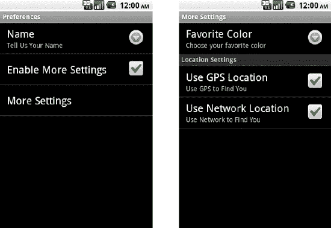
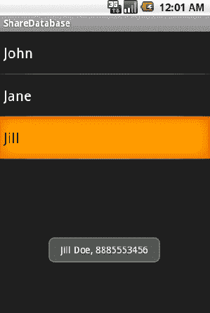
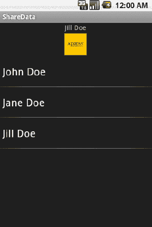
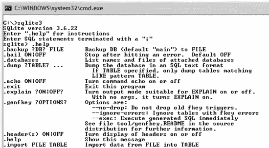
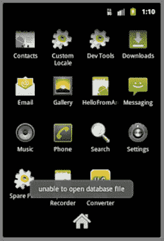
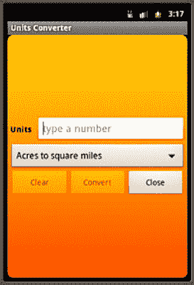

# 五、持久化数据

即使在将尽可能多的用户数据转移到云中的宏伟架构中，移动应用的短暂性也总是要求至少一些用户数据在设备上本地持久存储。这些数据可能包括来自保证离线访问的 web 服务的缓存响应，也可能包括用户为特定应用行为设置的首选项。Android 提供了一系列有用的框架来消除使用文件和数据库来保存信息的痛苦。

#### 5–1。制作首选项屏幕

##### 问题

您需要创建一种简单的方法来存储、更改和显示应用中的用户首选项和设置。

##### 解决办法

**(API 一级)**

使用`PreferenceActivity`和 XML `Preference`层次结构一次性提供用户界面、键/值组合和持久性。使用这种方法将创建一个与 Android 设备上的设置应用一致的用户界面，保持用户的体验与他们的期望一致。

在 XML 中，可以定义一个或多个屏幕的完整集合，显示相关的设置，并使用`PreferenceScreen`、`PreferenceCategory`和相关的`Preference`元素对其进行分类。然后，活动可以使用很少的代码为用户加载这个层次结构。

##### 它是如何工作的

清单 5–1 和 5–2 提供了一个 Android 应用的基本设置示例。XML 定义了两个屏幕，其中包含这个框架支持的所有常见首选项类型。请注意，一个屏幕嵌套在另一个屏幕中；当用户从根屏幕点击相关列表项时，将显示内部屏幕。

**清单 5–1。**??【RES/XML/settings . XML】

`<?xml version="1.0" encoding="utf-8"?>
<PreferenceScreen xmlns:android="http://schemas.android.com/apk/res/android">
  <EditTextPreference
    android:key="namePref"
    android:title="Name"
    android:summary="Tell Us Your Name"
    android:defaultValue="Apress"
  />
  <CheckBoxPreference
      android:key="morePref"
      android:title="Enable More Settings"
      android:defaultValue="false"
  />
  <PreferenceScreen
    android:key="moreScreen"
    android:title="More Settings"
    android:dependency="morePref">
    <ListPreference
      android:key="colorPref"
      android:title="Favorite Color"
      android:summary="Choose your favorite color"
      android:entries="@array/color_names"
      android:entryValues="@array/color_values"
      android:defaultValue="GRN"
    />
    <PreferenceCategory
      android:title="Location Settings">
      <CheckBoxPreference
        android:key="gpsPref"
        android:title="Use GPS Location"
        android:summary="Use GPS to Find You"
        android:defaultValue="true"
      />
      <CheckBoxPreference
        android:key="networkPref"
        android:title="Use Network Location"
        android:summary="Use Network to Find You"
        android:defaultValue="true"
      />
    </PreferenceCategory>
  </PreferenceScreen>
</PreferenceScreen>`

**清单 5–2。***RES/values/arrays . XML*

`<?xml version="1.0" encoding="utf-8"?>
<resources>
    <string-array name="color_names">
      <item>Black</item>
      <item>Red</item>
      <item>Green</item>
    </string-array>`
`    <string-array name="color_values">
      <item>BLK</item>
      <item>RED</item>
      <item>GRN</item>
    </string-array>
</resources>`

首先注意用于创建 XML 文件的约定。虽然这个资源可以从任何目录(比如 res/layout)展开，但是惯例是将它们放在项目的一个通用目录中，这个目录的名称简单地为“xml”

另外，请注意，我们为每个`Preference`对象提供了一个`android:key`属性，而不是`android:id`。当每个存储的值通过一个`SharedPreferences`对象在应用的其他地方被引用时，将使用键来访问它。此外，`PreferenceActivity`还包含了`findPreference()`方法，用于获取对 Java 代码中一个膨胀的`Preference`的引用，这比使用`findViewById();`更高效，而且`findPreference()`也将键作为参数。

展开后，根首选项屏幕显示一个列表，其中包含以下三个选项(按顺序排列):

1.  标题为“名称”的项目
    1.  `EditTextPreference`的实例，存储一个字符串值。
    2.  点击此项将显示一个文本框，供用户键入新的首选项值。
2.  标题为“启用更多设置”的项目，旁边有一个复选框
    1.  CheckBoxPreference 的实例，它存储一个布尔值。
    2.  点击此项将切换复选框的选中状态。
3.  标题为“更多设置”的项目
    1.  点击此项将加载另一个包含更多项目的首选项屏幕。

当用户点击“更多设置”项目时，第二个屏幕显示三个以上的项目:一个`ListPreference`项目和另外两个由`PreferenceCategory`组合在一起的`CheckBoxPreference`。`PreferenceCategory`是一种在列表中创建分节符和标题的简单方法，用于对实际的首选项进行分组。

`ListPreference`是示例中使用的最终首选项类型。这个项目需要两个数组参数(尽管它们可以被设置为同一个数组)，这两个参数代表用户可以从中选择的一组选项。`android:entries`数组是要显示的可读项目列表，而`android:entryValues`数组表示要存储的实际值。

所有偏好项也可以选择性地为它们设置默认值。但是，该值不会自动加载。当显示`PreferenceActivity`或调用`PreferenceManager.setDefaultValues()`时，它将第一次加载这个 XML 文件。

现在让我们看看`PreferenceActivity`将如何加载和管理它。参见清单 5–3。

**清单 5–3。** *偏好行动中的活动*

`public class SettingsActivity extends PreferenceActivity {

    @Override
    public void onCreate(Bundle savedInstanceState) {
        super.onCreate(savedInstanceState);
        //Load preference data from XML
        addPreferencesFromResource(R.xml.settings);
    }
}`

向用户显示首选项并允许他们进行更改所需要的只是调用`addPreferencesFromResource()`。不需要用`PreferenceActivity`来调用`setContentView()`，因为`addPreferencesFromResource()`会放大 XML 并显示它。然而，可以提供一个自定义布局，只要它包含一个设置了`android:id="@android:id/list"`属性的`ListView`，这是`PreferenceActivity`将加载首选项的地方。

出于控制访问的唯一目的，也可以将偏好项放在列表中。在本例中，我们将“启用更多设置”项放在列表中，只是为了允许用户启用或禁用对第二个`PreferenceScreen`的访问。为了实现这一点，我们的嵌套`PreferenceScreen`包含了`android:dependency`属性，该属性将其启用状态链接到另一个首选项的状态。每当引用的首选项未设置或为假时，该首选项将被禁用。

当这个活动加载时，您会看到类似于 Figure 5–1 的内容。

**图 5–1。** *首选屏幕在行动*

根`PreferenceScreen`(左)首先显示。如果用户点击“更多设置”，将显示第二个屏幕(右侧)。

###### 加载默认值和访问首选项

通常，像这样的`PreferenceActivity`不是应用的根。通常，如果设置了默认值，在用户访问设置之前，应用的其余部分可能需要访问这些值(第一种情况下将加载默认值)。因此，在应用中的其他地方调用下面的方法会很有帮助，这样可以确保在使用默认值之前将其加载。

`PreferenceManager.setDefaultValues(Context context, int resId, boolean readAgain);`

这个方法可能会被调用多次，默认值将不会被再次加载。它可以放在主活动中，以便在第一次启动时调用，或者放在一个公共位置，在访问共享首选项之前调用。

使用这种机制存储的首选项被放入默认的共享首选项对象中，可以使用任何`Context`指针访问该对象

`PreferenceManager.getDefaultSharedPreferences(Context context);`

一个示例活动将加载我们上一个示例中设置的默认值，并访问一些存储的当前值，看起来类似于清单 5–4。

**清单 5–4。** *活动加载偏好默认值*

`public class HomeActivity extends Activity {

    @Override
    public void onCreate(Bundle savedInstanceState) {
        super.onCreate(savedInstanceState);
        setContentView(R.layout.main);

        //Load the preference defaults
        PreferenceManager.setDefaultValues(this, R.xml.settings, false);
    }

    @Override
    public void onResume() {
        super.onResume();
        //Access the current settings
        SharedPreferences settings =
            PreferenceManager.getDefaultSharedPreferences(this);

         String name = settings.getString("namePref", "");
         boolean isMoreEnabled = settings.getBoolean("morePref", false);
    }
}`

调用`setDefaultValues()`将在首选项存储中为 XML 文件中包含`android:defaultValue`属性的任何项目创建一个值。这将使应用可以访问它们，即使用户尚未访问设置屏幕。

然后可以使用一组类型化的访问器函数在`SharedPreferences`对象上访问这些值。如果 preference key 的值尚不存在，这些访问器方法中的每一个都需要返回 preference key 的名称和默认值。

#### 5–2。持久化简单数据

##### 问题

您的应用需要一种简单、低开销的方法来将基本数据(如数字和字符串)存储在持久存储中。

##### 解决办法

**(API 一级)**

使用`SharedPreferences`对象，应用可以快速创建一个或多个持久存储，数据可以保存在这些存储中，供以后检索。在底层，这些对象实际上作为 XML 文件存储在应用的用户数据区。然而，与直接从文件中读写数据不同，`SharedPreferences`为持久化基本数据类型提供了一个有效的框架。

创建多个 SharedPreferences(而不是将所有数据都转储到默认对象中)可能是一个好习惯，尤其是当您存储的数据有保质期时。请记住，使用 XML 和`PreferenceActivity`框架存储的所有首选项也存储在默认位置——如果您想存储一组与登录用户相关的项目，该怎么办？当该用户注销时，您将需要删除随之而来的所有持久化数据。如果您将所有数据存储在默认首选项中，您很可能需要单独删除每个项目。但是，如果您只是为这些设置创建一个首选项对象，那么注销就像调用`SharedPreferences.clear()`一样简单。

##### 它是如何工作的

让我们看一个使用`SharedPreferences`持久化简单数据的实际例子。清单 5–5 和 5–6 为用户创建一个数据输入表单，向远程服务器发送一条简单的消息。为了帮助用户，我们将记住他们在每个字段中输入的所有数据，直到发出成功的请求。这将允许用户离开屏幕(或被短信或电话打断)，而不必再次输入他们的所有信息。

**清单 5–5。** *res/layout/form.xml*

`<?xml version="1.0" encoding="utf-8"?>
<LinearLayout xmlns:android="http://schemas.android.com/apk/res/android"
  android:orientation="vertical"
  android:layout_width="fill_parent"
  android:layout_height="fill_parent">`

`  <TextView
    android:layout_width="fill_parent"
    android:layout_height="wrap_content"
    android:text="Email:"
    android:padding="5dip"
  />
  <EditText
    android:id="@+id/email"
    android:layout_width="fill_parent"
    android:layout_height="wrap_content"
    android:singleLine="true"
  />
  <CheckBox
    android:id="@+id/age"
    android:layout_width="fill_parent"
    android:layout_height="wrap_content"
    android:text="Are You Over 18?"
  />
  <TextView  
    android:layout_width="fill_parent"
    android:layout_height="wrap_content"
    android:text="Message:"
    android:padding="5dip"
  />
  <EditText
    android:id="@+id/message"
    android:layout_width="fill_parent"
    android:layout_height="wrap_content"
    android:minLines="3"
    android:maxLines="3"
  />
  <Button
    android:id="@+id/submit"
    android:layout_width="fill_parent"
    android:layout_height="wrap_content"
    android:text="Submit"
  />
</LinearLayout>`

**清单 5–6。** *有持久性的录入表单*

`public class FormActivity extends Activity implements View.OnClickListener {

    EditText email, message;
    CheckBox age;
    Button submit;

    SharedPreferences formStore;

    boolean submitSuccess = false;

    @Override
    public void onCreate(Bundle savedInstanceState) {
        super.onCreate(savedInstanceState);
        setContentView(R.layout.form);

        email = (EditText)findViewById(R.id.email);
        message = (EditText)findViewById(R.id.message);`

`        age = (CheckBox)findViewById(R.id.age);

        submit = (Button)findViewById(R.id.submit);
        submit.setOnClickListener(this);

        //Retrieve or create the preferences object
        formStore = getPreferences(Activity.MODE_PRIVATE);
    }

    @Override
    public void onResume() {
        super.onResume();
        //Restore the form data
        email.setText(formStore.getString("email", ""));
        message.setText(formStore.getString("message", ""));
        age.setChecked(formStore.getBoolean("age", false));
    }

    @Override
    public void onPause() {
        super.onPause();
        if(submitSuccess) {
            //Editor calls can be chained together
            formStore.edit().clear().commit();
        } else {
            //Store the form data
            SharedPreferences.Editor editor = formStore.edit();
            editor.putString("email", email.getText().toString());
            editor.putString("message", message.getText().toString());
            editor.putBoolean("age", age.isChecked());
            editor.commit();
        }
    }

    @Override
    public void onClick(View v) {

        //DO SOME WORK SUBMITTING A MESSAGE

        //Mark the operation successful
        submitSuccess = true;
        //Close
        finish();
    }
}`

我们从一个典型的用户表单开始，两个简单的`EditText`输入字段和一个`CheckBox`。当创建活动时，我们使用`Activity.getPreferences()`收集一个`SharedPreferences`对象，这是所有持久化数据将被存储的地方。如果在任何时候活动由于除成功提交之外的原因(由布尔成员控制)而暂停，表单的当前状态将被快速加载到首选项中并持久化。

**注意:**当使用`Editor`将数据保存到`SharedPreferences`中时，务必记住在更改完成后调用`commit()`或`apply()`。否则，您的更改将不会被保存。

相反，每当活动变得可见时，`onResume()`用存储在 preferences 对象中的最新信息加载用户界面。如果不存在首选项，因为它们已被清除或从未创建(第一次启动)，则表单被设置为空白。

当用户按下 Submit 并且假表单成功提交时，随后对`onPause()`的调用将清除 preferences 中任何存储的表单数据。因为所有这些操作都是在私有首选项对象上完成的，所以清除数据不会影响可能已使用其他方式存储的任何用户设置。

**注意:`Editor`调用的**方法总是返回同一个`Editor`对象，允许它们在某些地方链接在一起，这样做可以让你的代码更具可读性。

###### 共享共享的首选项

前面的例子说明了在单个活动的上下文中使用单个`SharedPreferences`对象，该活动具有从`Activity.getPreferences()`获得的对象。说实话，这个方法实际上只是一个方便的`Context.getSharedPreferences()`包装器，它将活动名作为首选商店名传递。如果您存储的数据最好在两个或多个 Activity 实例之间共享，那么调用`getSharedPreferences()`并传递一个更通用的名称可能更有意义，这样就可以很容易地从代码中的不同位置访问它。参见清单 5–7。

**清单 5–7。** *使用相同偏好的两个活动*

`public class ActivityOne extends Activity {
    public static final String PREF_NAME = "myPreferences";
    private SharedPreferences mPreferences;

    @Override
    public void onCreate(Bundle savedInstanceState) {
        super.onCreate(savedInstanceState);
        mPreferences = getSharedPreferences(PREF_NAME, Activity.MODE_PRIVATE);
    }
}

public class ActivityTwo extends Activity {

    private SharedPreferences mPreferences;

    @Override
    public void onCreate(Bundle savedInstanceState) {
        super.onCreate(savedInstanceState);
        mPreferences = getSharedPreferences(ActivityOne.PREF_NAME,
            Activity.MODE_PRIVATE);
    }

}`

在这个例子中，两个活动类使用相同的名称(定义为常量字符串)检索`SharedPreferences`对象，因此它们将访问相同的偏好数据集。此外，两个引用甚至指向首选项的同一个*实例*，因为框架为每组`SharedPreferences`(一组由其名称定义)创建了一个单例对象。这意味着在一方所做的更改会立即反映到另一方。

**A Note About Mode**

`Context.getSharedPreferences()`也需要一个模式参数。传递 0 或`MODE_PRIVATE`提供了默认行为，只允许创建首选项的应用(或另一个具有相同用户 ID 的应用)获得读写访问权。此方法支持两个以上的模式参数；`MODE_WORLD_READABLE`和`MODE_WORLD_WRITEABLE`。这些模式允许其他应用通过对其创建的文件设置适当的用户权限来访问这些首选项。但是，外部应用仍然需要一个有效的上下文，指向创建首选项文件的包。

例如，假设您用包`com.examples.myfirstapplication`在应用中创建了`SharedPreferences with world readable permission`。为了从第二个应用访问这些首选项，第二个应用将使用以下代码获取它们:

`Context otherContext = createPackageContext("com.examples.myfirstapplication", 0);
SharedPreferences externalPreferences = otherContext.getSharedPreferences(PREF_NAME, 0);`

**注意:**如果您选择使用 mode 参数来允许外部访问，请确保您在调用`getSharedPreferences()`时提供的模式是一致的。该模式仅在第一次创建首选项文件时使用，因此在不同时间使用不同的模式参数调用`SharedPreferences`只会导致混淆。

#### 5–3 岁。读写文件

##### 问题

您的应用需要从外部文件读入数据，或者写出更复杂的数据以实现持久性。

##### 解决办法

**(API 一级)**

有时，使用文件系统是无可替代的。Android 支持所有用于创建、读取、更新和删除(CRUD)操作的标准 Java 文件 I/O，以及一些额外的助手，使访问特定位置的文件更加方便。应用可以在三个主要位置处理文件:

*   内存储器
    *   受保护的目录空间来读写文件数据。
*   外部存储器
    *   用于读写文件数据的外部可安装空间。
    *   需要 API 级别 4+中的`WRITE_EXTERNAL_STORAGE`权限。
    *   通常，这是设备中的物理 SD 卡。
*   素材
    *   APK 包中受保护的只读空间。
    *   对不能/不应该编译的本地资源有好处。

虽然处理文件数据的底层机制保持不变，但我们将研究使处理每个目的地略有不同的细节。

##### 它是如何工作的

如前所述，传统的 Java `FileInputStream`和`FileOutputStream`类构成了访问文件数据的主要方法。事实上，您可以随时使用绝对路径位置创建一个`File`实例，并开始传输数据。然而，由于不同设备上的根路径不同，并且某些目录受到应用的保护，我们推荐一些稍微更有效的方法来处理文件。

###### 内部存储

为了创建或修改文件在内存中的位置，请使用`Context.openFileInput()`和`Context.openFileOutput()`方法。这些方法只需要文件名作为参数，而不是整个路径，并且将引用与应用的受保护目录空间相关的文件，而不考虑特定设备上的确切路径。参见清单 5–8。

**清单 5–8。** *在内存上 CRUD 一个文件*

`public class InternalActivity extends Activity {

    private static final String FILENAME = "data.txt";

    @Override
    public void onCreate(Bundle savedInstanceState) {
        super.onCreate(savedInstanceState);
        TextView tv = new TextView(this);
        setContentView(tv);

        //Create a new file and write some data`

`        try {
            FileOutputStream mOutput = openFileOutput(FILENAME, Activity.MODE_PRIVATE);
            String data = "THIS DATA WRITTEN TO A FILE";
            mOutput.write(data.getBytes());
            mOutput.close();
        } catch (FileNotFoundException e) {
            e.printStackTrace();
        } catch (IOException e) {
            e.printStackTrace();
        }

        //Read the created file and display to the screen
        try {
            FileInputStream mInput = openFileInput(FILENAME);
            byte[] data = newbyte[128];
            mInput.read(data);
            mInput.close();

            String display = new String(data);
            tv.setText(display.trim());
        } catch (FileNotFoundException e) {
            e.printStackTrace();
        } catch (IOException e) {
            e.printStackTrace();
        }

        //Delete the created file
        deleteFile(FILENAME);    
    }
}`

这个例子使用`Context.openFileOutput()`将一些简单的字符串数据写到一个文件中。使用此方法时，如果文件不存在，将会创建该文件。它有两个参数，一个文件名和一个操作模式。在这种情况下，我们通过将模式定义为`MODE_PRIVATE`来使用默认操作。这种模式会用每个新的写操作覆盖文件；如果你喜欢每次写在现有文件的末尾，使用`MODE_APPEND`。

写操作完成后，该示例使用`Context.openFileInput()`打开 InputStream 并读取文件数据，它只需要再次将文件名作为参数。数据被读入一个字节数组，并通过 TextView 显示给用户界面。完成操作后，`Context.deleteFile()`用于从存储器中删除文件。

**注意:**数据以字节的形式写入文件流，因此更高级别的数据(甚至字符串)必须转换成这种格式或从这种格式转换出来。

这个例子没有留下文件的痕迹，但是我们鼓励你尝试同样的例子，不要在最后运行`deleteFile()`来保存文件。将 DDMS 与仿真器或解锁的设备一起使用，您可以查看文件系统，并可以在相应的应用数据文件夹中找到该应用创建的文件。

因为这些方法是`Context`的一部分，并不绑定到 Activity，所以这种类型的文件访问可以发生在应用中你需要的任何地方，比如一个`BroadcastReceiver`或者甚至一个定制类。许多系统构造要么是`Context`的子类，要么在它们的回调中传递对它的引用。这允许在任何地方进行相同的打开/关闭/删除操作。

###### 外部存储

内部存储和外部存储的主要区别在于外部存储是可装载的。这意味着用户可以将他们的设备连接到计算机，并可以选择将外部存储作为可移动磁盘安装在 PC 上。通常，存储本身是物理可移动的(如 SD 卡)，但这不是平台的要求。

**重要提示:**写入设备的外部存储将需要您向应用清单添加一个`android.permission.WRITE_EXTERNAL_STORAGE`声明。

在外部安装或物理移除设备的外部存储器期间，应用无法访问该存储器。因此，通过检查`Environment.getExternalStorageState()`来检查外部存储器是否准备好总是谨慎的。

让我们修改文件示例，对设备的外部存储进行同样的操作。参见清单 5–9。

**清单 5–9。** *在外部存储器上创建一个文件*

`public class ExternalActivity extends Activity {

    private static final String FILENAME = "data.txt";

    @Override
    public void onCreate(Bundle savedInstanceState) {
        super.onCreate(savedInstanceState);
        TextView tv = new TextView(this);
        setContentView(tv);

        //Create the file reference
        File dataFile = new File(Environment.getExternalStorageDirectory(), FILENAME);

        //Check if external storage is usable
        if(!Environment.getExternalStorageState().equals(Environment.MEDIA_MOUNTED)) {
            Toast.makeText(this, "Cannot use storage.", Toast.LENGTH_SHORT).show();
            finish();
            return;
        }

        //Create a new file and write some data
        try {
            FileOutputStream mOutput = new FileOutputStream(dataFile, false);
            String data = "THIS DATA WRITTEN TO A FILE";
            mOutput.write(data.getBytes());`
`            mOutput.close();
        } catch (FileNotFoundException e) {
            e.printStackTrace();
        } catch (IOException e) {
            e.printStackTrace();
        }

        //Read the created file and display to the screen
        try {
            FileInputStream mInput = new FileInputStream(dataFile);
            byte[] data = newbyte[128];
            mInput.read(data);
            mInput.close();

            String display = new String(data);
            tv.setText(display.trim());
        } catch (FileNotFoundException e) {
            e.printStackTrace();
        } catch (IOException e) {
            e.printStackTrace();
        }

        //Delete the created file
        dataFile.delete();
    }
}`

对于外部存储，我们利用了更多的传统 Java 文件 I/O。使用外部存储的关键是调用`Environment.getExternalStorageDirectory()`来检索设备外部存储位置的根路径。

在进行任何操作之前，首先用`Environment.getExternalStorageState()`检查设备外部存储器的状态。如果返回值是除了`Environment.MEDIA_MOUNTED`之外的任何值，我们将不会继续，因为存储不能被写入，所以活动被关闭。否则，可以创建新文件并开始操作。

输入和输出流现在必须使用默认的 Java 构造函数，而不是使用`Context`方便的方法。输出流的默认行为是覆盖当前文件，如果当前文件不存在，则创建它。如果您的应用每次写入都必须追加到现有文件的末尾，请将`FileOutputStream`构造函数中的布尔参数更改为 true。

通常，在外部存储器上为应用文件创建一个特殊的目录是有意义的。我们可以简单地使用更多的 Java 文件 API 来实现这一点。参见清单 5–10。

**清单 5–10。** *在新目录下 CRUD 一个文件*

`public class ExternalActivity extends Activity {

    private static final String FILENAME = "data.txt";
    private static final String DNAME = "myfiles";

    @Override
    public void onCreate(Bundle savedInstanceState) {`
`       super.onCreate(savedInstanceState);
        TextView tv = new TextView(this);
        setContentView(tv);

        //Create a new directory on external storage
        File rootPath = new File(Environment.getExternalStorageDirectory(), DNAME);
        if(!rootPath.exists()) {
            rootPath.mkdirs();
        }
        //Create the file reference
        File dataFile = new File(rootPath, FILENAME);

        //Create a new file and write some data
        try {
            FileOutputStream mOutput = new FileOutputStream(dataFile, false);
            String data = "THIS DATA WRITTEN TO A FILE";
            mOutput.write(data.getBytes());
            mOutput.close();
        } catch (FileNotFoundException e) {
            e.printStackTrace();
        } catch (IOException e) {
            e.printStackTrace();
        }

        //Read the created file and display to the screen
        try {
            FileInputStream mInput = new FileInputStream(dataFile);
            byte[] data = newbyte[128];
            mInput.read(data);
            mInput.close();

            String display = new String(data);
            tv.setText(display.trim());
        } catch (FileNotFoundException e) {
            e.printStackTrace();
        } catch (IOException e) {
            e.printStackTrace();
        }

        //Delete the created file
        dataFile.delete();
    }
}`

在本例中，我们在外部存储目录中创建新的目录路径，并将该新位置用作数据文件的根位置。一旦使用新的目录位置创建了文件引用，示例的其余部分是相同的。

#### 5–4 岁。将文件用作资源

##### 问题

您的应用必须利用 Android 无法编译成资源 id 的格式的资源文件。

##### 解决方案

**(API 一级)**

使用 Assets 目录存放应用需要读取的文件，例如本地 HTML、CSV 或专有数据。素材目录是 Android 应用中文件的受保护资源位置。放置在此目录中的文件将与最终的 APK 捆绑在一起，但不会被处理或编译。像所有其他应用资源一样，素材中的文件是只读的。

##### 它是如何工作的

我们在本书中已经看到了一些具体的例子，可以使用素材将内容直接加载到小部件中，比如`WebView`和`MediaPlayer`。然而，在大多数情况下，最好使用传统的`InputStream`来访问素材。清单 5–11 和 5–12 提供了一个从素材中读取私有逗号分隔值(CSV)文件并显示在屏幕上的示例。

**清单 5–11。** *素材/数据. csv*

`John,38,Red
Sally,42,Blue
Rudy,31,Yellow`

**清单 5–12。** *从素材文件中读取*

`public class AssetActivity extends Activity {

    @Override
    public void onCreate(Bundle savedInstanceState) {
        super.onCreate(savedInstanceState);
        TextView tv = new TextView(this);
        setContentView(tv);

        try {
            //Access application assets
            AssetManager manager = getAssets();
            //Open our data file
            InputStream mInput = manager.open("data.csv");
            //Read data in
            byte[] data = newbyte[128];
            mInput.read(data);
            mInput.close();

            //Parse the CSV data and display
            String raw = new String(data);
            ArrayList<Person> cooked = parse(raw.trim());
            StringBuilder builder = new StringBuilder();
            for(Person piece : cooked) {
              builder.append(String.format("%s is %s years old, and likes the color %s",
                        piece.name, piece.age, piece.color));
              builder.append('\n');
            }
            tv.setText(builder.toString());`

`        } catch (FileNotFoundException e) {
            e.printStackTrace();
        } catch (IOException e) {
            e.printStackTrace();
        }

    }

    /* Simple CSV Parser */
    private static finalintCOL_NAME = 0;
    private static finalintCOL_AGE = 1;
    private static finalintCOL_COLOR = 2;

    private ArrayList<Person> parse(String raw) {
        ArrayList<Person> results = new ArrayList<Person>();
        Person current = null;

        StringTokenizer st = new StringTokenizer(raw,",\n");
        int state = COL_NAME;
        while(st.hasMoreTokens()) {
            switch(state) {
            case COL_NAME:
                current = new Person();
                current.name = st.nextToken();
                state = COL_AGE;
                break;
            case COL_AGE:
                current.age = st.nextToken();
                state = COL_COLOR;
                break;
            case COL_COLOR:
                current.color = st.nextToken();
                results.add(current);
                state = COL_NAME;
                break;
            }
        }

        return results;
    }

    privateclass Person {
        public String name;
        public String age;
        public String color;

        public Person() { }
    }
}`

访问 Assets 中的文件的关键在于使用`AssetManager`，这将允许应用打开当前驻留在 Assets 目录中的任何资源。将我们感兴趣的文件名传递给`AssetManager.open()`会返回一个 InputStream 供我们读取文件数据。将流读入内存后，该示例将原始数据传递给解析例程，并在用户界面上显示结果。

###### 解析 CSV

这个例子还展示了一个简单的方法，从一个 CSV 文件中获取数据，并将其解析成一个模型对象(在本例中称为`Person`)。这里使用的方法将整个文件读入一个字节数组，作为单个字符串进行处理。当要读取的数据量非常大时，这种方法不是最有效的内存方法，但是对于像这样的小文件，这种方法就可以了。

原始字符串被传递到 StringTokenizer 实例中，同时传递的还有用作标记断点的必需字符:逗号和换行符。此时，可以按顺序处理文件的每个单独的块。使用基本的状态机方法，来自每一行的数据被插入到新的`Person`实例中，并被加载到结果列表中。

#### 5–5 岁。管理数据库

##### 问题

您的应用需要持久化数据，这些数据可以作为子集或单个记录进行查询或修改。

##### 解决办法

**(API 一级)**

在一个`SQLiteOpenHelper`的帮助下创建一个`SQLiteDatabase`来管理您的数据存储。SQLite 是一种快速、轻量级的数据库技术，它利用 SQL 语法来构建查询和管理数据。对 SQLite 的支持内置于 Android SDK 中，这使得在应用中设置和使用 SQLite 变得非常容易。

##### 它是如何工作的

定制`SQLiteOpenHelper`允许您管理数据库模式本身的创建和修改。它也是一个很好的地方，可以在创建数据库时将您可能需要的任何初始值或默认值插入到数据库中。清单 5–13 是一个定制助手的例子，它创建一个数据库，用一个表来存储关于人的基本信息。

**清单 5–13。** *自定义 SQLiteOpenHelper*

`public class MyDbHelper extends SQLiteOpenHelper {

    private static final String DB_NAME = "mydb";
    private static final int DB_VERSION = 1;

    public static final String TABLE_NAME = "people";
    public static final String COL_NAME = "pName";
    public static final String COL_DATE = "pDate";
    private static final String STRING_CREATE =`

`        "CREATE TABLE "+TABLE_NAME+" (_id INTEGER PRIMARY KEY AUTOINCREMENT, "
        +COL_NAME+" TEXT, "+COL_DATE+" DATE);";

    public MyDbHelper(Context context) {
        super(context, DB_NAME, null, DB_VERSION);
    }

    @Override
    public void onCreate(SQLiteDatabase db) {
        //Create the database table
        db.execSQL(STRING_CREATE);

        //You may also load initial values into the database here
        ContentValues cv = new ContentValues(2);
        cv.put(COL_NAME, "John Doe");
        //Create a formatter for SQL date format
        SimpleDateFormat dateFormat = new SimpleDateFormat("yyyy-MM-dd HH:mm:ss");
        cv.put(COL_DATE, dateFormat.format(new Date())); //Insert 'now' as the date
        db.insert(TABLE_NAME, null, cv);
    }

    @Override
    public void onUpgrade(SQLiteDatabase db, int oldVersion, int newVersion) {
        //For now, clear the database and re-create
        db.execSQL("DROP TABLE IF EXISTS "+TABLE_NAME);
        onCreate(db);
    }
}`

数据库需要的关键信息是名称和版本号。创建和升级 SQLiteDatabase 确实需要一点 SQL 知识，所以如果您不熟悉一些语法，我们建议您浏览一下 SQL 参考资料。助手将在任何时候访问这个特定的数据库时调用`onCreate()`，使用`SQLiteOpenHelper.getReadableDatabase()`或`SQLiteOpenHelper.getWritableDatabase()`，如果它还不存在的话。

该示例将表名和列名抽象为常量以供外部使用(这是一个很好的习惯)。下面是实际的 SQL 创建字符串，它在`onCreate()`中用来创建我们的表:

`CREATE TABLE people (_id INTEGER PRIMARY KEY AUTOINCREMENT, pName TEXT, pAge INTEGER, pDate DATE);`

在 Android 中使用 SQLite 时，数据库必须进行少量的格式化，以便与框架一起正常工作。它的大部分是为您创建的，但是您创建的表必须有一部分是用于`_id`的列。该字符串的其余部分为表中的每条记录再创建两列:

*   人员姓名的文本字段
*   输入此记录的日期的日期字段

使用`ContentValues`对象将数据插入数据库。该示例说明了如何在创建数据库时使用`ContentValues`向数据库中插入一些默认数据。`SQLiteDatabase.insert()`采用表名、空列 hack 和表示要插入的记录的`ContentValues`作为参数。

这里没有使用空列黑客，但是它有一个可能对您的应用至关重要的目的。SQL 不能将一个完全为空的值插入到数据库中，尝试这样做将会导致错误。如果您的实现有可能将一个空的`ContentValues`传递给`insert()`，则使用空列 hack 来插入一个记录，其中引用列的值为空。

###### 关于升级的说明

`SQLiteOpenHelper`也很好地帮助您在应用的未来版本中迁移数据库模式。每当数据库被访问，但是磁盘上的版本与当前版本不匹配(意味着构造函数中传递的版本)，就会调用`onUpgrade()`。

在我们的例子中，我们采用了懒人的方式，简单地删除现有的数据库并重新创建它。实际上，如果数据库包含用户输入的数据，这可能不是合适的方法；他们可能不会太高兴看到它消失。所以让我们暂时离题，看一个可能更有用的`onUpgrade()`的例子。例如，在应用的整个生命周期中使用以下三个数据库:

*   版本 1:应用的首次发布
*   版本 2:应用升级，包括电话号码字段
*   版本 3:应用升级，包括插入的日期条目

我们可以利用`onUpgrade()`来改变现有的数据库，而不是删除当前所有的信息。参见清单 5–14。

**清单 5–14。***on upgrade()*的样本

`@Override
public void onUpgrade(SQLiteDatabase db, int oldVersion, int newVersion) {
    //Upgrade from v1\. Adding phone number
    if(oldVersion<= 1) {
        db.execSQL("ALTER TABLE "+TABLE_NAME+" ADD COLUMN phone_number INTEGER;");
    }
    //Upgrade from v2\. Add entry date
    if(oldVersion <= 2) {
        db.execSQL("ALTER TABLE "+TABLE_NAME+" ADD COLUMN entry_date DATE;");
    }
}`

在这个例子中，如果用户的现有数据库版本是 1，那么这两个语句都将被调用来向数据库添加列。如果他们已经有了版本 2，那么只需要调用后面的语句来添加条目日期列。在这两种情况下，应用数据库中的任何现有数据都将被保留。

###### 使用数据库

回到我们最初的示例，让我们看看一个活动如何利用我们创建的数据库。参见清单 5–15 和清单 5–16。

**清单 5–15。** *res/layout/main.xml*

`<?xml version="1.0" encoding="utf-8"?>
<LinearLayout xmlns:android="http://schemas.android.com/apk/res/android"
  android:orientation="vertical"
  android:layout_width="fill_parent"
  android:layout_height="fill_parent">
  <EditText
    android:id="@+id/name"
    android:layout_width="fill_parent"
    android:layout_height="wrap_content"
  />
  <Button
    android:id="@+id/add"
    android:layout_width="fill_parent"
    android:layout_height="wrap_content"
    android:text="Add New Person"
  />
  <ListView
    android:id="@+id/list"
    android:layout_width="fill_parent"
    android:layout_height="fill_parent"
  />
</LinearLayout>`

**清单 5–16。** *查看和管理活动数据库*

`public class DbActivity extends Activity implements View.OnClickListener,
        AdapterView.OnItemClickListener {

    EditText mText;
    Button mAdd;
    ListView mList;

    MyDbHelper mHelper;
    SQLiteDatabase mDb;
    Cursor mCursor;
    SimpleCursorAdapter mAdapter;

    @Override
    public void onCreate(Bundle savedInstanceState) {
        super.onCreate(savedInstanceState);
        setContentView(R.layout.main);

        mText = (EditText)findViewById(R.id.name);
        mAdd = (Button)findViewById(R.id.add);
        mAdd.setOnClickListener(this);
        mList = (ListView)findViewById(R.id.list);
        mList.setOnItemClickListener(this);

        mHelper = new MyDbHelper(this);
    }

    @Override
    public void onResume() {
        super.onResume();
        //Open connections to the database
        mDb = mHelper.getWritableDatabase();`
`        String[] columns = new String[] {"_id", MyDbHelper.COL_NAME, MyDbHelper.COL_DATE};
        mCursor = mDb.query(MyDbHelper.TABLE_NAME, columns, null, null, null, null, null);
        //Refresh the list
        String[] headers = new String[] {MyDbHelper.COL_NAME, MyDbHelper.COL_DATE};
        mAdapter = new SimpleCursorAdapter(this, android.R.layout.two_line_list_item,
                mCursor, headers, newint[]{android.R.id.text1, android.R.id.text2});
        mList.setAdapter(mAdapter);
    }

    @Override
    public void onPause() {
        super.onPause();
        //Close all connections
        mDb.close();
        mCursor.close();
    }

    @Override
    public void onClick(View v) {
        //Add a new value to the database
        ContentValues cv = new ContentValues(2);
        cv.put(MyDbHelper.COL_NAME, mText.getText().toString());
        //Create a formatter for SQL date format
        SimpleDateFormat dateFormat = new SimpleDateFormat("yyyy-MM-dd HH:mm:ss");
        cv.put(MyDbHelper.COL_DATE, dateFormat.format(new Date())); //Insert 'now' as the date
        mDb.insert(MyDbHelper.TABLE_NAME, null, cv);
        //Refresh the list
        mCursor.requery();
        mAdapter.notifyDataSetChanged();
        //Clear the edit field
        mText.setText(null);
    }

    @Override
    public void onItemClick(AdapterView<?> parent, View v, int position, long id) {
        //Delete the item from the database
        mCursor.moveToPosition(position);
         //Get the id value of this row
        String rowId = mCursor.getString(0); //Column 0 of the cursor is the id
        mDb.delete(MyDbHelper.TABLE_NAME, "_id = ?", new String[]{rowId});
        //Refresh the list
        mCursor.requery();
        mAdapter.notifyDataSetChanged();
    }
}`

在这个例子中，我们利用我们的客户`SQLiteOpenHelper`来访问数据库实例，并将数据库中的每条记录作为列表显示给用户界面。来自数据库的信息如果以`Cursor`的形式返回，这是一个设计用来读取、写入和遍历查询结果的接口。

当活动变得可见时，进行数据库查询以返回“people”表中的所有记录。必须将列名数组传递给查询，以告诉数据库要返回哪些值。`query()`的其余参数旨在缩小选择数据集，我们将在下一个秘籍中对此进行进一步研究。当不再需要数据库和游标连接时，关闭它们是很重要的。在本例中，我们在`onPause()`中这样做，此时活动不再处于前台。

`SimpleCursorAdapter`用于将数据库中的数据映射到标准的 Android 两行列表项目视图中。string 和 int 数组参数构成映射；string 数组中每一项的数据都将插入到视图中，并在 int 数组中显示相应的 id 值。注意，这里传递的列名列表与传递给查询的数组略有不同。这是因为我们将需要知道其他操作的记录 id，但是在将数据映射到用户界面时这是不必要的。

用户可以在文本字段中输入姓名，然后按“添加新人”按钮来创建新的内容值并将其插入到数据库中。此时，为了让 UI 显示更改，我们调用了`Cursor.requery()`和`ListAdapter.notifyDataSetChanged()`。

相反，点击列表中的项目将从数据库中删除该指定项目。为了实现这一点，我们必须构造一个简单的 SQL 语句，告诉数据库只删除 _id 值与该选择匹配的记录。此时，光标和列表适配器再次被刷新。

通过将光标移动到所选位置并调用`getString(0)`来获得列索引零的值，从而获得选择的 _id 值。此请求返回 _id，因为在列列表中传递给查询的第一个参数(索引 0)是“_id”delete 语句由两个参数组成:语句字符串和参数。对于字符串中出现的每个问号，将在语句中插入传递的数组中的一个参数。

#### 5 至 6 岁。查询数据库

##### 问题

您的应用使用 SQLiteDatabase，您需要返回其中包含的数据的特定子集。

##### 解决办法

**(API 一级)**

使用完全结构化的 SQL 查询，为特定数据创建过滤器并从数据库返回这些子集非常简单。有几种重载形式的`SQLiteDatabase.query()`可以从数据库中收集信息。我们将在这里检查其中最冗长的。

`public Cursor query(String table, String[] columns, String selection, String[] selectionArgs, String groupBy, String having, String orderBy, String limit)`

前两个参数简单地定义了查询数据的表，以及我们想要访问的每条记录的列。剩下的参数定义了我们将如何缩小结果的范围。

*   选择
    *   给定查询的 SQL WHERE 子句。
*   选择 Args
    *   如果选择了问号，则这些项目会填充这些字段。
*   群组依据
    *   给定查询的 SQL GROUP BY 子句。
*   拥有
    *   给定查询的 SQL ORDER BY 子句。
*   排序依据
    *   给定查询的 SQL ORDER BY 子句。
*   限制
    *   查询返回的最大结果数。

如您所见，所有这些参数都旨在为数据库查询提供 SQL 的全部功能。

##### 它是如何工作的

让我们来看一些示例查询，可以构造这些查询来完成一些常见的实用查询。

*   返回值与给定参数匹配的所有行。

`String[] COLUMNS = new String[] {COL_NAME, COL_DATE};
String selection = COL_NAME+" = ?";
String[] args = new String[] {"NAME_TO_MATCH"};
Cursor result = db.query(TABLE_NAME, COLUMNS, selection, args, null, null, null, null);`

这个查询相当简单。selection 语句只是告诉数据库将 name 列中的任何数据与所提供的参数相匹配(该参数是在“？”位置插入的)在选择字符串中)。

*   返回插入数据库的最后 10 行。

`String orderBy = "_id DESC";
String limit = "10";
Cursor result = db.query(TABLE_NAME, COLUMNS, null, null, null, null, orderBy, limit);`

这个查询没有特殊的选择标准，而是告诉数据库按照自动递增的 id 值对结果进行排序，最新的(最高的 id)记录排在第一位。limit 子句将返回结果的最大数量设置为 10。

*   返回日期字段在指定范围内的行(在本例中为 2000 年)。

`String[] COLUMNS = new String[] {COL_NAME, COL_DATE};
String selection = "datetime("+COL_DATE+") > datetime(?)"+
        " AND datetime("+COL_DATE+") < datetime(?)";
String[] args = new String[] {"2000-1-1 00:00:00","2000-12-31 23:59:59"};
Cursor result = db.query(TABLE_NAME, COLUMNS, selection, args, null, null, null, null);`

SQLite 没有为日期保留特定的数据类型，尽管它们允许在创建表时使用 DATE 作为声明类型。但是，标准的 SQL 日期和时间函数可用于创建文本、整数或实数形式的数据表示。这里，我们比较数据库中的值和该范围的开始和结束日期的格式化字符串的返回值。

*   返回整数字段在指定范围内(在本例中为 7 到 10)的行。

`String[] COLUMNS = new String[] {COL_NAME, COL_AGE};
String selection = COL_AGE+"> ? AND "+COL_AGE+"< ?";
String[] args = new String[] {"7","10"};
Cursor result = db.query(TABLE_NAME, COLUMNS, selection, args, null, null, null, null);`

这与上一个示例类似，但没有那么冗长。这里，我们只需创建选择语句来返回大于下限但小于上限的值。这两个限制都是作为要插入的参数提供的，因此它们可以在应用中动态设置。

#### 5 至 7 岁。备份数据

##### 问题

您的应用将数据保存在设备上，当用户更换设备或被迫重新安装应用时，您需要为用户提供一种备份和恢复这些数据的方法。

##### 解决办法

**(API 一级)**

使用设备的外部存储作为安全位置来复制数据库和其他文件。外部存储通常是物理可移动的，允许用户将其放在另一个设备中并进行恢复。即使在不可能的情况下，当用户将其设备连接到计算机时，也可以安装外部存储器，从而进行数据传输。

##### 工作原理

清单 5–17 展示了`AsyncTask`的一个实现，它在设备的外部存储器和它在应用数据目录中的位置之间来回复制数据库文件。它还为要实现的活动定义了一个接口，以便在操作完成时得到通知。

**清单 5–17。** *异步请求备份和恢复*

`public class BackupTask extends AsyncTask<String,Void,Integer> {

    public interface CompletionListener {
        void onBackupComplete();
        void onRestoreComplete();
        void onError(int errorCode);
    }

    public static final int BACKUP_SUCCESS = 1;
    public static final int RESTORE_SUCCESS = 2;
    public static final int BACKUP_ERROR = 3;
    public static final int RESTORE_NOFILEERROR = 4;

    public static final String COMMAND_BACKUP = "backupDatabase";
    public static final String COMMAND_RESTORE = "restoreDatabase";

    private Context mContext;
    private CompletionListener listener;

    public BackupTask(Context context) {
        super();
        mContext = context;
    }

    public void setCompletionListener(CompletionListener aListener) {
        listener = aListener;
    }

    @Override
    protected Integer doInBackground(String... params) {

        //Get a reference to the database
        File dbFile = mContext.getDatabasePath("mydb");
        //Get a reference to the directory location for the backup
        File exportDir = new File(Environment.getExternalStorageDirectory(), "myAppBackups");
        if (!exportDir.exists()) {
            exportDir.mkdirs();
        }
        File backup = new File(exportDir, dbFile.getName());

        //Check the required operation
        String command = params[0];
        if(command.equals(COMMAND_BACKUP)) {
            //Attempt file copy
            try {
                backup.createNewFile();
                fileCopy(dbFile, backup);`
`                returnBACKUP_SUCCESS;
            } catch (IOException e) {
                returnBACKUP_ERROR;
            }
        } elseif(command.equals(COMMAND_RESTORE)) {
            //Attempt file copy
            try {
                if(!backup.exists()) {
                    returnRESTORE_NOFILEERROR;
                }
                dbFile.createNewFile();
                fileCopy(backup, dbFile);
                return RESTORE_SUCCESS;
            } catch (IOException e) {
                return BACKUP_ERROR;
            }
        } else {
            return BACKUP_ERROR;
        }
    }

    @Override
    protected void onPostExecute(Integer result) {

        switch(result) {
        case BACKUP_SUCCESS:
            if(listener != null) {
                listener.onBackupComplete();
            }
            break;
        case RESTORE_SUCCESS:
            if(listener != null) {
                listener.onRestoreComplete();
            }
            break;
        case RESTORE_NOFILEERROR:
            if(listener != null) {
                listener.onError(RESTORE_NOFILEERROR);
            }
            break;
        default:
            if(listener != null) {
                listener.onError(BACKUP_ERROR);
            }
        }
    }

    private void fileCopy(File source, File dest) throws IOException {
        FileChannel inChannel = new FileInputStream(source).getChannel();
        FileChannel outChannel = new FileOutputStream(dest).getChannel();
        try {
            inChannel.transferTo(0, inChannel.size(), outChannel);
        } finally {
            if (inChannel != null)
                inChannel.close();
            if (outChannel != null)
                outChannel.close();`
`        }
    }
}`

如您所见，当`COMMAND_BACKUP`被传递给`execute()`时，BackupTask 将命名数据库的当前版本复制到外部存储中的特定目录，当`COMMAND_RESTORE`被传递时，将文件复制回来。

一旦执行，任务使用`Context.getDatabasePath()`来检索我们需要备份的数据库文件的引用。这一行可以很容易地替换为对`Context.getFilesDir()`的调用，访问系统内部存储器上的文件进行备份。还获得了对我们在外部存储器上创建的备份目录的引用。

使用传统的 Java 文件 I/O 复制文件，如果一切成功，注册的监听器会得到通知。在此过程中，任何抛出的异常都会被捕获，并向侦听器返回一个错误。现在让我们来看一个利用该任务备份数据库的活动——参见清单 5–18。

**清单 5–18。** *活动使用备份任务*

`public class BackupActivity extends Activity implements BackupTask.CompletionListener {

    @Override
    public void onCreate(Bundle savedInstanceState) {
        super.onCreate(savedInstanceState);
        setContentView(R.layout.main);
        //Dummy example database
        SQLiteDatabase db = openOrCreateDatabase("mydb", Activity.MODE_PRIVATE, null);
        db.close();
    }

    @Override
    public void onResume() {
        super.onResume();
        if( Environment.getExternalStorageState().equals(Environment.MEDIA_MOUNTED) ) {
            BackupTask task = new BackupTask(this);
            task.setCompletionListener(this);
            task.execute(BackupTask.COMMAND_RESTORE);
        }
    }

    @Override
    public void onPause() {
        super.onPause();
        if( Environment.getExternalStorageState().equals(Environment.MEDIA_MOUNTED) ) {
            BackupTask task = new BackupTask(this);
            task.execute(BackupTask.COMMAND_BACKUP);
        }
    }

    @Override
    public void onBackupComplete() {
        Toast.makeText(this, "Backup Successful", Toast.LENGTH_SHORT).show();
    }`

`    @Override
    public void onError(int errorCode) {
        if(errorCode == BackupTask.RESTORE_NOFILEERROR) {
            Toast.makeText(this, "No Backup Found to Restore",
                Toast.LENGTH_SHORT).show();
        } else {
            Toast.makeText(this, "Error During Operation: "+errorCode,
                Toast.LENGTH_SHORT).show();
        }
    }

    @Override
    public void onRestoreComplete() {
        Toast.makeText(this, "Restore Successful", Toast.LENGTH_SHORT).show();
    }
}`

该活动实现了由`BackupTask,`定义的`CompletionListener`,因此当操作完成或发生错误时，它会得到通知。出于示例的目的，在应用的数据库目录中创建了一个虚拟数据库。我们调用`openOrCreateDatabase()`只是为了允许创建一个文件，所以连接在创建之后会立即关闭。在正常情况下，这个数据库已经存在，这些行是不必要的。

该示例在每次活动恢复时执行一个恢复操作，向任务注册自己，以便它可以得到通知，并向用户提示状态结果。请注意，检查外部存储是否可用的任务也落到了活动上，如果外部存储不可访问，则不会执行任何任务。当活动暂停时，执行备份操作，这一次不注册回调。这是因为用户对该活动不再感兴趣，所以我们将不需要举杯指出操作结果。

###### 额外积分

这个后台任务可以扩展到将数据保存到基于云的服务中，以获得最大的安全性和数据可移植性。有许多选项可以实现这一点，包括 Google 自己的 web APIs，我们建议您尝试一下。

从 API Level 8 开始，Android 还包括一个用于将数据备份到云服务的 API。这个 API 可能适合您的目的，但是我们不会在这里讨论它。Android 框架不能保证该服务在所有 Android 设备上都可用，并且在撰写本文时还没有 API 来确定用户拥有的设备是否支持 Android 备份，因此不建议对关键数据使用该服务。

#### 5–8。共享您的数据库

##### 问题

您的应用希望将其维护的数据库内容提供给设备上的其他应用。

##### 解决办法

**(API 一级)**

创建一个`ContentProvider`作为应用数据的外部接口。`ContentProvider`通过类似数据库的接口`query()`、`insert()`、`update()`和`delete()`向外部请求公开任意一组数据；尽管实现者可以自由设计接口如何映射到实际的数据模型。创建一个 ContentProvider 来公开来自`SQLiteDatabase`的数据简单明了。除了一些小的例外，开发人员只需要将调用从提供者传递到数据库。

关于操作哪个数据集的参数通常编码在传递给`ContentProvider`的 Uri 中。例如，发送查询 Uri，如

`content://com.examples.myprovider/friends`

会告诉提供者返回其数据集中“friends”表的信息，而

`content://com.examples.myprovider/friends/15`

将只指示记录 id 15 从查询中返回。应该注意的是，这些只是系统其余部分使用的约定，您有责任让您创建的`ContentProvider`以这种方式运行。`ContentProvider`本身并没有为您提供这种功能。

##### 它是如何工作的

首先，要创建一个与数据库交互的`ContentProvider`,我们必须有一个可以与之交互的数据库。清单 5–19 是一个示例`SQLiteOpenHelper`实现，我们将使用它来创建和访问数据库本身。

**清单 5–19。** *示例 SQLiteOpenHelper*

`public class ShareDbHelper extends SQLiteOpenHelper {

    private static final String DB_NAME = "frienddb";
    private static final int DB_VERSION = 1;

    public static final String TABLE_NAME = "friends";
    public static final String COL_FIRST = "firstName";
    public static final String COL_LAST = "lastName";
    public static final String COL_PHONE = "phoneNumber";`

`    private static final String STRING_CREATE =
        "CREATE TABLE "+TABLE_NAME+" (_id INTEGER PRIMARY KEY AUTOINCREMENT, "
        +COL_FIRST+" TEXT, "+COL_LAST+" TEXT, "+COL_PHONE+" TEXT);";

    public ShareDbHelper(Context context) {
        super(context, DB_NAME, null, DB_VERSION);
    }

    @Override
    public void onCreate(SQLiteDatabase db) {
        //Create the database table
        db.execSQL(STRING_CREATE);

        //Inserting example values into database
        ContentValues cv = new ContentValues(3);
        cv.put(COL_FIRST, "John");
        cv.put(COL_LAST, "Doe");
        cv.put(COL_PHONE, "8885551234");
        db.insert(TABLE_NAME, null, cv);
        cv = new ContentValues(3);
        cv.put(COL_FIRST, "Jane");
        cv.put(COL_LAST, "Doe");
        cv.put(COL_PHONE, "8885552345");
        db.insert(TABLE_NAME, null, cv);
        cv = new ContentValues(3);
        cv.put(COL_FIRST, "Jill");
        cv.put(COL_LAST, "Doe");
        cv.put(COL_PHONE, "8885553456");
        db.insert(TABLE_NAME, null, cv);
    }

    @Override
    public void onUpgrade(SQLiteDatabase db, int oldVersion, int newVersion) {
        //For now, clear the database and re-create
        db.execSQL("DROP TABLE IF EXISTS "+TABLE_NAME);
        onCreate(db);
    }
}`

总的来说，这个助手相当简单，创建一个表来保存我们的朋友列表，其中只有三列用于存放文本数据。出于此示例的目的，插入了三个行值。现在让我们来看看将这个数据库暴露给其他应用的`ContentProvider`——参见清单 5–20 和 5–21。

**清单 5–20。** *内容提供者的清单声明*

`<manifest xmlns:android="http://schemas.android.com/apk/res/android" …>
    <application …>
      <provider android:name=".FriendProvider"
          android:authorities="com.examples.sharedb.friendprovider">
      </provider>
    </application>
</manifest>`

**清单 5–20。** *为一个数据库提供内容*

`public class FriendProvider extends ContentProvider {

    public static final Uri CONTENT_URI =
           Uri.parse("content://com.examples.sharedb.friendprovider/friends");

    public static finalclass Columns {
        public static final String _ID = "_id";
        public static final String FIRST = "firstName";
        public static final String LAST = "lastName";
        public static final String PHONE = "phoneNumber";
    }

    /* Uri Matching */
    private static final int FRIEND = 1;
    private static final int FRIEND_ID = 2;

    private static final UriMatcher matcher = new UriMatcher(UriMatcher.NO_MATCH);
    static {
        matcher.addURI(CONTENT_URI.getAuthority(), "friends", FRIEND);
        matcher.addURI(CONTENT_URI.getAuthority(), "friends/#", FRIEND_ID);
    }

    SQLiteDatabase db;

    @Override
    publicint delete(Uri uri, String selection, String[] selectionArgs) {
        int result = matcher.match(uri);
        switch(result) {
        case FRIEND:
            return db.delete(ShareDbHelper.TABLE_NAME, selection, selectionArgs);
        case FRIEND_ID:
            return db.delete(ShareDbHelper.TABLE_NAME, "_ID = ?",
                    new String[]{uri.getLastPathSegment()});
        default:
            return 0;
        }
    }

    @Override
    public String getType(Uri uri) {
        returnnull;
    }

    @Override
    public Uri insert(Uri uri, ContentValues values) {
        long id = db.insert(ShareDbHelper.TABLE_NAME, null, values);
        if(id >= 0) {
            return Uri.withAppendedPath(uri, String.valueOf(id));
        } else {
            returnnull;
        }
    }

    @Override
    publicboolean onCreate() {
        ShareDbHelper helper = new ShareDbHelper(getContext());`
`        db = helper.getWritableDatabase();
        returntrue;
    }

    @Override
    public Cursor query(Uri uri, String[] projection, String selection,             String[] selectionArgs,String sortOrder) {
            int result = matcher.match(uri);
            switch(result) {
            case FRIEND:
                return db.query(ShareDbHelper.TABLE_NAME, projection, selection,
                    selectionArgs,null, null, sortOrder);
        case FRIEND_ID:
            return db.query(ShareDbHelper.TABLE_NAME, projection, "_ID = ?",
                    new String[]{uri.getLastPathSegment()}, null, null, sortOrder);
        default:
            returnnull;
        }
    }

    @Override
    publicint update(Uri uri, ContentValues values, String selection,
        String[] selectionArgs) {
        int result = matcher.match(uri);
        switch(result) {
        case FRIEND:
            return db.update(ShareDbHelper.TABLE_NAME, values, selection,
                selectionArgs);
        case FRIEND_ID:
            return db.update(ShareDbHelper.TABLE_NAME, values, "_ID = ?",
                    new String[]{uri.getLastPathSegment()});
        default:
            return 0;
        }
    }

}`

ContentProvider 必须在应用的清单中用它所表示的授权字符串来声明。这允许从外部应用访问该提供程序，但即使您只在应用内部使用该提供程序，这也是必需的。权限是 Android 用来将`Uri`请求匹配到提供者的，因此它应该匹配公共`CONTENT_URI`的权限部分。

扩展`ContentProvider`时需要覆盖的六种方法是`query()`、`insert()`、`update()`、`delete()`、`getType()`和`onCreate()`。这些方法中的前四个在`SQLiteDatabase`中有直接对应的方法，所以只需用适当的参数调用数据库方法。这两者之间的主要区别是`ContentProvider`方法传入了一个`Uri`，提供者应该检查这个方法以确定操作数据库的哪一部分。

当一个活动或其他系统组件调用其内部`ContentResolver`上的相应方法时(您可以在清单 5–21 中看到这一点)，或者在活动的情况下，当调用`managedQuery()`时，这四个主要的 CRUD 方法在提供者上被调用。

为了遵守本菜谱第一部分提到的`Uri`约定，`insert()`返回一个`Uri`对象，它是通过将新创建的记录 id 附加到路径的末尾而创建的。这个`Uri`应该被它的请求者认为是对刚刚创建的记录的直接引用。

其余的方法(`query()`、`update()`和`delete()`)遵循惯例，通过检查传入的`Uri`来查看它是引用特定的记录，还是引用整个表。这个任务是在`UriMatcher`便利类的帮助下完成的。`UriMatcher.match()`方法将`Uri`与一组提供的模式进行比较，并将匹配的模式作为 int 返回，如果没有找到匹配的模式，则返回`UriMatcher.NO_MATCH`。如果一个`Uri`被附加了一个记录 id，那么对数据库的调用将被修改为只影响那个特定的行。

应该通过用`UriMatcher.addURI()`提供一组模式来初始化一个`UriMatcher`；谷歌建议这一切都在`ContentProvider`的静态环境中完成。添加的每个模式还被赋予一个常量标识符，当进行匹配时，该标识符将作为返回值。在提供的模式中可以使用两个通配符:井号(#)将匹配任何数字，星号(*)将匹配任何文本。

我们的例子创建了两个匹配的模式。初始模式与提供的`CONTENT_URI`直接匹配，并被用来引用整个数据库表。第二种模式寻找路径的附加数字，该数字将被用来引用该 id 处的记录。

通过`onCreate()`中的`ShareDbHelper`给出的引用获得对数据库的访问。在决定这种方法是否适用于您的应用时，应该考虑所用数据库的大小。我们的数据库在创建时非常小，但是更大的数据库可能需要很长时间来创建，在这种情况下，在这个操作发生时，主线程不应该被占用；`getWritableDatabase()`在这些情况下，可能需要包装在 AsyncTask 中并在后台完成。现在让我们来看一个访问数据的示例活动——参见清单 5–23 和 5–24。

**清单 5–23。** *AndroidManifest.xml*

`<?xml version="1.0" encoding="utf-8"?>
<manifest xmlns:android="http://schemas.android.com/apk/res/android"
    package="com.examples.sharedb" android:versionCode="1" android:versionName="1.0">
    <uses-sdk android:minSdkVersion="1" />
    <application android:icon="@drawable/icon" android:label="@string/app_name">
      <activity android:name=".ShareActivity" android:label="@string/app_name">
        <intent-filter>
          <action android:name="android.intent.action.MAIN" />
          <category android:name="android.intent.category.LAUNCHER" />
        </intent-filter>
      </activity>
      <provider android:name=".FriendProvider"
          android:authorities="com.examples.sharedb.friendprovider">
      </provider>
    </application>
</manifest>`

**清单 5–24。** *活动访问内容提供者*

`public class ShareActivity extends ListActivity implements AdapterView.OnItemClickListener {

    Cursor mCursor;

    @Override
    public void onCreate(Bundle savedInstanceState) {
        super.onCreate(savedInstanceState);

        //List of column names to return from the query for each record
        String[] projection = new String[]{FriendProvider.Columns._ID,             FriendProvider.Columns.FIRST};
        mCursor = managedQuery(FriendProvider.CONTENT_URI, projection, null, null,             null);

        SimpleCursorAdapter adapter = new SimpleCursorAdapter(this,
            android.R.layout.simple_list_item_1,
            mCursor,
            new String[]{FriendProvider.Columns.FIRST},
            newint[]{android.R.id.text1});

        ListView list = getListView();
        list.setOnItemClickListener(this);
        list.setAdapter(adapter);
    }

    @Override
    public void onItemClick(AdapterView<?> parent, View v, int position, long id) {
        mCursor.moveToPosition(position);

        Uri uri = Uri.withAppendedPath(FriendProvider.CONTENT_URI,             mCursor.getString(0));
        String[] projection = new String[]{FriendProvider.Columns.FIRST,
                FriendProvider.Columns.LAST,
                FriendProvider.Columns.PHONE};
        //Get the full record
        Cursor cursor = getContentResolver().query(uri, projection, null, null, null);
        cursor.moveToFirst();

        String message = String.format("%s %s, %s", cursor.getString(0),
            cursor.getString(1),cursor.getString(2));
        Toast.makeText(this, message, Toast.LENGTH_SHORT).show();
    }
}`

该示例查询`FriendsProvider`中的所有记录，并将它们放入一个列表中，只显示名字列。为了让`Cursor`正确地适应列表，我们的投影必须包括 ID 列，即使它没有显示。

如果用户点击列表中的任何一项，就会使用在末尾附加了记录 ID 的 Uri 对提供者进行另一次查询，迫使提供者只返回那一条记录。此外，还提供了一个扩展投影来获取关于这个朋友的所有列数据。

返回的数据被放入一个`Toast`中，并被提交给用户查看。光标中的各个字段通过它们的*列索引*进行访问，对应于传递给查询的投影中的索引。`Cursor.getColumnIndex()`方法也可以用来查询游标，查找与给定列名相关联的索引。

当不再需要某个`Cursor`时，它应该总是被关闭，就像我们在用户点击时创建的`Cursor`一样。成员`mCursor`从未被显式关闭，因为它是由活动管理的。每当使用`managedQuery()`创建一个`Cursor`时，该活动将打开、关闭和刷新数据以及它自己的正常生命周期。

Figure 5–2 显示了运行此示例以显示提供者内容的结果。

**图 5–2。** *来自内容提供商的信息*

#### 5–9 岁。共享您的其他数据

##### 问题

您希望您的应用将它维护的文件或其他数据提供给设备上的其他应用。

##### 解决方案

**(API 三级)**

创建一个`ContentProvider`作为应用数据的外部接口。`ContentProvider`通过类似数据库的接口`query()`、`insert()`、`update()`和`delete()`向外部请求公开任意一组数据，尽管实现可以自由设计数据如何从这些方法传递到实际模型。

`ContentProvider`可用于向外部请求公开任何类型的应用数据，包括应用的资源和素材。

##### 它是如何工作的

让我们来看一个`ContentProvider`实现，它公开了两个数据源:位于内存中的字符串数组，以及存储在应用的 assets 目录中的一系列图像文件。和以前一样，我们必须在清单中使用一个`<provider>`标签向 Android 系统声明我们的提供者。参见清单 5–25 和清单 5–26。

**清单 5–25。** *内容提供者的清单声明*

`<?xml version="1.0" encoding="utf-8"?>
<manifest xmlns:android="http://schemas.android.com/apk/res/android" …>
    <application …>
      <provider android:name=".ImageProvider"
          android:authorities="com.examples.share.imageprovider">
      </provider>
    </application>
</manifest>`

**清单 5–26。** *自定义内容提供者公开素材*

`public class ImageProvider extends ContentProvider {

    public static final Uri CONTENT_URI =
        Uri.parse("content://com.examples.share.imageprovider");

    public static final String COLUMN_NAME = "nameString";
    public static final String COLUMN_IMAGE = "imageUri";

    private String[] mNames;

    @Override
    publicint delete(Uri uri, String selection, String[] selectionArgs) {
        thrownew UnsupportedOperationException("This ContentProvider is read-only");
    }

    @Override
    public String getType(Uri uri) {
        returnnull;
    }

    @Override`
`    public Uri insert(Uri uri, ContentValues values) {
        thrownew UnsupportedOperationException("This ContentProvider is read-only");
    }

    @Override
    publicboolean onCreate() {
        mNames = new String[] {"John Doe", "Jane Doe", "Jill Doe"};
        returntrue;
    }

    @Override
    public Cursor query(Uri uri, String[] projection, String selection,         String[] selectionArgs,String sortOrder) {
        MatrixCursor cursor = new MatrixCursor(projection);
        for(int i = 0; i < mNames.length; i++) {
            //Insert only the columns they requested
            MatrixCursor.RowBuilder builder = cursor.newRow();
            for(String column : projection) {
                if(column.equals("_id")) {
                    //Use the array index as a unique id
                    builder.add(i);
                }
                if(column.equals(COLUMN_NAME)) {
                    builder.add(mNames[i]);
                }
                if(column.equals(COLUMN_IMAGE)) {
                    builder.add(Uri.withAppendedPath(CONTENT_URI, String.valueOf(i)));
                }
            }
        }
        return cursor;
    }

    @Override
    publicint update(Uri uri, ContentValues values, String selection,         String[] selectionArgs) {
        thrownew UnsupportedOperationException("This ContentProvider is read-only");
    }

    @Override
    public AssetFileDescriptor openAssetFile(Uri uri, String mode) throws         FileNotFoundException {
        int requested = Integer.parseInt(uri.getLastPathSegment());
        AssetFileDescriptor afd;
        AssetManager manager = getContext().getAssets();
        //Return the appropriate asset for the requested item
        try {
            switch(requested) {
            case 0:
                afd = manager.openFd("logo1.png");
                break;
            case 1:
                afd = manager.openFd("logo2.png");
                break;
            case 2:
                afd = manager.openFd("logo3.png");
                break;`
`            default:
                afd = manager.openFd("logo1.png");
            }
            return afd;
        } catch (IOException e) {
            e.printStackTrace();
            returnnull;
        }
    }
}`

正如您可能已经猜到的，该示例公开了三个徽标图像素材。我们为此示例选择的图像如图 5–3 所示。

**图 5–3。** *示例 logo1.png(左)、logo2.png(中)和 logo3.png(右)存储在素材中*

首先注意，因为我们在素材目录中公开只读内容，所以不需要支持继承的方法`insert()`、`update()`或`delete()`，所以我们让这些方法简单地抛出一个`UnsupportedOperationException`。

创建提供者时，保存人名的字符串数组被创建，`onCreate()`返回 true 这向系统发出信号，表明提供程序已成功创建。提供者为它的`Uri`和所有可读的列名公开常量。外部应用将使用这些值来请求数据。

此提供程序仅支持对其中所有数据的查询。为了支持对特定记录或所有内容的子集的条件查询，应用可以处理传入到`query()`中的`selection`和`selectionArgs`的值。在这个例子中，对`query()`的任何调用都将构建一个包含所有三个元素的游标。

该提供程序中使用的游标实现是一个`MatrixCursor`，它是一个设计用于围绕不在数据库中保存的数据构建的游标。该示例遍历所请求的列列表(投影),并根据所包含的这些列构建每一行。每一行都是通过调用`MatrixCursor.newRow()`创建的，它还返回一个用于添加列数据的`Builder`实例。应该始终注意将列数据的顺序添加到所请求的投影顺序中。它们应该总是匹配的。

name 列中的值是本地数组中相应的字符串，而 _id 值(Android 需要它来利用返回的带有大多数`ListAdapter`的光标)只是作为数组索引返回。每行的 image 列中显示的数据实际上是代表每行图像文件的内容`Uri`，它是以提供者的内容`Uri`为基础创建的，并附加了数组索引。

当一个外部应用实际上通过`ContentResolver.openInputStream()`去检索这个内容时，将调用`openAssetFile()`，这个调用已经被覆盖以返回一个指向素材目录中的一个图像文件的`AssetFileDescriptor`。这个实现通过再次解构内容`Uri`并从末尾检索附加的索引值来确定返回哪个图像文件。

###### 用法举例

让我们看看在 Android 应用的上下文中应该如何实现和访问这个提供者。参见清单 5–27。

**清单 5–27。** *AndroidManifest.xml*

`<?xml version="1.0" encoding="utf-8"?>
<manifest xmlns:android="http://schemas.android.com/apk/res/android"
      package="com.examples.share"
      android:versionCode="1"
      android:versionName="1.0">
    <uses-sdk android:minSdkVersion="3" />

    <application android:icon="@drawable/icon" android:label="@string/app_name">
        <activity android:name=".ShareActivity"
                  android:label="@string/app_name">
            <intent-filter>
                <action android:name="android.intent.action.MAIN" />
                <category android:name="android.intent.category.LAUNCHER" />
            </intent-filter>
        </activity>
        <provider android:name=".ImageProvider"
          android:authorities="com.examples.share.imageprovider">
        </provider>
    </application>
</manifest>`

要实现这个提供者，拥有内容的应用的清单必须声明一个`<provider>`标记，指出发出请求时要匹配的`ContentProvider`名称和授权。权限值应该与暴露内容的基本部分相匹配`Uri`。必须在清单中声明提供程序，以便系统可以实例化并运行它，即使拥有它的应用没有运行。参见清单 5–28 和清单 5–29。

**清单 5–28。** *res/layout/main.xml*

`<?xml version="1.0" encoding="utf-8"?>
<LinearLayout xmlns:android="http://schemas.android.com/apk/res/android"
  android:orientation="vertical"
  android:layout_width="fill_parent"
  android:layout_height="fill_parent">
  <TextView  
    android:id="@+id/name"
    android:layout_width="wrap_content"
    android:layout_height="20dip"
    android:layout_gravity="center_horizontal"
  />
  <ImageView
    android:id="@+id/image"
    android:layout_width="wrap_content"
    android:layout_height="50dip"`
`    android:layout_gravity="center_horizontal"
  />
  <ListView
    android:id="@+id/list"
    android:layout_width="fill_parent"
    android:layout_height="fill_parent"
  />
  </LinearLayout>`

**清单 5–29。** *从 ImageProvider 读取活动*

`public class ShareActivity extends Activity implements AdapterView.OnItemClickListener {

    Cursor mCursor;

    @Override
    public void onCreate(Bundle savedInstanceState) {
        super.onCreate(savedInstanceState);
        setContentView(R.layout.main);

        String[] projection = new String[]{"_id", ImageProvider.COLUMN_NAME,
            ImageProvider.COLUMN_IMAGE};
        mCursor = managedQuery(ImageProvider.CONTENT_URI, projection, null, null, null);

        SimpleCursorAdapter adapter = new SimpleCursorAdapter(this,             android.R.layout.simple_list_item_1,mCursor, new String[]{ImageProvider.COLUMN_NAME},
            new int[]{android.R.id.text1});

        ListView list = (ListView)findViewById(R.id.list);
        list.setOnItemClickListener(this);
        list.setAdapter(adapter);
    }

    @Override
    public void onItemClick(AdapterView<?> parent, View v, int position, long id) {
        //Seek the cursor to the selection
        mCursor.moveToPosition(position);

        //Load the name column into the TextView
        TextView tv = (TextView)findViewById(R.id.name);
        tv.setText(mCursor.getString(1));

        ImageView iv = (ImageView)findViewById(R.id.image);
        try {
            //Load the content from the image column into the ImageView
            InputStream in =
                getContentResolver().openInputStream(Uri.parse(mCursor.getString(2)));
            Bitmap image = BitmapFactory.decodeStream(in);
            iv.setImageBitmap(image);
        } catch (FileNotFoundException e) {
            e.printStackTrace();
        }

    }
}`

在本例中，从自定义的`ContentProvider`中获得一个托管游标，引用数据的公开 Uri 和列名。然后使用一个`SimpleCursorAdapter`将数据连接到一个`ListView`,只显示名称值。

当用户点击列表中的任何项目时，光标移动到该位置，相应的名称和图像显示在上面。这是活动调用`ContentResolver.openInputStream()`通过存储在列字段中的 Uri 访问素材图像的地方。

Figure 5–4 显示了运行该应用并选择列表中最后一项的结果(Jill Doe)。

**图 5–4。** *活动从 ContentProvider 提取资源*

请注意，到`Cursor`的连接没有被显式关闭，因为它是使用`managedQuery()`创建的，这意味着活动将把光标作为其正常生命周期的一部分来管理，包括在活动离开前台时关闭它。

### 需要了解的有用工具:SQLite3

Android 提供了`sqlite3`工具(在 Android SDK 主目录的`tools`子目录中),用于在您的托管平台上创建新数据库和管理现有数据库，或者(当与 Android 调试桥工具`adb`结合使用时)在 Android 设备上创建新数据库和管理现有数据库。如果你不熟悉`sqlite3`，将你的浏览器指向`[`sqlite.org/sqlite.html`](http://sqlite.org/sqlite.html)`，阅读这个命令行工具的简短教程。

您可以用一个数据库文件名参数指定`sqlite3`(例如`sqlite3 employees`)来创建数据库文件(如果它不存在的话)或者打开现有的文件，并进入这个工具的 shell，从这里您可以执行特定于`sqlite3`的点前缀命令和 SQL 语句。如图 Figure 5–5 所示，您也可以不带参数地指定`sqlite3`并输入 shell。

**图 5–5。** *调用`sqlite3`时不带数据库文件名参数*

Figure 5–5 揭示了进入`sqlite3` shell 后欢迎您的开场白，它由您输入命令的`sqlite>`提示符指示。当您键入特定于`sqlite3`的“`.help`命令时，它还会显示部分帮助文本。

**提示:**您可以在没有参数的情况下指定`sqlite3`之后创建一个数据库，方法是输入适当的 SQL 语句来创建和填充所需的表(并可能创建索引)，然后在退出`sqlite3`之前调用`.backup*filename*`(其中 *`filename`* 标识存储数据库的文件)。

在你的托管平台上创建了数据库之后，你会想把它上传到你的 Android 设备上。您可以根据以下命令行语法，通过使用`push`命令调用`adb`工具来完成这项任务:

`adb [-s <*serialNumber*>] push *local*.db /data/data/<*application package*>/databases/*remote*.db`

该命令将标识为 *`local.db`* 的本地托管数据库推送到名为 *`remote.db`* 的文件中，该文件位于连接的 Android 设备上的`/data/data/<*application package*>/databases`目录中。

**注意:** *`Local`* 和 *`remote`* 是实际数据库文件名的占位符。按照惯例，文件名与一个`.db`文件扩展名相关联(尽管扩展名不是强制性的)。另外，`/data/data/<*application package*>`是指应用自己的私有存储区， *`application package`* 是指应用唯一的包名。

如果只有一个设备连接到托管平台，则不需要`-s <*serialNumber*>`，本地数据库被推送到该设备上。如果连接了多个设备，需要使用`-s <*serialNumber*>`来识别特定设备(例如`-s emulator-5556`)。

或者，您可能希望将设备的数据库下载到您的托管平台，也许是为了与设备应用的桌面版本一起使用。您可以根据下面的语法通过调用带有`pull`命令的`adb`来完成这个任务:

`adb [-s <*serialNumber*>] pull /data/data/<*application package*>/databases/*remote*.db *local*.db`

如果您想使用`sqlite3`来管理存储在设备上的 SQLite 数据库，您需要从该设备的`adb`远程 shell 中调用这个工具。您可以根据以下语法通过调用`adb`和`sqlite3`来完成这项任务:

`adb [-s <*serialNumber*>] shell
# sqlite3 /data/data/<*application package*>/databases/*remote*.db`

`adb`外壳由`#`提示符指示。输入`sqlite3`,后跟现有设备托管的数据库文件的路径和名称，以操作数据库，或创建新的数据库。或者，您可以不带参数地输入`sqlite3`。

`sqlite3`命令呈现了与您在图 5–1 中看到的相同的序言。输入`sqlite3`命令，发出 SQL 语句来管理 *`remote.db`* (或者创建一个新的数据库)，然后退出`sqlite3` ( `.exit`或者`.quit`)，再退出`adb` shell ( `exit`)。

#### SQLite3 和 UC

第一章向你介绍了一个名为`UC`的应用。这个单位转换应用允许你在不同的单位之间进行转换(例如，从华氏温度到摄氏温度)。

虽然很有用，`UC`也有缺陷，因为每次有新的转换添加到它的转换列表中时，都必须重新构建它。我们可以通过在数据库中存储`UC`的转换来消除这个缺陷，这就是我们在本节中要做的。

我们将首先创建一个数据库来存储转换列表。数据库将由一个带有`conversion`和`multiplier`列的`conversions`表组成。此外，数据库将存储在一个`conversions.db`文件中。

Table 5–1 列出了将存储在`conversion`和`multiplier`列中的值。

**表 5–1。** *列`Conversion`和`Multiplier`列*的值

<colgroup><col align="left" valign="top" width="60%"> <col align="left" valign="top" width="20%"></colgroup> 
| **转换** | 乘法器 |
| :-- | :-- |
| 英亩到平方英里 | 0.0015625 |
| 大气压至帕斯卡 | One hundred and one thousand three hundred and twenty-five |
| 巴到帕斯卡 | One hundred thousand |
| 摄氏温度到华氏温度 | 0(占位符) |
| 华氏度到摄氏度 | 0(占位符) |
| 达因到牛顿 | 0.00001 |
| 英尺/秒到米/秒 | 0.3048 |
| 液体盎司(英国)到升 | 0.0284130625 |
| 液体盎司(美国)到升 | 0.0295735295625 |
| 马力(电力)至瓦特 | Seven hundred and forty-six |
| 马力(公制)到瓦特 | Seven hundred and thirty-five point four nine nine |
| 千克到吨(英制或长制) | 1/1016.0469088 |
| 千克到吨(美制或短制) | 1/907.18474 |
| 升到液体盎司(英国) | 1/0.0284130625 |
| 升到液体盎司(美国) | 1/0.0295735295625 |
| 马赫数到米/秒 | Three hundred and thirty-one point five |
| 米/秒到英尺/秒 | 1/0.3048 |
| 米/秒到马赫数 | 1/331.5 |
| 英里/加仑(英国)到英里/加仑(美国) | Zero point eight three three |
| 英里/加仑(美国)到英里/加仑(英国) | 1/0.833 |
| 牛顿至达因 | One hundred thousand |
| 帕斯卡至大气压 | 1/101325.0 |
| 帕斯卡到巴 | 0.00001 |
| 平方英里到英亩 | Six hundred and forty |
| 吨(英制或长制)到千克 | 1016.0469088 |
| 吨(美制或短制)到千克 | 907.18474 |
| 瓦特/马力 _ 电动) | 1/746.0 |
| 瓦特对马力(公制) | 1/735.499 |

在命令行执行`sqlite3 conversions.db`创建`conversions.db`并进入 shell，然后执行 SQL 语句`create table conversions(conversion varchar(50), mutliplier float);`创建该数据库的`conversions`表。

继续，输入一系列 insert 语句，将表 5–1 的值行插入到`conversions`中。例如，SQL 语句`insert into conversions values('Acres to square miles', 0.0015625);`将第一行的值插入到表中。

**注意:**您必须按照它们在表 5–1 中出现的顺序插入行，因为`Degrees Celsius to Degrees Fahrenheit`和`Degrees Fahrenheit to Degrees Celsius`必须出现在从零开始的位置 3 和 4，因为这些位置在`UC2.java`中是硬编码的。

接下来，我们将创建一个类似于`UC`的`UC2`应用，但是从`conversions.db`获得它的转换。按照第一章的秘籍 1-10(用 Eclipse 开发`UC`)中的说明完成这项任务，但要做以下更改(参见清单 5–30):

*   将包名从`com.apress.uc`更改为`com.apress.uc2`。
*   忽略`arrays.xml`文件。`UC2`不需要这个文件。
*   用清单 5–26 替换框架`UC2.java`源代码。

**清单 5–30。** *执行从`Conversions.db`* 获取的单位换算的活动

`public class UC2 extends Activity {
   private int position = 0;
   private String[] conversions;
   private double[] multipliers;

   private class DBHelper extends SQLiteOpenHelper
   {
      private final static String DB_PATH = "data/data/com.apress.uc2/databases/";
      private final static String DB_NAME = "conversions.db";
      private final static int CONVERSIONS_COLUMN_ID = 0;
      private final static int MULTIPLIERS_COLUMN_ID = 1;

      private SQLiteDatabase db;

      public DBHelper(Context context)
      {
         super(context, DB_NAME, null, 1);
      }

      @Override
      public void onCreate(SQLiteDatabase db)
      {
         // Do nothing ... we don't create a new database.
      }

      @Override
      public void onUpgrade(SQLiteDatabase db, int oldver, int newver)`
`      {
         // Do nothing ... we don't upgrade a database.
      }

      public boolean populateArrays()
      {
         try
         {
            String path = DB_PATH+DB_NAME;
              db = SQLiteDatabase.openDatabase(path, null, SQLiteDatabase.OPEN_READONLY|
                                             SQLiteDatabase.NO_LOCALIZED_COLLATORS);
              Cursor cur = db.query("conversions", null, null, null, null, null, null);
              if (cur.getCount() == 0)
              {
                 Toast.makeText(UC2.this, "conversions table is empty",
                              Toast.LENGTH_LONG).show();
                 return false;
              }
              conversions = new String[cur.getCount()];
              multipliers = new double[cur.getCount()];
              int i = 0;
              while (cur.moveToNext())
              {
                  conversions[i] = cur.getString(CONVERSIONS_COLUMN_ID);
                  multipliers[i++] = cur.getFloat(MULTIPLIERS_COLUMN_ID);
              }
              return true;
         }
         catch (SQLException sqle)
         {
            Toast.makeText(UC2.this, sqle.getMessage(), Toast.LENGTH_LONG).show();
         }
         finally
         {
            if (db != null)
               db.close();
         }
         return false;
      }
   }

   @Override
   public void onCreate(Bundle savedInstanceState)
   {
      super.onCreate(savedInstanceState);
      setContentView(R.layout.main);

      DBHelper dbh = new DBHelper(this);
      if (!dbh.populateArrays())
          finish();

      final EditText etUnits = (EditText) findViewById(R.id.units);

      final Spinner spnConversions = (Spinner) findViewById(R.id.conversions);
      ArrayAdapter<CharSequence> aa;
      aa = new ArrayAdapter<CharSequence>(this, android.R.layout.simple_spinner_item,
                                          conversions);`
`      aa.setDropDownViewResource(android.R.layout.simple_spinner_item);
      spnConversions.setAdapter(aa);

      AdapterView.OnItemSelectedListener oisl;
      oisl = new AdapterView.OnItemSelectedListener()
      {
         @Override
         public void onItemSelected(AdapterView<?> parent, View view,
                                    int position, long id)
         {
            UC2.this.position = position;
         }

         @Override
         public void onNothingSelected(AdapterView<?> parent)
         {
            System.out.println("nothing");
         }
      };
      spnConversions.setOnItemSelectedListener(oisl);

      final Button btnClear = (Button) findViewById(R.id.clear);
      AdapterView.OnClickListener ocl;
      ocl = new AdapterView.OnClickListener()
      {
         @Override
         public void onClick(View v)
         {
            etUnits.setText("");
         }
      };
      btnClear.setOnClickListener(ocl);
      btnClear.setEnabled(false);

      final Button btnConvert = (Button) findViewById(R.id.convert);
      ocl = new AdapterView.OnClickListener()
      {
         @Override
         public void onClick(View v)
         {
            String text = etUnits.getText().toString();
            double input = Double.parseDouble(text);
            double result = 0;
            if (position == 3)
               result = input*9.0/5.0+32; // Celsius to Fahrenheit
            else
            if (position == 4)
               result = (input-32)*5.0/9.0; // Fahrenheit to Celsius
            else
               result = input*multipliers[position];
            etUnits.setText(""+result);
         }
      };
      btnConvert.setOnClickListener(ocl);
      btnConvert.setEnabled(false);

      Button btnClose = (Button) findViewById(R.id.close);`
`      ocl = new AdapterView.OnClickListener()
      {
         @Override
         public void onClick(View v)
         {
            finish();
         }
      };
      btnClose.setOnClickListener(ocl);

      TextWatcher tw;
      tw = new TextWatcher()
      {
         public void afterTextChanged(Editable s)
         {
         }
         public void beforeTextChanged(CharSequence s, int start, int count,
                                       int after)
         {
         }
         public void onTextChanged(CharSequence s, int start, int before,
                                   int count)
         {
            if (etUnits.getText().length() == 0)
            {
               btnClear.setEnabled(false);
               btnConvert.setEnabled(false);
            }
            else
            {
               btnClear.setEnabled(true);
               btnConvert.setEnabled(true);
            }
         }
      };
      etUnits.addTextChangedListener(tw);
   }
}`

`UC2`与`UC`的不同之处主要在于依靠`DBHelper`内部类从`conversions.db`数据库的`conversions`表中的`conversion`和`multiplier`列获取其`conversions`和`multipliers`数组的值。

`DBHelper`扩展`android.database.sqlite.SQLiteOpenHelper`并覆盖它的抽象`onCreate()`和`onUpgrade()`方法。重写方法什么都不做；重要的是数据库是否可以打开。

数据库以`populateArrays()`方法打开。如果成功打开，查询`conversions`表以返回所有行。如果返回的`android.database.Cursor`对象包含至少一行，数组由`Cursor`值填充。

如果出现问题，会显示一条提示消息。虽然对于这个简单的例子来说很方便，但是您可能希望显示一个对话框并将其字符串存储在资源文件中。无论是否显示 toast 消息，数据库都是关闭的。

`UC2`与`UC`的区别还在于，它直接实例化了`android.widget.ArrayAdapter`，而不是调用这个类的`createFromResource()`方法。这样做是为了将字符串名称的`conversions`数组传递给`ArrayAdapter`实例。

假设您已经构建了这个应用，从 Eclipse 启动它。`UC2`将短暂显示一个空白屏幕，然后在结束前显示一条提示信息。图 5–6 显示这个吐司出现在应用启动屏幕上。

**图 5–6。** *因为`conversions.db`数据库还没有出现在设备上，所以显示了一个 toast。*

出现 toast 是因为在`/data/data/com.apress.uc2/databases/`路径中不存在`conversions.db`数据库。我们可以通过将之前创建的`conversions.db`文件上传到这个路径来纠正这种情况，如下所示:

`adb push conversions.db /data/data/com.apress.uc2/databases/conversions.db`

这一次，当您启动该应用时，您应该会看到出现在 Figure 5–7 中的屏幕。

**图 5–7。** *单位转换器的单独屏幕让你执行各种单位转换。*

遭受以下一对缺陷的困扰——考虑将修复这些缺陷作为要完成的练习:

*   由于在`UC2.java`中对这些位置进行了硬编码，因此`Degrees Celsius to Degrees Fahrenheit`和`Degrees Fahrenheit to Degrees Celsius`转换必须出现在从零开始的位置 3 和 4。这个硬编码位于下面的摘录中，该摘录摘自在清单 5–30 中分配给点击按钮的点击监听器中的`onClick()`方法:`if (position == 3)
       result = input*9.0/5.0+32; // Celsius to Fahrenheit
    else
    if (position == 4)
       result = (input-32)*5.0/9.0; // Fahrenheit to Celsius
    else
       result = input*multipliers[position];`
*   `DBHelper`的`populateArrays()`方法填充应用主线程上的`conversions`和`multipliers`数组。这应该不成问题，因为`conversions`表只包含 28 行。然而，如果向该表中添加更多的行，主线程可能会被占用足够长的时间，以至于可怕的*应用不响应*对话框出现(参见附录 C)。此外，这也是为什么 Android 文档指出`SQLiteOpenHelper`的`getReadableDatabase()`和`getWritableDatabase()`方法不应该在主线程上调用的原因。然而，对于小型数据库，在主线程上调用这些方法应该不成问题。

### 总结

在这一章中，你已经研究了许多在 Android 设备上持久化数据的实用方法。您了解了如何快速创建首选项屏幕，以及如何使用首选项和简单的方法来持久化基本数据类型。您已经看到了文件的放置方式和位置，既可用于参考，也可用于存储。您甚至学习了如何与其他应用共享持久化数据。在下一章中，我们将研究如何利用操作系统的服务来进行后台操作和应用之间的通信。