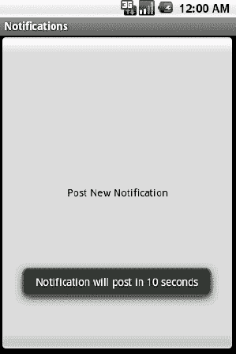
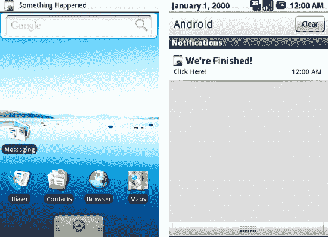
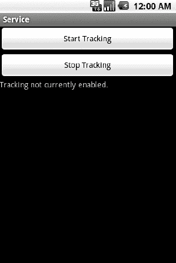

# 六、与系统交互

Android 操作系统提供了许多应用可以利用的有用服务。这些服务中的许多都是为了让您的应用能够在移动系统中运行，而不仅仅是与用户进行短暂的交互。应用可以为自己安排警报，运行后台服务，并相互发送消息；所有这些都允许 Android 应用最大程度地与移动设备集成。此外，Android 提供了一套标准接口，旨在向您的软件公开其核心应用收集的所有数据。通过这些接口，任何应用都可以集成、添加和改进平台的核心功能，从而增强用户体验。

#### 6–1。从后台通知

##### 问题

您的应用在后台运行，当前没有对用户可见的界面，但必须通知用户发生了重要事件。

##### 解决方案

**(API 一级)**

使用`NotificationManager`发布状态栏通知。`Notifications`是一种不引人注目的方式，告诉用户你想引起他们的注意。也许新消息已经到达，更新可用，或者长时间运行的作业已经完成；`Notifications`非常适合完成所有这些任务。

##### 工作原理

一个`Notification`可以从任何系统组件发送到`NotificationManager`，比如一个服务、广播接收器或活动。在这个例子中，我们将看到一个使用延迟来模拟长时间运行的操作的活动，当它完成时会产生一个`Notification`。

**清单 6–1。** *活动触发通知*

`public class NotificationActivity extends Activity implements View.OnClickListener {

    private static final intNOTE_ID = 100;

    @Override
    public void onCreate(Bundle savedInstanceState) {
        super.onCreate(savedInstanceState);
        Button button = new Button(this);
        button.setText("Post New Notification");
        button.setOnClickListener(this);
        setContentView(button);
    }

    @Override
    public void onClick(View v) {
        //Run 10 seconds after click
        handler.postDelayed(task, 10000);
        Toast.makeText(this, "Notification will post in 10 seconds",             Toast.LENGTH_SHORT).show();
    }

    private Handler handler = new Handler();
    private Runnable task = new Runnable() {
        @Override
        public void run() {
            NotificationManager manager =
                    (NotificationManager)getSystemService(Context.NOTIFICATION_SERVICE);
            Intent launchIntent = new Intent(getApplicationContext(),                 NotificationActivity.class);
            PendingIntent contentIntent =
                PendingIntent.getActivity(getApplicationContext(), 0, launchIntent, 0);

            //Create notification with the time it was fired
            Notification note = new Notification(R.drawable.icon, "Something Happened",
                    System.currentTimeMillis());
            //Set notification information
            note.setLatestEventInfo(getApplicationContext(), "We're Finished!",                 "Click Here!", contentIntent);
            note.defaults |= Notification.DEFAULT_SOUND;
            note.flags |= Notification.FLAG_AUTO_CANCEL;

            manager.notify(NOTE_ID, note);
        }
    };
}`

这个例子使用了一个`Handler`来调度一个任务，通过调用按钮监听器中的`Handler.postDelayed()`在按钮被点击十秒钟后发送`Notification`。不管活动是否在前台，这个任务都会执行，所以如果用户厌倦了并离开应用，他们仍然会得到通知。

当计划任务执行时，会创建一个新的通知。可以提供图标资源和标题字符串，这些项目将在通知发生时显示在状态栏中。此外，我们传递一个时间值(以毫秒为单位)作为事件时间显示在通知列表中。这里，我们将该值设置为通知触发的时间，但是在您的应用中它可能有不同的含义。

一旦`Notification`被创建，我们用一些有用的参数填充它。使用`Notification.setLatestEventInfo()`，当用户下拉状态栏时，我们在通知列表中显示更详细的文本。

传递给这个方法的参数之一是一个指向我们活动的`PendingIntent`。这种意图使得通知是交互式的，允许用户点击列表中的通知并启动活动。

**注意:**这个意向将为每个事件发起一个新的活动。如果您希望活动的现有实例响应启动，如果堆栈中存在一个实例，请确保适当地包含意图标志和清单参数来实现这一点，例如`Intent.FLAG_ACTIVITY_CLEAR_TOP`和`android:launchMode="singleTop."`

为了增强状态栏中视觉动画之外的`Notification`，修改了`Notification.defaults`位掩码，以包括当`Notification`触发时系统默认的通知声音。也可以添加诸如`Notification.DEFAULT_VIBRATION`和`Notification.DEFAULT_LIGHTS`的值。

**提示:**如果您想定制用`Notification`播放的声音，将`Notification.sound`参数设置为引用文件的`Uri`或要读取的`ContentProvider`。

向`Notification.flags`位掩码添加一系列标志允许进一步定制`Notification`。这个例子使`Notification.FLAG_AUTO_CANCEL`能够表示一旦用户选择了通知，就应该取消通知，或者从列表中删除。如果没有此标志，通知将保留在列表中，直到通过调用`NotificationManager.cancel()`或`NotificationManager.cancelAll()`手动取消。

以下是其他一些有用的标志:

*   `FLAG_INSISTENT`
    *   重复`Notification`声音，直到用户做出响应。
*   `FLAG_NO_CLEAR`
    *   不允许用用户的“清除通知”按钮清除`Notification`；只能通过调用`cancel()`。

一旦通知准备好了，就用`NotificationManager.notify()`发送给用户，它也带有一个 ID 参数。应用中的每个`Notification`类型都应该有一个惟一的 ID。管理器一次只允许列表中有一个具有相同 ID 的`Notification`,具有相同 ID 的新实例将取代现有的实例。另外，手动取消特定的`Notification`需要 ID。

当我们运行这个例子时，像 Figure 6–1 这样的活动向用户显示一个按钮。按下按钮后，您可以在一段时间后看到通知帖子，即使该活动不再可见(参见图 6–2)。

**图 6–1。** *通知从按钮按下*开始张贴

**图 6–2。** *通知发生(左)，并显示在*列表中(右)

#### 6–2。创建定时和周期性任务

##### 问题

您的应用需要在计时器上运行一个操作，比如定期更新 UI。

##### 解决方案

**(API 一级)**

使用由`Handler`提供的定时操作。有了`Handler`，可以有效地安排操作在特定的时间发生，或者在指定的延迟之后发生。

##### 它是如何工作的

让我们看一个在`TextView`中显示当前时间的示例活动。参见清单 6–2。

**清单 6–2。** *用处理程序更新的活动*

`public class TimingActivity extends Activity {

    TextView mClock;`

`    @Override
    public void onCreate(Bundle savedInstanceState) {
        super.onCreate(savedInstanceState);
        mClock = new TextView(this);
        setContentView(mClock);
    }

    private Handler mHandler = new Handler();
    private Runnable timerTask = new Runnable() {
        @Override
        public void run() {
            Calendar now = Calendar.getInstance();
            mClock.setText(String.format("%02d:%02d:%02d",
                    now.get(Calendar.HOUR),
                    now.get(Calendar.MINUTE),
                    now.get(Calendar.SECOND)) );
            //Schedule the next update in one second
            mHandler.postDelayed(timerTask,1000);
        }
    };

    @Override
    public void onResume() {
        super.onResume();
        mHandler.post(timerTask);
    }

    @Override
    public void onPause() {
        super.onPause();
        mHandler.removeCallbacks(timerTask);
    }
}`

这里我们已经将读取当前时间和更新 UI 的操作封装到一个名为`timerTask`的`Runnable`中，它将由已经创建的`Handler`触发。当活动变得可见时，调用`Handler.post()`尽快执行任务。在更新了`TextView`之后，`timerTask`的最后一个操作是调用处理程序，使用`Handler.postDelayed()`来调度从现在起一秒钟(1000 毫秒)后的另一次执行。

只要活动没有中断，这个循环就会继续，UI 每秒都会更新。一旦活动暂停(用户离开或其他事情吸引了他们的注意力)，`Handler.removeCallbacks()`删除所有挂起的操作，并确保任务不会被进一步调用，直到活动再次可见。

**提示:**在这个例子中，我们更新 UI 是安全的，因为`Handler`是在主线程上创建的。操作将总是在发布它们的`Handler`所连接的同一个线程上执行。

#### 6–3。计划周期性任务

##### 问题

您的应用需要注册才能定期运行任务，例如检查服务器的更新或提醒用户做一些事情。

##### 解决方案

**(API 一级)**

利用`AlarmManager`来管理和执行你的任务。`AlarmManager`对于调度未来的单个或重复操作非常有用，即使您的应用没有运行，这些操作也需要发生。每当闹钟设定好的时候，`AlarmManager`就会被交给一个`PendingIntent`去启动。这个意图可以指向任何系统组件，比如一个`Activity`、`BroadcastReceiver`或`Service`，当警报触发时执行。

应该注意的是，这种方法最适合于即使在应用代码可能没有运行时也需要发生的操作。`AlarmManager`需要太多的开销，对于在应用使用时可能需要的简单计时操作来说是无用的。使用`Handler`的`postAtTime()`和`postDelayed()`方法可以更好地处理这些问题。

##### 它是如何工作的

让我们看看如何使用`AlarmManager`定期触发广播接收器。参见清单 6–3 到清单 6–5。

**清单 6–3。** *待触发的广播接收器*

`public class AlarmReceiver extends BroadcastReceiver {
    @Override
    public void onReceive(Context context, Intent intent) {
        //Perform an interesting operation, we'll just display the current time
        Calendar now = Calendar.getInstance();
        DateFormat formatter = SimpleDateFormat.getTimeInstance();
        Toast.makeText(context, formatter.format(now.getTime()),             Toast.LENGTH_SHORT).show();
    }
}`

**提醒:**必须在清单中用一个`<receiver>`标签声明一个 BroadcastReceiver ( `AlarmReceiver`)，以便`AlarmManager`能够触发它。确保在您的`<application>`标签中包含一个，如下所示:

`<application>
  …
  <receiver android:name=".AlarmReceiver"></receiver>
</application>`

**清单 6–4。** *res/layout/main.xml*

`<?xml version="1.0" encoding="utf-8"?>
<LinearLayout xmlns:android="http://schemas.android.com/apk/res/android"
  android:orientation="vertical"
  android:layout_width="fill_parent"
  android:layout_height="fill_parent">
  <Button
    android:id="@+id/start"
    android:layout_width="fill_parent"
    android:layout_height="wrap_content"
    android:text="Start Alarm"
  />
  <Button
    android:id="@+id/stop"
    android:layout_width="fill_parent"
    android:layout_height="wrap_content"
    android:text="Cancel Alarm"
  />
</LinearLayout>`

**清单 6–5。** *注册/注销报警的活动*

`public class AlarmActivity extends Activity implements View.OnClickListener {

    private PendingIntent mAlarmIntent;

    @Override
    public void onCreate(Bundle savedInstanceState) {
        super.onCreate(savedInstanceState);
        setContentView(R.layout.main);
        //Attach the listener to both buttons
        findViewById(R.id.start).setOnClickListener(this);
        findViewById(R.id.stop).setOnClickListener(this);
        //Create the launch sender
        Intent launchIntent = new Intent(this, AlarmReceiver.class);
        mAlarmIntent = PendingIntent.getBroadcast(this, 0, launchIntent, 0);
    }

    @Override
    public void onClick(View v) {
        AlarmManager manager = (AlarmManager)getSystemService(Context.ALARM_SERVICE);
        long interval = 5*1000; //5 seconds

        switch(v.getId()) {
        case R.id.start:`
`            Toast.makeText(this, "Scheduled", Toast.LENGTH_SHORT).show();
            manager.setRepeating(AlarmManager.ELAPSED_REALTIME,
                    SystemClock.elapsedRealtime()+interval,
                    interval,
                    mAlarmIntent);
            break;
        case R.id.stop:
            Toast.makeText(this, "Canceled", Toast.LENGTH_SHORT).show();
            manager.cancel(mAlarmIntent);
            break;
        default:
            break;
        }
    }
}`

在这个例子中，我们提供了一个非常基本的 BroadcastReceiver，当它被触发时，会简单地将当前时间显示为 Toast。该接收器必须用一个`<receiver>`标签在应用的清单中注册。否则，应用外部的`AlarmManager`将不会知道如何触发它。示例活动提供了两个按钮:一个开始触发常规警报，另一个取消警报。

要触发的操作由`PendingIntent`引用，它将用于设置和取消报警。我们创建一个直接引用应用的 BroadcastReceiver 的 Intent，然后使用`getBroadcast()`从该 Intent 创建一个`PendingIntent`(因为我们正在创建一个对 BroadcastReceiver 的引用)。

**提醒:** `PendingIntent`有创建者方法`getActivity()`也有`getService()`。确保在创建这个部分时引用正确的应用组件。

当按下开始按钮时，活动使用`AlarmManager.setRepeating()`记录一个重复报警。除了 PendingIntent 之外，该方法还需要一些参数来确定何时触发警报。第一个参数根据使用的时间单位以及设备处于睡眠模式时是否应该发出警报来定义警报类型。在本例中，我们选择了`ELAPSED_REALTIME`，它表示自上次设备启动以来的值(单位为毫秒)。此外，还有三种其他模式可供使用:

*   `ELAPSED_REALTIME_WAKEUP`
    *   报警时间是指经过的时间，如果设备处于睡眠状态，将唤醒设备触发报警。
*   `RTC`
    *   参照 UTC 时间的报警时间。
*   `RTC_WAKEUP`
    *   参考 UTC 时间的闹钟时间，如果设备处于睡眠状态，将唤醒设备进行触发。

以下参数(分别)指的是警报第一次触发的时间和重复的时间间隔。因为选择的警报类型是 ELAPSED_REALTIME，开始时间也必须相对于经过时间；`SystemClock.elapsedRealtime()`以此格式提供当前时间。

示例中的警报被注册为在按下按钮 5 秒后触发，之后每隔 5 秒触发一次。每五秒钟，屏幕上会出现一个带有当前时间值的`Toast`，即使该应用不再运行或不在用户面前。当用户显示活动并按下停止按钮时，任何与我们的`PendingIntent`匹配的未决警报都会被立即取消…停止`Toast`的流程

###### 一个更精确的例子

如果我们想安排一个闹铃在特定的时间发生呢？也许每天早上 9 点一次？用一些稍微不同的参数设置`AlarmManager`可以实现这一点。参见清单 6–6。

**清单 6–6。** *精确报警*

`    long oneDay = 24*3600*1000; //24 hours
    long firstTime;

    //Get a Calendar (defaults to today)
    //Set the time to 09:00:00
    Calendar startTime = Calendar.getInstance();
    startTime.set(Calendar.HOUR_OF_DAY, 9);
    startTime.set(Calendar.MINUTE, 0);
    startTime.set(Calendar.SECOND, 0);

    //Get a Calendar at the current time
    Calendar now = Calendar.getInstance();

    if(now.before(startTime)) {
        //It's not 9AM yet, start today
        firstTime = startTime.getTimeInMillis();
    } else {
        //Start 9AM tomorrow
        startTime.add(Calendar.DATE, 1);
        firstTime = startTime.getTimeInMillis();
    }

    //Set the alarm
    manager.setRepeating(AlarmManager.RTC_WAKEUP,
                   firstTime,
                   oneDay,
                   mAlarmIntent);`

这个例子使用了一个实时报警。确定上午 9:00 的下一次发生是在今天还是明天，并且返回该值作为警报的初始触发时间。然后，以毫秒为单位的 24 小时的计算值作为时间间隔，这样从该时间点开始，每天触发一次警报。

**重要提示:**警报不会在设备重启后持续存在。如果设备关闭后又重新打开，则必须重新安排任何先前注册的警报。

#### 6–4 岁。创建粘性操作

##### 问题

您的应用需要执行一个或多个后台操作，即使用户暂停应用，这些操作也会运行到完成。

##### 解决方案

**(API 三级)**

创建一个`IntentService`的实现来处理这项工作。`IntentService`是 Android 基础服务实现的包装器，是在后台工作而无需用户交互的关键组件。`IntentService`对传入的工作进行排队(用 Intents 表示)，依次处理每个请求，然后在队列为空时自行停止。

`IntentService`还处理后台工作所需的工作线程的创建，因此不必使用 AsyncTask 或 Java 线程来确保操作在后台正常进行。

这个菜谱研究了一个使用`IntentService`创建后台操作的中央管理器的例子。在本例中，将通过调用`Context.startService()`从外部调用管理器。经理会将收到的所有请求排队，并通过给`onHandleIntent()`打电话来单独处理它们。

##### 它是如何工作的

让我们来看看如何构造一个简单的`IntentService`实现来处理一系列后台操作。参见清单 6–7。

**清单 6–7。** *IntentService 搬运操作*

`public class OperationsManager extends IntentService {

    public static final String ACTION_EVENT = "ACTION_EVENT";
    public static final String ACTION_WARNING = "ACTION_WARNING";
    public static final String ACTION_ERROR = "ACTION_ERROR";
    public static final String EXTRA_NAME = "eventName";

    private static final String LOGTAG = "EventLogger";

    private IntentFilter matcher;`

`    public OperationsManager() {
        super("OperationsManager");
        //Create the filter for matching incoming requests
        matcher = new IntentFilter();
        matcher.addAction(ACTION_EVENT);
        matcher.addAction(ACTION_WARNING);
        matcher.addAction(ACTION_ERROR);
    }

    @Override
    protectedvoid onHandleIntent(Intent intent) {
        //Check for a valid request
        if(!matcher.matchAction(intent.getAction())) {
            Toast.makeText(this, "OperationsManager: Invalid Request", Toast.LENGTH_SHORT).show();
            return;
        }

        //Handle each request directly in this method. Don't create more threads.
        if(TextUtils.equals(intent.getAction(), ACTION_EVENT)) {
            logEvent(intent.getStringExtra(EXTRA_NAME));
        }
        if(TextUtils.equals(intent.getAction(), ACTION_WARNING)) {
            logWarning(intent.getStringExtra(EXTRA_NAME));
        }
        if(TextUtils.equals(intent.getAction(), ACTION_ERROR)) {
            logError(intent.getStringExtra(EXTRA_NAME));
        }
    }

    private void logEvent(String name) {
        try {
            //Simulate a long network operation by sleeping
            Thread.sleep(5000);
            Log.i(LOGTAG, name);
        } catch (InterruptedException e) {
            e.printStackTrace();
        }
    }

    private void logWarning(String name) {
        try {
            //Simulate a long network operation by sleeping
            Thread.sleep(5000);
            Log.w(LOGTAG, name);
        } catch (InterruptedException e) {
            e.printStackTrace();
        }
    }

    private void logError(String name) {
        try {
            //Simulate a long network operation by sleeping
            Thread.sleep(5000);
            Log.e(LOGTAG, name);
        } catch (InterruptedException e) {
            e.printStackTrace();`
`        }
    }
}`

注意`IntentService`没有默认的构造函数(没有参数)，所以自定义实现必须实现一个构造函数，用服务名调用 super。这个名称在技术上没有什么重要性，因为它只对调试有用；Android 使用提供的名称来命名它创建的工作线程。

服务通过`onHandleIntent()`方法处理所有请求。这个方法是在提供的 worker 线程上调用的，所以所有的工作都应该直接在这里完成；不应创建新的线程或操作。当`onHandleIntent()`返回时，这是 IntentService 开始处理队列中下一个请求的信号。

这个示例提供了三个日志记录操作，可以在请求意图上使用不同的操作字符串来请求这些操作。出于演示目的，每个操作都使用特定的日志记录级别(信息、警告或错误)将提供的消息写入设备日志。请注意，消息本身是作为请求意图的额外内容传递的。使用每个意图的数据和额外字段来保存操作的任何参数，让操作字段来定义操作类型。

示例服务维护一个 IntentFilter，它用于方便地确定是否发出了有效的请求。当创建服务时，所有有效的动作都被添加到过滤器中，允许我们对任何传入的请求调用`IntentFilter.matchAction()`来确定它是否包括我们可以在这里处理的动作。

清单 6–8 是一个调用这个服务来执行工作的活动的例子。

**清单 6–8。** *AndroidManifest.xml*

`<?xml version="1.0" encoding="utf-8"?>
<manifest xmlns:android="http://schemas.android.com/apk/res/android"
      package="com.examples.sticky"
      android:versionCode="1"
      android:versionName="1.0">
    <uses-sdk android:minSdkVersion="3" />

    <application android:icon="@drawable/icon" android:label="@string/app_name">
        <activity android:name=".ReportActivity"
                  android:label="@string/app_name">
            <intent-filter>
                <action android:name="android.intent.action.MAIN" />
                <category android:name="android.intent.category.LAUNCHER" />
            </intent-filter>
        </activity>
        <service android:name=".OperationsManager"></service>
    </application>
</manifest>`

**提醒:**Android manifest . XML 中的`package`属性必须与您为应用选择的包相匹配；`"com.examples.sticky"`只是我们在这里的例子中选择的包。

**注意:**因为`IntentService`是作为服务调用的，所以必须使用`<service>`标签在应用清单中声明它。

**清单 6–9。** *活动调用 IntentService*

`public class ReportActivity extends Activity {

    @Override
    public void onCreate(Bundle savedInstanceState) {
        super.onCreate(savedInstanceState);
        logEvent("CREATE");
    }

    @Override
    public void onStart() {
        super.onStart();
        logEvent("START");
    }

    @Override
    public void onResume() {
        super.onResume();
        logEvent("RESUME");
    }

    @Override
    public void onPause() {
        super.onPause();
        logWarning("PAUSE");
    }

    @Override
    public void onStop() {
        super.onStop();
        logWarning("STOP");
    }

    @Override
    public void onDestroy() {
        super.onDestroy();
        logWarning("DESTROY");
    }

    private void logEvent(String event) {
        Intent intent = new Intent(this, OperationsManager.class);
        intent.setAction(OperationsManager.ACTION_EVENT);`
`        intent.putExtra(OperationsManager.EXTRA_NAME, event);

        startService(intent);
    }

    private void logWarning(String event) {
        Intent intent = new Intent(this, OperationsManager.class);
        intent.setAction(OperationsManager.ACTION_WARNING);
        intent.putExtra(OperationsManager.EXTRA_NAME, event);

        startService(intent);
    }
}`

这个活动没什么好看的，因为所有有趣的事件都是通过设备日志发送出去的，而不是发送到用户界面。然而，它有助于说明我们在前一个示例中创建的服务的队列处理行为。当活动变得可见时，它将调用所有正常的生命周期方法，导致对日志服务的三个请求。在处理每个请求时，日志中将输出一行，服务将继续。

**提示**:这些日志语句可以通过 SDK 提供的`logcat`工具看到。从大多数开发环境(包括 Eclipse)中都可以看到来自设备或仿真器的`logcat`输出，或者通过在命令行键入`adblogcat.`就可以看到

还要注意，当服务完成所有三个请求时，系统会在日志中发出通知，指出服务已经停止。仅在完成作业所需的时间内存中存在；这是一个非常有用的特性，让你的服务成为系统的好公民。

按下 HOME 或 BACK 按钮将导致更多的生命周期方法生成服务请求，并注意暂停/停止/销毁部分调用服务中的单独操作，导致它们的消息被记录为警告；简单地将请求意图的动作字符串设置为不同的值就可以控制这一点。

请注意，即使应用不再可见(或者打开了另一个应用)，消息仍会继续输出到日志中。这就是 Android 服务组件的强大之处。无论用户行为如何，这些操作在完成之前都会受到系统保护。

###### 可能的缺点

在每种操作方法中，都设置了五秒钟的延迟，以模拟发出远程 API 或一些类似操作的实际请求所需的时间。当运行这个例子时，它也有助于说明`IntentService`用单个工作线程以串行方式处理发送给它的所有请求。该示例对来自每个生命周期方法的多个连续请求进行排队，但是结果仍然是每五秒钟一条日志消息，因为 IntentService 在当前请求完成之前不会启动一个新请求(实际上是在`onHandleIntent()`返回时)。

如果您的应用需要粘性后台任务的并发性，您可能需要创建一个更加定制的服务实现，使用线程池来执行工作。Android 开源的美妙之处在于，如果需要的话，你可以直接找到`IntentService`的源代码，并将其作为实现的起点，从而最大限度地减少所需的时间和定制代码。

#### 6–5 岁。运行持久的后台操作

##### 问题

您的应用有一个组件，它必须在后台无限期运行，执行某些操作或监视某些事件的发生。

##### 解决方案

**(API 一级)**

将组件构建成服务。服务被设计为后台组件，应用可以启动这些组件并让它们无限期地运行。就防止在内存不足的情况下被终止而言，服务还被赋予了高于其他后台进程的更高的地位。

对于不需要直接连接到另一个组件的操作(如活动)，可以显式地启动和停止服务。但是，如果应用必须直接与服务交互，则提供一个绑定接口来传递数据。在这些情况下，服务可以由系统隐式地启动和停止，这是实现其所请求的绑定所需要的。

对于服务实现，要记住的关键是始终保持用户友好。除非用户明确要求，否则不确定操作很可能不应该启动。整个应用可能应该包含一个界面或设置，允许用户控制启用或禁用这样的服务。

##### 它是如何工作的

清单 6–10 是一个持久化服务的例子，用于在一定时期内跟踪和记录用户的位置。

**清单 6–10。** *持久跟踪服务*

`public class TrackerService extends Service implements LocationListener {

    private static final String LOGTAG = "TrackerService";

    private LocationManager manager;
    private ArrayList<Location> storedLocations;`

`    privateboolean isTracking = false;

    /* Service Setup Methods */
    @Override
    public void onCreate() {
        manager = (LocationManager)getSystemService(LOCATION_SERVICE);
        storedLocations = new ArrayList<Location>();
        Log.i(LOGTAG, "Tracking Service Running...");
    }

    @Override
    public void onDestroy() {
        manager.removeUpdates(this);
        Log.i(LOGTAG, "Tracking Service Stopped...");
    }

    public void startTracking() {
        if(!manager.isProviderEnabled(LocationManager.GPS_PROVIDER)) {
            return;
        }
        Toast.makeText(this, "Starting Tracker", Toast.LENGTH_SHORT).show();
        manager.requestLocationUpdates(LocationManager.GPS_PROVIDER, 30000, 0, this);

        isTracking = true;
    }

    public void stopTracking() {
        Toast.makeText(this, "Stopping Tracker", Toast.LENGTH_SHORT).show();
        manager.removeUpdates(this);
        isTracking = false;
    }

    publicboolean isTracking() {
        return isTracking;
    }

    /* Service Access Methods */
    public class TrackerBinder extends Binder {
        TrackerService getService() {
            return TrackerService.this;
        }
    }

    private final IBinder binder = new TrackerBinder();

    @Override
    public IBinder onBind(Intent intent) {
        return binder;
    }

    publicint getLocationsCount() {
        return storedLocations.size();
    }

    public ArrayList<Location> getLocations() {
        return storedLocations;`
`    }

    /* LocationListener Methods */
    @Override
    public void onLocationChanged(Location location) {
        Log.i("TrackerService", "Adding new location");
        storedLocations.add(location);
    }

    @Override
    public void onProviderDisabled(String provider) { }

    @Override
    public void onProviderEnabled(String provider) { }

    @Override
    public void onStatusChanged(String provider, int status, Bundle extras) { }
}`

该服务的工作是监控和跟踪它从`LocationManager`接收的更新。当创建服务时，它准备一个空白的`Location`条目列表，并等待开始跟踪。一个外部组件，比如一个活动，可以调用`startTracking()`和`stopTracking()`来启用和禁用位置更新到服务的流程。此外，还公开了访问服务已记录的位置列表的方法。

因为这个服务需要来自活动或其他组件的直接交互，所以需要一个 Binder 接口。当服务必须跨越流程边界进行通信时，绑定器的概念可能会变得复杂，但是对于像这样的情况，所有东西都位于同一个流程的本地，使用一个方法`getService()`创建一个非常简单的绑定器，将服务实例本身返回给调用者。我们稍后将从活动的角度对此进行更详细的讨论。

当在服务上启用跟踪时，它向`LocationManager`注册更新，并将收到的每个更新存储在其位置列表中。请注意，调用`requestLocationUpdates()`的最短时间为 30 秒。由于这项服务预计将运行很长时间，谨慎的做法是留出更新时间，让 GPS(以及电池)休息一会儿。

现在让我们来看一个允许用户访问该服务的简单活动。参见清单 6–11 至清单 6–13。

**清单 6–11。** *AndroidManifest.xml*

`<?xml version="1.0" encoding="utf-8"?>
<manifest xmlns:android="http://schemas.android.com/apk/res/android"
      package="com.examples.service"
      android:versionCode="1"
      android:versionName="1.0">
    <uses-sdk android:minSdkVersion="1" />
    <application android:icon="@drawable/icon" android:label="@string/app_name">
        <activity android:name=".ServiceActivity"
                  android:label="@string/app_name">
            <intent-filter>
                <action android:name="android.intent.action.MAIN" />`
`<category android:name="android.intent.category.LAUNCHER" />
            </intent-filter>
        </activity>
        <service android:name=".TrackerService"></service>
    </application>
    <uses-permission android:name="android.permission.ACCESS_FINE_LOCATION"/>
</manifest>` 

**提醒:**服务必须在应用清单中使用`<service>`标签声明，这样 Android 就知道如何以及在哪里调用它。此外，对于本例，权限`android.permission.ACCESS_FINE_LOCATION`是必需的，因为我们正在使用 GPS。

**清单 6–12。** *res/layout/main.xml*

`<?xml version="1.0" encoding="utf-8"?>
<LinearLayout xmlns:android="http://schemas.android.com/apk/res/android"
  android:orientation="vertical"
  android:layout_width="fill_parent"
  android:layout_height="fill_parent">
  <Button
    android:id="@+id/enable"
    android:layout_width="fill_parent"
    android:layout_height="wrap_content"
    android:text="Start Tracking"
  />
  <Button
    android:id="@+id/disable"
    android:layout_width="fill_parent"
    android:layout_height="wrap_content"
    android:text="Stop Tracking"
  />
  <TextView
    android:id="@+id/status"
    android:layout_width="fill_parent"
    android:layout_height="wrap_content"
  />
</LinearLayout>`

**清单 6–13。** *活动与服务交互*

`public class ServiceActivity extends Activity implements View.OnClickListener {

    Button enableButton, disableButton;
    TextView statusView;

    TrackerService trackerService;
    Intent serviceIntent;

    @Override
    public void onCreate(Bundle savedInstanceState) {
        super.onCreate(savedInstanceState);
        setContentView(R.layout.main);`

`        enableButton = (Button)findViewById(R.id.enable);
        enableButton.setOnClickListener(this);
        disableButton = (Button)findViewById(R.id.disable);
        disableButton.setOnClickListener(this);
        statusView = (TextView)findViewById(R.id.status);

        serviceIntent = new Intent(this, TrackerService.class);
    }

    @Override
    public void onResume() {
        super.onResume();
        //Starting the service makes it stick, regardless of bindings
        startService(serviceIntent);
        //Bind to the service
        bindService(serviceIntent, serviceConnection, Context.BIND_AUTO_CREATE);
    }

    @Override
    public void onPause() {
        super.onPause();
        if(!trackerService.isTracking()) {
            //Stopping the service let's it die once unbound
            stopService(serviceIntent);
        }
        //Unbind from the service
        unbindService(serviceConnection);
    }

    @Override
    public void onClick(View v) {
        switch(v.getId()) {
        case R.id.enable:
            trackerService.startTracking();
            break;
        case R.id.disable:
            trackerService.stopTracking();
            break;
        default:
            break;
        }
        updateStatus();
    }

    private void updateStatus() {
        if(trackerService.isTracking()) {
            statusView.setText(
                String.format("Tracking enabled. %d locations                     logged.",trackerService.getLocationsCount()));
        } else {
            statusView.setText("Tracking not currently enabled.");
        }
    }

    private ServiceConnection serviceConnection = new ServiceConnection() {
        public void onServiceConnected(ComponentName className, IBinder service) {
            trackerService = ((TrackerService.TrackerBinder)service).getService();`
`            updateStatus();
        }

        public void onServiceDisconnected(ComponentName className) {
            trackerService = null;
        }
    };
}`

Figure 6–3 显示了用户启用和禁用位置跟踪行为的两个按钮，以及当前服务状态的文本显示。

**图 6–3。** *服务活动布局*

当活动可见时，它被绑定到`TrackerService`。这是在`ServiceConnection`接口的帮助下完成的，该接口在绑定和解除绑定操作完成时提供回调方法。将服务绑定到活动后，我们现在可以直接调用服务公开的所有公共方法。

然而，单靠绑定无法让服务长期运行；仅通过绑定器接口访问服务会导致服务随着活动的生命周期自动创建和销毁。在这种情况下，我们希望服务持续到该活动在内存中之后。为了实现这一点，服务在绑定之前通过`startService()`显式启动。向已经运行的服务发送启动命令没有坏处，所以我们也可以在`onResume()`中安全地这样做。

服务现在将继续在内存中运行，即使在活动解除自身绑定之后。在`onPause()`中，这个例子总是检查用户是否激活了跟踪，如果没有，它首先停止服务。这允许服务在不需要跟踪的情况下终止，从而防止服务在没有实际工作要做的情况下永远挂在内存中。

运行这个例子，并按下 Start Tracking 按钮将会启动持久服务和`LocationManager`。用户可以在这一点上离开应用，并且服务将保持运行，同时记录来自 GPS 的所有输入位置更新。当用户返回到这个应用时，他们可以看到服务仍然在运行，并且显示当前存储的位置点的数量。按 Stop Tracking 将结束该过程，并允许服务在用户再次离开活动时立即终止。

#### 6–6 岁。启动其他应用

##### 问题

您的应用需要特定的功能，而设备上的另一个应用已经对该功能进行了编程。为了避免重叠功能，您希望启动该作业的另一个应用。

##### 解决方案

**(API 一级)**

使用一个隐含的意图来告诉系统你想做什么，并确定是否有任何应用可以满足需要。大多数情况下，开发人员以明确的方式使用意图来开始另一个活动或服务，就像这样:

`Intent intent = new Intent(this, NewActivity.class);
startActivity(intent);`

通过声明我们想要启动的特定组件，其交付意图非常明确。我们也有能力根据意图的动作、类别、数据和类型来定义意图，以定义我们想要完成什么任务的更隐含的需求。

当以这种方式启动时，外部应用总是在与您的应用相同的 Android 任务中启动，因此一旦操作完成(或者如果用户退出)，用户就会返回到您的应用。这保持了无缝的体验，从用户的角度来看，允许多个应用作为一个整体。

##### 它是如何工作的

当以这种方式定义意图时，可能不清楚您必须包括什么信息，因为没有发布的标准，并且提供相同服务(例如，读取 PDF 文件)的两个应用可能定义稍微不同的过滤器来监听传入的意图。您希望确保并为系统(或用户)提供足够的信息，以选择处理所需任务的最佳应用。

定义几乎所有隐含意图的核心数据是动作；在构造函数中或通过`Intent.setAction()`传递的字符串值。这个值告诉 Android 你想做什么，是查看一段内容，发送一条消息，选择一个选项，还是你有什么。由此，所提供的字段是特定于场景的，并且通常多种组合可以得到相同的结果。让我们来看看一些有用的例子。

###### 阅读 PDF 文件

显示 PDF 文档的组件不包括在核心 SDK 中，尽管今天市场上几乎每个消费 Android 设备都附带了 PDF 阅读器应用，Android Market 上还有许多其他应用。因此，在应用中嵌入 PDF 显示功能可能没有意义。

相反，下面的清单 6–14 说明了如何找到并启动另一个应用来查看 PDF。

**清单 6–14。** *查看 PDF 的方法*

`private void viewPdf(Uri file) {
        Intent intent;
        intent = new Intent(Intent.ACTION_VIEW);
        intent.setDataAndType(file, "application/pdf");
        try {
            startActivity(intent);
        } catch (ActivityNotFoundException e) {
            //No application to view, ask to download one
            AlertDialog.Builder builder = new AlertDialog.Builder(this);
            builder.setTitle("No Application Found");
            builder.setMessage("We could not find an application to view PDFs."
                    +"  Would you like to download one from Android Market?");
            builder.setPositiveButton("Yes, Please",
                new DialogInterface.OnClickListener() {
                @Override
                public void onClick(DialogInterface dialog, int which) {
                    Intent marketIntent = new Intent(Intent.ACTION_VIEW);
                    marketIntent.setData(Uri.parse("market://details?id=com.adobe.reader"));
                    startActivity(marketIntent);
                }
            });
            builder.setNegativeButton("No, Thanks", null);
            builder.create().show();
        }
    }`

此示例方法将使用找到的最佳应用打开设备(内部或外部存储器)上的任何本地 PDF 文件。如果在设备上找不到查看 pdf 的应用，我们鼓励用户去 Android Market 下载一个。

我们为此创建的意图是使用通用的`Intent.ACTION_VIEW`动作字符串构建的，告诉系统我们想要查看意图中提供的数据。数据文件本身及其 MIME 类型也被设置为告诉系统我们想要查看哪种数据。

**提示:** `Intent.setData()`和`Intent.setType()`使用时互相清零对方以前的值。如果您需要同时设置两者，请使用示例中的`Intent.setDataAndType(),`。

如果`startActivity()`因`ActivityNotFoundException`而失败，这意味着用户的设备上没有安装可以查看 pdf 的应用。我们希望我们的用户有完整的体验，所以如果发生这种情况，我们会显示一个对话框告诉他们问题，并询问他们是否愿意去市场上买一个阅读器。如果用户按下 Yes，我们使用另一个隐含的意图来请求 Android Market 直接打开到 Adobe Reader 的应用页面，这是一个用户可以下载来查看 PDF 文件的免费应用。我们将在下一个秘籍中讨论用于这个目的的`Uri`方案。

注意，示例方法将一个`Uri`参数传递给本地文件。以下是如何检索位于内部存储上的文件的`Uri`的示例:

`String filename = NAME_OF YOUR_FILE;
File internalFile = getFileStreamPath(filename);
Uri internal = Uri.fromFile(internalFile);`

方法`getFileStreamPath()`是从`Context`调用的，所以如果这个代码不在活动中，你必须引用一个`Context`对象来调用。以下是如何为位于外部存储器上的文件创建一个`Uri`:

`String filename = NAME_OF YOUR_FILE;
File externalFile = new File(Environment.getExternalStorageDirectory(), filename);
Uri external = Uri.fromFile(externalFile);`

这个例子也适用于任何其他文档类型，只需简单地改变附加到意图的 MIME 类型。

###### 与朋友分享

开发人员在他们的应用中包含的另一个流行特性是与他人共享应用内容的方法；通过电子邮件、短信和著名的社交网络。所有的 Android 设备都包括电子邮件和短信应用，大多数希望通过社交网络(如脸书或 Twitter)分享的用户也在他们的设备上安装了这些移动应用。

事实证明，这项任务也可以使用隐式意图来完成，因为大多数应用都会以某种方式响应`Intent.ACTION_SEND`动作字符串。 清单 6–15 是一个允许用户通过一个意向请求向任何媒体发帖的例子。

**清单 6–15。** *分享意向*

`private void shareContent(String update) {
        Intent intent = new Intent(Intent.ACTION_SEND);
        intent.setType("text/plain");
        intent.putExtra(Intent.EXTRA_TEXT, update);
        startActivity(Intent.createChooser(intent, "Share..."));
    }`

这里，我们告诉系统我们有一段文本要发送，作为额外的内容传入。这是一个非常普通的请求，我们希望不止一个应用能够处理它。默认情况下，Android 会给用户一个应用列表，让用户选择想要打开的应用。此外，一些设备为用户提供了一个复选框，将他们的选择设置为默认值，这样列表就不会再显示了！

我们希望对这个过程有更多一点的控制，因为我们也希望每次都有多个结果。因此，我们没有将意图直接传递给`startActivity()`，而是首先通过`Intent.createChooser()`传递，这允许我们定制标题，并保证选择列表将始终显示。

当用户选择一个选项时，特定的应用将启动，并在消息输入框中预填充`EXTRA_TEXT`,准备共享！

#### 6–7 岁。启动系统应用

##### 问题

您的应用需要特定的功能，而设备上的某个系统应用已经对该功能进行了编程。为了避免重叠功能，您希望启动作业的系统应用。

##### 解决方案

**(API 一级)**

使用隐含的意图告诉系统你对哪个应用感兴趣。每个系统应用订阅一个定制的`Uri`方案，该方案可以作为数据插入到一个隐含的意图中，以表示您需要启动的特定应用。

以这种方式启动时，外部应用总是在与您的应用相同的任务中启动，因此一旦任务完成(或者如果用户退出)，用户就会返回到您的应用。这保持了无缝的体验，从用户的角度来看，允许多个应用作为一个整体。

##### 工作原理

下面所有的例子都将构造可以用来在不同状态下启动系统应用的意图。一旦构建完成，您应该通过将所述意图传递给`startActivity().`来启动这些应用

###### 浏览器

可以启动浏览器应用来显示网页或运行网络搜索。

要显示网页，请构建并启动以下意图:

`Intent pageIntent = new Intent();
pageIntent.setAction(Intent.ACTION_VIEW);
pageIntent.setData(Uri.parse(“http://WEB_ADDRESS_TO_VIEW”));`

这将数据字段中的`Uri`替换为您想要查看的页面。要在浏览器中启动 web 搜索，请构建并启动以下意图:

`Intent searchIntent = new Intent();
searchIntent.setAction(Intent.ACTION_WEB_SEARCH);
searchIntent.putExtra(SearchManager.QUERY, STRING_TO_SEARCH);`

这将把您想要执行的搜索查询作为额外内容放在意图中。

###### 电话拨号程序

可以启动拨号器应用，使用以下意图向特定号码发出呼叫:

`Intent dialIntent = new Intent();
dialIntent.setAction(Intent.ACTION_DIAL);
dialIntent.setData(Uri.Parse(“tel:8885551234”);`

这将数据 Uri 中的电话号码替换为要呼叫的号码。

**注意:**这个动作只是调出拨号器；它实际上并不发出呼叫。`Intent.ACTION_CALL`可以用来直接拨打电话，尽管谷歌不鼓励在大多数情况下使用它。使用`ACTION_CALL`还需要在清单中声明`android.permission.CALL_PHONE`权限。

###### 地图

可以启动设备上的地图应用来显示位置或提供两点之间的方向。如果您知道要绘制地图的位置的纬度和经度，则创建以下意图:

`Intent mapIntent = new Intent();
mapIntent.setAction(Intent.ACTION_VIEW);
mapIntent.setData(Uri.parse(“geo:latitude,longitude”));`

这将替换您所在位置的经纬度坐标。例如，`Uri`

`"geo:37.422,122.084"`

会标出谷歌总部的位置。如果您知道要显示的位置的地址，则创建以下意图:

`Intent mapIntent = new Intent();
mapIntent.setAction(Intent.ACTION_VIEW);
mapIntent.setData(Uri.parse(“geo:0,0?q=ADDRESS”));`

这将插入您想要映射的地址。例如，`Uri`

`"geo:0,0?q=1600 Amphitheatre Parkway, Mountain View, CA 94043"`

会绘制谷歌总部的地址。

**提示:**地图应用也将接受一个`Uri`，其中地址查询中的空格将被替换为“+”字符。如果对包含空格的字符串进行编码有困难，请尝试用“+”替换它们。

如果您想要显示至位置之间的方向，请创建以下意图:

`Intent mapIntent = new Intent();
mapIntent.setAction(Intent.ACTION_VIEW);
mapIntent.setData(Uri.parse(“http://maps.google.com/maps?saddr=lat,lng&daddr=lat,lng”));`

这将插入起始和结束地址的位置。

如果您希望打开一个地址开放的地图应用，也可以只包含其中一个参数。例如，`Uri`

`"http://maps.google.com/maps?&daddr=37.422,122.084"`

将显示地图应用与目的地位置预填充，但允许用户输入自己的起始地址。

###### 电子邮件

设备上的任何电子邮件应用都可以使用以下意图启动到撰写模式:

`Intent mailIntent = new Intent();
mailIntent.setAction(Intent.ACTION_SEND);
mailIntent.setType(“message/rfc822”);
mailIntent.putExtra(Intent.EXTRA_EMAIL, new String[] {"recipient@gmail.com"});
mailIntent.putExtra(Intent.EXTRA_CC, new String[] {"carbon@gmail.com"});
mailIntent.putExtra(Intent.EXTRA_BCC, new String[] {"blind@gmail.com"});
mailIntent.putExtra(Intent.EXTRA_SUBJECT, "Email Subject");
mailIntent.putExtra(Intent.EXTRA_TEXT, "Body Text");
mailIntent.putExtra(Intent.EXTRA_STREAM, URI_TO_FILE);`

在这种情况下，action 和 type 字段是显示空白电子邮件的唯一必需部分。所有剩余的 extras 都预先填充了电子邮件消息的特定字段。请注意，`EXTRA_EMAIL`(填充 To:字段)、`EXTRA_CC`和`EXTRA_BCC`被传递给了字符串数组，即使那里只放置了一个收件人。也可以使用`EXTRA_STREAM`在意向中指定文件附件。这里传递的值应该是一个指向要附加的本地文件的`Uri`。

如果您需要在电子邮件中附加多个文件，要求会稍有变化，如下所示:

`Intent mailIntent = new Intent();
mailIntent.setAction(Intent.ACTION_SEND_MULTIPLE);
mailIntent.setType(“message/rfc822”);
mailIntent.putExtra(Intent.EXTRA_EMAIL, new String[] {"recipient@gmail.com"});
mailIntent.putExtra(Intent.EXTRA_CC, new String[] {"carbon@gmail.com"});
mailIntent.putExtra(Intent.EXTRA_BCC, new String[] {"blind@gmail.com"});
mailIntent.putExtra(Intent.EXTRA_SUBJECT, "Email Subject");
mailIntent.putExtra(Intent.EXTRA_TEXT, "Body Text");

ArrayList<Uri> files = new ArrayList<Uri>();
files.add(URI_TO_FIRST_FILE);
files.add(URI_TO_SECOND_FILE);
//...Repeat add() as often as necessary to add all the files you need
mailIntent.putParcelableArrayListExtra(Intent.EXTRA_STREAM, files);`

注意，意向的动作字符串现在是`ACTION_SEND_MULTIPLE`。除了作为`EXTRA_STREAM`添加的数据之外，所有的主字段保持不变。这个例子创建了一个指向您想要附加的文件的 uri 列表，并使用`putParcelableArrayListExtra()`添加它们。

对于用户来说，在他们的设备上有多个应用可以处理这些内容并不少见，所以通常谨慎的做法是在将这些构建的意图传递给`startActivity()`之前用`Intent.createChooser()`包装它们。

###### 短信(Messages)

可以使用以下意图将消息应用启动到新 SMS 消息的撰写模式:

`Intent smsIntent = new Intent();
smsIntent.setAction(Intent.ACTION_VIEW);
smsIntent.setType(“vnd.android-dir/mms-sms”);
smsIntent.putExtra(“address”, “8885551234”);
smsIntent.putExtra(“sms_body”, “Body Text”);`

与撰写电子邮件一样，您必须至少设置操作和类型，以启动带有空白消息的应用。包括地址和 sms_body extras 允许应用预先填充消息的收件人(地址)和正文文本(sms_body)。

请注意，这两个键都没有在 Android 框架中定义的常量，这意味着它们将来会发生变化。然而，在撰写本文时，这些键在所有版本的 Android 上都表现正常。

###### 联系提货人

应用可以启动默认联系人选取器，以便用户使用以下意图从他们的联系人数据库中进行选择:

`Intent pickIntent = new Intent();
pickIntent.setAction(Intent.ACTION_PICK);
pickIntent.setData(URI_TO_CONTACT_TABLE);`

这个意图要求将您感兴趣的 Contacts 表的`CONTENT_URI`传递到数据字段中。由于在 API Level 5 (Android 2.0)和更高版本中对 Contacts API 进行了重大更改，如果您支持跨边界的版本，这可能与`Uri`不同。

例如，要在 2.0 之前的设备上从联系人列表中选择一个人，我们将传递

`android.provider.Contacts.People.CONTENT_URI`

但是，在 2.0 和更高版本中，类似的数据将通过传递

`android.provider.ContactsContract.Contacts.CONTENT_URI`

关于您需要访问的联系数据，请务必查阅 API 文档。

###### 安卓市场

Android Market 可以从应用中启动，以显示特定应用的详细信息页面或运行特定关键字的搜索。要启动特定的应用市场页面，请使用以下意图:

`Intent marketIntent = new Intent();
marketIntent.setAction(Intent.ACTION_VIEW);
marketIntent.setData(Uri.parse(“market://details?id=PACKAGE_NAME_HERE”));`

这将插入您要显示的应用的唯一包名(如“com.adobe.reader”)。如果您想通过搜索查询打开市场，请使用以下意图:

`Intent marketIntent = new Intent();
marketIntent.setAction(Intent.ACTION_VIEW);
marketIntent.setData(Uri.parse(“market://search?q=SEARCH_QUERY”));`

插入要搜索的查询字符串。搜索查询本身可以采取三种主要形式之一:

*   `q=<simple text string here>`
    *   在这种情况下，搜索将是市场的关键字风格搜索。
*   `q=pname:<package name here>`
    *   在这种情况下，将搜索包名，只返回完全匹配的包名。
*   `q=pub:<developer name here>`
    *   在这种情况下，将搜索开发人员姓名字段，只返回完全匹配的内容。

#### 6–8 岁。让其他应用启动您的应用

##### 问题

您已经创建了一个绝对擅长完成特定任务的应用，并且您希望为设备上的其他应用提供一个接口，以便能够运行您的应用。

##### 解决方案

**(API 一级)**

为您想要公开的活动或服务创建一个`IntentFilter`，然后公开记录正确访问它所需的动作、数据类型和附加内容。回想一下，意图的动作、类别和数据/类型都可以用作将请求匹配到您的应用的标准。任何额外的必需或可选参数都应该作为额外参数传入。

##### 它是如何工作的

假设您已经创建了一个应用，其中包含一个播放视频的活动，并在播放过程中在屏幕顶部选择视频的标题。您希望允许其他应用使用您的应用播放视频，因此我们需要为应用定义一个有用的意图结构来传递所需的数据，然后在应用清单中的活动上创建一个`IntentFilter`来匹配。

这个假设的活动需要两个数据来完成它的工作:

1.  本地或远程视频的`Uri`
2.  一个代表视频标题的`String`

如果应用专门处理某种类型的视频，我们可以定义一个通用的动作(比如 ACTION_VIEW ),并根据我们想要处理的视频内容的数据类型进行更具体的过滤。清单 6–16 是一个如何在清单中定义活动的例子，以这种方式过滤意图。

**清单 6–16。***androidmanifest . XML<activity>元素带数据类型过滤器*

`    <activity android:name=".PlayerActivity">
        <intent-filter>
            <action android:name="android.intent.action.VIEW" />
            <category android:name="android.intent.category.DEFAULT" />
            <data android:mimeType="video/h264" />
        </intent-filter>
    </activity>`

该过滤器将匹配任何带有`Uri`数据的意图，这些数据要么被明确声明为 H.264 视频剪辑，要么在检查`Uri`文件时被确定为 H.264。然后，外部应用将能够调用此活动，使用以下代码行播放视频:

`Uri videoFile = A_URI_OF_VIDEO_CONTENT;
Intent playIntent = new Intent(Intent.ACTION_VIEW);
playIntent.setDataAndType(videoFile, “video/h264”);
playIntent.putExtra(Intent.EXTRA_TITLE, “My Video”);
startActivity(playIntent);`

在某些情况下，外部应用直接引用这个播放器作为目标可能更有用，而不管它们想要传入的视频类型。在这种情况下，我们将为意图实现创建一个唯一的自定义操作字符串。清单中附加到活动的过滤器只需要匹配定制的动作字符串。参见清单 6–17。

**清单 6–17。***Android manifest . XML<activity>元素带自定义动作过滤器*

`    <activity android:name=".PlayerActivity">
        <intent-filter>
            <action android:name="com.examples.myplayer.PLAY" />
            <category android:name="android.intent.category.DEFAULT" />
        </intent-filter>
    </activity>`

外部应用可以调用此活动，使用以下代码播放视频:

`Uri videoFile = A_URI_OF_VIDEO_CONTENT;
Intent playIntent = new Intent(“com.examples.myplayer.PLAY”);
playIntent.setData(videoFile);
playIntent.putExtra(Intent.EXTRA_TITLE, “My Video”);
startActivity(playIntent);`

###### 处理成功的发射

不管意图如何与活动相匹配，一旦活动启动，我们希望检查活动完成其预期目的所需的两条数据的传入意图。参见清单 6–18。

**清单 6–18。** *活动考察意向*

`public class PlayerActivity extends Activity {

    public static final String ACTION_PLAY = "com.examples.myplayer.PLAY";

    @Override
    public void onCreate(Bundle savedInstanceState) {
        super.onCreate(savedInstanceState);
        setContentView(R.layout.main);

        //Inspect the Intent that launched us
        Intent incoming = getIntent();`
`        //Get the video URI from the data field
        Uri videoUri = incoming.getData();
        //Get the optional title extra, if it exists
        String title;
        if(incoming.hasExtra(Intent.EXTRA_TITLE)) {
            title = incoming.getStringExtra(Intent.EXTRA_TITLE);
        } else {
            title = "";
        }

        /* Begin playing the video and displaying the title */
    }

    /* Remainder of the Activity Code */

}`

活动发起时，可以通过`Activity.getIntent()`检索调用意图。因为视频内容的`Uri`是在 Intent 的数据字段中传递的，所以通过调用`Intent.getData()`对其进行解包。我们已经确定视频的标题是调用意图的可选值，所以我们检查 extras 包，首先查看调用者是否决定传递它；如果存在，该值也会从意图中解包。

注意，本例中的`PlayerActivity`的确将定制动作字符串定义为一个常量，但是在我们上面构建的启动活动的示例意图中没有引用它。因为这个调用来自外部应用，所以它不能访问这个应用中定义的共享公共常量。

因此，尽可能重用 SDK 中已经存在的 Intent extra 键也是一个好主意，而不是定义新的常量。在本例中，我们选择了标准意图。EXTRA_TITLE 来定义要传递的可选 EXTRA，而不是为该值创建一个自定义键。

#### 6–9 岁。与联系人交互

##### 问题

您的应用需要直接与 Android 向用户联系人公开的`ContentProvider`进行交互，以添加、查看、更改或删除数据库中的信息。

##### 解决方案

**(API 等级 5)**

使用`ContactsContract`公开的接口访问数据。`ContactsContract`是一个庞大的`ContentProvider` API，它试图将存储在系统中的来自多个用户账户的联系信息聚合到一个数据存储中。结果是一个由`Uris`、表和列组成的迷宫，从中可以访问和修改数据。

联系人结构是一个具有三层的层次结构:联系人、原始联系人和数据。

*   联系人在概念上代表一个人，是 Android 认为代表同一个人的所有`RawContacts`的集合。
*   `RawContacts`表示存储在设备中的来自特定设备帐户的数据集合，例如用户的电子邮件地址簿、脸书帐户或其他。
*   数据元素是附加到每个`RawContacts`的特定信息，比如电子邮件地址、电话号码或邮政地址。

完整的 API 有太多的组合和选项，我们无法在这里一一介绍，所以请查阅 SDK 文档了解所有的可能性。我们将研究如何构建执行查询和更改 contacts 数据集的基本构建块。

##### 它是如何工作的

Android Contacts API 归结为一个包含多个表和连接的复杂数据库。因此，访问数据的方法与从应用访问任何其他 SQLite 数据库的方法没有什么不同。

###### 列出/查看联系人

让我们看一个示例活动，它列出了数据库中的所有联系人条目，当选择一个条目时，会显示更多的细节。参见清单 6–19。

**重要提示:**为了在应用中显示联系人 API 的信息，您需要在应用清单中声明`android.permission.READ_CONTACTS`。

**清单 6–19。** *活动显示联系人*

`public class ContactsActivity extends ListActivity implements AdapterView.OnItemClickListener {

    Cursor mContacts;

    @Override
    public void onCreate(Bundle savedInstanceState) {
        super.onCreate(savedInstanceState);
        // Return all contacts, ordered by name
        String[] projection = new String[] { ContactsContract.Contacts._ID,
                ContactsContract.Contacts.DISPLAY_NAME };
        mContacts = managedQuery(ContactsContract.Contacts.CONTENT_URI,
                projection, null, null, ContactsContract.Contacts.DISPLAY_NAME);

        // Display all contacts in a ListView
        SimpleCursorAdapter mAdapter = new SimpleCursorAdapter(this,
                android.R.layout.simple_list_item_1, mContacts,
                new String[] { ContactsContract.Contacts.DISPLAY_NAME },
                newint[] { android.R.id.text1 });
        setListAdapter(mAdapter);`
`        // Listen for item selections
        getListView().setOnItemClickListener(this);
    }

    @Override
    public void onItemClick(AdapterView<?> parent, View v, int position, long id) {
        if (mContacts.moveToPosition(position)) {
            int selectedId = mContacts.getInt(0); // _ID column
            // Gather email data from email table
            Cursor email = getContentResolver().query(
                    CommonDataKinds.Email.CONTENT_URI,
                    new String[] { CommonDataKinds.Email.DATA },
                    ContactsContract.Data.CONTACT_ID + " = " + selectedId, null, null);
            // Gather phone data from phone table
            Cursor phone = getContentResolver().query(
                    CommonDataKinds.Phone.CONTENT_URI,
                    new String[] { CommonDataKinds.Phone.NUMBER },
                    ContactsContract.Data.CONTACT_ID + " = " + selectedId, null, null);
            // Gather addresses from address table
            Cursor address = getContentResolver().query(
                    CommonDataKinds.StructuredPostal.CONTENT_URI,
                    new String[] { CommonDataKinds.StructuredPostal.FORMATTED_ADDRESS },
                    ContactsContract.Data.CONTACT_ID + " = " + selectedId, null, null);

            //Build the dialog message
            StringBuilder sb = new StringBuilder();
            sb.append(email.getCount() + " Emails\n");
            if (email.moveToFirst()) {
                do {
                    sb.append("Email: " + email.getString(0));
                    sb.append('\n');
                } while (email.moveToNext());
                sb.append('\n');
            }
            sb.append(phone.getCount() + " Phone Numbers\n");
            if (phone.moveToFirst()) {
                do {
                    sb.append("Phone: " + phone.getString(0));
                    sb.append('\n');
                } while (phone.moveToNext());
                sb.append('\n');
            }
            sb.append(address.getCount() + " Addresses\n");
            if (address.moveToFirst()) {
                do {
                    sb.append("Address:\n" + address.getString(0));
                } while (address.moveToNext());
                sb.append('\n');
            }

            AlertDialog.Builder builder = new AlertDialog.Builder(this);
            builder.setTitle(mContacts.getString(1)); // Display name
            builder.setMessage(sb.toString());
            builder.setPositiveButton("OK", null);
            builder.create().show();

            // Finish temporary cursors`
`            email.close();
            phone.close();
            address.close();
        }
    }
}`

正如您所看到的，在这个 API 中引用所有的表和列会导致非常冗长的代码。本例中对`Uris`、表和列的所有引用都是源于`ContactsContract`的内部类。在与 Contacts API 交互时，验证您引用的是正确的类是很重要的，因为任何不是源于`ContactsContract`的 Contacts 类都是不推荐的和不兼容的。

创建活动后，我们通过用`Contacts.CONTENT_URI`调用`Activity.managedQuery()`对核心 Contacts 表进行简单的查询，只请求我们需要将光标放在`ListAdapter`中的列。结果光标显示在用户界面上的列表中。这个例子利用了`ListActivity`的便利行为来提供一个`ListView`作为内容视图，这样我们就不必管理这些组件了。

此时，用户可以滚动设备上的所有联系人条目，并点击其中一个条目以获得更多信息。当一个列表项被选中时，该特定联系人的 _ID 值被记录下来，应用转到其他的`ContactsContract.Data`表来收集更详细的信息。请注意，这个联系人的数据分布在多个表中(电子邮件表中的电子邮件、电话表中的电话号码等等)，需要多次查询才能获得。

每个`CommonDataKinds`表都有一个惟一的`CONTENT_URI`供查询引用，还有一组惟一的列别名用于请求数据。这些数据表中的所有行都通过`Data.CONTACT_ID`链接到特定的联系人，因此每个游标都要求只返回值匹配的行。

收集了所选联系人的所有数据后，我们遍历结果并在对话框中显示给用户。由于这些表中的数据是多个来源的集合，因此所有这些查询返回多个结果的情况并不少见。对于每个光标，我们显示结果的数量，然后追加每个包含的值。当所有的数据组成后，对话框被创建并显示给用户。

最后一步，所有临时和非托管游标在不再需要时立即关闭。

**Running the Application**

在设置了任意数量帐户的设备上运行该应用时，您可能会注意到的第一件事是，该列表似乎非常长，肯定比运行与设备捆绑的联系人应用时显示的要长得多。联系人 API 允许存储分组条目，这些条目可能对用户隐藏并用于内部目的。Gmail 经常使用它来存储收到的电子邮件地址，以便快速访问，即使该地址与真实的联系人无关。

在下一个例子中，我们将展示如何过滤这个列表，但是现在我们要惊叹于联系人表中真正存储的数据量。

###### 更改/添加联系人

现在让我们看一个操作特定联系人数据的示例活动。参见清单 6–20。

**重要提示:**为了与应用中的联系人 API 进行交互，您必须在应用清单中声明`android.permission.READ_CONTACTS`和`android.permission.WRITE_CONTACTS`。

**清单 6–20。** *活动写入联系人 API*

`public class ContactsEditActivity extends ListActivity implements
            AdapterView.OnItemClickListener, DialogInterface.OnClickListener {

    private static final String TEST_EMAIL = "test@email.com";

    private Cursor mContacts, mEmail;
    private int selectedContactId;

    @Override
    public void onCreate(Bundle savedInstanceState) {
        super.onCreate(savedInstanceState);
        // Return all contacts, ordered by name
        String[] projection = new String[] { ContactsContract.Contacts._ID,
                ContactsContract.Contacts.DISPLAY_NAME };
        //List only contacts visible to the user
        mContacts = managedQuery(ContactsContract.Contacts.CONTENT_URI,
                projection,
                ContactsContract.Contacts.IN_VISIBLE_GROUP+" = 1",
                null, ContactsContract.Contacts.DISPLAY_NAME);

        // Display all contacts in a ListView
        SimpleCursorAdapter mAdapter = new SimpleCursorAdapter(this,
                android.R.layout.simple_list_item_1, mContacts,
                new String[] { ContactsContract.Contacts.DISPLAY_NAME },
                newint[] { android.R.id.text1 });

        setListAdapter(mAdapter);
        // Listen for item selections
        getListView().setOnItemClickListener(this);
    }

    @Override
    public void onItemClick(AdapterView<?> parent, View v, int position, long id) {
        if (mContacts.moveToPosition(position)) {
            selectedContactId = mContacts.getInt(0); // _ID column
            // Gather email data from email table
            String[] projection = new String[] { ContactsContract.Data._ID,
                    ContactsContract.CommonDataKinds.Email.DATA };
            mEmail = getContentResolver().query(`
`                    ContactsContract.CommonDataKinds.Email.CONTENT_URI,
                    projection,
                    ContactsContract.Data.CONTACT_ID+" = "+selectedContactId, null, null);
            AlertDialog.Builder builder = new AlertDialog.Builder(this);
            builder.setTitle("Email Addresses");
            builder.setCursor(mEmail, this, ContactsContract.CommonDataKinds.Email.DATA);
            builder.setPositiveButton("Add", this);
            builder.setNegativeButton("Cancel", null);
            builder.create().show();
        }
    }

    @Override
    public void onClick(DialogInterface dialog, int which) {
        //Data must be associated with a RAW contact, retrieve the first raw ID
        Cursor raw = getContentResolver().query(
                ContactsContract.RawContacts.CONTENT_URI,
                new String[] { ContactsContract.Contacts._ID },
                ContactsContract.Data.CONTACT_ID+" = "+selectedContactId, null, null);
        if(!raw.moveToFirst()) {
            return;
        }

        int rawContactId = raw.getInt(0);
        ContentValues values = new ContentValues();
        switch(which) {
        case DialogInterface.BUTTON_POSITIVE:
            //User wants to add a new email
            values.put(ContactsContract.CommonDataKinds.Email.RAW_CONTACT_ID, rawContactId);
            values.put(ContactsContract.Data.MIMETYPE,
                    ContactsContract.CommonDataKinds.Email.CONTENT_ITEM_TYPE);
            values.put(ContactsContract.CommonDataKinds.Email.DATA, TEST_EMAIL);
            values.put(ContactsContract.CommonDataKinds.Email.TYPE,
                    ContactsContract.CommonDataKinds.Email.TYPE_OTHER);
            getContentResolver().insert(ContactsContract.Data.CONTENT_URI, values);
            break;
        default:
            //User wants to edit selection
            values.put(ContactsContract.CommonDataKinds.Email.DATA, TEST_EMAIL);
            values.put(ContactsContract.CommonDataKinds.Email.TYPE,
                    ContactsContract.CommonDataKinds.Email.TYPE_OTHER);
            getContentResolver().update(ContactsContract.Data.CONTENT_URI, values,
                    ContactsContract.Data._ID+" = "+mEmail.getInt(0), null);
            break;
        }

        //Don't need the email cursor anymore
        mEmail.close();
    }
}`

在这个例子中，我们像以前一样开始，对 Contacts 数据库中的所有条目执行查询。这一次，我们提供了单一的选择标准:

`ContactsContract.Contacts.IN_VISIBLE_GROUP+" = 1"`

这一行的作用是将返回的条目限制为只包括那些通过联系人用户界面对用户可见的条目。这将(在某些情况下，极大地)减小活动中显示的列表的大小，并使其与联系人应用中显示的列表更加匹配。

当用户从该列表中选择一个联系人时，将显示一个对话框，其中列出了该联系人的所有电子邮件条目。如果从列表中选择了特定的地址，则编辑该条目；并且如果按下添加按钮，则添加新的电子邮件地址条目。为了简化示例，我们不提供输入新电子邮件地址的界面。而是插入一个常数值，作为新记录或对所选记录的更新。

电子邮件地址等数据元素只能与一个`RawContact`相关联。因此，当我们想要添加一个新的电子邮件地址时，我们必须获得由用户选择的更高级别联系人表示的 RawContacts 之一的 ID。出于示例的目的，我们对哪一个不太感兴趣，所以我们检索第一个匹配的 RawContact 的 ID。只有在执行插入时才需要该值，因为更新引用了表中已经存在的电子邮件记录的不同行 ID。

还要注意的是，`CommonDataKinds`中提供的用于读取该数据的别名`Uri`不能用于进行更新和更改。插入和更新必须直接在`ContactsContract.DataUri`上调用。这意味着(除了在操作方法中引用不同的`Uri`之外)还必须指定一个额外的元数据`MIMETYPE`。如果没有为插入的数据设置`MIMETYPE`字段，后续查询可能不会将其识别为联系人的电子邮件地址。

**Aggregation at Work**

因为这个示例通过添加或编辑具有相同值的电子邮件地址来更新记录，所以它提供了一个独特的机会来实时查看 Android 的聚合操作。当您运行这个示例应用时，您可能会注意到这样一个事实，即添加或编辑联系人以给他们相同的电子邮件地址经常会触发 Android 开始认为以前分开的联系人现在是同一个人。即使在这个示例应用中，当附加到核心 Contacts 表的托管查询更新时，请注意，某些联系人会随着它们聚合在一起而消失。

**注意:**Android 模拟器上没有完全实现联系人聚合行为。要完全看到这种效果，您需要在真实设备上运行代码。

###### 维护参考

Android Contacts API 引入了另一个重要的概念，这取决于应用的范围。由于这种聚合过程的发生，引用联系人的不同行 ID 变得非常不稳定；当某个联系人与另一个联系人聚合在一起时，该联系人可以接收新的 ID。

如果您的应用需要对特定联系人的长期引用，建议您的应用保留`ContactsContract.Contacts.LOOKUP_KEY`，而不是行 ID。当使用该键查询联系人时，还会提供一个特殊的`Uri`作为`ContactsContract.Contacts.CONTENT_LOOKUP_URI`。使用这些值来长期查询记录将保护您的应用不会被自动聚合过程所混淆。

#### 6 到 10 岁。挑选设备媒体

##### 问题

您的应用需要导入用户选择的媒体项目(音频、视频或图像)以供显示或回放。

##### 解决方案

**(API 一级)**

使用以`Intent.ACTION_GET_CONTENT`为目标的隐含意图，调出系统媒体选择器界面。用感兴趣的媒体(音频、视频或图像)的匹配内容类型激发这个意图，将为用户提供一个选择器界面来选择一个项目，并且意图结果将包括一个指向他们所做选择的 Uri。

##### 它是如何工作的

让我们看看在一个示例活动的上下文中使用的这种技术。参见清单 6–21 和清单 6–22。

**清单 6–21。** *res/layout/main.xml*

`<?xml version="1.0" encoding="utf-8"?>
<LinearLayout xmlns:android="http://schemas.android.com/apk/res/android"
  android:orientation="vertical"
  android:layout_width="fill_parent"
  android:layout_height="fill_parent">
  <Button
    android:id="@+id/imageButton"
    android:layout_width="fill_parent"
    android:layout_height="wrap_content"
    android:text="Images"
  />
  <Button
    android:id="@+id/videoButton"
    android:layout_width="fill_parent"
    android:layout_height="wrap_content"
    android:text="Video"
  />`
`  <Button
    android:id="@+id/audioButton"
    android:layout_width="fill_parent"
    android:layout_height="wrap_content"
    android:text="Audio"
  />
</LinearLayout>`

**清单 6–22。** *活动挑选媒体*

`public class MediaActivity extends Activity implements View.OnClickListener {

    private static final intREQUEST_AUDIO = 1;
    private static final intREQUEST_VIDEO = 2;
    private static final intREQUEST_IMAGE = 3;

    @Override
    public void onCreate(Bundle savedInstanceState) {
        super.onCreate(savedInstanceState);
        setContentView(R.layout.main);

        Button images = (Button)findViewById(R.id.imageButton);
        images.setOnClickListener(this);
        Button videos = (Button)findViewById(R.id.videoButton);
        videos.setOnClickListener(this);
        Button audio = (Button)findViewById(R.id.audioButton);
        audio.setOnClickListener(this);

    }

    @Override
    protectedvoid onActivityResult(int requestCode, int resultCode, Intent data) {

        if(resultCode == Activity.RESULT_OK) {
            //Uri to user selection returned in the Intent
            Uri selectedContent = data.getData();

            if(requestCode == REQUEST_IMAGE) {
                //Display the image
            }
            if(requestCode == REQUEST_VIDEO) {
                //Play the video clip
            }
            if(requestCode == REQUEST_AUDIO) {
                //Play the audio clip
            }
        }
    }

    @Override
    public void onClick(View v) {
        Intent intent = new Intent();
        intent.setAction(Intent.ACTION_GET_CONTENT);
        switch(v.getId()) {
        case R.id.imageButton:
            intent.setType("image/*");
            startActivityForResult(intent, REQUEST_IMAGE);
            return;`
`        case R.id.videoButton:
            intent.setType("video/*");
            startActivityForResult(intent, REQUEST_VIDEO);
            return;
        case R.id.audioButton:
            intent.setType("audio/*");
            startActivityForResult(intent, REQUEST_AUDIO);
            return;
        default:
            return;
        }
    }
}`

这个例子有三个按钮供用户按下，每个按钮针对一种特定类型的媒体。当用户按下这些按钮中的任何一个时，带有`Intent.ACTION_GET_CONTENT`动作字符串的意图被发送给系统，启动适当的选取器活动。如果用户选择了一个有效的条目，指向该条目的内容`Uri`将在结果意图中返回，状态为`RESULT_OK`。如果用户取消或退出选取器，状态将为`RESULT_CANCELED`，并且意向的数据字段将为空。

随着媒体的`Uri`被接收，应用现在可以自由地播放或显示被认为合适的内容。像`MediaPlayer`和`VideoView`这样的类将直接获取一个 Uri 来播放媒体内容，而`Uri.getPath()`方法将返回一个可以传递给`BitmapFactory.decodeFile()`的图像的文件路径。

#### 6 至 11 日。保存到媒体商店

##### 问题

您的应用希望存储媒体并将其插入设备的全局媒体存储中，以便所有应用都可以看到它。

##### 解决方案

**(API 一级)**

利用 MediaStore 公开的 ContentProvider 接口来执行插入。除了媒体内容本身，该界面还允许您插入元数据来标记每个项目，例如标题、描述或创建时间。ContentProvider 插入操作的结果是一个 Uri，应用可以将它用作新媒体的目的地。

##### 它是如何工作的

让我们来看一个将图像或视频剪辑插入 MediaStore 的例子。参见清单 6–23 和清单 6–24。

**清单 6–23。** *res/layout/main.xml*

`<?xml version="1.0" encoding="utf-8"?>
<LinearLayout xmlns:android="http://schemas.android.com/apk/res/android"
  android:orientation="vertical"
  android:layout_width="fill_parent"
  android:layout_height="fill_parent">
  <Button
    android:id="@+id/imageButton"
    android:layout_width="fill_parent"
    android:layout_height="wrap_content"
    android:text="Images"
  />
  <Button
    android:id="@+id/videoButton"
    android:layout_width="fill_parent"
    android:layout_height="wrap_content"
    android:text="Video"
  />
</LinearLayout>`

**清单 6–24。** *在 MediaStore 中保存数据的活动*

`public class StoreActivity extends Activity implements View.OnClickListener {

    private static final intREQUEST_CAPTURE = 100;

    @Override
    public void onCreate(Bundle savedInstanceState) {
        super.onCreate(savedInstanceState);
        setContentView(R.layout.main);

        Button images = (Button)findViewById(R.id.imageButton);
        images.setOnClickListener(this);
        Button videos = (Button)findViewById(R.id.videoButton);
        videos.setOnClickListener(this);
    }

    @Override
    protectedvoid onActivityResult(int requestCode, int resultCode, Intent data) {
        if(requestCode == REQUEST_CAPTURE&& resultCode == Activity.RESULT_OK) {
            Toast.makeText(this, "All Done!", Toast.LENGTH_SHORT).show();
        }
    }

    @Override
    public void onClick(View v) {
        ContentValues values;
        Intent intent;
        Uri storeLocation;

        switch(v.getId()) {
        case R.id.imageButton:
            //Create any metadata for image
            values = new ContentValues(2);
            values.put(MediaStore.Images.ImageColumns.DATE_TAKEN, System.currentTimeMillis());
            values.put(MediaStore.Images.ImageColumns.DESCRIPTION, "Sample Image");
            //Insert metadata and retrieve Uri location for file`
`            storeLocation = getContentResolver().insert(
                    MediaStore.Images.Media.EXTERNAL_CONTENT_URI, values);
            //Start capture with new location as destination
            intent = new Intent(MediaStore.ACTION_IMAGE_CAPTURE);
            intent.putExtra(MediaStore.EXTRA_OUTPUT, storeLocation);
            startActivityForResult(intent, REQUEST_CAPTURE);
            return;
        case R.id.videoButton:
            //Create any metadata for video
            values = new ContentValues(2);
            values.put(MediaStore.Video.VideoColumns.ARTIST, "Yours Truly");
            values.put(MediaStore.Video.VideoColumns.DESCRIPTION, "Sample Video Clip");
            //Insert metadata and retrieve Uri location for file
            storeLocation = getContentResolver().insert(
                    MediaStore.Video.Media.EXTERNAL_CONTENT_URI, values);
            //Start capture with new location as destination
            intent = new Intent(MediaStore.ACTION_VIDEO_CAPTURE);
            intent.putExtra(MediaStore.EXTRA_OUTPUT, storeLocation);
            startActivityForResult(intent, REQUEST_CAPTURE);
            return;
        default:
            return;
        }
    }
}`

**注意:**由于这个例子与相机硬件交互，您应该在真实设备上运行它以获得完整的效果。事实上，在运行 Android 2.2 或更高版本的模拟器中有一个已知的错误，如果摄像机被访问，它将导致该示例崩溃。早期的仿真器会适当地执行代码，但是如果没有真正的硬件，这个例子就不那么有趣了。

在这个例子中，当用户点击任一按钮时，将与媒体本身相关联的元数据被插入到`ContentValues`实例中。图像和视频共有的一些更常见的元数据列有:

*   `TITLE`:内容标题的字符串值
*   `DESCRIPTION`:内容描述的字符串值
*   `DATE_TAKEN`:描述媒体捕获日期的整数值。用`System.currentTimeMillis()`填充该字段，表示“现在”的时间

然后使用适当的`CONTENT_URI`引用将`ContentValues`插入媒体存储。请注意，元数据是在实际采集媒体本身之前插入的。成功插入的返回值是一个完全限定的 Uri，应用可以将它用作媒体内容的目的地。

在前面的例子中，我们使用了第四章中的简化方法，通过请求系统应用处理这个过程来捕获音频和视频。回想一下第四章中的内容，音频和视频捕获意图都可以通过传递，并额外声明结果的目的地。这是我们传递从 insert 返回的 Uri 的地方。

从捕获活动成功返回后，应用就不再需要做什么了。外部应用已将捕获的图像或视频保存到 MediaStore 插页引用的位置。这些数据现在对所有应用都可见，包括系统的图库应用。

### 总结

在这一章中，你学习了你的应用如何与 Android 操作系统直接交互。我们讨论了将操作置于背景中不同时间长度的几种方法。您了解了应用如何分担责任，互相启动以最好地完成手头的任务。最后，我们展示了系统如何公开其核心应用套件收集的内容供您的应用使用。在下一章，也是最后一章，我们将探讨如何利用大量公开可用的 Java 库来进一步增强您的应用。