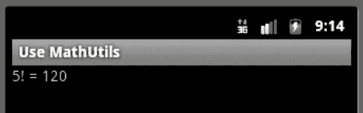
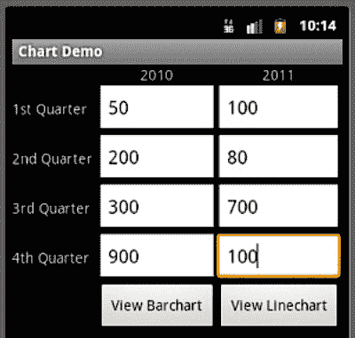
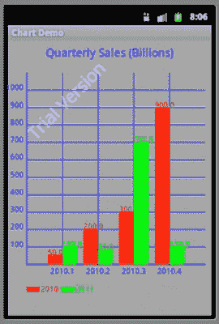
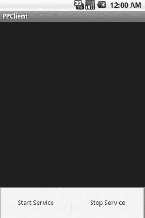

# 七、使用库

聪明的 Android 开发者通过利用库来更快地将他们的应用交付给市场，库通过提供先前创建和测试的代码来减少开发时间。开发人员可以创建和使用自己的库，也可以使用他人创建的库，或者两者兼而有之。

本章的初始秘籍向你介绍创建和使用你自己的库。随后的菜谱向您介绍了 Kidroid 的 skiChart 图表库，用于呈现条形图和折线图，以及 IBM 的 MQTT 库，用于在您的应用中实现轻量级推送消息。

**提示:**OpenIntents.org 发布了一个来自不同厂商的库列表，你可能会发现它对你的应用开发有所帮助(`[www.openintents.org/en/libraries](http://www.openintents.org/en/libraries)`)。

#### 7–1。创建 Java 库 jar

##### 问题

您希望创建一个库，存储与 Android 无关的代码，并且可以在您的 Android 和非 Android 项目中使用。

##### 解决办法

创建一个基于 JAR 的库，通过 JDK 命令行工具或 Eclipse 只访问 Java 5(和更早版本)API。

##### 它是如何工作的

假设您计划创建一个简单的面向数学的工具库。这个库将由一个带有各种`static`方法的`MathUtils`类组成。清单 7–1 展示了这个类的早期版本。

**清单 7–1。** *`MathUtils`通过`static`方法*实现面向数学的工具

`// MathUtils.java

package com.apress.mathutils;

public class MathUtils
{
   public static long factorial(long n)
   {
      if (n <= 0)
         return 1;
      else
         return n*factorial(n-1);
   }
}`

`MathUtils`目前由一个用于计算和返回阶乘的`static factorial()`方法组成(可能用于计算排列和组合)。您可能最终会扩展这个类来支持快速傅立叶变换和其他不受`java.lang.Math`类支持的数学运算。

**注意:**当创建一个存储 Android 无关代码的库时，确保只访问 Android 支持的标准 Java API(如 collections 框架)——不要访问不支持的 Java API(如 Swing)或特定于 Android 的 API(如 Android widgets)。另外，不要访问任何比 Java 版本 5 更新的标准 Java APIs。

###### 用 JDK 创造数学

用 JDK 开发一个基于 JAR 的库是很简单的。执行以下步骤创建一个包含`MathUtils`类的`mathutils.jar`文件:

1.  在当前目录中，创建一个包目录结构，由一个包含`apress`子目录的`com`子目录和一个包含`mathutils`子目录的`apress`子目录组成。
2.  将清单 7–1 的`MathUtils.java`源代码复制到存储在`mathutils`中的`MathUtils.java`文件中。
3.  假设当前目录包含`com`子目录，执行`javac com/apress/mathutils/MathUtils.java`编译`MathUtils.java`。一个`MathUtils.class`文件存储在`com/apress/mathutils`中。
4.  通过执行`jar cf mathutils.jar com/apress/mathutils/*.class`创建`mathutils.jar`。产生的`mathutils.jar`文件包含一个`com/apress/mathutils/MathUtils.class`条目。

###### 使用 Eclipse 创建数学工具

用 Eclipse 开发一个基于 JAR 的库有点复杂。执行以下步骤创建一个包含`MathUtils`类的`mathutils.jar`文件:

1.  假设您已经安装了在第一章中讨论的 Eclipse 版本，如果还没有运行的话，启动这个 IDE。
2.  从“文件”菜单中选择“新建”,从出现的弹出菜单中选择“Java 项目”。
3.  在出现的 *New Java Project* 对话框中，将 **`mathutils`** 输入到项目名称文本字段中，然后单击 Finish 按钮。
4.  展开包资源管理器的 mathutils 节点。
5.  右键单击 src 节点(在 mathutils 下面),并选择“新建”,然后从出现的弹出菜单中选择“包”。
6.  在出现的 *New Java Package* 对话框中，在 Name 字段中输入 **`com.apress.mathutils`** 并点击 Finish。
7.  右键单击生成的 com.apress.mathutils 节点，选择“新建”,然后在生成的弹出菜单中选择“类”。
8.  在出现的 *New Java Class* 对话框中，在 Name 字段中输入 **`MathUtils`** 并点击 Finish。
9.  用清单 7–1 中的替换生成的 MathUtils.java 编辑器窗口中的框架内容。
10.  右键单击 mathutils 项目节点，并从出现的弹出菜单中选择“构建项目”。(您可能必须先从“项目”菜单中取消选择“自动构建”。)
11.  右键单击 mathutils 项目节点，并从出现的弹出菜单中选择“导出”。
12.  在出现的 *Export* 对话框中，选择 Java 节点下的 JAR 文件并点击 Next 按钮。
13.  在生成的 JAR 导出窗格中，保留默认值，但在 JAR 文件文本字段中输入`mathutils.jar`。单击完成。产生的`mathutils.jar`文件创建在 Eclipse 工作区的根目录中。

#### 7–2。使用 Java 库 jar

##### 问题

您已经成功构建了`mathutils.jar`，并且想要学习如何将这个 JAR 文件集成到您的基于 Eclipse 的 Android 项目中。

##### 解决办法

您将创建一个带有`libs`目录的基于 Eclipse 的 Android 项目，并将`mathutils.jar`复制到这个目录中。

**注意:**通常的做法是将库(`.jar`文件和 Linux 共享对象库，`.so`文件)存储在 Android 项目目录的`libs`子目录中。Android build 系统自动获取在`libs`中找到的文件，并将它们集成到 apk 中。如果这个库是一个共享对象库，它被存储在一个以`lib`(不是`libs`)开始的`.apk`文件中。

##### 它是如何工作的

现在你已经创建了`mathutils.jar`，你需要一个 Android 应用来测试这个库。清单 7–2 将源代码呈现给一个`UseMathUtils`基于单个活动的应用，该应用计算 5 阶乘，活动随后输出该阶乘。

**清单 7–2。** *`UseMathUtils` **调用**`MathUtil``factorial()`**方法计算 5 阶乘***

`// UseMathUtils.java

package com.apress.usemathutils;

import android.app.Activity;

import android.os.Bundle;

import android.widget.TextView;

**import com.apress.mathutils.MathUtils;**

public class UseMathUtils extends Activity
{
   @Override
   public void onCreate(Bundle savedInstanceState)
   {
      super.onCreate(savedInstanceState);
      TextView tv = new TextView(this);
      tv.setText("5! = **"+MathUtils.factorial(5));**
      setContentView(tv);
   }
}`

假设 Eclipse 正在运行，完成以下步骤来创建一个`UseMathUtils`项目:

1.  从“文件”菜单中选择“新建”，并从出现的弹出菜单中选择“项目”。
2.  在 *New Project* 对话框中，展开向导树中的 Android 节点，选择该节点下的 Android 项目分支，点击 Next 按钮。
3.  在出现的*新 Android 项目*对话框中，在项目名称文本字段中输入 **`UseMathUtils`** 。输入的名称标识了存储`UseMathUtils`项目的文件夹/目录。
4.  如果“在工作区中创建新项目”单选按钮尚未选中，请选中它。
5.  在构建目标下，选中要用作`UseMathUtils`构建目标的适当 Android 目标的复选框。这个目标指定了您希望您的应用在哪个 Android 平台上构建。假设您只安装了 Android 2.3 平台，那么只有这个构建目标应该出现，并且应该已经被选中。
6.  在属性下，在应用名称文本字段中输入 **`Use MathUtils`** 。这个人类可读的标题将出现在 Android 设备上。继续，在包名文本字段中输入 **`com.apress.usemathutils`** 。该值是包名称空间(遵循与 Java 编程语言中的包相同的规则)，所有源代码都将驻留在该名称空间中。如果未选中创建活动复选框，请选中它，并在此复选框旁边的文本字段中输入 **`UseMathUtils`** 作为应用的开始活动的名称。未选中此复选框时，文本字段被禁用。最后，在 Min SDK Version 文本字段中输入整数 **`9`** ，以确定在 Android 2.3 平台上正确运行`UseMathUtils`所需的最低 API 级别。
7.  单击完成。

Eclipse 在 Package Explorer 窗口中创建一个`UseMathUtils`节点。完成以下步骤来设置所有文件:

1.  展开 UseMathUtils 节点，然后展开`src`节点，再展开`com.apress.usemathutils`节点。
2.  双击 UseMathUtils.java 节点(在 com.apress.usemathutils 下面)并用清单 7–2 替换结果窗口中的框架内容。
3.  右键单击 UseMathUtils 节点，在弹出的菜单中选择 New，然后选择 Folder。在出现的*新文件夹*对话框中，将`libs`输入到文件夹名称文本框中，并点击完成按钮。
4.  使用您平台的文件管理器程序(如 Windows XP 的 Windows 资源管理器)选择先前创建的`mathutils.jar`文件并将其拖到 libs 节点。如果出现*文件操作*对话框，保持选择复制文件单选按钮并点击确定按钮。
5.  右键单击 mathutils.jar 并在弹出菜单中选择“构建路径”,然后选择“配置构建路径”。
6.  在出现的 UseMathUtils 的*属性对话框中，选择 Libraries 选项卡并单击 Add Jars 按钮。*
7.  在出现的 *JAR 选择*对话框中，展开 UseMathUtils 节点，然后展开 libs 节点。选择 mathutils.jar，点击 OK 关闭 *JAR 选择*。第二次点击确定关闭 UseMathUtils 的*属性。*

您现在已经准备好运行这个项目了。从菜单栏中选择运行，然后从下拉菜单中选择运行。如果出现*运行方式*对话框，选择 Android 应用并点击确定。Eclipse 启动模拟器，安装该项目的 APK，并运行应用，其输出显示在图 7–1 中。

**图 7–1。** *`UseMathUtils`的简单用户界面可以扩展到让用户输入任意数字。*

**注意:**检查这个应用的`UseMathUtils.apk`文件(`jar tvf UseMathUtils.apk`，你不会找到一个`mathutils.jar`条目。相反，您会发现`classes.dex`，它包含应用的 Dalvik 可执行字节码。`classes.dex`还包含了`MathUtils` classfile 的 Dalvik 等价物，因为 Android 构建系统解包 JAR 文件，用`dx`工具处理它们的内容，将它们的 Java 字节码转换成 Dalvik 字节码，并将等价的 Dalvik 代码合并到`classes.dex`。

#### 7–3。创建 Android 库项目

##### 问题

您希望创建一个库来存储 Android 特定的代码，比如定制的小部件或有或没有资源的活动。

##### 解决办法

Android 2.2 和后续版本允许您创建 *Android 库项目*，这些项目是 Eclipse 项目，描述包含 Android 特定代码甚至资源的库。

##### 它是如何工作的

假设您想要创建一个库，其中包含一个可重用的定制小部件，描述一个游戏棋盘(用于下棋、跳棋，甚至是井字游戏)。清单 7–3 揭示了这个库的`GameBoard`类。

**清单 7–3。** *`GameBoard`描述一个可重复使用的自定义控件，用于绘制不同的游戏棋盘*

`// GameBoard.java

package com.apress.gameboard;

import android.content.Context;

import android.graphics.Canvas;
import android.graphics.Paint;

import android.view.View;

public class GameBoard extends View
{
   private int nSquares, colorA, colorB;

   private Paint paint;
   private int squareDim;

   public GameBoard(Context context, int nSquares, int colorA, int colorB)
   {
      super(context);
      this.nSquares = nSquares;
      this.colorA = colorA;
      this.colorB = colorB;
      paint = new Paint();
   }

   @Override
   protected void onDraw(Canvas canvas)
   {
      for (int row = 0; row < nSquares; row++)
      {`
`         paint.setColor(((row & 1) == 0) ? colorA : colorB);
         for (int col = 0; col < nSquares; col++)
         {
            int a = col*squareDim;
            int b = row*squareDim;
            canvas.drawRect(a, b, a+squareDim, b+squareDim, paint);
            paint.setColor((paint.getColor() == colorA) ? colorB : colorA);
         }
      }   
   }

   @Override
   protected void onMeasure(int widthMeasuredSpec, int heightMeasuredSpec)
   {
      // keep the view squared
      int width = MeasureSpec.getSize(widthMeasuredSpec);
      int height = MeasureSpec.getSize(heightMeasuredSpec);
      int d = (width == 0) ? height : (height == 0) ? width :
              (width < height) ? width : height;
      setMeasuredDimension(d, d);
      squareDim = width/nSquares;
   }
}`

Android 定制小部件基于子类`android.view.View`或其一个子类(如`android.widget.TextView`)的视图。`GameBoard`直接子类化`View`，因为它不需要任何子类功能。

`GameBoard`提供了几个字段，包括如下:

*   `nSquares`存储游戏棋盘每边的方块数。典型值包括 3(3x 3 板)和 8(8x 8 板)。
*   `colorA`存储偶数行上偶数方块的颜色，奇数行上奇数方块的颜色——行列编号从 0 开始。
*   `colorB`存储偶数行奇数方块的颜色，奇数行偶数方块的颜色。
*   `paint`存储对`android.graphics.Paint`对象的引用，该对象用于在绘制游戏板时指定方块颜色(`colorA`或`colorB`)。
*   `squareDim`存储正方形的尺寸——每边的像素数。

`GameBoard`的构造函数通过在同名字段中存储其`nSquares`、`colorA`和`colorB`参数来初始化这个小部件，并且还实例化了`Paint`类。然而，在这样做之前，它将其`context`参数传递给其`View`超类。

**注意:** V `iew`子类需要将一个`android.content.Context`实例传递给它们的`View`超类。这样做可以识别定制小部件运行的上下文(例如，一个活动)。定制小部件子类可以随后调用`View`的`Context getContext()`方法来返回这个`Context`对象，这样它们就可以调用`Context`方法来访问当前主题、资源等等。

Android 通过调用小部件的覆盖方法`protected void onDraw(Canvas canvas)`来告诉定制小部件绘制自己。`GameBoard`的`onDraw(Canvas)`方法通过调用`android.graphics.Canvas`的`void drawRect(float left, float top, float right, float bottom, Paint paint)`方法来响应，为每个行/列交叉点绘制每个方块。最后一个`paint`参数决定了那个方块的颜色。

Android 在调用`onDraw(Canvas)`之前，必须对 widget 进行测量。它通过调用小部件的 overriding `protected void onMeasure(int widthMeasureSpec, int heightMeasureSpec)`方法来完成这个任务，其中传递的参数指定了父视图强加的水平和垂直空间需求。小部件通常将这些参数传递给`View.MeasureSpec`嵌套类的`static int getSize(int measureSpec)`方法，根据传递的`measureSpec`参数返回小部件的精确宽度或高度。然后，必须将返回值或这些值的修改版本传递给`View`的`void setMeasuredDimension(int measuredWidth, int measuredHeight)`方法，以存储测得的宽度和高度。调用此方法失败会导致在运行时引发异常。因为游戏板应该是正方形的，`GameBoard`的`onMeasure(int, int)`方法将宽度和高度的最小值传递给`setMeasuredDimension(int, int)`以确保游戏板是正方形的。

现在您已经知道了`GameBoard`是如何工作的，您已经准备好创建一个存储这个类的库了。您将通过创建一个 Android 库项目来创建这个库。这样一个项目的好处是它是一个标准的 Android 项目，所以你可以像创建一个新的 app 项目一样创建一个新的 Android 库项目。

完成以下步骤来创建`GameBoard`项目:

1.  从“文件”菜单中选择“新建”，并从出现的弹出菜单中选择“项目”。
2.  在 *New Project* 对话框中，展开向导树中的 Android 节点，选择该节点下的 Android 项目分支，点击 Next 按钮。
3.  在出现的*新 Android 项目*对话框中，在项目名称文本字段中输入 **`GameBoard`** 。输入的名称标识了存储`GameBoard`项目的文件夹。
4.  如果“在工作区中创建新项目”单选按钮尚未选中，请选中它。
5.  在构建目标下，选中要用作`GameBoard`构建目标的适当 Android 目标的复选框。这个目标指定了您希望您的应用在哪个 Android 平台上构建。假设您只安装了 Android 2.3 平台，那么只有这个构建目标应该会出现，并且它应该已经被选中了。
6.  在“属性”下，将应用名称文本字段留空——该库不是一个应用，因此没有必要在此字段中输入值。继续，在包名文本字段中输入 **`com.apress.gameboard`** 。该值是包名称空间(遵循与 Java 编程语言中的包相同的规则)，所有库源代码都将驻留在该名称空间中。如果选中了创建活动复选框，则取消选中它。未选中此复选框时，文本字段被禁用。最后，在 Min SDK 版本文本字段中输入整数 **`9`** ，以确定在 Android 2.3 平台上正确运行`GameBoard`所需的最低 API 级别。
7.  单击完成。

尽管您创建 Android 库项目的方式与创建常规应用项目的方式相同，但您必须调整`GameBoard`的一些项目属性，以表明它是一个库项目:

1.  在包浏览器中，右键单击 GameBoard 并从弹出菜单中选择 Properties。
2.  在出现的游戏板属性对话框中，选择 Android 属性组并选中是库复选框。
3.  单击应用按钮，然后单击确定。

新的`GameBoard`项目现在被标记为 Android 库项目。然而，它还不包含包含清单 7–3 内容的`GameBoard.java`源文件。在包浏览器的 game board/src/com/a press/game board 节点下创建这个源文件。

如果您愿意，您可以构建这个库(例如，右键单击 GameBoard 节点并从弹出菜单中选择 Build Project)。然而，没有必要这样做。当您生成使用此库的项目时，将自动生成该项目。你将在下一个秘籍中学习如何做这件事。

**注意:**如果你构建了`GameBoard`库，你会发现一个`com/apress/gameboard`目录结构，其中`gameboard`包含`GameBoard.class`和几个面向资源的类文件(即使`GameBoard.java`不引用资源)。这就是基于 Android 库项目的库的本质。

#### 7–4。使用 Android 库项目

##### 问题

您已经成功构建了`GameBoard`库，并且想要学习如何将这个库集成到您的基于 Eclipse 的 Android 项目中。

##### 解决办法

在正在构建的 app 项目的属性中标识出要 Eclipse 的`GameBoard`库，并构建 app。

##### 它是如何工作的

现在你已经创建了`GameBoard`，你需要一个 Android 应用来测试这个库。清单 7–4 将源代码呈现给一个`UseGameBoard`基于单个活动的应用，该应用实例化这个库的`GameBoard`类，并将其放置在活动的视图层次结构中。

**清单 7–4。** *`UseGameBoard`将`GameBoard`小部件放入活动的视图层次*

`// UseGameBoard.java

package com.apress.usegameboard;

import android.app.Activity;

import android.graphics.Color;

import android.os.Bundle;

**import com.apress.gameboard.GameBoard;**

public class UseGameBoard extends Activity
{
   @Override
   public void onCreate(Bundle savedInstanceState)
   {
      super.onCreate(savedInstanceState);
      **GameBoard gb = new GameBoard(this, 8, Color.BLUE, Color.WHITE);**
      **setContentView(gb);**
   }
}`

假设 Eclipse 正在运行，完成以下步骤来创建一个`UseGameBoard`项目:

1.  从“文件”菜单中选择“新建”，并从出现的弹出菜单中选择“项目”。
2.  在*新建项目*对话框中，展开向导树中的 Android 节点，选择该节点下的 Android 项目分支，点击下一步按钮。
3.  在出现的*新 Android 项目*对话框中，在项目名称文本字段中输入 **`UseGameBoard`** 。输入的名称标识了存储`UseGameBoard`项目的文件夹。
4.  如果“在工作区中创建新项目”单选按钮尚未选中，请选中它。
5.  在构建目标下，选中要用作`UseGameBoard`构建目标的适当 Android 目标的复选框。这个目标指定了你希望你的应用在哪个 Android 平台上构建。假设您只安装了 Android 2.3 平台，那么只有这个构建目标应该会出现，并且它应该已经被选中了。
6.  在属性下，在应用名称文本字段中输入 **`Use GameBoard`** 。这个人类可读的标题将出现在 Android 设备上。继续，在包名文本字段中输入 **`com.apress.usegameboard`** 。该值是包名称空间(遵循与 Java 编程语言中的包相同的规则)，所有源代码都将驻留在该名称空间中。如果未选中创建活动复选框，请选中它，并在此复选框旁边的文本字段中输入 **`UseGameBoard`** 作为应用的开始活动的名称。未选中此复选框时，文本字段被禁用。最后，在 Min SDK Version 文本字段中输入整数 **`9`** ，以确定在 Android 2.3 平台上正确运行`UseGameBoard`所需的最低 API 级别。
7.  单击完成。

Eclipse 在 Package Explorer 窗口中创建一个`UseGameBoard`节点。完成以下步骤来设置所有文件:

1.  展开 UseGameBoard 节点，然后展开`src`节点，再展开`com.apress.usegameboard`节点。
2.  双击 UseGameBoard.java 节点(在 com.apress.usegameboard 下面)并用清单 7–4 替换结果窗口中的框架内容。
3.  右键单击“使用游戏板”节点，并从弹出菜单中选择“属性”。
4.  在随后出现的*UseGameBoard*的属性对话框中，选择 Android 类别并点击添加按钮。
5.  在弹出的*项目选择*对话框中，选择游戏板并点击确定。
6.  点击应用，然后点击确定关闭使用游戏板的*属性。*

您现在已经准备好运行这个项目了。从菜单栏中选择运行，然后从下拉菜单中选择运行。如果出现*运行方式*对话框，选择 Android 应用并点击确定。Eclipse 启动模拟器，安装该项目的 APK，并运行应用，其输出显示在图 7–2 中。

**图 7–2。** *`UseGameBoard`展示了一个蓝白相间的棋盘，可用作跳棋或国际象棋等游戏的背景。*

**注意:**如果你有兴趣创建和使用一个基于 Android library 项目的包含一个活动的库，可以查看 Google 的`TicTacToe`示例库项目(`[`developer.android.com/guide/developing/projects/projects-eclipse.html#SettingUpLibraryProject`](http://developer.android.com/guide/developing/projects/projects-eclipse.html#SettingUpLibraryProject)`)。

#### 7–5。制图

##### 问题

您正在寻找一个简单的库，让您的应用生成条形图或折线图。

##### 解决办法

虽然有几个 Android 库可以生成图表，但你可能更喜欢 Kidroid.com 的 kiChart 产品(`[www.kidroid.com/kichart/](http://www.kidroid.com/kichart/)`)的简单性。0.1 版本支持条形图和折线图，Kidroid 承诺在后续版本中添加新的图表类型。

到 kiChart 主页的链接提供了下载`kiChart-0.1.jar`(库)和`kiChart-Help.pdf`(描述库的文档)的链接。

##### 它是如何工作的

kiChart 的文档指出条形图和折线图支持多个数据系列。此外，它还声明可以将图表导出为图像文件，并且可以定义图表参数(如字体颜色、字体大小、边距等)。

然后，该文档显示了一对由演示应用呈现的示例线图和条形图的截图。这些截图后面是来自这个演示的代码——特别是,`LineChart`图表活动类。

`LineChart`的源代码揭示了建立图表的基本原理，解释如下:

1.  创建一个扩展`com.kidroid.kichart.ChartActivity`类的活动。此活动呈现条形图或折线图。
2.  在活动的`onCreate(Bundle)`方法中，创建一个横轴标签的`String`数组，并为每组条或每条线创建一个浮点数据数组。
3.  创建一个由`com.kidroid.kichart.model.Aitem` (axis item)实例组成的数组，并用存储数据数组的`Aitem`对象填充这个数组。每个`Aitem`构造函数调用都要求您传递一个`android.graphics.Color`值来标识与数据数组相关联的颜色(其显示的值和条或线都以该颜色显示)、一个`String`值来将标签与颜色和数据数组以及数据数组本身相关联。
4.  如果想显示条形图，实例化`com.kidroid.kichart.view.BarView`类；如果想显示折线图，实例化`com.kidroid.kichart.view.LineView`类。
5.  调用该类的`public void setTitle(String title)`方法来指定图表的标题。
6.  调用该类的`public void setAxisValueX(String[] labels)`方法来指定图表的水平标签。
7.  调用该类的`public void setItems(Aitem[] items)`方法来指定图表的数据项数组。
8.  用图表实例作为参数调用`setContentView()`来显示图表。
9.  您不必担心为垂直轴选择一系列值，因为 kiChart 会替您完成这项任务。

源代码后面有一个类图，展示了 kiChart 的类并显示了它们之间的关系。例如，`com.kidroid.kichart.view.ChartView`是`com.kidroid.kichart.view.AxisView`的超类，它超类`BarView`和`LineView`。

然后记录每个类的属性和`ChartView`的`public boolean exportImage(String filename)`方法。此方法允许您将图表输出到文件中，如果成功则返回 true，如果不成功则返回 false。

**提示:**要影响垂直轴上显示的值的范围，您需要使用`AxisView`的`intervalCount`、`intervalValue`和`valueGenerate`属性。

在实践中，您会发现 kiChart 很容易使用。例如，考虑一个`ChartDemo`应用，它的主要活动(也称为`ChartDemo`)提供了一个用户界面，让用户通过它的八个文本字段输入 2010 年和 2011 年每一年的季度销售额。主活动还提供了一对按钮，允许用户通过单独的`BarChart`和`LineChart`活动在条形图或折线图的上下文中查看这些数据。

清单 7–5 展示了`ChartDemo`的源代码。

**清单 7–5。** *`ChartDemo`描述输入图表数据值并启动条形图或折线图活动的活动*

`// ChartDemo.java

package com.apress.chartdemo;

import android.app.Activity;

import android.content.Intent;

import android.os.Bundle;

import android.view.View;

import android.widget.AdapterView;
import android.widget.Button;`
`import android.widget.EditText;

public class ChartDemo extends Activity
{
   @Override
   public void onCreate(Bundle savedInstanceState)
   {
      super.onCreate(savedInstanceState);
      setContentView(R.layout.main);

      Button btnViewBC = (Button) findViewById(R.id.viewbc);
      AdapterView.OnClickListener ocl;
      ocl = new AdapterView.OnClickListener()
      {
         @Override
         public void onClick(View v)
         {
            final float[] data2010 = new float[4];
            int[] ids = { R.id.data2010_1, R.id.data2010_2, R.id.data2010_3,
                          R.id.data2010_4 };
            for (int i = 0; i < ids.length; i++)
            {
               EditText et = (EditText) findViewById(ids[i]);
               String s = et.getText().toString();
               try
               {
                  float input = Float.parseFloat(s);
                  data2010[i] = input;
               }
               catch (NumberFormatException nfe)
               {
                  data2010[i] = 0;
               }
            }
            final float[] data2011 = new float[4];
            ids = new int[] { R.id.data2011_1, R.id.data2011_2,
                              R.id.data2011_3, R.id.data2011_4 };
            for (int i = 0; i < ids.length; i++)
            {
               EditText et = (EditText) findViewById(ids[i]);
               String s = et.getText().toString();
               try
               {
                  float input = Float.parseFloat(s);
                  data2011[i] = input;
               }
               catch (NumberFormatException nfe)
               {
                  data2011[i] = 0;
               }
            }
            Intent intent = new Intent(ChartDemo.this, BarChart.class);
            intent.putExtra("2010", data2010);
            intent.putExtra("2011", data2011);
            startActivity(intent);
         }
      };`
`      btnViewBC.setOnClickListener(ocl);

      Button btnViewLC = (Button) findViewById(R.id.viewlc);
      ocl = new AdapterView.OnClickListener()
      {
         @Override
         public void onClick(View v)
         {
            final float[] data2010 = new float[4];
            int[] ids = { R.id.data2010_1, R.id.data2010_2, R.id.data2010_3,
                          R.id.data2010_4 };
            for (int i = 0; i < ids.length; i++)
            {
               EditText et = (EditText) findViewById(ids[i]);
               String s = et.getText().toString();
               try
               {
                  float input = Float.parseFloat(s);
                  data2010[i] = input;
               }
               catch (NumberFormatException nfe)
               {
                  data2010[i] = 0;
               }
            }
            final float[] data2011 = new float[4];
            ids = new int[] { R.id.data2011_1, R.id.data2011_2,
                              R.id.data2011_3, R.id.data2011_4 };
            for (int i = 0; i < ids.length; i++)
            {
               EditText et = (EditText) findViewById(ids[i]);
               String s = et.getText().toString();
               try
               {
                  float input = Float.parseFloat(s);
                  data2011[i] = input;
               }
               catch (NumberFormatException nfe)
               {
                  data2011[i] = 0;
               }
            }
            Intent intent = new Intent(ChartDemo.this, LineChart.class);
            intent.putExtra("2010", data2010);
            intent.putExtra("2011", data2011);
            startActivity(intent);
         }
      };
      btnViewLC.setOnClickListener(ocl);
   }
}`

`ChartDemo`在它的`onCreate(Bundle)`方法中实现它的所有逻辑。这个方法主要是设置它的内容视图，并在视图的两个按钮上附加一个点击监听器。

因为这些监听器几乎相同，我们将只考虑附加到`viewbc`(查看条形图)按钮的监听器的代码。作为对这个按钮被点击的响应，监听器的`onClick(View)`方法被调用来执行以下任务:

1.  用对应于 2010 年数据的四个文本字段的值填充一个`data2010`浮点数组。
2.  用对应于 2011 年数据的四个文本字段的值填充一个`data2011`浮点数组。
3.  创建一个`Intent`对象，将`BarChart.class`指定为要启动的活动的类文件。
4.  将`data2010`和`data2011`数组存储在该对象中，以便可以从`BarChart`活动中访问它们。
5.  发起`BarChart`活动。

清单 7–6 展示了`BarChart`的源代码。

**清单 7–6。** *`BarChart`描述条形图活动*

`// BarChart.java

package com.apress.chartdemo;

**import com.kidroid.kichart.ChartActivity;**

**import com.kidroid.kichart.model.Aitem;**

**import com.kidroid.kichart.view.BarView;**

import android.graphics.Color;

import android.os.Bundle;

public class BarChart extends ChartActivity
{
   @Override
   public void onCreate(Bundle savedInstanceState)
   {
      super.onCreate(savedInstanceState);
      Bundle bundle = getIntent().getExtras();
      float[] data2010 = bundle.getFloatArray("2010");
      float[] data2011 = bundle.getFloatArray("2011");
      String[] arrX = new String[4];
      arrX[0] = "2010.1";
      arrX[1] = "2010.2";
      arrX[2] = "2010.3";
      arrX[3] = "2010.4";
      **Aitem[] items = new Aitem[2];**
      **items[0] = new Aitem(Color.RED, "2010", data2010);**
      **items[1] = new Aitem(Color.GREEN, "2011", data2011);**
      **BarView bv = new BarView(this);**
      **bv.setTitle("Quarterly Sales (Billions)");**
      **bv.setAxisValueX(arrX);**`
`      **bv.setItems(items);**
      setContentView(bv);
   }
}`

`BarChart`首先通过调用其继承的`Intent getIntent()`方法获得对传递给它的`Intent`对象的引用。然后，它使用这个方法检索对`Intent`对象的`Bundle`对象的引用，该对象存储数据项的浮点数组。通过调用`Bundle`的`float[] getFloatArray(String key)`方法来检索每个数组。

`BarChart`接下来为图表的 X 轴构建一个标签的`String`数组，并创建一个用两个`Aitem`对象填充的`Aitem`数组。第一个对象存储 2010 年的数据值，并将这些值与红色和作为图例值的 2010 相关联；第二个对象用绿色和图例值 2011 存储 2011 数据值。

在实例化`BarView`之后，`BarChart`调用这个对象的`setTitle(String)`方法来建立图表的标题，`setAxisValueX(String[])`方法将 X 轴标签的数组传递给对象，`setItems(Aitem[])`方法将`Aitem`数组传递给对象。然后将`BarView`对象传递给`setContentView()`以显示条形图。

**注意:**因为`LineChart`与`BarChart`几乎相同，所以这个类的源代码不在本章中介绍。您可以通过将`BarView bv = new BarView(this);`改为`LineView bv = new LineView(this);`来轻松创建`LineChart`。此外，为了最佳实践，您可能应该将变量`bv`重命名为`lv`。还有别忘了把`import com.kidroid.kichart.view.BarView;`改成`import com.kidroid.kichart.view.LineView;`。

清单 7–7 展示了`main.xml`，它描述了构成`ChartDemo`用户界面的布局和小部件。

**清单 7–7。** *`main.xml`描述图表演示活动的布局*

`<?xml version="1.0" encoding="utf-8"?>
<TableLayout xmlns:android="http://schemas.android.com/apk/res/android"
             android:layout_width = "fill_parent"
             android:layout_height="fill_parent"
             android:stretchColumns="*">
  <TableRow>
    <TextView android:text=""/>
    <TextView android:text="2010"
              android:layout_gravity="center"/>
    <TextView android:text="2011"
              android:layout_gravity="center"/>
  </TableRow>

  <TableRow>
    <TextView android:text="1st Quarter"/>
    <EditText android:id="@+id/data2010_1"
              android:inputType="numberDecimal"
              android:maxLines="1"/>`
`    <EditText android:id="@+id/data2011_1"
              android:inputType="numberDecimal"
              android:maxLines="1"/>
  </TableRow>

  <TableRow>
    <TextView android:text="2nd Quarter"/>
    <EditText android:id="@+id/data2010_2"
              android:inputType="numberDecimal"
              android:maxLines="1"/>     <EditText android:id="@+id/data2011_2"
              android:inputType="numberDecimal"
              android:maxLines="1"/>
  </TableRow>

  <TableRow>
    <TextView android:text="3rd Quarter"/>
    <EditText android:id="@+id/data2010_3"
              android:inputType="numberDecimal"
              android:maxLines="1"/>
    <EditText android:id="@+id/data2011_3"
              android:inputType="numberDecimal"
              android:maxLines="1"/>
  </TableRow>

  <TableRow>
    <TextView android:text="4th Quarter"/>
    <EditText android:id="@+id/data2010_4"
              android:inputType="numberDecimal"
              android:maxLines="1"/>
    <EditText android:id="@+id/data2011_4"
              android:inputType="numberDecimal"
              android:maxLines="1"/>
  </TableRow>

  <TableRow>
    <TextView android:text=""/>
    <Button android:id="@+id/viewbc"
            android:text="View Barchart"/>
    <Button android:id="@+id/viewlc"
            android:text="View Linechart"/>
  </TableRow>
</TableLayout>`

`main.xml`通过`<TableLayout>`标签描述了一个表格布局，其中用户界面分为六行三列。这个标签的`layout_width`和`layout_height`属性的`"fill_parent"`赋值告诉这个布局占据活动的整个屏幕。对这个标签的`stretchColumns`属性的`"*"`赋值告诉这个布局给每一列一个相同的宽度。

**注:***可伸缩柱*是一种可以在宽度上扩展以适应任何可用空间的柱。要指定哪些列是可伸缩的，请将一个以逗号分隔的从 0 开始的整数列表分配给`stretchColumns`。例如，`"0, 1"`指定列 0(最左边的列)和列 1 是可拉伸的。`"*"`赋值表示所有列都是可拉伸的，这使得它们具有相同的宽度。

嵌套在`<TableLayout>`和它的`</TableLayout>`伙伴中的是一系列的`<TableRow>`标签。每个`<TableRow>`标签描述了表格布局中单个行的内容，这些内容是零个或多个视图的变体(例如`TextView`和`EditText`)，其中每个视图构成一列。

**注**:为简洁起见，字符串值直接存储在`main.xml`中，而不是存储在单独的`strings.xml`文件中。把它当作一个引入`strings.xml`的练习，并用对存储在`strings.xml`中的字符串的引用替换这些文字字符串。

清单 7–8 展示了这个应用的`AndroidManifest.xml`文件，它描述了这个应用及其活动。

**清单 7–8。** *`AndroidManifest.xml`为`ChartDemo` App* 汇集一切

`<?xml version="1.0" encoding="utf-8"?>
<manifest xmlns:android="http://schemas.android.com/apk/res/android"
          package="com.apress.chartdemo"
          android:versionCode="1"
          android:versionName="1.0">
   <application android:icon="@drawable/icon" android:label="@string/app_name">
      <activity android:name=".ChartDemo"
                android:label="@string/app_name">
         <intent-filter>
            <action android:name="android.intent.action.MAIN" />
            <category android:name="android.intent.category.LAUNCHER" />
         </intent-filter>
      </activity>
      **<activity android:name=".BarChart"/>**
      **<activity android:name=".LineChart"/>**
   </application>
   <uses-sdk android:minSdkVersion="9" />
</manifest>`

在清单中包含每个`BarChart`和`LineChart`活动的`<activity>`标记是很重要的。否则，运行时对话框会显示以下消息:“`The application Chart Demo (process com.apress.chartdemo) has stopped unexpectedly. Please try again.”`

图 7–3 显示了`ChartDemo`的主要活动，每个季度输入样本值。

**图 7-3。** *`ChartDemo`允许您输入八个数据值，并选择通过条形图或折线图显示这些值。*

输入上述数据值后，点击查看条形图按钮启动`BarChart`活动，显示图 7–4 中所示的条形图。

**图 7–4。** *`BarChart`通过一系列彩色条显示每个数组的数据值。*

除了呈现一个条形图，图 7–4 揭示了正在使用 kiChart 的试用版。你需要联系 Kidroid.com，了解许可以及如何获得不显示此消息的 kiChart 版本。

#### 7–6 岁。实用推送消息

##### 问题

谷歌的云到设备消息传递(C2DM)框架(`[`code.google.com/android/c2dm/index.html`](http://code.google.com/android/c2dm/index.html)`)旨在实现设备的推送消息传递，它有许多缺点，这些缺点可能会影响它作为推送消息传递的实用解决方案。你的应用需要一个更通用的推送解决方案。

**谷歌 C2DM 的局限性**

C2DM 是谷歌开发的一项技术，通过可扩展消息和存在协议(XMPP)在 Android 设备上运行，XMPP 是聊天客户端的常见实现。通过进一步的观察，C2DM 有许多必需的属性，这些属性通常会降低它在应用中的有用性:

*   **要求最低 API 级别为 8:** 虽然这一限制不会永远成为一个重大限制，但现在希望在运行 2.2 之前版本的 Android 设备上支持推送消息的应用将无法使用 C2DM。
*   **需要设备上的 Google 帐户和 Google API:**C2DM 在 GTalk 聊天服务创建的 XMPP 通道上运行。如果用户在不包含 Google APIs(以及 GTalk 应用)的 Android 设备上运行，或者如果他们没有在设备上输入有效的 Google 帐户，您的应用将无法在该设备上注册 C2DM 消息。
*   **利用 HTTP POST 进行主机应用和 C2DM 服务器之间的事务:**从应用的服务器端，要发送到设备的消息通过对每条消息使用单独的 HTTP POST 请求被传递到 C2DM 服务器。随着需要发送的消息数量的增加，这种机制变得越来越慢，以至于 C2DM 在某些时间关键的应用中可能不是可行的选择。

##### 解决办法

利用 IBM 的 MQTT 库在您的应用中实现轻量级推送消息。MQTT 客户端库由 IBM 以纯 Java 实现的形式提供，这意味着它可以在任何 Android 设备上使用，没有特定 API 级别的限制。

MQTT 系统由三个主要组件组成:

*   **客户端应用:**在设备上运行，并向消息代理注册一组给定的“主题”来接收消息。
*   **消息代理:**处理客户端的注册，并根据客户端的“主题”将来自服务器应用的消息分发到每个客户端
*   **服务器应用:**负责向代理发布消息。

邮件按主题过滤。主题以树形格式定义，由路径字符串表示。通过提供适当的路径，客户端可以订阅特定的主题或子主题组。例如，假设我们为应用定义了两个主题，如下所示:

`examples/one
examples/two`

客户端可以通过订阅精确的完整路径字符串来订阅任一主题。但是，如果客户希望订阅这两个主题(以及该组中稍后可能创建的任何其他主题)，则可以通过以下方式方便地进行订阅:

`examples/#`

通配符“#”表示该客户对示例组中的所有主题都感兴趣。

在这个菜谱中，我们将重点关注在 Android 设备上使用 MQTT 库实现客户端应用。IBM 为其他组件的开发和测试提供了优秀的工具，我们也将在这里展示这些工具。

##### 它是如何工作的

MQTT Java 库可以从 IBM 的以下位置免费下载:`www-01.ibm.com/support/docview.wss?uid=swg24006006`。除了库 JAR 之外，下载档案还包含示例代码、API Javadoc 和使用文档。

从下载档案中找到`wmqtt.jar`文件。这是 Android 项目中必须包含的库。按照惯例，这意味着应该在您的项目目录中创建一个`/libs`目录，并且应该在那里插入这个 JAR。

为了测试您的客户机实现，IBM 提供了非常小的消息代理(RSMB)。RSMB 可以在以下位置下载:`[www.alphaworks.ibm.com/tech/rsmb](http://www.alphaworks.ibm.com/tech/rsmb)`。

RSMB 是一个多平台下载，包括用于消息代理和发布消息的应用的命令行工具。IBM 为此工具提供的许可证禁止在生产环境中使用它；此时，您将需要推出自己的解决方案，或者使用众多可用的开源实现之一。然而，对于移动客户端的开发，RSMB 再好不过了。

###### 客户端示例

因为监视传入的推送消息是一个不确定的、长期的操作，所以让我们看一个将基本功能放入服务的例子。

**注意:**提醒一下，您的项目目录中应该有`libs/wmqtt.jar`，并在您的项目构建路径中被引用。

清单 7–9 展示了一个示例 MQTT 服务的源代码。

**清单 7–9。** *MQTT 示例服务*

`//ClientService.java
package com.apress.pushclient;

import android.app.AlarmManager;
import android.app.PendingIntent;
import android.app.Service;
import android.content.BroadcastReceiver;
import android.content.Context;
import android.content.Intent;
import android.content.IntentFilter;
import android.os.Handler;
import android.os.IBinder;
import android.os.Message;
import android.widget.Toast;
//Imports required from the MQTT Library JAR
import com.ibm.mqtt.IMqttClient;
import com.ibm.mqtt.MqttClient;
import com.ibm.mqtt.MqttException;
import com.ibm.mqtt.MqttPersistenceException;
import com.ibm.mqtt.MqttSimpleCallback;

public class ClientService extends Service implements MqttSimpleCallback {

    //Location where broker is running
    privatestaticfinal String HOST = HOSTNAME_STRING_HERE;
    privatestaticfinal String PORT = "1883";
    //30 minute keep-alive ping
    privatestaticfinalshortKEEP_ALIVE = 60 * 30;
    //Unique identifier of this device
    privatestaticfinal String CLIENT_ID = "apress/"+System.currentTimeMillis();
    //Topic we want to watch for
    privatestaticfinal String TOPIC = "apress/examples";

    privatestaticfinal String ACTION_KEEPALIVE = "com.examples.pushclient.ACTION_KEEPALIVE";

    private IMqttClient mClient;
    private AlarmManager mManager;
    private PendingIntent alarmIntent;

    @Override
    public void onCreate() {
        super.onCreate();
        mManager = (AlarmManager)getSystemService(Context.ALARM_SERVICE);

        Intent intent = new Intent(ACTION_KEEPALIVE);
        alarmIntent = PendingIntent.getBroadcast(this, 0, intent, 0);`
`        registerReceiver(mReceiver, new IntentFilter(ACTION_KEEPALIVE));

        try {
            //Format: tcp://hostname@port
            String connectionString = String.format("%s%s@%s", MqttClient.TCP_ID, HOST, PORT);
            mClient = MqttClient.createMqttClient(connectionString, null);
        } catch (MqttException e) {
            e.printStackTrace();
            //Can't continue without a client
            stopSelf();
        }
    }

    @Override
    public void onStart(Intent intent, int startId) {
        //Callback on Android devices prior to 2.0
        handleCommand(intent);
    }

    @Override
    publicint onStartCommand(Intent intent, int flags, int startId) {
        //Callback on Android devices 2.0 and later
        handleCommand(intent);
        //If Android kills this service, we want it back when possible
        return START_STICKY;
    }

    private void handleCommand(Intent intent) {
        try {
            //Make a connection
            mClient.connect(CLIENT_ID, true, KEEP_ALIVE);
            //Target MQTT callbacks here
            mClient.registerSimpleHandler(this);
            //Subscribe to a topic
            String[] topics = new String[] { TOPIC };
            //QoS of 0 indicates fire once and forget
            int[] qos = newint[] { 0 };
            mClient.subscribe(topics, qos);

            //Schedule a ping
            scheduleKeepAlive();
        } catch (MqttException e) {
            e.printStackTrace();
        }
    }

    @Override
    public void onDestroy() {
        super.onDestroy();
        unregisterReceiver(mReceiver);
        unscheduleKeepAlive();

        if(mClient != null) {
            try {
                mClient.disconnect();
                mClient.terminate();`
`            } catch (MqttPersistenceException e) {
                e.printStackTrace();
            }
            mClient = null;
        }
    }

    //Handle incoming message from remote
    private Handler mHandler = new Handler() {
        @Override
        public void handleMessage(Message msg) {
            String incoming = (String)msg.obj;
            Toast.makeText(ClientService.this, incoming, Toast.LENGTH_SHORT).show();
        }
    };

    //Handle ping alarms to keep the connection alive
    private BroadcastReceiver mReceiver = new BroadcastReceiver() {
        @Override
        public void onReceive(Context context, Intent intent) {
            if(mClient == null) {
                return;
            }
            //Ping the MQTT service
            try {
                mClient.ping();
            } catch (MqttException e) {
                e.printStackTrace();
            }
            //Schedule the next alarm
            scheduleKeepAlive();
        }
    };

    private void scheduleKeepAlive() {
        long nextWakeup = System.currentTimeMillis() + (KEEP_ALIVE * 1000);
        mManager.set(AlarmManager.RTC_WAKEUP, nextWakeup, alarmIntent);
    }

    private void unscheduleKeepAlive() {
        mManager.cancel(alarmIntent);
    }

    /* MqttSimpleCallback Methods */

    @Override
    public void connectionLost() throws Exception {
        mClient.terminate();
        mClient = null;
        stopSelf();
    }

    @Override
    public void publishArrived(String topicName, byte[] payload, int qos, boolean retained) throws Exception {
        //Be wary of UI related code here!
        //Best to use a Handler for UI or Context operations`
`        StringBuilder builder = new StringBuilder();
        builder.append(topicName);
        builder.append('\n');
        builder.append(new String(payload));
        //Pass the message up to our handler
        Message receipt = Message.obtain(mHandler, 0, builder.toString());
        receipt.sendToTarget();
    }

    /*Unused method*/
    //We are not using this service as bound
    //It is explicitly started and stopped with no direct connection
    @Override
    public IBinder onBind(Intent intent) { returnnull; }
}`

**重要提示:**这个`Service`很可能会与远程服务器通信，因此您必须在应用清单中声明`android.permission.INTERNET`，以及带有`<service>`标签的`Service`本身。

为了子类化`Service`，必须提供`onBind()`的实现。在这种情况下，我们的例子不需要提供一个`Binder`接口，因为活动永远不需要直接挂钩到调用方法中。因此，这个必需的方法只返回 null。这个`Service`被设计成接收启动和停止的明确指令，在其间运行一段不确定的时间。

当`Service`被创建时，一个`MqttClient`对象也被使用`createMqttClient()`实例化；这个客户机将消息代理主机的位置作为一个字符串。连接字符串的格式为`tcp://hostname@port`。在本例中，选择的端口号是 1883，这是 MQTT 通信的默认端口号。如果您选择不同的端口号，您应该验证您的服务器实现是否在匹配的端口上运行。

从这一点开始，`Service`保持空闲，直到发出启动命令。一旦收到开始命令(通过调用`Context.startService()`从外部发出)，将调用`onStart()`或`onStartCommand()`(取决于设备上运行的 Android 版本)。在后一种情况下，服务返回`START_STICKY`，这是一个常量，告诉系统应该让这个服务继续运行，如果它因为内存原因被提前终止，就重新启动它。

一旦启动，服务将向 MQTT 消息代理注册，传递一个惟一的客户机 ID 和一个保活时间。为了简单起见，这个例子根据服务创建时的当前时间来定义客户机 ID。在生产中，更独特的标识符，如 Wi-Fi MAC 地址或`TelephonyManager.getDeviceId()`可能更合适，记住这两种选择都不能保证出现在所有设备上。

keep-alive 参数是时间(以秒为单位),代理应该使用该时间使到该客户端的连接超时。为了避免这种超时，客户应该发布消息或定期 ping 代理。我们将很快更全面地讨论这项任务。

在启动过程中，客户端还订阅了一个主题。注意，`subscribe()`方法将数组作为参数；一个客户端可以在一个方法调用中订阅多个主题。每个主题还订阅有请求的服务质量(QoS)值。对移动设备请求的最委婉的值是零，告诉代理只发送一次消息而不需要确认。这样做减少了代理和设备之间所需的握手次数。

随着连接的激活和注册，来自远程代理的任何传入消息都将导致对`publishArrived()`的调用，并传递关于该消息的数据。这个方法可以在任何由`MqttClient`创建和维护的后台线程上调用，所以不要在这里直接做任何与主线程相关的事情是很重要的。在本例中，所有传入的消息都被传递到一个本地的`Handler`，以保证结果`Toast`被发送到主线程上进行显示。

实现 MQTT 客户机时需要一项维护任务，那就是 ping 代理以保持连接活动。为了完成这个任务，`Service`向`AlarmManager`注册，以根据匹配保活参数的时间表触发广播。即使设备当前处于睡眠状态，也必须完成该任务，因此每次使用`AlarmManager.RTC_WAKEUP`设置闹铃。当每个警报触发时，`Service`简单地调用`MqttClient.ping()`并安排下一次保活更新。

由于这一要求的持续性质，为保活定时器选择低频间隔是谨慎的；在这个例子中，我们选择了 30 分钟。该定时器值代表了减少设备上所需更新的频率(以节省功率和带宽)和远程代理意识到远程设备不再存在并超时之前的等待时间之间的平衡。

当不再需要推送服务时，对`Context.stopService()`的外部调用将导致对`onDestroy()`的调用。在这里，`Service`拆除 MQTT 连接，删除任何未决的警报，并释放所有资源。作为`MqttSimpleCallback`接口的一部分实现的第二个回调是`onConnectionLost()`，表示意外的断开。在这些情况下，`Service`会像手动停止请求一样自行停止。

###### 测试客户端

为了测试设备的消息传递，您需要在您的机器上启动一个 RSMB 实例。从命令行中，导航到您解压缩下载的位置，然后导航到与您的计算机平台(Windows、Linux、Mac OS X)匹配的目录。从这里，只需执行`broker`命令，代理服务将开始在您的机器上运行，位于`localhost:1883`:

`CWNAN9999I Really Small Message Broker
CWNAN9997I Licensed Materials - Property of IBM
CWNAN9996I Copyright IBM Corp. 2007, 2010 All Rights Reserved
…`
`CWNAN0014I MQTT protocol starting, listening on port 1883`

此时，您可以连接到服务并发布消息或注册接收消息。为了对这个`Service`进行测试，清单 7–10 和清单 7–11 创建了一个简单的`Activity`，可以用来启动和停止服务。

**清单 7–10。** *res/menu/home.xml*

`<?xml version="1.0" encoding="utf-8"?>
<menu xmlns:android="http://schemas.android.com/apk/res/android">
  <item
    android:id="@+id/menu_start"
    android:title="Start Service" />
  <item
    android:id="@+id/menu_stop"
    android:title="Stop Service" />
</menu>`

**清单 7–11。** *活动控制 MQTT 服务*

`//ClientActivity.java
package com.apress.pushclient;

import android.app.Activity;
import android.content.Intent;
import android.os.Bundle;
import android.view.Menu;
import android.view.MenuItem;

public class ClientActivity extends Activity {

    private Intent serviceIntent;

    @Override
    public void onCreate(Bundle savedInstanceState) {
        super.onCreate(savedInstanceState);

        **serviceIntent = new Intent(this, ClientService.class);**
    }

    @Override
    public boolean onCreateOptionsMenu(Menu menu) {
        getMenuInflater().inflate(R.menu.home, menu);
        return true;
    }

    @Override
    public boolean onOptionsItemSelected(MenuItem item) {
        switch(item.getItemId()) {
        case R.id.menu_start:
            **startService(serviceIntent);**
            return true;
        case R.id.menu_stop:
            **stopService(serviceIntent);**
            return true;
        }`
`        return super.onOptionsItemSelected(item);
    }
}`

清单 7–11 创建了一个`Intent`，它将被两个菜单选项用来随意启动和停止服务(参见图 7–5)。通过按下菜单按钮并选择“启动服务”，MQTT 连接将启动并为设备注册主题为“进程/示例”的消息

**图 7–5。** *活动控制服务*

**注意:**示例服务中的`HOST`值需要指向运行您的 RSMB 实例的机器。即使你在同一台机器上的模拟器中测试，这个值也是**而不是** `localhost`！至少，您必须将模拟器或设备指向运行您的代理的机器的 IP 地址。

Android 设备成功注册了来自代理的推送消息后，打开另一个命令行窗口，导航到执行`broker`的同一个目录。另一个命令`stdinpub`可用于连接到代理实例，并将消息发布到设备。从命令行键入以下命令:

`stdinpub apress/examples`

该命令将注册一个客户端，以发布主题与我们的示例相匹配的消息。您将看到以下结果:

`Using topic apress/examples
Connecting`

现在你可以输入任何你喜欢的信息，然后回车。按下 Enter 键后，消息将被发送到代理，并被推送到注册的设备。尽可能多次这样做，然后使用 CTRL-C 退出程序。CTRL-C 还将终止代理服务。

**提示:**【RSMB】还包含第三个命令`stdoutsub`，用于向您的本地代理服务订阅一组主题。这个命令让您完全关闭循环，并测试问题是发生在测试套件中还是您的 Android 应用中。

### 总结

聪明的 Android 开发者通过利用库来更快地将他们的应用交付给市场，库通过提供先前创建和测试的代码来减少开发时间。

本章的初始秘籍向您介绍了创建和使用您自己的库的主题。具体来说，您学习了如何创建和使用 Java 库 jar，其代码仅限于 Java 5(或更早版本)API 和 Android 库项目。

尽管您可能会创建自己的库来避免重复劳动，但您可能也需要使用其他人的库。例如，如果您需要一个简单的图表库，您可能想看看 kiChart，它有助于条形图和折线图的显示。

如果你正在使用云，你可能会决定使用谷歌的 C2DM 框架。但是，因为这个框架有许多缺点(比如要求最低 API 级别为 8)，所以您可以考虑利用 IBM 的 MQTT 库在您的应用中实现轻量级的推送消息。