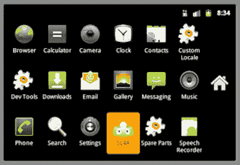

# 八、附录 A：Android 脚本层

Android 脚本层(SL4A)，之前被称为 Android 脚本环境，是一个在 Android 设备上安装脚本语言解释器并通过这些解释器运行脚本的平台。脚本可以访问 Android 应用可用的许多 API，但有一个大大简化的界面，使事情更容易完成。

**注意:** SL4A 目前只支持 Python、Perl、JRuby、Lua、BeanShell、Rhino JavaScript 和 Tcl 脚本语言。

您可以在*终端窗口*(命令窗口)、后台或通过区域设置(`[www.twofortyfouram.com/](http://www.twofortyfouram.com/)`)交互运行脚本。 *Locale* 是一款 Android 应用，可以让你在预定的时间或者满足其他条件时运行脚本(例如，当你进入剧院或法庭时，运行脚本将你的手机铃声模式改为振动)。

### 安装 SL4A

在使用 SL4A 之前，您必须安装它。你可以从谷歌托管的项目网站(`[`code.google.com/p/android-scripting`](http://code.google.com/p/android-scripting)`)下载最新版本的 APK 文件(`sl4a_r3.apk`)到你的设备上。为此，请使用您的条形码阅读器应用扫描网站上显示的条形码图像。

如果你使用的是 Android 模拟器，点击条形码图片下载`sl4a_r3.apk`。然后执行`adb install sl4a_r3.apk`在当前运行的仿真设备上安装这个应用。(如果收到设备离线消息，您可能需要尝试多次。)图 A–1 显示了 SL4A 在应用启动器屏幕上的图标。

**图 A–1。** *点击 SL4A 图标，开始探索 Android 应用的脚本层。*

### 探索 SL4A

现在你已经安装了 SL4A，你会想要学习如何使用这个应用。单击 SL4A 图标，您将被带到一个显示已安装脚本(和其他项目)列表的脚本屏幕。单击菜单按钮，SL4A 将显示脚本菜单。Figure A–2 显示了一个最初为空的列表和该菜单的选项。

**图 A–2。** *SL4A 的脚本屏幕显示还没有安装脚本。*

脚本菜单分为以下六类:

*   **添加:**将文件夹(用于组织脚本和其他项目)、嵌入 JavaScript 代码的 HTML 页面、外壳脚本和通过扫描条形码图像获得的脚本添加到脚本屏幕。文件夹和其他项目存储在设备的`/sdcard/sl4a/scripts`目录中。
*   **View:** 查看已安装的解释器(如 Python 解释器) *triggers* (一种无论设备是否睡眠都重复运行脚本的意图，或者根据振铃模式变化有条件运行脚本的意图) *logcat* (查看系统调试输出的工具)。SL4A 只附带了 shell 解释器以及 HTML 和 JavaScript。此外，Android 模拟器似乎不支持触发器。
*   **Search:** 创建并显示与输入的搜索文本相匹配的脚本和其他项目的列表。当没有匹配时，搜索逻辑输出“没有找到匹配”。
*   **首选项:**配置通用、脚本管理器、脚本编辑器和终端选项。
*   **刷新:**重新显示脚本屏幕以显示任何更改；也许在后台运行的脚本已经更新了这个列表。
*   **帮助:**从 SL4A 的 wiki 文档(`[`code.google.com/p/android-scripting/wiki/TableOfContents?tm=6`](http://code.google.com/p/android-scripting/wiki/TableOfContents?tm=6)`)、YouTube 截屏和终端帮助文档中获得关于使用 SL4A 的帮助。

#### 添加外壳脚本

让我们向脚本屏幕添加一个简单的 shell 脚本。通过完成以下步骤来完成此任务:

1.  单击电话控件中的菜单按钮。
2.  单击屏幕底部出现的菜单中的添加菜单项。
3.  从弹出的添加菜单中单击 Shell。
4.  将 **`hw.sh`** 输入到脚本编辑器屏幕顶部的单行文本字段中；这是 shell 脚本的文件名。
5.  在多行文本字段中输入 **`#! /system/bin/sh`** ，然后输入 **`echo "hello, world"`** 。前一行告诉 Android 在哪里可以找到`sh`(shell 程序)，但看起来并不重要；第二行告诉 Android 向标准输出设备输出一些文本。
6.  单击电话控件中的菜单按钮。
7.  从出现的菜单中单击保存并退出菜单项。

图 A–3 显示了点击保存&退出前编辑屏幕的样子。

**图 A–3。** *SL4A 的脚本编辑器屏幕提示输入文件名和脚本。*

脚本屏幕现在应该显示一个 hw.sh 项目。点击此项，您将看到出现在图 A–4 中的图标菜单。

**图 A–4。** *图标菜单可让您在终端窗口中运行脚本、在后台运行脚本、编辑脚本、重命名脚本或删除脚本。*

您可以选择在终端窗口(最左边的图标)或后台(紧挨着最左边的“齿轮”图标)运行脚本。单击任一图标运行该 shell 脚本。然而，如果您在装有 Android 模拟器的 Windows 平台上运行这个脚本，您可能看不到任何输出(可能是由于 SL4A 本身的一个错误)。

#### 访问 Linux Shell

如果您不能通过以前面提到的方式运行这个脚本来观察`hw.sh`的输出，您仍然可以通过 Linux shell 运行这个脚本来观察它的输出。按照以下步骤完成此任务:

1.  从脚本屏幕的菜单中选择查看。
2.  从弹出的可视列表中选择口译员。
3.  从解释器屏幕中选择 Shell 以显示终端窗口。
4.  在终端窗口的$提示符下执行`cd /sdcard/sl4a/scripts`，切换到包含`hw.sh`的目录。
5.  在＄提示符下执行`sh hw.sh`，运行`hw.sh`。

图 A–5 向您展示了如何从 shell 运行`hw.sh`。它还揭示了当您单击电话控制中的后退按钮时会发生什么。

**图 A–5。** *点击返回按钮得到一个“确认退出。杀死过程？”消息，并单击 Yes 按钮退出 shell。*

### 安装 Python 解释器

虽然你不能用 SL4A 做很多事情，但是你可以用这个特殊的 app 来安装 Python 或者另一种脚本语言。完成以下步骤来安装 Python:

1.  从主菜单中选择查看。
2.  从弹出的可视列表中选择口译员。
3.  按菜单电话控制按键。
4.  Select Add from the menu. Figure A–6 reveals the Add interpreters list. 

    **图 A–6。** *添加菜单让你选择想要安装的脚本语言解释器。*

5.  点击 Python 2.6.2。SL4A 会开始从 SL4A 网站下载这个解释器。下载完成后，SL4A 呈现图 A–7 的通知。

**图 A–7。** *点击通知告诉 SL4A 你要安装 Python。*

单击通知，SL4A 会显示一个对话框(参见图 A–8)询问您是否真的要安装 Python 应用。

**图 A–8** *点击安装开始安装。*

单击安装按钮。SL4A 呈现图 A–9 的安装屏幕。

**图 A–9。** *安装屏幕让你在安装过程中尽情娱乐。*

最后，当安装完成时，SL4A 显示如图图 A–10 所示的应用安装屏幕。

**图 A–10。** *点击打开按钮下载支持文件。*

虽然安装了 Python 应用，但尚未安装包含示例脚本等项目的支持归档。单击“打开”按钮下载这些档案。Figure A–11 显示了结果屏幕的一部分，其中仅包含一个安装按钮。

**图 A–11。** *点击安装按钮开始下载安装支持文件。*

点击安装后，SL4A 开始下载这些归档文件并提取它们的文件的任务。例如，图 A–12 显示了正在提取的`python_r7.zip`文件的内容。

**图 A–12。** *下载并解压 Android 模拟器上的所有支持文件需要几分钟时间。*

当此过程完成时，您将看到一个类似于图 A–11 所示的屏幕，但带有一个卸载按钮。此时不要单击卸载。但是，如果您单击 BACK 按钮，您现在应该看到 Python 2.6.2 出现在解释器列表中，如图 Figure A–13 所示。

**图 A–13。** *点击 Python 2.6.2 运行 Python 解释器。*

如果您现在单击 Python 2.6.2，则可以运行 Python 解释器。图 A–14 显示了介绍性屏幕。

**图 A–14。** *继续输入一些 Python 代码。如果你是 Python 新手，输入 **help** 。*

**独立于 SL4A 安装解释器**

当你访问 SL4A 的项目网站(`[`code.google.com/p/android-scripting`](http://code.google.com/p/android-scripting)`)时，你会发现几个独立的解释器 apk，比如`PythonForAndroid_r4.apk`。这些 apk 包含比您从 SL4A 中安装解释器时获得的版本更新的版本。

例如，如果您想要安装最新的 Python 版本(在撰写本文时),请单击`PythonForAndroid_r4.apk`链接。在生成的网页上，用您的 Android 设备扫描条形码，或者(对于 Android 模拟器)单击`PythonForAndroid_r4.apk`链接将这个 APK 保存到您的硬盘上，然后执行`adb install PythonForAndroid_r4.apk`将这个 APK 安装到模拟设备上。图 A–15 显示了生成的图标。

**图 A–15。** *点击 Python for Android 图标，安装支持文件并执行其他操作。*

单击 Python for Android 图标，该应用会显示用于安装支持文件和执行其他任务的按钮(参见图 A–16)。

**图 A–16。** *Python for Android 的屏幕可以让你安装支持文件和执行其他操作。它还显示版本信息等。*

您可以用类似的方式安装其他独立的解释器 apk。

### 用 Python 编写脚本

现在您已经安装了 Python 2.6.2，您会想要尝试这个解释器。图 A–17 展示了 Python 的一个示例会话，包括打印版本号(从`sys`模块的`version`成员获得)、打印`math`模块的`pi`常量，以及执行`exit()`函数来终止 Python 解释器。

**图 A–17。** *终止 Python 解释器的一种方法是执行 Python 的`exit()`函数。*

您还想从这个解释器访问 Android API。您可以通过导入`android`模块、实例化该模块的`Android`类并调用该类的方法来完成这项任务。图 A–18 展示了一个遵循此方法的会议，以展示祝酒词。

**图 A–18。** *`Android`方法返回带有标识符、结果和错误信息的`Result`对象。*

`Android`类的方法返回`Result`对象。每个对象都提供了`id`、`result`和`error`字段:`id`惟一地标识对象，`result`包含方法的返回值(如果方法不返回值，则为`None`)，而`error`标识可能发生的任何错误(如果没有发生错误，则为`None`)。

如果你对一个更有雄心的 Python 脚本感兴趣，你会想看看随 Python 解释器一起安装的示例脚本，这些脚本可以从脚本屏幕访问(见图 A–2)。例如，`say_time.py`脚本(其代码如以下代码所示)使用`Android`的`ttsSpeak()`函数说出当前时间:

`import android; import time
droid = android.Android()
droid.ttsSpeak(time.strftime("%_I %M %p on %A, %B %_e, %Y "))`