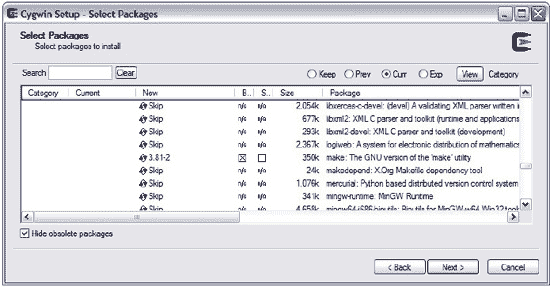
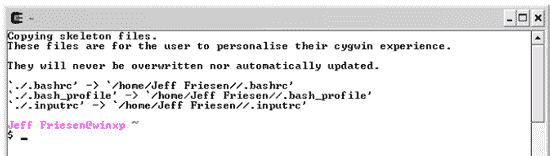
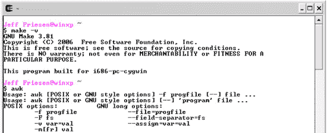
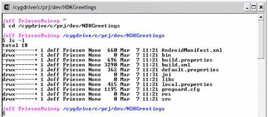
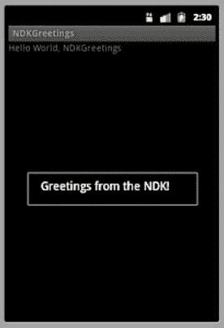

# 九、附录 B：Android NDK

Android 原生开发套件(NDK)通过将 C/C++ 源代码(在其中编写应用的性能关键部分)转换为运行在 Android 设备上的原生代码库，帮助您提升应用的性能。NDK 为构建活动、处理用户输入、使用硬件传感器等提供了头文件和库。您的应用文件(包括您创建的任何本机代码库)打包到 apk 中；它们在 Android 设备的 Dalvik 虚拟机中执行。

**注意:**仔细考虑是否需要在 app 中集成原生代码。即使应用的一部分基于本机代码，也会增加其复杂性，并使其更难调试。此外，并不是每个应用都经历了性能提升(除了在 Android 2.2 中引入的 Dalvik 的即时编译器已经提供的性能提升)。本机代码通常最适用于处理器密集型应用，但只有在性能分析发现存在瓶颈的情况下，才能通过在本机代码中重新编码这部分应用来解决。例如，一个具有计算密集型物理模拟的游戏应用，分析显示运行不佳，将受益于本地执行这些计算。

### 安装 NDK

如果你认为你的应用可以从用 C/C++ 部分表达中获益，你需要安装 NDK。在此之前，请完成以下准备工作:

*   验证您的开发平台是 Windows XP (32 位)或 Vista (32 位或 64 位)、Mac OS X 10.4.8 或更高版本(仅限 x86)还是 Linux (32 位或 64 位，在 Linux Ubuntu Dapper Drake 上测试)。NDK 官方只支持这些开发平台。
*   如果尚未安装 Android SDK(NDK 支持 1.5 或更高版本)，请安装该软件。
*   验证您的平台包含 GNU Make 3.81 或更高版本以及 GNU Awk 的最新版本。要在 Windows 平台上运行 Make 和 Awk，必须先安装 *Cygwin* ，这是一个基于命令行的、类似 Unix 的 shell 工具，用于在 Windows 上运行类似 Linux 的程序。

安装 CYGWIN

必须安装 Cygwin1.7 或更高版本才能在 Windows 平台上运行 Make 和 Awk。完成以下步骤来安装 Cygwin:

1.  将浏览器指向`[`cygwin.com/`](http://cygwin.com/)`。
2.  点击`setup.exe`链接，将该文件保存到硬盘上。
3.  在您的 Windows 平台上运行这个程序，开始安装 Cygwin 版本 1.7.8-1(撰写本文时的最新版本)。如果选择不同的安装位置，请确保目录路径不包含空格。
4.  When you reach the Select Packages screen, select the Devel category and look for an entry in this category whose Package column presents make: The GNU version of the ‘make' utility. In the entry's New column, click the word Skip; this word should change to 3.81-2\. Also, the Bin? column's checkbox should be checked – see Figure B–1. 

    **图 B–1。** *确保 3.81-2 出现在新列中，并且复选框在 Bin？在单击“下一步”之前，请检查列。*

5.  单击“下一步”按钮，继续安装。

Cygwin 在开始菜单中安装一个条目，并在桌面上安装一个图标。点击这个图标，您将看到 Cygwin 控制台(基于 Bash shell)，如图图 B–2 所示。

**图 B–2。** *Cygwin 的控制台第一次开始运行时显示初始化信息。*

如果您想验证 Cygwin 是否提供了对 GNU Make 3.81 或更高版本以及 GNU Awk 的访问，请输入图 B–3 中所示的命令来完成这项任务。

**图 B–3。**??`awk`工具不显示版本号。

你可以通过查看`cygwin.com`以及维基百科的 Cygwin 条目(`[`en.wikipedia.org/wiki/Cygwin`](http://en.wikipedia.org/wiki/Cygwin)`)来了解更多关于 Cygwin 的信息。

继续，将您的浏览器指向`[`developer.android.com/sdk/ndk/index.html`](http://developer.android.com/sdk/ndk/index.html)`并为您的平台下载以下 NDK 软件包之一——修订版 2011 年 1 月)是撰写本文时的最新版本:

*   `android-ndk-r5B–windows.zip` (Windows)
*   `android-ndk-r5B–darwin-x86.tar.bz2` (Mac OS X:英特尔)
*   `android-ndk-r5B–linux-x86.tar.bz2` (Linux 32/64 位:x86)

下载完您选择的包后，将其解压缩并将其`android-ndk-r5b`主目录移动到一个更合适的位置，也许是包含 Android SDK 主目录的同一个目录。

### 探索 NDK

现在，您已经在平台上安装了 NDK，您可能想要浏览它的主目录以发现 NDK 提供了什么。以下列表描述了位于基于 Windows 的 NDK 主目录中的目录和文件:

*   包含组成 NDK 构建系统的文件。
*   `docs`包含 NDK 的基于 HTML 的文档文件。
*   `Platforms`包含子目录，这些子目录包含 Android SDK 安装的每个 Android 平台的头文件和共享库。
*   `samples`包含展示 NDK 不同方面的各种示例应用。
*   `sources`包含各种共享库的源代码和预构建的二进制文件，比如`cpufeatures`(检测目标设备的 CPU 家族及其支持的可选特性)和`stlport`(多平台 C++ 标准库)。Android NDK 1.5 要求开发者在这个目录下组织他们的本地代码库项目。从 Android NDK 1.6 开始，原生代码库存储在其 Android SDK 项目目录的`jni`子目录中。
*   `tests`包含执行 NDK 自动化测试的脚本和源代码。它们对于测试定制的 NDK 非常有用。
*   `toolchains`包含用于在 Linux、OS X 和 Windows(使用 Cygwin)平台上生成原生 ARM(高级 Risc 机器，Android 使用的 CPU，参见`[`en.wikipedia.org/wiki/ARM_architecture`](http://en.wikipedia.org/wiki/ARM_architecture)`)二进制文件的编译器、连接器和其他工具。
*   是进入 NDK 文档的入口。
*   `GNUmakefile`是 GNU make 使用的默认 Make 文件。
*   `ndk-build`是一个简化构建机器码的 shell 脚本。
*   `ndk-gdb`是一个 shell 脚本，用于轻松启动 NDK 生成的机器码的本地调试会话。
*   `README.TXT`欢迎您来到 NDK，并确定各种文档文件，通知您当前版本的变化，提供 NDK 的概述，等等。
*   `RELEASE.TXT`包含 NDK 的发布号。

每个`platforms`目录的子目录都包含头文件和面向稳定的本地 API 的共享库。Google 保证该平台的所有后续版本将支持以下 API:

*   安卓日志(`liblog`)
*   Android 原生应用 API
*   C 库(`libc`)
*   C++ 最小支持(`stlport`)
*   JNI 接口 API
*   数学库(`libm`)
*   OpenGL ES 1.1 和 OpenGL ES 2.0 (3D 图形库)API
*   OpenSL ES 本地音频库 API
*   Android 2.2 及以上版本的像素缓冲区访问(`libjnigraphics`)
*   Zlib 压缩(`libz`)

**注意:**此列表中未列出的本机系统库不稳定，可能会在 Android 平台的未来版本中发生变化。不要使用它们。

### 来自 NDK 的问候

也许熟悉 NDK 编程最简单的方法是创建一个调用返回 Java `String`对象的本地函数的小应用。例如，清单 B–1 的`NDKGreetings`基于单个活动的应用调用一个`native getGreetingMessage()`方法来返回一条问候消息，该消息通过一个对话框显示。

**清单 B–1。**??`NDKGreetings.java`

`// NDKGreetings.java

package com.apress.ndkgreetings;

import android.app.Activity;
import android.app.AlertDialog;

import android.os.Bundle;

public class NDKGreetings extends Activity
{
   **static**
   **{**
      **System.loadLibrary("NDKGreetings");**
   **}**
  **private native String getGreetingMessage();**
   @Override
   public void onCreate(Bundle savedInstanceState)
   {
      super.onCreate(savedInstanceState);
      setContentView(R.layout.main);
      String greeting = **getGreetingMessage();**
      new AlertDialog.Builder(this).setMessage(greeting).show();
   }
}`

清单 B–1 的`NDKGreetings`类揭示了每个包含本机代码的应用的以下三个重要特性:

*   本机代码存储在外部库中，必须在调用其代码之前加载该库。库通常在类加载时通过调用`System.loadLibrary()`方法来加载。这个方法使用一个单独的`String`参数来标识库，没有前缀`lib`和后缀`.so`。在这个例子中，实际的库文件被命名为`libNDKGreetings.so`。
*   声明了一个或多个对应于位于库中的函数的本机方法。Java 通过在返回类型前加上关键字`native`来识别本地方法。
*   本地方法像任何其他 Java 方法一样被调用。在幕后，Dalvik 确保在库中调用相应的本机函数(用 C/C++ 表示)。

清单 B–2 将 C 源代码呈现给通过 Java 本地接口(JNI)实现`getGreetingMessage()`的本地代码库。

**清单 B–2。**??`NDKGreetings.c`

`// NDKGreetings.c

**#include <jni.h>**

**jstring**
   **Java_com_apress_ndkgreetings_NDKGreetings_getGreetingMessage(JNIEnv* env,**
                                                                **jobject this)**
{
   **return (*env)->NewStringUTF(env, "Greetings from the NDK!");**
}`

这个清单首先指定了一个`#include`预处理器指令，它包含了编译源代码时的`jni.h`头文件的内容。

清单然后声明了 Java 的`getGreetingMessage()`方法的本地函数等价物。这个本地函数的头揭示了几个重要的项目:

*   本机函数的返回类型被指定为`jstring`。这个类型在`jni.h`中定义，代表 Java 在本地代码级别的`String`对象类型。
*   函数名必须以 Java 包名和类名开头，这些名称标识了关联的本机方法的声明位置。
*   函数的第一个参数`env`的类型被指定为一个`JNIEnv`指针。`jni.h`中定义的`JNIEnv`，是一个 C 结构，标识可以被调用与 Java 交互的 JNI 函数。
*   函数的第二个参数`this`的类型被指定为`jobject`。这种类型在`jni.h`中定义，在本地代码级别标识任意 Java 对象。传递给这个参数的实参是 JVM 传递给任何 Java 实例方法的隐式`this`实例。

该函数的单行代码取消了对其参数`env`的引用，以便调用`NewStringUTF()` JNI 函数。`NewStringUTF()`将它的第二个参数，一个 C 字符串，转换成它的等价的`jstring`(这个字符串是通过 Unicode UTF 编码标准编码的)，并返回这个等价的 Java 字符串，然后这个字符串被返回给 Java。

**注意:**当在 C 语言的上下文中使用 JNI 时，您必须取消引用`JNIEnv`参数(例如`*env`，以便调用 JNI 函数。此外，您必须将`JNIEnv`参数作为第一个参数传递给 JNI 函数。相比之下，C++ 不需要这种冗长:您不必解引用`JNIEnv`参数，也不必将该参数作为第一个参数传递给 JNI 函数。例如，清单 B–2 的基于 C 的`(*env)->NewStringUTF(env, "Greetings from the NDK!")`函数调用在 C++ 中表示为`env->NewStringUTF("Greetings from the NDK!")`。

#### 使用 Android SDK 构建和运行 NDKGreetings

要用 Android SDK 构建`NDKGreetings`，首先使用 SDK 的`android`工具创建一个`NDKGreetings`项目。假设一个 Windows XP 平台，一个存储`NDKGreetings`项目的`C:\prj\dev`层次结构(在`C:\prj\dev\NDKGreetings`中)，并且 Android 2.3 平台目标对应于整数 ID 1，从文件系统中的任何地方调用下面的命令(为了可读性分成两行)来创建`NDKGreetings`:

`android create project -t 1 -p C:\prj\dev\NDKGreetings -a NDKGreetings
                       -k com.apress.ndkgreetings`

该命令在`C:\prj\dev\NDKGreetings`中创建各种目录和文件。例如，`src`目录包含`com\apress\ndkgreetings`目录结构，最后的`ndkgreetings`目录包含一个骨架`NDKGreetings.java`源文件。用清单 B–1 替换这个框架文件的内容。

继续，在`C:\prj\dev\NDKGreetings`中创建一个`jni`目录，并将清单 B–2 复制到`C:\prj\dev\NDKGreetings\jni`。另外，将清单 B–3 复制到`C:\prj\dev\NDKGreetings\jni\Android.mk`，这是一个 GNU make 文件(在 NDK 文档中有解释)，用于创建`libNDKGreetings.so`库。

**清单 B–3。**??`Android.mk`

`LOCAL_PATH := ./jni

include $(CLEAR_VARS)

LOCAL_MODULE    := NDKGreetings` `LOCAL_SRC_FILES := NDKGreetings.c

include $(BUILD_SHARED_LIBRARY)`

如果您在 Windows 平台上工作，运行 Cygwin(如果没有运行),在 Cygwin 中，将当前目录设置为`C:\prj\dev\NDKGreetings`。参见图 B–4。

**图 B–4。** *到`/prj/dev/NDKGreetings`的路径以前缀`/cygdrive/c`开始。*

假设 NDK 主目录是`android-ndk-r5b`，并且它位于驱动器 C 的根目录中，执行以下命令来构建库:

`../../../android-ndk-r5b/ndk-build`

如果 Cygwin 成功构建了库，它会显示以下消息:

`Compile thumb  : NDKGreetings <= NDKGreetings.c
SharedLibrary  : libNDKGreetings.so
Install        : libNDKGreetings.so => libs/armeabi/libNDKGreetings.so`

这个输出表明`libNDKGreetings.so`位于您的`NDKGreetings`项目目录的`libs`子目录的`armeabi`子目录中。

**提示:**如果该命令输出包含短语`No rule to make target`的消息，编辑`Android.mk`删除多余的空格字符，然后重试。

假设`C:\prj\dev\NDKGreetings`是当前的，执行`ant debug`(从 Cygwin 的 shell 或普通的 Windows 命令窗口)来创建`NDKGreetings-debug.apk`。

这个 APK 文件放在`NDKGreetings`项目目录的`bin`子目录中。要验证`libNDKGreetings.so`是否是该 APK 的一部分，请从`bin`运行以下命令:

`jar tvf NDKGreetings-debug.apk`

您应该在`jar`命令的输出中看到包含`lib/armeabi/libNDKGreetings.so`的一行。

要验证应用是否工作，请启动模拟器，这可以通过在命令行执行以下命令来完成:

`emulator -avd test_AVD`

该命令假设您已经创建了第一章中指定的`test_AVD`设备配置。

继续，通过以下命令在仿真设备上安装`NDKGreetings-debug.apk`:

`adb install NDKGreetings-debug.apk`

该命令假设`adb`位于您的路径中。它还假设`bin`是当前目录。

当`adb`指示已经安装了`NDKGreetings-debug.apk`时，导航到应用启动器屏幕并点击 NDKGreetings 图标。figure B–5 向您展示了结果。

**图 B–5。** *按 Esc 键(在 Windows 上)使对话框消失。*

对话框显示“来自 NDK 的问候！”通过调用本机代码库中的本机函数获得的消息。它还在屏幕顶部附近显示了一条微弱的“Hello World，NDKGreetings”消息。该消息源自项目的默认`main.xml`文件，该文件由`android`工具创建。

#### 用 Eclipse 构建和运行 NDKGreetings

要用 Eclipse 构建`NDKGreetings`,首先创建一个新的 Android 项目，如第一章的秘籍 1-10 所述。为了方便起见，下面列出了完成此任务所需的步骤:

1.  从“文件”菜单中选择“新建”，并从出现的弹出菜单中选择“项目”。
2.  在 *New Project* 对话框中，展开向导树中的 Android 节点，选择该节点下的 Android 项目分支，点击 Next 按钮。
3.  在弹出的*新 Android 项目*对话框中，在项目名称文本框中输入 **`NDKGreetings`** ，取消勾选使用默认位置，在位置文本框中输入不带空格的路径； **`C:\prj\dev\NDKGreetings`** (假设 Windows)，例如。这个输入的名称标识了存储`NDKGreetings`项目的文件夹。
4.  如果未选中，请选择“在工作区中创建新项目”单选按钮。
5.  在构建目标下，选中要用作`NDGreetings`构建目标的适当 Android 目标的复选框。这个目标指定了您希望您的应用在哪个 Android 平台上构建。假设您只安装了 Android 2.3 平台，那么只有这个构建目标应该出现，并且应该已经被选中。
6.  在属性下，在应用名称文本字段中输入 **`NDK Greetings`** 。这个人类可读的标题将出现在 Android 设备上。继续，在包名文本字段中输入 **`com.apress.ndkgreetings`** 。该值是包名称空间(遵循与 Java 编程语言中的包相同的规则)，所有源代码都将驻留在该名称空间中。如果未选中，请选中“创建活动”复选框，并在该复选框旁边的文本字段中输入 **`NDKGreetings`** 作为应用的启动活动的名称。未选中此复选框时，文本字段被禁用。最后，在 Min SDK Version 文本字段中输入整数 **`9`** ，以确定在 Android 2.3 平台上正确运行`NDKGreetings`所需的最低 API 级别。
7.  单击完成。

接下来，使用 Eclipse 的包资源管理器来定位`NDKGreetings.java`源文件节点。双击这个节点，用清单 B–1 替换编辑窗口中显示的框架内容。

使用 Package Explorer，在 NDKGreetings 项目节点下创建一个 jni 节点，添加一个 jni 的 NDKGreetings.csubnode，用清单 B–2 替换这个节点的空内容，添加一个新的 jni 的 Android.mk 子节点，用清单 B–3 替换它的空内容。

启动 Cygwin 并使用`cd`命令切换到项目的文件夹；比如`cd /cygdrive/c/prj/dev/NDKGreetings`。然后，如前一节所示执行`ndk-build`；比如`../../../android-ndk-r5b/ndk-build`。如果一切顺利，`NDKGreetings`项目目录的`libs`子目录应该包含一个`armeabi`子目录，其中应该包含一个`libNDKGreetings.so`库文件。

最后，从项目菜单中选择构建项目；`bin`子目录应该包含一个`NDKGreetings.apk`文件(如果成功)。您可能想要执行`jar tvfNDKGreetings.apk`来验证这个文件是否包含`lib/armeabi/libNDKGreetings.so`。

要从 Eclipse 运行`NDKGreetings`,从菜单栏中选择 run，并从下拉菜单中选择 Run。如果出现 运行方式】对话框，选择 Android 应用并点击确定。Eclipse 使用`test_AVD`设备启动`emulator`，安装`NDKGreetings.apk`，并运行这个应用，其输出显示在图 B–5 中。

### NDK 采样

NDK 安装主目录的`samples`子目录包含几个示例应用，展示了 NDK 的不同方面:

*   `bitmap-plasma`:一个应用，演示了如何从本机代码访问 Android `android.graphics.Bitmap`对象的像素缓冲区，并使用该功能生成一个老派的“等离子体”效果。
*   `hello-gl2`:一款使用 OpenGL ES 2.0 顶点和片段着色器渲染三角形的 app。(如果您在 Android 模拟器上运行此应用，您可能会收到一条错误消息，指出应用已意外停止，因为模拟器不支持 OpenGL ES 2.0 硬件模拟。)
*   `hello-jni`:一个应用，从共享库中实现的本地方法中加载一个字符串，然后将其显示在应用的用户界面中。这个 app 和`NDKGreetings`很像。
*   `hello-neon`:一个展示如何使用`cpufeatures`库在运行时检查 CPU 能力，然后在 CPU 支持的情况下使用 NEON(ARM 架构的 SIMD 指令集的市场名称)内部函数的应用。具体来说，该应用为 FIR 滤波器环路(`[`en.wikipedia.org/wiki/Finite_impulse_response`](http://en.wikipedia.org/wiki/Finite_impulse_response)`)实现了两个版本的微型基准，一个 C 版本和一个支持它的设备的 NEON 优化版本。
*   `native-activity`:演示如何使用`native-app-glue`静态库创建*本地活动*(完全用本地代码实现的活动)的应用。
*   `native-audio`:演示如何使用原生方法通过 OpenSL ES 播放声音的 app。
*   `native-plasma`:用本地活动实现的`bitmap-plasma`的一个版本。
*   `san-angeles`:通过原生 OpenGL ES APIs 渲染 3D 图形的应用，同时用`android.opengl.GLSurfaceView`对象管理活动生命周期。
*   `two-libs`:动态加载共享库，调用库提供的原生方法的 app。在这种情况下，该方法在由共享库导入的静态库中实现。

您可以使用 Eclipse 以类似于`NDKGreetings`的方式构建这些应用。例如，执行以下步骤来构建`san-angeles`:

1.  从“文件”菜单中选择“新建”，并从出现的弹出菜单中选择“项目”。
2.  在 *New Project* 对话框中，展开向导树中的 Android 节点，选择该节点下的 Android 项目分支，点击 Next 按钮。
3.  在出现的 *New Android Project* 对话框中，在项目名称文本字段中输入 **`san-angeles`** ，并选择 Create Project from existing source 单选按钮。
4.  点击位置字段旁边的浏览按钮，通过*浏览文件夹*对话框，选择 NDK 安装主目录下`samples`子目录下的`san-angeles`子目录。单击确定。
5.  选中构建目标区域中的 Android 2.3 目标复选框(或 Android 2.3.1 或 2.3.3 复选框，如果这是您的版本)。单击完成。

Eclipse 通过创建一个包含这个示例应用文件的`DemoActivity`项目做出响应，并在其包浏览器中显示这个项目的名称。

启动 Cygwin 并切换到项目的文件夹；比如`cd/cygdrive/c/android-ndk-r5b/samples/san-angeles`。然后，执行`ndk-build`；例如，`../../ndk-build`。如果一切顺利，`san-angeles`项目目录的`libs`子目录应该包含一个包含`libsanangeles.so`的`armeabi`子目录。

最后，从包资源管理器中选择`DemoActivity`，从项目菜单中选择构建项目；`bin`子目录应该包含一个`DemoActivity.apk`文件(如果成功)。您可能想要执行`jar tvfDemoActivity.apk`来验证这个文件是否包含`lib/armeabi/libsanangeles.so`。

从菜单栏中选择运行，并从下拉菜单中选择运行。如果出现*运行方式*对话框，选择 Android 应用并点击确定。Eclipse 用`test_AVD`设备启动`emulator`，安装`DemoActivity.apk`，并运行这个应用。如果成功，您应该会看到类似于图 B–6 中所示的屏幕。

**图 B–6。** *`DemoActivity`带你畅游立体城市。*