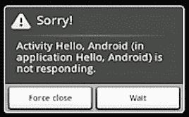

# 十、附录 C：应用设计指南

这本书关注于使用各种 Android 技术开发应用的机制。然而，如果你想成为一名成功的 Android 开发者，知道如何创建一个应用是不够的。你还必须知道如何设计只有兼容设备的用户才能使用的应用，这些应用性能良好，响应用户，并能与其他应用正常交互。这个附录的秘籍给你必要的设计知识，让你的应用大放异彩。

#### C–1。设计过滤的应用

##### 问题

当您将应用发布到 Google 的 Android Market 时，您不希望该应用对不兼容的设备可见。你希望 Android Market 过滤你的应用，让这些不兼容设备的用户无法下载应用。

##### 解决办法

Android 运行在许多设备上，这给了开发者一个巨大的潜在市场。但是，并非所有设备都包含相同的功能(例如，一些设备有摄像头，而其他设备没有)，因此某些应用可能无法在某些设备上正常运行。

认识到这个问题，谷歌提供了各种市场过滤器，每当用户通过 Android 设备访问 Android Market 时都会触发这些过滤器。如果一个应用不满足过滤器，该应用不会对用户可见。Table C–1 确定了当特定元素出现在应用清单文件中时触发的三个市场过滤器。

**表 C–1。**基于清单元素的市场过滤器

<colgroup><col align="left" valign="top" width="25%"> <col align="left" valign="top" width="25%"> <col align="left" valign="top" width="47%"></colgroup> 
| **过滤器名称** | **清单元素** | **过滤器如何工作** |
| :-- | :-- | :-- |
| 最低框架版本 | `<uses-sdk>` | 一个应用需要最低的 API 级别。不支持该级别的设备将无法运行该应用。
API 等级用整数表示。比如整数 9 对应 Android 2.3(API 9 级)。
举例:`<uses-sdk android:minSdkVersion="9"/>`告知 Android Market 该应用仅支持 Android 2.3 及更高版本。
如果不声明该属性，Android Market 会假设默认值为`"` 1，`"`，表示该应用兼容所有版本的 Android。 |
| 设备功能 | `<uses-feature>` | 一个应用可以要求某些设备功能出现在设备上。这个功能是在 Android 2.0 (API Level 5)中引入的。
例子:`<uses-feature android:name="android.hardware.sensor.compass"/>`告诉 Android Market 设备必须有指南针。
抽象的`android.content.pm.PackageManager`类为`"android.hardware.sensor.compass"`和其他特性 id 定义了 Java 常量。 |
| 屏幕大小 | `<supports-screens>` | 一个应用通过设置`<supports-screens>`元素的属性来指示它能够支持的屏幕尺寸。当应用发布时，Android Market 根据用户设备的屏幕大小，使用这些属性来决定是否向用户显示应用。
示例:`<supports-screens                   android:smallScreens="false"/>`告知 Android Market，该应用无法在 QVGA(240 x 320 像素)屏幕的设备上运行。
使用 API 级或更高级别的 app 默认`smallScreens`到`"true;"`之前的级别默认此属性为`"false."`
Android Market 一般假设设备可以使较小的布局适应较大的屏幕，但不能使较大的布局适应较小的屏幕。因此，如果一个应用声明只支持“正常”屏幕尺寸，Android Market 会让该应用适用于正常和大屏幕设备，但会过滤该应用，使其不适用于小屏幕设备。 |

Android Market 还使用其他应用特征(如使用该设备的用户当前所在的国家)来确定是否显示或隐藏应用。表 C–2 确定了三种市场过滤器，当这些附加特征中的一些出现时，这些过滤器就会被触发。

**表 C–2。**基于清单元素的市场过滤器

<colgroup><col align="left" valign="top" width="40%"> <col align="left" valign="top" width="57%"></colgroup> 
| **过滤器名称** | **过滤器如何工作** |
| :-- | :-- |
| 发布状态 | 只有已发布的应用才会出现在 Android Market 的搜索中。即使应用未发布，如果用户可以在他们购买、安装或最近卸载的应用的下载区域中看到它，也可以安装它。如果应用已被暂停，用户将无法重新安装或更新它，即使它出现在他们的下载中。 |
| 定价状态 | 并非所有用户都能看到付费应用。要显示付费应用，设备必须有 SIM 卡，运行 Android 1.1 或更高版本，并且必须位于可以使用付费应用的国家(由 SIM 卡运营商确定)。 |
| 国家/运营商目标 | 当你将应用上传到 Android Market 时，你可以选择特定的国家作为目标。该应用仅对您选择的国家/地区(运营商)可见，如下:

*   The operator of the device (if available) determines its country/region. If the operator cannot be determined, Android Market tries to determine the country based on IP.
*   Determine the operator according to the SIM card of the device (applicable to GSM devices), not the currently roaming operator.

 |

]

#### C–2。设计高性能应用

##### 问题

应用应该表现良好，尤其是在内存有限的设备上。此外，性能更好的应用消耗的电池电量更少。你想知道如何设计你的应用以获得良好的性能。

##### 解决办法

Android 设备在很多方面都有所不同。一些设备可能具有比其他设备更快的处理器，一些设备可能具有比其他设备更大的内存，并且一些设备可能包括实时(JIT)编译器，而其他设备不具有通过将字节码指令序列动态转换为等效的本机代码序列来加速可执行代码的技术。以下列表列出了编写代码时需要考虑的一些事项，以便您的应用能够在任何设备上良好运行:

*   **仔细优化你的代码:**在考虑优化代码之前，努力用一个坚实的架构来编写不影响性能的应用。一旦应用正确运行，在各种设备上分析其代码，并寻找使应用变慢的瓶颈。请记住，模拟器会给你一个错误的应用性能的印象。例如，它的网络连接基于您的开发平台的网络连接，比您可能在许多 Android 设备上遇到的要快得多。
*   **最小化对象创建:**对象创建会影响性能，尤其是在垃圾收集方面。你应该尽可能地重用现有的对象，以尽量减少垃圾收集周期，垃圾收集周期会暂时降低应用的速度。例如，使用一个`java.lang.StringBuilder`对象(或者当多个线程可能访问这个对象时使用一个`java.lang.StringBuffer`对象)来构建字符串，而不是在一个循环中使用字符串连接操作符，这会导致创建不必要的中间`String`对象。
*   **尽量减少浮点运算:**浮点运算在 Android 设备上比整数运算慢一倍左右；例如，无浮点单元和无 JIT 的 G1 设备。此外，请记住，一些设备缺乏基于硬件的整数除法指令，这意味着整数除法是在软件中执行的。当涉及到哈希表(依赖于余数操作符)时，由此产生的缓慢尤其令人烦恼。
*   **在任何需要执行复制的地方使用 system . array copy():**`java.lang.System`类的`static void arraycopy(Object src, int srcPos, Object dest, int destPos, int length)`方法比用 JIT 在 Nexus One 上手工编码的循环快 9 倍左右。
*   **避免枚举:**枚举虽然方便，但会增加`.dex`文件的大小并影响速度。例如，`public enum Directions { UP, DOWN, LEFT, RIGHT }`向一个`.dex`文件添加了几百个字节，相比之下，等效的类有四个`public static final int`
*   **使用增强的 for 循环语法:**一般来说，在没有 JIT 的设备上，增强的 for 循环(如`for (String s: strings) {}`)比常规的 for 循环(如`for (int i = 0; i < strings.length; i++)`)要快，当涉及 JIT 时，也不比常规的 for 循环慢。因为增强的 for 循环在迭代一个`java.util.ArrayList`实例时会慢一些，所以应该使用常规的 for 循环来代替 arraylist 遍历。

您还需要仔细选择算法和数据结构。例如，线性搜索算法(从头到尾搜索一系列项目，将每个项目与一个搜索值进行比较)平均检查一半的项目，而二分搜索法算法使用递归除法技术来定位搜索值，只需很少的比较。例如，对 40 亿个条目的线性搜索平均有 20 亿次比较，而二分搜索法最多执行 32 次比较。

#### C–3。设计响应式应用

##### 问题

对用户响应缓慢的应用，或者看起来挂起或冻结的应用，有触发*应用不响应*对话框的风险(见图 C–1)，这给用户机会杀死应用(并可能卸载它)或继续等待，希望应用最终会响应。

**图 C–1。** *可怕的应用不响应对话框可能会导致用户卸载应用。*

你想知道如何设计响应性应用，这样你就可以避免这个对话框(很可能会给不感兴趣的用户带来坏名声)。

##### 解决办法

当应用无法响应用户输入时，Android 会显示*应用不响应*对话框。例如，应用阻塞 I/O 操作(通常是网络访问)会阻止主应用线程处理传入的用户输入事件。在 Android 确定的时间长度后，Android 得出应用被冻结的结论，并显示此对话框，让用户选择终止应用。

同样，当一个应用花费太多时间来构建一个复杂的内存数据结构，或者该应用正在执行一个密集的计算(例如计算象棋或其他一些游戏的下一步棋)，Android 会认为该应用已经挂起。因此，使用方法 C–2 中描述的技术来确保这些计算是有效的，这一点很重要。

在这些情况下，应用应该创建另一个线程，并在该线程上执行大部分工作。对于活动来说尤其如此，活动应该在关键的生命周期回调方法中做尽可能少的工作，比如`onCreate(Bundle)`和`onResume()`。因此，主线程(驱动用户界面事件循环)保持运行，Android 不会得出应用冻结的结论。

**注:**活动管理器和窗口管理器(见第一章、图 1-1 )监控 app 响应性。当他们检测到在 5 秒内没有对输入事件(例如，按键或触摸屏幕)做出响应，或者广播接收器在 10 秒内没有完成执行时，他们断定应用已经冻结，并显示*应用没有响应*对话框。

#### C–4。设计无缝应用

##### 问题

你想知道如何设计你的应用，以便与其他应用正常交互。具体来说，你想知道你的应用应该避免做哪些事情，这样才不会给用户带来问题(并面临被卸载的可能性)。

##### 解决办法

你的应用必须与其他应用公平竞争，这样它们就不会在用户与某个活动交互时弹出对话框之类的事情来打扰用户。此外，您不希望应用的某个活动在暂停时丢失状态，让用户在返回到该活动时困惑于为什么之前输入的数据会丢失。换句话说，你希望你的应用与其他应用很好地协作，这样它就不会扰乱用户的体验。

实现无缝体验的应用必须考虑以下规则:

*   **不要丢弃数据:**因为 Android 是一个移动平台，所以可以在你的应用的活动上弹出另一个活动(可能是一个来电触发了电话应用)。当这种情况发生时，你的 activity 的`void onSaveInstanceState(Bundle outState)`和`onPause()`回调方法被调用，你的 app 很可能会被杀死。如果用户当时正在编辑数据，除非通过`onSaveInstanceState()`保存，否则数据将会丢失。数据随后以`onCreate()`或`void onRestoreInstanceState(Bundle savedInstanceState)`方式恢复。
*   **不要暴露原始数据:**暴露原始数据不是一个好主意，因为其他 app 必须理解你的数据格式。如果您更改格式，这些其他应用将会中断，除非进行更新以考虑格式更改。相反，您应该创建一个通过精心设计的 API 公开数据的`ContentProvider`实例。
*   **不要打断用户:**当用户正在与一个活动交互时，如果被一个弹出对话框打断(可能是由于`startActivity(Intent)`方法调用而通过后台服务激活)，用户会不高兴。通知用户的首选方式是通过`android.app.NotificationManager`类发送消息。该消息出现在状态栏上，用户可以在方便时查看该消息。
*   **将线程用于长时间的活动:**执行长时间计算或涉及其他耗时活动的组件应该将这项工作转移到另一个线程。这样做可以防止*应用不响应*对话框出现，并减少用户从设备上卸载应用的机会。
*   **不要让单个活动屏幕过载:**用户界面复杂的应用应该通过多个活动来呈现用户界面。这样，用户就不会被屏幕上出现的大量项目淹没。此外，您的代码变得更易于维护，并且它也可以很好地与 Android 的活动堆栈模型兼容。
*   **设计您的用户界面以支持多种屏幕分辨率:**不同的 Android 设备通常支持不同的屏幕分辨率。一些设备甚至可以动态改变屏幕分辨率，例如切换到横向模式。因此，重要的是要确保你的布局和绘图能够灵活地在不同的设备屏幕上正确显示。通过为关键屏幕分辨率提供不同版本的图稿(如果有)，然后设计布局以适应各种尺寸，可以完成这项任务。(例如，避免使用硬编码的位置，而是使用相对布局。)做这么多，系统处理其他任务；结果是一个在任何设备上都很棒的应用。
*   **假设网络很慢:** Android 设备有多种网络连接选项，有些设备比其他设备快。然而，最小公分母是 GPRS(GSM 网络的非 3G 数据服务)。即使支持 3G 的设备也要在非 3G 网络上花费大量时间，因此在未来很长一段时间内，慢速网络仍将是现实。因此，在编写应用时，一定要尽量减少网络访问和带宽。不要假设网络快；计划它是缓慢的。如果你的用户碰巧在更快的网络上，他们的体验只会得到改善。
*   **不要假设触摸屏或键盘:** Android 支持各种类型的输入设备:一些 Android 设备具有完整的“QWERTY”键盘，而其他设备具有 40 键、12 键或其他键配置。同样，一些设备有触摸屏，但许多设备没有。设计应用时，请记住这些差异。不要假设特定的键盘布局，除非你想限制你的应用只能在某些设备上使用。
*   **节省设备电池:**移动设备由电池供电，最大限度地减少电池消耗非常重要。两个最大的电池功耗是处理器和无线电，这就是为什么编写使用尽可能少的处理器周期和尽可能少的网络活动的应用很重要。最大限度地减少应用占用的处理器时间归结为编写高效的代码。最大限度地减少使用无线电的功耗归结为优雅地处理错误条件和只获取需要的数据。例如，如果一次尝试失败，不要不断地重试网络操作。如果它失败了一次，另一次立即尝试很可能会失败，因为用户没有接收；你只会浪费电池的能量。请记住，用户会注意到一个耗电的应用，并且最有可能卸载该应用。