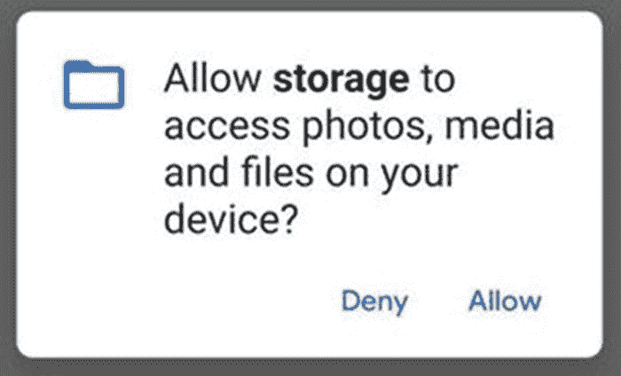

# 三、基本原则

## 安卓沙盒

Android 运行在一个多用户的 Linux 系统下，这意味着每个应用及其存储都在一个单独的用户下运行。这意味着在正常情况下，应用不能读取另一个应用的数据或内部存储。每个进程都使用自己的虚拟机(VM)来隔离应用。在 API level 21 (Android 5)之前，这将是一个 Dalvik 虚拟机，在以后的版本中将改为使用 Android 运行时(ART)。两者都以相似的方式运行，在运行应用编译的 Dalvik 字节码时，它们模拟设备的 CPU、寄存器和其他功能。然而，ART 被认为具有许多性能改进。

在这些虚拟机中，应用只能访问运行所需的组件(最低权限策略)。这些单独的流程虚拟机是由合子 <sup>[1](#Fn1)</sup> (zai gowt)创建的。Zygote 在启动时由 Android 运行时启动，拥有 root 权限，拥有第一个虚拟机和所有共享的 Java 类和资源。当一个新的应用想要启动时，一个新的 Zygote 进程被分叉，并且该应用被绑定到新进程的线程，并且它的代码在其中运行，非必需的和非请求的权限被 Zygote 丢弃，以便该应用只拥有必要的权限。

## 应用组件

### 活动

活动是安卓应用的主要入口。类似于单个网页，活动是单个屏幕，通常只在前台运行。虽然不是所有的活动都必须可见，但大多数标准的应用活动都是可见的。活动可以通过扩展`Activity`类以编程方式实现。

#### 服务

一般来说，服务是 Android 中的一个实用程序，用于在应用当前不在前台运行时在后台提供功能，例如音乐播放器、电子邮件客户端轮询电子邮件或地图应用。多年来，Android 中用于任务服务的首选技术已经从使用`Services`变为使用`JobSchedulers`。这些将在第 10 章[中详细讨论。](10.html)

### 广播接收机

应用的另一个入口点是系统、其他应用和应用本身可以“广播”应用随后接收的事件的地方。广播接收机具有受限的功能(一般来说，在被认为无响应之前，它们只能运行 10 秒 <sup>[2](#Fn2)</sup> )，因此，通常会启动另一种形式的长期运行服务，例如前台`Activity`或`JobScheduler`。广播接收器是通过扩展`BroadcastReceiver`类实现的。这些将在第 [4](04.html) 章中详细讨论。

### 内容提供商

内容提供商用于管理应用数据集，以便它们可以与设备上的其他应用共享。使用 URI，即使 URI 所属的应用当前没有运行，其他应用也可以查询或修改数据。示例包括图像、文本文件、SQLite 数据库等。

### 显示

应用的清单文件 <sup>[3](#Fn3)</sup> 是预编译创建的，在运行时不能编辑。这些类似 xml 的文件称为`AndroidManifest.xml`，详细描述了单个应用中的所有组件(活动、广播接收器、服务等)。).清单文件还详细说明了应用需要的权限、最低 API 级别，以及应用使用的硬件和软件功能(如摄像头)。虽然应用只有一个清单文件，但导入的库可能有自己的清单文件。因此，在构建期间，Gradle 将合并所有这些单独的清单文件；结果称为合并清单。 <sup>[4](#Fn4)</sup> 这在反转 Android 应用(`APK`文件)时很明显，因为(如果使用库的话)反转后的清单会比原来的预合并清单大得多，并且有更多的元素。

*这里可以看到一个简单的* `AndroidManifest.xml` *文件的例子。在这个例子中，这个包叫做* `simple_app` *，它使用* `FINGERPRINT` *权限(如下所述)，它的主要入口点是一个叫做* `MainActivity` *的活动，它有两个意图过滤器:*

```java
<?xml version="1.0" encoding="utf-8"?>
<manifest xmlns:android="http://schemas.android.com/apk/res/android"
    package="com.example.simple_app">

    <uses-permission android:name="android.permission.USE_FINGERPRINT" />
    <application
        android:allowBackup="true"
        android:icon="@mipmap/ic_launcher"
        android:label="@string/app_name"
        android:roundIcon="@mipmap/ic_launcher_round"
        android:supportsRtl="true"
        android:theme="@style/AppTheme">
        <activity android:name=".MainActivity">
            <intent-filter>
                <action android:name="android.intent.action.MAIN" />

                <category android:name="android.intent.category.LAUNCHER" />
            </intent-filter>
        </activity>
    </application>

</manifest>

```

## 许可

Android 中的权限遵循最小特权模型，其中特定类型的功能只给予明确请求它们的应用。有两种主要类型的权限:清单权限和运行时权限(其中通常属于“危险”权限类别)。运行时和清单权限都必须在 Android 清单中声明；然而，除此之外，必须在运行时请求运行时许可，以提示用户是否愿意应用使用所述功能的对话(如图 [3-1](#Fig1) 所示)。运行时权限在 API 级别 23 中实现；但是，在此之前，用户将在安装之前看到所有运行时权限。



图 3-1

用户看到的运行时权限示例

如前所述，权限类型是基于它们对用户、Android 系统或设备上的其他应用造成的风险而给出的。在表 [3-1](#Tab1) 中可以看到所有权限类型的汇总。 <sup>[5](#Fn5)</sup>

表 3-1

权限类型

<colgroup><col class="tcol1 align-left"> <col class="tcol2 align-left"> <col class="tcol3 align-left"></colgroup> 
| 

权限类型

 | 

风险

 | 

描述

 |
| --- | --- | --- |
| 标准 | 低的 | **默认权限类型**。为应用提供隔离的应用级特性，如`BLUETOOTH`、`NFC`和`INTERNET`。 |
| 危险的 | 高的 | 为应用提供对私有数据或设备控制方面的访问，例如`WRITE_EXTERNAL_STORAGE, ACCESS_FINE_LOCATION`和`CAMERA`。与普通权限类型不同，在系统授予权限之前(或在 API 级别 23 之前的设备上安装时)，用户必须接受运行时权限请求(在运行时通过单击按钮)。 |
| 签名 | 批评的 | 只有当请求权限的应用与声明该权限的应用由同一证书签名时，才会授予该权限。这通常用于将权限类型限制为系统/预安装的应用。这些权限通常授予对系统和其他应用的大量访问权限，或者规避 Android 安全机制。这包括`MANAGE_EXTERNAL_STORAGE`、`READ_LOGS`和`CAPTURE_AUDIO_OUTPUT`。 |

除了这些类型之外，还可以将其他标志应用于权限，包括`privileged`和`development`，它们分别表示给予系统和开发应用的权限。 <sup>[6](#Fn6)</sup>

最后，在确定哪些应用可以执行哪些操作时，需要考虑另外两种权限类型:

*   **硬限制许可** -其中许可不能被设备上的任何应用持有，除非该许可已经被安装应用允许列出

*   **软限制权限** -设备上的任何应用都不能以完整形式帮助某个权限，除非该权限已被安装程序应用允许列出

调试设备时，标准应用通常不可用的权限(如签名权限类型的权限)可以使用 adb 授予。以`READ_LOGS`权限为例，以下命令可用于授予权限`adb shell pm grant <Package ID> android.permission.READ_LOGS`。要检索应用的包 ID，请参见第 [5](05.html) 章或第 [12](12.html) 章。

*一个* *舱单* *权限的例子:*

```java
<uses-permission android:name="android.permission. WRITE_EXTERNAL_STORAGE "/>

```

*一个* *运行时* *权限请求的例子:*

```java
if (Build.VERSION.SDK_INT >= 23) {
    // Notification will not be shown unless the correct manifest permission is set
    ActivityCompat.requestPermissions(this, new String[]{Manifest.permission.WRITE_EXTERNAL_STORAGE}, 1234);
}

```

在编写 Android 规范的时候， <sup>[7](#Fn7)</sup> 列出了 166 种不同的清单权限。表 [3-2](#Tab2) 显示了这些权限中最常见的一部分，以及它们的 API 和权限级别。

表 3-2

Android 权限

<colgroup><col class="tcol1 align-left"> <col class="tcol2 align-left"> <col class="tcol3 align-left"> <col class="tcol4 align-left"></colgroup> 
| 

名字

 | 

同意

 | 

API 级别

 | 

描述

 |
| --- | --- | --- | --- |
| 访问 _ 粗略 _ 位置 | 危险的 | 29+ | 通过非 GPS 提供商(如网络提供商)访问大致位置。 |
| 访问 _ 精细 _ 位置 | 危险的 | 1+ | 通过 GPS 和网络提供商访问特定位置。 |
| 访问网络状态 | 标准 | 1+ | 访问`ConnectivityManager`负责监控网络连接(Wi-Fi-GPRS、UMTS 等)。). |
| 访问 _ WIFI _ 状态 | 标准 | 1+ | 对`WifiManager`的访问负责查看已配置网络列表、当前活动网络和接入点扫描结果。 |
| 接听电话 | 危险的 | 26+ | 允许应用接听来电。 |
| 电池状态 | 签名&#124;特权&#124;发展 | 1+ | 允许汇总电池信息和统计数据。 |
| 蓝牙技术 | 标准 | 1+ | 允许与蓝牙设备配对和连接。 |
| 呼叫电话 | 危险的 | 1+ | 允许应用呼叫，而无需向拨号器应用发送意图(从而无需通过 UI 通知用户)。 |
| 通话特权 | 不适用于第三方应用 | 1+ | 一个限制较少的版本的`CALL_PHONE`权限，允许应用呼叫任何电话号码，包括紧急号码。 |
| 照相机 | 危险的 | 1+ | 提供对设备摄像头的访问。 |
| 捕获音频输出 | 禁止第三方应用 | 19+ | 允许不受限制地从设备的麦克风录制音频。 |
| 更改 WIFI 状态 | 标准 | 1+ | 允许应用修改设备的网络配置，以及连接和断开 Wi-Fi 接入点。 |
| 删除 _ 包 | 禁止第三方应用 | 1+ | 允许删除应用。对于 Android 7 用户，如果请求删除的应用与安装它的应用不同，则需要进行确认。 |
| 安装软件包 | 禁止第三方应用 | 1+ | 允许一个应用安装另一个。 |
| 因特网 | 标准 | 1+ | 允许应用打开网络套接字。 |
| 管理外部存储 | 签名&#124; appop &#124;预装 | 30+ | 由于在 Android 10 中实现了作用域存储(具有沙箱外部存储的应用)，该许可允许对外部存储空间进行广泛的管理。 |
| 国家足球联盟 | 标准 | 9+ | 允许通过 NFC(近场通信)进行 I/O 操作。 |
| 处理 _ 呼出 _ 呼叫 | 危险和严格限制 | 1–29 | 允许应用查看和重定向所有拨出的电话。 |
| 阅读 _ 联系人 | 危险的 | 1+ | 允许读取用户的联系信息。 |
| 读取外部存储 | 危险，软限制 | 16+ | 允许应用从外部存储器读取数据。在 API 19 之后，读取应用的作用域存储不需要该权限。就 API 级别 29 中的作用域存储的强制实现而言，这仅提供只读访问。 |
| 读取日志 | 禁止第三方应用 | 1+ | 允许读取系统日志信息，例如由`DropBoxManager`创建的信息。 |
| 阅读电话号码 | 危险的 | 26+ | 允许应用读取所有设备的电话号码。默认情况下，该权限对即时应用公开。 |
| 读取电话状态 | 危险的 | 1+ | 包括`READ_PHONE_NUMBERS`权限。允许访问设备/电话信息，如当前的蜂窝网络。 |
| 阅读 _ 短信 | 危险和严格限制 | 1+ | 允许阅读手机已经收到的短信。 |
| 重新启动 | 禁止第三方应用 | 1+ | 允许重新启动设备。 |
| 接收 _ 引导 _ 完成 | 标准 | 1+ | 允许应用接收`Intent.ACTION_BOOT_COMPLETED`意图。该意图在系统完成引导后广播。 |
| 接收 _ 彩信 | 危险和严格限制 | 1+ | 允许应用监控收到的彩信。 |
| 接收 _ 短信 | 危险和严格限制 | 1+ | 允许应用监控传入的短信。 |
| 录音 _ 音频 | 危险的 | 1+ | 允许应用录制音频。 |
| 请求 _ 删除 _ 包 | 标准 | 26+ | 允许应用请求删除自己或另一个应用。这将需要用户交互。 |
| 请求安装软件包 | 签名 | 23+ | 允许应用请求安装应用。这将需要用户交互。 |
| 发送 _ 短信 | 危险且严格限制的权限 | 1+ | 允许发送短信。 |
| 设置 _ 首选 _ 应用 | 标准 | 1–15 | 允许应用修改用户的首选(默认)应用，包括 web 浏览器和安装程序。 |
| 设置定时器 | 禁止第三方应用 | 8+ | 允许设置系统时间。 |
| 使用生物特征 | 标准 | 28+ | 允许使用设备支持的硬件。 |
| 使用 _ 指纹 | 标准 | 23–28 | 允许使用设备指纹硬件。取而代之的是 Android API 级中的`USE_BIOMETRIC`权限。 |
| 唤醒 _ 锁定 | 标准 | 1+ | 允许应用启动`PowerManager`唤醒锁，禁止设备睡眠或屏幕变暗。 |
| 写 _ 外部 _ 存储 | 危险的 | 4+ | 允许写入设备外部存储器。还授予了`READ_EXTERNAL_STORAGE`权限。在 API 19 之后，在应用的作用域存储中读/写不再需要该权限。就 API 级别 29 中的作用域存储的强制实现而言，这仅允许应用读取它们自己的存储数据。 |

## 语境

Android 中的另一个核心组件是`Context`。Android 中的 Context <sup>[8](#Fn8)</sup> 被通俗地称为“上帝”类，是一个用于检索应用环境的全局信息的接口。它允许访问特定于应用的资源以及应用级别的操作，如广播、接收意图和启动活动。一些使用案例包括

*   访问应用内部存储的位置

*   发送祝酒词或通知对话框

*   在活动中设置一个`ImageView`

*   检索系统软件包管理器

有两种主要类型的上下文:应用上下文和活动上下文。这两种类型的上下文都绑定到它们各自领域的生命周期——其中应用上下文绑定到应用的生命周期，活动上下文绑定到其活动的生命周期。这意味着如果其中一个被销毁，那么它们各自的上下文将被垃圾收集。

除了 Context 的这两个子类，还有`ContextWrapper`可以和 Context 方法`getBaseContext()`一起使用。上下文包装器允许使用代理上下文，这样就有可能修改对象的行为而不改变原始上下文。

### 应用上下文

下面返回应用上下文。当应用被销毁时，它将被垃圾回收。

*检索应用上下文:*

```java
getApplicationContext()

```

### 活动上下文

当在`Activity`或`Activity`的子类中时，使用 *this* 返回活动上下文。当活动被销毁时，活动上下文被垃圾收集。

*从活动内部检索活动上下文:*

```java
this

```

## 活动生命周期

作为使用设备的一部分，应用的单个活动可以进入许多不同的状态。activity 类提供了有用的回调，当进入这些状态时会触发这些回调，以便应用可以做出适当的响应。完整的活动生命周期可以在图 [3-2](#Fig2) 中看到。


图 3-2

Android 应用活动生命周期

### onCreate()

第一次创建活动时调用此回调。这个方法接受一个参数`savedInstanceState`，它是一个包含活动以前保存的状态的包，或者如果以前不存在的话接受一个参数`null`。

### onStart（）

该回调准备活动进入前台，并使其对用户可见。除非恢复，否则每次活动开始时都会调用此回调。

### onResume（）

当进入这种状态时，活动准备好被用户交互，并进入前台。可能会发生中断事件，例如电话呼叫或用户移动到另一个活动——如果发生这种情况，活动将移动到`onPause()`回调。

### onpause()

此回调表明该活动不再处于前台；但是，并不一定意味着它即将被摧毁。

### onStop()

当活动对用户不再可见时，在活动被销毁之前调用此回调。这是应用应该释放资源的地方。`onStop()`回调是活动将接收的最后一个回调。

### onRestart（）

当活动重新显示给用户时，在`onStop()`回调之后调用该活动。接下来是`onStart()`和`onResume()`。

## 安卓用户

在 Android 中，有两个截然不同的概念都可以被定义为“用户”。

### Linux 用户

Android 是一个多用户 Linux 系统，其中每个应用都是沙箱化的，这意味着每个应用由不同的用户代表。Android 系统为每个唯一的应用证书(`apk`文件签名的证书)分配一个唯一的 Linux 用户 id，反过来还设置所有应用文件的权限，以便只有指定的 Linux 用户 ID 才能访问它们。 <sup>[9](#Fn9)</sup> 这意味着如果两个应用由同一个证书签名，那么它们被放在同一个沙箱中。当涉及到`Signature`权限类型(前面讨论过)时，这也是必需的，如果一个权限具有这种类型，那么它只能由与创建该权限的应用具有相同证书的应用使用(通常被认为是禁止非系统应用访问系统权限)。

要查看应用的 Linux 用户 ID，您可以使用`adb`作为 root 来遍历应用的文件系统(例如`/data/data/com.android.chrome`，并使用`ls -la`命令，如图 [3-3](#Fig3) 所示。


图 3-3

adb shell 中看到的 Linux 用户 ID 示例

*以编程方式查看应用进程 ID:*

```java
Log.v("Application Process ID", String.valueOf(android.os.Process.myUid()));

```

*shell 命令* `id -u` *也可以通过* `adb` *或运行时环境使用，如下:*

```java
id -u

```

### 安卓用户

Android 中的第二个用户概念是为一个设备的多个终端用户 <sup>[10](#Fn10)</sup> 设计的，旨在允许多个用户使用同一个 Android 设备。这是通过每个帐户拥有不同的应用数据和一些独特的设置来实现的。反过来，这支持多个用户在后台运行，而另一个用户是活动的。

可以在`/data/user`目录下(如图 [3-4](#Fig4) 所示)或通过 UI 用户屏幕(如图 [3-5](#Fig5) 所示)找到设备上当前活动的用户。由于不同的用户将拥有他们自己的内部和作用域存储，使用相应的方法调用(例如，使用`Context`方法`getFilesDir()`)来检索正确的文件路径是很重要的，因为这些路径可能会随时间而改变。一个用户不能访问另一个用户的内部存储器，即使它用于相同的应用。


图 3-5

终端用户对设备上不同用户的看法


图 3-4

adb shell 中显示的 Android 用户 id 示例

<aside aria-label="Footnotes" class="FootnoteSection" epub:type="footnotes">Footnotes [1](#Fn1_source)

"受精卵在流动培养基上发育成熟." [`https://medium.com/masters-on-mobile/the-zygote-process-a5d4fc3503db`](https://medium.com/masters-on-mobile/the-zygote-process-a5d4fc3503db) 。5 月 11 日访问。2020.

  [2](#Fn2_source)

“广播接收器|安卓开发者。”2020 年 9 月 30 日， [`https://developer.android.com/reference/android/content/BroadcastReceiver`](https://developer.android.com/reference/android/content/BroadcastReceiver) 。于 2020 年 12 月 6 日访问。

  [3](#Fn3_source)

“应用基础| Android ....”2019 年 6 月 3 日， [`https://developer.android.com/guide/components/fundamentals`](https://developer.android.com/guide/components/fundamentals) 。5 月 11 日访问。2020.

  [4](#Fn4_source)

"合并多个清单文件| Android 开发者."2016 年 6 月 3 日， [`https://developer.android.com/studio/build/manifest-merge`](https://developer.android.com/studio/build/manifest-merge) 。5 月 11 日访问。2020.

  [5](#Fn5_source)

" <permission>|安卓开发者。"2019 年 12 月 27 日 [`https://developer.android.com/guide/topics/manifest/permission-element`](https://developer.android.com/guide/topics/manifest/permission-element) 。于 2020 年 12 月 8 日访问。</permission>

  [6](#Fn6_source)

“R.attr |安卓开发者。” [`https://developer.android.com/reference/android/R.attr`](https://developer.android.com/reference/android/R.attr) 。于 2020 年 12 月 8 日访问。

  [7](#Fn7_source)

" Manifest.permission | Android 开发者。"2020 年 9 月 30 日， [`https://developer.android.com/reference/android/Manifest.permission`](https://developer.android.com/reference/android/Manifest.permission) 。于 2020 年 12 月 6 日访问。

  [8](#Fn8_source)

“语境|安卓开发者。” [`https://developer.android.com/reference/android/content/Context`](https://developer.android.com/reference/android/content/Context) 。5 月 11 日访问。2020.

  [9](#Fn9_source)

“应用签约| Android 开源项目”2020 年 10 月 28 日， [`https://source.android.com/devices/tech/admin/multi-user`](https://source.android.com/devices/tech/admin/multi-user) 。于 2020 年 12 月 26 日访问。

  [10](#Fn10_source)

"支持多用户| Android 开源项目."2020 年 2 月 18 日， [`https://source.android.com/devices/tech/admin/multi-user`](https://source.android.com/devices/tech/admin/multi-user) 。5 月 11 日访问。2020.

 </aside>