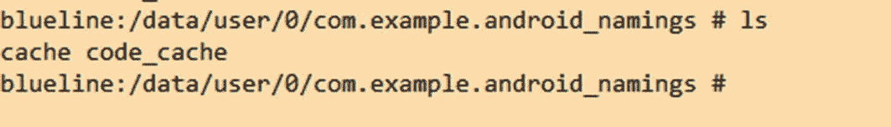
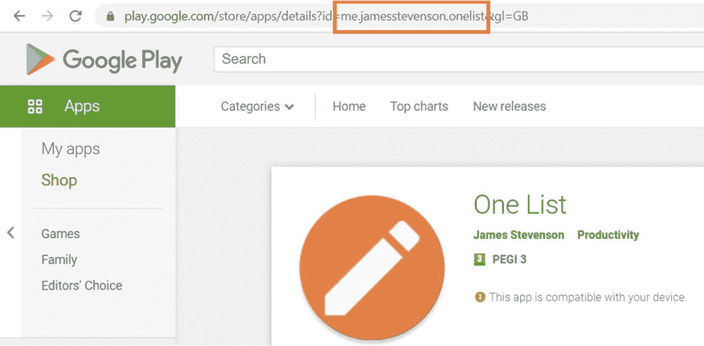
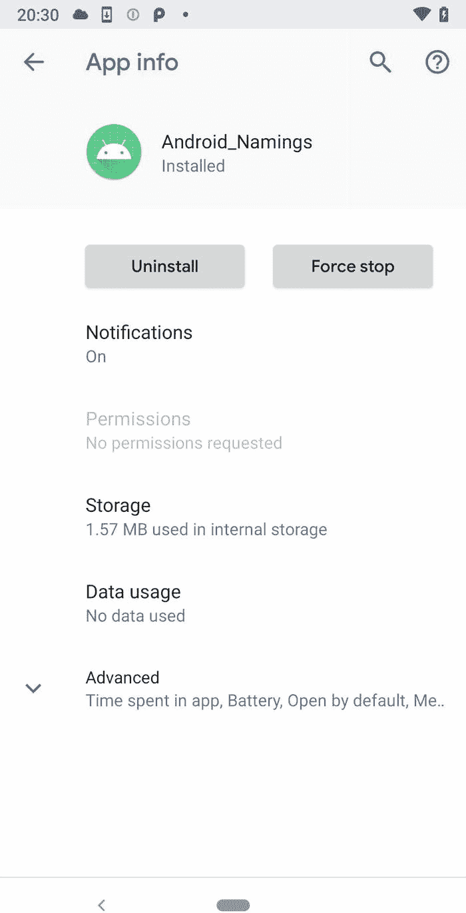

# 5.应用程序名称、Android 包名称和 id

Android 使用多个命名约定来唯一标识一个 Android 应用程序；这些已在下文中进行了总结，并在本章中进行了更详细的分解:

*   **Java 包名**——设置在代码库中，描述项目的文件夹结构和应用程序的结构，帮助模块化应用程序组件。这用于区分多个同名包中的类，也用于反射等技术。它使用反向互联网域约定，比如`com.mywebsite.blog`。

*   **包 ID** -通过包属性在清单文件中设置。这是谷歌 Play 商店和安卓系统使用的。这必须与 Java 包名相匹配。它使用反向互联网域约定，比如`com.mywebsite.blog`。

*   **应用程序 ID**——在 Gradle 构建文件中设置，并在构建后替换清单文件中的包 ID。它不必匹配包 ID 或 Java 包名。它使用反向互联网域约定，比如`com.mywebsite.blog`。

*   **应用名称** -不遵循反向互联网域名约定的名称(因此可以是诸如 *myappname* 的字符串)，并显示给最终用户。

这些值都不能以编程方式更改。这是因为对于包 ID、应用程序 ID 和应用程序名称，它们或者已经编译过(对于 Java 包名称)，或者位于 manifest 或 res 文件夹中(它们是只读的)。

## Java 包名

Java 包名 <sup>[1](#Fn1)</sup> 是一个独特的小写(为了避免与接口或类名冲突)字符串序列，以反向互联网域约定编写。它在每个类文件中设置(如下所示),描述了项目的文件夹结构和应用程序的结构，并有助于模块化应用程序组件。反过来，Java 包名也用于描述反射等 Java 技术如何与应用程序交互。属于网站`jamesstevenson.me`的银行应用程序的 Java 包名称的例子可以是`me.jamesstevenson.banking`。

*活动示例:*

```java
package me.jamesstevenson.banking;

import androidx.appcompat.app.AppCompatActivity;
import android.os.Bundle;

public class MainActivity extends AppCompatActivity {

    @Override
    protected void onCreate(Bundle savedInstanceState) {
        super.onCreate(savedInstanceState);
        setContentView(R.layout.activity_main);
    }
}

```

由于以下标识符，在 Android 中很少有理由(除了反射之外)在代码库之外共享应用程序的包名。

## 包 ID

应用程序的包 ID 在`AndroidManifest.xml package`属性中设置，并且必须与 Java 包名匹配。如果使用 Gradle 构建工具，在构建完成后，包 ID 将被应用程序 ID 所取代。这被用作生成`R.java`类的名称空间(用于资源处理)以及解析相对类名(例如`.MainActivity`到`com.example.example_app.MainActivity`)的构建过程的一部分。构建完成后，谷歌 Play 商店和 Android 系统将使用它，如 Android ID 部分所述。

*Android 清单中的包 ID 示例:*

```java
<manifest xmlns:android="http://schemas.android.com/apk/res/android"
    package="com.example.android_namings">

```

如上所述，可以通过更改包元素，在 *AndroidManifest.xml* 文件中直接编辑包 ID；然而，如果使用 Gradle 进行构建，并且您希望在构建后维护您的包 ID，请确保删除您的`build.gradle`文件中的 Application ID 元素，如下所述，否则它将被替换。

### 正在检索包 ID

虽然这些标识符都不能以编程方式更改，但它们可以被访问。这将检索构建过程中的包 ID 值。

*检索包 ID 的示例:*

```java
Log.v("PackageID BuildConfig", BuildConfig.APPLICATION_ID);
Log.v("PackageID context", getApplicationContext().getPackageName());

```

## 应用程序 ID

除了包 id，当使用 Gradle 和 Android 构建工具时，您还可以设置一个应用程序 ID。

有三条规则涵盖了应用程序 ID 名称的创建:

*   它必须至少有两段(一个或多个点)。

*   每段必须以字母开头。

*   所有字符必须是字母数字或下划线[a-zA-Z0-9_]。

通过`applicationId`属性在 Gradle `build.gradle`文件中设置应用 ID。应用程序 ID 可以不同于您的包 ID，也可以不同于您的 Java 包名。



图 5-2

应用程序的内部存储文件路径



图 5-1

谷歌 Play 商店上市

该应用 ID 在构建后替换应用的包 ID，从而允许包 ID 在构建过程中使用，然后替换它，以便应用 ID 由谷歌 Play 商店(如图 [5-1](#Fig1) 所示)和 Android 系统(如图 [5-2](#Fig2) 所示)使用。如前所述，这是为了不在程序代码库之外共享内部 Java 包名。记住这一点，在 Java 包名为`com.example.internalname`的例子中，应用程序名需要在谷歌 Play 商店中显示为`com.example.appname`；需要将`AndroidManifest.xml`文件中的包 ID 设置为`com.example.internalname`，并将`build.gradle`文件中的`applicationId`属性设置为`com.example.appname`。

在不使用 Gradle 的情况下，需要重构 Java 包名以匹配`com.example.appname,`，并且`AndroidManifest.xml`中的包 ID 属性也需要设置为`com.example.appname`。

`Setting Application ID in``Gradle build file`T2】

```java
defaultConfig {
    applicationId "com.example.appname"
    minSdkVersion 16
    targetSdkVersion 29
    versionCode 1
    versionName "1.0"

    testInstrumentationRunner "androidx.test.runner.AndroidJUnitRunner"
}

```

### 后缀和味道

除了应用程序 ID 和包 ID 可以不同之外，您还可以为您的 Android 项目创建不同的后缀——命名产品风格。这通常是因为应用程序的不同版本(如付费和试用版)有不同的应用程序 ID。后缀可以在应用程序`build.gradle`文件中修改。

*在 Gradle build 文件中修改* *后缀和**:*

```java
android {
    defaultConfig {
        applicationId "com.example.appname"
    }
    productFlavors {
        free {
            applicationIdSuffix ".trial"
        }
        pro {
            applicationIdSuffix ".paid"
        }
    }
}

```

## 应用程序名称

Android 中的应用名称是最终用户可见的(如图 [5-3](#Fig3) 图 [5-4](#Fig4) 所示)；这是显示在应用程序设置页面上的内容，也是默认情况下显示在应用程序图标下的内容(但是，在某些情况下，应用程序图标和文本可以通过编程切换<sup>T5】2</sup>)。


图 5-4

应用程序图标和标题



图 5-3

应用程序设置的页面

可以通过编辑`AndroidManifest.xml`文件中的`label`属性来设置应用程序名称，如下所示。最佳实践是将它链接到字符串资源中的一个`String`；然而，情况并不一定如此。

*在 Android 清单文件中设置应用程序名称:*

```java
android:label="My Application Name"

```

### 正在检索应用程序名称

*可以通过编程方式检索应用程序名称:*

```java
public static String getApplicationName(Context context) {
    ApplicationInfo applicationInfo = context.getApplicationInfo();
    int stringId = applicationInfo.labelRes;
    return stringId == 0 ? applicationInfo.nonLocalizedLabel.toString() : context.getString(stringId);
}

```

<aside aria-label="Footnotes" class="FootnoteSection" epub:type="footnotes">Footnotes [1](#Fn1_source)

"命名一个包(Java 教程>学习 Java…. " [`https://docs.oracle.com/javase/tutorial/java/package/namingpkgs.html`](https://docs.oracle.com/javase/tutorial/java/package/namingpkgs.html) 。5 月 11 日访问。2020.

  [2](#Fn2_source)

“如何以编程方式更改您的 Android 应用程序图标和…”2019 年 4 月 29 日， [`https://blog.jakelee.co.uk/programmatically-changing-app-icon/`](https://blog.jakelee.co.uk/programmatically-changing-app-icon/) 。5 月 11 日访问。2020.

 </aside>