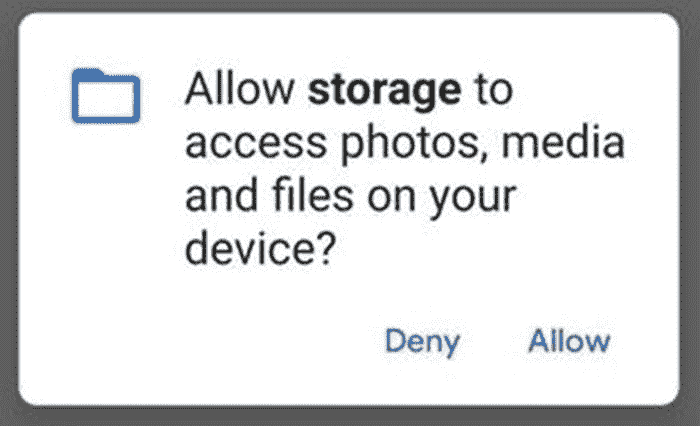

# 六、仓库

## 划分

Android(从 Android 2.2 开始)使用 ext4 文件系统，其核心遵循 Linux 文件系统结构——使用由`/`表示的单个根。

*在 Android root 中，有几个关键分区；* <sup>[1](#Fn1)</sup> <sup>*，*</sup><sup>[2](#Fn2)</sup>*这些分区可以在 Android shell 中使用以下命令列出:*

```java
cat /proc/mounts

```

根据设备版本、原始设计制造商、 <sup>[3](#Fn3)</sup> 和原始设备制造商的不同，文件系统根目录下安装和存在的特定文件夹可能会有所不同。因此，下面列出了一些最常见的文件夹:

*   **/boot**——引导分区包括 RAM 磁盘和内核映像。这两者都是通过`mkbootimg` <sup>[4](#Fn4)</sup> 捆绑在一起的，这是一个用于打包引导镜像的实用程序。没有这个分区，设备将无法启动。

*   **/系统**——这个分区覆盖了 Android 框架。这包括 Android GUI 和系统应用——在`/system/app and /system/priv-app`可用。擦除该分区会将 Android 从设备中移除，同时保持可引导性。

*   **/厂商**——这个分区包含了不包含在股票 AOSP <sup>[5](#Fn5)</sup> 中的二进制文件和资源(主要关注特定于主板的组件的内核模块，特定于主板的守护进程，或者硬件抽象层(HALs)的附加特性)。这个分区主要是给原始设计厂商(比如高通、Exynos、华为)添加定制的二进制和 GUI。从 Android 8 开始，强制执行 <sup>[6](#Fn6)</sup> 当 ODM(原始设计制造商)或 OEM(原始设备制造商)将这些组件添加到设备时，它们应该被添加到`/vendor`分区，而不是`/system`分区，这是强制执行之前通常使用的位置。

*   **/ODM**—`/vendor`分区的扩展，为原设计厂商设计。 <sup>[7](#Fn7)</sup> 这种分区允许多个设备使用相同的`/vendor partition`并允许`/odm`分区在它们之间提供微小的变化。类似于这个分区中的`/system`分区，也有应用(`/odm/app/`)、本地库(`/odm/lib[64]`)等等的位置。Android 10 中增加了对该分区的全面支持。

*   **/OEM**——原始设备制造商 <sup>[8](#Fn8)</sup> (如三星、一加、华为)可能会决定对 AOSP 形象做出改变——例如，添加他们自己的应用、用户界面或功能。对此的一个扩展是 Android 9 中添加的`/product`分区，与 OEM 分区不同，它是可更新的。

*   **/recovery** -该分区存储恢复镜像。

*   **/数据** -称为用户数据分区，该分区包括应用的内部存储(例如`/data/user/0/com.android.chrome`)以及包含`/data/local/tmp`目录和其他类型的用户数据。从 Android 5 开始，Android 已经支持在同一个设备上拥有多个用户；这意味着不同用户的内部存储将在不同的位置可用(例如`/data/user/0/com.android.chrome`和`/data/user/1/com.android.chrome`)。作为工厂重置的一部分，该分区被擦除。

*   **/cache** -这个分区是 Android 存储常用组件的地方，也是存储一些数据作为无线更新的一部分的地方。

*   **/杂项** -杂项系统设置，通常以开/关开关的形式。

*   **/元数据** -设备加密时使用元数据分区。

*   **/radio** -该分区仅在设备包含无线电组件时使用。

*   这个分区包含可信操作系统的二进制映像。

*   **/SD card**——在 Android 4 之前，这个目录是可以找到连接的 SD 卡的存储位置。从 Android 4 开始，这变成了所谓的“内置 SD 卡”(SD 卡安装移到了`/sdcard_ext or /sdcard/external_sd`)。这也被称为设备的外部存储器(不管它是否指的是实际的 SD 卡),下面将详细讨论。

### `External and Internal Storage`

#### 内存储器

每个应用都有自己的内部存储空间来存储任意数据。这个空间不需要任何写入权限，并且对每个应用都是沙箱化的——这意味着一个应用不能读取另一个应用的内部存储。

*应用的内存位于以下路径(用 Android 用户 id 替换*`0`*):*

```java
/data/user/0/<Package ID>/

```

默认情况下，应用的内部存储结构分为几个子目录；但是，可以向该空间添加任意文件夹。虽然这种存储没有限制，但建议将特定的文件类型存储在特定的目录中；但是，它不是强制的。

*   **/files**-files 目录用于存放任意文件。这些文件可以是文本文件、图像、JSON 之类的序列化文件或任何其他文件类型。要检索该目录的文件路径，请使用`getApplicationContext().getFilesDir()`。

*   **/数据库** -数据库目录用于存储数据库。Android 对创建和管理 SQLite 数据库有很多内置的支持；然而，其他数据库类型如领域数据库 <sup>[9](#Fn9)</sup> 也可以存储在这里。创建这些类型的数据库时，默认情况下，这是保存它们的目录。

*   **/shared_prefs** -共享偏好是 Android 对易于访问的键值对的接受。这些以 XML 格式保存。创建共享偏好设置时，这是保存它们的目录。

*   **/缓存** -缓存目录 <sup>[10](#Fn10)</sup> 是为保存临时文件而设计的，因为当设备上其他地方需要空间时，Android 系统会删除该文件夹中的文件。可以使用应用上下文:`getApplicationContext().getCacheDir()`访问缓存目录。

*   **/lib** -用于存储共享库文件。

*   **/code _ cache**——类似于缓存目录，在 API level 21 中增加，这个目录是为存储缓存代码而设计的。和缓存目录一样，如果需要空间，它也会被 Android 系统清除。这个目录的路径可以用应用上下文:`getApplicationContext().getCodeCacheDir()`来检索。

*   **/no_backup** -类似于/files 目录，但是，存储在该目录中的文件将被排除在自动备份工具之外。 <sup>[11](#Fn11)</sup>

可以使用应用上下文来检索应用内部存储的路径。重要的是要记住，这些文件路径可能会随着时间和操作系统版本的不同而改变，因此不建议存储硬编码的路径。

*从 API 级别 24 及更高版本开始，可以使用以下内容来检索应用内部存储的根目录的文件路径:*

```java
getApplicationContext().getDataDir();

```

*在 API 级之前，可以使用以下:*

```java
getApplicationContext().getFilesDir().getParent();

```

#### 外部存储器

如前所述，在 Android 4 之前，`/sdcard`目录是可以找到连接的 SD 卡的存储位置。从 Android 4 开始，这变成了所谓的“内部 SD 卡”或更常见的“外部存储”， <sup>[12](#Fn12)</sup> ，这是一个跨应用的共享空间。从 Android 10 开始，这个“共享空间”变成了一个术语，称为作用域存储； <sup>[13](#Fn13)</sup> 这意味着即使应用可以访问外部存储(需要`READ_EXTERNAL_STORAGE or WRITE_EXTERNAL_STORAGE`权限)，它现在也只能进行只读访问，以及访问应用特定的目录和应用创建的特定类型的媒体(除非它可以访问`MANAGE_EXTERNAL_STORAGE permission)`)。除此之外，在有多个用户的设备上，每个用户都有自己的隔离作用域存储。

记住这一点，如果针对 API 级别 28 或更低进行编译，那么您可以使用`Environment`类来检索设备外部存储的路径。然而，如果运行在 API 级别 29 及以上，这是不赞成的，返回的文件路径将不可访问，所以应该使用应用*上下文*(对于作用域存储)。

*获取全局外部存储(API 等级 1* `–` *28):*

```java
Environment.getExternalStorageDirectory();

```

*获取应用范围(沙盒)外部存储(API 级别 29+):*

```java
getApplicationContext().getExternalFilesDir(null);

```

与内部存储不同，如果应用想要向全局外部存储写入或读取文件，它需要`WRITE_EXTERNAL_STORAGE`或`READ_EXTERNAL_STORAGE`权限。写入外部存储是运行时(危险)权限，而读取只是普通/清单权限。作用域存储不需要权限。

*以下是设置清单权限的示例:*

```java
<uses-permission android:name="android.permission.WRITE_EXTERNAL_STORAGE" />
<uses-permission android:name="android.permission.READ_EXTERNAL_STORAGE" />

```

由于写入外部存储器是一种危险的权限，它要求用户在应用授予访问权限之前接受运行时权限。这将向用户显示一个通知，如图 [6-1](#Fig1) 所示。

*外部存储器写运行时请求可以用以下代码运行。*

```java
if (Build.VERSION.SDK_INT >= 23) {
    if (!isStoragePermissionGranted()){
        ActivityCompat.requestPermissions(this, new String[]{Manifest.permission.WRITE_EXTERNAL_STORAGE}, 1234567);
    }
}

```

*检查是否已经设置了* `WRITE_EXTERNAL_STORAGE` *运行时权限的示例方法:*

```java
public  boolean isStoragePermissionGranted() {
    if (Build.VERSION.SDK_INT >= Build.VERSION_CODES.M) {
        if (checkSelfPermission(android.Manifest.permission.WRITE_EXTERNAL_STORAGE)
                == PackageManager.PERMISSION_GRANTED) {
            Log.v(TAG,"Permission is granted");
            return true;
        } else {

            Log.v(TAG,"Permission is revoked");
            ActivityCompat.requestPermissions(this, new String[]{Manifest.permission.WRITE_EXTERNAL_STORAGE}, 1);
            return false;
        }
    }
    else { //permission is automatically granted on sdk<23 upon installation
        Log.v(TAG,"Permission is granted");
        return true;
    }
}

```

*权限改变时执行的活动回调* *:*



图 6-1

运行时权限对话框

```java
@Override
public void onRequestPermissionsResult(int requestCode, String[] permissions, int[] grantResults) {
    super.onRequestPermissionsResult(requestCode, permissions, grantResults);
    if(grantResults.length > 0 && grantResults[0] == PackageManager.PERMISSION_GRANTED){
        Log.v(TAG,"Permission: "+permissions[0]+ " was "+grantResults[0]);
        //write file to external storage
    }
}

```

## 文本文件

文件可以写入应用内部或外部存储的任何地方(记住从 Android 10 开始的作用域存储)。这些目录的位置可以通过前面提到的方法调用来检索。

*要创建一个操作特定文件的 File 对象，使用下面的代码，其中 filename 是一个表示文件路径的 String 对象:*

```java
String filename = "myFile.txt";
File file = new File(getApplicationContext().getFilesDir(), filename);

```

*写文件:*

```java
    public void writeFileInInternalStorage(File fileToWrite, String fileBody){

        // If file doesn't exist attempt to make full directory path
        if(!fileToWrite.exists()){
            fileToWrite.getParentFile().mkdir();
        }

        // Write to file
        try{
            FileWriter writer = new FileWriter(fileToWrite);
            writer.append(fileBody);
            writer.flush();
            writer.close();

        }catch (Exception e){
            e.printStackTrace();

        }
    }

```

*读取文件:*

```java
private String readFromFile(File file) {

        String ret = "";

        try {
            FileInputStream inputStream = new FileInputStream(file);

            if ( inputStream != null ) {
                InputStreamReader inputStreamReader = new InputStreamReader(inputStream);
                BufferedReader bufferedReader = new BufferedReader(inputStreamReader);
                String receiveString = "";
                StringBuilder stringBuilder = new StringBuilder();

                while ( (receiveString = bufferedReader.readLine()) != null ) {
                    stringBuilder.append("\n").append(receiveString);
                }

                inputStream.close();
                ret = stringBuilder.toString();
            }
        }
        catch (FileNotFoundException e) {
            Log.e("TAG", "File not found: " + e.toString());
        } catch (IOException e) {
            Log.e("TAG", "Can not read file: " + e.toString());
        }

        return ret;
    }

```

*删除文件:*

```java
private void deleteStorageFile(File file){
    file.delete();
}

```

## 数据库

下面详细介绍如何在 Android 中创建一个简单的 SQLite 数据库。在 Android 中，默认情况下，数据库是在内存的`/databases`目录中创建的。

`Define a schema and contract:`

```java
public final class databaseTemplate {
    // Inner class that represents the table values
    public static class databaseData implements BaseColumns {
        public static final String TABLE_NAME = "TABLE_NAME";
        public static final String COLUMN_ONE = "FIRST_COLUMN_NAME";
        public static final String COLUMN_TWO = "SECOND_COLUMN_NAME";
    }
}

```

*创建数据库助手:*

```java
public class databaseHelper extends SQLiteOpenHelper {
    public databaseHelper(Context context) {
        super(context, NAME, null, VERSION);
    }
    private static final String SQL_CREATE_INSTRUCTION =
        "CREATE TABLE " + databaseTemplate.databaseData.TABLE_NAME + " (" +
databaseTemplate.databaseData._ID + " INTEGER PRIMARY KEY," +
            databaseTemplate.databaseData.COLUMN_ONE + " TEXT," +
            databaseTemplate.databaseData.COLUMN_TWO + " TEXT)";
    private static final String SQL_DELETE_INSTRUCTION =
        "DROP TABLE IF EXISTS " + databaseTemplate.databaseData.TABLE_NAME;
    public static final int VERSION = 1; //increment if schema changed
    public static final String NAME = "database.db"; // database name
    // Standard Database functions
    public void onCreate(SQLiteDatabase database) {
        database.execSQL(SQL_CREATE_INSTRUCTION);
    }
    public void onUpgrade(SQLiteDatabase database, int previousVersion, int currentVersion) {
        database.execSQL(SQL_DELETE_INSTRUCTION);
        onCreate(database);
    }
}

```

*向数据库添加行:*

```java

private void addDataToDatabase(Context context, String columnOneData, String columnTwoData){
    databaseHelper databaseHelper = new databaseHelper(context);
    SQLiteDatabase database = databaseHelper.getWritableDatabase();
    ContentValues contentValues = new ContentValues();
    contentValues.put(databaseTemplate.databaseData.COLUMN_ONE, columnOneData);
    contentValues.put(databaseTemplate.databaseData.COLUMN_TWO, columnTwoData);
    database.insert(databaseTemplate.databaseData.TABLE_NAME, null, contentValues);
}

```

*读取数据库:*

```java
private List readFromDatabase(Context context){
    final String TABLE_NAME = databaseTemplate.databaseData.TABLE_NAME;
    String selectQuery = "SELECT * FROM " + TABLE_NAME;
    databaseHelper databaseHelper = new databaseHelper(context);
    SQLiteDatabase database = databaseHelper.getWritableDatabase();
    Cursor cursor = database.rawQuery(selectQuery, null);
    ArrayList data = new ArrayList();
    if (cursor.moveToFirst()) {
        do {
            int idIndex = cursor.getColumnIndexOrThrow(databaseTemplate.databaseData._ID);
            int columnOneIndex = cursor.getColumnIndexOrThrow(databaseTemplate.databaseData.COLUMN_ONE);
            int columnTwoIndex = cursor.getColumnIndexOrThrow(databaseTemplate.databaseData.COLUMN_TWO);
            String idValue = String.valueOf(cursor.getString(idIndex));
            String columnOneValue = String.valueOf(cursor.getString(columnOneIndex));
            String columnTwoValue = String.valueOf(cursor.getString(columnTwoIndex));
            ArrayList rowData = new ArrayList();
            rowData.add(idValue);
            rowData.add(columnOneValue);
            rowData.add(columnTwoValue);
            data.add(rowData);
        } while (cursor.moveToNext());
    }
    cursor.close();
    return data;
}

```

*从数据库中删除一行:*

```java
private void deleteRowFromDatabase(Context context, int rowIdToRemove){
    databaseHelper databaseHelper = new databaseHelper(context);
    SQLiteDatabase database = databaseHelper.getReadableDatabase();
    String selection = databaseTemplate.databaseData._ID + " LIKE ?";
    String[] selectionValues = {String.valueOf(rowIdToRemove)};
    database.delete(databaseTemplate.databaseData.TABLE_NAME, selection, selectionValues);
}

```

## 共享偏好

共享偏好 <sup>[14](#Fn14)</sup> 被写入应用内部存储器的`/shared_prefs`目录。它们采用 XML 键-值对的形式，其中共享的首选项名称成为 XML 文件的名称(附加。xml)。

*从下面可以看出，在这个共享偏好中有两个条目，一个类型为* `long` *的条目称为* `last_cleanup` *，另一个类型为* `string` *的条目称为* `webapp_name` *:*

```java
<?xml version=’1.0’ encoding=’utf-8’ standalone=’yes’ ?>
<map>
    <long name="last_cleanup" value="1585307669741" />
    <string name="webapp_name"  value="webapp"/>
</map>

```

共享首选项接受以下原始数据类型

*   线

*   （同 Internationalorganizations）国际组织

*   布尔代数学体系的

*   长的

*   浮动

*   字符串集

创建共享首选项时，必须提供共享首选项的名称。这是 XML 文件的名称。除此之外，您还需要提供要保存到共享首选项的键-值对，然后使用`.apply()`(在 API level 8 中添加)进行异步保存，或者使用`.commit()`进行同步保存(返回一个表示成功的布尔值)。除此之外，您还必须提供模式。模式是一个整数，代表以下内容之一:

*   **MODE_PRIVATE** -默认模式，文件只能由创建它的应用访问。

*   **MODE _ WORLD _ READABLE**——在 API 等级 17 中被弃用，从 API 等级 24 开始抛出*安全异常*。这允许所有应用对创建的文件具有读取权限。

*   **MODE _ WORLD _ WRITEABLE**——在 API 等级 17 中被弃用，从 API 等级 24 开始抛出*安全异常*。这允许所有其他应用对创建的文件进行写访问。

*   **MODE_MULTI_PROCESS** -在 API 级别 23 中已弃用。在 API 级别 10 之前，这是默认行为。此后，默认行为是将共享首选项加载到内存中，并对内存中的共享首选项执行读取和修改。这意味着，如果在应用运行时编辑了原始文件，它将被应用对共享首选项所做的任何更改覆盖。设置此模式后，将检查共享首选项的修改情况，即使它已经加载到内存中。

*添加键值对:*

```java
SharedPreferences sharedPref
        = getApplicationContext().getSharedPreferences("MySharedPref",
        MODE_PRIVATE);
SharedPreferences.Editor editor = sharedPref.edit();
editor.putString("key", "value");
editor.apply();

```

*从共享首选项中读取时，必须提供被检索类型的默认值。如果提供的密钥不存在，则返回:*

```java
SharedPreferences sharedPref
        = getApplicationContext().getSharedPreferences("MySharedPref",
        MODE_PRIVATE);
String value = sharedPref.getString("key", "default value");

```

*删除共享偏好类似于编辑偏好；但是，不使用. put 方法。改用 remove()方法:*

```java
SharedPreferences sharedPref = getSharedPreferences("MySharedPref", MODE_PRIVATE);
SharedPreferences.Editor editor = sharedPref.edit();
editor.remove("key");
editor.apply();

```

## 文件提供商

截至 Android API 等级 24，不能直接与其他应用共享文件 URIs <sup>[15](#Fn15)</sup> 。在这之后，你必须使用一个`FileProvider` <sup>[16](#Fn16)</sup> 来安全地从你的应用 <sup>[17](#Fn17)</sup> 提供一个文件给另一个应用。

*在设置* `FileProvider` `,` *时，添加一个* `provider` *标签到应用的清单文件* `application` *标签中，遵循以下格式，记住要更改包名:*

```java
<provider
    android:name="androidx.core.content.FileProvider"
    android:authorities="com.example.storage.fileprovider"
    android:grantUriPermissions="true"
    android:exported="false">
    <meta-data
        android:name="android.support.FILE_PROVIDER_PATHS"
        android:resource="@xml/filepaths" />
</provider>

```

在这之后，在你的应用`res`目录下，在名为`xml`的子文件夹`filepaths.xml.`中创建一个 XML 资源，然后定义共享路径和将在 URI 中显示的名称。下面的例子共享应用的`myText`文件夹的整个根目录，其中 URI 是`content://com.example.storage.fileprovider/myText`。

*RES 中的 filepaths xml 文件应该包括:*

```java
<?xml version=”1.0” encoding=”utf-8”?>
<paths>
    <files-path path="/" name="myText" />
</paths>

```

*在此之后，文件(在指定的目录内)可以像平常一样通过意向发送:*

```java
File file =new File(getApplicationContext().getFilesDir(),"/myText/test.txt");
writeFileInInternalStorage(file, "Hello World"); // This function is referenced in the Text Files section.

Intent intent = new Intent(Intent.ACTION_SEND);

Uri contentUri = getUriForFile(getApplicationContext(), "com.example.storage.fileprovider", file); //replace with package name
intent.setType("text/plain");
intent.putExtra(Intent.EXTRA_STREAM,contentUri);

startActivity(Intent.createChooser(intent , "Sharing Text File"));

```

## 素材文件夹

assets 文件夹 <sup>[18](#Fn18)</sup> 可由应用开发人员用于在编译时间之前存储任意只读数据，这些数据可在运行时读取。与 res (Resources)文件夹不同，任何文件类型都可以存储在这个目录中；但是，必须将其添加到应用预编译中。为此，通过`app` ➤ `New` ➤ `Folder` ➤ `Assets Folder`在相对文件路径`\app\src\main\assets`或 Android Studio 中创建一个文件夹。Post 编译时，assets 文件夹位于 APK 的根目录下`/assets`。

*访问素材文件夹中的文件:*

```java
private String readFileFromAssets(String filename, String type){
    BufferedReader reader = null;

    StringBuilder stringBuilder = new StringBuilder();

    try {
        reader = new BufferedReader(
                new InputStreamReader(getAssets().open(filename), type)); //e.g. "utf-8"

        String mLine;

        while ((mLine = reader.readLine()) != null) {
            stringBuilder.append(mLine+"\n");
        }
    } catch (IOException e) {
        e.printStackTrace();
    } finally {
        if (reader != null) {
            try {
                reader.close();
            } catch (IOException e) {
                e.printStackTrace();
            }
        }
    }
    return stringBuilder.toString();
}

```

## 资源

与素材类似，这些资源是只读的，并且在预编译时提供。与 assets 文件夹不同，存储在 resource 文件夹中的数据(位于 APK 根目录下的`/res)`)必须遵循特定的约定，比如文件类型。可以包含在 res 文件夹中的数据示例包括字符串和整数的 XML 文件以及应用图标。

*从 res 文件夹:*返回一个字符串(字符串应该存储在 strings.xml 文件中)

```java
getApplicationContext().getString(R.string.string_name)

```

*从 res 文件夹中返回图像。请记住，图像存储在 Res drawable 文件夹的根目录下，并且在访问图像时，不要包括图像扩展名:*

```java
ContextCompat.getDrawable(getApplicationContext(), R.drawable.image_name)

```

<aside aria-label="Footnotes" class="FootnoteSection" epub:type="footnotes">Footnotes [1](#Fn1_source)

"分区和映像| Android 开源项目."2020 年 1 月 6 日，[<font category = " non proportional ">https://source。安卓。com/devices/boot loader/partitions-images</Emphasis>T1。5 月 11 日访问。2020.](https://source.android.com/devices/bootloader/partitions-images)

  [2](#Fn2_source)

“安卓文件系统。”[<font category = " non proportional ">http://www。uo 巴比伦。edu。IQ/eprints/publication _ 4 _ 13681 _ 1356。pdf < /强调>](http://www.uobabylon.edu.iq/eprints/publication_4_13681_1356.pdf) 。5 月 11 日访问。2020.

  [3](#Fn3_source)

"构建 ODM 分区| Android 开源项目."2020 年 1 月 6 日， [`https://source.android.com/devices/bootloader/odm-partitions`](https://source.android.com/devices/bootloader/odm-partitions) 。5 月 11 日访问。2020.

  [4](#Fn4_source)

" Android:启动映像- Compulab Mediawiki . "[`https://mediawiki.compulab.com/index.php/Android:_Boot_image`](https://mediawiki.compulab.com/index.php/Android:_Boot_image)2015 年 10 月 21 日。5 月 11 日访问。2020.

  [5](#Fn5_source)

“安卓开源项目。” [`https://source.android.com/`](https://source.android.com/) 。5 月 11 日访问。2020.

  [6](#Fn6_source)

"构建产品分区| Android 开源项目."2020 年 1 月 6 日， [`https://source.android.com/devices/bootloader/product-partitions`](https://source.android.com/devices/bootloader/product-partitions) 。5 月 11 日访问。2020.

  [7](#Fn7_source)

"构建 ODM 分区| Android 开源项目."2020 年 1 月 6 日， [`https://source.android.com/devices/bootloader/odm-partitions`](https://source.android.com/devices/bootloader/odm-partitions) 。5 月 11 日访问。2020.

  [8](#Fn8_source)

"构建产品分区| Android 开源项目."2020 年 1 月 6 日， [`https://source.android.com/devices/bootloader/product-partitions`](https://source.android.com/devices/bootloader/product-partitions) 。5 月 11 日访问。2020.

  [9](#Fn9_source)

"领域:在很短的时间内创建反应式移动应用." [`https://realm.io/`](https://realm.io/) 。5 月 11 日访问。2020.

  [10](#Fn10_source)

“语境|安卓开发者。” [`https://developer.android.com/reference/android/content/Context`](https://developer.android.com/reference/android/content/Context) 。5 月 11 日访问。2020.

  [11](#Fn11_source)

" Android -平台/框架/基础- Android GoogleSource . " [`https://android.googlesource.com/platform/frameworks/base/+/a7835b6%5E!/`](https://android.googlesource.com/platform/frameworks/base/%252B/a7835b6%255E%2521/) 。5 月 11 日访问。2020.

  [12](#Fn12_source)

“安全提示| Android 开发者。”2019 年 6 月 3 日， [`https://developer.android.com/training/articles/security-tips`](https://developer.android.com/training/articles/security-tips) 。5 月 11 日访问。2020.

  [13](#Fn13_source)

“数据和文件存储概述| Android 开发人员。”2019 年 6 月 3 日， [`https://developer.android.com/training/data-storage`](https://developer.android.com/training/data-storage) 。5 月 11 日访问。2020.

  [14](#Fn14_source)

“保存键值数据| Android 开发者。”2019 年 6 月 3 日， [`https://developer.android.com/training/data-storage/shared-preferences`](https://developer.android.com/training/data-storage/shared-preferences) 。5 月 11 日访问。2020.

  [15](#Fn15_source)

"分享有意图的内容| CodePath Android Cliffnotes . " [`https://guides.codepath.com/android/Sharing-Content-with-Intents`](https://guides.codepath.com/android/Sharing-Content-with-Intents) 。5 月 11 日访问。2020.

  [16](#Fn16_source)

“FileProvider | Android 开发者。”2019 年 12 月 27 日， [`https://developer.android.com/reference/androidx/core/content/FileProvider`](https://developer.android.com/reference/androidx/core/content/FileProvider) 。5 月 11 日访问。2020.

  [17](#Fn17_source)

“设置文件共享| Android 开发者。” [`https://developer.android.com/training/secure-file-sharing/setup-sharing`](https://developer.android.com/training/secure-file-sharing/setup-sharing) 。5 月 11 日访问。2020.

  [18](#Fn18_source)

“应用资源概述| Android 开发者。”2019 年 6 月 3 日， [`https://developer.android.com/guide/topics/resources/providing-resources`](https://developer.android.com/guide/topics/resources/providing-resources) 。5 月 11 日访问。2020.

 </aside>