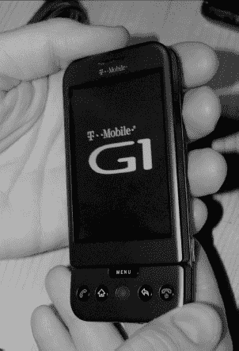
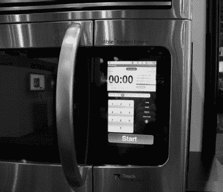
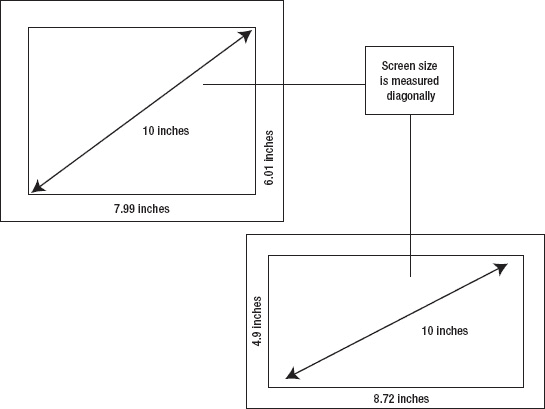

# 一、什么是 Android：选择合适的平板电脑

Android 跟随 iPhone 进入市场，但它的受欢迎程度却大幅上升。几乎每个手机制造商都在手机上安装了安卓系统，美国每个主要的无线公司都有安卓系统，再加上大部分地区。它灵活、有趣，拥有数以千计的应用程序。谷歌免费发布操作系统并无大碍。

在这一章中，你将了解 Android 操作系统的历史。您还将了解 Android 是如何从手机发展到平板电脑的。在下一章中，你将了解如何选择适合你的平板电脑。

### 安卓的历史

早在 2005 年，也就是苹果用 iPhone 彻底改变手机世界的两年前，谷歌收购了安迪·鲁宾创立的一家成立仅两年的小公司。鲁宾当时最出名的是创办了 Danger，Inc .，它创造了 T-Mobile 品牌的 Sidekick 手机。鲁宾的新公司 Android 还包括 Orange(一家英国电话公司)的理查德·米诺、WebTV 的克里斯·怀特以及 WebTV 和 Moxi 的安迪·麦克法登。最初，鲁宾与谷歌接触，寻求可能的启动资金，但谷歌最终收购了 Android 及其背后的人才团队。

Android 有什么不同？以前的手机操作系统要么是由设备制造商制造的，要么是收费授权给他们的。鲁宾的想法是放弃操作系统，寻找其他赚钱的方法。由于谷歌免费提供大部分网络产品，并从广告中赚钱，这个想法引起了谷歌的共鸣。

2007 年 11 月 5 日，谷歌宣布了 Android 操作系统和开放手机联盟，这是一个帮助开发该系统的公司团体。开放手机联盟成员包括电话运营商、软件开发商、设备制造商和零部件制造商。

与苹果和 iPhone 相比，Android 有着非常不同的理念。任何人都可以在设备中免费使用 Android，任何人都可以修改 Android，任何人都可以为它开发应用程序，而无需 iPhone 应用程序所需的复杂的预先批准过程。

谷歌还通过举办奖金丰厚的开发者竞赛，为 Android 应用市场播下了种子。因此，当第一款 Android 手机上市时，已经有一系列可供下载的应用程序了。右边的图片显示的是 G1，这是 2008 年上市的第一款安卓手机。

今天，Android 已经超越了手机。它为电子书阅读器、相框、谷歌电视、上网本甚至汽车音响提供动力。它的低成本和易于定制使其适用于便携式设备的各种应用。

对于本书来说，这些 Android 设备中最重要的当然是 Android 平板电脑。你可能想知道为什么安卓平板电脑上市这么久，尤其是在苹果推出 iPad 之后。有安卓平板可用，但它们需要安卓的修改版本；而且，除了三星 Galaxy Tab 之外，它们从来都没有什么市场。为什么？谷歌曾指望蜂巢。

### 安卓蜂巢

Android 操作系统版本都有甜点代号。名称也是按字母顺序排列的，所以您可以知道哪个版本是最新的。a 和 B 是保留名称，因此向公众发布的 Android 版本为 Android 1.0(无代号)、Cupcake (1.5)、Donut (1.6)、éclair(2.0 和 2.1)、Froyo (2.2)、Gingerbread (2.3)、Honeycomb (3.0 和 3.1)。下一个版本是冰淇淋三明治，于 2011 年 10 月推出。

Android Honeycomb 对平板电脑用户来说是最重要的版本，因为它是谷歌唯一明确打算在平板电脑上使用的版本，而且它完全可以进入 Android 市场。我将在第十三章“安卓市场”中更深入地讨论安卓市场冰淇淋三明治主要是为了给手机用户带来蜂窝平板电脑的功能。

这并不是说在 Honeycomb 之前没有设备试图打入市场。优派有 G-平板电脑。三星发布了 Galaxy Tab，爱可视推出了不同尺寸的全线安卓平板电脑。在撰写本文时，有计划要发布至少一个前蜂窝设备，HTC Flyer，尽管它最终将升级到蜂窝。

问题在于，前蜂窝平板电脑的可扩展性不好:应用程序和小工具只是更大，而不是真正利用可用空间，它们通常需要大量的操作系统调整才能工作，第三方应用程序也不总是表现良好。非平板电脑应用的可扩展性问题还没有完全解决，但已经有所改善。

#### HTC 和 Sense

制造商可以随心所欲地调整安卓系统；在移动世界，这意味着许多新的用户界面。

HTC 生产各种 Android 手机，并计划在本书即将出版时发布传单。传单宣传的功能之一是它将使用新版本的 HTC Sense UI(用户界面)。

Sense UI 是基于小部件的。Widgets 是小型的、永远在线的应用程序，运行在手机或平板电脑的主屏幕上，用于特定的目的，如显示天气信息或发布 Twitter 更新。这类似于桌面计算机上的 Windows 小工具。你可以在第六章:“图标、部件和标签”中了解更多关于部件的信息

当 Android 1.6 只提供三个屏幕进行定制时，Sense 提供了七个屏幕。屏幕以常见活动为中心，如工作和社交媒体，HTC 创建了几个定制的小工具，使使用电话活动更容易。Sense 还将一些信息联系在一起，比如将电话联系信息和脸书结合起来。

### 安卓的其他用途

Android 更有趣的用途之一是在手机以外的设备上。Android 驱动电子书阅读器和上网本(甚至可以驱动你的微波炉)。谷歌还推出了基于安卓系统的谷歌电视，正在升级运行蜂巢系统。

#### 安卓阅读器

Barnes and Noble Nook Color Reader 可能看起来不像 Android 设备，但它确实是。Nook 的 Android 版本已经被大幅修改，尽管有一个小型黑客社区致力于将这类设备恢复到更标准的 Android 版本。其他使用 Android 的电子阅读器包括 Springboard Alex、enTourage eDGe 和 Velocity Cruz。Amazon.com 提供安卓系统的 Kindle Fire 平板电脑。

你可能想知道阅读器和平板电脑有什么区别。Nook 甚至可以运行应用程序，所以区别似乎主要在于拼写。然而，大多数标榜自己为阅读器的设备都是以阅读为中心的。他们通常与特定的书店联系在一起，权力较小。其中一些还设计了一个对触摸不太敏感的屏幕，这样你就不会不小心失去在书中的位置。Kindle Fire 是这个规则的一个大例外。它的处理能力不亚于更大的平板电脑。

#### 多媒体播放器

三星在 2011 年公开推出了 Galaxy Player 系列。这一系列的设备基本上都是没有手机的 Galaxy 手机。他们运行应用程序的能力也有点独特。在撰写本文时，Galaxy Player 设备是唯一一款运行姜饼的非手机设备，获得了谷歌的许可，可以使用 Android Market(尽管 HTC 也在推出一款运行姜饼并使用 Sense UI 的平板电脑)。

其他公司也推出了从口袋大小到 10 英寸平板大小的多媒体播放器，尽管没有一款在市场上引起巨大轰动。

#### 上网本

2010 年消费电子展上到处都是希望销售上网本的公司，他们试图使用免费的 Android 操作系统来给自己定价上的竞争优势。到 2011 年的时候，大多数公司已经放弃了 Android 作为上网本操作系统。然而，华硕 EeePad Transformer 可能会扭转这一趋势，这取决于你认为它是上网本还是带键盘的平板电脑。

**注意:**我要警告你不要把安卓当上网本操作系统。在本文发表之时，Android 在没有触摸屏的系统上运行不佳，此类设备的运行效果也不如运行为全尺寸电脑设计的操作系统(如 Ubuntu Linux 或微软 Windows)的上网本。谷歌正在为上网本用户开发 Chrome 操作系统。

#### 谷歌电视

谷歌推出了一个整合电视和互联网节目的平台，名为谷歌电视。“遥控器”使用键盘，而不仅仅是一系列按钮，它包括谷歌的 Chrome 网络浏览器。

这是新一代连接互联网并运行应用程序的电视的一部分。您可以使用连接的电视来查找流媒体节目、查看天气、浏览网页、听音乐或更新您的脸书状态，而不是被动地接受节目。

谷歌电视平台运行在修改版的安卓系统上，谷歌计划在本书出版时为该平台引入一个应用市场，并升级谷歌电视运行安卓 3.1..索尼、罗技、三星和其他公司推出了谷歌电视设备，尽管它们也没有受到消费者的欢迎。

#### 微波炉、洗衣机和打印机。)

Touch Revolution 为其他公司开发了一款名为 NIM1000 的安卓触控界面。Touch Revolution 是一家*原创设计制造商* ( *ODM* )，这意味着它为其他公司创造产品，作为自己的品牌。你永远不会在界面上看到 Touch Revolution，但一位代表告诉我，该公司的技术正被用于为医疗设备和飞机座椅靠背上的电脑创建 Android 驱动的界面。右边的图片显示了该公司在 2010 年用于演示的 Android 驱动的微波炉。Parrot 使用 Android 驱动 ASTEROID，这是一个汽车音响系统。它还在高端数码相框中使用了安卓系统。

公司选择 Android 是因为它易于定制且免费。Touch Revolution 也觉得 Android 比 Windows CE 设计得更好。为了证明其设计的多功能性，Touch Revolution 展示了一款 Android 驱动的洗衣机、微波炉、打印机和企业手机。这并不意味着任何人会真的使用安卓来决定旋转周期的长度。事实上，在 2011 年，主要制造商跳过了 Android，使用他们自己的专有系统对“智能”设备进行编程。然而，人们仍然可能在与手机毫无共同之处的设备上使用 Android 界面。

谷歌在 2011 年推出了 **Android @ Home** 项目。这是谷歌创建使用 Android 通信的智能设备的框架。谁知道呢？你的下一台冰箱很可能会给你的安卓平板电脑发送一封电子邮件，让你知道应该多买些牛奶。说到平板电脑，如果你还没有，下一节将帮助你找到完美的 Android 平板电脑。

### 选择合适的安卓平板电脑

如前所述，谷歌打算用于平板电脑的第一个 Android 版本是 3.0 版本，代号为*蜂巢*。Honeycomb 是围绕更大的屏幕尺寸设计的，允许应用程序做一些事情，如提供可扩展的菜单。为了鼓励平板电脑制造商采用蜂巢系统，谷歌将安卓市场的准入限制在手机上。(英国版的 Galaxy Tab 可以打电话，这可能是三星绕过限制的原因。)谷歌后来也对三星 Galaxy Player 和 HTC Flyer 例外，三星 Galaxy Player 是一款手机大小的媒体播放器，HTC Flyer 在美国也被称为 EVO View 4G。

这并不意味着没有几款平板电脑运行之前版本的安卓系统。最初的三星 Galaxy Tab、一些 Archos 平板电脑和 HTC Flyer 都是运行 Android 2.2 或更早版本的平板电脑。

问题是，这些早期版本的 Android 需要设备制造商进行大量修改。谷歌不会认证他们所有人使用 Android 市场，所以他们中的一些人需要一个替代的应用市场。这减少了可用应用的数量。许多人还修改了用户界面，这可能意味着应用程序需要定制，这进一步侵蚀了可用应用程序的数量。

Android 是免费和开源的，但是 Honeycomb 有一些很高的最低硬件要求。许多不支持 Honeycomb 的平板电脑可能根本无法升级。

#### 改良蜂巢

有几款平板电脑能够运行 Honeycomb，但会对用户界面进行修改。这可能包括 HTC EVO 4G。在撰写本文时还没有推出，但 HTC 已经宣布，该设备将从 Gingerbread 升级到运行 Honeycomb 的版本，该版本经过修改，看起来更像 HTC Sense 手机。亚当运行的是一款名为 Eden 的安卓改良版。三星 Galaxy Tab 10.1 与 Honeycomb 一起发货，并提供对修改后的界面的升级。Kindle Fire 使用了一个经过大幅修改的界面，不像 Android。

很难买到没有某种修改过的界面的 Android 手机，设备制造商认为这可以让消费者区分他们的品牌。问题是，修改后的界面也减缓了升级速度，并让开发者更加努力地为不同版本的 Android 调整应用程序。目前的好消息是，有很多 Android Honeycomb 平板电脑提供“纯谷歌”体验，谷歌正在让编写处理不同版本 Android 的应用程序变得更容易。

#### 破译屏幕大小

您可能会看到屏幕大小以两种方式之一列出:以英寸为单位的单一度量单位，如“10 英寸”，或以像素分辨率为单位的度量单位，如“1280 x 720”理解这两种测量方法及其含义非常重要。

屏幕尺寸的第一个测量单位是英寸，指的是屏幕的对角线尺寸。这与通常测量电视和电脑显示器的方法相同；虽然这让你对尺寸有了一个概念，但是当你看到两个屏幕具有相同的对角线尺寸，但是不同的长宽比时，这种测量可能会产生误导。

**注:**有些人发现 16:9 宽高比的屏幕似乎比 4:3 宽高比的屏幕小，即使它们的对角线尺寸相同。

Figure 1–1 展示了对角线尺寸如何扭曲屏幕的真实尺寸。大多数手机屏幕的尺寸在三到五英寸之间，而大多数平板电脑屏幕的尺寸在七到十二英寸之间。笔记本电脑的尺寸在 10 到 17 英寸之间，10 英寸被认为是“上网本”大小，17 英寸被认为相当大。

**图 1–1*。*** *屏幕尺寸按对角线测量。一个屏幕的高宽比是 4:3，一个是 16:9*

#### 像素分辨率

屏幕尺寸的另一个衡量标准是屏幕的像素分辨率。你可以在平板电脑上安装一个 20 英寸的屏幕(这已经很大了)，但是如果它仍然具有标准清晰度电视的分辨率，就不会提供很好的体验。

像素分辨率是屏幕显示的像素总数，通常该数字是对显示器的宽度和高度像素的简单度量，例如 640×480。你的屏幕越小，创造出令人满意的画面所需的像素就越少。然而，即使是小屏幕也能从更高分辨率的显示器中受益。电子书中的文本更容易阅读，有了这些额外的像素，电影和图片看起来更清晰。

Android 并不假设所有的屏幕都有相同的尺寸、长宽比或分辨率，所以有很大的变化空间。以下是一些常见的标准，供您参考:

*   **320 × 240:** 这是一种常见的智能手机分辨率，称为 *HVGA* (用于*半* VGA，尽管更正确的说法是 *QVGA* 用于*四分之一* VGA)。你会在许多老款或低端 Android 智能手机上发现这一点。
*   **640 × 480:** 这个标准被称为 *VGA* ( *视频图形阵列*)，它原本是电脑显示器的标准，虽然现在被认为质量很低。这个尺寸接近于标准清晰度电视广播的尺寸。(从技术上讲，电视视频是 720 × 480 或 720 × 540，但模拟电视上的像素不像电脑和平板显示器上的像素那样是方形的。)
*   **800×480:***WVGA*(*宽 VGA* )是常见的手机分辨率正在让位于 *qHD* 。
*   **800 × 600:** 这个叫 *SVGA* 为 *Super* VGA。这是另一个随着高分辨率显示器而过时的计算机标准。
*   960 × 540: 这是一些显示器的标准，因为它是高清显示器任一方向的一半像素。这是高清分辨率的四分之一*,因为你必须将四个这样的显示器放在一起才能达到 1080 高清电视显示器的分辨率。因此，它也被称为 *qHD* 。*
*   1280 × 720: 这是高清电视的一个通用标准。另一个，更高的标准是 1920 × 1080。在这两种情况下，HDTV 在测量分辨率时通常会谈到第二个数字，720 或 1080。
*   **1024 × 786:** 这是一个被称为 *XGA* 的计算机标准，用于*扩展图形阵列*。
*   **1440 × 960:** 这是被称为 *WXGA* 的 *XGA* 的宽屏版本。
*   **2560 × 2048:** 这是 *QSXGA* 为*Quad Super Extended Graphics Array*，就像现在标准电脑屏幕分辨率的凯迪拉克。在我写这篇文章的时候，还没有平板电脑能达到这个分辨率，尽管我相信最终会有一些。

### 触摸屏灵敏度

在你购买平板电脑之前，你应该在商店里玩一玩，看看屏幕对你的触摸有多敏感。您可能会发现有些屏幕非常敏感，有些需要手写笔或指甲来对您的触摸做出反应。

大多数平板电脑使用两种基本技术，电阻式触摸屏和 ?? 电容式触摸屏。一般来说，电阻式触摸屏更准确，但通常需要手写笔或指甲以及少量的物理压力。电容式触摸屏对裸露的手指、金属触控笔或任何其他导电物体的反应非常好，但它们不能与非导电手套一起使用。

在 Android 中使用电阻式触摸屏的基本原理是在主要用于电子书阅读器的设备中。反应较慢的屏幕使得阅读时不小心翻页变得更加困难。如果你正在寻找一款多功能平板电脑，你最好的选择是坚持使用电容式触摸屏。

### 屏幕对比度

你可能不打算把你的平板电脑拿到明亮的阳光下，在躺椅或吊床上蜷成一团阅读一本好的电子书；但是，即使你呆在室内，你仍然可能遇到来自窗户的强光，这可能会使低对比度的显示器完全不可读。

当你购买像亚马逊 Kindle 这样的传统电子阅读器时，它有一个惊人的高对比度显示屏，使用一种叫做 *E Ink* 的技术。问题是 E Ink 在色彩方面表现不佳，刷新率低，而且没有背光——所以它相当有限。

Pixel Qi(发音为“Pixel Chee”)是一家制造特殊形式的 LCD 屏幕的公司，这种屏幕可以在有背光或没有背光的情况下显示。这不仅节省了电池寿命，还意味着你仍然可以在阳光直射下查看电子邮件或阅读地图。

在撰写本文时，只有少数 Android 平板电脑提供 Pixel Qi 屏幕，但这种情况可能会在未来发生变化。Pixel Qi 的屏幕增加了价格，但它们可能是值得的。Kindle Fire 没有提供 Pixel Qi 屏幕，这可能是电池寿命只宣传为八小时的原因之一。

### 相机

如果你想拍照或进行视频聊天，你需要在平板电脑上安装一个(或两个)摄像头。我们将在后面的章节中讨论相机的细节，但在你做出购买选择时，这里有一些事情需要考虑。

大多数平板电脑只有一个摄像头，但有些有两个甚至三个。平板背面的摄像头是用来拍照的，正面的摄像头是用来视频聊天的。在某些情况下，背面可能有两个摄像头来拍摄 3D 照片和视频图像。

一定要看摄像头像素分辨率。大多数相机都以*兆像素*为单位列出它们的分辨率。百万像素是一百万像素的单位。

**注:**一般的经验法则是，百万像素越多，相机越好，尽管这并不总是正确的。如果你的相机有糟糕的光学系统，每一个额外的百万像素只能代表一百万个模糊的像素。在你购买之前，先在商店里测试图片的质量，而不是依赖盒子侧面的统计数据。

一般来说，你会希望看到背面至少有 500 万像素摄像头的平板电脑。如果你想要 3D 照片或视频，就找一个有两个摄像头的平板电脑。在你已经拍了一张照片之后，伪造 3D 效果要困难得多，所以买一台开箱即可提供该功能的平板电脑非常重要。

前置摄像头可以更小，因为你只能用它来进行视频聊天。在这种情况下，300 万到 150 万像素的相机就足够了。后置摄像头应该有闪光灯。一些平板电脑甚至可能只有一个摄像头，你可以前后旋转，在这种情况下，你应该选择 500 万像素的摄像头。

你也应该检查视频捕捉的质量。大多数配备 500 万像素摄像头的平板电脑都能够捕捉高清视频，即使平板电脑无法以全分辨率播放视频。

如果照片完全不重要，你也许可以用质量较差的相机找到一个成本较低的选择；然而，你应该寻找有某种摄像头的平板电脑，即使你认为你不需要。你可能想尝试一个增强现实应用程序或快速拍照以用于联系人图标，并且以后不能添加摄像头。

### 记忆

RAM 是平板电脑的工作内存。它在平板电脑上的工作方式和在其他电脑上一样，通过临时存储工作文件来加快处理速度。它还用于在您的设备上运行操作系统。当你的平板电脑有足够的内存时，它运行得更快，可以处理多任务和更大的应用程序。当你的平板电脑的内存减少时，速度就会变慢，因为较慢的硬盘存储器必须存储这些工作文件。在某些情况下，可能没有足够的内存来正常运行 Android。

摩托罗拉 Xoom 有 1 GB 的内存。对于运行 Android Honeycomb 的平板电脑来说，这是一个很好的最低起点，目前市场上只有这种产品。请记住，谷歌是在手头有 Xoom 硬件的情况下编写 Honeycomb 的，所以在查看任何硬件规格低于 Xoom 的平板电脑时都要非常谨慎。

### 内部存储

除了 RAM，您的平板电脑还将拥有内部存储空间，可能还有可移动存储空间。内部存储允许您安装应用程序和存储文件，可移动存储允许您扩展这一容量。在电脑上，这种内部存储传统上是通过硬盘进行的，但大多数平板电脑都使用固态驱动器 ( *SSD* )，如 USB 拇指驱动器。固态硬盘不需要旋转，因此当您打开设备时，它们立即可用。

从 Xoom 开始，您希望看到的最小内部空间是 16gb。空间小一点的平板电脑就行；然而，如果你频繁使用平板电脑，最终你会用书籍、图片、应用和文件填满硬盘。

此外，如果您发现自己的平板电脑空间已满，SD 存储也是一种增加容量的方式。并非所有平板电脑都提供 SD 存储，所以你必须检查一下你想购买的平板电脑是否提供 SD 存储。摩托罗拉将没有 SD 存储的 Xoom 推向市场，但在 2011 年 9 月下旬开始提供免费升级。

**注意:**你可以通过购买更大的 SD 卡来弥补内部存储的不足，但并不是所有的 app 都可以安装在 SD 卡上。即使有额外的可移动空间，您仍可能会遇到存储问题。

### HDMI

您想使用平板电脑放映电影、幻灯片或演示文稿吗？如果是这样，那么你应该找一个带 HDMI 接口的平板电脑。 *HDMI* 代表*高清多媒体接口*，它是大多数现代高清电视和许多计算机显示器和投影仪用来传输图像和声音的电缆。一些具有 HDMI 输出的平板电脑和手机甚至通过了杜比认证，可以播放 5.1 和 7.1 环绕声。这使得您的平板电脑成为一款便携式家庭影院设备。

HDMI 输出不同于 USB 输出，这使我们进入下一个项目。

### USB

大多数平板电脑中的 USB 连接可用于与电脑同步，以传输文件和照片。您还可以使用平板电脑和 **doubleTwist** 应用程序来传输 iTunes 资料库中的音乐，尽管您可能希望跳过 USB 连接，通过谷歌音乐将 iTunes 资料库存储在云中。我会在第二十一章 **:** “听音乐”中更详细地讨论这个问题

几乎每台平板电脑都有 USB 接口。但当你购买平板电脑时，你可能希望确保它是一种标准连接，这样你就可以使用第三方线缆和其他配件。

您还需要检查是否可以使用 USB 端口为平板电脑充电。在许多情况下，比如摩托罗拉 Xoom，答案将是“不”。Galaxy Tab 10.1 确实提供了这一功能。第三方 USB 电池备份对于任何不能通过 USB 充电的设备都没有用。

### 配件

一些配件，如麦克风耳机和蓝牙耳机，非常通用(如果你的平板电脑有蓝牙)。其他的，比如充电座，是针对你的设备的。看看你看中的任何平板电脑的可用配件，确保它至少提供了键盘、外壳和充电底座。你可能认为你不需要键盘，但你可能会改变主意，很高兴知道你还有其他选择。

### 窃听某个角落

如果你对不运行 Android Honeycomb 的平板电脑没有问题，仍然有一些怪癖，但价格只有许多更好的平板电脑的一半，你可以尝试黑掉 Barns 和 Noble Nook Color 电子阅读器。

这不是 Android 新手或任何担心保修失效的人的选择。然而，Nook 已经发展了一个活跃的黑客社区。Nook 运行 Android 版本，甚至可以运行 Nook 特有的应用程序，但它无法访问谷歌 Android market。通过使用一种称为“生根”的过程，你可以改变 Nook 操作系统，并将 Nook 用作更标准的 Android 平板电脑。我听说 Honeycomb 在 Nooks 上运行非常慢，所以早期版本的 Android 更好。

如果您准备好迎接挑战，请访问`nookdevs.com/Portal:NookColor`了解更多信息。Kindle Fire 也可能会发展出一批狂热的黑客追随者，但这款平板电脑将与这本书同时发布。