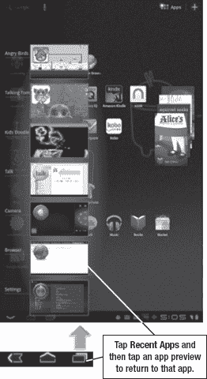

# 二、入门指南

一旦你从盯着一台平板电脑转向实际购买，这一章将帮助你。有相当多的 Android 平板可用，所以我们将坚持运行 Android 3.0 Honeycomb 及以上版本的平板，除非另有说明。您的屏幕可能看起来与这里显示的不完全一样，但它们应该看起来非常相似。

### 解锁您的平板电脑

不同的平板电脑在解锁方式上可能略有不同，但它们通常都是以简单的拖动解锁手势开始的。

左边的例子来自 Xoom。只需轻触**锁**图标，就会出现一个圆圈。通过滑动手指将锁拖出圆圈，您将解锁屏幕。

这不是屏幕锁定的唯一选项，但这是默认选项。可以用密码，图案，在安卓 4.0(冰淇淋三明治)里，可以用面部识别。

### 典型的激活序列

并非所有的药片都有相同的激活顺序，但顺序通常是相似的。以下是使用威瑞森无线数据计划的 Xoom 的激活方式:

1.  **选择语言:**默认为英语。
2.  **激活威瑞森无线:**在威瑞森上激活您的平板电脑。仅支持 Wi-Fi 的客户将被提示输入有关其 Wi-Fi 接入点的信息。
3.  **使用谷歌位置服务:**你想让谷歌检测你的位置，比如谷歌地图方向和搜索结果吗？默认值为是。
4.  **使用您的 Google 帐户登录:**如果您有 Gmail 或其他 Google 帐户，请在此处输入。
5.  **恢复和备份您的数据:**如果您在之前的屏幕中输入了 Google 帐户，您可以选择恢复和备份您的数据。如果你拥有另一台 Android 设备，它甚至会开始下载你在其他设备上使用的兼容应用程序。

### 谷歌账户

从技术上讲，使用安卓平板电脑不需要谷歌账号。然而，无论如何，创建一个对你最有利的。谷歌账户是免费的，允许你在平板电脑和任何其他使用谷歌账户的电脑之间同步谷歌数据。

当你第一次启动你的安卓平板电脑时，你会被要求输入你的谷歌账户信息或者创建一个新的。如果您愿意，可以跳过这一步，稍后再同步您的 Google 帐户信息。

你可以在第四章:“将你的平板电脑与谷歌同步”中了解更多关于与谷歌账户同步的好处

### 激活您的数据计划

有些平板电脑出售时带有蜂窝数据接入功能，有些只能使用 Wi-Fi 网络。你可以在第六章:“了解连接:Wi-Fi、3G 和 4G”中了解更多关于数据的信息

如果您已经为平板电脑购买了数据套餐，您需要激活它。您的运营商或您购买设备的商店应该会告诉您具体的操作方法。对于一些平板电脑来说，这将涉及安装一张 SIM 卡来识别网络上的设备(美国电话电报公司和 T-Mobile 设备)；其他平板电脑(威瑞森和 Sprint)会将这些信息内置到设备中。您的平板电脑需要一些时间来连接到您选择的网络并进行身份验证。

如果您购买了具有蜂窝数据功能的平板电脑，但没有购买数据套餐，那么您可以跳过这一步，在选择购买数据套餐之前，只在 Wi-Fi 模式下使用平板电脑。

### 基本主屏幕

一旦你完成了平板电脑的设置，你最终会看到**主页**屏幕。这看起来非常类似于 iPad 的**主页**屏幕，其中一些功能也是一样的。如果你左右滑动手指，你可以在你的**主页**屏幕的各个页面之间切换。你还会注意到小的应用程序图标，你可以点击它来启动相应的应用程序。通过点击屏幕右上角的**应用托盘**启动器，您可以找到任何您看不到的已安装应用。

还有一些你在 iPad 上找不到的项目，比如更大的项目叫做 *widgets* 。这个新的**主页**屏幕一开始可能有点吓人，但是当你习惯了地形，你会发现它非常容易使用。图 2–1 展示了一些基本特征。

**图 2–1。** *介绍主屏幕*

### 按钮在哪里？

一旦您完成了 Android 平板电脑的激活和初始设置，您可能会注意到 Android 平板电脑通常比手机上的按钮少。事实上，摩托罗拉 Xoom 和其他大多数蜂窝和冰淇淋三明治平板电脑都只有物理电源和音量按钮。所有其他按钮都是通过软件创建的。

这是有原因的。你可以将 Android 屏幕向上或向下倾斜到你喜欢的任何方向，导航控件的位置仍然会在屏幕的左下方。

**注意:**您的按钮位置有异常。一些应用程序将屏幕锁定在某个方向，如仅在**肖像**或**风景**模式下。在锁定屏幕的情况下，您的按钮也会随着应用程序的方向而锁定。

#### 操作栏和系统栏

安卓平板电脑有两个主要的控制区域:动作**和系统**栏**和**。****动作**栏是应用特定菜单和选项的可选位置。它在屏幕的顶部，如图 2–1 所示；你所看到的可能从复杂的菜单到什么都没有，这取决于应用程序开发人员决定做什么。**

另一方面，**系统**栏不是可选的。安卓蜂巢平板上的每个应用都有。在某些情况下，比如电子书阅读器和电影播放器，应用开发者可能想隐藏**系统**栏；不过，轻点屏幕会把它带回来。

**系统**栏分为两个基本区域:导航控件在左侧；系统控制、警报和通知位于右侧。

左图显示了导航控件。其中三个——**返回**、**回家**和**最近应用**——始终可用。**菜单**按钮有时可用，具体取决于应用程序。对于蜂巢优化的应用，菜单功能在**动作**栏上。

如果你使用 Android 手机，你可能会发现这与大多数手机物理按键上使用的导航控件非常相似。值得注意的例外是**最近应用**按钮。

### 最近的应用程序和轻松的多任务处理

**最近应用**按钮是谷歌对平板电脑上简单的多任务处理的回应。相对于大多数笔记本来说，平板电脑的屏幕非常小，所以很难同时打开多个窗口。这并不意味着你不想同时运行多个应用，也不意味着你不想偶尔在应用之间切换。

例如，假设你正在给你的老板写一封电子邮件。你会想要快速检查你的日历，以确保你的时间表是明确的，然后在网上核实一些研究。你可以查看日期，然后通过使用**最近应用**的按钮返回到你打开的电子邮件。请按照以下步骤操作:

1.  从任何应用程序或**主页**屏幕点击**最近应用程序**按钮。
2.  您将看到五到七个最近启动的应用程序的预览窗口，就像您退出它们时出现的一样。轻按任何预览窗口以返回到该应用程序。

**提示:**将屏幕倾斜至**肖像**模式，查看更多应用预览。

### 通知面板

既然您已经探索了**系统**栏的左侧，那么是时候看看右侧了。图 2–2 显示了**通知**面板和快速设置区。您将看到系统通知，如时间、电池状态和数据信号强度。

您还会看到来自不同应用程序的提醒和状态信息。例如，你可能会看到一个通知，说你收到了一封新的电子邮件，有人在你的脸书帖子上发表了评论，或者有一条消息说**愤怒的小鸟**有更新。

**图 2–2。** *通知面板*

当您收到新通知时，轻按该图标以查看预览，然后再次轻按它以启动应用程序。如果你想一次看到所有通知，点击**时钟**图标。这将展开**通知**面板，如图图 2–3 所示。

**图 2–3。** *展开通知面板*

展开面板后，您可以查看电子邮件、脸书提醒和状态消息的所有预览。点击消息启动相关应用程序，或点击通知右侧的 **X** 图标将其从列表中移除。

通知通常会一直存在，直到你点击它们或者使用 X 键删除它们，所以如果你现在没有时间阅读那封邮件也不用担心。

### 基本的平板电脑手势

在探索平板电脑的过程中，有几个基本的手指手势可以帮助你。有些手势用一个手指，有些用两个手指。如果你过去使用过 Android 或类似的智能手机，你应该对以下大部分手势很熟悉:

*   **敲击:**敲击就是它的声音。短时间轻按屏幕上的一个点。
*   **长按:**手指在屏幕上停留几秒钟，直到有事情发生，而不是点击。
*   **滑动或拖动:**用一个手指，按在屏幕上，沿着屏幕移动，不要失去联系。
*   **捏捏:**将两个手指放在一起捏捏。这通常用于缩小屏幕，使一切看起来更小。
*   **扩大:**这是捏的反义词。把那两根手指分开。这一般是用来扩大某物，使之变大。

### 长按主屏幕

如果您长按**主页**屏幕，您可以更改其外观。你可以通过点击**主页**屏幕右上角的**加**符号( **+** )来做同样的事情。

这在第七章“图标、部件和标签”中有所介绍；然而，现在值得一提，因为当你第一次不小心打开这个屏幕时，你可能没有意识到刚刚发生了什么。你会看到类似图 2–4 的东西。

**图 2–4。***3D 定制面板*

如果你无意中打开了**定制**面板，只需触摸**主页**屏幕的任何一个面板，你就会回到甜蜜的家。

既然您的平板电脑已经激活，并且您已经学会了如何操作它，那么是时候谈谈输入和文本了。