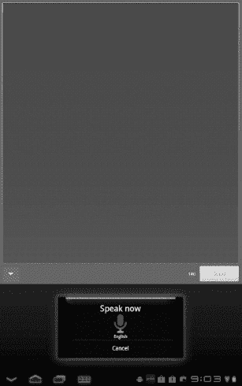

# 三、键入、复制和搜索

拥有平板电脑的一大好处是，你不会像打电话那样，被束缚在一个小小的拇指键盘上打字。事实证明，你甚至不需要局限于打字。在本章中，您将探索如何通过键入来处理文本。您还将看到复制粘贴和自动更正功能，以及探索一些替代的输入方法，包括语音听写和 **Swype** 应用程序。

### 虚拟键盘

当你点击文本输入空白的任何地方，或者当你打开需要文本输入的应用程序时，Android 平板电脑上的键盘就会出现。这是一个出现在屏幕上的虚拟键盘。一些平板电脑提供可选的物理键盘，但你仍然可以选择在更方便的时候使用虚拟键盘。

您可以从**横向**或**纵向**方向使用虚拟键盘。你有更多的空间在**横向**模式下打字，也有更多的空间在**纵向**模式下看屏幕。有些人发现他们在虚拟键盘上用十个手指打字比用物理键盘打字更成功。然而，如果你是一个触摸打字员，这可能并不理想。从光滑的玻璃表面得到的反馈与从物理按键得到的反馈不同。

较小的平板电脑，如 Nook Color 或原始的 Galaxy Tab，对于舒适的打字来说有点太小，所以它们作为大拇指键盘更好。在一些平板电脑上，比如 Galaxy Tab，你还可以选择使用 **Swype** ，这是一种最初为手机设计的文本输入系统。

**注意:**当你将平板电脑连接到蓝牙键盘时，虚拟键盘通常不会出现。这使您在键入时在屏幕上有更多的空间。

您可以使用**系统** 栏中的软键快捷方式暂时禁用该功能，或者如果您想使用虚拟键盘，只需关闭物理键盘。

### 标准键盘布局

在使用 Honeycomb 的平板电脑上，标准键盘布局看起来有点像 Figure 3–1。根据文本字段的上下文，某些键可能略有不同。例如，**表情符号**组合键可能会变成**。打开电子邮件应用程序时使用 com** 键。

**图 3–1。** *蜂窝中的标准键盘布局*

**注意:**姜饼和安卓早期版本中的键盘布局略有不同。键盘右下方是**删除**按钮，右下角出现了**表情图标**。修改过的 Android 平板电脑也可能有修改过的键盘布局。

#### 显示大写字母、数字和符号

为了给按键腾出更多空间并加快打字速度，虚拟键盘隐藏了一些不常用的字符。在物理键盘上，你经常同时按住两个键，比如 **Shift** 和 **B** 键组成一个大写的 B；然而，这在平板电脑上有点棘手。在 Honeycomb 上，您也可以按顺序点击按键。

一些连续的组合是你期望找到它们的地方，比如 **Shift** 键，键是用来敲击大写字母的。轻按一次以输入单个字母。第二次点击大写锁定，然后再次点击恢复小写字母。 **123？**键显示数字和符号，点击**更多**键显示更多符号。图 3–2 显示了蜂巢的键盘组合。

**图 3–2。** *在蜂巢中输入特殊字符*

#### 字符组合和长按

您可能会注意到，**斜杠**左边的键一次输入多个字符。它也可能会改变，这取决于您键入的位置。当你输入电子邮件地址时，它可能会变成一个**。com** 键；然而，当你在邮件正文中输入时，它可能会变成一个 **:-)** 或**表情符号**键。

如果你写的是一个地址，那就非常方便了；然而，如果你正在给一个`.net`地址写信，并且你想在你的信息中键入一张悲伤的脸而不是一个笑脸，该怎么办呢？如果你按住(也称为*长按*，你会看到更多不同表情符号或一级域名的组合键。图 3–3 展示了其中一些组合。只需长按，然后滑动你的手指到适当的选择。

**图 3–3。** *长按表情图标显示更多选项*

但是等等，还有呢！如果你想打一个 *ü* 或者做一个合适的 *é* 上面有一个重音符号怎么办？长按元音，你会看到常见外国字符的选项。一些辅音还有额外的选项，比如来自 **n** 键的*-*和来自 **c** 键的*和*。

您可能还会注意到，有些键的左上角还有一个字符。你可以长按角色本身，而不是按下一个 **Shift** 键来找到他们。**斜线**键( **/** )在符号键( **@** )处变成**，在**逗号**键(**、**)变成**感叹号**键(**！**)。一旦你习惯了这个系统，就很容易输入你需要的东西。**

### Swype 打字

一些平板电脑，如三星 Galaxy Tab，预装了 **Swype** 应用。 **Swype** 也可以作为一个单独的应用程序下载，供部分平板电脑和手机用户使用(右图所示版本)；到这本书出版时，它很可能会在运行 Honeycomb 的平板电脑上推出。

当使用 **Swype** 时，你不会一次啄出一个字母；相反，你可以沿着虚拟键滑动手指。例如，单词“wish”可以这样输入:

1.  按下单词的第一个字母，即 **w** 键。
2.  按住手指，在 **i** 、 **s** 和 **h** 键之间滑动。
3.  在单词的末尾用手指弹奏，或者按下 **h** 键。

Swype 会猜测你滑动手指输入的内容；而如果它没有明确的猜测，就会提出建议。

你不需要做任何事情来选择第一个建议。

当使用 **Swype** 时，你也可以点击而不是滑动——就像你使用标准虚拟键盘一样——并且 **Swype** 仍然会给出建议，就像你在字母之间滑动手指一样。

就像其他 Android 虚拟键盘一样，长按代替了 **Shift** 键。

**提示:**使用 **Swype** 时不需要输入空格；只需在单词之间抬起手指，空格就会自动添加。

如果你发现你在使用 **Swype** 的时候迷路了，你可以找到一个内置的提示和教程模块。只要长按右下角的 **Swype** 按钮就可以进入本教程。您可以按下**后退箭头**或**前进箭头**来浏览提示或教程，您可以按下右上角的**红色 X** 图标来结束教程。

### 文字建议

Swype 和标准 Android 键盘都会在你打字时提供建议，以加快你的单词输入速度。在 **Swype** 中，建议以选词窗口的形式出现；而在 Android 虚拟键盘中，建议就出现在键盘上方，如图图 3–4 所示。轻按正确的单词建议来选择它，Android 会在屏幕上为您键入它。接下来，只需进入下一个单词。

**图 3–4。** *蜂窝字建议出现在键盘上方*

如果 **Swype** 中的第一个建议是正确的单词，则不需要专门选择。相反，只要拿起你的手指，移动到下一个单词。标准的蜂巢虚拟键盘类似，只是建议是按字母顺序排列的。如果带下划线的单词建议是正确的选择，你不需要选择它——只需点击**空格键**键，开始输入下一个单词。

**注意:**你可以关闭建议或者让它们不可见，这样你输入的内容会自动更正。如果您在键入时看不到任何建议，您可以更改设置以恢复它们。详见本章下文“输入设置”一节，了解如何更改此设置。

### 用户词典

安卓平板电脑自带词典。它是用来在你打字的时候提出建议和纠正错别字的，但是它并不知道你用的每一个字。

我喜欢用新设备做的第一件事就是在用户词典中添加“Marziah”，这样我的名字就不会自动更正为 *March* 、 *Maryland* 或*Maria*；所以我不必为了写它而把整个东西打出来。也许你也有一个不寻常的名字，或者你在工作中使用了一个首字母缩略词，把单词 suggestions 去掉了。按照以下步骤向 Honeycomb 中的用户词典添加一个单词，如图 3–5 所示:

**图 3–5。** *向用户词典添加单词*

1.  在平板电脑上输入单词，不带空格。
2.  键盘上方的单词建议应该包括您刚刚键入的单词。长按建议区域中的单词。
3.  您应该会看到一条消息，说明该单词已“保存”这意味着它被添加到用户词典中。

**提示:**如果你想查看用户词典，无论是验证你添加了一个单词还是删除任何你不小心添加的单词，进入**设置语言并输入用户词典**。您不能在此菜单中添加单词，但您可以通过点击单词右侧的**红色 X** 图标来删除不需要的单词。

### 复制、剪切和粘贴

既然您的打字速度相当快，并且拥有一个充满单词的用户词典，那么是时候节省更多的数据输入时间了。您可以在文档之间甚至应用程序之间复制和粘贴。

在 Honeycomb 中进行任何复制和粘贴的关键是在文本输入区域长按鼠标。这将调用屏幕顶部的绿色**文本选择**菜单，如左图所示。

您还会看到一个插入点或两个选择点，这取决于您是否已经拷贝了一些文本。

一旦你调用了**文本选择**菜单，你需要选择一些文本或者选择一个插入点来粘贴一些文本。图 3–6 说明了这个概念。

按照以下步骤在 Honeycomb 中复制并粘贴一些文本:

1.  长按文本输入区域，直到看到**文本选择**菜单。
2.  在您想要复制的单词周围滑动起点和终点。您选择的文本将以绿色突出显示。
3.  如果要从当前位置复制并删除文本，请点击**剪切**；如果您只想复制，请点击**复制**。
4.  导航到要插入文本的位置。它可以在同一个文档中，在另一个文档中，甚至在另一个应用程序中。
5.  长按以调用文本输入区。
6.  因为您的剪贴板中有一个项目，所以默认情况下您会看到一个插入点，并且插入点上方会出现一个**粘贴**按钮。点击它，您的文本将被粘贴到选定的插入点。

**图 3–6。** *复制粘贴文字*

### 输入设置

还有一个键需要讨论:键盘设置按钮。这是虚拟键盘左下方看起来很奇怪的按键。轻点这个按钮一次，你会看到一个小屏幕，允许你在**安卓键盘设置**和**输入语言**之间进行选择。如果你总是用英语打字，就没有必要担心语言问题；但是，如果您使用多种语言或多种键盘，您可以使用此选项动态切换到国际键盘。

如果你长按**键盘设置**键，它会跳过小对话框，假设你想直接进入**安卓键盘设置**。

**Android 键盘设置**选项包括一个让你决定触摸按键是否发出声音的选项。如果你使用所有的十个手指，这可能会很方便，但是如果你在商务会议上做笔记，这可能会很烦人。您还可以更改自动更正、自动大写以及是否可以看到建议的首选项。

按照以下步骤打开可见建议:

1.  轻按任何文本输入区域来弹出 Android 键盘。
2.  长按**键盘设置**按钮。
3.  点击标签为**的选项，显示修正建议**。
4.  你的三个选择是**总是显示**、**在肖像模式下显示**和**总是隐藏**。轻触**始终显示**或**在肖像模式下显示**，取决于您的偏好。
5.  您将自动返回到键盘设置区域。

自动更正选项允许您决定希望您的文字自动更正的力度。如果您发现它导致的错误比它修复的更多，您可以关闭它，或者如果您发现它真的有用，您可以将它设置为**激进**。在大多数情况下，**适度**设置应该没问题。

### 语音动作

好的，你知道怎么操作键盘。但是如果你的平板电脑可以听写，不是更快吗？可以。然而，有一个小小的警告。语音命令并不完美，所以你仍然不得不偶尔打字来纠正一些错误。也就是说，还是挺好的。

如果您想使用语音而不是键盘，请点击键盘上的**麦克风**按钮。

你应该会看到一个类似右边的屏幕，提示你现在讲话。对着平板电脑的麦克风或支持麦克风的耳机说出一个简短的短语。你说的话将被谷歌的语音识别技术翻译，你的平板电脑将尝试输入你刚才说的话。

您可能需要通过使用键盘来清除任何被误解的内容。

现在，您可以将此功能提升到下一个级别。在你的**主页**屏幕左上角的**谷歌**??【搜索】小工具上点击**麦克风**键。默认情况下，你在这里说的话会导致谷歌搜索；然而，有些词会引发不同的反应。这些被称为*语音动作*。以下示例中的粗体字表示语音操作。

说“**导航到**华盛顿特区”，你会看到类似左边图片的东西，这将调出谷歌地图，给你到华盛顿特区的导航方向。

现在试着说，“**发送电子邮件给**[您联系人列表中的某人]。”你甚至可以更具体，包括一个主题，然后正文信息；然而，等待 Gmail 启动，然后听写邮件通常更容易。

接下来，给自己发一张便条，说:“给自己的便条:在杂货店多买些葡萄干。”

或者，你可以通过说“**听**月光奏鸣曲”来播放音乐

谷歌一直在增加更多的语音动作，这些命令通常涉及容易猜测的自然语言。所以如果你认为一个术语应该是一个声音动作，试着说出来。

### 搜索

如果没有搜索功能，它就不是谷歌设计的操作系统。您可以使用**浏览器**应用程序通过谷歌搜索网页。然而，还有另一种方法。

蜂巢平板电脑默认在**主页**屏幕的左上角有一个**谷歌搜索**小工具。您可以使用它来搜索网页或搜索您的通讯录、日历条目、应用程序等。

当您开始输入时，您的平板电脑将根据设备上存储的所有内容给出建议。右图显示了“an”的可能性注意这些建议中有多少来自 Kindle 阅读器中存储的书籍，有多少是应用程序。

轻按左侧栏中的单词建议，或者轻按右侧的应用程序或文稿建议来启动它。点击列表顶部的项目(带有**星号**图标)进行快速网络搜索。

**注意:**有些平板电脑可能默认安装了 Bing 或其他搜索引擎。你通常可以通过下载**谷歌搜索**应用来覆盖这个，但是你不能删除**必应**应用。