# 四、与您的 Google 帐户同步

为了使用安卓平板电脑，你真的应该有一个谷歌账户。谷歌账户是你使用大多数谷歌服务的用户名和密码，包括 Gmail。Fire 和 Nook 平板电脑是这一规则的例外，不使用谷歌账户。他们使用 Barnes & Noble 或亚马逊账户。

你可以在没有谷歌账户的情况下使用你的平板电脑，但是你会错过一些安卓最好的基于云的功能。你仍然可以在你的 Android 平板电脑上查看你的工作邮件和使用非谷歌账户，所以你不需要为了获得一个谷歌账户而放弃这些。当你激活一个新的安卓平板电脑时，设置一个谷歌账户是你要做的第一件事，正如第二章中所描述的:“开始使用”

你的谷歌账户是你平板电脑上的默认联系人列表、电子邮件和日历。你可以添加其他服务，比如 Twitter、脸书和交换电子邮件；但是，默认情况下，您创建的所有新联系人都会与 Google 同步。

谷歌和安卓背后的驱动力之一就是*云计算*的概念。这意味着，谷歌几乎所有的东西都是由互联网上的一组服务器驱动的，而不是依赖于一台电脑，也就是云中的 ??。

当您发送 Gmail 邮件、创建 Google 日历条目或将联系人添加到您的 Google 联系人列表时，只要您与 Google 同步，这些信息就可以在您的平板电脑、Android 手机和任何连接到互联网的计算机上使用。

### 激活您的 Google 帐户

在选择使用谷歌账户时，你有三个基本选择，如 Figure 4–1 所示。您可以使用已经创建的 Google 帐户，您可以在首次激活新平板电脑时创建一个，也可以跳过这一过程，稍后再添加一个 Google 帐户。激活平板电脑后，你还可以返回并添加或创建多个谷歌账户；因此，如果你有一个家庭邮件，另一个工作邮件，这没有问题。

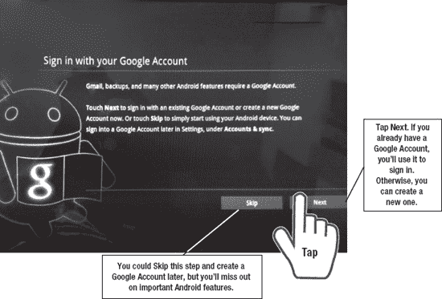

**图 4-1。** *注册平板电脑时注册一个谷歌账户*

当你第一次激活你的平板电脑时，你将面临另外两个选择，这将影响你的平板电脑如何与你的谷歌账户配合使用。第一个选择，如 Figure 4–2 所示，是是否允许 Google 使用您的 Google 帐户中的信息来备份和恢复数据。

这是什么意思？如果你已经登录谷歌并存储了联系人，发送了 Gmail 邮件，或者在谷歌日历中创建了活动，你将在手机上获得这些信息。然而，如果你拥有一部安卓手机或另一台平板电脑，真正的奇迹就会发生。在这种情况下，从你的谷歌帐户恢复意味着你的平板电脑将开始下载你在其他设备上安装的兼容应用程序的副本。

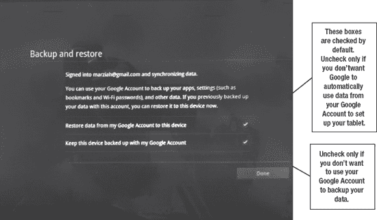

**图 4–2**。*备份和恢复设置*

第二个选择是是否允许谷歌使用你的设备追踪你的位置。iPhone 4 遇到了麻烦，因为它从手机激活时就开始跟踪用户的位置，而没有询问和存储用户的位置。安卓设备也能追踪位置，但它们会请求许可，如图图 4–3**所示。**

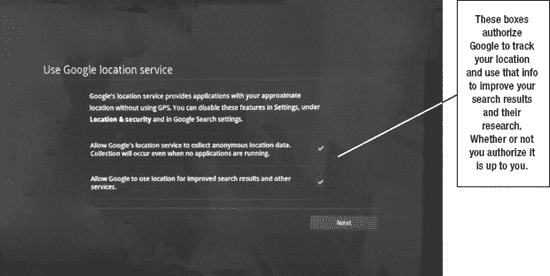

**图 4–3。** *授予使用位置服务的许可*

默认情况下，两个选项都被选中；然而，如果你不舒服，你可以禁用其中一个。第一个选项在隐私方面可能是最宽松的:“允许谷歌的位置服务收集匿名位置数据。即使没有应用程序运行，也将进行收集。这一切都归结于你是否信任谷歌明智地使用你的位置数据。

第二个选项是是否允许谷歌使用你的位置来改善搜索结果。这意味着，当你搜索一个产品或位置时，谷歌可以告诉你它是否就在附近。

### 添加谷歌账户

设置好平板电脑后，如何添加另一个谷歌账户？Figure 4–4 展示了在蜂巢平板电脑上添加谷歌账户所需的步骤。

按照以下步骤添加 Google 帐户:

1.  点击**主页**屏幕右下角的**通知**栏。
2.  点击**设置**按钮，将弹出快速**设置**菜单。
3.  再次点击**设置** s 按钮，调出完整的**设置**菜单。
4.  轻触**账户&同步。**
5.  点击屏幕右上角的**添加账户**按钮。
6.  您将看到一个屏幕，询问您想要添加哪种类型的帐户。在这种情况下，选择 **Google。**
7.  在这里，您可以输入现有的 Google 帐户信息，也可以创建一个新帐户。如果你想要的用户名不可用，谷歌会建议类似的东西。

**注意:**记住，坏人可以利用谷歌找到关于你的明显答案，所以要避免像你的出生城市或高中这样的问题。你也可以对这些问题编一个你会记得的答案，但是陌生人不能研究。

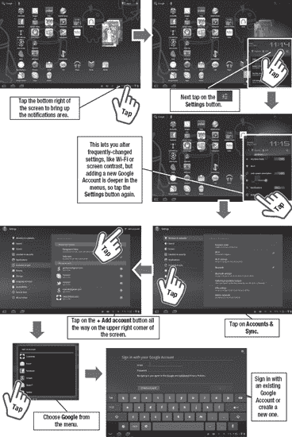

**图 4–4。** *添加谷歌账号*

#### 两步验证

建立新谷歌账户的一个选择是使用两步验证。这是一个谷歌通过短信给你发送验证码的过程。你必须每 30 天做一次。它更安全，因为它要求你有权访问你的手机，以及你的用户名和密码。你可以在这里从安卓市场下载谷歌认证器:`[`goo.gl/XNup1`](http://goo.gl/XNup1)`。

它更安全，但与许多安全措施一样，它也不太方便。用不用是你自己的选择。

### 添加另一个谷歌账户:捷径

我向您展示了添加帐户的长方法，这将适用于所有类型的帐户，包括 Twitter、脸书和 Exchange。按照以下步骤为 Gmail 帐户添加快捷方式(参见 Figure 4–5):

1.  点击应用程序图标启动 Gmail 。
2.  点击右上角的**菜单**按钮，选择**设置。**
3.  点击右上角的**添加账户**。

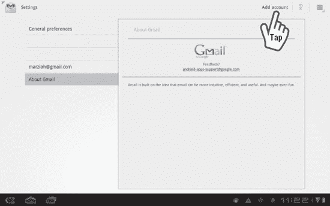

**图 4–5。** *添加另一个 Gmail 帐户*

### 谷歌账户服务

你的谷歌账户不仅仅适用于 Gmail，你还可以微调每个账户使用的服务。

如果你在 Android Market 上购买应用程序，你将使用你的谷歌账户和**谷歌结账**来完成交易。平板电脑上的默认电子邮件账户是 Gmail，默认日历是谷歌日历。

以下是一些你在使用平板电脑时会了解的谷歌服务:

Gmail 是基于网络的免费电子邮件服务，可以说是最好的免费电子邮件服务。我将在下一章更详细地介绍 Gmail。

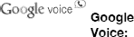

Google Voice 是一项服务，允许您使用一个电话号码转接来电，创建语音到文本的可视语音邮件消息，以及拨打低成本国际长途电话。它不是作为应用程序在平板电脑上正式提供的；但是，您可以使用网上的服务来检查您的邮件。

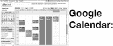

谷歌日历的工作方式与 Outlook 的日历略有不同。你有活动和邀请这样的标准功能，但谷歌日历的目的是更具协作性。你通过添加多个*日历*并与其他人分享来管理谷歌日历。例如，您可以有一个允许同事查看但不能编辑的日历，一个团队成员都可以编辑的日历，以及另一个完全公开事件的日历。

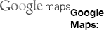

您可能已经熟悉了这个地图服务。谷歌地图是大多数手机地理敏感应用背后的引擎。谷歌地图不仅能给你提供驾驶方向，还能给你提供步行和公共交通方向。当你在路上时，这是无价的。

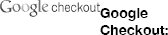

Google Checkout 是买家和商家完成信用卡交易的工具，无需向商家透露信用卡信息。它是贝宝的竞争对手。如果你想从 Android Market 购买应用程序，你需要用信用卡信息设置一个帐户。

Picasa 网络相册是谷歌对 Flickr 的回应。如果你想把手机里的图片上传到网上，这是大多数平板电脑默认的分享位置。如果您需要将照片共享作为工作的一部分，您可能需要使用相册和公共或私人共享权限来设置您的帐户。将照片上传到 Picasa 比作为电子邮件附件发送更有效，尽管你可以两者都做。Picasa 也有一个桌面程序，可以用来同步和编辑照片。

Picnik 是一个在线照片编辑套件。你可以使用免费版，也可以付费购买高级版的额外功能(每年 25 美元)。它可以直接从 Picasa 网络相册、Flickr 或 Photobucket 中拍摄照片。编辑完图片后，您可以将其保存回您的在线相册。

目前还没有针对 Picnik 的 Android 应用程序，但它可以在网络浏览器中的蜂巢平板电脑上运行，对于想要用指尖绘画的平板电脑用户来说，它似乎是现成的。

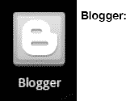

Blogger 是谷歌的博客服务。您可以在 Blogger 上免费创建无广告博客。甚至还有一个专门的平板电脑应用程序，这意味着你可以从一台设备上点击带有图片和视频的博客帖子。

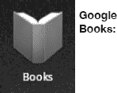

**Google Books** 是谷歌的电子书阅读 app 和网站。你不局限于**谷歌图书**，但该应用默认安装在标准的蜂巢平板电脑上，并且**谷歌电子书市场**图标在你的平板电脑上突出显示。

如果你有任何理由用平板电脑拍摄快速视频，事先用你喜欢的用户名设置一个 YouTube 帐户。你可以直接上传视频，而不是先把它们下载到你的台式电脑上。您也可以使用 YouTube 帐户对视频进行评论、评价和添加到播放列表。

如果你从笔记本电脑换到平板电脑，你需要传输数据。秘诀是尽可能使用谷歌。如果你与谷歌同步数据，你就可以在平板电脑上获得。

**注意**:如果你能在`[www.google.com/contacts](http://www.google.com/contacts)`把数据拿到谷歌通讯录，它就会出现在你的手机上。可以通过手机直接添加联系人。

请按照以下步骤从 Outlook 或 Apple 地址簿同步您的数据:

1.  将您的联系人导出为`CSV`或`vCard`文件。
2.  使用**谷歌联系人**右上角的导入链接，如图图 4–6 所示。

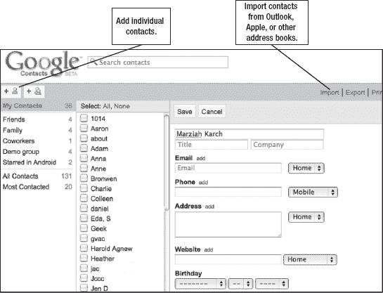

**图 4–6。*****谷歌联系人** app*

#### 微调您的平板同步

当您添加 Google 帐户时，您可以选择想要同步多少信息，如 Figure 4–7 所示。你可能不想在平板电脑上查看工作邮件；或者你可能想读你的邮件，但忽略了联系人列表。这是你的选择。

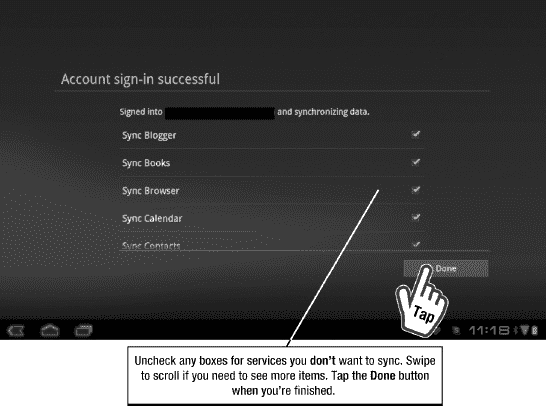

**图 4–7。** *选择与谷歌账户同步的服务*

每当您添加或创建 Google 帐户时，系统都会要求您验证您的同步选项，但您也可以随时查看并更改它们。按照以下步骤更改给定帐户的设置:

1.  点击**主页**屏幕右下角的**通知**栏。
2.  轻触**设置**两次，就像添加账户一样。
3.  在**设置**菜单中导航至**账户&同步**。
4.  单击您要修改的帐户。

现在你已经设置好了你的谷歌账户，在下一章中是时候探索其他类型的账户了。