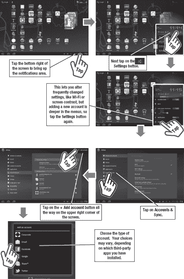
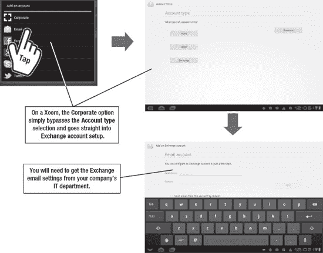
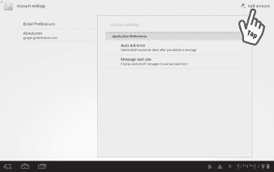
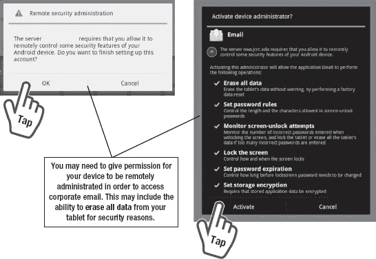
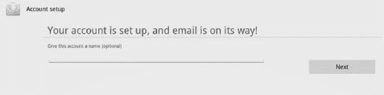
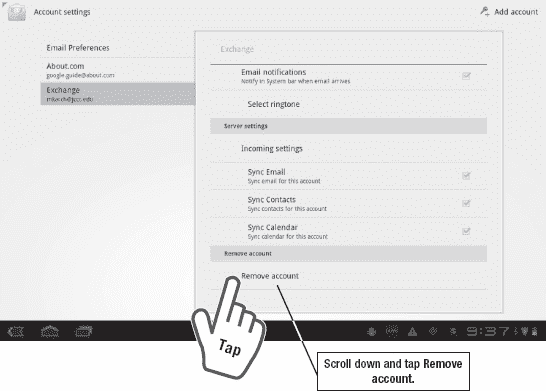
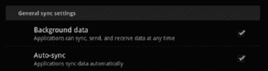
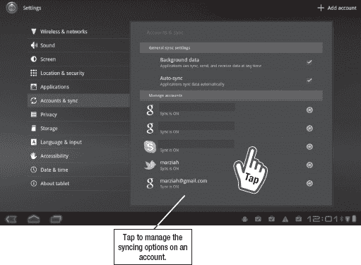
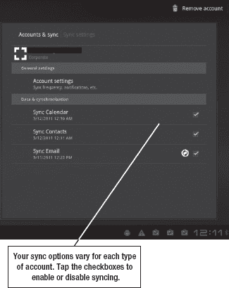

# 五、与其他帐户同步

在第四章中，你学习了如何与你的谷歌账户同步。在这一章中，我将介绍与其他帐户同步。Gmail 很棒，但是你的工作邮件很有可能使用 Exchange。在这一章中，我不会详细介绍如何使用你平板电脑上的电子邮件或社交网络应用程序；相反，我将讨论如何将你的平板电脑与 Exchange 电子邮件和其他非谷歌账户同步。

### 添加账户

您可以添加 Exchange、Twitter、Skype、POP3 电子邮件和许多其他帐户类型，如 Hotmail 和 Yahoo！使用第四章中所述的相同过程。添加帐户的过程非常相似。唯一显著的区别是你需要提供什么样的账户信息。按照以下步骤进入平板电脑偏好设置的**账户&同步**区域，添加一个账户(参见图 5–1):

1.  点击**主页**屏幕右下角的**通知**栏。
2.  点击**设置**按钮，将调出快速设置。
3.  再次点击**设置**按钮，调出完整的设置菜单。
4.  轻触**账户&同步。**
5.  点击屏幕右上角的**添加账户**按钮。
6.  您将看到一个屏幕，询问您想要添加哪种类型的帐户。您可能会看到不同的选择，这取决于您拥有的平板电脑类型和您已安装的应用程序。例如，如果您安装了 **Skype** 应用程序，您会看到添加 Skype 帐户的选项。

**图 5–1。** *添加账户*

### 与 Exchange 电子邮件帐户同步

如果你的工作场所使用 **Google Apps for Business** ，你可以像添加任何其他 Google 帐户一样添加你的商务电子邮件。

但是，许多工作电子邮件帐户都托管在 Microsoft Exchange 上。Android Honeycomb 平板电脑能够与 Exchange 账户同步，并可以处理企业供应和其他安全措施，只要你的工作场所允许你使用 Android 设备登录。

要添加 Exchange 电子邮件帐户，请按照图 5–1 中描述的步骤添加帐户，然后选择**电子邮件**或**公司**(如果可用)。当你从蜂巢平板电脑添加公司账户时，唯一的区别是你需要绕过询问你添加的账户类型的屏幕(见图 5–2)。

**图 5–2。** *添加企业邮箱账号*

您也可以通过**电子邮件**应用程序进入该屏幕。第一次启动**邮箱** app，会提示你设置一个邮箱账号(假设你还没有加了一个)。否则，您可以使用第四章中介绍的添加 Gmail 的相同步骤来设置 Exchange 帐户:

1.  点击应用程序图标，启动**电子邮件**应用程序。
2.  点击右上角的**菜单**按钮，选择**设置。**
3.  点击右上角的**添加账户**。
4.  最后，输入雇主指定的 Exchange 帐户设置。

#### 安全警告

在设置您的公司电子邮件帐户的过程中，您可能会看到一些安全警告(参见 Figure 5–3)。

**图 5–3。** *授予权限允许设备管理*

为了在移动设备(包括平板电脑)上使用公司电子邮件，许多公司要求您遵守并接受特定的安全措施。这些措施可以包括指定的密码长度、加密存储、屏幕锁定，甚至远程数据擦除。你会得到警告，远程管理员可以擦除你平板电脑上的所有数据，实际上是执行一次*工厂数据重置*，并将平板电脑恢复到你第一次购买时的状态。

别慌。这些安全措施已经到位，以防您的平板电脑被盗，因此宝贵的公司电子邮件不会随之被盗。即使最坏的情况发生，你的平板电脑被重置，你也不会失去一切。你的电子邮件、日历、联系人和购买的应用程序记录都存储在(互联网上的)clou *d* 中*。您已经与 Picasa 同步或上传到照片共享网站的图片和电影仍然可用，尽管您会丢失仅存储在平板电脑上的任何图片。唯一将永远消失的数据是只存储在设备本身而不是云中的数据。*

接受安全设置后，您会看到一条消息，确认您已经设置了帐户。按下**下一个**按钮，就可以开始阅读邮件了。

### 添加其他电子邮件帐户

您可以使用**电子邮件**应用来添加 Exchange 帐户，但您也可以添加 POP 和 IMAP 电子邮件帐户。通常，后一种电子邮件帐户类型是由您的互联网服务提供商发行的(即，它们是个人电子邮件帐户，而不是公司电子邮件帐户)。

若要选择 Exchange 以外的电子邮件帐户类型，请选择适当的帐户类型，并输入服务提供商提供的设置。

### 删除电子邮件帐户

如果您离职，您需要删除您的 Exchange 电子邮件帐户；这使您能够避免整个远程数据擦除场景:

1.  点击应用程序图标，启动**电子邮件**程序。
2.  点击右上角的**菜单**按钮，选择**设置。**
3.  滑动手指并轻触**移除帐户，向下滚动。**

当您不再需要其他电子邮件帐户时，您也可以使用上述方法删除它们(图 5–4 显示了**删除帐户**按钮)。

**图 5–4。** *删除电子邮件账户*

### 数据同步设置

当你添加一个账户时——无论是 Twitter、脸书、Exchange 还是 Gmail——你可以选择将哪些数据同步到你的平板电脑以及同步的频率。按照以下步骤进入**账户&同步**；此功能可让您调整同步选项:

1.  点击**主页**屏幕右下角的**通知栏**。
2.  点击**设置**按钮，将调出快速设置。
3.  再次点击**设置**按钮，调出完整的设置菜单。
4.  轻触**账户&同步。**

前两个选项在**通用同步设置**下，默认都是开启的:**后台数据**和**自动同步**。

**后台数据**选项决定了当您使用其他应用程序时，或者甚至当您根本不使用平板电脑时，您的应用程序是否可以在后台同步。如果您停用此功能，一些应用程序仍将在后台同步，但大多数不会。禁用此选项将节省电池寿命，但也会使一些应用程序需要更长时间才能使用，因为它们必须在您启动后立即同步数据。

第二个选择是 **Auto-sync** ，允许应用程序根据应用程序开发人员确定的时间表获取数据。禁用此选项意味着你必须通过点击账户旁边的**同步刷新**按钮来手动请求数据同步。

**注意:**常规设置适用于所有账户。

如果您想要更改特定应用程序的同步设置，请在**管理帐户**下点击该应用程序的名称，如图 Figure 5–5 所示。

**图 5–5。** *管理您的同步选项*

您看到的内容将取决于您选择的帐户类型。Skype 帐户的唯一同步选项是它是否同步您的联系人。如左侧所示，Exchange 帐户可以同步电子邮件、日历和联系人信息。您可以逐个启用或禁用同步选项。例如，如果您使用不同的方法将日历与 Google 日历同步，您可能需要禁用日历同步。

您可能会看到右上角的选项**删除账户**。虽然该选项对大多数账户**、**、*都有效，但不要用它来移除兑换账户*、**。**

使用此选项不会完全删除 Exchange 电子邮件帐户。从**电子邮件**应用程序本身移除 Exchange 帐户(如前所示)是最好的办法。

### 替代同步应用

您可能已经注意到，虽然您的日历和联系人信息可以与 Exchange 帐户同步，但您的笔记和任务却不能。

第三方应用程序，如 **Nitrodesk TouchDown** 和 **CompanionLink DejaOffice** ，可以扩展你平板电脑的同步能力。这两款应用都通过 Android Market 和其他应用商店进行商业销售。

**TouchDown** 提供 Exchange 任务同步，此外还有 Android 2.2 及更高版本中提供的其他标准选项。

对于 Galaxy Tab 用户来说，DejaOffice 是一个很好的选择。它使您能够与 Exchange 同步各种项目，包括任务和笔记。您还可以更改显示来表示“完成工作”或“富兰克林·柯维任务组织”系统。