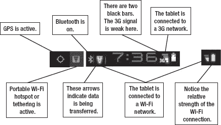
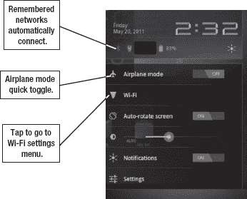
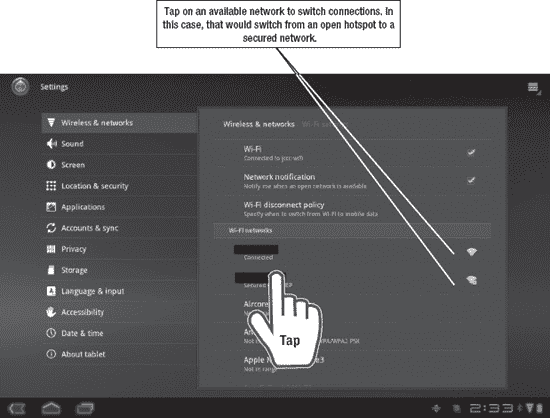
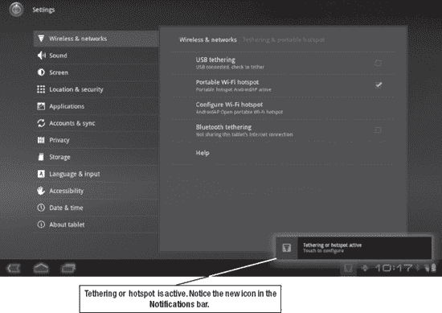
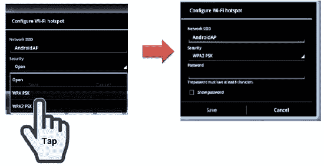
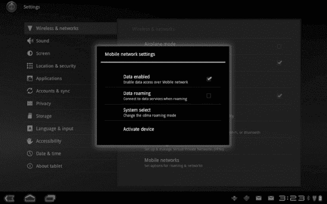

# 六、了解连接：Wi-Fi、3G 和 4G

Android 平板电脑的最大特点之一是其连接互联网的能力。上网不仅仅意味着使用内置的网络浏览器。当你在平板电脑上使用许多应用程序、添加联系人、保存电子邮件以及进行各种各样的其他活动时，你将会使用数据。

在撰写本文时，所有在售的平板电脑都可以连接 Wi-Fi。一些平板电脑也能够使用移动数据，就像智能手机一样。在这些支持移动的平板电脑中，一些使用 3G，一些支持 4G，但没有一个能跨越所有的 3G 和 4G 网络。

在本章中，我们将解释如何使用平板电脑上网。我们还将介绍平板电脑访问数据的不同方式，以及如何在不耗尽电池电量的情况下实现联网。

### 你的平板电脑有数据套餐吗？

许多 Android 平板电脑都是作为仅支持 Wi-Fi 的设备出售的。在这些设备上，你可以使用笔记本电脑使用的任何 Wi-Fi 网络；当你不在 Wi-Fi 覆盖范围内时，你就不能连接到互联网。即使是销售的带有 3G 或 4G 数据接入的平板电脑也可以使用 Wi-Fi 网络。事实上，如果你不从手机服务提供商那里购买单独的数据接入，那是你唯一的选择。

一些平板电脑，如 T-Mobile G-Slate，允许你购买短期预付费数据套餐，就像在 3G iPad 上一样。其他公司，如摩托罗拉 Xoom(在撰写本文时)，要么不提供预付费月服务，要么价格高得令人望而却步。到目前为止，所有拥有 3G/4G 数据套餐的平板电脑都有一个合同选项，让你在购买设备时享受折扣，同时还将你锁定在两年的每月数据合同中——这与大多数手机使用的模式相似。

**注意**:如果你的平板电脑没有至少 3G 接入，你*以后就不能*添加了。摩托罗拉 Xoom 只提供 3G 接入，但用户可以将连接升级到 4G。然而，大多数平板电脑无法通过这种方式升级。

### 3G 或 4G 是什么意思？

当“移动”意味着你非常昂贵的手机可以装进一个巨大的公文包时，手机技术使用模拟信号将你的声音传入和传出手机信号塔。该模拟信号被追溯命名为 *1G* ，即第一代。

沿途的下一站是 *2G* ，它使用的是数字信号而不是模拟信号。它还允许你发送数据，而不仅仅是语音。2G 网络今天仍在使用，尤其是在农村地区，尽管手机运营商努力将 2G 网络升级到 ?? 的 3G，即第三代。3G 技术比 2G 技术快得多，但仍然比强大的 Wi-Fi 连接慢。

下一代， *4G* **，**承诺超快的速度和改进的技术。4G 网络仍在铺开过程中。在这一点上，没有运营商完全升级其网络。有三种竞争技术——*LTE*、 *HSPA+* 和 *WiMAX* (所有这些都以 4G 的名义上市)——但所有这些实际上都是向 *LTE-Advanced* 和 *WiMAX 2* 网络的过渡步骤。在这一点上，看起来 LTE Advanced 将是更强大的技术，甚至投资 WiMAX 的公司也可能转向 LTE Advanced。

您的速度将取决于您使用的网络类型、您离发射塔的距离以及网络上有多少其他用户。然而，4G 的速度比 3G 网络快几倍，LTE Advanced 可以与光纤网络的速度相媲美。当你站着不动的时候，你的速度会比你在路上的时候更快，因为手机信号塔不需要通过协商把你的连接从一个信号塔传递到下一个信号塔。

### CDMA 和 GSM

手机在美国如此复杂的原因之一是因为竞争技术被用于传递 2G 和 3G 信号。威瑞森无线和 Sprint 使用 CDMA 网络，而 ?? 的 T 和 T-Mobile(在撰写本文时正在谈判中)使用 ?? 的 GSM 网络。地区运营商各不相同，但很多都使用 CDMA。

这两种方法没有太大的优势或劣势。两种技术的速度相似。除了彼此不兼容之外，您还会注意到其他一些差异:

*   GSM 运营商使用 SIM 卡。这些微小的卡片承载着你在网络上的识别信息。如果你换手机，你只需要把旧的 SIM 卡放进新的手机里。
*   CDMA 运营商的网络不使用 SIM 卡。你的设备会被内部追踪，但这也意味着你永远不会丢失 SIM 卡。
*   GSM 是世界其他地方更常见的标准。并非所有的手机或平板电脑都可以进行国际旅行，但如果你的手机使用 GSM 信号，就更有可能做到这一点。

### 关于 LTE 和 WiMAX 的更多信息

LTE Advanced 代表*长期演进高级*，是大多数运营商正在朝着的标准。除了速度上的好处，这种方法的一个优点是移动设备将共享一个向后兼容的通用标准。这使得移动设备更有可能能够很好地相互配合，轻松地在以前的 CDMA 和 GSM 网络之间漫游。

美国距离实现这一目标还有数年时间，但这就是为什么电话公司对 LTE Advanced 的可能性感到兴奋。

WiMAX ( *微波接入全球互通)*通常被称为“类固醇上的 Wi-Fi”，因为 WiMAX 可以长距离发送强信号。澄清一下，它是类似于无线网络的*，但它不是无线网络。没有支持 WiMAX 的平板电脑、手机或调制解调器，您无法连接到 WiMAX 网络。*

Sprint 和谷歌都是 Clearwire 的投资者，Clearwire 是一家向城市推广 WiMAX 接入的公司；然而，即使是 Clearwire 也一直在探索 LTE，许多分析师认为 WiMAX 最终将被 LTE Advanced 取代。

如果你的平板电脑不具备 4G 功能，你可以购买一个便携式 WiMAX 或 LTE 热点。

### 通知栏

屏幕底部的**通知**栏显示您的连接状态。您所看到的会有一些变化，这取决于您的数据连接类型和您的平板电脑使用的 Android 版本。图 6–1 显示了一些通知示例。

**图 6–1。** *样品状态栏通知*

#### Wi-Fi

Wi-Fi 信号快速、简单，并且避免了一些运营商收取的数据限制费用。

一些书店、快餐连锁店和餐馆为信号范围内的任何人提供免费 Wi-Fi 接入。连接很容易。您的平板电脑会通知您网络可用。

点击右下角的**通知**栏提供一些开始使用互联网的快捷选项(参见图 6–2)。

**图 6–2。** *连接 Wi-Fi*

**注意:**在许多这种“开放”的网络上，你仍然必须打开你的网络浏览器，并同意网络的条款和条件。如果您的设备显示您已连接，但您的应用程序显示连接错误，您可以尝试先启动 Web 浏览器并连接。

### 设置私人 Wi-Fi 连接

你可能想建立一个私人网络,比如你家或工作场所的 Wi-Fi。您可以通过以下步骤在蜂巢平板电脑上设置您的网络:

1.  点击**通知**栏使其展开。
2.  点击 Wi-Fi 选项。
3.  这将调出**无线&网络**设置菜单中的 **Wi-Fi 设置**。您将会看到您连接过的每个网络以及范围内所有公共广播网络的历史记录。你可以点击一个范围内的网络，然后输入密码(参见图 6–3)。
4.  如果您正在添加一个没有公开广播 SSID 的网络，您可以通过滚动到历史记录的底部并点击**添加 Wi-Fi 网络来添加它。**

**注意:**如果你希望使用使用 LEAP(思科 Wi-Fi 协议)的企业网络，你应该知道 Android 还不完全支持该标准。不过，你可能会幸运地拥有像**全 WiFi** 或**高级飞跃**这样的第三方应用。

**图 6–3。**切换到安全网络

#### Wi-Fi 安全

Wi-Fi 的一个重要考虑因素是安全性。如果您使用的是加密连接，这不是什么大问题。然而，咖啡店里那些方便、开放的 Wi-Fi 接入点理论上可能会通过一种叫做*中间人攻击*的漏洞让你的平板电脑遭受不必要的窃听。

Wi-Fi 安全通常涉及某种访问网络的密码保护。WEP 是一种较旧的、安全性较低的安全方法，而 WPA 或 WPA2 是一种更安全的方法。大多数个人网络，如您家中的路由器，可以设置为使用 WPA2-PSK(预共享密钥)。这是一种奇特的说法，即你必须输入密码才能访问网络。

**注意:** WEP 是最古老的标准，但也是最容易被破解的。

想要出售或限制访问其网络的企业使用一种形式的 WPA-enterprise。这种类型的连接通常要求您在打开第一个网页时登录，它会将您的用户名与授权用户列表进行比较。在某些情况下，你实际上不需要登录，但你必须点击一些东西来同意该位置的服务条款。这也是 WPA 安全的一部分。

如果你不需要登录任何东西，你至少不需要点击 **OK** 来同意访问规则，你也不需要密码来登录网络——很可能你使用的是开放的 Wi-Fi 接入点。一个熟练的黑客也许能够拦截你的信号。

#### 蓝牙

蓝牙是一种非常短距离的技术，与其说是一种上网方式，不如说是一种有线替代方式。蓝牙可用于与无线耳机或键盘通信；在某些情况下，您可以使用蓝牙来创建从平板电脑到另一台设备(如笔记本电脑)的调制解调器。但是，你不能用蓝牙自己上网。

#### 全球定位系统

GPS 代表*全球定位系统*。这是本章中为数不多的值得详细说明的首字母缩略词之一，因为这个长名字解释了它的作用。GPS 通过卫星信号三角定位你的位置。这不是你的手机知道你在哪里的唯一方法，但这是最常见的方法。

每当您使用“地图”或按位置标记照片时，GPS 信号是最常用的。Android 还可以补充附近手机信号塔的位置和你正在使用的任何 Wi-Fi 网络的位置。然而，许多应用程序需要 GPS 信号来告诉你附近正在上映什么电影，或者最近的泰国餐馆的位置。

GPS 活动由屏幕底部看起来像目标符号的符号表示(参见图 6–1)。每当你使用感知你位置的应用程序(例如，**谷歌地图**或 **Yelp** )，你都会看到 **GPS** 符号。如前所述，不同设备和版本的 Android 上使用的 **GPS** 符号也有一些变化，所以你的可能看起来更像一颗卫星。

### 创建热点

移动热点接入是一些平板电脑和手机的附加服务。如果你为这种访问付费(有时甚至不付费)，那么你可以在平板电脑和笔记本电脑或其他设备之间共享你的数据连接。您还可以使用 USB 电缆或蓝牙连接将个设备连接在一起。

如果你有一部 Android 手机，你可以反过来做同样的事情，与你的平板电脑共享手机的数据信号，这就创造了一个便携式热点。这样做的行为被称为*拴系。*

要打开网络共享，进入**设置:无线&网络**并点击**便携式 Wi-Fi 热点**(参见图 6–4)。您将立即看到一个通知，即网络共享已打开，您可以轻按该通知来配置您的热点。这样做是个好主意。

**图 6–4。** *创造热点*

默认情况下，您的访问点将被称为 *AndroidAP* ，安全性将是开放的。如果你想与任何人分享你的热点和数据访问，或者恰好在范围内的任何人，那就开始吧！然而，在大多数情况下，您会希望您的接入点是一个封闭的网络。

你最好选择 **WPA2-PSK** ，然后指定一个密码，如图图 6–4 所示。如果你在键盘上输入密码有困难，勾选标记为**显示密码**的框。这只会让密码在你的平板电脑上可见，你可以在完成后取消选中该选项，以避免无意中泄露给其他任何人(见图 6–5)。

**图 6–5。**给你的热点一个密码

您可以将笔记本电脑或其他设备连接到此热点，就像连接到任何其他 Wi-Fi 网络一样。您甚至可以连接多台设备，例如与朋友共享您的连接。但是，连接的设备越多，速度越慢。

**提示:**创建一个 Wi-Fi 热点会消耗大量电池电量，所以当你使用完后，一定要关掉你的连接。

### 排除连接故障

**通知**栏将显示您正在使用的信号类型以及这些信号的相对强度，如图图 6–1 所示。它还将显示指示活动数据传输的**上下**箭头。

如果您遇到问题，首先检查以确保您有足够的信号，并且正在使用您打算使用的网络。如果您正在使用 Wi-Fi，请确定您已正确登录网络。有时这意味着打开你的网络浏览器，点击一个复选框，表示你同意你的热点的用户协议。

#### 漫游

当您漫游到属于您的运营商的手机信号发射塔范围之外时，您就开始漫游了。如果您的服务计划不包括漫游，您可能需要支付漫游费。

默认情况下，漫游应该设置为**关**；然而，仔细检查这个设置可能没有坏处。按照以下步骤关闭蜂窝平板电脑上的数据漫游并避免漫游费:

1.  点击**通知**栏**中的**设置**。**
2.  再次点击**设置**。
3.  点击**无线&网络。**
4.  轻触**移动网络**(参见图 6–6)。)
5.  如果选择了**数据漫游**，则取消选择。

**图 6–6。** *数据漫游*

#### 管理同步

除了打开和关闭连接，您还可以通过控制哪些帐户同步数据以及同步的频率来省电。第四章和第五章讲述了设置谷歌和其他账户。为了节省电池和数据，关闭**设置**菜单**账户&同步**区域的**自动同步**和**后台同步**。

#### 飞行模式

如果你在飞机上、游轮上，或者在你知道正在漫游的区域(或者如果你出于某种原因只想关闭数据)，你可能想让你的平板电脑进入**飞机**模式。**飞机**模式意味着你将没有任何连接，无论是数据、手机还是 GPS。

**飞机**模式是在**主页**屏幕上简单的双击，如图图 6–2 所示。只需点击**通知**栏，然后点击**飞机**模式切换。

### 虚拟专用网

VPN，或称*虚拟专用网*，允许你登录到工作场所的内部网，享受公司防火墙的安全，而不必硬连线到网络。有些地方需要这样才能访问 Exchange 电子邮件或查看敏感的公司文件。

Android Honeycomb 平板电脑本身支持 VPN，但该功能不一定适用于所有 VPN 设置。

按照以下步骤登录 VPN:

1.  转到**主页**屏幕，然后点击**设置**按钮。
2.  进入**设置:无线&网络**设置。
3.  接下来，选择 **VPN 设置**。如果您已经配置了 VPN，它将在此处可用。
4.  否则，您需要点击**添加一个 VPN** 。

您需要为您的工作场所获取特定的格式和设置。这些设置包括 PPTP、L2TP、带有预共享密钥的 L2TP/IPSec(PSK)和 L2TP/IPSec CRT(基于证书)。如果你的工作场所不支持这些协议中的任何一个，你需要与你公司的 IT 人员合作，看看是否有任何其他安全登录的方法。

#### VNC

VNC 是一种远程共享屏幕和从一台设备控制另一台设备的方式，即使该设备运行在不同的平台上。如果您让办公室或家里的计算机一直开着，并且办公室允许，您可以使用 VNC 来查看文档、收发电子邮件或执行工作任务，无论您身在何处。VNC 可以在 MAC 电脑、Windows 电脑和 Linux 电脑上使用。

为了安全地使用 VNC，它还应该与 VPN 配对。有几个适用于 Android 的 VNC 客户端。检查特定客户端，确保其与平板电脑兼容。