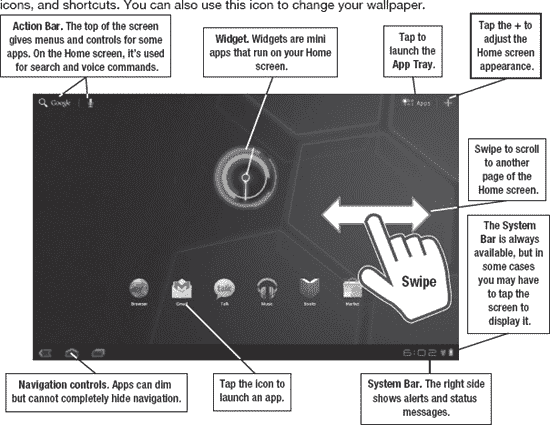
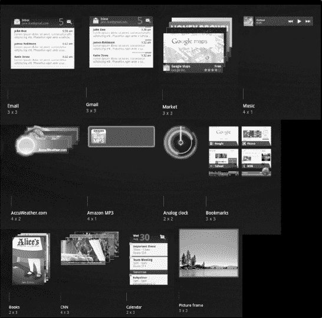
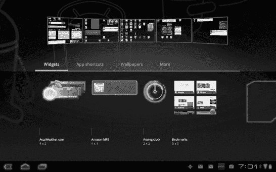
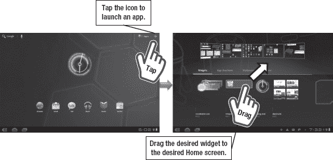
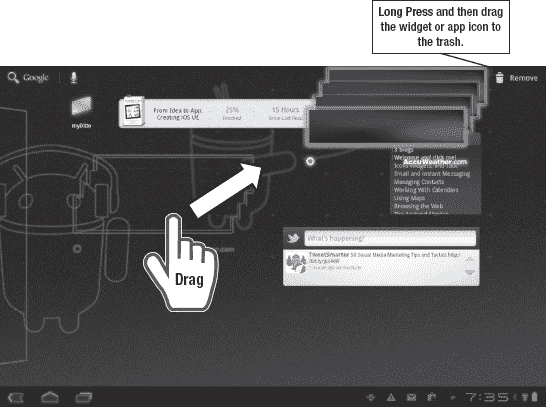
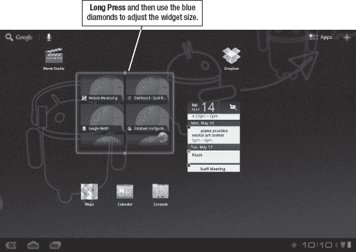
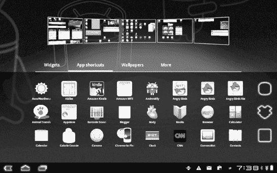
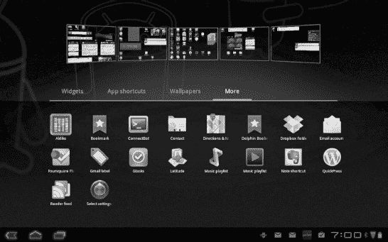
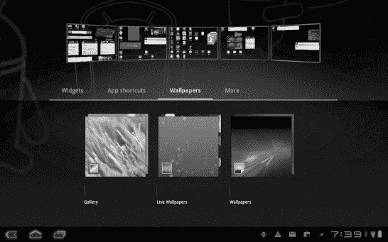
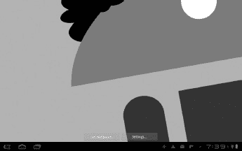

# 七、个性化您的主屏幕

在不离开**主页**屏幕的情况下，你可以用平板电脑做很多事情。在第二章:“入门”中，你了解了一点安卓平板电脑的**主页**屏幕。在这一章中，你将学习如何使用交互式小工具、应用程序图标和动态壁纸来个性化**主页**屏幕。

**注:**本书重点介绍蜂巢特征。如果你的平板电脑运行的是早期版本的安卓系统，你的选择可能会有所不同。你仍然可以添加应用程序图标和小部件，并改变你的壁纸，但你将无法通过蜂巢的*全息*界面做到这一点。

### 查看主屏幕界面

在第二章中，我介绍了主屏幕界面(你可以在图 7–1 中看到它的基本元素)。你可以用手指在屏幕上滑动，在**主页**屏幕之间导航。顶部是**动作**栏，可以包含菜单项。在右上方，您会发现用于浏览所有可用应用程序的**应用程序**按钮。在那个按钮旁边，你会发现+图标，你可以使用它来进行许多**主页**屏幕调整，包括添加小部件、应用图标和快捷方式。你也可以用这个图标来改变你的壁纸。

**图 7–1。** *元素上**首页**屏幕*

### 探索小工具

小部件是小的，持续运行的应用程序窗口。来自不同开发商的小工具可以检查你的邮件，显示你的日历，显示你的音乐选择，核对你的购物清单，显示图片，并通知你有新的 Twitter 帖子。它们可以有透明的背景，有些设计成不同的窗口堆叠在一起，你可以滑动来重新排列。通常，点击一个小工具就会启动整个应用程序。

Figure 7–2 显示了 Honeycomb 中默认可用的一些小部件。您可以下载更多的小部件，许多开发人员在他们的应用程序中打包了小部件视图。

**图 7–2。** *默认蜂巢小工具*

#### 添加小部件

按照以下步骤将小部件添加到您的**主页**屏幕:

1.  Press the **+** symbol on the upper-right corner of the screen or press your finger down on an empty section of the screen. You’ll see something resembling Figure 7–3. This is Honeycomb’s *holographic* interface for adding **Home** screen elements. 

    **图 7–3。** *主屏幕定制界面*

2.  默认情况下，应该选择**Widgets**；如果不是，点击屏幕左中部的**小部件**选项。
3.  下一步是沿着屏幕的下半部分滑动手指，找到您想要添加的小部件。
4.  Once you find it, just press and drag the widget to the screen where it should go, as shown in Figure 7–4. 

    **图 7–4。** *将您的小工具拖放到正确的屏幕上*

5.  一旦你的手指在正确的屏幕上，你可以抬起手指，小工具就会被添加。

**注意:**窗口小部件的尺寸列在界面中每个窗口小部件的底部，数字如“4×2”或“3×3”这个数字指的是在同一个空间里可以放多少个应用程序图标。因此，4×2 是四个应用程序图标宽乘以两个应用程序图标高。

#### 移除小组件

如果你想摆脱一个小部件呢？移除小部件比添加小部件更容易。请按照以下步骤操作:

1.  长按小工具，直到屏幕改变。你可能会注意到右上角的 **+** 符号现在变成了**垃圾桶**图标。
2.  手指仍然按下，拖动小工具到屏幕右上角的**垃圾桶**图标，如图图 7–5 所示。

**图 7–5。** *移除小工具*

移除 widget 并不会将其从平板电脑上卸载。它只是将它从您的**主页**屏幕上移除。您可以随时再次添加 widget。

#### 移动和调整小工具

现在您已经添加和删除了小部件，是时候重新排列和调整它们的大小了。这个过程与移除它们非常相似。只要**主页**屏幕上有可用空间，所有小工具都可以重新定位:

1.  长按小工具，直到屏幕外观改变。您将看到一个浅蓝色的网格表单。
2.  将小部件拖到新位置。
3.  抬起你的手指。

调整窗口小部件的大小使用类似的过程，但是有一个警告:不是所有的窗口小部件都可以调整大小。调整窗口小部件的大小是 Android 3.1 的一个特性，窗口小部件必须专门编程才能利用它。按照以下步骤调整小部件的大小:

1.  长按小工具，直到屏幕外观改变。如果您看到带有菱形控制点的微件周围出现浅蓝色轮廓，您可以调整其大小(参见 Figure 7–6)。
2.  通过菱形拖动 widget，可以在给定的方向上放大或缩小 widget。不是所有的部件都可以双向调整大小；在某些情况下，您可能没有足够的空间来放大小部件。

**图 7–6。** *调整小工具大小*

**提示:**当你把一个应用拖到**主**屏幕上时，你可以一直按住那个屏幕，它会放大，让你把你的小工具放在你想放的地方。

### 应用图标

应用程序图标或应用程序快捷方式是启动应用程序的简单按钮。点击**动作**栏右侧的 **App Launcher** 按钮就可以找到全部。然而，可能有一些你更经常使用的应用程序，你想把它们添加到你的**主页**屏幕上。有时候，当你下载应用程序时，它们会自动在你的**主页**屏幕上显示一个应用程序图标，你可能想要删除一些图标以节省屏幕空间。

好消息是:你现在可以添加、移除和重新定位小部件，这意味着你可以对应用程序图标做完全相同的事情。过程几乎一模一样。

添加应用图标时，在**主页**屏幕定制界面中选择**应用快捷方式**选项，如图图 7–7 所示。应用程序图标不可调整大小；每一个都有 1×1 的大小。

**图 7–7。** *自定义界面中的 App 快捷方式*

### 更

定制界面中最右边的选项被含糊地标注为 **more** (参见图 7–8)。在这里你可以找到特殊的应用程序快捷方式，它们既不是图标，也不是小工具。这些更像是应用程序中特定点的书签，**书签**甚至是一个选项！

**图 7–8。** *更多菜单*

您的选择将取决于您已安装的应用程序，但您可以使用此菜单来创建快捷方式，例如带有特定标签的 Gmail 邮件、音乐播放列表、联系人或经常更改的系统设置。

像应用图标一样，从定制界面拖放这些快捷方式。一旦松开手指，系统会要求您为快捷方式指定标签、列表、博客或书签。您的选择将取决于快捷方式的类型。

### 壁纸

在**主页**屏幕定制界面中要探索的最后一个元素是壁纸。壁纸会改变你的**主页**屏幕的背景。壁纸改变每一个屏幕；没有办法改变一个屏幕而不改变其他四个。

当您启动 **Home** 屏幕定制界面并选择**壁纸**选项(参见图 7–8)时，您会看到您可以添加的壁纸类型的三个基本选项。

**图 7–9。** *壁纸*

墙纸的三种基本类型如下:

*   **图片库**这些图片来自你的个人图片库，是你用平板电脑的相机拍摄的，或是下载到相机文件夹中的。
*   **动态壁纸**这些是在后台运行的动画壁纸，可能会对音乐播放或您的地理位置等系统事件做出反应。他们也使用更多的电池电量。
*   **壁纸**这些是专门下载的壁纸图片。一开始你有几个选择，你可以从第三方下载更多。它们不是动画图像，但也不会耗尽你的电池。

遵循以下基本步骤挑选壁纸:

1.  轻点一种壁纸(**图库**、**动态壁纸**、**壁纸**)。
2.  浏览以找到您的特定选择。
3.  在使用**实时壁纸**的情况下，你必须确认你的选择。否则，您的壁纸已经设置好了。

