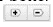
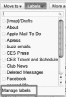
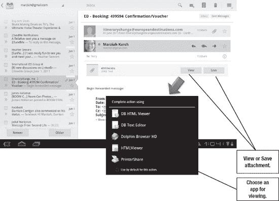

# 八、平板电脑上的电子邮件

Android 平板电脑让您更轻松地收发电子邮件。相对较大的屏幕便于查看您正在做的事情，蜂窝界面便于查看和回复您的消息。

一些平板电脑可能会打包其他软件，但一般来说，你的电子邮件由两个应用程序处理:

*   谷歌邮箱
*   电子邮件

在这两个应用之间，你可以读取微软 Exchange、POP3、Gmail 和 IMAP 账户。你还可以使用 Android 的**浏览器**应用程序来检查基于 web 的电子邮件帐户，你可以下载支持其他类型电子邮件帐户的第三方应用程序。请参考第四章:“与谷歌账户同步”了解如何将 Gmail 账户添加到您的 Android 平板电脑，并参考第五章:“与其他账户同步”了解添加 Exchange、IMAP 和 POP3 电子邮件账户的说明。

Honeycomb 平板电脑还配备了用于电子邮件应用程序和 Gmail 应用程序的互动部件，这样你就可以在启动完整的应用程序之前一目了然地查看你的邮件摘要。第七章:“部件和主屏幕”解释了如何添加和调整**电子邮件**和 **Gmail** 部件。

### 了解 Gmail

Gmail 是谷歌的产品。它用于谷歌的企业电子邮件系统，并且在 Android 上得到很好的支持。任何人都可以在`[`mail.google.com`](http://mail.google.com)`免费创建一个个人 Gmail 账户，企业客户可以通过一个名为 **Google Apps** 的产品套件使用 Gmail 来增强他们的企业电子邮件账户。

为了理解平板电脑上的 Gmail 应用程序，理解 Gmail 在网络上的工作方式是很有帮助的。记住，你可以在平板电脑上使用网页版的 Gmail，因为你的平板电脑内置了**浏览器**应用。

Gmail 可以说是最好的免费电子邮件服务。你的邮件末尾没有自动宣传你使用免费电子邮件服务的标语，你也不必为使用桌面或移动应用程序访问你的电子邮件支付额外费用。垃圾邮件过滤高于平均水平，您可以获得大量的存储空间。

**注意:**虽然使用 Gmail 地址进行专业通信并不失礼，但你可以使用 Google Apps 通过定制的业务 URL 发送和接收 Gmail。如果你拥有一家中小型企业，你可以从有限的免费标准 ?? 账户或者每用户每年 50 美元的高级 ?? 账户中使用谷歌的服务。如果你有资格获得免费标准版，你甚至可以为你已经拥有的域名设置 Google Apps 作为免费电子邮件服务。欲了解更多信息，请访问 Google Apps 网站`[www.google.com/a](http://www.google.com/a)`。

#### Gmail 收件箱和存档

Gmail 服务使用标签，而不是文件夹。我将在下一节更深入地讨论文件夹；然而，我们只能说，在大多数情况下，你想要保存的电子邮件只有三个地方:收件箱、??、优先收件箱和存档文件。

有两个地方存放你不想保留的电子邮件:垃圾邮件和 ?? 垃圾邮件。通常，您会希望在删除垃圾邮件之前将其标记为垃圾邮件，因为这有助于训练垃圾邮件过滤器识别不需要的邮件。

如果你不想再读一封邮件，尽一切办法删除它。发送到垃圾箱的电子邮件将在 30 天后被永久删除。然而，您以后可能需要的消息应该被*存档*。要使用 Gmail 的 web 界面存档邮件，请选择邮件旁边的**复选框**图标，然后按下**存档**按钮。在收件箱上方按钮的左侧，如图 Figure 8–1 所示。

**图 8–1。***Gmail 网页界面*

当您存档一封邮件时，它不再显示在收件箱中(您已经删除了**收件箱**标签)。你仍然可以通过使用**所有邮件**标签或者使用 Gmail 的**搜索框**来找到邮件。对于不太重要的邮件，您甚至可以设置一个过滤器来立即归档邮件，这样它们就不会阻塞您的收件箱。我将在本章后面的“自动标签”部分解释过滤器。

**注意:** Gmail 邮件被分组到对话中。对话不是按消息到达的顺序显示每条消息，而是一个人或一组人发送和接收的消息的群集。这些消息堆叠在一起，因此您可以在上下文中查看对话。根据收到的最后一封邮件，它们还会按时间倒序出现在收件箱中。您对对话中的一封邮件应用的任何操作都将应用于所有邮件。如果您想单独查看或处理消息，只需点击消息右侧的`Expand all`链接。

如果你一直看到一个你宁愿忽略的超长对话，使用**静音**选项来存档该对话中当前和未来的消息。这些邮件仍将可用，并标记为未读；它们只是不会出现在收件箱中。

#### 优先收件箱

谷歌有一个可选但有用的功能，叫做*优先收件箱* **。这是帮助你从所谓的*邮件中挑选重要邮件的一种方法。Bacn(发音像 bacon)消息是那些你在某个时候注册接收的时事通讯、提醒和优惠券，你可能真的想看——只是不是现在。它们不是真正的垃圾邮件，但也不重要。他们回来了。***

优先收件箱会标记重要的未读邮件，并将它们显示在网络界面中 Gmail 收件箱的顶部。您可以通过标记邮件来训练 Gmail 更好地识别哪些邮件是重要的，哪些是不重要的，并且您可以自定义优先收件箱，以便用特定的标签来分隔邮件，如前面的 Figure 8–1 所示。

如果您没有看到优先收件箱，您需要按照以下步骤启用该功能:

1.  使用网络界面，转到**邮件设置**。你可以通过 Gmail 窗口右上角的**齿轮**按钮来访问它。你需要点击**齿轮**图标，然后点击**邮件设置**。
2.  点击**优先收件箱**页签，如图图 8–2 所示。
3.  切换标签为**的选项显示优先收件箱。**

**图 8–2。** *启用优先收件箱*

你还会注意到这里有一个**优先收件箱部分**的列表。Gmail 允许您指定要优先处理的邮件种类。您最多可以有四个部分，包括所有带星号的邮件、所有重要的和未读的邮件，以及其他所有内容。在本例中，我添加了一个 press 部分。

优先收件箱是对电子邮件进行分类的一种有用方式。在幕后，这真的只是展示一个标签或明星的新方式。

#### 星星和标签

许多电子邮件帐户允许您将电子邮件放在文件夹中。Gmail 更希望你使用标签。有什么区别？一封电子邮件只能存在于一个文件夹中。你必须复制一封电子邮件，使其同时出现在“工作”和“税务相关”文件夹中，但是同一封电子邮件可以有多个标签。

使用标签按主题组织邮件。您可以单击屏幕左侧的一个标签(如 Figure 8–1 所示)，以便仅查看带有该特定标签的邮件，包括已存档的邮件。

Gmail 会自动创建以下标签:

*   收件箱
*   嗡嗡声
*   担任主角的
*   聊天
*   已发送邮件
*   草稿
*   所有邮件
*   罐头猪肉
*   废物

您可以根据需要创建其他标签。我有时会为即将到来的会议或活动设置临时标签，然后在会议结束后移除或隐藏这些标签。

你会注意到**主演的**也是一个标签。点击消息左侧的**空星**图标以便将其*星*或给其**星<ins>红</ins>标签。这用一个**黄色星形**图标突出显示了该消息。由于您可以在一个项目上应用多个标签，因此添加星号和不同的标签可以强调紧急消息或突出需要回复或必要操作的项目。添加星号也会自动将您的邮件添加到优先收件箱的**星号**项目部分。**

#### 创建和删除标签

您可以使用 Gmail 的网络界面以多种方式创建标签。请按照以下步骤操作:

1.  点击收件箱顶部的**标签**按钮。
2.  从下拉菜单中点击**管理标签**，如右图所示。
3.  您现在位于**标签设置**区域。您可以在标有**创建新标签**的框中输入新标签。

点击屏幕右上角的**设置**，然后点击**标签**，也可以进入该菜单。另一种方法是点击屏幕右侧标签列表底部的**更多**，然后点击**管理标签**。

提示:一个标签最多只能包含 40 个字符，但明智的做法是让它更短。长标签意味着用于邮件预览的空间更少。

您可以通过点击**标签**设置中的标签名称，然后输入新名称来编辑标签。您可以通过单击标签右侧的链接来显示或隐藏标签，并且可以使用相同的过程删除它们。

**注意:**删除标签不会删除与该标签相关的消息。

#### 自动过滤器

自动过滤器可能是任何电子邮件程序中最强大的工具之一。当与标签结合使用时，过滤器可以让你在 Gmail 中完成很多事情。按照以下步骤在 Gmail 中调整或应用自动过滤器:

1.  单击一条或多条消息旁边的**复选框**图标。
2.  点击**更多动作**按钮。
3.  选择**过滤类似这些**的消息。
4.  Gmail 会尝试猜测您使用的标准，例如来自某个发件人的邮件或包含特定主题的邮件。如果猜测有误，可以更改标准。一旦你有了正确的标准，点击**下一步**按钮。
5.  现在选择一个动作。您的选择包括**存档**(**跳过收件箱**选项)**星号**，**标记为已读**，**应用标签**，**转发**，**删除**，或者**从不将其标记为垃圾邮件**。如果你使用优先收件箱，这也是一个选择。您可以为一个项目选择多个操作，例如**星号**和**永不将其标记为垃圾邮件**。
6.  接下来，创建过滤器。您还可以选中复选框，将该过滤器应用于符合您的条件的任何以前的邮件。

我使用过滤器自动优先处理来自业务联系人的带有星星和主题标签的邮件。我还通过存档令人分心的邮件列表和其他我可能想以后阅读的 bacn 项目，以及来自脸书和 Twitter 的通知来限制混乱。我还确保重要的发件人不会将他们的邮件标记为垃圾邮件。

**注意:**你可以通过创建自定义的电子邮件地址为一个组或项目创建一个简单的过滤器。您的 Gmail 地址支持通过添加一个**加** ( **+** )符号来添加单词。例如，你可以让参与一个项目的每个人向 *`YourUserName+YourProject@gmail.com`* 发送消息。接下来，为发送到该特定地址的邮件添加一个过滤器，然后应用所需的标签。

#### 通用设置菜单

我们已经探索了过滤器和标签。在**设置**菜单上还有很多其他选项值得一提。要调整设置，点击屏幕右上角的**齿轮**图标，然后点击**邮件设置**。

第一个选项卡**常规**，提供一些常规设置。这里有很多选项，随着谷歌增加更多 Gmail 功能，这些选项也会发生变化。

您可以通过此处的相应框创建文本签名并设置自动假期回复。请注意，你在网络界面上创建的任何签名将*而不是*转化为你平板电脑的 **Gmail** 应用程序。你必须分别设置它们。

如果您在此处进行了任何更改，请务必在继续之前按下**保存更改**按钮。

#### 向 Gmail 添加账户

您可以通过 Gmail 添加其他电子邮件帐户，并从与您的 Gmail 帐户相同的收件箱中查看和回复它们。这些帐户必须是标准的 POP3 帐户，但包括大多数基于网络的电子邮件和通过互联网服务提供商(ISP)提供的电子邮件帐户。然而，这通常不包括外汇账户。

通过 Gmail 管理其他帐户的设置如 Figure 8–3 所示。按照以下步骤向您基于网络的 Gmail 帐户添加电子邮件帐户:

1.  在网上登录 Gmail。
2.  点击屏幕右上角的**档位**图标，然后点击**邮件设置**。
3.  点击**账户，导入**。
4.  点击**添加 POP3 邮箱账号**。
5.  输入您的电子邮件地址和密码，以及 ISP 提供的任何特定设置。
6.  决定如何处理旧帐户上的邮件。您是在导入时删除它们，还是将它们留在服务器上？
7.  决定是否要添加自定义标签(默认情况下，您的电子邮件地址将是标签)以及是否要自动归档新邮件。

**图 8–3。** *向单个 Gmail 添加电子邮件账户*

如果您添加帐户，您将需要决定是从接收电子邮件的地址回复，还是始终使用您的默认电子邮件地址。我发现用发邮件的同一个账户回复不会那么混乱，但是你可能想训练人们只使用你的 Gmail 账户。您的默认地址是您用来撰写新邮件的地址。

您可以将 POP3 电子邮件帐户直接添加到平板电脑上的**电子邮件**应用程序中。这是你想如何管理你的电子邮件的问题。通过 web 界面添加电子邮件帐户会将它们与您的 Gmail 帐户绑定在一起。

#### 转发和 POP/IMAP

您可以自动将每封邮件的副本转发到不同的帐户，并保留、存档或删除原始邮件。这适用于该帐户的所有消息，但是您可以通过创建过滤器来有选择地转发。

要在 Android 手机上访问电子邮件，你需要启用 *IMAP* (互联网信息访问协议)。这是允许您的帐户与手机同步的邮件协议。如果你愿意，你也可以启用 *POP* (邮局协议)，但这对于 Android 访问来说不是必需的。

#### Gmail 实验室和主题

**实验室**和**主题**是你的**邮件设置**菜单中的选项，仅适用于网络版 Gmail。Gmail Labs 允许你添加实验性功能，这些功能可能会也可能不会出现在主版本中。**主题**允许您定制基于网络的 Gmail 体验的外观，而**离线访问**允许您在未连接到互联网的情况下，在某些浏览器上阅读和撰写 Gmail 邮件。一旦您的互联网连接恢复，信息就会同步。请随意试验和探索，但请注意，这些设置不一定会转移到您的平板电脑上。

注意:一个有趣的实验室工具叫做**超级明星**。这个附件允许你有多颗星星和类似星星的图标出现，而不是只有一颗黄色的星星。启用此功能后，您可以快速单击一颗星来切换到不同的图标。这样，你甚至可以在**标有**的项目中进行优先排序。

#### 通过平板电脑浏览 Gmail

当你在平板电脑上使用**浏览器**应用时，默认情况下你会看到一个移动版的 Gmail，它被精简了，在移动设备上使用更简单。不过，你的平板电脑也能观看完整版。按照以下步骤在平板电脑上查看完整版的 Gmail 网络界面:

1.  启动**浏览器** app，进入`[`mail.google.com`](http://mail.google.com)`。
2.  登录后，滚动到屏幕的最底部。您将看到您正在以:**移动**模式查看 Gmail。
3.  点击指示器旁边显示**桌面**的链接。

### Gmail 应用程序

从平板电脑访问 Gmail 有两种基本方式。你既可以使用 **Gmail** 应用，也可以使用安卓的**浏览器**应用从网络访问 Gmail。

安卓平板电脑上的 **Gmail** 应用使用*推送邮件*。这意味着你不需要一直检查新邮件。您的电子邮件始终处于打开状态，随时准备接收新邮件。这就像当你使用笔记本电脑时，让你的桌面电子邮件客户端在后台运行一样。这是 Android 的 **Gmail** 应用相对于平板电脑的**浏览器**应用的一大优势，尽管当你需要调整设置时**浏览器**应用很有用。

**注意:**在 **Gmail** app 中做任何事情一般都有几种方式。使用你喜欢的任何方法。

当新消息到达时，默认情况下，您会在**通知**栏中看到通知。你可以点击出现在 **Gmail** 应用中的通知来查看邮件，或者你可以点击**通知**栏来查看邮件的预览，如图图 8–4 所示。请注意，Gmail 邮件的信封上有一个“M ”,而普通邮件的信封更传统。

**图 8–4。*****通知**栏*

### 阅读 Gmail 邮件

如果你在手机上阅读过 Gmail，那么在蜂巢平板电脑上阅读是一种享受。终于有足够的空间来浏览你的邮件了。当你通过点击 **Gmail** 应用图标或点击电子邮件提醒来启动 **Gmail** 应用时，你会看到类似于图 8–5 的东西。

**图 8–5。** *查看 Gmail 邮件*

请注意，您的电子邮件出现在右侧。回复或转发邮件的控件位于邮件本身的上方。左侧的栏旨在让您轻松导航到新消息，并且您用来握持平板电脑的手的拇指可以使用**较新的**和**较旧的**按钮。

屏幕顶部的**动作**栏显示菜单选项。如果你点击左上角的 **Gmail** 图标(箭头指向左边)，你会看到类似于图 8–6 的东西。

**图 8–6。** *导航 Gmail 标签*

此视图允许您在不同的标签中导航，包括优先收件箱(如果启用)。既然你已经了解了 Gmail 的网络界面是如何工作的，这应该看起来很熟悉，尽管界面在平板电脑上已经发生了变化。

**注:**你可以点击并拖动，或者按住手指，将邮件拖至标签或垃圾桶。

右上角的**操作**栏选项包括**搜索**、**新消息**、**同步账户**、**Gmail 设置菜单**。

**注意:** Gmail 邮件被分组到对话中，而不是严格按时间顺序排列。具有相同主题标题的邮件被分组在一起，这样更容易跟踪跨越多封邮件的对话。

#### 发送消息

您可以通过回复现有消息或点击**新消息**按钮来发送消息(参见图 8–6)。一旦你点击**新消息**按钮，你会看到**撰写**区域，如图图 8–7 所示。

**图 8–7。** *撰写消息*

点击**至:**、**主题:**或**撰写邮件**字段，开始在这些区域输入内容。当你在 **To:** 字段中输入你的地址时，你会注意到 Android 会自动完成地址。

您还会注意到，您可以点击**回形针**图标，将平板电脑中的附件添加到您的邮件中。当您点击该图标时，只需浏览至附件的位置即可添加。

### 接收带附件的邮件

如果您收到一封带有附件的邮件，您会看到一个**回形针**图标、附件的名称，以及两个按钮，用于**查看**或**保存**文件。如果您选择**保存**该文件，该文件将被下载到您的平板电脑(或您平板电脑的 SD 卡，如果您有)中的一个名为`download`的文件中。你可以使用像 **ES 文件浏览器**这样的应用程序浏览到它。如果您按下**查看**按钮，您可能需要指定您想要使用哪个应用程序来查看它(参见图 8–8)。

**图 8–8。** *查看附件*

### Gmail 应用程序设置

一旦你掌握了阅读和撰写信息，是时候进入**设置**菜单了。您可以在这里设置提醒和更改您的签名。点击**动作**栏右上角的**菜单**按钮，选择**设置**。如果您正在与多个 Gmail 帐户同步，请点击选择您想要修改的帐户(参见 Figure 8–9)。

**图 8–9。** *设置菜单*

我喜欢做的第一件事就是点击**签名**设置并更改*签名文件*。这一定是短信，不是图片。

请记住:您在此处创建的签名将*仅*显示在您通过平板电脑发送的消息中。这意味着你可以告诉人们你在平板电脑上敲你的信息，要么是为了炫耀的权利，要么是为了忽略打字错误。

另一个重要的设置是**铃声。**虽然这是平板电脑，不是手机，但还是叫铃声。这只是指当您收到新消息时播放的音频声音。我把我的设为**静音。**

### 电子邮件应用

如前所述，Gmail 和普通邮件由两个不同的应用程序处理。然而， **Email** app 并不需要巨大的学习曲线。在这两个应用中，阅读、回复和撰写信息的过程实际上是相同的；如果你知道如何使用一个应用程序，你会非常舒服地使用另一个。

如果你使用的是外汇账户，会有一些不同。例如，您的 Microsoft Exchange server 支持文件夹，而不支持标签。同样，当您使用 POP 或 IMAP 帐户时，您会看到不同之处。

与 **Gmail** 应用程序在左侧菜单上显示标签不同， **Email** 应用程序会显示你的 Exchange 账户的更具体的文件夹，如图图 8–10 所示。

**图 8–10。** *交易所的邮件选项*

你可以看到另一个重要的区别是合并收件箱。在**电子邮件**应用中，你可以点击左上角的账户名称来切换账户，就像你使用 Gmail 一样。其中一个选项是一个**组合**视图**。****组合**视图只是在一个收件箱中显示所有未读邮件(除了 Gmail)。

### 电子邮件和 Gmail 操作栏项目

不仅**电子邮件**和 **Gmail** 应用有相似的阅读和回复信息的界面，它们还有相似的**动作**栏。当您在 **Gmail** 或**电子邮件**应用程序中通过点击旁边的**复选框**图标选择一封邮件时(参见图 8–6 或 8–10，您将在**操作**栏中看到一个差异(参见图 8–11)。顶部显示的是**电子邮件**应用，底部显示的是 **Gmail** 应用。它们都非常相似，但是 **Gmail** 提供了一个额外的存档选项，而 **Email** 允许你移动邮件而不是改变标签。

**图 8–11。*****动作**工具栏选项**邮件**和 **Gmail** 应用*

**注意:【POP3 帐户不支持移动到文件夹。你仍然会在**电子邮件**应用中看到这个按钮，但是当你试图使用它时，你会收到一条错误消息，警告你它不起作用。**

### 电子邮件和 Gmail 小工具

你可以利用图 8–12 中所示的内置**电子邮件**和 **Gmail** 小工具浏览新电子邮件的摘要，而无需启动应用程序本身。这些也是可调整大小的应用程序，如第七章:“图标和部件”中所解释的

**图 8–12。** *电子邮件和 Gmail 小工具*

你会注意到， **Gmail** 和 **Email** 小工具可以设置为显示特定的收件箱，而 **Email** 小工具可以使用一个收件箱或组合收件箱。这是一个很好的方法，可以在你的**主页**屏幕上的小窗口中一次设置所有不同电子邮件账户的视图。