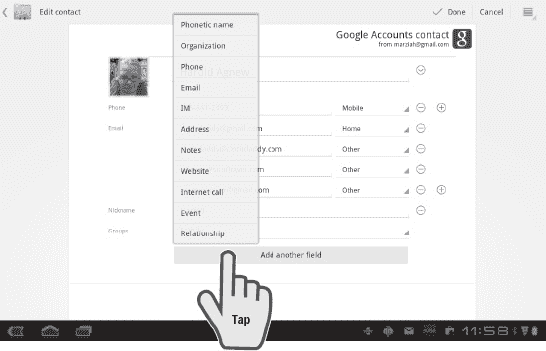

# 九、管理联系人

本章假设您已经设置了 Google、Exchange 和其他电子邮件帐户。这一点很重要，因为如果您不与任何帐户同步，您将没有很多联系人需要管理。你可能已经设置了你的推特、脸书和 Skype 账户，但是如果你没有也没关系。

上面提到的所有账户类型都是你所有联系人的方便的虚拟通讯录。您可以从平板电脑、手机和 Web 添加联系人。它们都可以在平板电脑上的**联系人**应用程序中找到。无论帐户类型如何，您都可以使用相同的基本步骤来管理您的联系人。

### 平板电脑与手机

在之前版本的 Android 上，联系人被整合到管理联系人和通话的**拨号器**应用中。有一些 Android 平板电脑也是手机，如戴尔 Streak 和英国版的 7 英寸 Galaxy Tab。它们目前都运行以前版本的 Android，尽管界面已经被修改。美国版的原版 Galaxy Tab 不打电话。

您可以使用 Skype 等 *VoIP* (互联网协议语音)工具与其他用户进行语音通话，甚至拨打外线电话号码(付费订购)。在第十六章中有更多关于 Skype 的内容:“视频会议和 Skype”然而，一般的经验法则是，你的 Android 平板电脑不打传统电话。

### 联系人 App

您可以通过点击**联系人**应用程序来访问您的联系人。

界面类似于**电子邮件**和 **Gmail** 应用的界面。左侧有一个联系人列表，您可以通过拖动手指来滚动浏览。在右侧，您可以看到当前所选联系人的详细信息。

在屏幕顶部，有过滤、搜索、添加和编辑联系人的按钮。图 9–1 显示了基本布局。

**图 9–1。** *联系人 app 的布局*

当您查看联系人时，您会注意到右边有一些符号。这些符号让您可以通过您为联系人列出的任何方法进行即时联系。您可以通过电子邮件、即时消息、Skype、视频聊天和 Tweet 与联系人联系。如果你列出一个地址，你可以在谷歌地图上找到这个位置。您可能会在联系人姓名下方看到即时消息或 Twitter 状态。根据平板电脑上安装的应用程序，您甚至可以有更多选项。

然而，即使您列出了电话号码，您也无法呼叫联系人，除非您的平板电脑支持语音呼叫。

### 添加/编辑联系人

按照以下步骤添加或编辑联系人:

1.  要添加新联系人，点击屏幕右上角的**新建**按钮，如图图 9–1 所示。
2.  选择用于此联系人的帐户(如果您有多个帐户)。一旦你这样做了，你会看到一个类似于图 9–2 的屏幕。

空白表单预先填充了一个标准模板，但是您可以根据自己的需要使用或多或少的信息来自定义这个模板。如果你想编辑一个联系人而不是添加一个新的，点击**铅笔**按钮而不是**新建**按钮，如图图 9–1 所示。

**图 9–2。** *添加新联系人*

有几个区域有一个看起来像角的标签。这种类型的标签表示您可以点击来定制该项目的标签，例如在**电话**字段旁边的标签。轻击将**家**改为**工作**或**移动**。点击**名称**字段右侧，将其分为以下几个部分:**第一个**、**最后一个**、**中间的**、**前缀**和**后缀**。

最后列出的字段是**组**。该字段可用于按类别组织您的联系人，如**工作**、**朋友**和**家庭**。如果您想要的组不存在，您可以单击底部的选项来创建一个新组。您也可以将单个联系人添加到多个群组。

**注意:**一旦您完成了联系人信息的输入，请务必点击**动作**栏上的**完成**按钮。

#### 添加图片

您还可以给联系人添加照片，以便更容易认出他。轻按灰色轮廓或现有照片。您可以选择使用平板电脑的摄像头拍照，或者使用平板电脑图库中的现有照片。

#### 添加自定义字段

默认模板可能没有您想要的所有字段。要添加另一个字段，只需点击屏幕底部附近的**添加另一个字段**按钮，如图图 9–3 所示。

**图 9–3。** *添加另一个字段*

您可以添加各种各样的字段，包括您与联系人的关系、她的网站以及拼音姓名发音指南(它是 *Mar-Zee-uh* )。**注释**字段可以作为任何可能丢失的字段的总括。

### 过滤联系人

如果你有很多联系人，你会想要一些简单的方法来整理他们。例如，您可以使用搜索功能来查找联系人。然而，有时你可能不记得某人的名字，或者你实际上可能在寻找一群人。这就是过滤器发挥作用的地方。

当你查看你的联系人列表时，在左上角的有一个**动作**栏项目，可以让你选择要查看的联系人。默认为**所有联系人**，但您可以点击选择仅显示特定账户或账户内特定群组的联系人。例如，Figure 9–4 只列出了 Twitter 账户。

**图 9–4。** *只显示推特账号*

如果您想更进一步，您可以在您的联系人中创建特定组的自定义视图，如**朋友**和**家人**，但不包括**同事**(参见图 9–5)。

**图 9–5。** *自定义过滤联系人*

### 加入账户

当您浏览联系人列表时，您可能会注意到有许多重复的联系人。这是因为您的联系人是从您授权在平板电脑上进行帐户同步的任何帐户中汇集的。同一个人可能有不同的 Twitter、Skype、Exchange 和 Gmail 列表。

解决方案是加入这些帐户。这一操作只是将他们组合在**联系人**应用程序中，如果您愿意，您可以稍后将他们分开。

按照以下步骤加入帐户:

1.  点击**铅笔**图标，开始编辑所需联系人。
2.  点击屏幕右上角的**选项**按钮。
3.  选择**加入**。
4.  选择您想要合并的联系人，如 Figure 9–6 所示。

**图 9–6。** *加盟联系人*

您将自动看到同名的所有联系人；但如果你有多个姓名不同的联系人，如婚前姓名或公司名称，只需点击**显示所有联系人**即可找到他们。

已加入的联系人会在屏幕的右上角显示，而不是显示具体的帐户。将显示该帐户的所有可用字段。

### 共享联系人

根据平板电脑上安装的应用程序，您可以通过多种方式共享联系人。按照以下步骤共享联系人:

1.  查看联系人时，按下**动作**菜单右上角的**选项**按钮。
2.  按下**共享联系人**。
3.  选择你的分享方式。

选择**电子邮件**或 **Gmail** 以附件形式发送您的联系人。如果你安装了这个应用， **Evernote** 会创建一个新的笔记。蓝牙试图将信息发送到具有蓝牙功能的设备。

**通过条形码**分享选项制作了一个*二维码*(一个易于手机扫描的方形条形码)，你可以举起来让其他人用他的手机扫描。

**注意:**如果您将自己添加为联系人，您可以使用共享功能向某人发送您的地址，而不是使用名片。

### 导入和导出联系人

您可能已经注意到，**共享联系人**正上方的选项之一是**进出口**。您可以使用此选项从 SD 卡导入联系人或将他们导出到平板电脑的卡中，以供以后参考。

**联系人** app 使用的格式是`.vcf`(或 vCards)。这是虚拟名片的标准格式。

### 小工具

你可以在你的**主页**屏幕上添加一个**联系人**应用小部件。这是您可能经常发送电子邮件或即时消息的联系人的快捷方式。轻按小工具上的联系人，您就可以轻松访问可用的联系方式。