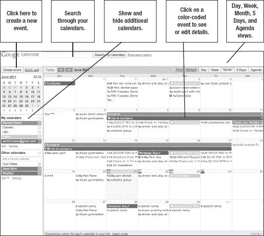
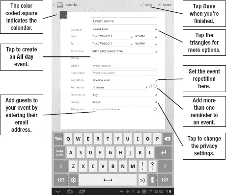

# 十、使用日历

在本章中，您将学习如何使用日历。在默认的 Android Honeycomb 平板电脑上，谷歌日历是主要的日历工具。你将学习如何在平板电脑上使用**日历**应用，即使是使用微软 Exchange 账户。我还将讨论替代方案。

### 网络上的谷歌日历

谷歌日历是一款功能全面的网络日历应用。你可以使用它来管理个人、共享和公共事件，Android 平板电脑使你的日历易于查看和阅读。

你只需要一个谷歌账号就可以注册谷歌日历；既然你可能已经有了一个在平板电脑上使用 Gmail 的账户，你就万事俱备了。如果你使用的是笔记本电脑或台式电脑，你可以在`[`calendar.google.com`](http://calendar.google.com)`访问网上的谷歌日历。

图 10–1 显示了基本的基于网络的谷歌日历布局。

**图 10–1。** *谷歌网络日历*

基本的日历布局是为电脑上的网络浏览器设计的，电脑的显示器通常比平板电脑或手机更大，所以有很多密集显示的信息。您主要通过鼠标点击或跟踪板点击来浏览在线日历，而不是拖动和缩放。

你有五个视图:**日、周、月、5 天**(查看你一周的工作)**日程**。也有一个**打印**视图，供想要打印副本的人使用。除了使用**创建事件**按钮创建事件之外，您还可以点击**快速添加**按钮，使用自然语言创建一个新事件，例如“周二六点在 Jason's 吃晚餐”我现在指出这些功能，是因为并不是所有的功能都可以在你平板电脑的**日历**应用上使用。不过，如果你需要一项缺失的功能，你可以随时使用平板电脑的网络浏览器查看谷歌日历。

### 隐私级别

Google Calendar 显示了一系列日历，所有日历都用颜色编码并堆叠在一起。这允许您根据需要查看或隐藏日历。它还允许您为每个日历设置不同的默认权限。这意味着您可以决定日历是否完全公开(例如，当地企业的销售和促销或俱乐部或会议的活动)；与少数人共享(例如，家庭日历或工作场所协作)；仅显示忙碌或可用信息(例如，客户会议请求)；或者仅对您可见。

所有这些选择实际上都源于两种选择:公共或私人。在公共条目中，您有完全公共的日历，所有人都可以看到所有事件，表明您何时忙或有空。在私人日历中，您可以选择与其他人共享选定的活动或可用性。输入新事件时，您可以覆盖这些设置。

**注意:**您可以创建具有一种默认行为的日历，并更改单个项目的权限。然而，我要提醒你不要这样做(除了邀请与会者参加活动)，因为很容易忘记你已经覆盖了私人日历来举办公共活动。更安全的做法是坚持使用您选择的日历类型的默认权限。

### 添加日历

在屏幕的左下角有两种类型的日历可供选择，**我的日历**和**其他日历**，每种日历都有一个`Add`链接。**我的日历**是您可以查看和编辑的日历。其他日历是那些你只能查看的日历。您可以通过点击所需日历类型下方的`Add`链接来添加新日历。您的选择将取决于您希望添加的日历类型。例如，如果您想在**我的日历**中添加一个日历，您将看到类似于图 10–2 的内容。

**图 10–2***。添加日历*

您应该为每个日历添加名称和描述，以及公共日历的位置(如城市艺术中心)。接下来，设置日历的时区。

这是基本信息。您现在可以进入隐私设置了。

您必须选中特定的框才能公开日历。否则，您的日历是私人的。您也可以通过在标有**与特定人**共享的框中输入电子邮件地址，与他人共享日历上的事件。当您向日历中添加联系人时，您可以指定他们是否可以查看活动。管理事件；或者既管理事件又管理共享(即，管理他们是否有权将其他人添加到日历中)。如果您现在还没有合适的人选，您可以在以后通过编辑活动来添加客人。

您可以通过点击**我的日历**或**其他日历**下面的`Settings`链接来调整您的分享和查看选项。这为您提供了链接到您帐户的所有日历的视图，如右侧所示。您可以查看共享状态、隐藏或显示日历，或者取消订阅共享或公共日历。

### 导入和导出日历

如果你想让日历事件进出谷歌日历，按下**我的日历**列表下的**设置**选项。您将在“日历”标签中看到一个用于导入和导出日历的链接。谷歌使用 iCalendar (iCal)格式导出其日历；但是，它可以导入 iCal 或 CSV 格式的日历(CSV 是 Microsoft Outlook 使用的日历格式)。

### 与 Exchange 同步日历

如果您使用 Microsoft Exchange server 来管理公司活动，您可能希望将其与您的 Google 日历同步，以使工作和家庭生活更加轻松(有关添加 Exchange 帐户的具体说明，请参见第四章:“同步其他帐户”)。添加后，交流活动将显示在你平板电脑的**日历**应用上；然而，当你在网上使用谷歌日历时，它们不会显示在谷歌日历上*。*

您可以在`[`dl.google.com/googlecalendarsync/GoogleCalendarSync_Installer.exe`](http://dl.google.com/googlecalendarsync/GoogleCalendarSync_Installer.exe)`从谷歌下载并安装**谷歌日历同步**，同步两地的日历。在撰写本文时，该工具与 Outlook 2003、2007 和 2010 兼容。它仅适用于 Windows，与 Windows XP、Windows Vista 和 Windows 7 兼容。它不能在 64 位版本的 Windows 上运行。

当你安装**谷歌日历同步**时，你可以决定这是否是双向同步，事件在两个程序中都是可编辑的；或者单向同步，其中事件只能在一个程序中编辑。如果你使用的是另一款日历应用，比如 **TouchDown** ，你可能希望只向一个方向同步，以避免所有内容都显示两次。

如果你是 Mac 用户，谷歌日历和 Exchange 之间的同步就比较棘手。OS 10.5 及更高版本的用户可以使用 CalDAV 协议在苹果日历程序( **iCal** )和**谷歌日历**之间进行同步。但是，CalDAV 在 Office 2011 中不受支持。我个人的解决方案是通过 Android 同步 Exchange 事件，并在我的 Mac 笔记本电脑上使用 **iCal** ，它支持 Exchange 和谷歌日历同步。

### 触地

交换同步难题的另一个替代方案是 Nitro 的平板电脑触地得分。你可以免费下载试用版。完整版售价 19 美元，支持完全 Exchange ActiveSync。 **TouchDown** 不会同步你的谷歌日历和交换信息——这些信息是严格分开的。不过**触地**确实支持 Exchange 任务同步，而 Android 不支持。您可以在`[`market.android.com/details?id=com.nitrodesk.honey.nitroid`](https://market.android.com/details?id=com.nitrodesk.honey.nitroid)`找到平板电脑的**触地。**

### 平板电脑上的谷歌日历

我详细介绍了谷歌日历的网页版，因为了解该版本的工作原理将有助于你理解它在平板电脑上的工作原理。您也可以在浏览器中使用 Google 日历的网页版。在十英寸的平板电脑上看起来很棒。

**提示:**如果你从你的**浏览器**应用程序启动谷歌日历，你看到一个笨拙的移动版界面，只需点击页面底部的`Desktop`链接。

然而，在平板电脑上使用谷歌日历的首选应用是**日历**应用。

许多平板电脑在**主页**屏幕上都有**日历**应用的快捷方式。图 10–3 显示了该应用的基本布局。

**图 10–3***。日历应用*

如你所见，平板电脑的**日历**应用的布局与网页版略有不同。它很简单，干净，设计成用手指滑动和点击来使用，而不是用鼠标点击。

您可以在**日、周、**和**月**视图之间导航。请注意，应用程序中没有**日程**或 **5 天**视图。

**提示:**你可以通过左右滑动的方式在前后几天和几周之间导航；但是，您可以使用上下拖动动作在下个月和上个月之间导航。

### 添加事件

您可以通过点击屏幕右上角的**新事件**按钮将事件添加到您的日历中。你需要填写图 10–4 中显示的选项。

**图 10–4。** *在蜂巢中添加新的日历事件*

就像在其他应用程序中一样，字段右下角的三角形表示您有额外的选择。只需点击它来查看您的选项。带圆圈的**加**或**减**按钮表示您可以添加或删除的字段。例如，您可以通过单击该字段的**加**按钮为单个事件创建多个提醒。

我有时会为一些重要的事情这样做，比如一个演示。我为前一天设置了一个提醒，为早上设置了一个，为活动前 15 分钟设置了一个。这样的话，我会记得穿上适合这个场合的衣服，带上我所有的材质。

如果事件发生在您当前位置之外的地方，您还需要注意事件的时区。添加完活动后，点击 **Done** ，或者如果您改变主意，点击**取消**。

### 添加客人

您可能还注意到了列表底部的字段，该字段允许您添加客人。您可以将客人添加到私人或公共事件中。有电子邮件地址的人将收到活动通知。拥有谷歌日历账户的人将会收到基于他们偏好的通知。客人可以表明他们是否出席，您可以看到结果(参见 Figure 10–5)。

**图 10–5。** *邀请客人参加活动*

### 更改您的日历设置

你不能控制所有的网络选项，但是你可以在**日历**应用程序中更改一些设置。从**日**、**周**或**月**视图中，按下屏幕右上角的**菜单**按钮，然后进入设置。如图 Figure 10–6 所示，您可以选择常规设置和账户设置。您也可以使用此选项来添加帐户。有关添加帐户的更多详细信息，请参考第四章:“与 Google 帐户同步”

**图 10–6。** *一般偏好*

点击单个 Google 帐户来更改特定的日历设置，如 Figure 10–7 所示。个人帐户只允许您更改与您的帐户同步的日历。您可以削减不必要的日历，以节省电池寿命和数据使用。

**图 10–7***。个人账户设置*

### 小工具

谷歌日历自带一个小工具；在 Honeycomb 平板电脑上，这个小部件(显示在右边)是可调整大小和交互式的。您可以点击**新事件**按钮，直接从您的**主页**屏幕添加新事件，并且您可以通过上下滑动来滚动浏览您的事件。但是，您不能隐藏日历或更改 widget 上的视图。

如果你想要更多的功能，你可以试试第三方的小工具，比如**纯日历小工具**(2.14 美元)。这个小工具可以让你同步**触地**、**谷歌日历**、**谷歌任务**、**gt Tasks**以及其他应用。它提供了许多大小、显示和皮肤选项。它甚至可以让你显示谷歌日历中丢失的**议程**视图。现在，这不是一个可调整大小的小部件；然而，开发者已经宣布了发布蜂巢优化版本的计划，当你读到这篇文章的时候，这个版本有望上市。

### 任务

你可能已经在网上注意到谷歌日历显示的日历之一是任务日历，如左图所示。该日历显示了一个简单的任务列表，允许您创建任务集合、设置截止日期、添加注释，以及在任务完成时检查项目。

然而，平板电脑上的**日历**应用程序尚不支持该功能。然而，这并不意味着你不能使用这个特性。如果你在网上使用谷歌日历，你可以创建一个书签专门指向`[`gmail/tasks`](http://gmail/tasks)`的任务。我的首选是使用第三方应用程序。我用的是**Dato gt Tasks**(`[`market.android.com/details?id=org.dayup.gtask`](https://market.android.com/details?id=org.dayup.gtask)`)，它提供免费试用或 3.99 美元的付费应用，可以与谷歌任务同步。你也可以使用一个独立的任务管理工具，比如 Astrid Todo。两款 app 都兼容**纯日历** **Widgets** 。