# 十一、使用地图

您的平板电脑不仅仅是一台没有键盘的笔记本电脑。根据设备的不同，它还集地图、指南针、GPS 导航系统和餐厅指南于一身。

有很多应用程序使用地图；但为了做到这一点，这些应用程序必须知道你的平板电脑在哪里。为此，许多 Android 平板电脑都有 GPS 装置，一些有手机数据，到目前为止所有的都有 Wi-Fi。

通常，可以通过以下方式找到平板电脑:

*   全球定位卫星
*   手机信号塔
*   无线定位系统

有超过 27 颗全球定位卫星环绕地球运行。你平板电脑的 GPS 单元试图找到至少三个手机的信号，并对你的位置进行三角定位。然而，这需要你的平板电脑有一个检测 GPS 信号的芯片，并且位于可以检测到它们的区域。如果你在室内或高楼林立，你的平板电脑可能收不到 GPS 信号。

你的位置也可以通过手机信号塔的相对位置来估计。这不如 GPS 精确，因为手机信号发射塔的定位是为了有效接收信号，而不是三角测量，所以不太可能出现三个重叠点的情况。

第三种定位手机的方法是使用已知公共 Wi-Fi 点的地图。这种方法在城市地区和室内都很有效——正是 GPS 效果不好的地方。因为这种方法只需要一个 Wi-Fi 信号，它甚至可以在笔记本电脑、上网本和平板电脑上工作。

根据您的硬件，您的平板电脑可能会使用所有三种方法的组合来了解它的位置。

你可以通过打开**设置**面板，然后选择**位置&安全**来启用和禁用平板电脑跟踪你的功能。图 11–1 显示了 Wi-Fi 三星 Galaxy Tab 10.1 上的可用选项。

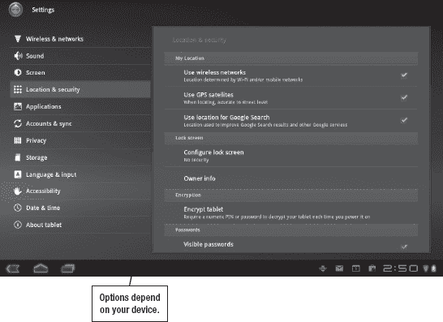

**图 11–1。** *地点&安全选项*

您可以选择启用**使用 GPS 卫星**和**使用无线网络**选项。如果你的平板电脑支持 Wi-Fi 和蜂窝网络，后一种选择可以同时使用这两种网络。您还可以选择启用或禁用谷歌搜索选项的 使用位置】。如果您对谷歌跟踪您的位置有隐私顾虑，您可以禁用此选项；但是，启用它可以为您提供更好的本地搜索结果。

### 了解谷歌地图

默认情况下，蜂巢平板电脑自带**地图**应用，该应用依赖于谷歌地图。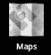谷歌地图也可以在网上使用，这意味着你可以使用平板电脑的**浏览器**应用程序来访问它；然而，**地图**应用程序为平板电脑提供了一个很好的界面，它包括许多选项。图 11–2 展示了在平板电脑上使用谷歌地图的基本操作。

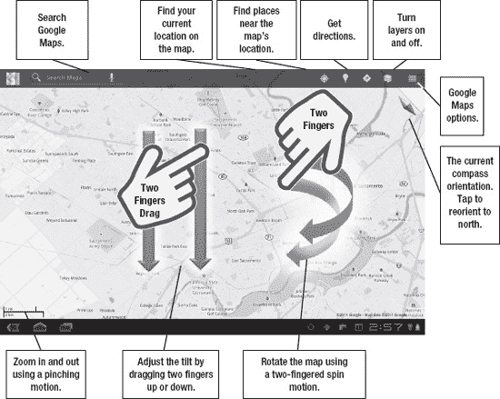

**图 11–2。** *地图应用的触摸界面*

**地图**应用可以让你使用便捷的手指手势导航谷歌地图:

*   用一个手指向任意方向滑动地图。
*   用一个手指轻按以放大某个位置。
*   用两个手指轻按以放大某个位置。
*   轻按已标记的位置，如博物馆、公园或餐馆，以查看该位置的更多信息。
*   用两个手指直接向下或向上拖移，以倾斜地图的视角。
*   用两个手指扭转来旋转地图的方向。轻敲指南针，使其重新指向北方。
*   用两个手指合拢或张开来放大或缩小当前地图视图。

### 在地图上找到自己的位置

如果您想在地图上找到您的当前位置，点击**动作**菜单中的**位置/指南针**按钮(参见图 11–2)。你会看到你在地图上的位置是一个被蓝色圆圈包围的箭头。你可能在蓝色圆圈内的任何地方，所以圆圈越小，位置信息就越准确。

如果您的平板电脑有内置指南针，您可以再次点击进入**指南针**模式。当您这样做时，即使您倾斜和移动平板电脑，地图也会倾斜并保持朝北。当你迷路的时候，这对于试图找到你的方向是很方便的。

#### 获取路线

您可以使用屏幕顶部的搜索功能找到新位置。一旦你找到一个地点，你可能想知道如何到达那里。你也可以直接进入正题，同时找到地点和方向。无论使用哪种方法，您都可以通过点击屏幕顶部**动作**菜单上的**方向**按钮开始(参见图 11–3)。

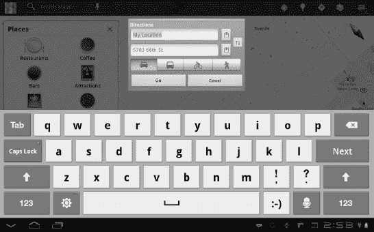

**图 11–3***。在地图应用中获取驾驶路线*

您将看到**我的位置**和**终点**字段(参见图 11–3)。**我的位置**字段假设您想要从当前位置开始的方向。如果您想要使用不同的地址，您需要将其输入到此字段中。

在**我的位置**和**终点**字段旁边还有一个方便的**书签**按钮。这可让您从当前位置、您在地图上指向的位置、您的某个联系人的地址或您标记的任何位置中进行选择。

您还会在这些字段下方看到一系列按钮，让您选择所需的交通方式。可以选择**汽车**、**公交**、**自行车**、**步行**方向。如果你想在大城市里没有车的情况下去任何地方，这些选择会是你的救命稻草。

**注意:**公共交通方向取决于城市以及给定城市向谷歌传达其公共交通选项的情况。一些路线会有不必要的公交换乘和步行，仅仅是因为谷歌的数据库没有列出附近的车站；然而，谷歌也为全球 400 多个城市增加了公共交通方向。

一旦你确定了起点、终点和交通工具，点击 **Go** 。你会看到一个基于文本的逐步指示列表(参见图 11–4)。

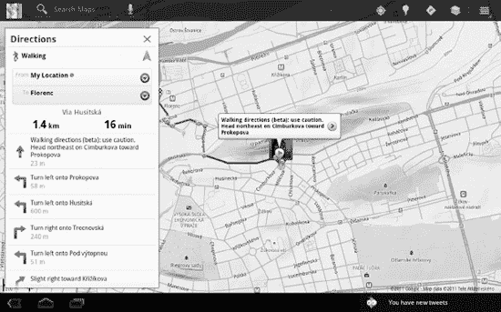

**图 11–4。** *指点上市*

如果你有步行、骑自行车或开车的方向，你也可以轻触 **导航**按钮，或在按下手机的**菜单**按钮后选择**导航**，将你的平板电脑变成 GPS 导航系统。谷歌的导航功能将通过语音为你提供路线指引，甚至试图帮助你避开交通堵塞。

**注意:**如果全程都有互联网连接，您只能使用谷歌导航功能到达目的地。这意味着你要么需要一台带有无线数据计划的平板电脑，要么需要找到一些其他数据选项，如移动热点设备。

就像专用的 GPS 导航系统一样，如果你拐错了弯或选择了另一条路，谷歌的导航功能会试图进行补偿。它还具有文本到语音转换功能，这意味着您将听到“在 50 号西高速公路左转”，而不仅仅是“在 1000 英尺后左转”与任何 GPS 导航系统一样，该功能在某些道路上比在其他道路上效果更好。有时，谷歌地图数据会反映出一个不常用的道路名称，有时发音会出错。

导航功能显示驾驶地图信息、到达目的地所需的时间以及下一个转弯的方向。当你接近目的地时，导航功能会向你显示街道视图，所以你可以瞥一眼(或者更好的是，让乘客瞥一眼)看到你要去的地方。不像一些商业导航系统，你不能选择新的声音或改变你的“汽车”在地图上的外观。

轻触**后退**按钮，退出导航功能并返回基于文本的方向。从这里，你还可以按下手机的**菜单**按钮来获取更新的路线，返回的路线，或者报告路线的问题。您还可以使用**路线**选项来避开收费公路或高速公路。

### 地图图层

Android 的 **Maps** 应用程序通过将谷歌地图信息显示为一系列信息层覆盖图来工作。如果你熟悉谷歌地球，它的工作方式是一样的。您可以按照以下步骤单独打开或关闭这些层:

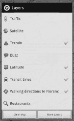

1.  点击**层**按钮查看一些可用的层，如右图所示。该列表也可以滚动。
2.  点击**更多层**按钮查看更多层。
3.  轻按每个层以打开或关闭它。您可以一次打开多个图层。

#### 交通

谷歌地图上的许多信息来自与第三方的合同，交通信息也不例外。交通信息只适用于大城市，通过道路的颜色编码来显示。绿色表示交通顺畅，黄色表示延误，红色表示严重拥堵。交通信息变化很快，所以不要期望绝对准确。当你真的在路上时，也很难(也很危险)检查这一点。谷歌的导航功能会自动补偿典型的日常拥堵模式。例如，它提供的方向会让你在高峰时间使用备用路线。

#### 卫星

卫星信息来自第三方和谷歌拥有的图像来源，这些照片被拼接在一起，叠加在地图信息上(见右图)。

图像通常很好，但有时拼接过程会扭曲图像。因此，有时地址会出现在错误的位置，您会注意到不同图像质量的地面。

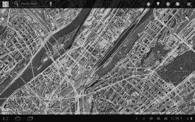

卫星图像通常不是最近的，任何特定区域的照片都可能是好几年前的了。当一个地区发生重大事件时，如卡特里娜飓风或日本地震和海啸，谷歌经常会购买新图像；然而，如果你房子的卫星图像不包括你最近建造的车库，不要感到惊讶。

#### 谷歌实验室图层

谷歌实验室是你可以打开和关闭的实验功能的集合(见右图)。它们不总是可靠的，也不总是持久的；然而，一些谷歌实验室的“毕业生”已经变成了可靠和受欢迎的功能，例如谷歌地图中的公共交通方向。

大多数重要的谷歌产品都有自己的一套谷歌实验室实验，但这些功能通常不会在你的手机上运行(许多 Gmail 功能都是如此)。谷歌地图是一个例外。按照以下步骤访问谷歌地图中的谷歌实验室功能:

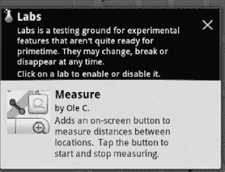

1.  在谷歌地图中按下**菜单**按钮。
2.  点击**实验室。**
3.  点击单个图层(即 Google 地图的附加 Google Labs 功能)来打开或关闭它们。您可以随意启用或禁用层。

谷歌将谷歌实验室实验的相对受欢迎程度作为决定去留的一个因素。谷歌 Buzz 层最近被取消，但目前有一个用于快速测量两个位置之间距离的**测量**层。当你读到这封信的时候，它可能已经被别的东西取代了。

### 与纬度共享位置

Latitude 功能为您提供了一种方式，让您的社交网络知道您的位置。您可以使用它来确保人们知道您已完成航班，或者让您的联系人知道您在他们的城市。

目前，您只能与共同的朋友分享信息。这意味着你必须邀请你的朋友与你分享他们的纬度信息，他们必须接受邀请。您也可以从笔记本电脑或台式电脑上使用 Latitude，因此该功能不依赖于每个人都拥有一部手机。您共享纬度位置信息的四个全球选择如下:

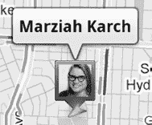

*   **自动检测:**你只要让手机向好友报告你在哪里。
*   设置您的位置:您可以手动更新您的位置(如果您愿意，也可以谎报您的位置)。
*   **隐藏您的位置:**没有人看到您的位置，但您仍然可以看到您的朋友。
*   **关闭纬度:**没人看到你在哪里，你也看不到你的朋友在哪里。

请记住，您的朋友是唯一可以看到这些内容的人，个人设置将覆盖全局选择。在 Latitude 发布后的早期，有人担心人们可能会在不知情的情况下被跟踪，所以你可能会收到一封电子邮件，让你知道你已经加入了 Latitude 或你已经打开了位置跟踪。

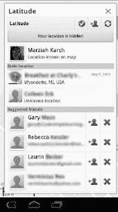

要从谷歌地图向 Latitude 添加朋友，请执行以下步骤:

1.  按下**菜单**按钮。
2.  损失 **纬度** .
3.  点击**添加好友**按钮。
4.  通过您的联系人列表或电子邮件地址选择要添加的人。您也可以通过点击建议好友姓名旁边的**添加好友**按钮来添加他们。

您邀请的人将收到一封电子邮件，邀请他们加入 Latitude 或接受您的请求。当有人向您发送邀请时，您会收到一封电子邮件，询问您是要忽略该请求、共享您的位置，还是接受该请求并隐藏您的位置。

如果这一切听起来有点太私人，你可以把它降低一个档次，进行更随意的商务接触。要单独管理朋友，只需点击**纬度**，然后点击联系人的姓名。

您可以查看您的朋友在地图上的位置，联系他们(通过电子邮件、Google Talk 等)，获取导航方向以访问他们，ping 他们以请求他们签到，将他们从朋友中移除，以及设置特定的隐私设置。

轻触**共享选项**可让您设置以下选项:

*   **检测您的位置:** Latitude 使用您的设备来确定您的位置。
*   **设置您的位置:**此功能使您可以说您在任何地方，但它通常是为没有无线数据计划的人设计的。
*   不要更新你的位置:没有人能看到你在哪里。
*   **启用位置历史:**这只是你去过的地方的个人日志。别人看不到它，但它给你的日常生活提供了一个有趣的快照。
*   **启用自动签到:**你可以指定你想自动签到的地方，这样你的联系人就会知道你在那里。例如，当你在办公室或你最喜欢的咖啡店时，它可能会更新。
*   **管理您的位置:**您可以在这里查看和删除您为自动签到设置的位置。

您可以稍后更改这些设置，或者按关系级别调整它们。例如，你可能会让你的配偶知道你的确切位置，但让你的业务联系人只在你旅行时才知道你所在的城市。当您不想广播您的位置时，您也可以通过隐藏或手动输入您的城市名称来全局关闭此功能。

**注意:** Google+是谷歌新推出的社交网络工具，也允许位置签到。在本书即将出版的时候，Google+签到只能通过 **Google+** 应用程序获得；然而，谷歌计划在未来将 Google+功能集成到更多的服务中，所以当你读到这篇文章时，Google+签到可能已经可以通过谷歌地图进行了。

### 地名页

你需要关于一个地点的更多信息吗？如果是这样，那么谷歌地图上的 **Places** 页面就是你要去的地方。在 Android 上，每个位置都有一个组织良好的**细节**页面。连按两次某个位置或轻按位置气泡，您会看到该位置的详细信息，如右侧所示。

不是每个地方都有你在自由大厅看到的那么多细节；您所看到的将取决于给定位置的可用信息。

您可以找到的一些详细信息包括评论、该地点的网站、电话号码、营业时间、平均评论、相关地点和该地点的图片。

您还可以登录该位置，添加一颗星，或点击**更多**按钮在社交网站上共享该位置。

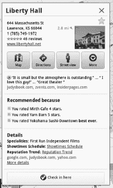

#### 谷歌地点

你可以使用平板电脑内置的 **Places** 应用程序搜索附近的景点，而不是在地图上随机寻找景点(参见图 11–5)。这个应用程序可以让你按类别浏览位置或单独搜索。一旦你找到一个地点，你就可以进入该地点的**详细信息**页面。

**提示:**您还可以使用**地点** app 中的**更多**按钮下载某个地点 10 英里半径范围内的地图信息。您将看不到卫星图像或 3D 建筑，但下载的地图信息可以帮助您在 Wi-Fi 覆盖范围之外导航到某个地方。你也可以在出发前用这个应用程序下载你度假地点的地图。下载的地图会在 30 天后从平板电脑的缓存中删除。

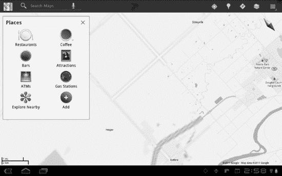

**图 11–5。** *地名 app*

#### 主演外景

您还可以使用**详细信息**页面为位置添加一颗星。轻触屏幕右上角的**星**图标，标有星的位置会在其名称右侧显示一颗发光的黄色星。要移除星星，只需再次点击**星星**图标。使用星星就像保存网页的书签；它使您能够轻松找到您经常访问或需要快速查找的位置。

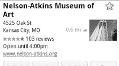

您可以通过两个简单的步骤在谷歌地图中访问您的标有星号的项目列表:

1.  tap〔??〕菜单。
2.  点击**标有星号的地方。**

**注意:**当您出差时，在到达之前，在您的酒店和会议中心挂上一颗星星。这将使您能够立即访问这两个地点的地址和电话号码。它还会给你两个地点之间的驾驶方向和附近餐馆的列表。

#### 谷歌街景

谷歌使用装有摄像头和其他设备的汽车在美国和其他许多国家到处拍摄 360 度的道路照片。

除此之外，谷歌的街景功能是一个计算你需要去哪里的神奇工具，如图图 11–6 所示。当你在一个新的地点有约会时，你可以使用它，在你到达那里之前看看会议地点的建筑是什么样子的。你也可以使用这个功能来查看沿途是否有停车或棘手的十字路口。

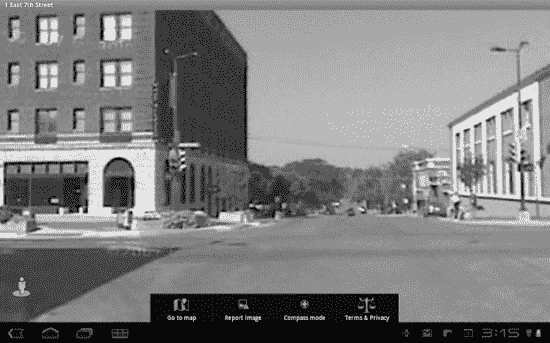

**图 11–6***。谷歌地图的街景功能*

按照以下步骤进入街景功能:

1.  转到一个地点的**地点**页面。
2.  轻点**街景**按钮，看起来像一个人，胸前有一个三角形。不是每个位置都有街景；如果此按钮呈灰色，则该功能在该位置不可用。
3.  通过在图片周围拖动手指来导航；这将在场景周围平移。
4.  轻按箭头，沿着道路向上或向下走。黄线显示街景车行驶的路线。
5.  点击屏幕底部的**转到地图**退出街景。

**提示**:谷歌的街景使用大图片，需要一些带宽，所以你应该只在信号很强或者在 Wi-Fi 热点的情况下才尝试使用它。

你可能还注意到街景有一个**指南针**模式。这个功能实现了一个巧妙的技巧:它允许你通过在面前缓慢旋转平板电脑来查看给定街景周围的区域。

### 电子邮件和文字说明

其他应用程序链接到**谷歌地图**，谷歌提供了大量替代方法来查找方向和位置。如果有人在 Gmail 中给你发送一个位置，谷歌会感觉到该信息是一个地址，并试图自动从它创建一个**谷歌地图**链接。

### 制作自己的地图

你可能已经注意到谷歌地图中的一个选项叫做**我的地图**。在构建地图时，你并不局限于谷歌的图层。你可以创建自己的地图作为谷歌地图的图层；然而，此时你需要在网上这样做，因为没有蜂窝版本的**我的地图**编辑器。

您的所有地图将在**我的地图**图层中可用，但只有您公开的地图对其他人可见或通过搜索可用。

### 第三方导航

谷歌地图是一项免费服务，大多数平板电脑都配有一个应用程序，让你可以访问它的内容；然而，它并不是镇上唯一的导航系统。如果你的平板电脑带有数据套餐，你可以探索各种导航工具，如 **CoPilot Live** 或 **MobileNavigator** 。这些替代导航工具大多数都是高级应用程序，但其中一些允许在数据信号不强时更好地缓存地图信息以进行导航。

### 位置感应社交媒体和游戏

在这一章中，我特别关注了谷歌地图。然而，最近一个值得注意的趋势是位置敏感的社交媒体。有 Yelp 这样的餐厅和服务指南，也有用你的位置标记照片或信息的应用程序。你平板电脑的摄像头还可以标记你的照片拍摄地点。

Latitude、Google+和 Buzz 功能使用了其中一些地理标记功能，允许您直接从谷歌地图进行登记，如右图所示。Twitter 和脸书服务也允许你通过他们的应用签到，但是这一领域的两颗新星是 Gowalla 和 Foursquare 服务。两者几乎在同一时间被创造出来，它们提供了非常相似的特征。最后，应用开发者可以自由利用谷歌地图库和安卓的位置感应功能。

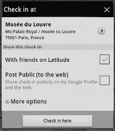

在 Gowalla 和 Foursquare 中，目标都是登记位置。你需要使用电话或其他位置感应移动设备，你不能只手动输入一个位置。重点是实际上*在那里*。你可以通过 Twitter 与任何人、你的朋友、你的脸书页面或全世界分享这些签到。

Foursquare 和 Gowalla 都在与企业和城市合作，为使用这些服务的用户提供优惠券和特价等功能。这种独特的广告形式可能会变得非常受欢迎，因为它为企业提供了一种明显的方式来衡量其广告活动的有效性。

#### 四方的

Foursquare 是由前谷歌员工丹尼斯·克劳利(Dennis Crowley)共同创建的，他曾参与一个类似的项目 Dodgeball，该项目被谷歌收购并放弃。然而，Foursquare 通过增加游戏组件将社交网络带到了一个新的不同的水平。丹尼斯·克劳利(Dennis Crowley)将其描述为一种将探索城市的行为与游戏和一点点童子军自豪感结合起来的方法(当你这样做时，你会获得荣誉徽章和奖杯)。

Foursquare 中某些签到组合可以获得徽章。例如，您可以通过在同一地点登记三次、找到五家卡拉 ok 酒吧、在芝加哥找到三个有照相亭的地方或者在学校晚上凌晨 3 点后登记来获得徽章。

定期在同一个地方登记也能为你赢得*?? 的市长职位。一个地点的市长是最近两个月签到次数最多的人，所以你需要不断签到来维持这个头衔。*

然而，这项服务不允许快速签到，因为它想防止太多人玩这个系统。

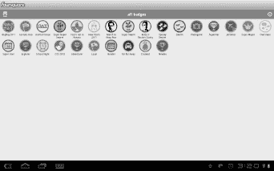

#### Gowalla

虽然 Foursquare 有点像竞技游戏，但 Gowalla 更像是一个个人探索和虚拟地理藏宝工具。Gowalla 让你获得徽章，类似于 Foursquare 中的徽章。在这项服务中，你持有一本你去过的地方的护照。您还可以创建不同登记地点的旅行。

Gowalla 还为用户提供了一些虚拟物品，他们可以在各个地点留下或交换这些物品。例如毯子、鳄梨和浓缩咖啡机。在右侧，您可以看到行李标签留在某个位置。当你在一个地点遇到一个虚拟物品，你可以看到谁拥有这个物品的历史；这鼓励了这些虚拟地理藏宝图的频繁交换。

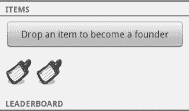

快速签到对 Gowalla 来说没问题，因为没有市长这个概念。Gowalla 服务也比 Foursquare 对距离更敏感，所以你需要离一个地方很近才能签到。这使得 Gowalla 非常适合徒步旅行和酒吧爬行，但对于在建筑物内或 GPS 工作不佳的任何地方办理入住手续来说就不那么好了。