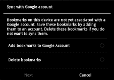

# 十二、浏览网页

第六章讲述了如何将平板电脑连接到互联网。许多应用程序使用你的互联网连接来做一些事情，如检查你的电子邮件或更新你的日历；不过，你也可以用平板电脑直接上网。在这一章中，我们将重点介绍如何使用 Android 的默认**浏览器**应用和其他替代应用。

### Chrome 和安卓浏览器

谷歌实际上有两个网络浏览器，就像它有两个操作系统(Android 和 Chrome OS)一样。谷歌开发了 Chrome 浏览器，但也开发了 ?? Chrome 操作系统，该操作系统是围绕这款浏览器开发的，旨在运行在被称为 ?? Chrome book 的笔记本电脑上。Android 平板电脑可能看起来使用了 **Chrome** 浏览器，但它们实际上使用的是一种不同的 Android 专用浏览器:Android 浏览器**应用程序(也称为 Android 浏览器**)。这两款浏览器都是基于 Webkit 的，Webkit 最初是由苹果公司开发的，用于支持 Safari，现在被用于各种移动浏览器。

**注意:****安卓浏览器**不是 **Chrome** ，所以你不能在你的安卓平板上运行 **Chrome** 扩展。然而，你可以同步书签，我们将在本章后面讲到。

### 安卓浏览器导航

手机上的浏览器不会给你太多的屏幕空间，所以你不能轻易地使用标签来浏览。当你在 10 英寸或更大的平板电脑上点击启动**浏览器**应用时，你会看到你的浏览体验开始类似于你在笔记本电脑上浏览时的预期。图 12–1 显示了在安卓系统中导航**浏览器**应用的基础。

**图 12–1。** *导航浏览器 app*

多选项卡浏览意味着您可以在选项卡之间快速导航。然而，添加太多的标签会导致它们开始滚动到屏幕之外，你将无法在它们之间快速导航。可以看到左上角的**后退**、**前进**和**刷新**按钮。您可以使用标准手势在大多数页面中导航，例如拖移以滚动，捏放以缩放，张开两个手指以缩小。

**注意:**运行早期版本 Android 的较小平板电脑——如 Nook Color、HTC Flyer 和最初的三星 Galaxy Tab——使用的是为较小屏幕设计的**浏览器**应用的非标签版本。Kindle Fire 使用自己的 Silk 浏览器。

#### 查找网站

如 Figure 12–2 所示，要导航到一个新的网站，您可以打开一个新的浏览器选项卡，或者您可以点击现有选项卡的 URL 并键入一个新的位置。

**图 12–2。** *找网站*

但是如果你不知道你想访问的网站的确切网址呢？没问题。只需输入一个关键词而不是网址，你的浏览器就会自动搜索网页。没有单独的搜索引擎框，没有理由在简单搜索之前导航到搜索引擎。

### 书签页面

您可能希望将经常访问的网站存储为书签，而不是重复搜索相同的单词。点击右上角的**星**图标保存书签，如图图 12–3 所示。

**图 12–3***。保存书签*

您可以将书签保存到**书签**区域(这是默认且最简单的选项)，或者您可以将书签作为快捷方式保存在您的**主页**屏幕上或其他文件夹中。

#### 使用书签和历史记录

保存书签只有在需要时可以快速浏览到这些书签时才有用。Android 中的书签拥有自己的页面，而不是占据浏览器**导航栏**的空间。点击屏幕右上角的**书签**按钮，会看到类似图 12–4 所示的屏幕。

**图 12–4。** *书签页面*

您可以用手指滑动来浏览**书签**页面。这个页面预先填充了一些常见的网站，如 CNN 和易贝；但是，此页面还会显示您添加的任何书签，以及您访问过的任何网站的缩略图。**书签**页面也可以作为**主页**屏幕小部件使用。

除了查看书签，还可以浏览自己的查看历史。这是一个非常有用的方法，可以让你回到你已经访问过的页面，但是你忘记做书签或者找不到了。要查看您的历史记录，请点击**书签**页面左上角的**历史记录**标签(参见图 12–5)。

**图 12–5。** *查看浏览器应用的历史页面*

请注意列表中每个站点旁边的星星。这些星星表示您是否已经为某个页面添加了书签；如果你愿意，他们还可以让你创建一个书签。

如果您不希望您的浏览历史显示在这里，您可以点击**菜单**按钮，并选择删除历史的选项。

### 与您的 Google 帐户同步

如果你在电脑上使用 **Chrome** 浏览器，在平板电脑和电脑之间同步书签和浏览历史会很方便。请按照以下步骤操作:

1.  点击屏幕右上角的**菜单**按钮。
2.  从下拉列表中选择**设置**。
3.  在**常规**设置下，点击标签为**与谷歌浏览器**同步的选项(参见图 12–6)。
4.  决定是合并平板电脑上的现有书签还是删除它们，如右图所示。

**图 12–6***。与谷歌浏览器的书签同步*

**注意:**有些时候，你可能根本不想让自己的浏览或搜索历史显示出来，比如当你借平板电脑或购买礼物时。我相信你也可以运用你的想象力找出其他原因。对于匿名浏览，点击**菜单:新匿名标签**。**密探**图标表示该标签页中的网站不会被保存到您的 Android 搜索或浏览历史中。

### 设置您的搜索引擎

你可能不是谷歌搜索的人。如果是这样的话，那么如果你喜欢别的东西，你就不会被谷歌的搜索引擎所困。你也可能最终得到一台被设备制造商设置为不同搜索引擎的平板电脑。按照以下步骤更改您的**浏览器**应用的默认搜索引擎:

1.  点击**菜单**按钮。
2.  选择**设置。**
3.  前往**高级**区。
4.  轻触**设置搜索引擎**。

### 闪光

Adobe Flash 可以从 Android Market 免费下载。安装后，Flash 元素将显示在**浏览器**应用程序中。蜂巢平板支持 Flash 元素；然而，并不是每个 Flash 动画或电影都能在平板电脑上播放。一些流媒体电影网站，如 Hulu，禁止其播放器在没有付费订阅账户的情况下在 Android 平板电脑上运行。如果你愿意，你可以通过设置 **Flash** 只显示需要的 Flash 对象来节省带宽:

1.  从**浏览器**应用程序，进入**设置**。
2.  轻触**高级**。
3.  轻触**启用插件**。
4.  按需点击**。**

 **### 谷歌实验室和快捷控件

*谷歌实验室*是一个你可以找到实验功能的区域。它们可能不会成为永久的特性，但是分析什么会成为永久的特性的一部分是有多少人使用它们。如果你的浏览器在**设置**菜单中有一个**实验室**标签，你可以尝试一下实验功能。(在撰写本文时，只有 Xoom 平板电脑有一个 **Labs** 标签，但其他平板电脑可能会在未来的更新中获得该功能。)

一个示例实验室选项是**快速控制**按钮。当此功能打开时，您将不再看到标准的选项卡式浏览器；相反，你可以按住屏幕右边的**快速控制键**出现，这样你就可以使用大多数控件。这个工具条释放了屏幕顶部的空间，但是使用起来也有点棘手。

### 桌面版和移动版网站

有时当你浏览网站时，你会注意到双指手势不起作用，显示看起来稀疏分散。你看到的可能是网站的移动版，比如雅虎的移动版！显示在左边。它在手机上看起来不错，但在 10 英寸的平板电脑上就不那么好看了。

浏览器有一个*用户代理*告诉网站你正在使用的设备类型。谷歌指定 Android 平板电脑的用户代理是“Android”，而不是用于手机的“Android Mobile”。这意味着网站可以区别对待平板电脑和手机。总之，理论上是这样的。实际操作中，很多网站只是简单的两个版本:移动端和桌面端。

如果你看到你正在阅读一个网站的移动版，你通常可以滚动到底部，点击一个写着“桌面版”或类似内容的链接。不是每个网站都会提供这个链接，所以有时你会被一个网站的移动版本所困扰。

不幸的是，**浏览器**应用不允许你在**设置**菜单中更改你的用户代理。有一种方法可以输入调试命令来改变它；不过很复杂，有用户反映设置不贴。更改用户代理的最简单方法是使用支持此更改的浏览器。

### 替代浏览器

你没有被安卓浏览器锁定。你可以通过 Android Market 下载替代品，你甚至可以将这些替代品设置为你的默认浏览器。**海豚高清**可能是蜂巢平板电脑的最佳替代浏览器， **Opera** 是更小平板电脑的绝佳选择。Firefox 还提供了一个平板浏览器，并且它包括通过扩展添加功能的能力。图 12–7 显示了 **Dolphin HD** 浏览器，该浏览器在`[`goo.gl/sgU8q`](http://goo.gl/sgU8q)`可从安卓市场获得。

**图 12–7。** *海豚高清浏览器*

**Dolphin HD** 让你用手势导航。例如，您可以跟踪字母“N”来打开一个新标签。它也是非常可定制的，它包括各种插件(其中一些可能在一些平板电脑上比其他的更好)。

让 **Dolphin HD** 成为 Honeycomb 用户绝佳选择的一个特性是，它让你可以从**设置**菜单中轻松设置你的用户代理。你不仅可以将其设置为桌面浏览器查看网站，还可以将其设置为 **iPad** (因为更多网站已经针对 iPad 显示进行了优化)或自定义值。

Opera 是小型平板电脑的热门选择，因为它有易于使用的大图标来浏览书签。然而，在撰写本文时，它仍然没有针对更大的平板电脑进行优化，并且不允许您更改用户代理。Mozilla Firefox 也有移动版本，但它对 Android 来说仍然相对较新，评论者抱怨它速度慢且不可靠。**