# 十三、安卓市场

你可以用设备自带的应用做很多事情，但迟早你会想安装一些新的东西。在这一章中，我们将介绍如何在平板电脑上下载和安装 Android Market 的免费和付费应用。在第十四章中，我们将讨论从其他来源下载应用。

### 介绍安卓市场

由于谷歌施加的限制，一些早期的平板电脑不支持 Android 市场。其他平板电脑不支持 Android Market，因为它们使用的是 Android 的修改版本，设备制造商要么选择禁止应用程序，要么选择使用替代的应用程序市场。然而，Android Market 是大多数 Android 平板电脑的默认应用商店。

安卓市场对应用审批采取自由放任的态度。苹果的应用程序商店设定了很高的标准，在允许人们下载之前会仔细检查每一个应用程序。相比之下，Android Market 通常只撤回恶意或不诚实的应用。这取决于你，用户，来决定一个应用是否值得你花时间。

**注意:**如果发现应用程序有害，谷歌有权将其从你的平板电脑上删除。这种情况很少见，但确实发生过。

### 为应用付费

在您开始购买应用程序之前，您应该确定您的支付方式。如果你的平板电脑有无线数据套餐，你可以通过你的无线运营商付费。然而，并非所有运营商都提供此选项。在大多数情况下，你会想通过*谷歌结账*服务来支付。这是通过谷歌提供的一项服务，它将你的信用卡与你的谷歌账户相关联，并允许你通过各种网站为 Android 应用程序以及第三方商品和服务支付费用。

您可以通过访问`[www.google.com/checkout](http://www.google.com/checkout)`来设置您的帐户。

### 从平板电脑安装应用程序

直接从平板电脑安装应用程序是一种简单直观的方式。您的平板电脑必须通过 Wi-Fi 或 3G 或 4G 信号连接到互联网。只需点击**市场**应用图标即可启动安卓市场，或者点击**应用**托盘左上角的**商店**按钮。

这将启动 Android Market(参见 Figure 13–1)。除了应用程序，平板电脑上的 Android Market 还通过 Google Books 提供书籍。一些平板电脑还提供电影租赁服务；然而，在这一章中我们将重点放在应用程序上。

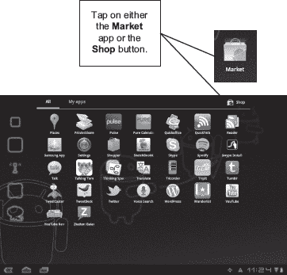

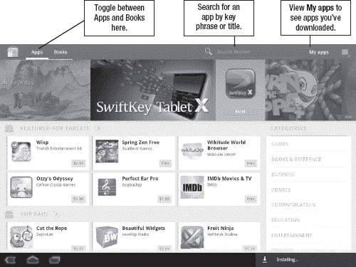

**图 13–1。** *安卓市场平板电脑界面*

Android Market 的顶部有一个巨大的滚动横幅。在此之下，你可以浏览不同类型的特色应用，如针对平板电脑的**，**顶级付费**，以及**顶级免费**。你也可以滚动浏览类别，比如**娱乐**、**通讯**和**财经**。**

 **你不仅仅局限于漫无目的的浏览。你也可以使用屏幕顶部的**搜索市场**框，通过标题或关键词来查找应用。

一旦你找到一个你想更仔细检查的应用程序，点击链接。您将看到一个类似于图 13–2 所示的页面。

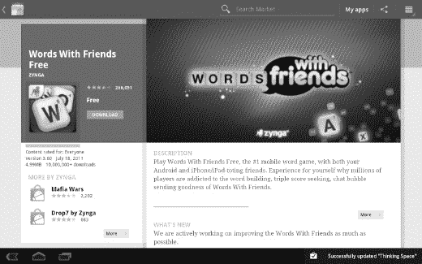

**图 13–2。** *一个 app 的**详情**画面*

每个应用程序都有一个**细节**屏幕，旨在为您提供更多信息。您将看到用户评论、类似应用、屏幕截图、使用统计等。你还会在右上角看到应用程序的价格(在这种情况下，是免费的)，以及一个购买或下载项目的按钮。

**注意:**如果你能在安卓市场看到一个 app，那应该是和你的设备兼容的。开发者在 Android Market 中列出他们的应用时会指定平台兼容性。然而，请务必阅读用户评论，以确保没有人评论该应用程序无法在您的平板电脑上运行。

一旦你决定下载一个应用程序，你会看到一个类似于图 13–3 所示的屏幕。此屏幕概述了此应用程序按设计运行所需的确切权限。您可以选择点击**确定**或**取消**，这取决于您是否想要继续安装。如果你点击 **OK** ，应用程序将开始下载，下载完成后你会看到一条通知消息。

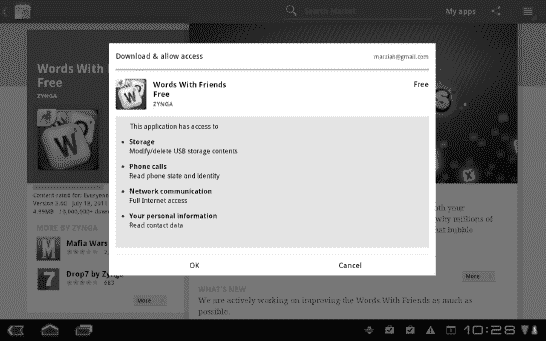

**图 13–3。** *App 权限*

按照以下步骤直接从平板电脑上下载 Android Market 的免费商品:

从桌面或**应用**托盘启动**安卓市场**应用。

1.  导航至所需应用的**详情**屏幕。
2.  点击**下载**按钮。
3.  查看您授予应用程序的权限，然后按**确定**。这将下载应用程序。

### 为应用付费

有很多很棒的免费应用程序，不用购买应用程序也可以享受平板电脑的乐趣。然而，也有很多优秀的付费应用。你可能想在`[www.google.com/checkout](http://www.google.com/checkout)`注册一个**谷歌结账**账户。这样做可以更容易地输入你的信用卡信息，而不必担心在平板电脑上敲出来；但是，您仍然可以在平板电脑上添加和更改信用卡信息。

一旦你确定了支付细节，购买应用程序就非常简单了。基本上，你遵循下载免费应用程序所需的相同步骤。然而，你不是点击**下载**按钮，而是点击**购买**按钮。图 13–4 显示了下载已购买应用的流程。

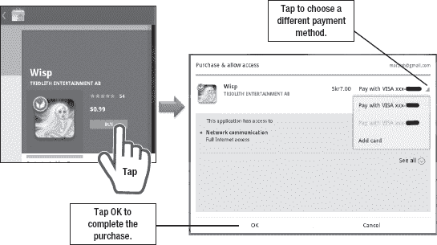

**图 13–4。** *下载购买的 app*

#### 外币应用

应用程序开发者可以向全世界的观众推销他们的应用程序，有时这意味着开发者实际上在另一个国家。App 价格其实有两种表现方式。当您浏览美国的应用程序时，应用程序以大约美元显示。一旦点击**买入**按钮，外币价格被列出(参见图 13–5)。

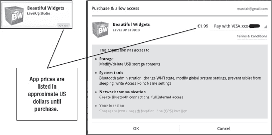

**图 13–5。** *国外安卓市场交易*

只要你的信用卡允许外币交易，你就可以像往常一样购买该应用程序。要知道，有些信用卡在应用程序的成本之外还收取交易费。

### 卸载应用程序

如果你有一个应用程序有缺陷，占用太多空间，或者不再有用，那么你可以卸载它。卸载应用程序的一种方法是使用**应用程序**托盘:

1.  点击 **App** 托盘。
2.  从 **app** 托盘内长按 App。
3.  将应用拖至屏幕右上角，显示**卸载**(如果显示**移除**，则你不在**应用**托盘中)。

卸载应用程序的另一种方法是在 Android Market 中进入其**详细信息**页面。你会看到一个**卸载**按钮，如图图 13–6 所示。只需点击它即可移除您的应用。

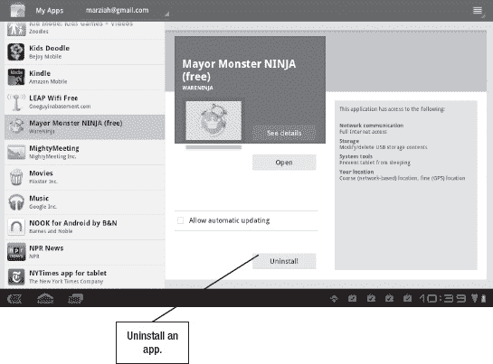

**图 13–6。** *卸载一个 app*

还有另一种卸载应用的方法，但稍微复杂一些:

1.  点击**通知**栏。
2.  点击**设置**。
3.  轻触**应用程序**。
4.  轻触**管理应用程序**。
5.  点击您想要移除的应用程序的名称。
6.  点击**卸载。**

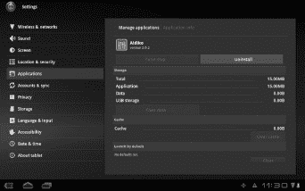

使用这种方法的唯一优点是它不需要 Wi-Fi 连接。

### 获得退款

当你购买一个应用程序时，从你下载它开始，你有整整 15 分钟的时间来改变主意并要求退款。虽然这肯定没有足够的时间来测试一个应用程序，但它有足够的时间来回滚一个意外的下载。

要获得退款，只需在要求的时间范围内进入应用程序的**详细信息**页面，并点击**退款**按钮(参见图 13–7)。

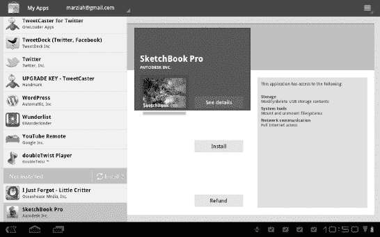

**图 13–7。** *要求购物退款*

一旦 15 分钟结束，您将不再看到**退款**按钮。如有任何疑问，您需要直接联系应用开发者。幸运的是，在应用程序的**详情**页面上还有一个联系开发者的按钮。

### 更新应用程序

每个人偶尔，你会收到一个通知，你的一个或多个应用程序有可用的更新。您可以通过以下两种方式之一更新应用程序。首先，你可以直接进入安卓市场，点击屏幕上方的`My Apps`链接。第二，你可以用收到的更新通知来启动 Android Market。

一旦进入安卓市场，你会看到**我的应用**区域(见图 13–8)。

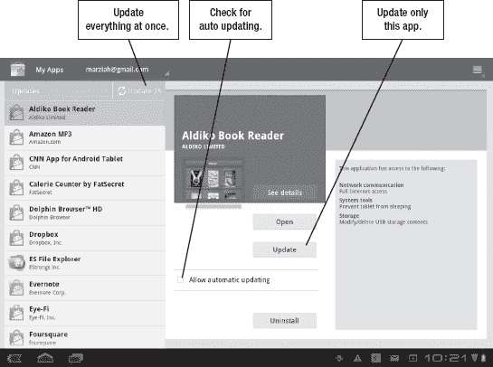

**图 13–8***。在你的安卓平板电脑上更新应用*

你可能有多个应用需要更新。如果是这样，你可以点击页面左上方的**更新**按钮，一次更新你的所有应用。你也可以一次更新一个应用程序，方法是进入该应用程序的**详细信息**页面。如果您的数据计划接近带宽限制，这可能会很有用。

您可能还会注意到允许自动更新的复选框。选择此项意味着您将在最新更新可用时立即下载。有一种情况会阻止您自动更新应用程序或同时更新您的所有应用程序:当应用程序的权限级别更改时。每当应用程序需要不同的权限时，您都需要在更新应用程序之前明确确认这些更改。幸运的是，您也可以批量执行此操作，如右图所示。

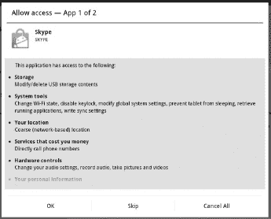

### 使用 Android Market 网站

既然我们已经介绍了从平板电脑上安装应用程序的来龙去脉，让我们来看看如何从互联网上安装它们。您可以从笔记本电脑或桌面浏览器直接进入`[`market.android.com`](http://market.android.com)`来查找和安装应用程序，而无需手持平板电脑。

Android Market 网站看起来很像平板电脑版本(见图 13–9)。

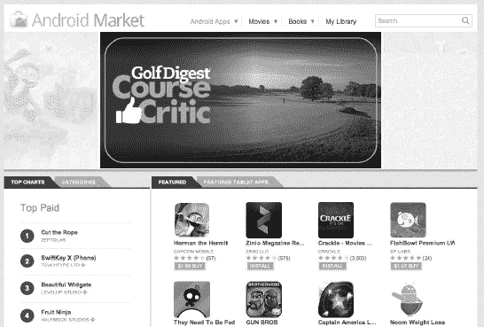

**图 13–9。** *安卓市场网站*

Android Market 的平板和网页版本之间有一些差异。例如，布局是为更大的屏幕设计的。网络版还可以让你更好地调整你的搜索，它包括一些更多的导航选择。然而，概念是非常相同的。只需浏览或搜索您喜欢的应用程序，然后进入该应用程序的**详细信息**页面。

你需要登录你的谷歌账户来下载任何东西，但是一旦你点击**下载**按钮，你就会被提示这样做。一旦你登录，你会看到一个类似于图 13–10 所示的屏幕。

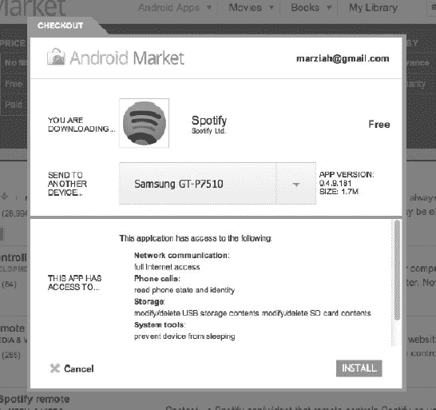

**图 13–10。** *从网络下载应用*

除了显示权限，此窗口还会提示您选择要将此应用发送到的设备。显然，如果你只有一台安卓设备，就没有太多选择了。但是，您可以使用该选项在许多不同的手机和平板电脑之间进行选择。您将只能看到与您注册的*兼容的*设备的选项。

点击**安装**后，app 排队等待安装。下次您的平板电脑连接到互联网时，它会为您下载并安装该应用程序。

一旦你下载并使用了一个应用程序，一定要返回并使用网站留下应用程序评论。在下一章中，我们将看看从 Android Market 以外的来源安装应用程序。**