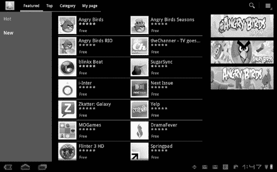

# 十四、替代应用市场

在上一章中，我们讨论了 Android Market，以及如何从它下载和安装免费和付费的应用程序。在这一章中，我们将讨论你可以获得的应用程序的其他来源。谷歌不喜欢锁定 Android。与 iPad 不同，你的 Android 可以让你安装来自第三方的应用程序，而不必对你的设备进行越狱。一个警告:谷歌不锁定 Android，但这并不妨碍设备制造商(或你的运营商)试图这样做。一些平板电脑，如 Nook Color 和 Kindle Fire，使用修改后的 Android 版本，阻止你安装外部来源的应用程序。在 Fire 和 Nook 的案例中，“外部来源”包括安卓市场。

使用第三方应用市场有一些明显的优势。例如，它们促进了更多的竞争和创新。此外，选择性应用市场可能会提供更高质量的选择。话又说回来，它们可能无法提供与 Android Market 相同的保护，包括移除恶意应用的能力。你应该只从信誉良好的来源下载应用程序。一如既往，概不退换。

### 安装未知来源的应用程序

一般来说，你需要从**设置**菜单中启用第三方应用，然后才能使用替代应用市场(参见图 14–1)。

**图 14–1。** *启用第三方应用*

请按照以下步骤操作:

1.  进入**设置**菜单。
2.  轻触**应用程序**。
3.  点击以选中标有**未知来源**的框。

一旦你启用了未知来源的应用程序，你就可以从网站下载它们，通过电子邮件的附件获取它们，或者通过 USB 将它们传输到你的平板电脑上。所有这些替代方法都被称为*侧向装载*。

一旦你点击打开一个下载的`.apk`文件，你将看到该应用程序所需的权限。就像从 Android Market 安装应用程序一样，你可以点击**安装**继续，或者**取消**中止安装。例如，您可以在右侧看到为 **Amazon Appstore** 应用程序呈现的权限窗口。

让我们更仔细地看看这个应用程序。

### 亚马逊应用商店

Amazon.com 出售书籍、电影和安卓应用。使用亚马逊应用商店需要你安装亚马逊应用商店应用程序，但是从这一点来看，它的工作方式很像亚马逊市场。按照以下步骤安装**亚马逊 Appstore** 应用:

1.  在**设置**菜单中启用未知来源的应用。
2.  从平板电脑的浏览器(如左图所示)或任何其他电脑访问网络上的`[www.amazon.com](http://www.amazon.com)`。
3.  在**入门**框中输入您的电子邮件地址(参见图 14–2)。
4.  您将收到一封电子邮件，其中包含下载该应用程序的链接。点击此链接下载并安装应用程序。

**图 14–2。** *下载亚马逊 Appstore 应用*

因为 Appstore 是由一个应用程序控制的，你可以使用**亚马逊 Appstore** 图标来启动它。一旦你这样做了，你就可以从你的平板电脑上找到并安装应用程序，而无需启动浏览器(见图 14–3)。您使用您的 Amazon.com 帐户来支付从 Appstore 购买的应用程序。

**图 14–3。** *浏览 Appstore*

一旦你启动了**亚马逊应用商店**应用，你就可以按类别浏览应用，按名称搜索，和/或利用亚马逊的每日特价。亚马逊应用商店是 Kindle Fire 唯一可用的应用市场。

#### 我的应用程序

你会收到通过**亚马逊 Appstore** 应用程序从 Appstore 购买的应用程序更新的提醒。点击弹出的提醒，你会看到**我的应用**的**更新**部分。

您也可以通过点击应用程序屏幕底部的**菜单**按钮进入**我的应用程序**区域(参见图 14–4)。此区域允许您手动检查更新。如果你有一个以上的 Android 设备，如平板电脑和手机，那么你也可以使用这个区域来下载你在特定设备上丢失的应用程序。如果您需要重置平板电脑，也可以使用此区域来恢复您之前购买的 Appstore 应用程序。

**图 14–4。***app store 的**我的应用**区*

#### 从网络安装应用程序

几乎每个安卓应用市场都允许你从网络上安装应用，亚马逊应用商店也不例外。你可以在`[www.amazon.com](http://www.amazon.com)`网站上浏览和购买应用程序，一旦你启动**亚马逊应用商店**应用程序，它们就会被送到你的设备上(参见图 14–5)。

**图 14–5。** *从`[www.amazon.com](http://www.amazon.com)`网站下载应用*

### 三星应用商店

三星 Galaxy Tabs 预装了**三星**应用。此应用程序是三星设备专用的，它需要三星的单独帐户。一旦启动，它的行为很像任何其他第三方应用商店(见图 14–6)。

**图 14–6。*****三星** app*

更新也通过应用程序进行，并且**我的页面**标签提供了类似于**亚马逊应用商店**应用程序中**我的应用程序**区域的功能。

**注意:**你可能会在其他平板电脑上看到运营商预装的类似应用商店。

### 巴恩斯& Noble Nook Apps

如果你有一个 Nook Color，你可以使用 Barnes & Noble Nook 应用商店来查找和下载应用，如 Figure 14–7 所示。因为 Nook 使用的是经过修改的安卓系统，所以很难在这个商店之外安装应用程序，而且你可能会发现 Nook 的价格会更贵。

**图 14–7。** *Nook 应用*

### 手印

Handmark 是一个网站(`[www.handmark.com](http://www.handmark.com)`)，销售适用于多种设备的应用。大多数应用程序都要花钱，但选择的质量一般都很好。Handmark 的所有应用程序都必须从其网站下载(见图 14–8)，而不是从你安装在平板电脑上的应用程序下载。

**图 14–8。**??【汉德马克】网站

如果你不介意被列入邮件列表，Handmark 会定期向其订户发送特价商品和优惠券。

### 获取

GetJar 最初于 2004 年(Android 之前)推出，作为开发者反馈的地方。今天，它是世界上最大的真正独立的应用商店之一，甚至包括最大的免费应用商店。你可以通过导航到完整的`[www.getjar.com](http://www.getjar.com)`网站或者在`[m.getjar.com](http://m.getjar.com)`导航到它的移动版本来找到 Android 和其他平台的应用。如果您从平板电脑上浏览 GetJar 网站，它会自动检测您的设备类型(例如，Android 平板电脑)。否则，您在网站上指定您的设备(参见图 14–9)。

**图 14–9。** *从 GetJar 安装应用*

对于 GetJar，直接从平板电脑上安装应用程序更容易，因为你仍然需要从平板电脑上启动网站，然后输入代码来指定正确的应用程序。

### 卸载应用程序

卸载第三方应用和来自替代应用市场的应用的最简单方法是通过平板电脑的**设置**菜单(参见图 14–10)。

**图 14–10。** *卸载应用*

按照以下步骤卸载第三方应用程序:

1.  进入**设置**菜单。
2.  轻触**应用程序**。
3.  轻触**管理应用程序**。
4.  点击要卸载的应用程序。
5.  轻触**卸载**。

正如你所看到的，下载和安装应用程序的机制是非常相似的，无论你从哪个市场获得它们。