# 十五、社交媒体

平板电脑是追踪推特、脸书和其他社交媒体的好工具。你不仅可以使用这些服务来输入信息，还可以使用它们来感知位置、拍摄照片，甚至编辑电影。在本章中，您将学习如何与同事、朋友、家人和粉丝分享 Android 内容。

当你想到社交媒体时，你可能会想到相对较新的网站和服务，如 Twitter、脸书和 Google+。虽然这些都是社交媒体服务的很好的例子，但互联网一直是社交的。将计算机连接在一起的全部目的是为了共享信息和交流。现在不同的是，通过社交媒体交流已经成为主流。在撰写本文时，脸书是世界上最受欢迎的网站。

你不仅可以将社交媒体作为与朋友和家人联系的好方法，也可以作为与同事和客户联系的好方法。社交媒体做得好可以成为 CRM(客户关系管理)不可或缺的一部分。例如，你可以使用社交媒体让你的客户了解你的最新项目，让他们对你的产品和服务感到兴奋，并让他们告诉你下一步应该去哪里。你也可以利用社交媒体与你的同事建立关系网，或者寻找下一个机会。

社交媒体做得不好可能是一场灾难。人们因在博客或脸书页面上发表的随意言论而被解雇，社交媒体的不当使用迫使政客们臭名昭著地辞职。使用社交媒体时，你应该始终运用常识，永远不要假设你所说的任何事情都是真正的隐私。

### 脸书

脸书社交网络最初是一个简单的大学生虚拟年鉴。从那时起，它已经演变成世界上最受欢迎的网站之一。在撰写本文时，就其页面浏览量而言，它甚至比谷歌的主搜索页面更受欢迎。

脸书是为了让人们使用他们的真实姓名，而不是假名。这项服务使人们能够与从小到大的熟人圈子分享信息。然而，脸书的隐私政策和令人困惑的安全设置正面临越来越多的审查；所以当你使用脸书的时候，最明智的做法，就像任何网站一样，是假设你说的任何事情都是完全可见的。

脸书允许多种类型的帖子——从快速状态更新到照片、视频和更长的笔记。你还可以链接到脸书以外的文章、视频和图片，并添加包含游戏、群组阅读列表等内容的应用。脸书没有像 按钮那样发明 ***，但它收购了发明了这个按钮的公司 FriendFeed。从那以后，脸书创造了一个像**按钮一样的通用**，可以在脸书以外的网站上使用，以显示你对各种网站和品牌的热情。***

在脸书，你是如何管理个人和商业联系的？你可以用几种方法来做这件事。我*不推荐*的一个方法是创建多个账户。如果你用你的真实姓名创建了多个帐户，当他们试图添加你为好友时，这只会让你和你的联系人感到困惑。

你可以采取的两种方法是要么创建一个*粉丝页面*要么*好友*每个人，并通过你的隐私设置将人们分配到好友组。粉丝页面(官方说法是，脸书称之为*页面*)得名于人们过去向他们的订阅源添加其他用户的方式。他们会成为这个页面的“粉丝”。脸书已经将这种机制改成了类似于按钮的简单**，但是许多人仍然使用旧名称。**

提示:目前，脸书的个人账户好友数量上限为 5000 人；因此，如果你预期达到客户、粉丝和好朋友之间的界限，那么你需要一个粉丝页面。即使你没有预料到会有铺天盖地的客户和业务联系人加你为好友，在同一个社交空间里管理个人和工作上的熟人仍然会令人不安。

#### 创建粉丝页面

您可以通过广告和页面功能设置粉丝页面。如果你没有任何页面，在脸书内部搜索“广告和页面”。我建议使用桌面浏览器来设置。

使用粉丝页的好处是，你可以让粉丝页成为公司的正式存在，而无需与该页面的任何粉丝成为朋友，你甚至可以发帖，就好像你就是那个页面一样。缺点是你看不到粉丝在页面之外的任何地方产生的活动。

你是否希望你的业务往来与你的同学和亲戚混在一起是一个个人决定；然而，在你收到第一个好友请求之前，你应该决定如何处理这种情况。提前建立一个单独的空间比把好友页面迁移到粉丝页面要容易得多。

**注:**不管你是同事、商业伙伴还是客户的脸书朋友，说他们中任何一个的坏话都是不好的生意。他们可能看不到你说过的话，但复制粘贴并不难。你最不需要的就是偶然的流言传到受害者那里。有人因为更低的工资被解雇。

#### 脸书应用程序

脸书为安卓开发了一款官方的**脸书**应用，可以在大多数安卓平板电脑上运行。平板电脑应用程序很方便，因为它可以让你同步你的 Android 联系人和你的脸书联系人，如图图 15–1 所示。

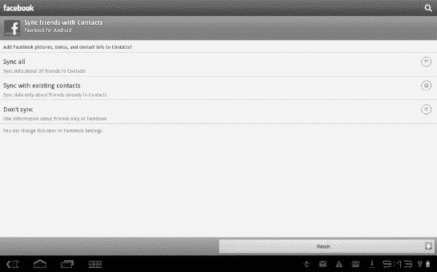

**图 15–1。** *使用脸书的联系人同步*

安卓的**脸书**应用还可以让你读取你的活动流，记录你的位置，发帖；但是到目前为止，它仍然非常有限。它实际上是一个扩展的手机应用程序，而不是一个利用平板电脑的空间和功能的应用程序。

幸运的是，有一个简单的解决方案:不要使用应用程序，而是依赖你的浏览器。和大多数网站一样，你可能需要滚动到页面底部，点击`Desktop`链接来查看脸书网站的完整视图。一旦你这样做了，你将会看到你习惯在全尺寸电脑上使用的大多数相同的功能(见图 15–2)。你也可以试试像 **Friendcaster** 这样的第三方应用。

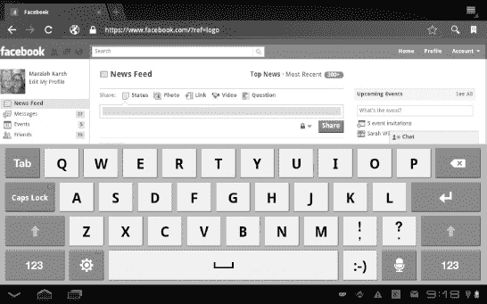

**图 15–2。** *从浏览器使用脸书*

### 推特和微博

Twitter 是一种用于发送短信的流行服务。它始于手机短信，所以 Twitter 消息被限制在不超过 140 个字符。Twitter 是名为*微博、*的不断发展的服务类别的一部分，尽管大多数其他微博已经放弃了 SMS 文本消息的限制，并允许简单文本消息之外的功能。

Twitter 越来越受欢迎，不仅因为它在手机上的易用性，还因为它允许围绕其服务开发大量第三方工具和应用程序。Twitter 购买了其中的一些工具，其他工具仍然是 Twitter 核心产品的热门替代选择。

你为什么会使用 Twitter？短消息对于指出感兴趣的项目，让你的朋友知道你的感受，或者在会议进行时对会议进行评论是非常有用的。Twitter 对商业也有好处。如果你的业务是运输，你可以让乘客知道延误。如果你的业务依赖于天气，你可以让你的客户知道你是否需要取消。您还可以使用 Twitter 来宣传特价商品，宣传您的最新成就，或者通过与客户讨论他们的需求来加深您的客户参与度。或者，你可以听听你的客户或业内同事在说什么。

**注:**推特在美国前众议员安东尼·维纳的失宠中扮演了一个臭名昭著的角色。黄色的推特笑话让喜剧演员吉尔伯特·戈特弗里德失去了他作为 Aflac 鸭之声的角色。

如果这让你有所犹豫，那是应该的。Twitter 的吸引力之一是它的即时性；但与你在公司聚会上的对话不同，这种对话可能是与整个世界的对话。

#### Twitter 的机制和文化

Twitter 由一系列被称为 *tweets* 的小帖子组成。最初，这些推文是不相关的，没有线索的，所以你会看到一系列看起来完全随机的帖子，这些帖子来自你所阅读的所有人，或者是*关注的人。*这给了 Twitter 一个喧闹的派对的感觉。当你在聚会中漫步时，你可以听到一些谈话的片段，但你不能确定谁说了什么。我不是唯一一个做出这种类比的人。有一本关于这个主题的书:*社交媒体是一场鸡尾酒会*，作者是吉姆托宾和丽莎巴西尔(CreateSpace，2008)。

提示:如果你已经是一个 Twitter 用户，接下来的部分将会是一个回顾。请随意跳到本章后面的“选择 Twitter 应用”部分。

#### @回复

Twitter 的许多社交惯例都是围绕它的弱点建立的。所有这些约定都有效地利用了字符，因为 Twitter 上有 140 个字符的限制。为了给你要回复的人加标签，引入了`@reply`(读作“回复时”)的惯例。具体来说，您使用了回复人用户名旁边的`@`符号。这一约定后来被添加到了 Twitter 的界面上，在我测试过的每一款应用中都有。

#### 直接消息

直接消息是两个互相关注的人之间发送的私人消息。例如，`DM@*UserName*`是键入直接消息的约定。在一些应用程序中，这可能更简单，但你永远不应该假设你说的任何事情都是真正的隐私。

#### 转发和修改推文

你也可以使用`RT @UserName`的惯例来重复或者*转发*一个巧妙的帖子。一些人还使用`MT @UserName`来表示一条推文具有相同的概念，但已经从原始版本修改过了——通常被缩短或添加了评论。Twitter 在其界面中内置了一个简单的转发功能，但许多人仍然喜欢使用旧的惯例，这样他们可以添加评论。

#### Hashtags

因为推文没有按主题排序，所以很难按类别搜索。此外，没有办法添加标记或标签，因为你可以与许多长篇博客。标签是解决这个问题的一个很好的方法。Hashtags 由一个散列符号(#)和一个不带空格的标签组成，比如`#tablets`或`#Android`。这创建了一个不太可能的字符组合，可以很容易地进行搜索。标签也用于讽刺性的评论。

#### 网址缩写

网址缩写解决了网站链接的 140 个字符的问题。这些是第三方工具，它们创建一个小 URL，将人们重定向到你希望人们指向的更长的 URL。这些年来，网址缩写本身变得越来越小；因此，许多用户不再使用 TinyURL.com，转而使用 bit.ly 或 ow.ly。一些服务还提供附加价值，比如分析有多少人点击了一个缩短的网址。

注意:使用缩短的网址有一些很好的理由，但是你应该避免在不必要的地方随意使用。任何时候你使用 URL shortener，你就在用户和他或她的目的地之间放置了一个第三方。这项服务可能会中断，甚至倒闭，让用户束手无策。2010 年 Tr.im 就发生过这种情况。

#### 图片服务

Twitter 最初不允许你嵌入图片，但它允许你轻松地将图片链接到。各种与 Twitter 相关的图片服务都为从手机或平板电脑上传图片提供了存储空间和便捷的链接。受欢迎的服务包括 Twitpic 和 Yfrog。这些服务中的许多都内置在你用来发布的应用程序中。

#### 列表

你*关注*或*取消关注*其他 Twitter 用户，以查看(或不查看)他们在你的信息流中的活动。您也可以将它们列出来，这意味着您可以将它们添加到您关注的一组其他用户中，以便按类别进行阅读。

### 平板电脑上的 Twitter 应用

既然我们已经讨论了基本的惯例，让我们开始发微博吧。像脸书一样，Twitter 也有一个官方的 Android 专用应用，功能有限(见图 15–3)。

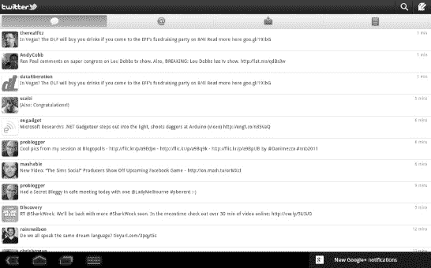

**图 15–3。** *安卓官方推特应用*

Android 的官方 **Twitter** 应用允许你创建推文、`@replies`和直接消息。它还可以让您查看您的流、搜索和查看列表。你可以通过 Twitter 使用平板电脑的浏览器；然而，推特网站也是有限的。此时在平板电脑上体验 Twitter 的最佳方式是探索使用替代应用程序。

### 选择 Twitter 应用

Android 市场充斥着 Android 的 Twitter 应用。这对消费者来说是个好消息，因为这意味着你可以尝试许多应用程序，并决定你最喜欢的功能集。你可能想探索的一件事是，一个给定的应用程序如何利用你平板电脑上的额外空间。目前，除了显示手机版本的更大版本之外，没有多少应用程序能做到这一点。甚至官方的推特应用程序也对此感到内疚。然而，许多第三方替代产品仍然提供你无法从官方应用程序中获得的功能。要寻找的有趣特征包括:

*   **延迟发布:**HootSuite 服务允许你提前安排推文。如果你在推特上推广一项业务或一个博客，并且想要最大化你的影响力，这是很重要的。
*   **多个账户**:大多数第三方 Twitter 应用让你管理不止一个 Twitter 账户，其中很多还允许你管理脸书和其他类型的账户。
*   **交叉发布:**许多 Twitter 应用程序允许你跨多个账户和多种类型的账户发布相同的消息，因此你可以用相同的公告抓住你的脸书和 Twitter 朋友。
*   **提醒:**你可以找到提供增强提醒的应用，例如当你的用户 ID 或特定主题被提及时。

在本节的剩余部分，我们将看看几个流行的 Twitter 应用程序及其特性。

Seesmic 是一款桌面和移动 Twitter 应用。它允许你注册多个脸书、Twitter、Twitter 代理、Saleseforce 和 Google Buzz 账户；然后在它们之间交叉张贴，如图图 15–4 所示。

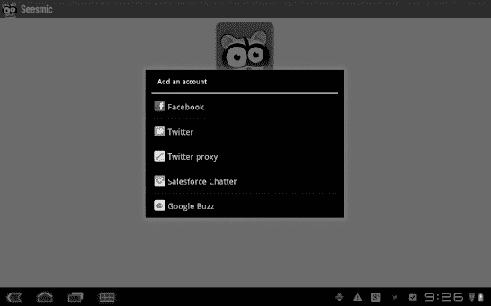

**图 15–4***。安卓系统的 Seesmic 应用*

**Tweetdeck** 既是桌面应用又是移动应用，公司被 Twitter 收购，所以它的功能可能会在某个时候被折叠到官方应用中。 **Tweetdeck** 允许发布到多种类型的账户和简单的图片发布。这款应用的桌面版还具有复杂的搜索功能。

不幸的是，这个应用程序的 Android 版本仍然停留在垂直布局模式。另一方面，如果你用拇指打字，这不是问题。

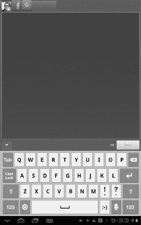

在 Android 平板电脑上访问 Twitter 的所有方式中，我最喜欢的仍然是 HootSuite 服务。这是一项基于网络的服务，所以你只需注册一次账户，但 HootSuite 会记住你所有桌面和移动设备上的所有 id。除了提供向多个 Twitter 账户发帖的能力、内置的 URL 缩短和简单的图片发布，HootSuite 还允许你将推文安排在以后。HootSuite 有免费和付费两种版本。图 15–5 显示了免费版本。

**图 15–5。** *胡特*

其他几个值得研究的应用包括 **Twicca** 、 **Twidroyd** 和 **Tweetcaster** 。

### Yammer

如果你既想要 Twitter 的功能，又想要商业网络的隐私，Yammer 服务两者兼而有之。您可以使用 Yammer 向共享一个电子邮件域的公司成员发送小型、私有、线程化的状态更新。在撰写本文时，Android 的 Yammer 客户端相当乏味；相反，我建议您直接通过浏览器在`[www.yammer.com](http://www.yammer.com)`访问该服务，以获得更好的用户体验。

### 销售力量

Salesforce 是一个受欢迎的 *CRM* (客户关系管理)套件，类似于 Yammer，并融入了社交媒体元素，如其免费的 Chatter 服务。Salesforce 目前没有任何基于平板电脑的客户端，但您可以使用 **Seesmic** 发布到 Salesforce Chatter。

### Google+

Google+是最新推出的社交媒体服务之一。这不是谷歌第一次尝试社交媒体，但目前看来是最有前途的一次。自 2011 年夏季推出以来，Google+发展迅速，谷歌在开发和推广这项新服务方面投入了大量精力。然而，它仍然是一个有限的测试工具，所以在本书出版时，它的许多功能可能会改变。尤其是令人失望的手机应用程序，在撰写本文时仍缺少一些功能。

#### 圈子

脸书是建立在“朋友”的理念上的有些朋友可能比其他人要好，名字暗示着你和那个二十年未见的高中同学可能没有的亲密联系。Twitter 是围绕“关注”的理念建立的，但这并不意味着任何关系。Google+有圈子。你可以添加(最多 5000 人)到任意数量的自定义圈子。当你添加他们时，他们会看到一个提醒，但他们没有义务再添加你。

当你分享信息时，无论是状态更新还是图片，你都可以与你喜欢的任何圈子组合分享。也可以分享给你所有圈子里*公开*的所有人或者是你所有圈子的*延伸圈子*。

#### +1

你可以 *+1* 一个帖子，而不是“喜欢”它。 **+1** 按钮(Android 应用程序中仍然缺少)显示了你的热情，它与脸书的**类似于**按钮。谷歌也在谷歌之外增加了+1 网站的功能。

#### 溪流

您的流显示了您圈子中每个人的所有最新帖子。如果你只想查看某个圈子里的帖子，你必须专门找出那个圈子。

#### 闲逛的地方

视频聊天是实时视频和语音聊天。您邀请来自您的圈子或公众的与会者；在编写时，一次最多可以有十个人参与。目前，视频聊天的最大限制是，除非你使用的是带摄像头的笔记本电脑或台式机，否则你无法参与视频聊天。平板电脑和手机应用程序不允许你在写作时进行视频聊天；然而，我希望这个特性很快会被包括进来。

#### 火花

火花是围绕特定主题的新闻流。您也可以创建自定义火花。Sparks 不包含在 Android 的 **Google+** 应用中，但你可以通过网络查看它们。

#### 密谈

Huddles 是群聊消息。您可以从平板电脑上发送群发消息。

#### 照片

照片分享相当简单，但 Google+希望让它变得更简单。您可以将平板电脑设置为自动将所有照片上传到 Google+中的私人文件夹，但请注意，这可能会很快耗尽 Picasa(照片实际所在的位置)中的空间。上传想要共享的照片后，您可以更改隐私设置，以便与小组或大组成员共享照片。

#### Google+应用程序

图 15–6 显示了 Android 平板电脑的 **Google+** 应用。如你所见，它相当原始。它提供了有限的功能，如查看圈子和你的流，但它不提供火花或 Hangouts。不幸的是，你不能使用你的浏览器来解决这个问题，因为 Hangout 工具需要一个浏览器扩展，而 Android 的**浏览器**应用无法加载该扩展。

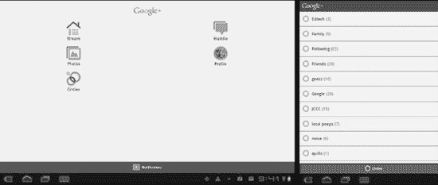

**图 15–6。***Android 上的 Google+应用*

### 领英

LinkedIn 是一个面向专业人士和职业网络的社交网站。您可以发布您的简历和技能，添加专业同事，并发布有关您当前项目的更新。你可能想坚持使用你的网络浏览器来阅读 LinkedIn。你也可以使用官方的 **LinkedIn** 应用，它是针对平板电脑优化的，非常流畅。事实上，这可能是我测试过的所有社交媒体网站应用中最好的“官方”应用。

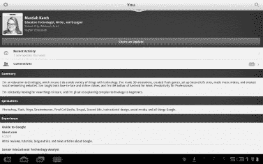

LinkedIn 还有一个很棒的第三方应用，叫做 **DroidIn** (见图 15–7)。

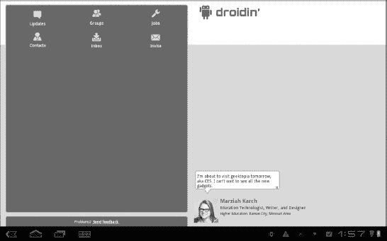

**图 15–7。**??**droid in**app

当你的联系人发布状态更新时，DroidIn 会向你发送通知，你可以使用该应用发布自己的状态更新、查看消息、邀请用户以及监控兴趣小组。

### 文字出版社

Wordpress 是一个非常受欢迎的博客平台。它既可以是你自己服务器上的自托管博客，也可以是 Wordpress.com 的商业网站。Wordpress 提供了一个免费的应用程序，允许你在任何一个地方发表博客。

如果你打算在平板电脑上写很多博客，你可能需要购买一个键盘配件；然而， **Wordpress** 应用程序非常适合编辑快速帖子或直接从平板电脑上传照片。

你可以使用 **Wordpress** 应用程序来管理和发布多个博客。您也可以使用浏览器访问您的博客并向其发帖；然而， **Wordpress** 应用程序提供了一个方便的快捷方式，尤其是在照片发布方面。

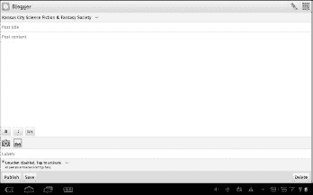

### 博主

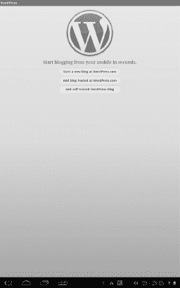

官方的**博客**应用可以让你在你的 blogspot.com 博客上发表文章。这是谷歌的官方博客服务。该应用程序简化了发布和编辑博客的过程；它还简化了上传照片或视频。你也可以将 **Blogger** 用于多个博客，尽管你不能用它同时交叉发布到多个博客。你也不能用它来调整你的博客的偏好和外观设置。这严格来说是一个发帖 app 但是，您可以切换到浏览器，从 Web 上调整您的设置。

### 摇晃

Tumblr 有点像多媒体微博。用 Tumblr 创建的博客被称为 *Tumblogs* 。尽管大多数帖子都很短，但它们不受 Twitter 的 140 个字符限制，并且可以包含大量嵌入媒体。Tumblr 确实是平板电脑帖子的理想格式，因为它利用了平板电脑作为多媒体制作工具的优势，但不需要过多的输入。

Tumblr 为 Android 平板电脑提供了一个官方应用程序(见图 15–8)，也有几个第三方 Tumblr 应用程序可用。

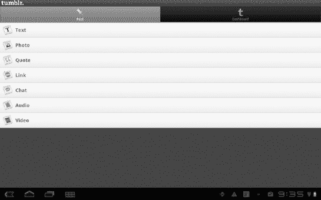

**图 15–8。** *安卓平板电脑的 **Tumblr** 应用*

正如你所看到的， **Tumblr** 应用程序可以让你轻松地从平板电脑上发布文本、图片、电影、录音和链接。方向并没有针对平板电脑进行优化，但这款应用足够轻便，这并不妨碍在你的平板电脑上使用它。点击**仪表盘**按钮，你就可以进入你的博客，在那里你可以阅读你的帖子和评论。