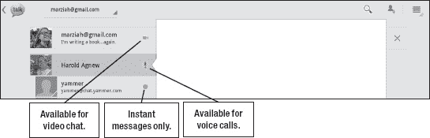
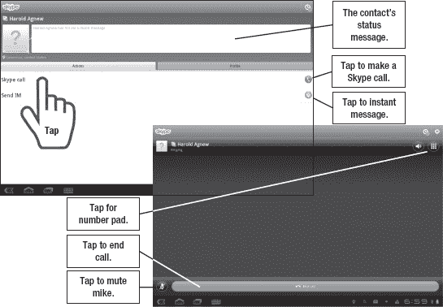

# 十六、视频和语音聊天

有平板电脑不代表不能给人打电话。现代互联网协议语音( *VoIP* )工具提供了在互联网上中继语音呼叫的能力。你甚至可以用平板电脑给使用电话的人打电话。

带有前置摄像头的平板电脑是理想的视频会议工具，越来越多的服务利用移动工具进行视频聊天。你可以使用平板电脑自带的 Gmail 功能，也可以使用第三方工具在任何平台上与用户聊天。在这一章中，我将探索几种使用视频或语音进行实时对话的方法，并为您提供使用两个常用应用程序的分步说明: **Talk** 和 **Skype** 。大多数其他应用程序使用非常相似的步骤来拨打和接听电话。

### 使用 Google Talk 进行视频和语音聊天

**Google Talk** 是蜂巢平板的默认视频聊天应用。你可以用它在各种设备上用谷歌账户给联系人打电话，包括台式电脑、iPads、iPhones 和 Android 手机。蜂巢用户不用下载，也不用注册新账号。当您开始使用平板电脑时，您自动注册了这项谷歌服务。

**注意:** Gmail 提供了一项功能，可以让你直接从网上打电话；然而，该功能目前在该服务的 Android 版本中缺失。

要开始使用此服务聊天，请启动 **Talk** 应用程序。

请注意您的所有联系人都有图标。这些图标表示联系人可以聊天，如 Figure 16–1 所示。

**图 16–1。***Google Talk 中的状态消息*

这些图标使用颜色和形状来快速传达信息。以下是颜色列表及其表示的状态:

*   **绿色**:可用
*   **黄色**:可用但未激活
*   **红色:**忙碌
*   **灰色:**未登录或不可见

图标的形状传达了以下信息:

*   **摄像头:**可视频聊天
*   **麦克风:**可以语音聊天
*   **实心圆:**可即时通讯
*   **时钟:**用户已登录但未激活
*   **X 形状:**用户不可用或不可见

将您的状态设置为**不可见**意味着您已经登录，但是没有人可以看到您可以聊天。如果您需要与某个特定的人聊天，并且希望等到看到他登录时，您可能需要使用这种状态。

#### 设置您的状态信息

除了指示可用性的图标，用户还可以设置状态信息(参见图 16–2)。

**图 16–2***。状态信息*

按照以下步骤设置您的状态消息:

1.  启动 **Google Talk** 应用。
2.  在联系人列表中点击您自己的名字。
3.  点击您姓名旁的**铅笔**图标，更改您的状态信息。
4.  键入新的状态消息。

或者，您可以点击**更改为最近使用的状态。**您将看到一个快速切换的最新状态信息列表。

提示:你可以给自己一个简单的快捷方式列表，用你经常使用的东西快速改变几次你的状态信息。典型的状态信息可能包括:“我只能接听与业务相关的电话”或“如果我没有立即回复，请留言。”

#### 使用 Google Talk 进行视频通话

按照以下步骤进行视频通话:

1.  点击**通话**图标。
2.  找到一个要呼叫的联系人——如果她在联系人列表中的名字旁边有一个绿色的**摄像头**图标，那么她可以进行视频聊天。
3.  点击屏幕右侧的**摄像头**图标。
4.  等对方的人回答，确认她要视频聊天。

一旦你们都连接上了，你会看到对方的图像占据了屏幕的大部分，还有你自己图像的一个小预览(见 Figure 16–3)。

**图 16–3***。通过 Google Talk 进行视频聊天*

#### 使用 Google Talk 进行语音通话

您可以使用与拨打视频电话几乎完全相同的步骤向其他登录的 Google Talk 用户拨打 VoIP 电话。然而，你还不能通过 **Google Talk** 应用程序拨打外线电话。按照以下步骤进行语音通话:

1.  点击**通话**图标。
2.  找一个联系人打电话。如果他的名字旁边有绿色的**摄像头**或**麦克风**图标，他就可以进行语音通话。
3.  点击屏幕右侧的**麦克风**图标。
4.  等对方的人接，确认他要接你的电话。

### 用 Skype 打电话

您可以用平板电脑上的 **Skype** 应用程序打电话。与世界任何地方的其他 Skype 用户通话都是免费的。

**注意:**一些电话运营商向使用 Skype 的用户收取额外费用，或者干脆屏蔽这项服务。

Skype 服务适用于电脑和许多移动设备，包括 iPhones、Android 手机、黑莓智能手机和其他移动设备。向手机和座机发送电话和短信会收取费用，但费率是合理的。

撰写本文时，Skype 正处于被微软收购的过程中；然而，Skype 官员表示，该公司计划继续在 Android 和其他设备上支持 Skype。

**注:** Skype 也在推出视频聊天功能。然而，在撰写本文时，这些功能仅在少数设备上可用。最初的 Galaxy Tabs 可以使用视频聊天，但搭载 Tegra 2 处理器的平板电脑——这包括几乎所有的蜂巢平板电脑——被明确排除在外。

要开始使用 Skype，您需要在`market.android.com/details?id=com.skype.raider`从 Android Market 下载该应用程序。

#### 在您的平板电脑上创建 Skype 帐户

如果您需要设置您的 Skype 帐户，但尚未在您的电脑上设置，请按照以下步骤在您的平板电脑上设置 **Skype** :

1.  点击应用程序图标启动 Skype。
2.  点击**创建账户**按钮。
3.  输入所需信息，包括您的姓名、电子邮件、所需用户名和密码。输入您的电话号码是可选的。
4.  选择是否接收 Skype 新闻和优惠。
5.  点击下一个按钮**创建您的帐户。**
6.  如果需要，可将您的通讯录与平板电脑上现有的通讯录同步。

#### 登录 Skype 应用程序

创建帐户后，您就可以在平板电脑上登录 Skype 了。请按照以下步骤操作:

1.  如果您尚未登录 Skype，请在您的**主页**屏幕上点击 **Skype** 图标。
2.  输入您的 Skype 用户名和密码。
3.  点击按钮中的**符号。**
4.  登录后，您可能还想点击屏幕底部的**菜单**按钮。
5.  点击**设置**。
6.  勾选标记为**的框，自动登录。**

您应该不必再次输入此登录信息；它保存在 **Skype** 应用程序中。下次你点击 **Skype** ，它会自动帮你登录。

#### 添加联系人

如果您正在将通讯录与地址簿同步，您可能已经看到了一些通讯录；不过，你可能还是想多加几个。请按照以下步骤操作:

1.  点击**触点**按钮。
2.  点击**菜单**按钮。
3.  轻触**添加联系人**。
4.  轻触**搜索 Skype 目录**，然后输入某人的姓名或 Skype 用户名。
5.  点击**放大镜**按钮找到该人。
6.  看到您想要添加的人后，轻按其姓名。
7.  轻触**添加联系人**。
8.  一旦此人接受您为联系人，您将会看到他在您的**所有联系人**屏幕中被列为联系人。

**提示:**有时你想摆脱一个**的 Skype 联系人**。您可以通过点击联系人列表中的姓名来删除或阻止联系人。按下菜单**按钮** **并选择**移除**或**块。

#### 用平板电脑上的 Skype 拨打电话

到目前为止，您已经创建了帐户并添加了联系人。现在，您终于可以用平板电脑上的 **Skype** 拨打第一个电话了:

1.  如果您尚未登录到 **Skype** 服务，请在您的**主页**屏幕上点击 **Skype** 图标，然后登录。
2.  点击**触点**按钮。
3.  点击您希望呼叫的联系人姓名。
4.  轻触 **Skype** **通话**按钮。
5.  您可能会看到一个 **Skype** 选项和一个**手机**或其他电话选项。轻触 **Skype** 拨打免费电话。拨打任何其他电话都需要您用 *Skype 点数*支付费用。
6.  等待另一端的人接通。

**图 16–4。** *在平板电脑上用 Skype 拨打电话*

**注:**您可以使用平板电脑上的 **Skype Out** 免费拨打免费电话。以下通知来自 Skype 网站的`[www.skype.com](http://www.skype.com)`:

“支持以下国家和号码范围，所有用户均可免费使用。我们在世界的其他地方工作。法国:+33 800、+33 805、+33 809 波兰:+48 800 英国:+44 500、+44 800、+44 808 美国:+1 800、+1 866、+1 877、+1 888 台湾:+886 80 "

#### 用平板电脑上的 Skype 接听电话

您可以让 **Skype** 在后台运行，并且在 Skype 来电时仍能接听。

**提示:**并不是每个人都能登录她的 Skype 帐户。如果您想给使用 Skype 的熟人打电话，只需给她发一封简短的电子邮件，让她知道您想用 Skype 给她打电话。

##### 购买 Skype 点数或包月套餐

*Skype 至 Skype* 通话免费。但是，如果您想通过 **Skype** 应用程序拨打人们的座机或手机，您需要购买 Skype 点数或购买包月套餐。如果您试图从 **Skype** 应用程序购买点数或套餐，它会将您带到 Skype 网站。

**提示:**在注册套餐之前，您可以先用一定数量的 Skype 点数来试用这项服务。如果您打算使用 **Skype** 应用程序给许多不使用 Skype 的人(即使用普通座机和手机的人)打电话，那么订购计划是一个不错的选择。

#### 用 Skype 聊天

除了打电话，您还可以通过平板电脑与其他 Skype 用户进行文字聊天。开始聊天与开始通话非常相似；请按照以下步骤操作:

1.  如果您尚未登录 Skype，请在您的**主页**屏幕上点击 **Skype** 图标，然后登录。
2.  点击**触点**按钮。
3.  点击联系人的姓名。
4.  tap〔??〕发送 IM。
5.  键入您的聊天文本，然后按下**发送**按钮。您的聊天内容将出现在屏幕顶部。

#### 将 Skype 添加到您的电脑

您也可以在电脑上使用 **Skype** 应用程序。如果你还连接了网络摄像头，你还可以使用 **Skype** 应用程序在电脑上进行视频通话。

**注意:**当您从电脑向平板电脑拨打电话时，您将无法进行视频通话，除非该服务已添加至平板电脑。

要创建 Skype 帐户并为您的电脑下载 **Skype** 软件，请转到`[www.skype.com](http://www.skype.com)`并按照下载说明进行操作。

### 弗林

Fring 是另一项免费的 VoIP 和视频通话服务，提供语音和视频通话功能。虽然这项服务可能不如 Skype 受欢迎，但它确实提供从 Android 平板电脑进行视频通话的功能。 **Fring** 应用还提供群组视频聊天，这是一个非常好的功能，只有少数视频聊天服务提供。 **Fring** app 的界面简洁俏皮，如右图和图 16–5 所示。

**图 16–5。** *在 Fring 接受视频通话*

### 千奇

Qik——读作“quick”——是一项视频聊天服务，被 Skype 收购。要使用 Qik，您必须有一个单独的 Qik 帐户(不仅仅是一个 Skype 帐户)和一台兼容的设备。目前，Qik 可以在摩托罗拉 Xooms 上运行，但不能在 Galaxy Tab 10.1 上运行。

在 **Qik** 应用中的视频聊天类似于你在 **Google Talk** 和 **Fring** 应用中看到的；但是，它目前不提供任何多用户视频聊天。

### 飞行

另一个免费的视频和语音聊天服务是*ooVoo*??。目前， **ooVoo** 应用只能在极少数平板电脑上运行。兼容设备包括戴尔 Streak、摩托罗拉 Xoom 和原装 Galaxy Tab 但是，您可以使用该服务与最多六位参与者进行群组视频通话。您还可以进行一对一的视频通话和用户对用户的语音通话。您可以在`[`www.facebook.com/oovoo`](http://www.facebook.com/oovoo)`的公司脸书页面找到更多关于该服务的信息

.

### 探戈

Tango 应用程序兼容大多数平板电脑和安卓手机。PC 版还没有上市，但是它的开发者说很快就会上市。像大多数服务一样，Tango 要求所有用户都有一个 Tango 账户。下载 **Tango** 后即可注册账号，如图图 16–6 所示。

**图 16–6。** *注册新的 Tango 账号*

Tango 的一个很好的特点是你可以在通话过程中从语音通话转换到视频通话。大多数其他应用程序要求你在打电话之前指定电话的类型，并且只使用那种类型的电话。你可以通过访问公司网站`[www.tango.me](http://www.tango.me)`获得更多关于 Tango 的信息。