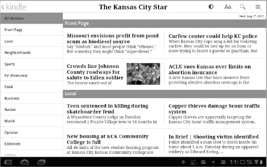
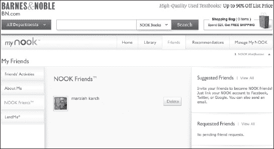

# 十七、阅读电子书、报纸和杂志

平板电脑是绝佳的电子书阅读器。一些平板电脑，如 Nook Color，主要是电子阅读器，也运行应用程序。你可以在一个比一本书还小的设备中携带整个图书馆；与专门的电子阅读器不同，你不会被束缚在一个商店或应用程序上阅读。有这么多的阅读应用程序，我不可能在这本书里全部涵盖。相反，我将介绍一些最流行的阅读书籍、报纸和杂志的应用程序。

### 格式

电子书有多种格式，但有几种主要类型你最有可能看到。亚马逊 Kindle 的书通常是`.mobi`或者`.azw`格式(`.azw`是基于`.mobi`格式)。其他大多数读者使用 ePUB 或 Adobe PDF 格式(`.pdf`)。所有这些图书格式都可以通过 DRM*数字版权管理*锁定，DRM 旨在防止未经授权的图书复制。

### 谷歌图书

蜂巢和冰淇淋三明治平板电脑内置了谷歌图书。你可以把它想象成苹果 iBook 格式的谷歌版。您可以通过您的 Google Checkout 帐户购买 Google Books，使用与您购买应用程序相同的 Android Market。

谷歌图书是几样东西。这是一个网站，让你搜索一个巨大的扫描图书图书馆。在这个网站上，你可以购买书籍并创建自己的公共档案，分享你正在阅读的书籍列表和对你读过的书籍的评论。**谷歌图书**也是一款应用，这款应用的安卓版本接入了谷歌图书网站的一部分，但不是全部。

从你的**主页**屏幕或应用托盘点击图标，启动**谷歌图书**应用。您的视图将取决于您上次离开应用程序的方式。如果你在读一本书，你会回到那本书。否则，你会看到图书馆。谷歌图书将你的图书显示为大的**图书**图标，呈曲线排列。如 Figure 17–1 所示，从左向右滑动手指浏览图书馆中的书籍。

**图 17–1。** *在谷歌图书图书馆导航*

轻按一本书以开始阅读。你可以随心所欲地开始阅读多本书，谷歌图书会跟踪你在所有书中的进度。当你垂直拿着平板电脑时，谷歌图书中的书籍会显示为单页，当你水平拿着平板电脑时，会显示为双页。您可以通过滑动手指或按下**音量增大**或**音量减小**按钮来翻页。图 17–2 显示了看书的界面。

**注意**:轻点平板电脑底部的**返回**按钮，返回某个 app 的主菜单，这可能是一种习惯；然而，这通常在电子阅读应用程序中不起作用，你最终会退出程序。对于电子书阅读器来说，**图书馆**按钮通常位于屏幕顶部。

**图 17–2。** *阅读谷歌图书*

#### 调整阅读选项

如图 17–2 所示，您可以点击屏幕顶部的 **Aa** 按钮来调整您的阅读选项。如你所见，有很多选择(见图 17–3)。

**图 17–3***谷歌图书的阅读选项*

第一个选项，**显示，**可用于一些较老的书籍。谷歌最初从图书馆扫描书籍，并使用软件将图像转换成文本。这允许您查看更容易阅读的电子文本或原始扫描图像。如果段落出现乱码，请使用此选项；但是，请注意，包含此选项会导致图书需要更长的下载时间。

其他选项— **亮度**、**文本设置**和**行高—** 稍微简单一些。调整您的设置并点击**完成**按钮。

#### 线下看书

Google Books 是一款基于云的阅读应用。默认情况下，您的图书存储在网上，这意味着您可以在任何可以访问兼容网络浏览器的地方阅读它们。然而，这也意味着你依赖于互联网连接。幸运的是，你可以在本地复制你的谷歌图书；请按照以下步骤操作:

1.  在 **Google Books** 应用程序中打开您想要制作本地副本的图书。
2.  点击屏幕右上角的**菜单**按钮。
3.  点击勾选标记为**的框，使其可离线使用。**

#### 购买或下载谷歌图书

你可以通过点击**谷歌图书**应用内的**商店**按钮或者通过安卓市场购买谷歌图书。按照以下步骤从 Android Market 购买 Google Book:

1.  从**主页**屏幕或应用托盘启动**安卓市场**应用。
2.  点击**书籍**标签(参见图 17–4)。

**图 17–4。** *购买谷歌图书*

可以按类别浏览书籍；**类别**部分位于屏幕右侧。精选商品显示在顶部，您可以浏览**新品**、**畅销**、**顶级**，向下滚动到底部查看**顶级免费**书籍。你也可以使用屏幕顶部的**搜索**按钮，按标题、主题或作者查找书籍。

找到您想要购买或下载的书籍后，轻按标题；您将看到一个类似于图 17–5 所示的页面。

**图 17–5。**??**详情**谷歌图书页面

谷歌图书的**细节**页面看起来与你下载应用程序时看到的非常相似。您将看到相同作者的书籍、相似书名的建议以及对该书的评论。在这种情况下，评论来自谷歌图书网站、大众点评或 Goodreads.com**。**目前，还没有办法在安卓平板电脑的阅读器中阅读一本书。

**提示:Goodreads** ( `[www.goodreads.com](http://www.goodreads.com)`)提供了一款安卓应用，你可以用它在平板电脑上分享评论和阅读推荐。它甚至有一个内置的条形码扫描仪，你可以用它来清点你的实体图书馆。

如果你想购买一本书，你可以点击**购买**按钮。您的购买将通过 Google Checkout 完成。不过，你也可以在买书之前先试一试；为此，按下**购买**按钮正下方的**免费样品**按钮。现在大多数电子书商店都会给你一些方法，让你在决定购买前先阅读一本书的开头。

一旦你购买或试用了免费样品，你就可以马上开始阅读你的书。如果您打算在远离数据连接的地方阅读这本书，请记得启用离线阅读。

**提示:**谷歌图书附带了一个小工具，你可以把它放在你的**主页**屏幕上，让你快速翻阅和打开你最喜欢的书籍。

#### 谷歌图书网站

你可以用你的**浏览器**应用打开并阅读谷歌图书。你也可以使用你的**浏览器**应用程序，通过进入`[`books.google.com`](http://books.google.com)`来搜索你不拥有的书籍。谷歌的数据库中有一个庞大的扫描图书库。你甚至可以在书中找到段落；你在一本书里看到的文本数量取决于谷歌与出版商的协议，以及这本书是否仍受版权保护。

### Kindle 阅读器

亚马逊 Kindle 是市场上最受欢迎的电子阅读器，你可以在 Android 平板电脑上享受阅读 Kindle 书籍的乐趣。你可以在一台设备上开始阅读，然后在你的 Android 平板电脑上继续阅读，就在你离开的地方。亚马逊称这个过程为 *Whispersync* 。你甚至不必拥有一个 Kindle 来使用这个阅读器。Kindle 商店销售的不仅仅是书籍；你也可以从 Kindle 商店订购杂志、报纸和漫画书。

阅读 Kindle 书籍的一个缺点是，它们目前使用亚马逊独有的格式。不幸的是，他们不支持更标准的 ePUB 格式，这使得从其他卖家那里购买书籍并在你的 **Kindle** 应用中阅读变得很困难。也就是说，在你的 Kindle 应用上阅读 ePUB 格式的书籍并非不可能；我们将在本章后面的“将书籍从一种格式转换为另一种格式**”**部分中介绍如何使用 **Calibre** 应用程序来完成这一任务。

Kindle 商店使用你的亚马逊账户；在你的安卓系统上，你可以从 Kindle 应用程序本身购买书籍。当你启动 **Kindle** 应用并使用你的亚马逊账户注册时，你会看到一个类似于图 17–6 的**书架**视图。

**图 17–6***。 **Kindle** 应用的**书架**视图*

如果您已经有一个 Kindle 图书资料库，它们不会自动下载到您的设备上。您可能不会全部阅读，所以这样做是为了节省空间。但是，您可以轻按任何归档的图书，将其下载到您的平板电脑上。轻按下载的图书以开始阅读。

#### 阅读 Kindle 书籍

与**谷歌图书**阅读器不同， **Kindle** 阅读器不会在你水平倾斜平板电脑时显示两页布局。相反，它会显示一个更宽的页面。此外， **Kindle** 阅读器不会像传统书籍那样思考书籍的“页面”;但是，它会记录您最后一次阅读的位置。只要你有一个数据连接来保持你的书籍同步，你就可以从你上次停止阅读的地方拿起一本书。

**注:** Kindle 书籍没有传统页面。你在书中的位置通过字数来记录。你需要 Kindle 的同类产品，以便在别人按页码引用的书中找到一个位置。

#### 查找单词

如果你想查找一个单词，只需长按该单词，就会出现字典定义。然而，第一次这样做时，会提示您下载字典，如图 Figure 17–7 所示。一旦你的字典被下载，它将与你的任何一本书一起工作。

**图 17–7***。下载字典*

你会注意到除了字典还有更多选择。例如，你可以点击右上角的`Wikipedia`或`Google`链接，使用平板电脑的**浏览器**应用在网上查找单词或短语。

#### 保存书签和做笔记

Kindle 阅读器会自动同步你的当前位置，但你可能会想为书中的某个特定段落添加书签。请按照以下步骤操作:

1.  点击页面中间或长按特定单词。
2.  点击屏幕右上角出现的**书签**图标。
3.  **书签**图标将变为蓝色，表示您已将该部分加入书签。

您可以遵循相同的步骤，然后点击**高亮显示**来高亮显示文本中的单词。记笔记的过程是相似的。笔记和书签实际上是在线存储的。按照以下步骤突出显示文本:

1.  长按出版物中的单词。
2.  轻按屏幕顶部的**笔记**来做文本笔记。
3.  键入您的注释，然后按**保存。**

按照以下步骤导航到以前保存的笔记或书签:

1.  轻按页面中央。
2.  点击屏幕右上角的**菜单**按钮。
3.  轻触**查看我的笔记&标记**。
4.  点击**书签**或**笔记**图标，查看书签或笔记并导航至该位置。

#### 调整您的 Kindle 阅读选项

如果你发现 Kindle 上的“print”太小，你可以调整字体大小。您还可以调整屏幕亮度。点击屏幕一次，然后点击屏幕上方的**字体**或**对比度**按钮，如图图 17–8 所示。

**图 17–8***调整字体大小*

#### 购买 Kindle 商品

只要您连接到互联网，就可以通过 **Kindle** 应用程序购买 Kindle 图书。如果你正在查看**书架**视图，点击屏幕顶部的 **Kindle 商店**按钮，查看亚马逊 Kindle 商店中的商品。如果你正在阅读一本书，请按照以下步骤去书店:

1.  轻按屏幕中间。
2.  点击**菜单**按钮。
3.  选择**在 Kindle 商店**购物。

您可以按类别浏览，按作者或关键字搜索，或按类型查找出版物。亚马逊为 Kindle 销售书籍、杂志、漫画书和报纸。找到一件商品后，您可以点击它来查看描述、详细信息和客户评论，如图 Figure 17–9 所示。

**图 17–9。** *亚马逊 Kindle 商店里的一本书*

如果你想买这本书，点击**购买**按钮。或者你可以点击**试读样本**按钮来下载这本书的预览，这样你就可以决定是否要购买它。一旦你点击**购买**，你就可以通过你的亚马逊账户处理你的付款，你的书就会下载到你的设备上。

您还可以通过 Amazon.com 网站浏览商品，并将其发送到您的平板电脑或任何其他设备上。

提示:当你下载一个样本，然后再购买这本书时，你最终会得到这本书的两个不同版本。请务必在页面底部注明您在示例版本中的位置，这样您就可以直接导航到您购买的图书版本中的编号。按照以下步骤跳到您在图书中的当前位置:

1.  点击屏幕右上角的**菜单**按钮。
2.  点击**转到。**
3.  选择**位置**。
4.  键入数字位置。

#### 购买杂志或报纸

你用同样的过程从亚马逊购买报纸和杂志。关键的区别在于，你可以购买一期或一份订阅。图 17–10 显示了该过程。Kindle 商店中列出了个人和订阅价格。订阅费用是经常性的，通常是每月一次。当您订阅报纸或杂志时，只要您在无线覆盖范围内，就会自动收到最新的数字版本。如果您想取消订阅，请使用您平板电脑的**浏览器**应用程序或任何其他连接到互联网的计算机在线进入`[www.amazon.com/manageyourkindlesubscriptions](http://www.amazon.com/manageyourkindlesubscriptions)`。

**图 17–10***。订阅杂志*

Kindle 报纸是什么样的？它比传统报纸更容易管理。没有褶皱，手也不会被墨水弄脏。你也可以直接导航到你感兴趣的内容区域，Kindle 报纸不像报纸网站那样充斥着跳跃的广告。图 17–11 显示了一期《堪萨斯城星报》的样本。

**图 17–11。**??【堪萨斯城星报】Kindle 版

Kindle 杂志和期刊的外观和感觉与 Kindle 报纸相似。

#### 谢尔法里

如果你想和其他 Kindle 阅读器交流，你可以使用亚马逊的社交网站，*谢尔法里* ( `[www.shelfari.com](http://www.shelfari.com)`)。如果你在这个网站上创建了一个个人资料，你可以导入你在亚马逊购买的内容，显示你当前的阅读活动，给书籍评分，甚至分享你在平板电脑上阅读的 Kindle 书籍上保存的笔记和书签。

按照以下步骤查看 Shelfari 信息(参见图 17–12):

1.  启动 Kindle 应用程序。
2.  转到您的**书架**视图。
3.  长按一本书。
4.  点击 **Shelfari book extras。**

**图 17–12。**查看谢尔法里信息

不是每本书都有 Shelfari extras，但大多数都有。你会注意到每个 Shelfari 条目都是一个 *wiki。*任何用户都可以编辑信息。例如，您可以编辑和共享有关人物、情节、评论等的信息。所有的编辑和添加都是公开可见的。

#### 侧装 Kindle 图书

如果你有一本想在平板电脑上用 **Kindle** 应用阅读的书，你可以通过*侧装*它来实现:

**注意:**书籍必须是`.mobi`格式才能侧装。

1.  使用 USB 电缆或类似 **ES 文件浏览器的应用程序将平板电脑的 SD 卡安装到电脑上。**
2.  打开你卡上的 **Kindle** 文件夹。
3.  把你的`.mobi`文件放在这个文件夹里。

### 巴尼斯&诺布尔角

虽然亚马逊 Kindle 是最受欢迎的电子书阅读器，但 Nook 紧随其后。Nook 应用程序还有一个明显的优势，那就是它首先是一个 Android 应用程序。Nook 电子阅读器实际上是经过修改的 Android 平板电脑，Nook Color 甚至可以运行应用程序。

你不需要 Nook 颜色来阅读 Nook 书籍、杂志和报纸。可以从安卓市场下载**Nook**app；因为它支持 ePUB 格式，你可以用它来下载你直接从图书出版商网站下载的图书。

Nook 图书是通过 Barnes & Noble Nook 商店购买的，如左图所示。可以在`[www.barnesandnoble.com](http://www.barnesandnoble.com)`注册账号。您需要提供信用卡信息，以便通过商店购买图书；然而，一旦你注册了一个账户，你就可以通过平板电脑上的 **Nook** 应用程序直接购买书籍。

**Nook** app 的**库**视图如图图 17–13 所示。

**图 17–13。***Nook 应用的库视图*

**注:****Nook**应用是少数几个使用底部**返回**按钮导航回**图书馆**视图的电子阅读器之一。

#### 阅读 Nook 书籍

在 Nook 的**图书馆**视图中点击一本书将其打开。你会立即看到屏幕下方的**设置**菜单，如图图 17–14 所示。您可以使用**设置**菜单进行导航，调整字体大小和屏幕对比度，或者查看图书的**详细信息**页面。如果您不想调整任何设置，则什么也不做或轻按图书中心。这将导致屏幕在几秒钟内褪色。

**图 17–14。** *看一本 Nook 书*

#### 保存书签、记笔记、查单词

你可以在 Nook books 上保存书签和笔记，就像在 Kindle books 上一样。您可以通过点击页面的右上角来为页面添加书签；这是一个视觉隐喻，表示弯下书的一角来标记一页。

也可以保存笔记；突出显示选择；通过长按单词或短语，然后选择适当的选项来查找单词(参见 Figure 17–15)。

**图 17–15。** *在 Nook 上处理书籍文本*

按照以下步骤查看您的笔记(参见图 17–16):

1.  打开一本 Nook 书。
2.  点击**详情**按钮。
3.  轻触**笔记**、**高亮、**、**书签**标签页。

**图 17–16。***Nook 应用的详情页面*

#### 借阅书籍

您可以使用 LendMe 选项将大多数 Nook 图书借给其他用户两周。为了使用这个选项，你需要在 Barnes & Noble 网站上注册，并使用**管理我的 Nook** 区域添加好友，如图图 17–17 所示。一旦您的朋友确认，您和您的联系人都可以选择互相借出可以在对方的平板电脑上阅读的书籍。

**图 17–17。***Barnes&Noble 网站上的 Nook Friends 专区*

关于 LendMe 选项，有几件事需要记住:

*   您的图书馆中只有标有 LendMe 标志的图书才有资格外借。
*   一本书只能借一次。
*   这本书被借走的时候，你不能自己看。
*   借出的书将在 14 天内归还原主。

一旦你注册了一个帐户，并确认了与其他 Barnes & Noble 客户的友谊，你就可以在平板电脑上使用 LendMe 选项，方法是长按图书馆中任何符合条件的书籍，然后选择 **LendMe** 。

#### 侧装 Nook 书

如果你有一本不是通过 Barnes & Noble 购买的 ePUB 图书，你仍然可以通过下载文件来使用 Nook 应用阅读它:

1.  使用 USB 电缆或类似于 **ES 文件浏览器**的应用程序将平板电脑的 SD 卡安装到电脑上。
2.  打开你卡上的 Nook 文件夹。
3.  打开“我的文档”文件夹。
4.  将您的 ePUB 文件放在此文件夹中。

你的书会被列为“我的文档”而不是图书馆里的书；然而，你可以像读其他书一样阅读它们。您侧装的图书不能与 LendMe 选项一起使用。

### Kobo

Kobo 是一个在线电子书商店。它为主要的计算机和移动平台提供专用的电子墨水阅读器和应用程序。你可以将你的 Kobo 帐户连接到脸书，与其他 Kobo 用户分享你所阅读的内容，而无需注册单独的社交阅读网站。在我试过的所有应用中，Android 版的 **Kobo** 应用提供了最简单的导入第三方 ePUB 图书的界面。

**注:** Borders 是 Kobo 的早期投资人之一；然而，它持有少数股份，因此尽管 Borders 陷入财务困境，Kobo 商店仍然继续经营。在 Borders 破产后，Borders 的客户能够将他们的电子书库转移到 Kobo。

您可以在`[www.kobobooks.com](http://www.kobobooks.com)`在线注册 Kobo 账户。你不需要提供信用卡信息来下载免费书籍。 **Kobo** app 的**我正在阅读**图书馆使用**书架**隐喻视图来展示你的书籍，如图图 17–18 所示。您可以通过使用屏幕底部的**菜单**按钮将其更改为**列表**视图。

**图 17–18***Kobo app 的书架视图*

与 **Kindle** 和 **Nook** 应用程序不同， **Kobo** 应用程序不会根据出版物类型(例如，书籍、杂志和报纸)来区分项目。**发现**和**浏览**按钮都可以进入 Kobo 书店，并允许您使用 Kobo 帐户查找和购买应用程序。

#### 阅读生活

Kobo 阅读器包括社交和游戏两个方面。当你阅读时，你偶尔会被授予徽章，比如拥有同一作者的五本书的狂热徽章。如果你在你的**图书馆**视图中点击**阅读生活**按钮，你会首先看到你的通知，然后你会看到你目前已经获得的徽章(见图 17–19)。您尚未获得的徽章是灰色的。

**图 17–19***读取生命徽章*

点击 **STATS** 按钮查看您的阅读进度；你会看到你读了多长时间，读了多少页。

请注意，您的统计数据仅适用于您最近打开的图书。

轻按图书馆中的一本书以开始阅读。与 Kindle 应用程序一样，当你水平拿着平板电脑时， **Kobo** 阅读器不提供两页的书籍视图。和 **Nook** 应用一样， **Kobo** 应用会在你按下屏幕左下角的**返回**按钮时将你送回**库**视图。

要调整 **Kobo** app 的设置，点击屏幕左下角的**菜单**按钮，如图图 17–20 所示。

**图 17–20***。调整 Kobo 应用程序中的设置*

#### 突出显示文本并添加注释

不幸的是， **Kobo** 阅读器有一个更复杂的添加注释或高亮文本的程序。另一方面，它也是查看您所做笔记的一种更好的方式:

1.  点击屏幕底部的**菜单**按钮。
2.  点击**选择文本**。
3.  屏幕会变成黄色，你会看到一个选择区域。扩展此区域以包含您的文本。点击**高亮显示**或**添加注释**。
4.  最后，如果你想给脸书留言，点击**分享**。

一旦你做了笔记，你选择的文本将被高亮显示，你会在你做笔记的页面的屏幕右下角看到一个**笔记**图标。点击图标，你会看到你的笔记。您也可以点击**分享**来分享您的笔记给脸书。

#### 导入图书

如果你有想要阅读的第三方 ePUB 书籍，你所要做的就是把它们保存到你的平板电脑上。有人可以通过电子邮件把它们发给你，或者你可以从你的**浏览器**应用程序的网站上下载它们。没关系，只要你平板上有书就行。按照以下步骤将 ePub 图书导入到您的 **Kobo** 阅读器中(参见图 17–21):

1.  从**库**视图开始，点击屏幕底部的**菜单**按钮。
2.  轻触**导入内容。**
3.  将出现一个对话框。点击**开始**开始。
4.  Kobo 应用程序会在你的存储卡上搜索 ePUB 书籍。
5.  您将看到找到的所有新书的列表。在列表中您要导入的每本书旁边的复选框中做出标记；同样，确保您不想导入的图书在复选框中没有标记。
6.  点击**导入所选内容。**
7.  决定是否要将图书的副本留在原来的位置，或者删除它们以节省空间。

**图 17–21。** *将图书导入 Kobo 阅读器*

### 阅读 PDF 书籍

我们已经介绍了 Android 平板电脑上最流行的电子书阅读应用，但目前这些应用都不支持导入 PDF 书籍。他们只支持阅读你通过读者书店购买的 PDF 书籍。pdf 易于制作，是分发文件的流行格式。如果你想阅读 Adobe PDF 文件，你可以使用 **Adobe PDF Reader** 应用程序，或者你可以使用第三方电子书阅读应用程序，如 **Aldiko。**

### 将书籍从一种格式转换成另一种格式

如果你有一份《莫比·迪克》的 ePUB 版本(或者其他没有数字版权管理的书)，并且你更喜欢在你的 Kindle 上阅读，那么你可以在你的 Macintosh、Linux 或 Windows 电脑上使用免费的 **Calibre** 应用程序来阅读(见图 17–22)。

**图 17–22***。Calibre 应用程序中的图书馆管理*

**Calibre** 可以将很多格式转换成其他格式，比如`.PDF`到`.Mobi`或者`.Mobi`到 ePUB。你还可以用它来管理 **Calibre** 和 **Books WordPlayer** 应用之间的无线同步。不幸的是， **WordPlayer** 阅读器还不是为平板电脑设计的，所以它主要是作为将书籍导入另一个阅读应用程序之前的一个中间步骤。