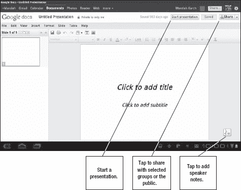

# 十八、记录笔记和处理文档

还记得没有人带着沉重的笔记本电脑去开会吗？你可以再次体验那种自由。使用平板电脑而不是智能手机的原因之一是因为它更容易处理文档。你可能想在商务会议上做笔记，编辑一个**微软 Office** 文件，甚至写一份新文档——你可以用你的安卓平板电脑完成所有这些。本章将探讨笔记、文档编辑和其他有助于提高生产力的宝贵技能。

### 谷歌文档

共享文档最明显的方式之一就是使用谷歌文档。您可以使用您的 Google 帐户登录`[`docs.google.com`](http://docs.google.com)`。谷歌文档可以用来上传微软 Office 文件以及 **OpenOffice** 、 **Adobe PDF** 、图像和其他文件。您还可以创建原始文本文档、电子表格、绘图和幻灯片演示。您可以与他人分享这些演示文稿。

要在平板电脑上开始使用谷歌文档，你应该从安卓市场下载**谷歌文档**应用。你可以只使用平板电脑的浏览器，但从电脑上运行应用程序会更容易一些。在任何情况下，您都需要连接到互联网才能打开和修改文件。当你启动 **谷歌文档**应用时，你会看到一个简单的屏幕，允许你按类型查看项目。收藏是你储存在文件夹中的项目。

**提示:**如果您想要与群组共享多个文档，您可以允许共享一个文件夹并将项目添加到该文件夹，而不是更改单个文件的共享偏好设置。

轻触**更多**按钮获得更多选项，包括创建新文本文档的功能。如果您点击**所有项目**按钮，您将看到您当前文档的列表，按上次修改日期排序。不同的项目有不同的图标，如图 Figure 18–1 所示。

**图 18–1***。谷歌文档应用中的列表视图*

谷歌文档应用程序允许你创建和上传文本文档、电子表格、幻灯片演示、图像、PDF 文件、图纸和其他类型的文件。可以在应用程序中编辑文本文档、电子表格、幻灯片和绘图。

按照以下步骤在**谷歌文档**应用中编辑文档:

1.  启动**谷歌文档**应用。
2.  点击**所有项目**或导航至所需文件。
3.  点击文档将其打开。
4.  点击左上角的**编辑**(参见图 18–2)。
5.  您的更改将被自动保存，但您可以点击**刷新**按钮来加速该过程。

**图 18–2***。在谷歌文档应用中编辑文件*

按屏幕左下角的**向下箭头**图标可以关闭键盘，按**后退**按钮可以返回到文档列表。

#### 编辑电子表格

编辑电子表格类似于编辑文本文档。然而，你不需要点击**编辑**按钮，你只需要双击一行来开始编辑它，如图图 18–3 所示。

**图 18–3***。编辑电子表格*

#### 编辑演示文稿

您还可以使用 **Google Docs** 应用程序创建和编辑演示文稿。点击打开现有项目或使用右上角的**动作**菜单按钮创建新演示。

您也可以在首次启动**谷歌文档**时，从**更多**菜单创建新文档(参见图 18–4)。

**图 18–4。** *创建新文档*

当你创建一个新的演示文稿时，你将自动进入**编辑**模式。如果您打开一个现有的演示文稿，您将进入**演示文稿**模式。如果你带着平板电脑去参加商务会议，那就方便了。

**注意**:您可以通过使用**后退箭头**和**前进箭头**来浏览演示文稿。谷歌推出了过渡动画，但大多数演示文稿并不使用它们。

如果您想开始编辑现有的演示文稿，请点击屏幕底部的**动作**选项卡。如果您有权限，可以编辑演示文稿。请注意，您还可以下载 PowerPoint (PPT)或 PDF 文件格式的演示文稿。这意味着您可以开始在平板电脑上创建演示文稿，并下载 PPT 或 PDF 作为备份，以便在互联网连接中断时发送给其他人或在平板电脑上本地使用。

谷歌文档应用程序中的演示看起来很像 ?? 微软幻灯片的简易版；与平板电脑特有的编辑界面不同，**谷歌文档**给你的视图与你在**浏览器**应用中看到的视图相同。使用 Android 浏览器时，某些项目可能不完全兼容。Figure 18–5 显示了基本的编辑选项，其中大部分类似于 **PowerPoint** 。

**图 18–5。** *编辑演示文稿*

#### 主题

演示文稿可以有主题，但在使用平板电脑时，很难改变默认选项之外的主题。按照以下步骤更改主题:

1.  轻触**格式**。
2.  轻触**演示**设置。
3.  轻触**更改主题**。
4.  点击一个主题，将其应用到您的幻灯片上(参见 Figure 18–6)。

**图 18–6。** *应用新主题*

#### 从谷歌文档下载

您可能希望将谷歌文档中的项目下载到平板电脑上。这允许您离线编辑它们或使用不同的应用程序来编辑它们。请按照以下步骤操作:

1.  在文档的**列表**视图中，点击项目旁边的**箭头**图标。
2.  点击**更多**。
3.  用轻敲**打开(参见图 18–7)。**
4.  您的项目将会下载。接下来，从可用选项列表中选择一个应用程序，开始编辑您的项目。

**图 18–7***下载文件*

### 微软 Live

你还可以使用安卓的**浏览器**应用查看许多 Office Live 文档。但是，您现在不能进行任何编辑。您需要从`[`skydrive.live.com`](http://skydrive.live.com)`下载一个给定的文档，以便进行任何更改。

### 单据外带

编辑**微软 Word** 、 **PowerPoint** 和 **Excel** 文件的另一个选项是 **Documents to Go。一些设备附带了这个应用程序，所以检查一下你是否已经安装了它。你可以使用免费版的应用程序查看文档，也可以使用 14.99 美元的付费应用程序编辑文档。付费版本还包括 PDF 支持。我建议先试试免费版，以确保它与你的平板电脑兼容，并能正确显示你的文档。**

你也可以使用**文档来进入**编辑你上传到谷歌文档的项目。通过点击适当的按钮将应用程序连接到您的谷歌帐户(参见图 18–8)，只要您的平板电脑连接到互联网，您就可以浏览谷歌文档上的项目。

**图 18–8。** *文档外带 app*

无论您是在浏览存储在本地还是 Google 文档帐户上的项目，您都可以轻按项目来打开它。如果你有 Pro 版本，也可以点击左下角的**菜单**按钮开始编辑，如图图 18–9 所示。

**图 18–9***。在**文档中编辑**到*

**Documents to Go** 主要是为不使用无线键盘编辑文档的人设计的。你仍然可以用任何一种方式使用它，但你会发现这比在**谷歌文档**应用中的文本条目要多得多。

#### 同步文档

如果您使用的是 Windows PC，您可以下载 **Documents To Go** 桌面应用程序，以便在平板电脑和电脑之间进行同步。您在任一位置对项目所做的更改都将反映在另一台设备上。

为了同步，您必须遵循以下步骤:

1.  安装**文档到 Go** 桌面 app。可以从`[www.dataviz.com](http://www.dataviz.com)`下载。
2.  在**存储**模式下，使用 USB 电缆将平板电脑安装到 PC 上。
3.  在 Android 和您的 PC 上打开**文档以运行**。
4.  按照屏幕上的说明进行操作。

### QuickOffice

很有可能，如果你的平板电脑没有附带**文档，它很可能附带了 **QuickOffice。**和 **Documents To Go 一样，****QuickOffice**应用有免费和付费两种版本；然而，Pro(付费)版本随许多设备一起提供。专业版允许你与你的谷歌账户同步。它还提供了大量其他同步选项，如 **Dropbox** 、 **SugarSync** 和 **MobileMe** 。**

要开始同步，在 **QuickOffice** 中点击屏幕右上角的**云**图标(参见图 18–10)。

**图 18–10。** *向 QuickOffice 添加云同步*

您可以添加多个远程帐户，但您必须接入互联网才能浏览文件。图 18–11 显示了浏览多个远程账户的简易性。如果你只同步文字处理文档和类似的文件，那么跳过安装像 **Dropbox 这样的独立应用程序，可能会节省你的存储空间。**

**图 18–11。**浏览远程文件

#### 在 QuickOffice 中编辑文档

在 **Documents To Go** 中，点击屏幕底部的**菜单**按钮开始编辑。在 **QuickOffice** 中，所有的编辑动作都在屏幕上方，如图图 18–12 所示。甚至还有一个**撤销**按钮。

**图 18–12***在**QuickOffice**中编辑文档*

**注:北极星办公室**随华硕变压器发货。这款功能强大的办公编辑套件与微软 Office 和谷歌文档**兼容。然而，在撰写本文时，它还不能用于 Android 市场。如果你的平板电脑没有附带，那你就不走运了。**

### 从平板电脑打印文档

你可能已经注意到一些谷歌文档文件有一个**打印**按钮。这是真的。你可以使用名为*谷歌云打印*的服务打印谷歌文档。您可以直接在无线打印机上打印。否则，您可能需要将台式计算机连接到打印机。如果你通过另一台电脑打印，你需要在你的电脑上安装谷歌云打印机(关于设置打印机的信息，请参见`[www.google.com/support/cloudprint/](http://www.google.com/support/cloudprint/)`)。其他应用也支持谷歌云打印，但在撰写本文时，QuickOffice 和 Documents 都不支持谷歌云打印。

**PrinterShare** 是另一种选择。这是一个商业应用程序，有需要台式电脑的免费版和支持无线打印的 12.95 美元付费版。它还支持谷歌云打印，这意味着你可以打印你用 **QuickOffice** 或 **Documents To Go** 编辑的本地存储的项目。

### 便利贴

有时你可能不想要微软兼容的文字处理软件的所有复杂功能。在这种情况下，写一张便条就好了。ColorNote 是一个简单的免费应用程序，允许你制作文本便笺和任务列表。**颜色注释**如图图 18–13 所示。轻按笔记中间以编辑它，并轻按右上角的颜色条以更改笔记颜色。如果你想给自己留个虚拟便条，还有一个小工具。

**图 18–13。**?? 用 **ColorNote** app 制作便利贴

ColorNote 并不是唯一可用的便利贴应用——你可以探索 Android Market 以找到更多选项。

### ●??" 印象笔记

**Evernote** 是我最喜欢的笔记应用。它是免费的，可以同步到你的电脑或手机上。你可以用它来储存文本笔记，照片，语音备忘录，甚至你的位置。为什么你的位置很重要？你可能想记录你停车的地方或者你去过的商店的位置。在`[www.evernote.com](http://www.evernote.com)`注册 Evernote 账户。

Evernote 中的项目可以用多种方式组织。您可以分配标签、按日期组织或简单地搜索笔记中的内容。当你在 Android 中启动 **Evernote** 应用时，默认情况下，你所有的笔记都是按照日期组织的，有一个大的**日历**视图，如图图 18–14 所示。

**图 18–14***。Evernote 应用程序*

请注意，导航选项位于侧面和顶部。点击左侧的**标签**按钮，按标签浏览。您也可以点击日历中的一条注释来编辑该项目。

要添加新注释，点击屏幕右上角的**新注释**按钮。如图图 18–15 所示，您可以直接从平板电脑上输入文本、添加格式和附加各种文件类型。您的项目将与您的 Evernote 帐户在线同步。

**图 18–15。** *在**Evernote**中添加注释*

#### Evernote Premium

Evernote 应用程序并不是没有限制的。您可以创建任意多的便笺，但文件大小有限。如果你上传了很多大文件，你可能会遇到存储限制，需要购买一个高级帐户。高级账户每月 5 美元或每年 45 美元，它提供了更大的上传空间，以及对更多文件类型和离线编辑的支持。