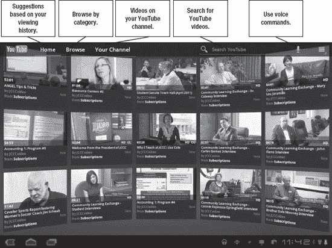
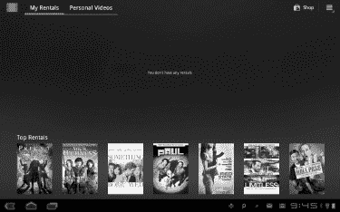
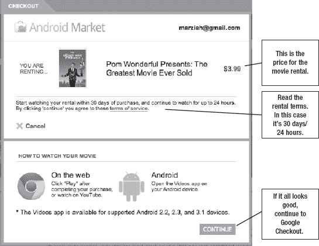
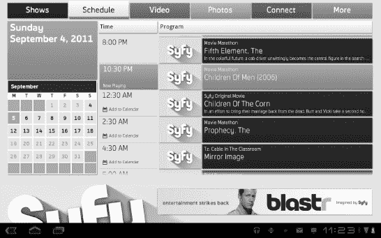
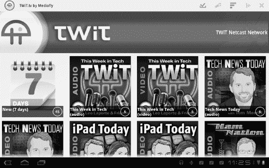
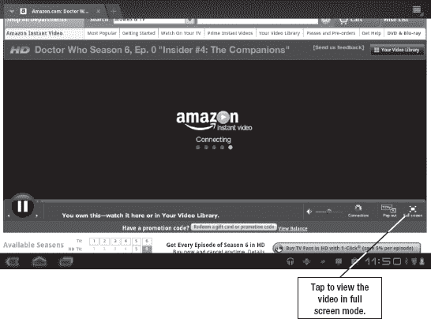
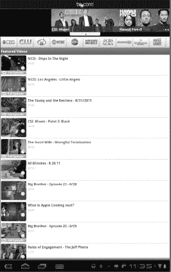
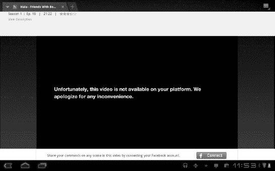
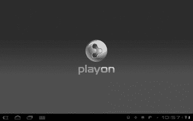
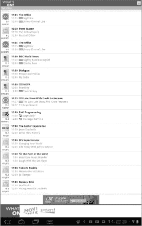

# 十九、在平板电脑上观看视频和电影

您的平板电脑是一个独立的电影展柜。它可以显示高清视频，在汽车旅行中娱乐您或您的孩子，或者在飞机上旅行时显示租来的视频。您甚至可以将平板电脑用作便携式电影播放器，连接到电视上，将您的电影带给朋友。在下一章，我们将讨论如何创建视频；但是在这一章中，我们会爆一些爆米花，然后欣赏表演。

**注意:**下载和流式播放电影需要很大的带宽。如果你支付有限的 3G 或 4G 数据连接，你会想在看电影时确保你连接到 Wi-Fi，否则当你的账单来临时，你可能会大吃一惊。

### Adobe Flash

很多网站使用 **Adobe Flash** 来显示视频。如果您的平板电脑上尚未安装该应用程序，您可能需要从 Android Market 下载。运行旧版本安卓系统的平板电脑在显示 **Flash** 视频时可能会有问题。

### YouTube

在谷歌制作的操作系统上，你想到的第一个视频来源可能是 YouTube。蜂巢平板电脑附带一个内置的针对平板电脑优化的 YouTube 应用程序。这个应用程序更容易通过触摸来导航，它允许你按主题浏览，以及基于你的观看历史的建议。你使用这个应用程序越多，这些建议就会越准确(见图 19–1)。

**图 19–1。** *浏览 YouTube 应用*

YouTube 的缺点是你必须有强大的数据连接才能观看你的视频。它也缺乏(合法的)长篇娱乐。例如，你不太可能找到你最喜欢的电视节目的合法上传，尽管你可能会找到它的一个短片或广告。

### 安卓电影租赁

谷歌在新的安卓市场上附加了一项视频租赁服务。你可以通过市场租借电影，并在网络、手机、平板电脑上观看，甚至可以使用平板电脑的 HDMI 连接将平板电脑连接到电视上。

这个市场让你像购买应用程序或书籍一样购买电影。

在撰写本文时，Android Market 已在几款平板电脑上推出，谷歌正在增加更多。为了在平板电脑上播放这些电影，你必须安装谷歌的**视频**应用。

这个应用程序允许您播放租借的视频和您自己的个人视频。租借的视频可以下载到您的设备上进行离线播放，但它们受复制保护，租借期结束后将会过期。**视频**应用只能在升级了 Android Market 的平板电脑上使用。

#### 租期

大多数电影的租借期是从*开始*观看电影的 30 天，到*结束*一个你已经开始观看的视频的 24 小时。

这让你有足够的时间下载几部电影供飞机或公路旅行使用，也让你有时间观看任何你在路上没来得及看的电影。24 小时的宽限期也给你时间找到一个更好的互联网连接或下载一部电影，如果你开始看它，发现你的连接太慢。

也就是说，24 小时就是 24 小时，所以在开始租借之前一定要检查电影的条款，注意不要在准备好观看电影之前就开始播放电影。

电影的条款和条件在结帐过程的第一阶段显示。图 19–2 显示了一部在网络上从 Android Market 购买的电影。

**图 19–2***。Android Market 电影租赁条款和条件*

#### 下载(锁定)电影

如前所述，您可以将租借的电影下载到平板电脑上，这样您就不必依赖互联网进行观看。通过安卓市场下载电影叫做*钉*电影。

**注意:**当您将电影固定到平板电脑上时，它将无法在手机或台式电脑等其他设备上播放或观看。它被明确地固定在你下载它的设备上。

按照以下步骤从平板电脑上的 **Android Market** 应用程序(非 Android Market 网站)下载电影:

1.  轻按您租借的影片来查看该影片的信息页面。这类似于你在应用程序上看到的信息页面。
2.  在屏幕右侧，你会看到两个按钮:**播放**和**下载**。点击**下载**按钮；这将启动**视频**应用程序并锁定您的视频。
3.  从**视频**应用中，点击屏幕右上角的**菜单**按钮。
4.  点击**管理离线租赁。**
5.  轻按**销**按钮(它实际上像一个销)。
6.  点击屏幕右下角的**完成**按钮。您的电影将开始下载。

注意:电影是很大的文件，通常需要 90 分钟来下载。如果你计划在飞机上看电影，确保你在出发前留出时间下载。

### 使用平板电脑在电视上显示节目

如前所述，你可以在高清电视上观看从 YouTube 或 Android Market 租来的视频。但是，这样做有一些要求。首先，你必须使用**视频**应用，即使你是从 YouTube 而不是 Android Market 租的电影。其次，你需要一台支持 ?? HDCP(高带宽数字内容保护)的高清电视。第三，你必须有合适的 HDMI 电缆来连接你的平板电脑和电视。幸运的是，大多数最新的高清电视能够做到这一点。

将平板电脑连接到高清电视后，您应该会在两个屏幕上看到相同的内容。如果您听不到任何音频，请确保您的电视设置为使用 HDMI 作为电视输入。

**注意:**摩托罗拉 Xoom 上的显示端口只输出 720p，即使你的视频源是 1080p。

### 渠道应用

Syfy 频道有一个专用于特定频道节目的应用程序示例。该应用的目的是鼓励你在电视上观看节目，所以**视频**按钮只显示宣传片段，而不是完整的视频。您可以使用**日程**按钮查看即将播出的剧集，并将它们作为事件放在平板电脑的日历上(参见图 19–3)。

**图 19–3。***Syfy 频道 app*

其他频道也有类似的应用，包括探索频道、动物星球、卡通网，甚至地方台。

一些频道应用程序，如史密森尼频道，允许你直接从平板电脑上观看完整集。

### TWiT

TWiT，代表“本周科技”这是一个免费频道，充满了不同的技术和科学节目，包括像“关于机器人的一切”和“奇奇博士的科学时间”这样的节目有些播客是视频，有些是音频。如图图 19–4 所示的 **TWiT** 应用并不是观看 TWiT.TV 的唯一方式。你也可以直接从网络上观看该频道的节目。然而，该应用程序使浏览和下载剧集变得更容易。

这些频道的剧集使用*网络广播*，或者*播客*。因此，当你观看一个节目时，你实际上是在临时下载它，而不是流式传输。如果你需要在路上看些东西，这对你坐地铁来说是个好消息。

**图 19–4***。推特应用*

### iPlayer

英国的 BBC 频道允许英国的观众在他们的桌面和移动设备上使用 **iPlayer** 应用程序来播放 BBC 的完整节目。该频道已宣布计划将这款应用程序引入美国，首先是一款 iPad 应用程序；然而，它也表示打算在未来支持 Android。预计这将是一项付费订阅服务，允许您观看 BBC 原创电视剧，而不是电影和其他节目。

### 网飞

网飞应用程序适用于安卓手机和一些运行安卓 2.2 及更高版本的平板电脑。这个应用程序允许你从网飞图书馆流式传输内容。它需要至少 3G 的数据连接才能传输，但在旅行时，你可能会发现缓冲问题，因为你的连接可能会时隐时现。网飞的网站用的是 **Silverlight** 而不是 **Flash** ，所以访问网飞网站解决不了问题。

### 亚马逊视频

Amazon.com 也提供视频内容。部分视频可供购买；有些可以出租；亚马逊 Prime 会员(每年 79 美元)可以让你免费观看一些视频。

如果你购买了一部电影，你可以把它下载到你的台式电脑上。但是，此时您无法从平板电脑上下载和播放。平板电脑只能播放视频。这意味着你需要一个数据连接。但是，您可以通过 Wi-Fi 连接观看高清质量的节目。

你不用下载应用程序来观看这些视频，而是使用你的**浏览器**应用程序。在 Amazon.com 网站上直接进入**您的视频库**，在浏览器窗口中查看您的视频。接下来，点击右下角的**展开**按钮，全屏查看您的视频(参见图 19–5)。

**图 19–5***。观看亚马逊视频*

### 直接从网上观看

直接从网站上观看节目也适用于许多其他电视频道和来源，包括 CBS 和 PBS。大多数免费的流媒体电视内容使用的是 Adobe Flash。只要网站没有主动阻止 Android 平板电脑观看内容，你就可以在平板电脑上观看流媒体视频，就像在其他电脑上一样。像 TV.com**这样的应用可以帮助你找到免费的流媒体视频。**

### 葫芦+

Hulu 是一种流行的电视节目流媒体服务，它托管来自多个网络的内容。然而，Hulu 不允许在平板电脑上播放流媒体。如果你尝试从平板电脑浏览 Hulu 网站(`[www.hulu.com](http://www.hulu.com)`)，你会看到一条类似于图 19–6 所示的错误信息。

**图 19–6***。在平板电脑上浏览网站时显示一条 Hulu 错误信息*

Hulu 还有一个订阅服务叫做*Hulu+*；不幸的是，这项服务还不适用于平板电脑。这项服务*可以在一些安卓手机上使用*，Hulu 表示正在努力将这项服务推广到更多的设备上。一旦成功，你就可以下载 **Hulu+** 应用程序；每月 7.99 美元，你就可以在平板电脑上观看 Hulu 节目，也可以观看整季的许多节目，而不仅仅是最后三集。注意 **Hulu+** app 并没有带走广告。

### 游戏机

绕过目前对网飞、Hulu+和其他屏蔽安卓平板电脑的网站的限制的一个方法是使用 PlayOn 这样的实时代码转换服务。*实时转码*即时将视频从一种视频格式转换为另一种格式，将其转换为平板电脑可以观看的格式。按照以下步骤使用平板电脑上的播放服务:

1.  你必须在一台必须保持运行的 Windows 机器上安装 **PlayOn** 应用程序。软件可以在 *[www.playon.tv](http://www.playon.tv)* 找到。
2.  从 Android Market 为您的平板电脑下载并安装 **PlayOn** 应用程序。
3.  为了使用平板电脑连接到 PlayOn，您必须使用与 PlayOn Windows 计算机相同的网络；只要这是真的，你的机器就会自动连接。

PlayOn 服务目前每月 5 美元，每年 39 美元。

### 将平板电脑用作遥控器

YouTube Leanback 是一种个性化显示，专为大屏幕设计，如连接到电视或大显示器的计算机。您可以在`[www.youtube.com/leanback](http://www.youtube.com/leanback)`访问这项服务。如果你正在使用这项服务，你可以使用 **YouTube Remote** 应用程序来控制你的体验。您还可以下载控制 Boxee、Roku、Dish、GoogleTV 和其他连接设备的远程应用程序。这些应用程序大多使用互联网来控制你的设备，而不是依赖蓝牙或红外信号。

你的平板电脑可以作为你的遥控器和日程表。电视列表应用程序(在左边)会给你一个基于位置的无线和有线电视节目列表。它不会让你观看任何节目，但如果你仍然在电视上观看大多数节目，它是一个很好的工具。