# 二十、创建照片、视频和艺术作品

在上一章中，我们学习了如何观看商业来源的视频。现在是时候使用平板电脑进行创造性表达了。根据您拥有的平板电脑，您可以使用它来拍摄和编辑照片、拍摄电影和发布电影，甚至可以将平板电脑用作画布来绘制像素作品。

### 平板电脑差异

需要指出的是，并非所有的平板电脑都是一样的。我将使用两款平板电脑作为例子:摩托罗拉 Xoom 和三星 Galaxy Tab 10.1。然而，你需要查阅你的用户手册来找到你的设备的摄像头的细节，看看它是否与你在本章中看到的有所不同。事实上，这一章可能是你在屏幕截图和平板电脑上看到的最大差异。这是因为各种平板设备中使用的摄像头类型存在许多差异，设备制造商必须调整 Android 以弥补这一点。也就是说，标准的蜂巢相机界面看起来像 Xoom，大多数平板电脑都使用非常接近它的东西，即使它们提供不同的选项。

### 使用相机应用程序拍照

大多数——如果不是全部的话——蜂巢平板电脑都有两个摄像头。第一个是前置摄像头，你可以用它给自己拍照或开视频会议。第二个是后置摄像头，可以用来拍摄更高质量的图片或视频。你使用**相机**应用程序来控制这一切。Xoom 使用基本的蜂巢摄像头接口，基本控制如图图 20–1 所示。

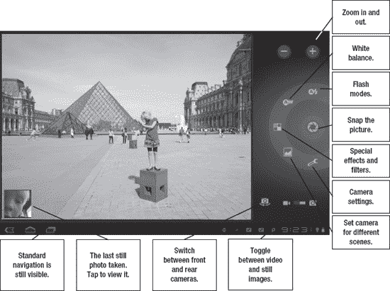

**图 20–1***。使用 Xoom 上的摄像头*

Galaxy Tab 提供了大部分相同的选项，但布局略有不同。你也可以点击图片的特定部分，这是 Xoom 不提供的功能。

Galaxy Tab 相机没有使用标准的 Android 导航。一旦你正在使用相机，退出**相机**应用的唯一方法是使用**后退**按钮，如图图 20–2 所示。

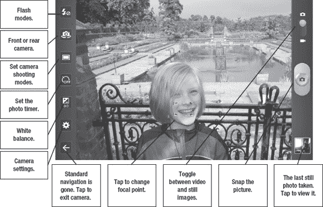

**图 20–2***。使用 Galaxy 选项卡上的相机*

如果您的平板电脑有一个前置摄像头，您将不会有与使用后置摄像头时相同的摄像头选项。这是因为前置摄像头通常分辨率较低，没有闪光灯。这意味着您将希望坚持在光线充足的区域拍摄照片和视频，并且您不会看到您没有的功能选项(参见 Figure 20–3)。

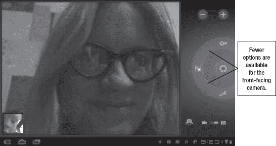

**图 20–3。***Xoom 上的前置摄像头*

按照以下步骤拍摄照片:

1.  启动**相机** app。
2.  轻按开关选择前置或后置摄像头。
3.  把照相机的焦点对准你的拍摄对象。
4.  轻按**快门**按钮。

**提示:**拍照时很容易晃动平板电脑，所以试着将拇指放在快门按钮上，用双手拿稳平板电脑。

#### 特殊功能

每台平板电脑都可以配备自己的一套特殊功能，用于拍摄从 3D 照片到全景照片的一切内容(参见图 20–4)。你需要参考平板电脑的用户手册来了解可用的具体功能，或者只是尝试各种设置和效果。Android 冰淇淋三明治包括全景功能作为一个标准功能。

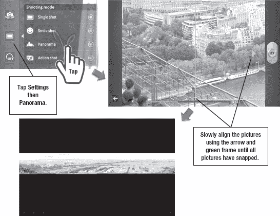

**图 20–4。** *使用 Galaxy Tab 拍摄全景 10.1*

#### GPS

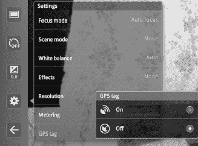

大多数平板电脑都为你提供了将位置数据和照片一起保存的机会。这有助于记住你在哪里拍的照片，比如假期照。您可以使用**设置**菜单打开和关闭 GPS 标记，大多数照片共享应用程序都允许您选择是否显示照片的位置。

你还可以拍摄你标记了位置数据的照片，并使用名为 **Panaramio** 的应用程序将它们上传到谷歌地球。谷歌通常只使用显示位置的高质量照片，照片中没有任何人物肖像。

**提示:**虽然很多平板相机都允许你给照片应用色彩效果，但你可能想正常拍摄照片，然后使用第三方照片编辑工具来应用效果。这样，如果结果不如你所愿，你就不会全力以赴。

#### 查看图片

一旦你抓拍了一张照片，你可以点击图 20–1 和 20–2 中显示的小预览图片，使用**图库**应用程序查看你的照片。您还可以查看您在平板电脑上拍摄的任何其他照片，然后共享、删除或旋转它们。如果你安装了第三方编辑应用程序，你甚至可以编辑它们。图 20–5 显示了处理您拍摄的照片的不同方式。

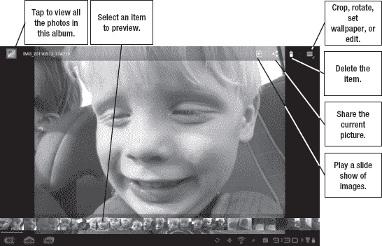

**图 20–5***。在**图库** app* 中查看照片

**注意:**当您使用平板电脑的静态相机时，您只能看到静态图像以供查看。当您拍摄视频时，您只会看到视频以供查看。

您可以在照片上使用双指收缩和扩展手势来放大和缩小照片，并检查照片的元素。点击左上角的**图库**按钮，查看整张相册。

#### 删除照片

当你检查你的作品时，删除任何模糊或其他不好的照片是一个好主意，这样你就不必在以后整理它们了。请按照以下步骤操作:

1.  轻按不想要的照片。
2.  点击屏幕顶部的**垃圾桶**图标。
3.  点击**确认删除**。

### 拍摄视频

为了将你的平板电脑用作摄像机，你需要将它从**静止图像**切换到**视频**模式。这两种模式的界面看起来几乎相同，只有几个选项发生了变化(参见图 20–6)。

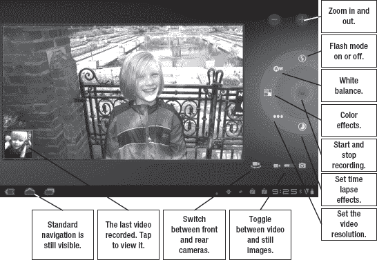

**图 20–6。**Xoom 上的*拍摄视频*

你可以在图 20–7 中看到捕捉视频的 Galaxy Tab 界面。它在很大程度上也没有改变静态相机的界面。

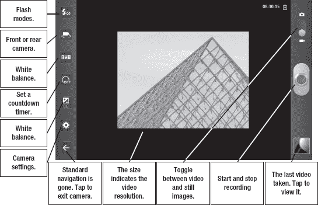

**图 20–7。** *银河标签上的视频 10.1*

#### 时间流逝与计时器

这里有几个区别各种平板电脑的功能:一些平板电脑有一个*计时器*来倒计时何时拍摄图片或开始录制视频，一些平板电脑有一个 ***延时*** 模式来控制视频拍摄的间隔。

如果您设置了计时器，您的平板电脑将在开始录制前倒计时设定的秒数。这可以让你在摄像机启动前设置好摄像机并就位。

如果您设置了延时间隔，如右图所示，视频将在每个指定的间隔拍摄一帧。

大多数平板电脑摄像头的正常视频分辨率为每秒 30 帧。这意味着一秒钟的间隔将拍摄比实时回放快 30 倍的视频；同样，10 秒钟的间隔会以 300 倍的速度回放。

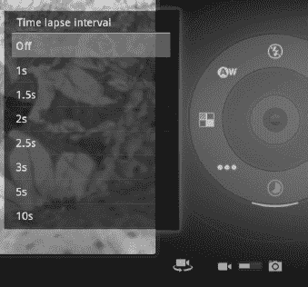

### 图库应用程序

虽然您可以在拍摄后立即查看照片，但 **Gallery** 应用程序为您提供了更多查看、分类和分享照片的选项。根据你的谷歌账户同步设置，**图库**应用还可以从谷歌照片托管服务 Picasa 网络相册中获取照片。您还可以在平板电脑上查看存储在文件夹中的图片。您可能已经导入了这些照片，或者在其他程序中创建了这些照片。

每个相册底角的图标表示图片来源的 app，如图 Figure 20–8 所示。

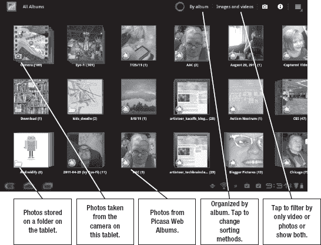

**图 20–8。** *相册查看**图库** app*

**提示:**移动平板电脑也会移动相册中的照片和视频。

**图库**应用的默认视图是按相册。如果您想以不同的顺序对照片进行排序，请点击屏幕顶部的(按相册)】,然后选择不同的排序方法。您可以按日期、位置、标签(对 Picasa 照片最有用)和大小进行排序。按位置排序如图图 20–9 所示。

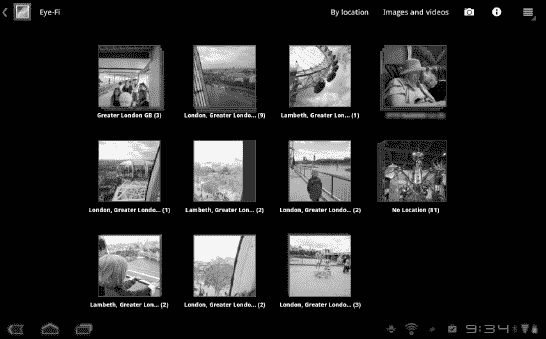

**图 20–9。** *按地点排序*

只要有可能，照片会被整理成一摞一摞的。图 20–9 显示了在同一地点拍摄的几张照片。轻按堆栈会打开它，并让您按专辑、日期、位置或标签导航它。轻按单个项目会调出您在查看拍摄的照片时看到的熟悉视图(参见本章前面的图 20–5)。轻触左上角的**图库**按钮，返回并查看相册或堆栈。

### 分享照片和视频

只要您连接到互联网或使用您的数据计划，您就可以轻松地将照片和视频共享到在线服务。按照以下步骤将照片或视频共享到此类服务:

1.  启动**图库**应用程序。
2.  导航到您想要共享的照片或视频。
3.  轻按屏幕顶部的共享图标。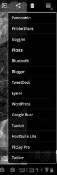
4.  选择一项服务并分享。

您可以使用的服务将取决于您已安装的应用程序以及您是否正在共享照片或视频。在右边的例子中，这是一个静止的视频。当你分享视频时，你的选择通常仅限于 YouTube 和电子邮件。

### 第三方照片应用

您可以使用各种第三方照片应用程序编辑和共享您的照片。例如，即使是 Adobe 也有一款免费的安卓版 **Photoshop Express** 应用。如图图 20–10 所示的应用程序并不具备您可能从桌面版类似软件中熟悉的所有功能和工具。然而，它确实允许你应用快速效果，并通过`[www.photoshop.com](http://www.photoshop.com)`上传和分享照片。

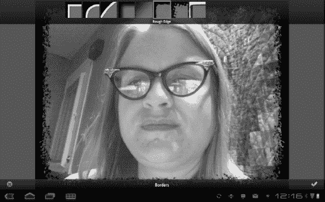

**图 20-10***。**adobe Photoshop express***

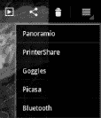

Photobucket 用户会很欣赏 **Snapbucket** 应用。它允许你用一个自定义的相机界面来抓拍照片或者导入现有的照片。您可以使用它来应用各种各样的滤镜，然后将照片上传到您的 Photobucket 帐户。

在撰写本文时，该应用程序尚未针对平板电脑进行优化；例如，它仍然有点固执地在垂直界面中提供所有功能。

我最喜欢的照片编辑应用之一是 **PicSay Pro** 。这款应用有免费试用版和付费版；付费版售价 4.13 美元。你可以使用这个应用程序进行严重的照片校正，如红眼减少或棕褐色滤镜；然而，你也可以给图片添加文字气球、帽子、假胡子和其他有趣的物品，然后将它们导出回**图库**应用程序或照片共享网站(参见图 20–11)。

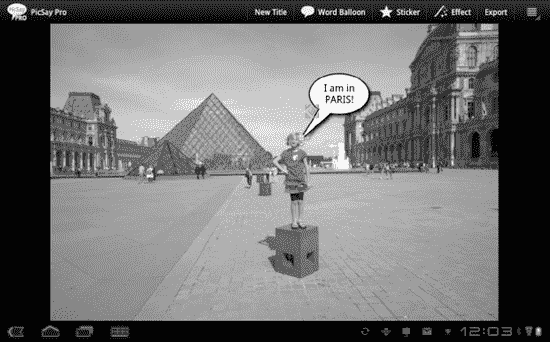

**图 20–11。***【picsay prol app】*

**注:**你也可以使用谷歌基于网络的照片编辑应用，**Picnik**；然而，这款应用没有单独的本地客户端，所以你需要将照片上传到 Picasa 或 Flickr，然后才能用 **Picnik** 编辑它们。

### 编辑视频

蜂巢平板电脑配备了一款名为**电影工作室**的优秀视频编辑应用。**电影工作室**允许你从平板电脑上拍摄视频，做一些基本的编辑，然后将视频导出到 YouTube。您也可以导入一系列图片并创建幻灯片以上传到 YouTube。

如果你曾经使用过视频编辑软件，那么**电影工作室**会非常熟悉。如果你没有，这个应用程序可能看起来令人生畏；然而，一旦你掌握了窍门，它实际上很容易使用。图 20–12 显示了 app 的基本界面。

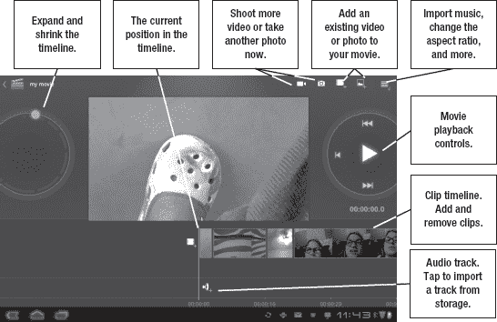

**图 20–12。*****电影制片厂** app 的界面*

**电影工作室**在屏幕中间显示您的电影。在它下面，您会看到时间轴中组成影片的剪辑集合。在右侧，您会看到基本的视频控制，在左侧，您会看到一个圆形环，可让您扩展和收缩时间线中显示的剪辑的预览图标。这让您可以编辑视频的更大或更小的部分。

在时间轴上长按一个剪辑，直接编辑该剪辑，如图 Figure 20–13 所示。

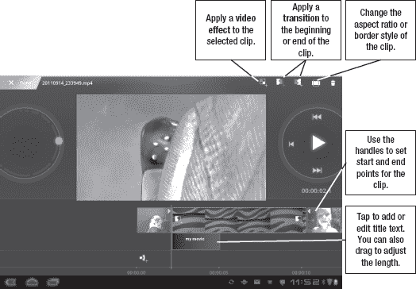

**图 20–13。** *长按**电影工作室*** 中的选项

#### 过渡

Movie Studio 还允许您在剪辑之间添加基本的*过渡*，例如幻灯片和交叉叠化:

1.  长按所需的剪辑。
2.  您会在剪辑周围看到绿色轮廓，并且会在剪辑的两侧看到转场符号。您可以点击剪辑上的**过渡**按钮，也可以点击屏幕顶部的按钮。
3.  选择一个过渡。
4.  你会在夹子之间看到一个小盒子。这是用于编辑目的的过渡。但是，当您观看电影时，您会看到过渡。

#### 视频效果和调整

您还可以将视频效果应用于电影中的单个剪辑，例如 Figure 20–13 中所示的负面效果:

1.  长按所需的夹子。
2.  点击屏幕顶部的**效果**按钮。
3.  选择所需的效果。

您可能还会发现，您的视频具有不同的长宽比或分辨率。如果您使用不同的摄像头拍摄视频，例如一部分使用前置摄像头，另一部分使用后置摄像头，就会出现这种情况。您可以添加信箱模式或更改部分或全部剪辑的分辨率。为此，请遵循应用效果的步骤；不用点击**特效**按钮，而是使用**边框和长宽比**按钮。

#### 添加标题

剪辑正下方的层用于标题文本。您不能添加任何非常详细的内容，但添加标题或基本说明很简单:

1.  轻按您想要添加标题的剪辑的正下方。
2.  你会看到一个 **+FIN** 按钮。轻点它。
3.  选择标题样式并添加文字。

#### 上传到 YouTube

如果你已经有一个与谷歌账户绑定的 YouTube 账户，上传到 YouTube 是轻而易举的事情。然而，如果你在平板电脑上使用数据套餐，你可能会想确保使用 Wi-Fi 来节省数据使用费。按照以下步骤将视频上传到 YouTube:

1.  一旦你完成了你的电影，点击屏幕顶部的**菜单**按钮。
2.  选择**分享电影**。
3.  选择 **YouTube** 。
4.  输入视频标题和任何其他所需的设置。
5.  点击**上传**。

默认情况下，YouTube 视频是公开的，因此如果您喜欢任何其他设置，您需要覆盖此设置。

### 使用不同的相机

仅仅因为你的平板电脑带有摄像头，并不意味着你只能使用平板电脑的摄像头。例如，您可以通过 USB 将另一台相机拍摄的照片传输到您的平板电脑上进行幻灯片放映或编辑。如果你有一个支持 SD 卡的更好的相机，你可以使用 Eye-Fi 品牌卡和免费的 **Eye-Fi** Android 应用程序将照片直接传输到你的平板电脑，并在你的平板电脑连接互联网时上传到 Photobucket、Flickr 或 Picasa。图 20–14 中的照片是用单独的相机拍摄的，并通过无线方式上传到平板电脑上。

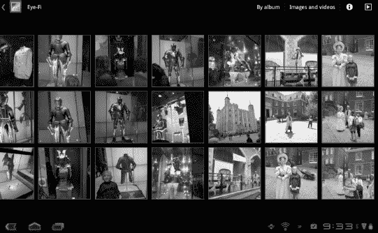

**图 20–14。** *Eye-Fi 卡和安卓*

### 使用平板电脑进行艺术创作

平板电脑相对于手机的一大优势是其额外的屏幕空间。平板电脑有足够的空间来让你用手指绘画或使用电容手写笔配件在屏幕上绘画。例如， **Autodesk SketchBook** 应用程序有免费版和 4.99 美元的专业版(见图 20–15)。

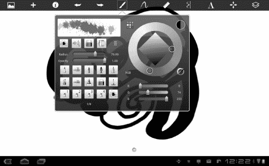

**图 20–15***。**Autodesk SketchBook**app*

**SketchBook** 提供了你期望在桌面绘画应用中找到的功能。它支持图层，大量的自然画笔选择，以及导入照片的能力。

**注意:**如果你想让触控笔与大多数安卓平板电脑配合使用，你需要找到一款为手机和平板电脑设计的*电容式*触控笔。为 iPads 销售的手写笔会很好用。重要的是，这种触控笔必须允许来自手指的少量电荷转移到平板电脑上。任天堂 DS 或类似设备的触控笔无法与大多数安卓平板电脑兼容。这些是为*电阻*屏幕设计的，这种屏幕不需要充电。

### 打印照片

一旦你创作了一张照片或一件艺术品，你如何打印它？有各种各样的方法。您可以通过**共享**菜单打印到一些蓝牙打印机。

如果你的打印机没有这个选项，而想直接从平板电脑上打印，你可以使用像 **Printbot** 或 **PrinterShare** 这样的应用程序来打印。在某些情况下，您可能需要在连接到打印机的台式电脑上安装一个应用程序。一旦安装完毕， **PrinterShare** 将作为分享选项出现在**图库**应用中，如所示

您还可以将照片上传到许多照片打印网站。首先将您的照片共享到 Picasa、Photobucket 或 Flicker，然后从您上传照片的网站订购照片，通常会更容易。一些平板电脑甚至内置了打印排序功能。