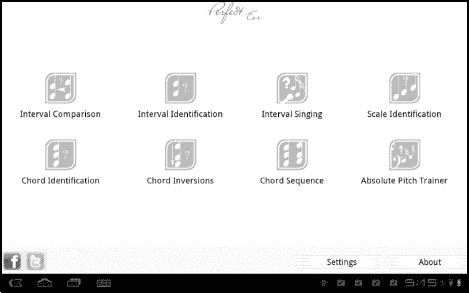

# 二十一、听音乐

您的平板电脑是电脑和小型娱乐中心的结合体。当您的平板电脑具备在阅读电子书或网上冲浪时播放音乐的存储和硬件能力时，您不需要携带单独的音乐播放器，也不需要跟踪您加载到不同计算机上的不同音乐库。可以全部同步。在本章中，我们将探索几种在平板电脑上欣赏音乐的方式。本章绝不是平板电脑可用音乐选项的详尽资源——有太多高质量的音乐应用程序试图在这里涵盖它们。然而，我们将触及几个亮点。

### 谷歌音乐

谷歌在 2011 年谷歌 I/O 开发者大会上推出了谷歌音乐。在撰写本文时，这项服务只能通过邀请提供；但是，您可以在`[`music.google.com`](http://music.google.com)`注册接收邀请。Xoom 所有者无需注册即可收到邀请。

谷歌音乐服务使用你的谷歌账户在互联网上存储音乐——在云中存储音乐——并且这些音乐可以从任何装有现代互联网浏览器的设备上获得。在 Android 2.2 及更高版本上，还有一个**谷歌音乐**应用。

#### 将音乐放入谷歌

一旦您收到邀请并启动您的谷歌音乐帐户，您需要将您的音乐收藏转移到谷歌。你没有无限的存储空间，但谷歌估计你有多达 20，000 首歌曲的空间。这些歌曲可能在不同的电脑上，但你仍然可以将它们放入谷歌音乐。

**注:**谷歌音乐不会导入受*数字版权管理* (DRM)保护的歌曲。这包括您可能从 iTunes 或其他音乐服务购买的一些歌曲。有时，您可以通过将歌曲刻录到 CD，然后将文件重新导入 iTunes，来从 iTunes 文件中移除 DRM。

按照以下步骤将您的音乐导入 Google Music:

1.  在`[www.google.com/music](http://www.google.com/music)`从桌面电脑登录谷歌音乐。
2.  从谷歌下载并启动**音乐管理器**桌面应用。
3.  指定您的音乐位置。您可以从 iTunes 文件夹或储存音乐文件的其他位置中选取。
4.  选择要上传的歌曲和播放列表。您可以指定部分或全部歌曲或播放列表；您还可以指定是否包含播客。该应用程序还可以查看这些文件夹中的新音乐。
5.  选择是否允许**音乐管理器**从您关注的文件夹中上传歌曲。如果您选择**是**，您下载的任何新(非 DRM)歌曲都会自动导入到后台的 Google Music 中。

音乐管理器可能需要几个小时甚至几天才能将你的音乐上传到谷歌音乐；但是，您可以继续使用您的电脑，甚至可以在等待时在 Google Music 上流式播放当前上传的文件。在任何储存音乐文件的电脑上重复此过程。图 21–1 展示了将音乐上传到谷歌音乐所需的步骤。

**图 21–1***。使用音乐管理器*

#### 在平板电脑上使用谷歌音乐

一旦你设置了谷歌音乐，并在其中填充了你的歌曲和播放列表，你就可以在你的平板电脑上使用**谷歌音乐**应用进行播放了。你可以从安卓市场下载这款应用。图 21–2 显示了**新视图和最近**视图的类似于滑动转盘的界面。

**图 21–2。** *谷歌音乐应用中的新的和最近的视图*

**注:****谷歌音乐**应用将检测大多数音乐的专辑封面。有些东西没有专辑封面，比如播放列表，有些就是不在数据库里。你可以在谷歌音乐的网页版上添加或更改专辑封面，但不能在该应用的 Android 版本中添加或更改。

不同的视图实际上只是排序方法，以便更快地找到您的音乐，就像在 iTunes 中一样。要更改视图，只需点击耳机旁边的屏幕左上角，然后从列表中选择一个新视图。

虽然每个视图的图形显示略有不同，但每个视图都允许您拖动和滚动来查找您的音乐或一组音乐文件。

Figure 21–3 显示了一些不同的视图。

**图 21–3***谷歌音乐中的不同观点*

**注:**如果你在一个项目的右下角看到一个**三角形**图标，这意味着你可以点击它来选择如何处理该项目，例如播放该项目或将其添加到播放列表中。

#### 在谷歌音乐上播放歌曲

如果你点击任何一个排序选项，你最终会看到一个歌曲列表。轻按任何歌曲，您将开始播放该歌曲以及该群组中的任何其他歌曲，无论是播放列表、专辑还是流派。有时一个组合可以包含一首歌曲。单首歌曲的控制如图 21–4 所示。

**图 21–4。**??【谷歌音乐】歌曲控制

#### 向播放列表添加歌曲

如果您从 iTunes 导入了音乐，您也会导入播放列表；但是，当您购买更多音乐时，您可能想要重新排列您的播放列表或制作新的播放列表。按照以下步骤操作(参见图 21–5):

1.  轻按歌曲右下角的**三角形**图标。
2.  选择**添加到播放列表。**
3.  从现有播放列表中选择，或点击**新播放列表**...去创造一个。

**图 21–5。** *向播放列表添加音乐*

#### 即时播放列表

您可以围绕一首歌曲自动生成播放列表，而不是单独将歌曲添加到播放列表中。这在某些歌曲上比其他歌曲效果更好，所以一旦这样做了，你可能需要去掉一些奇怪的选择。按照以下步骤操作(参见图 21–6):

1.  轻按播放列表、专辑或流派，直到您看到一首歌曲。
2.  轻按专辑插图的底角。
3.  轻触**进行即时混合**。
4.  您的混合将被创建。轻按单个项目的角，将它们从播放列表中移除。

**图 21–6。** *即时播放列表*

#### 离线收听

当您连接到互联网时，从 Google Music 播放音乐效果很好；然而，当你上路时会发生什么呢？好消息是 **Google Music** 应用会自动下载你最近听过的音乐，所以你可以继续听那些歌。然而，你可能想提前计划一次旅行，并在出发前下载几首歌曲。

要下载歌曲，点击**可离线下载**。下载完成后，你会在菜单中看到一个亮绿色的**大头针**符号。与从 Android Market 上下载租赁电影不同，你仍然可以从其他设备上下载歌曲。这只是下载到特定的设备。

您可以下载的歌曲数量取决于您设备上的可用空间。

#### 逛街买音乐

如果您喜欢某个艺术家并想购买更多，您可以点击艺术家更多菜单选项(参见图 21–7)。这将启动您的**浏览器**应用程序，搜索与该艺术家相关的购物项目。如果你购买并下载新音乐到你的平板电脑，它将被添加到你的谷歌音乐选择；但是，并非此处列出的所有项目都可以即时下载。例如，列出的一些项目是实体 CD。这里列出的商品也是在单独的商店，而不是谷歌或安卓市场；因此，在继续之前，你应该检查零售商的个人信誉。

**图 21–7。** *购买艺术家的更多音乐*

**提示:**你可以在`[`magnifier.blogspot.com`](http://magnifier.blogspot.com)`访问放大镜获得谷歌音乐的免费音乐。如果你登录到你的谷歌帐户，只需点击一下，歌曲就会被导入到你的谷歌音乐帐户。

### 亚马逊 MP3 和云播放器

Amazon.com 在其网站上销售 MP3，以及存储这些文件并从任何联网设备上播放的能力，就像你可以使用谷歌音乐一样(亚马逊的服务实际上早于谷歌的服务)。亚马逊的流媒体音乐服务叫做*云播放器*；而且，和谷歌音乐一样，你可以在电脑上下载一个桌面应用程序，将你的非 DRM iTunes 和其他音乐文件传输到亚马逊的音乐托管服务。

在 Android 平板电脑上，你可能会发现用 Cloud Player 使用和播放音乐的体验有点不太令人满意。在撰写本文时，**亚马逊 MP3** app 还没有针对平板电脑进行优化；然而，你并没有把云播放器作为唯一的播放选项。你可以从亚马逊购买歌曲并下载到你的平板电脑上，它们将在**谷歌音乐**和许多其他音乐应用中播放。

当你启动**亚马逊 MP3** 时，你需要登录你的亚马逊账户。完成后，选择**转到云驱动器**使用音乐播放器(参见图 21–8)。

**图 21–8***。亚马逊云播放器服务*

**亚马逊 MP3** 将你的音乐分为两个位置:云驱动音乐和设备上音乐。你可能会在两个位置都有歌曲，但云驱动器音乐需要互联网连接才能播放，而设备上的文件需要存储空间。

#### 下载文件

亚马逊更有兴趣向你出售音乐，而不是把你绑在它的音乐播放器上。因此，您可以随时按播放列表、歌曲或专辑下载文件。轻触**下载**按钮，开始下载选定的歌曲或歌曲组(参见图 21–9)。

**图 21–9。** *在亚马逊云播放器中下载播放列表*

#### 从亚马逊购买音乐

要开始购物，只需点击位于**亚马逊 MP3** 任意视图右上角的**商店**按钮。可以按歌曲或专辑搜索音乐，也可以按人气浏览。

如果找到您感兴趣的歌曲，轻按一次即可试听，如 Figure 21–10 所示。

**图 21–10。** *在亚马逊 MP3 中预览音乐*

试听歌曲后，再次点击它，价格会变成绿色的**购买**按钮。再次点击以完成购买。你需要登录你的亚马逊账户并输入密码来确认购买。如果你勾选了**旁边的框【以后购物记得我】??，你就不用再输入密码了；但是，您可能希望取消选中该框以避免意外购买(参见图 21–11)。**

**图 21–11***。购买歌曲*

#### 自动下载

如果您为新购买的产品点击**下载**按钮，系统会询问您是否希望为将来购买的每一个 MP3 自动下载。如果你点击**是，**所有未来从亚马逊购买的商品，无论你是在平板电脑上还是在网上购买，都将被下载到你的平板电脑上。

自动下载可以轻松地从亚马逊购买音乐并上传到谷歌音乐，而无需点击任何额外的按钮。下次你启动**谷歌音乐**应用时，它会找到你平板电脑上存储的新音乐文件，并自动上传到谷歌的服务器上。

### 预装的音乐播放器

你的平板电脑可能自带专门的音乐应用。在大多数情况下，此类应用程序可以播放安装在您的设备上的音乐，并连接到商店。附带的音乐商店可能会提供促销歌曲或销售。如果文件不受 DRM 保护，并且正在下载到您的平板电脑上，您可以使用最方便的播放器。图 21–12 显示了 Galaxy Tab 设备附带的**音乐中心**应用程序。

**图 21–12***。音乐中枢应用*

### 潘多拉

Pandora 是一个互联网电台，可以根据你喜欢的歌曲或艺术家创建定制播放列表。你不能挑选确切的歌曲或组合，但你可以表明你是否喜欢或不喜欢潘多拉为你做出的选择。可以在`[www.pandora.com](http://www.pandora.com)`注册一个免费账号。免费账户是由广告赞助的，需要你偶尔点击一些东西来表明你还在听。潘多拉还提供付费账户，每年 36 美元。付费账户提供无限制的收听和更高质量的音频文件。

该应用的 Android 版本尚不支持创建自己的播放列表，但你可以从平板电脑的浏览器访问 Pandora，并通过这种方式创建新的播放列表。

潘多拉最大的缺点就是*只有*流媒体。你可以通过点击**菜单**按钮来购买歌曲，但如果没有互联网连接，你就不能使用应用程序本身。如果你用的是 3G 或 4G 网络，那可能会很贵，所以要小心。潘多拉出现在图 21–13 中。

**图 21–13。** *用潘多拉播放音乐，互联网广播服务*

### 交媾

Spotify 是一项互联网音乐服务，起源于欧洲，最近被引入美国。虽然你可以获得一个免费的 Spotify 帐户，但它在 Android 上真的没有那么有用，除非你订阅了一个付费帐户。付费账户每月收费 5 美元和 10 美元，提供无限制的、无广告的收听大量歌曲和艺术家的服务。您还可以创建播放列表，通过脸书与其他用户共享。当你在电脑上安装 **Spotify** 应用程序时，它会扫描电脑以找到你已经拥有的任何音乐，然后将你的音乐和播放列表添加到你的可用收藏中。

虽然没有付费账户，你无法在 Android 上播放 Spotify 的任何音乐，但你仍然可以使用该服务播放已经存储在你设备上的文件(见图 21–14)。

**图 21–14***。Spotify 音乐服务*

### 不知道名字时寻找音乐

过去，如果你有一只耳朵虫，你必须哼给别人听，或者搜索一行你认为是歌词的歌词来找出歌曲的名称和艺术家——但现在不会了。现在有几个应用程序可以专门用来查找歌曲的名称，方法是使用平板电脑的麦克风并录制歌曲的片段。有时候你甚至可以自己唱几个小节来寻找答案。

图 21–15 显示了一个解决方案，即 **SoundHound** 应用程序。另一个受欢迎的应用程序是 **Shazam。**

**图 21–15。***sound hound app*

### 超越倾听

平板电脑不会限制你听别人的音乐；你也可以自己创造。一些乐器应用程序允许你演奏虚拟钢琴或其他乐器，尽管此时你创作的音乐质量更倾向于新颖而不是艺术。一个免费的应用程序， **Perfect Ear** ，旨在训练你的声音(见图 21–16)。你可以用它来提高你唱调或识别音程和弦的能力。

**图 21–16。** *玩完美耳朵 app*