# 二十二、乐趣和游戏

我们已经讨论了书籍、电影和音乐，现在我们来看看平板电脑上的游戏。从 Honeycomb 开始，Android 平板电脑采用双核处理器，速度快了很多。许多蜂窝平板电脑都有清晰的屏幕，可以显示针对 Adobe Flash 播放而优化的高质量图形。

在开始游戏之前要检查的一件事是它是否需要互联网连接。有些游戏没有连接也可以玩，但有些游戏需要连接才能玩。

### 大屏幕上的收藏夹

许多游戏基于最初在手机或电脑上运行的游戏，但现在已经改进或扩大了图形，利用了平板电脑的更大显示屏。游戏的机制保持不变，但其中许多都强制垂直方向。一些游戏仅仅是曾经是计算机最爱的游戏的变种。

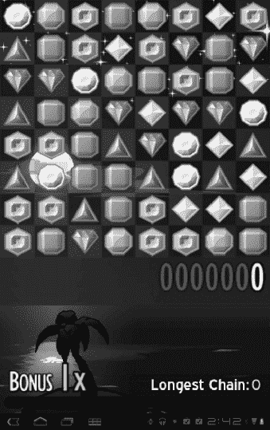

#### 比赛——三场比赛

基本的 match-three 益智游戏已经有一段时间了，你可以找到许多 Android 平板电脑的变体。规则很简单:通过交换两个相邻的棋子来匹配三个或更多的颜色。匹配的颜色将消失，新的项目将取代它们。左边显示的一个典型例子是 MHGames 的**珠宝**。

这是俄罗斯电脑游戏 **Shariki** 的众多变体之一。这款游戏对于美国玩家来说更加熟悉，它有一个名为**宝石迷阵**的宝石匹配版本。在手机应用程序时代到来之前，PopCap 为台式电脑推出了流行的**宝石迷阵**游戏。电子艺界提供了一个官方 Android 版本的 **Bejeweled** ，但在撰写本文时，它还不能用于平板电脑。

Shariki 还有其他变化，包括气泡或其他形状，也依赖于匹配三机制。

**注意:**谨防还没有为平板电脑更新的游戏。如果一款游戏只在你的大屏幕上显示一个小矩形，那它还没有针对平板电脑进行优化。搜索一下 app，看看有没有两个版本。通常情况下，平板电脑版本将在高清屏幕后被称为 *HD* 版本；然而，仅仅因为你在名称中没有看到 HD，并不意味着该应用程序没有针对平板电脑进行优化。冰激凌三明治让创建平板电脑优化应用变得更加容易。

#### 愤怒的小鸟

《愤怒的小鸟》于 2009 年作为一款付费应用在 iOS 设备上推出，并获得巨大成功。Rovio 后来让这款游戏成为免费的广告赞助下载，部分原因是它与 Android Market 和付费应用程序不一致；然而，该公司已经在几乎所有可用的小型和大型计算和移动平台上推出了多种版本的 **ngry Birds** 。甚至还有愤怒的小鸟棋盘游戏，以及一系列填充动物玩具。到目前为止，已经有超过 3.5 亿次下载。

如果你从来没有玩过这种高度上瘾的游戏，很容易开始。你有一个弹弓，一些愤怒的小鸟，一堆堆的东西，还有一些快乐的绿色小猪。向堆叠的物体投掷愤怒的小鸟，将它们撞倒，并“弹出”小猪(参见 Figure 22–1)。

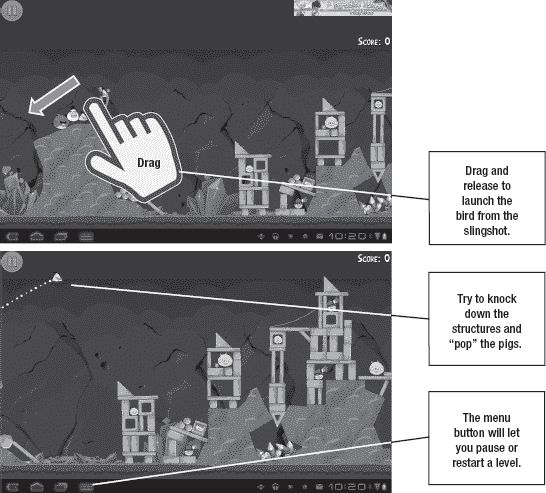

**图 22–1。** *愤怒的小鸟 by Rovio*

### 街机经典

另一种典型的游戏类型是怀旧街机经典游戏。甚至是安卓市场的一个品类。这一类别中既有付费应用，也有免费应用，还有经典街机游戏的官方和非官方翻拍版。有几个非官方翻拍的**太空入侵者**和各种弹球游戏；Namco 已经制作了官方版本的**吃豆人**和**吃豆人小姐**，尽管你需要仔细检查以确保它们与你的设备兼容。

**注意:**下载付费 app 前，阅读评论意见，查看是否有免费版本。否则，你可能会被一个不能工作、不能很好扩展或者没有你想象的那么有趣的应用程序所困扰。

#### 俄罗斯方块

一款经典的街机游戏卷土重来，那就是电子艺界的俄罗斯方块。EA 制作了这款应用的免费版和 2.99 美元的付费版。

可能需要几个回合才能习惯点击和拖动来操纵瓷砖到位；然而，这款游戏在平板电脑上就像在街机和台式电脑上一样令人上瘾。

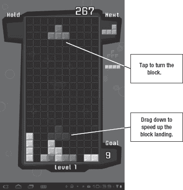

### 塔防

电脑游戏的一个流行类型是*塔防*游戏。这是一种策略游戏——通常是单人纸牌游戏——玩家试图安装静态武器来防止敌人突破他或她的防御。每个被消灭的敌人都有价值点，可以用来购买更多的防御或升级现有设施。

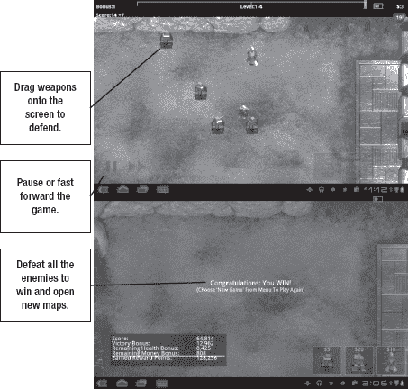

左边显示了一个在平板电脑上运行良好的流派的例子。这是 Lupis Labs 的 **Robo 防御。这是一个相当标准的塔防，机器人、坦克、直升机和喷气式飞机试图突破你的防御。这个游戏的一个很酷的方面是，它针对各种屏幕尺寸进行了优化。可以试试免费版，一个地图，十一个关卡。如果你发现这个策略令人奇怪地上瘾，付费版本只需 2.99 美元，并允许你选择更多的地图。2.99 美元也是塔防游戏的典型价格。**

其他塔防游戏包括以下内容:

*   **Nexus Defense HD** :防御科幻袭击者。
*   ZDefense HD :使用街机风格的图形沿六边形网格防御。
*   **坟墓防御 HD** :防御一大群僵尸和怪物。

### 桌游

互联网给经典的棋盘游戏注入了新的生命，不仅仅是跳棋和国际象棋。当然，如果你想的话，你可以玩跳棋和象棋。但是你也可以玩扑克、纸牌和任何你能想到的纸牌游戏。有些涉及其他玩家，有些允许你在网上玩对手。

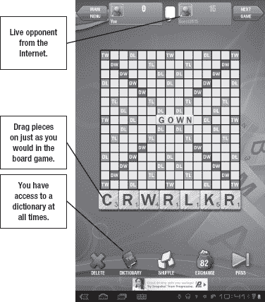

智乐制作了 Mattel classic Uno 的授权版本，售价 2.99 美元。Uno 应用程序允许你和世界各地的其他在线玩家一起玩。

电子艺界制作拼字游戏的官方授权版本。这个免费的游戏，显示在左边，允许你在你的平板电脑上玩流行的字谜游戏。

你可以对陌生人测试你的智慧和运气，从联系人列表中选择朋友，或者和电脑生成的对手进行游戏。游戏可以在许多不同的平台上进行，所以你不需要将自己局限于平板电脑玩家。

游戏有时会花很长时间在线玩，但你可以退出并互相推动进行下一步。

另一个类似拼字游戏的变化是受欢迎的 Zynga 游戏，名为 **Words With Friends** ，它允许你挑战你的脸书联系人。

注意:有大量类似拼字游戏的游戏，但也有大量作弊软件。许多应用程序可以让你立即找到最有价值的单词。那就没意思了，所以我倾向于只和我知道不会作弊的朋友玩。

### 体育游戏

如果你玩一项运动，可能会有一个应用程序。你可以追踪你最喜欢的现实生活中的球队，但你也可以使用 ESPN 的免费**梦幻足球**应用程序来追踪你想象中的球队。【RasterGrid 出品的口袋足球是一款将足球和一点空气曲棍球力学结合起来的游戏，为足球迷们打造了一款令人愉快的游戏。只是把你的弹球般的球员扔向球，并试图得分。你可以玩单人或双人版本。

右边的应用是意大利游戏公司免费的 3D 保龄球游戏。将保龄球拖向球瓶，看看你做得有多好。你会看到罢工和火鸡之类的举动格外引人注目。

这个游戏也可以用来向新玩家解释保龄球，他们可能不明白分数是如何工作的。

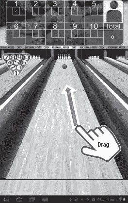

### 使用平板电脑功能

Android 游戏可以超越简单地从电脑移植游戏，并将其转换为使用触摸控制。平板电脑通常有电脑没有的硬件。例如，幻觉实验室的**迷宫精简版**游戏模仿了 3D 大理石迷宫游戏(见图 22–2)。平板电脑中的运动传感器允许你通过握住和倾斜平板电脑来玩这个游戏，图形会随着你的游戏而移动和变化。倾斜和移动平板电脑来移动弹球的这种组合极大地增强了 3D 深度的幻觉。

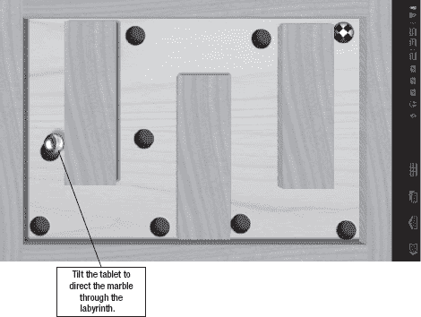

**图 22–2。** *迷宫建兴由幻觉实验室*

赛车游戏是运动传感器工作良好的另一个领域。许多赛车游戏允许你把平板电脑像方向盘一样伸出来，利用倾斜动作来驾驶汽车。在某些情况下，您可以使用屏幕一侧的拇指来控制加速度。图 22–3 展示了 Creative Mobile 的免费**飙车**应用。

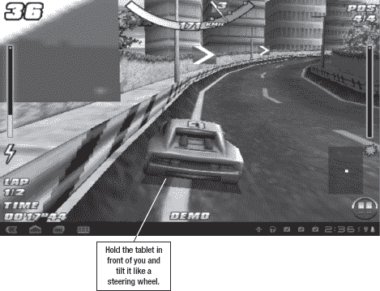

**图 22–3***。创意手机飙车*

**注**:类似游戏的元素也会被组合成并非真正游戏的物品。例如， **Foursquare** 等社交网络应用为签到者颁发徽章，你可以在脸书境内玩游戏。

### 神秘冒险小游戏

有时候想要逃避，有时候想要挑战。你可以玩文字和记忆游戏，但也有不少适合平板电脑的益智冒险游戏，这些游戏具有出色的图形和故事情节。如果你喜欢神秘小说，这可能是你会被吸引的类型。

这种类型的一个例子是 G5 娱乐公司的**水晶之门的神秘**(见图 22–4)。在这个游戏中，你通过解决一系列谜题和迷你游戏来帮助一个名叫妮可的年轻记者解开她失踪父亲的谜团。

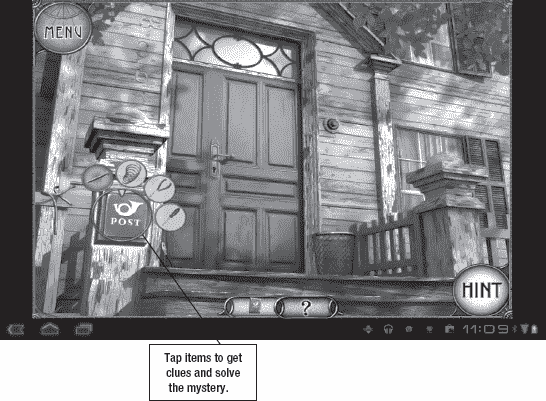

**图 22–4。***G5 娱乐出品的神秘水晶门户*

G5 娱乐公司还创造了**灵异机构**，它的特点是不同的故事线，但相似的机制。

### mmogs

MMOPRG 代表*大型多人在线角色扮演游戏*。如果你喜欢**魔兽世界**，这就是你的类型。直到最近，这也是一种移动设备根本无法处理的游戏。即使是笔记本电脑也会在所需的图形和速度上苦苦挣扎，而手机又太小又太慢，跟不上。然而，事情正在迅速变化。

#### 下载数据

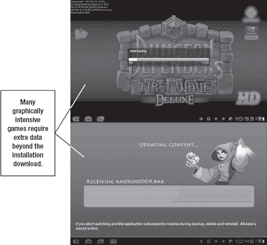

对于一些游戏，尤其是 MMOPRG 游戏，你可能会遇到的一个问题是，在你*安装了*之后，你需要*下载*它们。请确保您的平板电脑存储空间充足，并准备好等待几分钟，让您的游戏完成安装。如果你通过应用内购买支付升级费用，有时你需要再次经历这一过程。

#### 口袋传说

《口袋传奇》是一款由时空工作室(Spacetime Studios)开发的 MMOPRG(见图 22–5)，旨在运行在移动设备上。它需要某种类型的数据连接，并且可以在较慢的 3G 速度下工作。请注意，MMOPRGs 会占用大量数据，因此在通过 Wi-Fi 以外的任何方式连接之前，请仔细考虑。

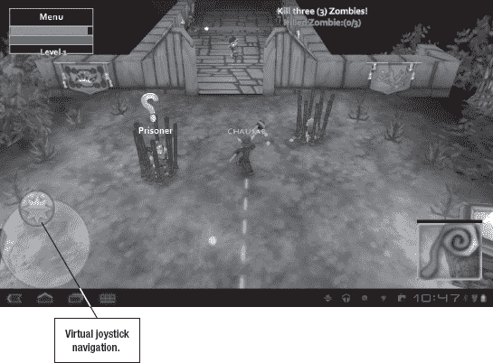

**图 22–5***。时空工作室的口袋传奇*

**口袋传说**利用屏幕一角的虚拟操纵杆进行导航；这个特性已经成为了平板电脑的 MMOPRG 标准。您还可以使用一些双指导航，如缩放手势，您可以使用文本聊天与其他玩家交流。

口袋传奇可以免费下载和玩，但是购买会员资格可以获得额外的功能，例如专属的冒险区域和物品。你可能会注意到，在这个游戏中，图形的清晰度不高。较低清晰度的图形能够在较慢的连接和设备上实现更快的渲染时间。

#### 地牢守护者

新潮娱乐发布了**地牢守卫者**，并将其描述为 MMOPRG 和塔防的结合。这是市场上发布的首批针对平板电脑优化的游戏之一。这是因为 Xoom 和许多其他 Android 平板电脑中双核芯片的制造商 Nvidia 向 Trendy Entertainment 支付了费用，以使其游戏适应平板电脑。这款游戏在 Xoom 上免费发售。

《地牢守卫者》是一款平板电脑玩家可以与游戏机和台式电脑玩家一起玩的游戏，尽管这款游戏首先在移动平台上发布。交叉兼容性意味着你可以在一个平台上开始玩，在另一个平台上继续玩。图 22–6 显示了这个游戏的基本布局。

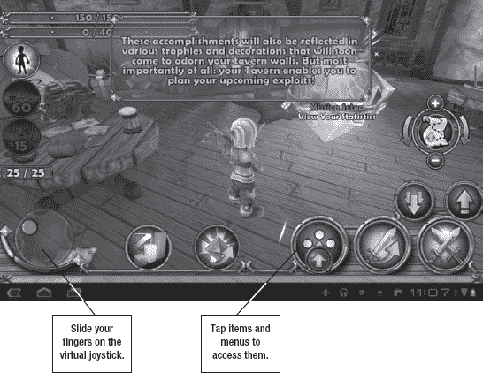

**图 22–6。** *地牢守卫者 by 新潮娱乐*

**地牢守卫者**中的图形比**口袋传奇**中的质量更高，但对平板电脑的要求也更高。**地牢守护者**利用了 Nvidia 芯片中的**闪存**优化，所以它在不同处理器的平板电脑上不会工作得很好。

像**口袋传奇**，**地牢守护者**都是免费的，但是你可以通过应用内购买来升级。如果你的平板电脑没有附带这款游戏，你可以从 Android Market 下载。

### 虚拟模拟

许多游戏允许你拥有一个虚拟的生意，照顾一个虚拟的宠物，或者在一个虚拟的农场种植食物。他们综合运用技巧、策略和运气；许多人发现它们很容易上瘾。G5 Entertainment 有一整个系列的游戏，包括图 26–7 中的例子， **Stand O'Food，**让你开一系列的虚拟餐厅。

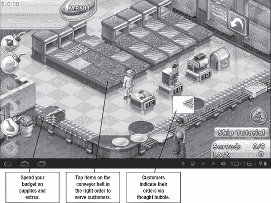

**图 22–7。***G5 娱乐站外就餐*

为顾客服务需要点击正确的食物顺序，并且你要决定在每个小游戏之间购买什么供应品。游戏在每一轮都变得越来越复杂，但将游戏分成小游戏意味着你可以在方便的时候开始和停止。

### 儿童游戏

我是一位母亲，众所周知，我会把我的平板电脑递给我的一个孩子，让他们在漫长的车程中尽情娱乐；但是，我不推荐大部分儿童游戏。

安卓平板电脑不是为儿童设计的。与 iPads 不同，Android 平板电脑不容易锁定应用内购买和网页浏览等功能。一些游戏试图通过将你锁定在一个应用程序中来弥补这一点，直到你执行一些解锁动作；不幸的是，这通常会使设备崩溃或最终锁定成人。如果您允许您的孩子使用平板电脑，并且不希望她意外删除您的应用程序或找到不合适的互联网内容，最好的解决方案仍然是直接监督。

对孩子们来说，更好的“游戏”之一是 Zoodles 的应用程序 **Kid Mode** 。此应用允许您为孩子创建自定义的应用列表；它还包括锁定模式。然而，像大多数锁定一样，这个可以被一个能够阅读屏幕并遵循指示的孩子所覆盖。

我对儿童游戏的另一个不满是，他们中的许多人非常努力地用字母、数字或形状来教育孩子，以至于他们一点也不好玩。你最好让孩子们玩那些为所有年龄段的玩家设计的有趣游戏，比如**愤怒的小鸟**。

有一个游戏最终成为了一个脑筋急转弯和许多年龄层都感到意外的乐趣，那就是**切片！**由 Com2us 完成(参见图 22–8)。这个游戏不太适合准读者，但是如果我允许的话，我九岁的女儿会玩一整天。

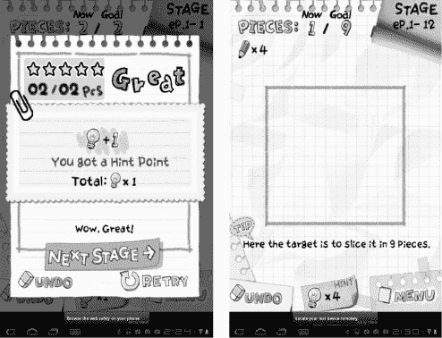

**图 22–8***。切吧！由 Com2Us*

这个游戏的机制很简单。给你一个形状，你用手指在这个形状上画一个虚拟的切口。说明书告诉你最后需要多少片，可以做多少片。图形是异想天开的，挑战开始很容易，但变得越来越困难。这个游戏对于成年人来说也是会上瘾的。