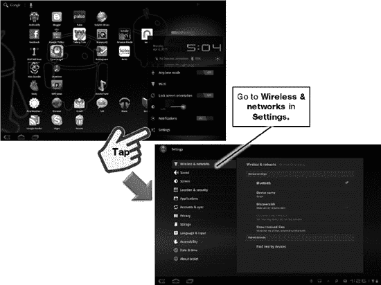
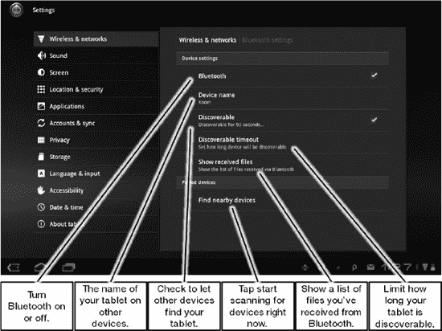
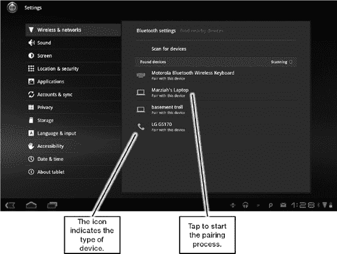
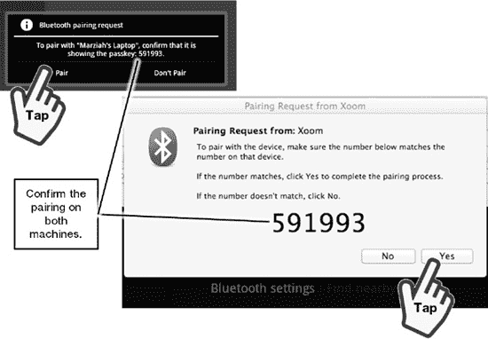
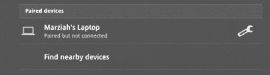
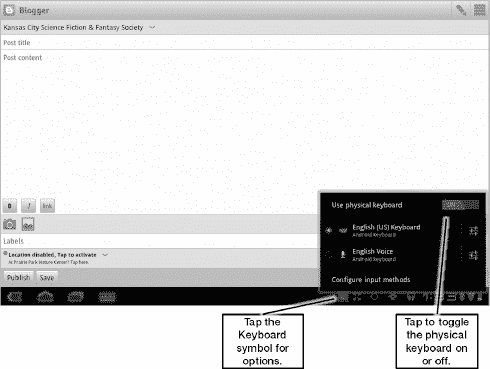
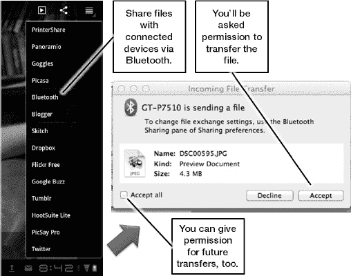
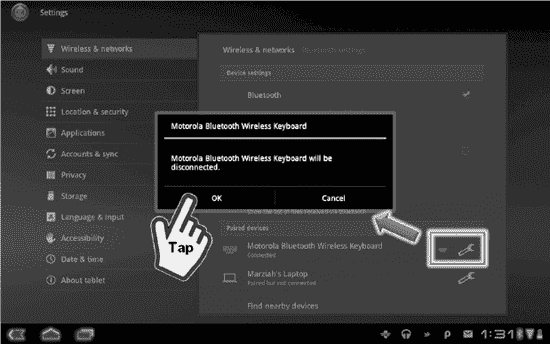

# 二十四、使用蓝牙连接键盘等设备

蓝牙是一种短程无线电，旨在作为一种有线替代技术。有了蓝牙，你可以做许多原本需要你插上电源才能完成的事情，比如将设备连接到键盘、鼠标、耳机和打印机。您还可以使用蓝牙在设备之间传输文件，而无需使用 USB 电缆。由于改进的蓝牙技术，你甚至可以用立体声听音乐。

蓝牙的名字来自于一个被认为团结了斯堪的纳维亚人的丹麦维京人:哈拉尔德·伯坦德国王。他的名字大致翻译为“蓝牙”这个想法是，就像国王 Blå tand 联合了丹麦，蓝牙技术联合了你所有的设备。

有很多技术术语与蓝牙技术相关，但是我不想用术语来让你陷入困境。本章将探讨如何通过蓝牙扩展您的平板电脑，以充分利用键盘和耳机等设备。您还将学习如何使用这项技术将文件传输到您的笔记本电脑上。

**注:**您必须拥有兼容的蓝牙适配器或设备，才能在平板电脑上播放音乐或使用键盘。并非所有设备都相互兼容；例如，一些键盘是为特定的平板电脑设计的。

### 打开蓝牙

如果您要在设备上使用蓝牙，您需要确保它已启用。按照以下步骤操作(参见图 24–1):

1.  点击平板电脑的右下角。
2.  点击**设置**。
3.  轻点**无线&网络**。
4.  如果尚未选中，点击**蓝牙**旁边的**复选框**图标。

**图 24–1。** *在设置菜单中进入蓝牙*

### 蓝牙模式

*蓝牙模式*决定设备之间如何互动，并控制打印、传输文件、播放声音和使用操纵杆等设备。为了兼容，两个项目必须理解相同的配置文件。这意味着你必须检查你的平板电脑和设备，以确保它们兼容。

大多数当前的平板电脑支持以下技术:

*   **A2DP(高级音频分发模式):**将音频流式传输至耳机。
*   **AVRCP(音频视频遥控模式):**使用遥控器控制您的平板电脑。
*   **OPP(对象推送模式):**将文件从一个设备传输到另一个设备。
*   **PBAP(电话簿访问模式):**访问或传送您的联系人列表。
*   **HID(人机界面设计):**用这个做键盘支持。

大多数平板电脑都支持这些技术，但一些设备可能会提供更多配置文件。冰淇淋三明治也增加了更多的轮廓支持。

### 蓝牙和配对

蓝牙可以与 30 英尺外的其他设备通信；但是，它必须知道与哪个设备通信。你不能让随机的设备互相控制和发送数据。两个蓝牙设备相互连接的过程称为*配对*。并非所有设备都相互兼容，因此并非所有设备都可以相互配对。

要开始将设备与平板电脑配对，请进入**设置**菜单的**无线&网络**区域，如图图 24–2 所示。

**图 24–2。** *了解设置应用中的蓝牙选项*

接下来，点击**查找附近设备**按钮，如图图 24–3 所示。

**图 24–3。** *定位附近设备*

你会看到不同的设备有不同的符号。让我们先来处理一个更复杂的配对。按照以下步骤将平板电脑与电脑配对:

1.  点击名称下方显示**的位置，与该设备配对。**
2.  确认两台设备的配对。这意味着您将检查以确保您的电脑和平板电脑之间的号码匹配；您还需要验证您想要配对两个设备(参见 Figure 24–4)。

**图 24–4。** *将平板电脑与电脑配对*

一旦您确认了两端的配对，您将看到在**配对设备**部分下列出的设备(参见图 24–5)。

**图 24–5***。平板电脑上的配对设备*

**注:**图 24–5 中的笔记本电脑被列为“已配对但未连接”像笔记本电脑和手机这样的设备在主动共享数据时是*连接的*。

你用同样的过程将平板电脑与手机配对；然而，有一个关键的细节你不要忘记:两个设备都需要是可被发现的。

您的平板电脑和手机通常都不可被发现，因此您需要点击**可被发现的**复选框(参见 Figure 24–2)。一旦一台设备发现了另一台设备，您就可以开始配对过程，并在两端进行确认，就像电脑配对一样。

### 与键盘和耳机配对

像键盘和耳机这样的配件使用简单得多的配对过程。您需要查看给定设备的用户手册，但大多数设备都有某种按钮，按下或按住该按钮会使配件进入**发现**模式。一旦你看到了这个设备(如图图 24–3 所示)，你只需要点击它就可以和你的平板电脑配对了。两端都不需要确认。

### 使用键盘

将键盘与平板电脑配对后，平板电脑会假设您希望在开机时随时使用物理键盘来输入文本。任何时候你通常会看到软键盘弹出，什么也不会发生。那是因为你需要开始在键盘上打字。

如果你想暂时关闭，点击屏幕底部的**键盘**符号，切换**使用物理键盘**设置(参见图 24–6)。

**图 24–6。** *使用物理键盘*

#### 遥控

请记住，支持的蓝牙模式之一 AVRCP 用于远程控制其他设备。许多键盘都提供播放媒体和音乐、启动应用程序、启动即时通讯或浏览网页的选项。

**注意:**如果您的平板电脑在与键盘配对时开始不稳定，请检查是否没有按下任何键。当我把键盘放在包里时，有时会发生这种情况。

您还可以使用遥控功能来控制许多蓝牙耳机和头戴式耳机上的播放。

### 传输文件

之前，我们将平板电脑与笔记本电脑配对。现在该给笔记本电脑发照片了。

不要使用 USB 线，点击**图库**应用中的**分享**按钮。你将看到可以通过不同的应用和服务共享此照片的所有方式。接下来，轻点**蓝牙**。

您将被要求在连接的设备上确认传输(参见 Figure 24–7)；但是，您也可以一次授予多个文件传输的权限。

**图 24–7。** *将文件传输到笔记本电脑*

### 解除蓝牙设备配对

在某些时候，你可能想断开蓝牙设备；按照以下步骤操作(参见图 24–8):

1.  进入**设置**菜单的**无线&网络**区域的**蓝牙设置**。您将看到所有配对的设备。
2.  点击**扳手**图标。
3.  点击**解除配对。**

**图 24–8***。从您的平板电脑上解除设备配对*