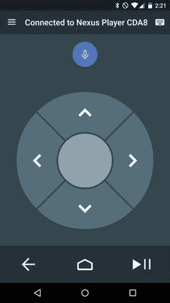
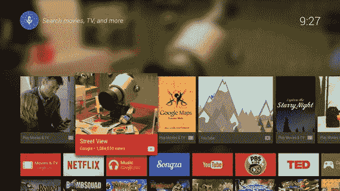
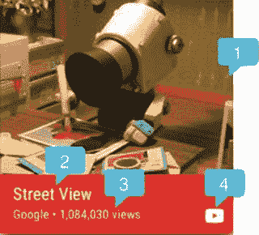
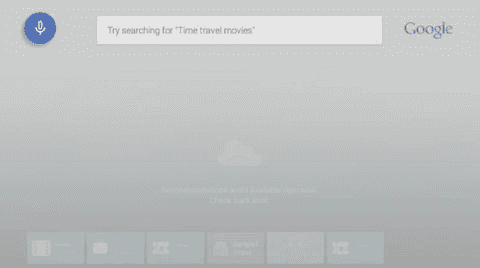

# 二、规划您的应用

就像任何电影或电视节目都必须有一个脚本一样，在开始编写应用之前，您应该有一个计划。虽然您可能熟悉手机和平板电脑的 Android 开发，但在为电视创建内容时，您需要考虑许多事情，这取决于您是在制作游戏、工具还是媒体应用。在这一章中，我们将探讨当你的用户在房间的另一边而不是在他们手中体验你的应用时，需要考虑的一些设计因素，以及在构建你的用户界面以支持基本的 Android 电视控制器时，你应该考虑什么。

## Android 电视主屏幕

当用户打开他们的 Android 电视时，他们首先看到的是主屏幕，主屏幕通过提供各种方式来发现内容并与他们的应用进行交互，从而充当他们电视的网关。在适用的情况下，你会希望尽可能地利用这些功能，以使你的应用更容易被用户看到。至少，你会希望使用一个专门为 Android TV 制作的应用图标，以便于用户识别你的应用。

主屏幕以行的形式显示给用户，这与上一章的 Hello World 应用有些相似(见图 2-1 )。顶行上方的部分包含时间和搜索按钮，可以通过物理 Android 电视遥控器上的麦克风按钮或 Play Store 的官方 Android 电视移动遥控应用来选择或激活该按钮(参见图 2-2 )。第二行显示从已安装的应用生成的推荐内容列表。建议部分下面是两行—顶部显示所有未配置为可玩游戏的已安装应用，底部显示所有游戏。已安装应用列表下方是设置和系统信息行。

图 2-2。

The Android TV remote control Android app

图 2-1。

The Android TV home screen

### 启动器图标

用户访问您的应用最常见的方式是从他们电视上已安装的应用列表中选择它。这意味着一旦你的应用被安装到用户的设备上，使用一个大小和样式都合适的启动图标对于帮助用户找到它是非常重要的。由于 Android TV 不会在图标下方显示应用的名称，因此您必须在启动器图标中包含应用的名称。你的启动器图标的大小应该是 320 像素 x 180px 像素，以便在主屏幕上正确显示。一旦你为你的启动器图标创建了一个素材，你将需要把它应用到你的`AndroidManifest.xml`文件中的启动活动中，类似于一个标准的 Android 应用。需要注意的是，类别选项将使用`LEANBACK_LAUNCHER`而不是标准的`LAUNCHER`来显示电视启动器图标。如果您正在构建一个游戏，您还需要将`isGame="true"`属性添加到应用节点，以便主屏幕将您的启动器图标放在游戏行中。

`<application`

`android:label="@string/app_name"`

`android:icon="@mipmap/ic_launcher"`

`android:theme="@style/AppTheme">`

`<activity`

`android:name="MainActivity"`

`android:label=“@string/app_name">`

`<intent-filter>`

`<action android:name="android.intent.action.MAIN" />`

`<category android:name="android.intent.category.LEANBACK_LAUNCHER" />`

`</intent-filter>`

`</activity>`

`</application>`

### 建议行

推荐行是 Android TV 主屏幕上的第一行，如图 2-1 所示，是让用户对你的应用感兴趣的最简单的方法。开发人员可以推荐三类内容:延续、相关和新内容。当您从应用创建要在主屏幕推荐行上显示的推荐列表时，您应该根据与过去消费行为的相关性来确定要显示的内容。如果您的用户以前在您的应用中观看过某个节目，您可以提供继续推荐，显示他们没有看完的一集，或者推荐该节目的下一集。您还可以显示相关的推荐，介绍您的用户基于以前观看的媒体可能喜欢的新内容。可以推荐的最后一类内容属于新的类别。这是突出特色媒体和介绍用户可能喜欢的内容的绝佳位置。当显示新的内容推荐时，你应该小心不要意外泄露任何可能破坏兴趣的剧透。您还应该注意相关和延续建议，因为相关行在 Android TV 上对所有用户都可见，因此应该适合所有年龄层。

Android TV 在整个平台上使用简单易消化的卡片格式向用户显示信息，如图 2-3 所示。

图 2-3。

Recommendation card. The number 1 designates the large icon, 2 is the title, 3 is the content text, and 4 is the small icon

虽然已经为您设置了这种格式，但是您仍然可以定制卡片以适合您自己的应用。每张卡片都包含一张显示图片，该图片应能对推荐内容一目了然。该显示图像的高度应为 176dp 或更高，宽度应为高度的 2/3 到 4/3。当用户滚动推荐的内容时，突出显示的项目将展开以显示卡片的其余部分。你可以改变卡片的背景颜色，尽管它应该很好地补充白色文本。您还需要在卡片上添加一个代表您的应用的小图标。这个小图标在`#EEEEEE`里应该是一个 16dp x 16dp 的 PNG，背景和前景都是透明的。

您可以在推荐卡中显示两条文本信息:标题和内容文本。标题应该是内容的主要描述符，如歌曲或电影标题。在可选的内容文本中，您可以告诉用户一些关于内容的信息，例如为什么向他们显示内容。内容文本可能有用的一个例子是当显示来自体育赛事的视频馈送时。如果事件当前正在进行，或者事件已经结束，并且您可以回放录像，这些都是用户可能想要了解并引起足够兴趣来打开您的应用的优秀信息。

除了显示卡，您还可以根据突出显示的推荐更改主屏幕上的背景。这不仅可以让你给你的应用推荐一个时尚的风格，还提供了另一种方式来吸引你的用户，给他们更多关于内容的信息。使用大的背景图片为你的用户描绘一幅图画比用一段文字描述内容更能引起他们的兴趣。此图像应为 2016px x 1134px (1920 x 1080，留有 5%的页边距)，并且不同于您的标准显示图像。应该注意的是，如果图像的大小不正确，系统将试图缩放它以适合，这可能会产生不期望的结果，例如降低图像质量。

一旦您的用户开始从您的应用中查看媒体，您就可以提供一个“正在播放”卡片，它看起来与标准推荐卡片相同，但还包括一个进度条。这张卡片不仅为您的用户提供有用的信息，而且它还作为推荐行中的第一张卡片出现，有助于保持用户参与度。如果使用得当，推荐行提供了一种强大的方式，让用户打开你的应用，因为他们知道有什么内容可供欣赏。在本书的后面，你将学习如何在一个工作媒体应用中实现一个简单的推荐服务。

### 全局搜索

当用户对他们正在寻找的东西有一些想法时，比如一部特定的电影，找到一个有该内容的应用可能会很麻烦。幸运的是，Android TV 提供了一个搜索选项，可以同时搜索多个应用，因此用户可以快速找到他们想要的东西。通过按下遥控应用上的麦克风按钮，或导航到主屏幕顶部的搜索球，用户可以进入搜索 UI，在那里他们可以说出或键入他们要找的内容(见图 2-4 )。当用户执行搜索时，Android TV 上所有可搜索的应用都将运行查询并返回相关内容(如果有)。一旦结果被显示给用户，他们可以被选择以直接链接到期望的媒体。通过使您的应用可搜索，您可以增加应用的可见性，从而提高用户参与度。

图 2-4。

Android TV home screen search box

## 用户体验指南

既然你已经知道如何使用主屏幕来吸引用户，你需要一个设计良好的应用，易于使用，视觉上有吸引力，以保持他们的参与。重要的是要认识到，电视比智能手机和平板电脑存在的时间要长得多，因此用户对他们的电视体验会有一个预定义的期望。谷歌建议你的应用遵循三个主要理念:允许随意消费，提供电影体验，保持简单。

### 休闲消费

智能手机或平板电脑与电视的主要区别在于，电视是专门用作娱乐设备的。为了适应电视的理想用例，您应该了解您的应用的总体目标，并帮助您的用户尽快实现该目标。如果你的应用是用来显示媒体的，那么你应该把你的应用设计成只需要点击几下就可以获得用户想看的内容并开始播放。如果你正在开发一个游戏，那么你应该给你的用户一个身临其境的体验，让他们玩你的游戏，而不会用许多与游戏不直接相关的内容来分散他们的注意力。适合在一个房间里与多人互动的应用，如聚会游戏或卡拉 ok 应用，应该为用户提供他们需要的信息，同时让他们专注于更重要的事情，房间里的其他人。

### 电影体验

你希望你的用户沉浸在你的应用中。如果可能的话，使用音频和视频提示来告诉你的用户你的应用正在发生什么，而不是通过文本来告诉他们。例如，如果你的用户到达了列表的末尾，Android 倾向于在最后一个项目上提供一个发光的效果。你也可以提供一个听得见的叮声来增加更多的体验。因为 Android 电视设备都运行最低限度的 Lollipop (SDK 21)，所以当用户浏览你的应用时，你可以使用大量的动画和过渡来取悦他们。虽然动画可能很有趣，但是您应该尝试在每个屏幕上提供尽可能多的内容，并限制用户为了达到他们的目标而必须查看的屏幕数量。

### 保持简单

这是最重要的设计准则，也是 Android 电视设计的首要主题。当您的用户坐在电视机前时，他们希望能够快速找到一些东西来观看或开始玩游戏。为了帮助你的用户，在进入你的应用和欣赏内容之间保持最少的屏幕数量。尽量避免要求任何类型的文本输入，并且在必须输入数据的情况下总是提供语音输入选项。请记住，大多数用户将使用简单的 D-pad 控制器与他们的电视进行交互，该控制器带有一个选择按钮，该按钮来自他们的 Android 电视附带的遥控器或遥控器应用。UI 模式应该易于导航，只有几个可用的按钮。确保你不只是从触摸屏设备上复制 UI，而是尝试使用主屏幕上看到的行列表模式。在手机和平板电脑上有效的东西不一定能很好地移植到电视上。你的应用越简单，你的用户就越高兴。

## 设计您的布局

电视应用设计的好坏，最重要的决定因素之一是屏幕看起来有多杂乱。你如何分隔你的内容，屏幕上有多少项目，以及这些项目的大小都有助于你的用户界面的整洁。虽然电视不断变大并支持更高的分辨率，但坚持使用质量更高的较少可视项目总是比许多不那么吸引人的项目更好。你所有的布局都应该设计成横向模式，因为大多数家庭电视不支持纵向观看。同样，任何导航 UI 组件都应该占据屏幕的左边或右边，这样可以节省显示内容的垂直空间。最后，你应该始终确保你有足够的空白空间，使项目不反对或超出屏幕的边缘。

一般规则是在布局边缘增加 10%的边距，以考虑过扫描，过扫描是指可能位于屏幕可视边界之外的电视区域。虽然这可能看起来需要考虑很多，但如果你正在构建一个媒体播放应用，Android Leanback 支持库已经将布局设计准则考虑在内，并为你处理它们。

### 染色

虽然电脑显示器和移动设备在不同设备上显示颜色时往往相当一致，但电视不提供这种奢侈，在为应用选择颜色时应采取特殊预防措施。不同类型的电视，如等离子电视或液晶电视，由于技术的固有属性或应用的锐化和平滑滤镜，其显示颜色的方式可能会有所不同。最重要的是，亮度或色调的细微差异在一些设备上要么无法区分，要么被过度强调。避免在大面积屏幕上使用白色(`#FFFFFF`)，因为在明亮的屏幕上显示会对眼睛造成刺激。你还应该对照各种电视和设置检查非常暗或高度饱和的颜色，以确保它们符合你的期望。谷歌建议使用比移动设备上使用的颜色暗两到三级的颜色。它还建议从 [`www.google.com/design/spec/style/color.html#color-color-palette`](http://www.google.com/design/spec/style/color.html%23color-color-palette) 的谷歌调色板中选择 700-900 范围内的颜色。

### 使用文本

虽然通常应该避免使用文本来保持身临其境的体验，但也有一些地方需要使用文本。假设用户平均坐在离电视机大约 10 英尺(3 米)远的地方，设计易读的文本是很重要的。你需要将文本分成小块，以便于阅读。文本最好是深色背景上的浅色，你应该避免像 Roboto Light 这样的细字体，因为电视设置可能会使它们不可读。虽然您应该使用的最小尺寸是 12sp，但 Android TV 的推荐默认尺寸是 18sp。谷歌还为媒体应用的不同部分收集了一套推荐尺寸:

*   卡片上的标题应该用 Roboto 缩略为 16 便士
*   卡片上的字幕应该使用 12sp 的自动字幕
*   浏览屏幕上的标题应该使用 44sp 的 Roboto Regular
*   浏览屏幕上的类别标题应该使用 Roboto 来压缩为 20sp
*   媒体详细信息屏幕上的内容标题应使用 34sp 的 Roboto Regular
*   详细信息屏幕上的描述文本应使用 14sp

您应该注意到，sp 中列出了所有字体大小，这是一个专门针对文本的与密度无关的大小量词。这允许操作系统确定给定设备上的合适大小。虽然这看起来需要记住很多，但是向后倾斜支持库类包含了自己的风格，可以为您处理这种逻辑。

## 其他考虑因素

虽然理解设计准则很重要，但是在构建应用之前，您还需要考虑其他一些事情。

*   如果你正在为 Android TV 开发一款游戏，你可能想研究一下 Google Play 游戏服务，因为谷歌已经整合了一套令人印象深刻的工具来使游戏开发更快更容易: [`developers.google.com/games/services/`](https://developers.google.com/games/services) 。
*   如果您正在构建一个媒体应用，您应该考虑您的媒体来自哪里。您是在自己的服务器上托管所有内容，还是聚合多个服务？你如何处理突发事件，比如没有互联网连接，或者服务器没有返回内容？您还需要考虑如何格式化您的内容，以确保它可以在 Android TV 设备上播放。你可以在谷歌官方文档页面找到 Android 支持的媒体格式列表: [`developer.android.com/guide/appendix/media-formats.html`](https://developer.android.com/guide/appendix/media-formats.html) 。
*   如果您的内容是通过要求使用自己的媒体播放器软件的专有第三方提供的，您需要确保它支持使用 Android TV D-pad 控制器。
*   如果你需要支持数字版权管理(DRM)，那么你可能会发现 Android DRM 文档很有用: [`source.android.com/devices/drm.html`](https://source.android.com/devices/drm.html) 。

一旦你意识到所有的需求，你就可以选择如何显示你的内容。虽然你的要求可能排除了这种可能性，但谷歌确实提供了一款出色的开源媒体播放器，名为 ExoPlayer，它支持目前在`MediaPlayer`类中不可用的功能: [`developer.android.com/guide/topics/media/exoplayer.html`](https://developer.android.com/guide/topics/media/exoplayer.html) 。

虽然这些主题超出了本书的范围，但是回顾它们是很重要的，以确保在开发最终产品时你的时间是值得的。

## 摘要

在本章中，你学习了 Android TV 主屏幕的各个部分，以及如何抓住用户对你的应用的兴趣。您还了解了与 Android TV 相关的设计原则，以及 Google 为使您的应用具有视觉吸引力而提供的建议。在下一章中，你将开始构建一个非常基本的媒体播放应用，以了解向后倾斜支持库的一些关键部分，以及如何使用它们来构建一个 Android TV 应用。