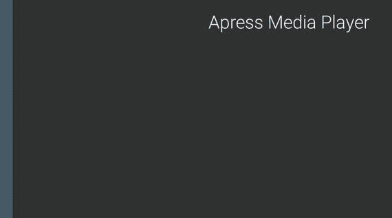
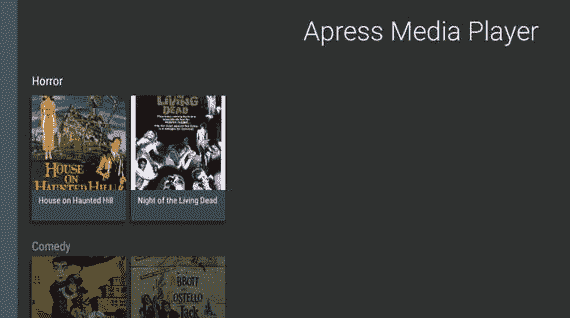
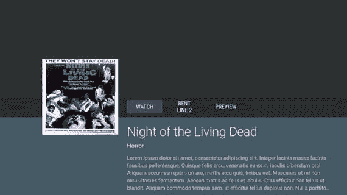
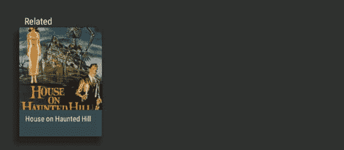
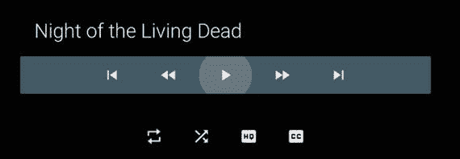

# 三、构建媒体应用

毫无疑问，开发人员为电视开发的最常见的应用只是显示和播放媒体。了解到这一点，谷歌创建了 Leanback 支持库，它为创建完全符合 Android TV 设计准则的应用提供了通用组件。在这一章中，你将从头开始创建一个基本的媒体应用，以便了解一些可用于为用户创建简单而愉快的体验的组件。

## 项目设置

当您在第一章中创建 Hello World 应用时，您可能会注意到示例应用相当大，并且您很可能会看到一些关于在内容细节片段等区域使用不推荐使用的类的警告。为了更好地理解如何创建一个媒体应用，而不需要筛选杂乱的内容，您将从空白的石板上一点一点地创建一个。虽然还可以做更多的事情来真正让应用发光，但这本书专注于要点，以便在教授主题时不会陷入细节，这些细节最好作为一个有趣的练习。

### 创建 Android Studio 项目

首先打开 Android Studio，进入欢迎使用 Android Studio 屏幕。一般来说，这将是您打开程序时看到的第一个屏幕，但是如果您之前打开了一个项目(如 Hello World)，那么您需要关闭它以返回到欢迎屏幕。点击右边面板中的 Start a New Android Studio Project，进入配置您的新项目屏幕。在“应用名称”字段中，输入 Media Player，并为公司域输入 [`apress.com`](https://apress.com) 。选择项目位置的路径，然后单击下一步。

在下一个屏幕上，你需要选择你的应用支持的外形。对于媒体播放器，选择电视，将最低 SDK 设置为 API 21: Android 5.0(棒棒糖)。在同一屏幕上，取消选择电话和平板电脑项目，然后单击下一步。

在第一章中，您让 Android Studio 创建了一个 Android TV 活动，这反过来又创建了一个完整的 Android TV 演示应用。对于媒体播放器应用，单击不添加活动，然后单击完成。当 Android Studio 创建项目时，您将拥有应用的基础结构，但它将几乎没有源文件。

### 更新相关性

你要做的第一件事是打开`build.gradle`文件。虽然对 Gradle 构建系统的详细介绍超出了本书的范围，但是您只需要在这个项目中使用它来添加依赖项。在 Dependencies 节点中，您应该已经看到了导入 Leanback 支持库和 RecyclerView 库的行。您还需要导入 GSON 库和 Picasso 库，前者用于从 JSON 数据创建对象，后者用于从 Square 轻松显示应用中来自互联网的图像。在撰写本文时，以下代码清单中显示的每一项都是库的最新版本。

`dependencies {`

`compile fileTree(dir: 'libs', include: ['*.jar'])`

`compile 'com.google.code.gson:gson:2.3'`

`compile 'com.squareup.picasso:picasso:2.5.2'`

`compile 'com.android.support:leanback-v17:23.0.1'`

`compile 'com.android.support:recyclerview-v7:23.0.1'`

}

Tip

Square 提供了各种各样的开源库，在创建应用时会很有用。你可以在 [`http://square.github.io/`](http://square.github.io) 找到他们发布的库列表。

### 构建项目框架

一旦你完成了`build.gradle`的更新，如果你在项目导航布局中，导航到左侧导航面板中的`app/src/main/java`(如果你在 Android 导航布局中，导航到`app/java`)。在 Android Studio 中，右击包名，转到 New 和 Java Class。将新的 Java 类命名为`MainActivity`，并单击 OK。您将希望`MainActivity`扩展`Activity`，然后您将覆盖`onCreate`来将活动与布局文件相关联。

`public class MainActivity extends Activity {`

`@Override`

`protected void onCreate(Bundle savedInstanceState) {`

`super.onCreate(savedInstanceState);`

`setContentView( R.layout.activity_main );`

}

}

`MainActivity`将是你的用户进入你的应用时看到的第一个活动。因此，您需要在`AndroidManifest.xml`中声明它，并将其标记为主活动和启动活动。

最后，您需要在`manifest`标签内的`AndroidManifest.xml`顶部添加三行。第一个声明应用需要有`INTERNET`权限。接下来的两项说明了使用该应用时设备需要哪些功能。在本例中，您将设置应用，使其不需要`touchscreen`，但需要`Leanback`功能。这将使您的应用可以安装在 Android 电视系统上。

`<manifest xmlns:android="`??`http://schemas.android.com/apk/res/android`

`package="com.apress.mediaplayer">`

`<uses-permission android:name="android.permission.INTERNET" />`

`<uses-feature`

`android:name="android.hardware.touchscreen"`

`android:required="false" />`

`<uses-feature`

`android:name="android.software.leanback"`

`android:required="true" />`

`<application android:allowBackup="true" android:label="@string/app_name"`

`android:icon="@mipmap/ic_launcher" android:theme="@style/AppTheme">`

`<activity`

`android:name="MainActivity"`

`android:label="@string/app_name"`

`android:logo="@mipmap/ic_launcher">`

`<intent-filter>`

`<action android:name="android.intent.action.MAIN" />`

`<category android:name="android.intent.category.LEANBACK_LAUNCHER" />`

`</intent-filter>`

`</activity>`

`</application>`

`</manifest>`

现在您的清单已经设置好了，您需要为`MainActivity`创建一个布局文件。右键单击 Android Studio 左侧导航窗格中的`app/src/main/res`(同样，假设您在项目导航布局中)并创建一个名为`layout`的新 Android 资源目录。接下来，您需要右键单击`layout`并创建一个名为`activity_`?? 的新布局资源文件。该布局文件将由单个项目组成。

`<?xml version="1.0" encoding="utf-8"?>`

`<fragment xmlns:android="`??`http://schemas.android.com/apk/res/android`

`android:id="@+id/main_browse_fragment"`

`android:name="com.apress.mediaplayer.MainFragment"`

`android:layout_width="match_parent"`

`android:layout_height="match_parent" />`

您会注意到这个片段使用了`name`属性来指向`com.apress.mediaplayer.MainFragment`。`MainFragment`将是`BrowseFragment`类的扩展，该类由向后倾斜支持库提供。`BrowseFragment`将允许你显示代表你的应用内容、偏好和搜索选项的项目行。现在，通过右键单击`app/src/main/java`下的应用包名称并创建一个名为`MainFragment`的新 Java 类来创建`MainFragment`。一旦文件被创建，让它扩展`BrowseFragment`。

`public class MainFragment extends BrowseFragment { }`

此时，您应该可以毫无问题地运行您的应用了，尽管它只会显示一个黑屏，在左侧有一个蓝绿色面板(称为快速通道)。接下来，您将开始构建`BrowseFragment`类，该类将使用本地数据文件和模型通过 presenter 显示卡片。

## 构建 BrowseFragment 类

由向后倾斜支持库提供的`BrowseFragment`类构成了 Android 电视媒体应用的核心部分之一。虽然它在使用中充当单个片段，但实际上它由两个片段组成:一个`RowsFragment`和一个`HeadersFragment`。`RowsFragment`显示代表您的内容的定制卡片行，每行上面都有一个标题，通常用于显示类别名称。这些标题也用于填充`HeadersFragment`，它构成了您运行应用时看到的蓝绿色快速通道面板。

### 创建数据

在您开始在`BrowseFragment`中工作之前，您需要为您想要显示给用户的内容规划数据。在生产应用中，您很可能希望将这些数据存储在网上的某个地方，或者有一个 API 将这些数据传送到您的应用，以便您可以根据用户的使用习惯轻松传送新内容或调整用户看到的内容。为了降低复杂性并专注于 Android TV 平台，您正在构建的媒体播放器应用将简单地将内容数据存储在应用内的 JSON 文件中，并将其读入`BrowseFragment`。在`Data`文件夹中可以找到本书代码样本的样本数据文件。JSON 数组中的每一项都代表公共领域中的一部不同的电影。本教程使用的字段是“标题”、“描述”、“视频 Url”、“类别”和“海报”。如果您想使用自己的内容或将自己的内容添加到数据中，只需遵循以下项目格式:

{

`"title": "Content title",`

`"description": "Some long text description",`

`"videoUrl": "Video URL",`

`"category": "Category",`

`"poster": "Image file URL"`

}

Note

样本数据中使用的电影都是公共领域的，用于播放的视频文件由公共领域内容的非营利性互联网档案库`archive.org`托管。

一旦你有了你的数据文件，把它命名为`videos.json`，并把它放在一个名为`raw`的新目录下`/app/src/main/res`。

### 创建数据模型

接下来，您需要创建一个模型对象类来表示应用中使用的数据。这个模型需要实现`Serializable`，以便将数据转换成可以在应用组件之间传递的字符串表示。您还将使用 Google 的 GSON 库来获取 JSON 文件，并轻松地将其解析为一个对象列表，因此您将需要模型中每个属性的 setters 和 getters。

在`app/src/main/java`目录下的 app package 文件夹下创建一个新的 Java 文件，并将其命名为`Video`。一旦创建了`Video.java`，就为每个数据属性添加字符串、`toString`方法以及 getters 和 setters，如下所示。

`public class Video implements Serializable {`

`private String title;`

`private String description;`

`private String videoUrl;`

`private String category;`

`private String poster;`

`@Override`

`public String toString() {`

`return "Video {" +`

`"title=\'" + title + "\'" +`

`", description=\'" + description + "\'" +`

`", videoUrl=\'" + videoUrl + "\'" +`

`", category=\'" + category + "\'" +`

`", poster=\'" + poster + "\'" +`

`"}";`

}

`public String getTitle() {`

`return title;`

}

`public void setTitle(String title) {`

`this.title = title;`

}

`public String getDescription() {`

`return description;`

}

`public void setDescription(String description) {`

`this.description = description;`

}

`public String getVideoUrl() {`

`return videoUrl;`

}

`public void setVideoUrl(String videoUrl) {`

`this.videoUrl = videoUrl;`

}

`public String getCategory() {`

`return category;`

}

`public void setCategory(String category) {`

`this.category = category;`

}

`public String getPoster() {`

`return poster;`

}

`public void setPoster(String poster) {`

`this.poster = poster;`

}

}

### 加载数据

现在您有了一个表示数据的模型，您可以在您的`BrowseFragment`中使用它。您需要做的第一件事是在`MainFragment`类的顶部创建一个`Video`对象的列表，以便存储您的数据。

`private List<Video> mVideos = new ArrayList<Video>();`

接下来您应该覆盖`onActivityCreated`方法，因为这将驱动片段中的大部分逻辑。在`onActivityCreated`中，您应该调用`loadData`，这是您将创建的一个帮助器方法，以便将数据加载到`mVideos`中。

`@Override`

`public void onActivityCreated(Bundle savedInstanceState) {`

`super.onActivityCreated(savedInstanceState);`

`loadData();`

}

在定义`loadData`之前，您应该在您的应用包文件夹中创建一个新的 Java 类，名为`Utils. Utils`，它将包含一个名为`loadJSONFromResource`的静态方法，该方法接受本地 JSON 文件的上下文和资源 ID，在本例中为`videos.json`，这样它就可以被转换成一个字符串并返回。在`Utils`包中输入以下代码，然后返回`MainFragment`。

`public class Utils {`

`private Utils() {}`

`public static String loadJSONFromResource( Context context, int resource ) {`

`if( resource <= 0 || context == null )`

`return null;`

`String json = null;`

`InputStream is = context.getResources().openRawResource( resource );`

`try {`

`if( is != null ) {`

`int size = is.available();`

`byte[] buffer = new byte[size];`

`is.read(buffer);`

`json = new String(buffer, "UTF-8");`

}

`} catch( IOException e ) {`

`return null;`

`} finally {`

`try {`

`if( is != null )`

`is.close();`

`} catch( IOException e ) {}`

}

`return json;`

}

}

现在，您已经有了一个方法来读取之前创建的 JSON 文件，是时候使用它了。在`MainFragment`中创建一个名为`loadData`的新方法，并让它从`Utils.`?? 生成一个字符串。接下来你需要使用反射和 GSON 库来填充你的视频对象列表，这样它们就可以用来填充你的`BrowseFragment` UI。

`private void loadData() {`

`String json = Utils.loadJSONFromResource( getActivity(), R.raw.videos );`

`Type collection = new TypeToken<ArrayList<Video>>(){}.getType();`

`Gson gson = new Gson();`

`mVideos = gson.fromJson( json, collection );`

}

当您将数据加载到片段中之后，您就可以开始为您的 Android TV 媒体应用创建 UI 了。在下一节中，您将为`BrowseFragment`设置一些 UI 属性，然后使用您刚刚生成的视频列表来创建定制的卡片行，您可以单击这些卡片来访问视频详细活动。

### 自定义 BrowseFragment UI

如果你阅读 Google ( [`developer.android.com/reference/android/support/v17/leanback/app/BrowseFragment.html`](https://developer.android.com/reference/android/support/v17/leanback/app/BrowseFragment.html) )的`BrowseFragment`文档页面，你会注意到有几种方法可以定制片段的一些 UI 方面。为了简单起见，我们在这里只涉及其中的一部分。在`onActivityCreated`中，在您对`loadData`的调用下面，添加以下三行代码

`setTitle( "Apress Media Player" );`

`setHeadersState( HEADERS_ENABLED );`

`setHeadersTransitionOnBackEnabled( true );`

这些方法中的每一个都控制着`BrowseFragment` UI 中不同的可定制部分:

*   `setTitle`方法将获取传递给它的字符串，并将其显示在`BrowseFragment`的右上角。
*   Using `setHeadersState` accepts one of three predefined values in `BrowseFragment` that will allow you to control how the `HeaderFragment` fastlane works. `HEADERS_ENABLED` leaves the fastlane usable and expanded, `HEADERS_DISABLED` will hide and disable it (see Figure 3-1), and `HEADERS_HIDDEN` will enable the `HeaderFragment` while mostly hiding it except for a sliver on the side of the screen.

    

    图 3-1。

    BrowseFragment with hidden fast lane
*   最后，虽然默认情况下启用了后台操作上的头转换，但是我在这里包含了它，因为需要指出这一点。当用户打开`HeadersFragment`时，一个条目将被添加到后台堆栈中。这意味着当用户按下控制器上的 back 按钮时，headers 部分将会转换。如果你想覆盖 back 按钮操作，你需要调用值为`false`的`setHeadersTransitionOnBackEnabled`，然后覆盖`BrowseTransitionListener`来实现你自己的 back stack 处理。

现在您已经设置了一些`BrowseFragment` UI 属性，是时候为您的数据添加卡片行了。`BrowseFragment`显示内容行的方式是通过一个`ObjectAdapter`并在一个垂直列表中显示内容列表(行)。一行中的每一项都与一个`Presenter`对象相关联，该对象定义了每一项在 UI 中的外观，在本例中是一张带有图像和电影标题的卡片。每一行的上方都有一个标题，代表数据集中视频的类别。

在`MainFragment`的`onActivityCreated`方法中，添加一个对名为`loadRows`的新助手方法的方法调用，不带参数。接下来您将定义`loadRows`。新方法中的第一行将用包含每一行的`ListRowPresenter`初始化一个`ArrayObjectAdapter`。`ListRowPresenter`用于定义一行项目将如何在`BrowseFragment`中工作。在初始化`ArrayObjectAdapter`之后，您将想要创建一个名为`CardPresenter. CardPresenter`的新对象，这是您将在本节稍后创建的一个类，所以现在您可以忽略 Android Studio 给出的错误。

`private void loadRows() {`

`ArrayObjectAdapter adapter =`

`new ArrayObjectAdapter( new ListRowPresenter() );`

`CardPresenter presenter = new CardPresenter();`

接下来，您需要创建一个字符串对象列表，代表您的视频类别。这些类别中的每一个都将在一行之上使用，以帮助为用户组织内容。这里您将使用另一个名为`getCategories`的助手方法，它将遍历数据中的每个视频项，并将其类别添加到一个列表中。虽然这可能不是创建类别列表的最有效方式，但它适合这里的目的。

`List<String> categories = getCategories();`

`if( categories == null || categories.isEmpty() )`

`return;`

其中`getCategories`定义为

`private List<String> getCategories() {`

`if( mVideos == null )`

`return null;`

`List<String> categories = new ArrayList<String>();`

`for( Video movie : mVideos ) {`

`if( !categories.contains( movie.getCategory() ) ) {`

`categories.add( movie.getCategory() );`

}

}

`return categories;`

}

现在您已经有了一个类别列表，您可以使用`CardPresenter`类创建卡片，并根据每个数据项的类别将它们添加到`BrowseFragment`中的行。为简单起见，您将遍历类别列表，并检查每个数据项以查看类别是否匹配。如果有，你将把它添加到一个新的`ArrayObjectAdapter`。一旦一个类别的所有电影都被添加到新的适配器中，您将创建一个新的`HeaderItem`，并使用它和`ArrayObjectAdapter`来创建一个新的项目行。最后，您将调用`setAdapter`，一个内置于`BrowseFragment`的方法，来添加您首先在`loadRows`中创建的父`ArrayObjectAdapter`，作为片段的主适配器。

`for( String category : categories ) {`

`ArrayObjectAdapter listRowAdapter = new ArrayObjectAdapter( presenter );`

`for( Video movie : mVideos ) {`

`if( category.equalsIgnoreCase( movie.getCategory() ) )`

`listRowAdapter.add( movie );`

}

`if( listRowAdapter.size() > 0 ) {`

`HeaderItem header = new HeaderItem( adapter.size() - 1, category );`

`adapter.add( new ListRow( header, listRowAdapter ) );`

}

}

`setAdapter(adapter);`

### 创建演示者

即使为`BrowseFragment`创建项目行的所有逻辑都已完成，您仍然需要创建`CardPresenter`对象来编译您的应用并显示数据。`CardPresenter`将是`Presenter`的扩展，存在于向后倾斜支持库中。`Presenter`的目的是获取数据并将其绑定到视图，类似于 RecyclerView 中适配器的概念，但不依赖于位置。如果您以前使用过 RecyclerViews，这个类应该看起来有些熟悉。

`public class CardPresenter extends Presenter {`

`static class ViewHolder extends Presenter.ViewHolder {`

`private ImageCardView mCardView;`

`public ViewHolder(View view) {`

`super(view);`

`mCardView = (ImageCardView) view;`

}

`public ImageCardView getCardView() {`

`return mCardView;`

}

`public void updateCardViewImage( Context context, String link ) {`

`Picasso.with(context).load(link)`

`.resize(210, 210).centerCrop()`

`.into(mCardView.getMainImageView());`

}

}

`@Override`

`public ViewHolder onCreateViewHolder(ViewGroup parent) {`

`ImageCardView cardView = new ImageCardView( parent.getContext() );`

`cardView.setFocusable( true );`

`return new ViewHolder(cardView);`

}

`@Override`

`public void onBindViewHolder(Presenter.ViewHolder viewHolder, Object item) {`

`Video video = (Video) item;`

`if ( !TextUtils.isEmpty(video.getPoster()) ) {`

`((ViewHolder) viewHolder).mCardView`

`.setTitleText(video.getTitle());`

`((ViewHolder) viewHolder).mCardView`

`.setMainImageDimensions( 210, 210 );`

`( (ViewHolder) viewHolder )`

`.updateCardViewImage( ( (ViewHolder) viewHolder )`

`.getCardView().getContext(), video.getPoster() );`

}

}

`@Override`

`public void onUnbindViewHolder(Presenter.ViewHolder viewHolder) {`

}

`@Override`

`public void onViewAttachedToWindow(Presenter.ViewHolder viewHolder) {`

}

}

Note

RecyclerViews 仍然是 Android 开发中相对较新的内容。如果你以前没有和他们一起工作过，我强烈推荐戴夫·史密斯的《安卓秘籍，第四版》。也是由 Apress 出版的，它包含了许多 Android 开发的惊人例子，包括一个关于 RecyclerView 的强大部分。

虽然`Presenter`在幕后完成了大部分工作，但你可以看到仍有一些定制工作需要完成。`Presenter`类需要使用`ViewHolder`模式，以便在包含多个条目的行之间循环时重用视图。之前使用的`ViewHolder`包含一个单独的`ImageCardView`，这是一个专门为 Android TV 设计的视图，包含一个大图像和该图像下方的一个预先设计好的信息卡片。为了从存储为 URL 的数据中加载海报图像，您将使用 Picasso library by Square 来加载图像、调整图像大小和居中裁剪图像。

定义了您的`ViewHolder`之后，您需要在`onCreateViewHolder`中创建它，并将其设置为可聚焦的，这允许它被用户高亮显示。当`ViewHolder`被创建后，你可以将它归还给`Presenter`使用。您需要在`Presenter`中覆盖的最后一个方法是`onBindViewHolder`。顾名思义，这是将数据绑定到`ViewHolder`视图的地方，这样`CardPresenter`就能正确显示。

此时，您应该能够在 Android TV 设备或模拟器上编译和运行您的应用。你应该会看到代表`videos.json`的数据项的行，以及每组视频的类别标题，如图 3-2 所示。虽然还可以对`BrowseFragment`进行更多的定制，但我们将把它留到本书的下一章。

图 3-2。

BrowseFragment with cards for each piece of media

## 创建视频详细信息屏幕

虽然`BrowseFragment`旨在让你的用户快速了解他们可以享受什么，但`DetailsFragment`旨在专注于一个项目。该详细屏幕不仅为用户提供了更多的内容信息，还允许他们执行各种操作和查看相关内容。

### 设置视频详细信息

您可以通过在您的媒体播放器包中创建一个新的 Java 文件并将其命名为`VideoDetailsActivity`来开始构建您的详细信息屏幕。像`MainActivity`，`VideoDetailsActivity`将简单地为包含片段的内容视图设置一个布局。

`public class VideoDetailsActivity extends Activity {`

`@Override`

`public void onCreate(Bundle savedInstanceState)`

{

`super.onCreate(savedInstanceState);`

`setContentView(R.layout.activity_video_details);`

}

}

您还需要创建正在使用的布局文件。进入`res/layout`目录，创建一个名为`activity_video_details`的新 XML 文件。这个布局将只包含一个名为`VideoDetailsFragment`的片段。

`<?xml version="1.0" encoding="utf-8"?>`

`<fragment xmlns:android="`??`http://schemas.android.com/apk/res/android`

`xmlns:tools="`??`http://schemas.android.com/tools`

`android:id="@+id/video_detail_fragment"`

`android:name="com.apress.mediaplayer.VideoDetailsFragment"`

`android:layout_width="match_parent"`

`android:layout_height="match_parent"`

`tools:deviceIds="tv"`

`tools:ignore="MergeRootFrame" />`

现在您已经有了一个带有布局的活动，您将需要在您的 Java 应用包目录中创建`VideoDetailsFragment`。当文件被创建时，让它扩展`DetailsFragment`并实现`OnItemViewClickedListener`和`OnActionClickedListener`接口。`OnItemViewClickedListener`类似于一个标准的`OnItemClickedListener`，除了它是后倾支持库的一部分，并且被专门设计为当一个行视图控件中的项目被点击时的回调函数。`OnActionClickedListener`顾名思义，当一个动作项被点击时被调用。您需要覆盖接口的`OnItemClicked`和`onActionClicked`方法。

`public class VideoDetailsFragment extends DetailsFragment`

`implements OnItemViewClickedListener, OnActionClickedListener {`

`@Override`

`public void onItemClicked(Presenter.ViewHolder itemViewHolder,`

`Object item,`

`RowPresenter.ViewHolder rowViewHolder,`

`Row row) {`

}

`@Override`

`public void onActionClicked(Action action) {`

}

}

### 连接视频细节

既然您已经构建了基类`DetailsFragment`，那么您将需要在类的顶部添加一个静态字符串，该字符串将用于将序列化的`Video`对象传递给片段。

`public static final String EXTRA_VIDEO = "extra_video";`

接下来你需要把`BrowseFragment`系到`DetailsFragment`上。回到`MainFragment.java`，更新类定义行，这样`MainFragment`也实现了`OnItemViewClickedListener`。当点击一个`CardPresenter`项时，会调用`OnItemClicked`。您将需要检查与视图相关联的数据项类型，以查看它是否是一个`Video`对象，如果是，则在开始新活动时将其作为额外的对象传递给`VideoDetailsActivity`。

`@Override`

`public void onItemClicked(Presenter.ViewHolder itemViewHolder,`

`Object item,`

`RowPresenter.ViewHolder rowViewHolder,`

`Row row) {`

`if( item instanceof Video ) {`

`Video video = (Video) item;`

`Intent intent = new Intent( getActivity(), VideoDetailActivity.class );`

`intent.putExtra( VideoDetailsFragment.EXTRA_VIDEO, video );`

`startActivity( intent );`

}

}

当你的`onItemClick`方法被定义时，你需要将它与`MainFragment`关联起来，这样当一个项目被点击时，应用知道调用`onItemClicked`。您可以通过添加以下行作为`onActivityCreated`中的最后一项来完成此操作。

`setOnItemViewClickedListener( this );`

最后，你需要在`AndroidManifest.xml`中注册`VideoDetailsActivity`，这样就可以启动了。

`<activity android:name=".VideoDetailsActivity" />`

此时，您应该能够运行您的应用了。如果一切按预期进行，你将能够点击`BrowseFragment`中的一个项目来打开`VideoDetailsActivity`，尽管`VideoDetailsFragment`应该只显示一个空白屏幕。

### 显示内容详细信息

`DetailsFragment`的主要组件是`DetailsOverviewRow. DetailsOverviewRow`由一个主图像、一个显示描述的文本视图和一系列可选的动作按钮组成。在用信息填充您的`DetailsOverviewRow`之前，您应该在`VideoDetailsFragment`类的顶部声明四个成员变量。

`public static final long ACTION_WATCH = 1;`

`private Video mVideo;`

`private DetailsOverviewRow mRow;`

`private Target target = new Target() {`

`@Override`

`public void onBitmapLoaded(Bitmap bitmap, Picasso.LoadedFrom from) {`

`mRow.setImageBitmap(getActivity(), bitmap);`

}

`@Override`

`public void onBitmapFailed(Drawable errorDrawable) {`

}

`@Override`

`public void onPrepareLoad(Drawable placeHolderDrawable) {`

}

`};`

`ACTION_WATCH`是用户选择查看内容时将使用的标识符。`mVideo`是您将用于显示内容的数据对象。`mRow`是对`DetailsOverviewRow`的简单引用，这样就可以很容易地访问它。最后，`Target`是 Picasso 库的一部分，它允许你将远程图像加载到其中，这样你的程序就可以使用它们，而不用直接加载到`ImageView`。在`DetailsFragment`的情况下，图像将被加载到`Target`并被发送到`onBitmapLoaded`，然后`onBitmapLoaded`将调用`DetailsOverviewRow`上的`setImageBitmap`。

`onCreate`方法是处理`VideoDetailsFragment`背后的逻辑的地方。您要做的第一件事是从用于启动细节活动的意图中检索内容数据，然后您可以将`mRow`初始化为新的`DetailsOverviewRow`。

`@Override`

`public void onCreate(Bundle savedInstanceState) {`

`super.onCreate(savedInstanceState);`

`mVideo = (Video) getActivity().getIntent().getSerializableExtra( EXTRA_VIDEO );`

`mRow = new DetailsOverviewRow( mVideo );`

}

接下来，您可以创建可供用户选择的操作。如果你看了第一章中的 Hello World 示例，你会注意到示例使用了`addAction`方法，但是被 Android Studio 删除了，因为它被弃用了。目前公认的向`DetailsOverviewRow`添加动作的方式是通过`setActionsAdapter`方法传递一个`SparseArrayObjectAdapter`。`SparseArrayObjectAdapter`有两个您需要覆盖的方法:`size`和`get. size`返回您想要显示的动作按钮的数量，get 句柄返回要显示的新动作。对于这个例子，我们将使用大小为 3，虽然只有第一个项目将执行一个真正的动作。按照这里的定义创建一个名为`initAction`的新方法，并从`onCreate`调用它。

`private void initActions() {`

`mRow.setActionsAdapter(new SparseArrayObjectAdapter() {`

`@Override`

`public int size() {`

`return 3;`

}

`@Override`

`public Object get(int position) {`

`if(position == 0) {`

`return new Action(ACTION_WATCH, "Watch", "");`

`} else if( position == 1 ) {`

`return new Action( 42, "Rent", "Line 2" );`

`} else if( position == 2 ) {`

`return new Action( 42, "Preview", "" );`

}

`else return null;`

}

`});`

}

定义好您的操作后，就可以开始创建将用于细节片段的演示者了。在`onCreate`中对`initActions`的调用下面，您将创建一个`ClassPresenterSelector`和一个`ArrayObjectAdapter`，然后将`DetailsOverviewRow`添加到`ArrayObjectAdapter`。

`ClassPresenterSelector presenterSelector = createDetailsPresenter();`

`ArrayObjectAdapter adapter = new ArrayObjectAdapter( presenterSelector );`

`adapter.add(mRow);`

这里的`createDetailsPresenter`是返回一个`ClassPresenterSelector`的 helper 方法。您现在将创建这个助手方法。在 Hello World 示例应用中，使用了`DetailsOverviewRowPresenter`，但也不推荐使用。相反，您将使用一个`FullWidthDetailsOverviewRowPresenter`，它由左边的一个徽标、顶部的一行操作和右边的一个可定制的详细描述视图组成。这个演示器允许您定制片段和动作按钮的背景颜色，设置动画，关联动作监听器，以及添加其他定制来取悦您的用户。当您的演示者构建完成后，将其绑定到`DetailsOverviewRow`并添加到`ClassPresenterSelector`。您还需要向`ClassPresenterSelector`添加一个空的`ListRowPresenter`，用于在返回之前显示相关媒体。

`private ClassPresenterSelector createDetailsPresenter() {`

`ClassPresenterSelector presenterSelector = new ClassPresenterSelector();`

`FullWidthDetailsOverviewRowPresenter presenter =`

`new FullWidthDetailsOverviewRowPresenter(`

`new DetailsDescriptionPresenter() );`

`presenter.setOnActionClickedListener(this);`

`presenterSelector.addClassPresenter(DetailsOverviewRow.class,`

`presenter);`

`presenterSelector.addClassPresenter(ListRow.class,`

`new ListRowPresenter());`

`return presenterSelector;`

}

到现在为止，你应该注意到`FullWidthDetailsOverviewRowPresenter`使用的`DetailsDescriptionPresenter`不是由向后倾斜支持库提供的类。这是一个你需要创建的类，所以现在就在`java`目录下的应用包中创建。该类应该是`AbstractDetailsDescriptionPresenter`的扩展，并将覆盖`onBindDescription`方法，以便为片段的细节部分设置所有文本。

`public class DetailsDescriptionPresenter extends`

`AbstractDetailsDescriptionPresenter {`

`@Override`

`protected void onBindDescription(`

`AbstractDetailsDescriptionPresenter.ViewHolder viewHolder, Object item) {`

`Video video = (Video) item;`

`if (video != null) {`

`viewHolder.getTitle().setText(video.getTitle());`

`viewHolder.getSubtitle().setText(video.getCategory());`

`viewHolder.getBody().setText(video.getDescription());`

}

}

}

当您的演示者完成后，转到`onCreate`的末尾，添加以下两行

`loadRelatedMedia(adapter);`

`setAdapter(adapter);`

此时，您应该能够运行您的应用并进入视频详细信息屏幕，如图 3-3 所示。

图 3-3。

FullWidthDetailsOverviewRowPresenter with actions and data

`loadRelatedMedia`是您将创建的另一个助手方法，它将用于查找和显示与当前显示的详细信息屏幕相关的内容。`setAdapter`会用`DetailsFragment`把所有东西绑定在一起，这样就可以显示给你的用户了。

`loadRelatedMedia`方法是访问后端或为应用执行任何其他逻辑，以显示相关内容。在本例中，您只需加载来自`videos.json`的所有数据，并显示与所选视频属于同一类别的项目。您将以与`BrowseFragment`相同的方式访问`videos.json`，使用反射和 GSON 创建一个视频对象列表。一旦你有了数据，你将创建一个`ArrayObjectAdapter`，并添加相关的视频对象。最后，您将把带有标题的适配器作为`ListRow`添加到`DetailsFragment`中。

`private void loadRelatedMedia( ArrayObjectAdapter adapter ) {`

`String json = Utils.loadJSONFromResource( getActivity(), R.raw.videos );`

`Gson gson = new Gson();`

`Type collection = new TypeToken<ArrayList<Video>>(){}.getType();`

`List<Video> videos = gson.fromJson( json, collection );`

`if( videos == null )`

`return;`

`ArrayObjectAdapter listRowAdapter =`

`new ArrayObjectAdapter( new CardPresenter() );`

`for( Video video : videos ) {`

`if( video.getCategory().equals( mVideo.getCategory() )`

`&& !video.getTitle().equals( mVideo.getTitle() ) ) {`

`listRowAdapter.add( video );`

}

}

`HeaderItem header = new HeaderItem( 0, "Related" );`

`adapter.add(new ListRow(header, listRowAdapter));`

}

回到`onCreate`，在方法的末尾再添加两行。第一个是调用 Picasso 将当前选择的视频内容的海报加载到在类的顶部定义的具有设定大小的`Target`对象中。第二行将`OnItemViewClickedListener`界面与`DetailsFragment`关联起来，这将允许用户点击您的相关内容行。

`Picasso.with(getActivity()).load(mVideo.getPoster())`

`.resize(274, 274).into(target);`

`setOnItemViewClickedListener(this);`

此时，您应该能够运行您的应用，并在`BrowseFragment`上选择一个视频，带到一个功能`DetailsFragment`屏幕。您应该会看到电影海报、动作按钮和内容的文本描述。如果你向下滚动，也应该至少有一个相关项目是可选的(见图 3-4 )。您现在可以通过更新`onItemClicked`方法来解决这个问题，这样它就可以用相关视频的信息打开一个新的`VideoDetailsFragment`。

图 3-4。

Related media on the detail screen

`@Override`

`public void onItemClicked(Presenter.ViewHolder itemViewHolder, Object item,`

`RowPresenter.ViewHolder mRowViewHolder, Row mRow) {`

`if( item instanceof Video ) {`

`Video video = (Video) item;`

`Intent intent = new Intent( getActivity(),`

`VideoDetailActivity.class );`

`intent.putExtra( VideoDetailsFragment.EXTRA_VIDEO, video );`

`startActivity( intent );`

}

}

最后，您需要处理片段顶部的动作按钮。如果点击其中一个按钮，将调用`onActionClicked`。当点击 Watch 按钮时，您将希望开始为您的用户播放内容。在这个示例中，另外两个动作用于强调，所以当单击一个动作时，您可以简单地显示一条 Toast 消息。

`@Override`

`public void onActionClicked(Action action) {`

`if( action.getId() == ACTION_WATCH ) {`

`Intent intent = new Intent(getActivity(),`

`PlayerActivity.class);`

`intent.putExtra(VideoDetailsFragment.EXTRA_VIDEO,`

`mVideo);`

`startActivity(intent);`

`} else {`

`Toast.makeText( getActivity(), "Action",`

`Toast.LENGTH_SHORT ).show();`

}

}

此时`PlayerActivity`不存在，所以项目不会编译。在下一节中，您将创建`PlayerActivity`来播放视频，并使用向后倾斜支持库向屏幕添加控件。

## 播放和控制内容

毫无疑问，播放内容是媒体应用最重要的部分。如何播放内容将取决于用户使用的媒体类型、是否使用专有内容播放器、媒体是本地媒体还是远程媒体，以及是否有 DRM 或广告等其他要求。为了使这个例子简单，您将创建一个带有`VideoView`的活动来回放视频。您还将使用来自向后倾斜支持库中的一个新的`PlaybackOverlayFragment`来为您的用户显示媒体控件。

### 创建媒体播放器

您应该首先在与其他 Java 源文件相同的位置创建一个名为`PlayerActivity`的新`Activity`。你也会想把`PlayerActivity`添加到`AndroidManifest.xml`，就像你对`VideoDetailsActivity`做的那样。一旦在清单中创建和注册了`PlayerActivity`，就可以开始充实它了。

在类的顶部有两个成员变量，一个代表将播放内容的`VideoView`,另一个代表存储媒体数据的`Video`对象。您还需要覆盖`onCreate`，并将一个布局与`PlayerActivity`相关联。

`public class PlayerActivity extends Activity {`

`private VideoView mVideoView;`

`private Video mVideo;`

`@Override`

`public void onCreate(Bundle savedInstanceState) {`

`super.onCreate(savedInstanceState);`

`setContentView(R.layout.activity_player);`

}

}

接下来，您需要创建`activity_player.xml`布局文件。在`xml/layouts`下，创建一个新的 Android 布局文件，命名为`activity_player`。布局将由两个主要部分组成:一个是`VideoView`，另一个是您即将编写的叫做`PlayerControlsFragment`的新片段。

`<?xml version="1.0" encoding="utf-8"?>`

`<RelativeLayout`

`xmlns:android="`??`http://schemas.android.com/apk/res/android`

`android:layout_width="match_parent"`

`android:layout_height=“match_parent"`

`android:background="@android:color/black">`

`<VideoView`

`android:id="@+id/video_view"`

`android:layout_width="match_parent"`

`android:layout_height="match_parent"`

`android:layout_centerInParent="true" />`

`<fragment`

`android:id="@+id/player_controls"`

`android:layout_width="match_parent"`

`android:layout_height="match_parent"`

`android:name="com.apress.mediaplayer.PlayerControlsFragment" />`

`</RelativeLayout>`

回到`PlayerActivity`，在`onCreate`结束时，您将需要检索`VideoView`和数据。一旦初始化了两个成员变量，就可以调用`VideoView`上的`setVideoPath`来将`Video`对象的 URL 设置为媒体源。

`mVideoView = (VideoView) findViewById( R.id.video_view );`

`mVideo = (Video) getIntent().getSerializableExtra( VideoDetailsFragment.EXTRA_VIDEO );`

`mVideoView.setVideoPath( mVideo.getVideoUrl() );`

### 构建回放控制片段

为了编译你的应用，你需要制作`PlayerControlsFragment`。在名为`PlayerControlsFragment`的包目录下创建一个新的 Java 类，并对其进行扩展`PlaybackOverlayFragment. PlaybackOverlayFragment`包含一个`ObjectAdapter`，它可以垂直堆叠多行动作按钮，这使得它成为一种方便的方式来显示用户交互内容的控件。您还需要实现`OnActionClickedListener`，当一个控件动作被点击时，它将接收一个调用。

`public class PlayerControlsFragment extends PlaybackOverlayFragment implements OnActionClickedListener {`

`public void onActionClicked(Action action) {`

}

}

您还需要在`PlayerControlsFragment`中创建一个新的接口来链接片段和`PlayerActivity`。这是您从控件中操纵视频内容的方式。为了简单起见，您将只在接口中添加一个启动和停止方法。

`public interface PlayerControlsListener {`

`void play();`

`void pause();`

}

现在你需要在`PlayerActivity`中实现这个接口。返回到`PlayerActivity`并更新类定义以使用`PlayerControlsListener`。

`public class PlayerActivity extends Activity implements`

`PlayerControlsFragment.PlayerControlsListener`

然后，您需要在启动和暂停`VideoView`的接口中覆盖这两个方法。

`@Override`

`public void play() {`

`mVideoView.start();`

}

`@Override`

`public void pause() {`

`mVideoView.pause();`

}

在`PlayerActivity`上设置好界面，就可以关闭它，关注`PlayerControlsFragment`了。首先在顶部添加两个成员变量，一个用于`Video`对象，另一个用于接口。

`private PlayerControlsListener mControlsCallback;`

`private Video mVideo;`

然后覆盖`onCreate`并初始化两个成员变量。这也是您可以为`PlaybackOverlayFragment`设置一些基本属性的地方。对于这个项目，您将为控件设置一个浅色半透明的背景，并禁用淡入淡出，这样控件就会一直留在屏幕上，直到您重新启用淡入淡出。

`@Override`

`public void onCreate(Bundle savedInstanceState) {`

`super.onCreate(savedInstanceState);`

`setBackgroundType(PlaybackOverlayFragment.BG_LIGHT);`

`setFadingEnabled(false);`

`mControlsCallback = (PlayerControlsListener) getActivity();`

`mVideo = (Video) getActivity().getIntent()`

`.getSerializableExtra(VideoDetailsFragment.EXTRA_VIDEO);`

}

回放控件的剩余部分可以分成更小的方法。在类的顶部包含下列成员变量。

`private ArrayObjectAdapter mRowsAdapter;`

`private ArrayObjectAdapter mPrimaryActionsAdapter;`

`private ArrayObjectAdapter mSecondaryActionsAdapter;`

`private PlaybackControlsRow mPlaybackControlsRow;`

`private PlaybackControlsRow.PlayPauseAction mPlayPauseAction;`

`private PlaybackControlsRow.RepeatAction mRepeatAction;`

`private PlaybackControlsRow.ShuffleAction mShuffleAction;`

`private PlaybackControlsRow.FastForwardAction mFastForwardAction;`

`private PlaybackControlsRow.RewindAction mRewindAction;`

`private PlaybackControlsRow.SkipNextAction mSkipNextAction;`

`private PlaybackControlsRow.SkipPreviousAction mSkipPreviousAction;`

`private PlaybackControlsRow.HighQualityAction mHighQualityAction;`

`private PlaybackControlsRow.ClosedCaptioningAction mClosedCaptionAction;`

`mRowsAdapter`将用于垂直显示动作按钮的水平行和控件的其他细节。`mPlaybackControlsRow`、`mPrimaryActionsAdapter`和`mSecondaryActionsAdapter`包含用户可以采取的控制和动作的附加细节。其余项目分别代表不同的预定义动作，可在`PlaybackOverlayFragment`上显示。

接下来，您将在名为`setupPlaybackControlsRow`的`onCreate`末尾添加一个新的方法调用。这个方法将初始化三个`ArrayObjectAdapter`实例，并分配一个`ControlButtonPresenterSelector`来决定在任何给定的时间应该显示什么按钮。

`private void setupPlaybackControlsRow() {`

`mPlaybackControlsRow = new PlaybackControlsRow( mVideo );`

`ControlButtonPresenterSelector presenterSelector =`

`new ControlButtonPresenterSelector();`

`mPrimaryActionsAdapter = new ArrayObjectAdapter(presenterSelector);`

`mSecondaryActionsAdapter = new ArrayObjectAdapter(presenterSelector);`

`mPlaybackControlsRow.setPrimaryActionsAdapter(mPrimaryActionsAdapter);`

`mPlaybackControlsRow.setSecondaryActionsAdapter(`

`mSecondaryActionsAdapter);`

}

写完`setupPlaybackControlsRow`后，添加一个对`setupPresenter`的调用到`onCreate. setupPresenter`会将`OnActionClickedListener`与片段相关联，创建类表示器，并将`PlaybackControlsRow`添加到`PlayerControlsFragment`的主适配器。

`private void setupPresenter() {`

`ClassPresenterSelector ps = new ClassPresenterSelector();`

`PlaybackControlsRowPresenter playbackControlsRowPresenter =`

`new PlaybackControlsRowPresenter( new DescriptionPresenter() );`

`playbackControlsRowPresenter.setOnActionClickedListener(this);`

`playbackControlsRowPresenter.setSecondaryActionsHidden(false);`

`ps.addClassPresenter(PlaybackControlsRow.class,`

`playbackControlsRowPresenter);`

`ps.addClassPresenter(ListRow.class, new ListRowPresenter());`

`mRowsAdapter = new ArrayObjectAdapter(ps);`

`mRowsAdapter.add(mPlaybackControlsRow);`

}

你会注意到`DescriptionPresenter`被传递到了`PlaybackControlsRowPresenter. DescriptionPresenter`扩展`AbstractDetailsDescriptionPresenter`的构造函数中，并且是`PlayerControlsFragment`的内部类。它用于在控件上方添加细节。在这种情况下，它会在控件上方添加媒体的名称。如果您将 null 传递给`PlaybackControlsRowPresenter`的构造函数，您将只能看到覆盖图中的控件。

`static class DescriptionPresenter extends AbstractDetailsDescriptionPresenter {`

`@Override`

`protected void onBindDescription(ViewHolder viewHolder, Object item) {`

`viewHolder.getTitle().setText(((Video) item).getTitle());`

}

}

### 创建操作

现在您的行已经初始化，是时候向它们添加操作按钮了。将以下四个方法调用放在`onCreate`的末尾。

`initActions();`

`setupPrimaryActionsRow();`

`setupSecondaryActionsRow();`

`setAdapter(mRowsAdapter);`

`initActions`将每个成员变量动作初始化为新对象。每个动作都将作为一个按钮出现在控件叠层上。

`private void initActions() {`

`mPlayPauseAction =`

`new PlaybackControlsRow.PlayPauseAction(getActivity());`

`mRepeatAction =`

`new PlaybackControlsRow.RepeatAction(getActivity());`

`mShuffleAction =`

`new PlaybackControlsRow.ShuffleAction(getActivity());`

`mSkipNextAction =`

`new PlaybackControlsRow.SkipNextAction(getActivity());`

`mSkipPreviousAction =`

`new PlaybackControlsRow.SkipPreviousAction(getActivity());`

`mFastForwardAction =`

`new PlaybackControlsRow.FastForwardAction(getActivity());`

`mRewindAction =`

`new PlaybackControlsRow.RewindAction(getActivity());`

`mHighQualityAction =`

`new PlaybackControlsRow.HighQualityAction(getActivity());`

`mClosedCaptionAction =`

`new PlaybackControlsRow.ClosedCaptioningAction(getActivity());`

}

通过将每个动作分配给适当的适配器，可以指定每个动作进入哪一行。`setupPrimaryActionsRow`会将跳回、倒带、播放/暂停、快进和快进添加到顶部控制行。`setupSecondaryActionsRow`将在底部一行添加重复、无序播放、高质量切换和隐藏字幕选项。应该注意的是，向适配器分配操作的顺序与它们从左到右显示的顺序直接相关。

`private void setupPrimaryActionsRow() {`

`mPrimaryActionsAdapter.add(mSkipPreviousAction);`

`mPrimaryActionsAdapter.add(mRewindAction);`

`mPrimaryActionsAdapter.add(mPlayPauseAction);`

`mPrimaryActionsAdapter.add(mFastForwardAction);`

`mPrimaryActionsAdapter.add(mSkipNextAction);`

}

`private void setupSecondaryActionsRow() {`

`mSecondaryActionsAdapter.add(mRepeatAction);`

`mSecondaryActionsAdapter.add(mShuffleAction);`

`mSecondaryActionsAdapter.add(mHighQualityAction);`

`mSecondaryActionsAdapter.add(mClosedCaptionAction);`

}

此时，您可以运行应用并启动视频播放器活动来查看回放控件，如图 3-5 所示。

图 3-5。

Video playback controls

您会注意到视频不会自动开始，按钮也不会做任何事情。虽然`onActionClicked`方法已经与控件相关联，但是方法本身还没有做任何事情。你现在可以处理了。

`@Override`

`public void onActionClicked(Action action) {`

`if(action.getId() == mPlayPauseAction.getId()) {`

`if(mPlayPauseAction.getIndex()`

`== PlaybackControlsRow.PlayPauseAction.PLAY) {`

`setFadingEnabled(true);`

`mControlsCallback.play();`

`mRowsAdapter.notifyArrayItemRangeChanged(0, 1);`

`} else {`

`setFadingEnabled( false );`

`mControlsCallback.pause();`

}

`((PlaybackControlsRow.MultiAction) action).nextIndex();`

`mPrimaryActionsAdapter.notifyArrayItemRangeChanged(`

`mPrimaryActionsAdapter.indexOf(action), 1);`

`} else {`

`Toast.makeText( getActivity(), "Other action”,`

`Toast.LENGTH_SHORT ).show();`

}

}

如果单击的动作是播放/暂停按钮，您将检查按钮的状态。如果按钮处于播放状态，您将启用控件淡入淡出，使控件从屏幕上消失，并通知`PlayerActivity`应该开始播放视频。如果点击的按钮是暂停，控件淡入淡出将被禁用，以便控件保持可见，并且`PlayerActivity`将被通知媒体应该暂停。当按下播放/暂停按钮时，您必须处理的最后一件事是改变按钮的状态。由于`PlayPauseAction`是`MultiAction`类的扩展，你可以在主行动作上调用`notifyArrayItemRangeChanged`，它将处理按钮类型的改变。如果按下任何其他按钮，此示例将显示一条 Toast 消息。如果你想改变这一点，你可以通过检查预先定义的动作来控制应用中的任何按钮。

## 摘要

恭喜你！您已经为完整的工作媒体应用打下了基础。现在，您应该能够运行应用并查看`BrowseFragment`中的所有媒体，进入`DetailsFragment`以查看关于每条内容的更多信息，并使用向后倾斜支持库提供的控件来控制视频。虽然这是很好的第一步，但是还可以做更多的事情来定制你的应用。在下一章中，您将了解如何通过实现本地搜索组件、首选项以及向 Android TV 主屏幕添加搜索和推荐来增强您的应用。还将向您介绍对 Android TV 开发有用的附加组件，但不一定适合这个演示应用的范围。