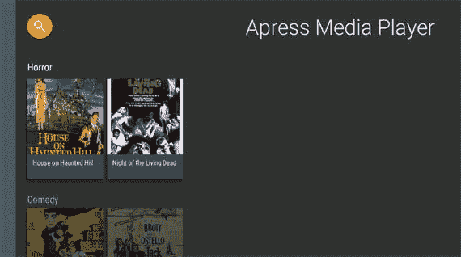
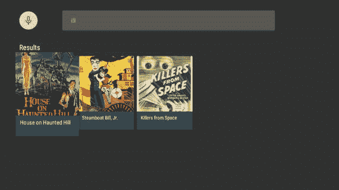
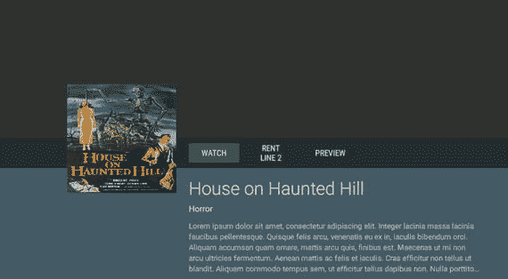
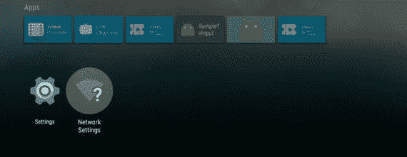
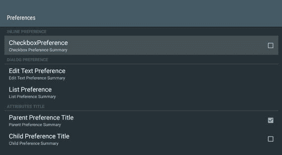
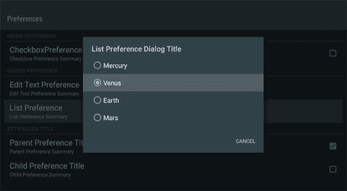
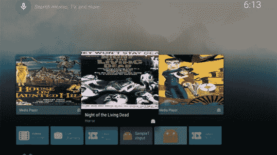

# 四、丰富您的媒体应用

虽然您在上一章中构建的应用很好地演示了如何创建一个基本的媒体应用，但是您无疑会希望为您的用户添加更多的功能。幸运的是，Android TV 平台和 Leanback 支持库提供了多种工具，您可以使用它们来改进您的应用并与您的用户互动。在本章中，您将学习如何实现简单版本的全球和本地搜索，向您的应用添加偏好设置屏幕，并通过更新您在上一章中创建的演示应用，向 Android TV 主屏幕推荐行提供推荐。您还将了解适用于 Android TV 的其他功能，例如直播频道和 Now Playing card。

## 应用内搜索

当您的应用包含大量内容时，用户能够找到他们正在寻找的特定媒体项目就变得非常重要。幸运的是，`BrowseFragment`类支持一个名为 SearchOrbView 的新内置视图。当用户点击 SearchOrbView 时，他们应该会看到一个新的片段，便于在你的应用中进行搜索。在本节中，您将学习如何将 SearchOrbView 添加到`MainFragment`中，并在您在上一章中开始的演示应用中使用本地搜索。

### 添加 SearchOrbView 视图

由于`BrowseFragment`包含一个内置的 SearchOrbView，您可以用几行代码轻松地使它可访问。在`MainFragment`中，在`onActivityCreated`的末尾添加一个名为`initSearchOrb`的新方法调用，这样`onActivityCreated`看起来如下

`@Override`

`public void onActivityCreated(Bundle savedInstanceState) {`

`super.onActivityCreated(savedInstanceState);`

`loadData();`

`setTitle("Apress Media Player");`

`setHeadersState(HEADERS_HIDDEN);`

`setHeadersTransitionOnBackEnabled(true);`

`loadRows();`

`setOnItemViewClickedListener( this );`

`initSearchOrb();`

}

在初始化搜索之前，进入`app/src/res/values`并创建一个名为`colors.xml`的新值资源文件。该文件将包含一些颜色，您将在一个易于访问的位置在整个应用中使用这些颜色。当文件创建后，添加一个名为`search_button_color`的新颜色，并赋予它任何适合你的应用主题的颜色十六进制值。这个例子使用了一个由#FFA500 定义的橙子。您的`colors.xml`文件应该如下所示:

`<?xml version="1.0" encoding="utf-8"?>`

`<resources>`

`<color name="search_button_color">#FFA500</color>`

`</resources>`

接下来，您需要在您的`MainFragment`类中定义`initSearchOrb`方法。您可以在此方法中设置 SearchOrbView 颜色，并确定单击时它会做什么。为了使 SearchOrbView 可见，您唯一需要做的就是通过`setOnSearchClickedListener`方法设置一个`OnClickListener`。您还可以通过调用`setSearchAffordanceColor`将`SearchOrbView`的颜色设置为`colors.xml`中`search_button_color`定义的颜色。

`private void initSearchOrb() {`

`setSearchAffordanceColor(ContextCompat.getColor(getActivity(),`

`R.color.search_button_color));`

`setOnSearchClickedListener(new View.OnClickListener() {`

`@Override`

`public void onClick(View view) {`

}

`});`

}

Note

您可能会注意到，这里的颜色是通过调用`ContextCompat` .getColor 来检索的。从 SDK 23 开始，使用`getResources().getColor(int colorResource)`已被弃用，这是从资源中检索颜色的推荐方式。

当你运行你的应用时，你现在应该在你的`BrowseFragment`的左上角看到搜索球，如图 4-1 所示。您会注意到 SearchOrbView 已经内置了一些动画，当突出显示时，这些动画会导致球体的大小增加，并且还会产生涟漪效应，以便让用户知道它是可选的。

图 4-1。

BrowseFragment with a SearchOrbView visible

当您选择 SearchOrbView 时，您会注意到什么也没有发生。这是因为与 SearchOrbView 关联的`OnClickListener`是空的。在让 SearchOrbView 在被选中时执行某些操作之前，您需要定义一个新的活动和片段来处理搜索。

### 创建本地搜索活动和片段

在应用包文件夹中，您需要创建两个新的 Java 文件。将第一个命名为`MediaSearchActivity.java`，并将其扩展为`Activity`。这个活动现在唯一要做的事情是为一个布局文件设置一个内容视图，您将在本节的后面定义这个布局文件。

`public class MediaSearchActivity extends Activity {`

`@Override`

`protected void onCreate(Bundle savedInstanceState) {`

`super.onCreate(savedInstanceState);`

`setContentView( R.layout.activity_search );`

}

}

第二个 Java 文件应该被命名为`MediaSearchFragment.java`，它将扩展后倾支持库类`SearchFragment. SearchFragment`，允许您实现自己的`SearchResultProvider`，并返回一个包含结果的`ObjectAdapter`，然后使用它以与`BrowseFragment`相同的方式呈现一个`RowsFragment`。

您还需要实现`SpeechRecognitionCallback`接口。`SpeechRecognitionCallback`是随着安卓棉花糖的发布而加入的，作为`SpeechRecognizer`的替代品。使用这个回调，用户在执行搜索时不需要显式地授予`RECORD_AUDIO`使用语音动作的权限。

最后，您需要实现`OnItemViewClickedListener`,这样您就可以确定当用户选择一个作为搜索结果返回的条目时采取什么动作。一旦创建了`MediaSearchFragment`并添加了带有方法存根的接口，您的类应该如下所示:

`public class MediaSearchFragment extends SearchFragment implements`

`SpeechRecognitionCallback,`

`SearchFragment.SearchResultProvider,`

`OnItemViewClickedListener {`

`@Override`

`public void onItemClicked(Presenter.ViewHolder itemViewHolder,`

`Object item, RowPresenter.ViewHolder rowViewHolder, Row row) {`

}

`@Override`

`public ObjectAdapter getResultsAdapter() {`

`return null;`

}

`@Override`

`public boolean onQueryTextChange(String newQuery) {`

`return false;`

}

`@Override`

`public boolean onQueryTextSubmit(String query) {`

`return false;`

}

`@Override`

`public void recognizeSpeech() {`

}

}

现在已经实现了两个 Java 文件，您需要创建一个布局文件，`MediaSearchActivity`使用它来显示`MediaSearchFragment`。在`app/src/main/res/layout`下，创建一个名为`activity_search.xml`的新布局 XML 文件。这个文件看起来类似于`activity_main.xml`，除了它将包含一个对`MediaSearchFragment`类的引用。

`<?xml version="1.0" encoding="utf-8"?>`

`<fragment xmlns:android="`??`http://schemas.android.com/apk/res/android`

`xmlns:tools="`??`http://schemas.android.com/tools`

`android:id="@+id/main_browse_fragment"`

`android:name="com.apress.mediaplayer.MediaSearchFragment"`

`android:layout_width="match_parent"`

`android:layout_height="match_parent"`

`tools:context=".MainActivity"`

`tools:deviceIds="tv"`

`tools:ignore="MergeRootFrame" />`

接下来，您需要在清单文件中声明`MediaSearchActivity`,这样您就能够在应用不崩溃的情况下使用它。您可以将下面一行代码放在`AndroidManifest.xml`中`VideoDetailsActivity`和`PlayerActivity`的定义下面。

`<activity android:name=".MediaSearchActivity" />`

在深入研究使搜索成为可能的代码之前，您需要做的最后一件事是将 SearchOrbView 连接到您的新`MediaSearchActivity`。回到`MainFragment`，通过更新 SearchOrbView `onClickListener`中的`onClick`方法，创建一个在点击球体时启动新搜索屏幕的意图。

`setOnSearchClickedListener(new View.OnClickListener() {`

`@Override`

`public void onClick(View view) {`

`Intent intent = new Intent(getActivity(),`

`MediaSearchActivity.class );`

`startActivity( intent );`

}

`});`

### 从键盘实现本地搜索

此时，您应该能够运行您的应用并选择 SearchOrbView，但是当您这样做时，您会注意到应用崩溃了。如果你查看 Android Studio 中的应用日志，你会看到你收到了一个`IllegalStateException`，上面写着搜索需要`RECORD_AUDIO`权限。在上一节中，我提到您将使用`SpeechRecognitionCallback`来使该许可变得不必要。但是，为了告诉`SearchFragment`您想要使用自己的回调，您还需要做一些工作。首先覆盖`MediaSearchFragment`中的`onCreate`方法，并将`SearchResultProvider`、`SpeechRecognitionCallback`和`OnItemClickListener`接口指向`MediaSearchFragment`，因为该片段自己实现了这些接口。

`@Override`

`public void onCreate(Bundle savedInstanceState) {`

`super.onCreate(savedInstanceState);`

`setSearchResultProvider(this);`

`setSpeechRecognitionCallback(this);`

`setOnItemViewClickedListener(this);`

}

现在，您应该能够构建您的应用并选择 search orb 来查看应用搜索屏幕的开始。此时，屏幕将由左上角的语音搜索激活按钮和顶部中心的编辑文本组成，用于接受键入的输入，如图 4-2 所示。

图 4-2。

Initial App SearchFragment

当您尝试在搜索字段中键入内容时，您应该会看到另一个应用崩溃。这是因为大多数的`MediaSearchFragment`还没有被实现来处理搜索。虽然有效的搜索超出了本书的范围，但是您将创建一个搜索的基本版本，它检查本地 JSON 文件中的数据，以便返回结果。首先在这个类的顶部声明三个新的成员变量:

*   一个整数，将在下一个会话中用作语音输入的请求代码
*   用于存储和显示结果的`ArrayObjectAdapter`
*   用于跟踪所有可搜索数据的视频对象列表

`public static final int SPEECH_REQUEST_CODE = 42;`

`private ArrayObjectAdapter mRowsAdapter;`

`private List<Video> mVideos;`

在`onCreate`结束时，你将调用`loadData()`并用新的`ListRowPresenter`初始化`mRowsAdapter`。

`loadData();`

`mRowsAdapter = new ArrayObjectAdapter( new ListRowPresenter() );`

`loadData`将获取内容 JSON 数据并创建一个视频对象列表，您应该对此很熟悉，因为您之前已经在这个项目的其他类中实现了这个方法。

`private void loadData() {`

`String json = Utils.loadJSONFromResource(getActivity(), R.raw.videos);`

`Type collection = new TypeToken<ArrayList<Video>>(){}.getType();`

`Gson gson = new Gson();`

`mVideos = gson.fromJson(json, collection);`

}

现在你已经准备好了数据，是时候开始搜索了。在这个例子中，您将使用一个名为`loadQuery`的方法，该方法将接受来自用户的字符串，并从匹配查询的数据中查找内容。该方法将首先清除先前搜索的结果，并验证查询是否存在且不为空。接下来，您将遍历数据，查看媒体标题是否包含用户提供的查询。虽然这不是从数据中检索结果的最有效方法，但在了解 Android TV 如何显示搜索结果时，这是一种简单易懂的方法。匹配搜索查询的每个项目将被放入一个新的`ArrayObjectAdapter`中，以卡片的形式显示。一旦`ArrayObjectAdapter`被结果填充，一个新的`Header`和`ListRow`将被添加到顶层`ArrayObjectAdapter`来显示结果。

`private void loadQuery(String query) {`

`if(mRowsAdapter != null)`

`mRowsAdapter.clear();`

`if(query == null || query.length() == 0)`

`return;`

`ArrayObjectAdapter listRowAdapter = new`

`ArrayObjectAdapter(new CardPresenter());`

`for(Video video : mVideos) {`

`if(video.getTitle() != null &&`

`video.getTitle().toLowerCase().contains(query.toLowerCase())) {`

`listRowAdapter.add(video);`

}

}

`if(listRowAdapter.size() == 0)`

`return;`

`HeaderItem header = new HeaderItem("Results");`

`mRowsAdapter.add(new ListRow(header, listRowAdapter));`

}

当`loadQuery`完成时，您需要将它连接到`MediaSearchFragment`,以便应用知道调用该方法。您将需要使用来自`SearchResultProvider`接口的三个存根方法。`getResultsAdapter`将简单地返回`mRowsAdapter`,这样该片段将知道将显示什么。`onQueryTextChange`和`onQueryTextSubmit`将各自获取查询字符串参数，然后调用`loadQuery`。你会注意到这两个方法都返回一个布尔值。如果返回 true，则意味着结果由于查询而发生了变化。为了简单起见，对于这个简单的演示，我们将始终返回 true，即使结果可能与上次调用这些方法之一时没有什么不同。

`@Override`

`public ObjectAdapter getResultsAdapter() {`

`return mRowsAdapter;`

}

`@Override`

`public boolean onQueryTextChange(String newQuery) {`

`loadQuery(newQuery);`

`return true;`

}

`@Override`

`public boolean onQueryTextSubmit(String query) {`

`loadQuery(query);`

`return true;`

}

此时，您将能够运行您的应用并输入您的搜索查询以返回结果，如图 4-3 所示。

图 4-3。

In-app search screen implementation

要完成文本搜索，您最不想做的事情就是在选择一个返回的搜索结果时执行一个操作。您可以通过从`OnItemViewClickedListener`接口覆盖`onItemClicked`方法来做到这一点。当一个项目被选中时，确保它是一个视频对象的实例，然后通过一个意向传递给`VideoDetailActivity`。

`@Override`

`public void onItemClicked(Presenter.ViewHolder itemViewHolder, Object item, RowPresenter.ViewHolder rowViewHolder, Row row) {`

`if(item instanceof Video) {`

`Video video = (Video) item;`

`Intent intent = new Intent(getActivity(),`

`VideoDetailsActivity.class);`

`intent.putExtra(VideoDetailsFragment.EXTRA_VIDEO, video);`

`startActivity(intent);`

}

}

现在，当您单击返回的结果时，将显示该视频的详细信息屏幕(图 4-4 ),您的用户将能够查看媒体内容。

图 4-4。

Detail screen shown when selecting an item from search

虽然能够输入搜索查询对你的用户来说是有益的，但是许多用户仍然希望能够说出他们正在寻找的东西，并让它出现在屏幕上。在下一节中，您将学习如何通过接受用户的语音输入来适应这一点，以便您的应用可以显示搜索结果。

### 使用语音输入进行本地搜索

有了搜索的框架，添加语音支持就相当简单了。当您在`MediaSearchFragment`中实现`SpeechRecognitionCallback`接口时，您为方法`recognizeSpeech`添加了一个存根。在这个方法中，您将使用从`getRecognizerIntent`接收的意图和您在`MediaSearchFragment`顶部的上一节中定义的请求代码来调用`startActivityForResult`。

`@Override`

`public void recognizeSpeech() {`

`startActivityForResult(getRecognizerIntent(),`

`SPEECH_REQUEST_CODE);`

}

这将触发`onActivityResult`在`MediaSearchFragment`中被调用。在这里，您将检查`requestCode`的值，以确保它与`SPEECH_REQUEST_CODE`匹配，并且`resultCode`与`Activity.RESULT_OK`匹配。如果这两个都为真，那么您将调用`setSearchQuery`。`setSearchQuery`方法将设置搜索栏中的文本，并接受两个参数:包含搜索查询的 intent 和一个布尔值。一旦接收到语音输入，将布尔值设置为真将自动调用`onQueryTextSubmit`。

`@Override`

`public void onActivityResult(int requestCode, int resultCode, Intent data) {`

`if(requestCode == SPEECH_REQUEST_CODE`

`&& resultCode == Activity.RESULT_OK) {`

`setSearchQuery(data, true);`

}

}

此时，如果用户选择搜索屏幕上的语音按钮，`MediaSearchFragment`中的一切都应该正常工作。但是，如果您的用户选择遥控器上的语音输入按钮，将会显示 Android TV 全球搜索屏幕。您可以改变这种行为，以便通过覆盖您的`MediaSearchActivity`和`MainActivity`文件中的`onSearchRequested`方法来启动`MediaSearchActivity`。此方法还必须返回一个布尔值。如果返回 true，则意味着搜索活动已经开始。如果动作被阻止，则返回 false。

`@Override`

`public boolean onSearchRequested() {`

`startActivity(new Intent(this, MediaSearchActivity.class));`

`return true;`

}

经过最后几项更改，用户现在只要在你的应用中按下遥控器上的搜索按钮，就会被带到你的自定义搜索屏幕。你现在应该能够将你所学到的关于本地搜索的知识应用到你自己的 Android 电视应用中，以丰富你的用户体验。

## 实现首选项屏幕

当你想让你的用户能够在 Android 应用中定制他们的体验时，你通常使用`PreferenceFragment`类。`PreferenceFragment`允许您显示用户可以操作的项目列表，并自动保存对应用`SharedPreferences`的更改。考虑到这个组件的有用性，Google 提供了一个向后倾斜的偏好库，其中包含一个名为`LeanbackPreferenceFragment`的定制`PreferenceFragment`。这个新的类提供了与`PreferenceFragment`相同的功能，同时也符合电视设计模式。在本节中，您将学习如何在您的演示应用中实现它。

由于这个组件使用了一个尚未添加到您的项目中的库，您需要将它作为一个依赖项包含在您的`build.gradle`文件中。在撰写本文时，这个库的版本 23.1.1 是最新的。在`build.gradle`的 dependencies 节点下，添加下面一行，然后同步您的项目。

`compile 'com.android.support:preference-leanback-v17:23.1.1'`

### 显示偏好项入口点

如果你看过 Android TV 主屏幕，你会注意到最后一行包含两个设置项目(如图 4-5 所示)。您将在演示应用中遵循这一模式，在`MainFragment`底部提供一个新的设置项目，该项目将向您的`LeanbackPreferenceFragment`打开。

图 4-5。

Android home screen and location of settings

为了实现这一点，您将向包含`MainFragment`中的媒体卡行的`ArrayObjectAdapter`添加一个新的行和标题。您还将创建一个新的演示者，以便与您以前使用的媒体卡相比，设置项会更突出。开始创建一个名为`PreferenceCardPresenter`的新 Java 类，并让它扩展`Presenter`类。您需要在这个类中声明三个方法:`onCreateViewHolder`、`onBindViewHolder`和`onUnbindViewHolder`。

`public class PreferenceCardPresenter extends Presenter {`

`@Override`

`public ViewHolder onCreateViewHolder(ViewGroup parent)  {`

}

`@Override`

`public void onBindViewHolder(ViewHolder viewHolder, Object item)   {`

}

`@Override`

`public void onUnbindViewHolder(ViewHolder viewHolder) {`

}

}

在`onCreateViewHolder`中，您将创建一个`TextView`，设置那个`TextView`的大小以匹配`MainFragment`中的媒体卡，并应用一些其他样式以使卡为灰色，白色文本居中。

`@Override`

`public ViewHolder onCreateViewHolder(ViewGroup parent) {`

`TextView view = new TextView(parent.getContext());`

`view.setLayoutParams(new ViewGroup.LayoutParams(210, 210));`

`view.setFocusable(true);`

`view.setBackgroundColor(ContextCompat.getColor(parent.getContext(),`

`R.color.preference_card_background));`

`view.setTextColor(Color.WHITE);`

`view.setGravity(Gravity.CENTER);`

`return new ViewHolder(view);`

}

接下来，您需要获取传递给该类的对象，将其转换为一个字符串，并使用该字符串来设置将为该项显示的文本。

`@Override`

`public void onBindViewHolder(ViewHolder viewHolder, Object item) {`

`((TextView) viewHolder.view).setText((String) item);`

}

在`onCreateViewHolder`方法中，您使用颜色资源值为设置卡设置背景颜色。为此，您需要在您的`colors.xml`文件中添加一个名为`preference_card_background`的颜色资源。打开`app/src/main/res/values`目录下的`colors.xml`文件，并在 resources 标签中添加下面一行

`<color name=``preference_card_background">#AAAAAA</color>`

当您完成`PreferenceCardPresenter`后，您可以关闭该文件并打开`MainFragment`。一旦你打开了`MainFragment`，将下面的代码添加到`loadRows`的末尾。

`setupPreferences(adapter);`

`setupPreferences`将接受用于显示媒体内容行的`ArrayObjectAdapter`，以便您可以将包含您的偏好项的行附加到您的`BrowseFragment`的底部。在这个方法中，您将创建一个新的`HeaderItem`和`PreferenceCardPresenter`，然后您将初始化一个新的`ArrayObjectAdapter`来包含您的设置项。最后，该方法将向带有设置项标题的行添加一个新字符串，并将首选项行添加到主`BrowseFragment`行集中。

`private void setupPreferences(ArrayObjectAdapter adapter) {`

`HeaderItem gridHeader = new HeaderItem(adapter.size(), "Preferences");`

`PreferenceCardPresenter presenter = new PreferenceCardPresenter();`

`ArrayObjectAdapter gridRowAdapter = new ArrayObjectAdapter(presenter);`

`gridRowAdapter.add("Settings");`

`adapter.add(new ListRow(gridHeader, gridRowAdapter));`

}

如果你现在运行你的应用，你会在`MainFragment`的底部看到一个灰色的卡片，里面有白色的文字，如图 4-6 所示。

图 4-6。

LeanbackPreferenceFragment entry point in MainFragment

为了打开您的首选项屏幕，修改`OnItemClicked`方法以检查所选项目是否等于“设置”。如果是，为`SettingsActivity.class`创建一个新的意图，然后用这个意图调用`startActivity`。

`@Override`

`public void onItemClicked(Presenter.ViewHolder itemViewHolder, Object item, RowPresenter.ViewHolder rowViewHolder, Row row) {`

`if(item instanceof Video) {`

`Video movie = (Video) item;`

`Intent intent = new Intent(getActivity(),`

`VideoDetailActivity.class);`

`intent.putExtra(VideoDetailsFragment.EXTRA_VIDEO, movie);`

`startActivity(intent);`

`} else if("Settings".equals(item)) {`

`Intent intent = new Intent(getActivity(), SettingsActivity.class);`

`startActivity(intent);`

}

}

### 创建首选项屏幕

要编译您的应用，您需要创建几个新文件。在您的应用包下，创建一个新的 Java 类，并将其命名为`SettingsActivity.java`。这个类将扩展`Activity`，并且您将覆盖`onCreate`，以便您可以将布局文件设置为内容视图。

`public class SettingsActivity extends Activity {`

`@Override`

`protected void onCreate(Bundle savedInstanceState) {`

`super.onCreate(savedInstanceState);`

`setContentView(R.layout.activity_settings);`

}

}

接下来，您需要创建布局文件。在项目的布局资源文件夹中创建一个名为`activity_settings.xml`的新布局文件。从上几个活动布局文件来看，这应该很熟悉，尽管这一个将包含对您将要编写的名为`SettingsFragment`的新类的引用。

`<?xml version="1.0" encoding="utf-8"?>`

`<fragment xmlns:android="`??`http://schemas.android.com/apk/res/android`

`android:id="@+id/settings_fragment"`

`android:name="com.apress.mediaplayer.SettingsFragment"`

`android:layout_width="match_parent"`

`android:layout_height="match_parent" />`

创建好布局后，现在可以在应用包目录中创建`SettingsFragment` Java 文件。这个新类将扩展`LeanbackPreferenceFragment`并实现`OnSharedPreferenceChangeListener`接口。

`public class SettingsFragment extends LeanbackPreferenceFragment`

`implements OnSharedPreferenceChangeListener {`

`@Override`

`public void onSharedPreferenceChanged(SharedPreferences`

`sharedPreferences, String key) {`

}

`@Override`

`public void onCreatePreferences(Bundle bundle, String s) {`

}

}

接下来你需要覆盖`onPause`和`onResume`，这样`onSharedPreferenceChangedListener`就可以注册和注销了。

`@Override`

`public void onResume() {`

`super.onResume();`

`getPreferenceManager().getSharedPreferences()`

`.registerOnSharedPreferenceChangeListener(this);`

}

`@Override`

`public void onPause() {`

`getPreferenceManager().getSharedPreferences()`

`.unregisterOnSharedPreferenceChangeListener(this);`

`super.onPause();`

}

每当用户修改首选项屏幕上的项目时，就会调用`onSharedPreferenceChanged`方法，允许您更改应用与用户的交互方式。

在`SettingsFragment`中，您需要做的最后一件事是覆盖`onCreate`,这样您就可以将定义您的偏好的 XML 文件与您的片段相关联。

`@Override`

`public void onCreate(Bundle savedInstanceState) {`

`super.onCreate(savedInstanceState);`

`addPreferencesFromResource(R.xml.preferences);`

}

现在您已经完成了`SettingsFragment`，您将需要制作`preferences.xml`文件。在`res`目录下创建一个名为`xml`的新资源文件夹。接下来，创建一个新的 XML 资源文件，并将其命名为`preferences.xml`。您的首选项文件将包含 Android TV 支持的各种首选项示例，包括选中的项目、可选项目列表、编辑文本对话框以及除非其父项目被选中否则无法选择的项目。应该注意的是，Android TV 不支持一些偏好设置功能，例如包含转到网页的意图。

`<PreferenceScreen`

`xmlns:android="`??`http://schemas.android.com/apk/res/android`

`android:title="Preferences">`

`<PreferenceCategory`

`android:title="Inline Preference">`

`<CheckBoxPreference`

`android:key="checkbox_preference"`

`android:title="CheckboxPreference"`

`android:summary="Checkbox Preference Summary" />`

`</PreferenceCategory>`

`<PreferenceCategory`

`android:title="Dialog Preference">`

`<EditTextPreference`

`android:key="edittext_preference"`

`android:title="Edit Text Preference"`

`android:summary="Edit Text Preference Summary"`

`android:dialogTitle="Dialog Title Edit Text Preference" />`

`<ListPreference`

`android:key="list_preference"`

`android:title="List Preference"`

`android:summary="List Preference Summary"`

`android:entries="@array/entries_list_preference"`

`android:entryValues="@array/entries_list_preference"`

`android:dialogTitle="List Preference Dialog Title" />`

`</PreferenceCategory>`

`<PreferenceCategory`

`android:title="Attributes Title">`

`<CheckBoxPreference`

`android:key="parent_checkbox_preference"`

`android:title="Parent Preference Title"`

`android:summary="Parent Preference Summary" />`

`<CheckBoxPreference`

`android:key="child_checkbox_preference"`

`android:dependency="parent_checkbox_preference"`

`android:title="Child Preference Title"`

`android:summary="Child Preference Summary" />`

`</PreferenceCategory>`

`</PreferenceScreen>`

在这个文件中，使用了一个名为`entries_list_preference`的字符串数组。在 res 文件夹下的 values 资源目录中，创建一个名为`string-array.xml`的新文件，并用一个项目列表填充它。在这个演示中，你只需列出太阳系中的前四颗行星；但是，您可以使用任何您喜欢的数据。

`<?xml version="1.0" encoding="utf-8"?>`

`<resources>`

`<string-array name="entries_list_preference">`

`<item>Mercury</item>`

`<item>Venus</item>`

`<item>Earth</item>`

`<item>Mars</item>`

`</string-array>`

`</resources>`

为了运行您的应用并进入新的首选项屏幕，您需要将应用主题中的`preferenceTheme`样式项目配置为`PreferenceThemeOverlay`样式。你可以从你的`res/values`目录中打开`styles.xml`,然后在`AppTheme`风格下添加新的项目。

`<?xml version="1.0" encoding="utf-8"?>`

`<resources>`

``

`</resources>`

最后，打开`AndroidManifest.xml`并为`SettingsActivity`定义一个新的活动项，这样系统就知道该活动可以在您的应用中使用。

`<activity android:name=".SettingsActivity" />`

此时，您应该能够运行您的应用，并从`MainFragment`中选择设置项目，进入首选项屏幕。该页面将包含由`preferences.xml`定义的标题和项目列表，如图 4-7 所示。

图 4-7。

LeanbackPreferenceFragment screen

当你的用户选择这个片段中的任何一项时，一个`SharedPreferences`条目将被改变以反映这个选择，允许你决定你的应用应该如何为你的用户服务。复选框的值存储为布尔值，`EditText`首选项将编辑文本字段的内容保存为字符串，列表首选项将向用户显示一个对话框，其中包含可供选择的选项列表，这些选项也将存储为字符串，如图 4-8 所示。

图 4-8。

LeanbackPreferenceFragment list preference example

在本节中，您了解了 Android TV 支持的首选项，以及如何在您的应用中实现它们。在下一部分中，您将详细介绍您的演示程序，以便在用户不积极使用您的应用时，通过使用将显示在 Android TV 主屏幕上的建议来吸引他们。

## 使用建议

不管你的应用有多好，或者你构建了多少功能，你都必须让用户进入你的应用，让他们能够享受它。当用户坐在电视机前时，他们希望能够快速找到内容并开始观看。回到第二章中，您已经了解了 Android TV 主屏幕的推荐行，在这一部分，您将了解如何利用这一功能与您的用户互动。

### 建筑推荐卡

推荐只是从后台服务创建的通知卡，定期推送到 Android TV 主屏幕，以便向您的用户提供内容。现在，您可以通过在应用的包目录下创建一个名为`RecommendationService`的新 Java 类并让它扩展`IntentService`来开始推出推荐。

`public class RecommendationService extends IntentService {`

`public RecommendationService() {`

`super("RecommendationService");`

}

`@Override`

`protected void onHandleIntent(Intent intent) {`

}

}

在本演示中，您需要将两个成员变量放在服务的顶部:一个表示应用将向用户显示的最大推荐数量的整数，以及一个用于构建推荐的视频对象列表。

`private int MAX_RECOMMENDATIONS = 3;`

`private List<Video> mVideos;`

`onHandleIntent`方法是创建您的推荐的所有工作发生的地方。您可以通过调用`loadData`来开始设置该方法，它将像在其他类中一样工作，以填充`mVideos`结构。接下来，您将需要创建一个新的`NotificationManager`对象，一旦构建好，它将用于推出您的通知对象集。当您创建了`NotificationManager`后，您可以做一些简单的应急计划，检查`mVideos`是否为空，如果是则返回。如果它不为 null 或空，但是数据中的项目数少于您通常会推出的建议数(在本例中为 3)，那么您可以更改建议数，以便显示您拥有的所有数据。

`@Override`

`protected void onHandleIntent(Intent intent) {`

`loadData();`

`NotificationManager notificationManager = (NotificationManager)`

`getApplicationContext().getSystemService(Context.NOTIFICATION_SERVICE);`

`int numOfRecommendations = MAX_RECOMMENDATIONS;`

`if( mVideos == null ) {`

`return;`

`} else if(mVideos.size() < MAX_RECOMMENDATIONS){`

`numOfRecommendations = mVideos.size();`

}

}

因为所有要构建的通知都将共享一些公共属性，所以您可以创建一个基本的`NotificationCompat.Builder`对象，它具有在每个建议中共享的公共属性。

`NotificationCompat.Builder builder = new`

`NotificationCompat.Builder(getApplicationContext())`

`.setSmallIcon(R.mipmap.ic_launcher)`

`.setLocalOnly(true)`

`.setOngoing(true)`

`.setColor(ContextCompat.getColor(getApplicationContext(),`

`android.R.color.black))`

`.setCategory(Notification.CATEGORY_RECOMMENDATION);`

该构建器将创建一个通知:

*   使用卡片右下角的应用图标
*   将只与本地设备相关
*   被标记为正在进行，这意味着它比非正在进行的通知具有更高的优先级
*   将有一个黑色的选择颜色(虽然你可以使用任何适合你的应用的主题的颜色)
*   会被安卓电视主屏幕归类为推荐

您可以通过创建一个循环来结束`onHandleIntent`方法，该循环遍历您的数据并创建您将显示的三个通知，然后将它们发送到`NotificationManager`。对于本例，您只需从数据集中抓取前三个视频进行显示，尽管您自己的应用将使用符合您目的的逻辑。

`for(int i = 0; i < numOfRecommendations; i++ ) {`

`Video video = mVideos.get(i);`

`Bitmap bitmap;`

`try {`

`bitmap = Picasso.with(this)`

`.load(video.getPoster()).`

`resize(313, 176)`

`.get();`

`} catch( IOException e ) {`

`continue;`

}

`builder.setPriority(numOfRecommendations - i)`

`.setContentTitle(video.getTitle())`

`.setContentText(video.getCategory())`

`.setLargeIcon(bitmap)`

`.setContentIntent(buildPendingIntent(video, i + 1));`

`notificationManager.notify(i + 1, builder.build());`

}

虽然你在上一章中使用 Picasso 在应用内的媒体卡上显示图像，但应该重申的是，Picasso 是来自 Square 的第三方开源库，而不是 Android 框架或官方库的一部分。对 Picasso image loader 类的调用将同步下载存储在`video.getPoster`中的 URL 处的图像，并将其调整为 313 像素宽、176 像素高。虽然这个宽度和高度看起来可能是任意的，但它们是谷歌自己的应用(如 YouTube 应用)使用的尺寸，以符合 16:9 的显示比例。该位图将被用作推荐卡的主图像。

一旦您的卡片图像被下载，您可以在`NotificationCompat.Builder`对象上设置额外的属性，例如推荐在推荐行中出现的顺序、卡片上的标题和描述，以及当推荐被选中时将被激发的意图。

此时，您可能会注意到您的应用无法编译。这是因为`buildPendingIntent`还没有被定义。这可以通过在您的`RecommendationService`类中添加以下方法来解决。

`private PendingIntent buildPendingIntent(Video video, long id ) {`

`Intent detailsIntent = new Intent(this, VideoDetailActivity.class);`

`detailsIntent.putExtra(VideoDetailsFragment.EXTRA_VIDEO, video);`

`TaskStackBuilder stackBuilder = TaskStackBuilder.create(this);`

`stackBuilder.addParentStack(VideoDetailActivity.class);`

`stackBuilder.addNextIntent(detailsIntent);`

`detailsIntent.setAction(Long.toString(id));`

`PendingIntent intent = stackBuilder.getPendingIntent(0,`

`PendingIntent.FLAG_UPDATE_CURRENT);`

`return intent;`

}

该方法将创建一个启动`VideoDetailsActivity`的意图，并将其与一个`TaskStackBuilder`相关联，以便使用 Android TV 遥控器上的后退按钮将用户正确地返回到 Android TV 主屏幕，而不是试图将他们放在您的应用中。你会注意到这个意向也有一个对`setAction`的调用。这允许您确保用于推荐的每个`PendingIntent`对于创建它的数据是唯一的。否则，你的每一个推荐可能最终会打开一个基于相同数据的屏幕，而不是用户想要看到的。此时，您的服务将能够基于您的数据创建通知，并将它们作为推荐显示在 Android TV 主屏幕上。在下一节中，您将了解如何启动这项服务，以便它自动开始推送内容供您的用户欣赏。

### 启动推荐服务

启动推荐服务最简单的方法是当用户打开应用时。你可以通过进入`MainActivity`并在`onCreate`的末尾添加下面一行来简单地做到这一点。

`startService(new Intent(this, RecommendationService.class));`

当你的用户重启他们的 Android 电视设备，但没有打开你的应用时，这种策略就会遇到麻烦。为了处理这种情况，最好的办法是创建一个`BroadcastReceiver`来监听 Android TV 设备何时完成启动。当 Android TV 启动时，这个`BroadcastReceiver`将启动`RecommendationService`。为了演示这一点，创建一个名为`BootupReceiver`的新 Java 类，并让它扩展`BroadcastReceiver`。

`public class BootupReceiver extends BroadcastReceiver {`

`@Override`

`public void onReceive(Context context, Intent intent) {`

}

}

当`onReceive`被触发时，您将想要检查已经传递给它的意图，以查看它是否是一个`Intent.ACTION_BOOT_COMPLETED`动作。如果是，那么你可以开始`RecommendationService`。您还需要创建一个名为`scheduleRecommendationUpdate`的新方法，它创建一个`AlarmManager`，以便每 30 分钟重启或更新`RecommendationService`。这将为用户提供来自你的应用的新的或更新的内容，希望能引起他们的注意，让他们进入你的应用。

`private static final long INITIAL_DELAY = 5000;`

`@Override`

`public void onReceive(Context context, Intent intent) {`

`if(intent.getAction().endsWith(Intent.ACTION_BOOT_COMPLETED)) {`

`context.startService(new Intent(context,`

`RecommendationService.class));`

`scheduleRecommendationUpdate(context);`

}

}

`private void scheduleRecommendationUpdate(Context context) {`

`AlarmManager alarmManager = (AlarmManager)`

`context.getSystemService(Context.ALARM_SERVICE);`

`Intent recommendationIntent = new Intent(context,`

`RecommendationService.class);`

`PendingIntent alarmIntent = PendingIntent.getService(context, 0,`

`recommendationIntent, 0);`

`alarmManager.setInexactRepeating(AlarmManager.ELAPSED_REALTIME_WAKEUP,`

`INITIAL_DELAY,`

`AlarmManager.INTERVAL_HALF_HOUR,`

`alarmIntent);`

}

在您的`BroadcastReceiver`完成之后，您将需要在应用标签的`AndroidManifest.xml`中声明它和`RecommendationService`。`BootupReceiver`将需要一个意图过滤器，以便它可以监听来自操作系统的`BOOT_COMPLETED`意图。

`<service android:name=".RecommendationService"`

`android:enabled="true" />`

`<receiver android:name=".BootupReceiver"`

`android:enabled="true"`

`android:exported="false">`

`<intent-filter>`

`<action android:name="android.intent.action.BOOT_COMPLETED"/>`

`</intent-filter>`

`</receiver>`

您还需要在`AndroidManifest.xml`的顶部包含`RECEIVE_BOOT_COMPLETE`权限声明。

`<uses-permission android:name="android.permission.RECEIVE_BOOT_COMPLETED" />`

随着`MainActivity`、`RecommendationService`、`BootupReceiver`和`AndroidManifest.xml`的完成，您现在应该能够运行您的应用并在推荐行中看到推荐。如果你在模拟器上测试你的应用，那么你的 Android 电视主屏幕应该看起来类似于图 4-9 。如果您在物理设备上进行测试，那么您的建议通知将与来自其他已安装应用的建议混合在一起。

图 4-9。

Populated recommendations on the Android TV home screen

在本节中，您已经了解了 Android TV 主屏幕的推荐行，以及如何在其中放置您自己的内容。虽然您现在已经能够做到这一点，但您可能会发现还有其他一些特性有助于让您的应用脱颖而出。其中之一是能够改变 Android 电视主屏幕的背景，以匹配您的内容。这是通过用 ContentProvider 存储一个位图文件并在您的通知被选中时通过 URI 访问它来实现的。虽然这超出了本书的范围，但它确实给你的应用增加了一点你的用户会喜欢的东西。在下一节中，您将继续学习如何通过 Android TV 全局搜索功能搜索您的数据和内容，从而在用户不在您的应用中时与他们互动。

## 安卓电视全球搜索

您的用户无需直接访问您的应用即可访问您的内容的另一种方式是通过 Android TV 的全球搜索功能。当用户按下控制器上的麦克风按钮或选择 Android TV 主屏幕左上角的搜索图标时，系统将打开一个搜索屏幕，并查看哪些已安装的应用提供了可供搜索的数据。在本节中，您将学习如何使用一些基本的 SQLite 功能，以及如何通过使用 ContentProvider 使您的内容可搜索。

### 构建搜索数据库

为了使您的内容可用于 Android TV 全球搜索，您需要创建一个 SQLite 表来存储您的内容信息，并且可以从您的应用外部访问。首先，您将为 SQLite 数据库编写一个处理程序类。这个类的目的是使通过使用 ContentProvider 访问您将创建的数据库变得更加容易。现在在应用包目录下创建这个类，并将其命名为`VideoDatabaseHandler.java`。这个文件需要在类的顶部声明和初始化多个属性，如下所示。

`public class VideoDatabaseHandler {`

`private static final String DATABASE_NAME = "video_database_leanback";`

`private static final int DATABASE_VERSION = 1;`

`private static final String FTS_VIRTUAL_TABLE = "Leanback_table";`

`public static final String KEY_NAME =`

`SearchManager.SUGGEST_COLUMN_TEXT_1;`

`public static final String KEY_DATA_TYPE =`

`SearchManager.SUGGEST_COLUMN_CONTENT_TYPE;`

`public static final String KEY_PRODUCTION_YEAR =`

`SearchManager.SUGGEST_COLUMN_PRODUCTION_YEAR;`

`public static final String KEY_COLUMN_DURATION =`

`SearchManager.SUGGEST_COLUMN_DURATION;`

`public static final String KEY_ACTION =`

`SearchManager.SUGGEST_COLUMN_INTENT_ACTION;`

}

这里，`DATABASE_NAME`和`DATABASE_VERSION`用于创建您的 SQLite 数据库，`FTS_VIRTUAL_TABLE`包含将存储您所有数据的表的名称，其余项是将用于标识数据库中数据的键。接下来，您需要为您的表中将要使用的所有列制作一个映射。您可以在一个名为`buildColumnMap`的新方法中做到这一点。

`private static HashMap<String, String> buildColumnMap() {`

`HashMap<String, String> map = new HashMap<String, String>();`

`map.put(KEY_NAME, KEY_NAME);`

`map.put(KEY_DATA_TYPE, KEY_DATA_TYPE);`

`map.put(KEY_PRODUCTION_YEAR, KEY_PRODUCTION_YEAR);`

`map.put(KEY_COLUMN_DURATION, KEY_COLUMN_DURATION);`

`map.put(KEY_ACTION, KEY_ACTION );`

`map.put(BaseColumns._ID, "rowid AS " + BaseColumns._ID);`

`map.put(SearchManager.SUGGEST_COLUMN_INTENT_DATA_ID, "rowid AS " +`

`SearchManager.SUGGEST_COLUMN_INTENT_DATA_ID);`

`map.put(SearchManager.SUGGEST_COLUMN_SHORTCUT_ID, "rowid AS " +`

`SearchManager.SUGGEST_COLUMN_SHORTCUT_ID);`

`return map;`

}

回到`VideoDatabaseHandler`的顶部，您需要创建一个新的数据项，并使用`buildColumnMap`进行初始化。该项目将用于为 SQLite 查询创建投影地图。

`private static final HashMap<String, String> COLUMN_MAP =`

`buildColumnMap();`

在开始处理查询之前，您需要创建一个名为`VideoDatabaseOpenHelper`的新内部类，它扩展了`SQLiteOpenHelper`来包装您的数据库。这个内部类将数据加载到数据库中，并创建将被查询的表。当您创建`VideoDatabaseOpenHelper`时，您还需要包含一个表示用于创建您的表的 SQL 命令的字符串、一个 SQLite 数据库和一个包含`Context`的`WeakReference`。

`private static class VideoDatabaseOpenHelper extends SQLiteOpenHelper {`

`private final WeakReference<Context> mHelperContext;`

`private SQLiteDatabase mDatabase;`

`private static final String FTS_TABLE_CREATE =`

`"CREATE VIRTUAL TABLE " + FTS_VIRTUAL_TABLE +`

`" USING fts3 (" +`

`KEY_NAME + ", " +`

`KEY_DATA_TYPE + "," +`

`KEY_ACTION + "," +`

`KEY_PRODUCTION_YEAR + "," +`

`KEY_COLUMN_DURATION + ");";`

`public VideoDatabaseOpenHelper(Context context){`

`super(context, DATABASE_NAME, null, DATABASE_VERSION);`

`mHelperContext = new WeakReference<Context>(context);`

}

`@Override`

`public void onCreate(SQLiteDatabase db){`

}

`@Override`

`public void onUpgrade(SQLiteDatabase db, int oldVersion, int newVersion){`

}

}

Note

您会注意到这个内部类的上下文存储在一个`WeakReference`中。使用一个带有`WeakReference`到`Context`的静态内部类是一种避免内存泄漏的方法，正如这篇 2009 年 Android 开发者的博客文章所提到的: [`android-developers.blogspot.com/2009/01/avoiding-memory-leaks.html`](https://android-developers.blogspot.com/2009/01/avoiding-memory-leaks.html) 。

接下来，您需要完成`onCreate`方法。该方法将存储对数据库的引用，创建内容表，并将所有可搜索的项目加载到数据库中。

`@Override`

`public void onCreate(SQLiteDatabase db) {`

`mDatabase = db;`

`mDatabase.execSQL(FTS_TABLE_CREATE);`

`loadDatabase();`

}

loadDatabase 方法会将应用中的数据 JSON 文件中的所有视频加载到新线程中的表中。

`private void loadDatabase() {`

`new Thread(new Runnable() {`

`public void run() {`

`try {`

`loadVideos();`

`} catch (IOException e) {`

`throw new RuntimeException(e);`

}

}

`}).start();`

}

`private void loadVideos() throws IOException {`

`List<Video> videos;`

`String json = Utils.loadJSONFromResource(mHelperContext.get(),`

`R.raw.videos);`

`Type collection = new TypeToken<ArrayList<Video>>(){}.getType();`

`Gson gson = new Gson();`

`videos = gson.fromJson(json, collection);`

`for(Video video : videos) {`

`addVideoForDeepLink(video);`

}

}

`public void addVideoForDeepLink(Video video) {`

`ContentValues initialValues = new ContentValues();`

`initialValues.put(KEY_NAME, video.getTitle());`

`initialValues.put(KEY_DATA_TYPE, "video/mp4");`

`initialValues.put(KEY_PRODUCTION_YEAR, "2015");`

`initialValues.put(KEY_COLUMN_DURATION, 6400000);`

`mDatabase.insert(FTS_VIRTUAL_TABLE, null, initialValues);`

}

在`addVideoForDeepLink`方法中，您将四个值添加到一个`ContentValues`对象中。这些是表中信息可搜索的唯一必需项。您可以通过向表中添加更多的列并包含来自`SearchManager`类的键来添加数据。因为这个项目的样本数据不包含媒体的生产年份或持续时间，所以您可以在这个演示应用中使用虚拟信息。一旦您的`ContentValues`对象被填充，您就可以使用它将给定视频的数据插入到您的表中。

至此，您的`VideoDatabaseOpenHelper`内部类完成了。您需要在`VideoDatabaseHandler`的顶部创建一个对它的引用，并在类构造函数中初始化它。

`private final VideoDatabaseOpenHelper mDatabaseOpenHelper;`

`public VideoDatabaseHandler(Context context) {`

`mDatabaseOpenHelper = new VideoDatabaseOpenHelper(context);`

}

在`VideoDatabaseHandler`中你需要做的最后一件事是处理查询。还有两个方法要添加到这个类中。第一个是 query，它接受传递给它的查询，并返回一个包含搜索结果的`Cursor`对象。第二个是`getWordMatch`，它将接受一个字符串，并通过创建一个 SQL 命令传递给`query`方法来查看它是否匹配您的媒体数据中的任何标题。

`public Cursor getWordMatch(String query, String[] columns) {`

`String selection = KEY_NAME + " MATCH ?";`

`String[] selectionArgs = new String[]{query + "*"};`

`return query(selection, selectionArgs, columns);`

}

`private Cursor query(String selection, String[] selectionArgs, String[] columns) {`

`SQLiteQueryBuilder builder = new SQLiteQueryBuilder();`

`builder.setTables(FTS_VIRTUAL_TABLE);`

`builder.setProjectionMap(COLUMN_MAP);`

`Cursor cursor = builder.query(mDatabaseOpenHelper.getReadableDatabase(),`

`columns, selection, selectionArgs, null, null, null);`

`if (cursor == null) {`

`return null;`

`} else if (!cursor.moveToFirst()) {`

`cursor.close();`

`return null;`

}

`return cursor;`

}

如果您以前没有使用过 SQLite，那么这个类可能会让人望而生畏，但是没关系。虽然 SQLite 超出了本书的范围，但我强烈建议通读 Google 的相关文档。随着你对数据库越来越熟悉，在 Android 平台上处理数据和做一些有趣的事情变得越来越容易。如果您已经熟悉了 SQLite，那么您已经有了一个良好的开端！在下一节中，您将创建一个新的 ContentProvider 来访问刚刚创建的数据库，并使其可用于 Android TV 全局搜索。

### 创建全球搜索内容提供商

内容提供商是 Android 让一个进程中的数据在另一个进程中可用的方式。它们封装数据，并提供必要的工具来安全地定义哪些数据可以被其他进程使用。创建一个新的 Java 类并将其命名为`VideoContentProvider.java`。它将扩展`ContentProvider`类。

`public class VideoContentProvider extends ContentProvider {`

`@Override`

`public boolean onCreate() {`

`return false;`

}

`@Override`

`public Cursor query(Uri uri, String[] projection, String selection,`

`String[] selectionArgs, String sortOrder) {`

`return null;`

}

`@Override`

`public String getType(Uri uri) {`

`return null;`

}

`@Override`

`public Uri insert(Uri uri, ContentValues values) {`

`return null;`

}

`@Override`

`public int delete(Uri uri, String selection, String[] selectionArgs) {`

`return 0;`

}

`@Override`

`public int update(Uri uri, ContentValues values, String selection, String[] selectionArgs) {`

`return 0;`

}

}

接下来，在类的顶部创建一个新的`VideoDatabaseHandler`对象，并在`onCreate`中初始化它。

`private VideoDatabaseHandler mVideoDatabase;`

`@Override`

`public boolean onCreate() {`

`mVideoDatabase = new VideoDatabaseHandler(getContext());`

`return true;`

}

在`VideoContentProvider`中，您需要做的最后一件事是充实查询方法。幸运的是，所有困难的工作都由`VideoDatabaseHandler`来处理。您唯一需要做的就是从 arguments 数组中获取传递给内容提供者的查询，创建一个数组来呈现您想要返回的数据，然后从`VideoDatabaseHandler`中的`getWordMatch`方法返回`Cursor`。

`@Override`

`public Cursor query(Uri uri, String[] projection, String selection, String[] selectionArgs, String sortOrder) {`

`String query = selectionArgs[0];`

`query = query.toLowerCase();`

`String[] columns = new String[]{`

`BaseColumns._ID,`

`VideoDatabaseHandler.KEY_NAME,`

`VideoDatabaseHandler.KEY_DATA_TYPE,`

`VideoDatabaseHandler.KEY_PRODUCTION_YEAR,`

`VideoDatabaseHandler.KEY_COLUMN_DURATION,`

`SearchManager.SUGGEST_COLUMN_INTENT_DATA_ID`

`};`

`return mVideoDatabase.getWordMatch(query, columns);`

}

在下一节中，您将学习如何向外部流程公开您的内容提供者。

### 公开内容提供者

完成 Java 文件后，您需要设置您的应用，以便其他进程可以找到您的内容提供者。在你的`res`文件夹中，在`xml`目录下创建一个名为`searchable.xml`的新文件。该配置文件将描述您的内容提供商，并包含 Android TV 的其他重要信息。

`<searchable xmlns:android="`??`http://schemas.android.com/apk/res/android`

`android:label="@string/app_name"`

`android:hint="Search for videos"`

`android:searchSettingsDescription="Description"`

`android:searchSuggestAuthority="com.apress.mediaplayer"`

`android:searchSuggestIntentAction="android.intent.action.VIEW"`

`android:searchSuggestIntentData="content://com.apress.mediaplayer/video_database_leanback"`

`android:searchSuggestSelection=" ?"`

`android:searchSuggestThreshold="1"`

`android:includeInGlobalSearch="true"`

`/>`

当 searchable.xml 文件完成后，打开`AndroidManifest.xml`并在应用节点中添加以下代码行，以在应用中声明您的内容提供者。

`<provider android:name=".VideoContentProvider"`

`android:authorities="com.apress.mediaplayer"`

`android:exported="true" />`

现在，您的内容提供商已经公开，您需要配置您的应用，以便搜索返回的任何项目都可以正确打开。

### 对搜索动作作出反应

要完成处理全局搜索操作，您必须让 Android TV 系统知道当您的一个项目匹配搜索查询时该做什么。在`AndroidManifest.xml`中，修改`VideoDetailsActivity`的声明，使其包含一个`SEARCH`动作的意图过滤器，并指向您的`searchable.xml`文件作为元数据。

`<activity android:name=".VideoDetailsActivity">`

`<intent-filter>`

`<action android:name="android.intent.action.SEARCH" />`

`</intent-filter>`

`<meta-data android:name="android.app.searchable"`

`android:resource="@xml/searchable" />`

`</activity>`

如果您现在运行您的应用，您将能够使用 Android TV 的全局搜索功能按标题搜索您的媒体项目之一，如图 4-10 所示。

图 4-10。

Content found from a global search by title

还有一个问题。如果选择该项，应用将会崩溃。这是因为`VideoDetailsFragment`不知道如何处理没有视频传递给它的情况。要解决这个问题，打开`VideoDetailsFragment`并进入`onCreate`方法。紧接在试图从 intent 中的序列化 extra 初始化`mVideo`的行之后，添加以下代码块:

`if( mVideo == null ) {`

`Intent intent = getActivity().getIntent();`

`Uri data = intent.getData();`

`String json = Utils.loadJSONFromResource(getActivity(), R.raw.videos);`

`Type collection = new TypeToken<ArrayList<Video>>(){}.getType();`

`Gson gson = new Gson();`

`List<Video> videos = gson.fromJson(json, collection);`

`mVideo = videos.get(Integer.parseInt(data.getLastPathSegment())- 1 );`

}

这将为您的应用加载数据，并尝试根据与媒体项目在数据中的位置相关的标识符来查找合适的项目。现在，如果您运行您的应用并使用全局搜索选项，您应该能够单击应用中的任何结果，并进入该项目的正确详细信息屏幕。

虽然您还可以做更多的工作来改进这一功能，例如为返回的结果添加图像或包括更多元数据，但您已经完成了演示应用与 Android TV 全球搜索功能的集成。您现在拥有了一个充实的 Android TV 媒体应用，了解了如何通过 Leanback 支持库的各种组件为您的用户显示内容，添加了一个允许用户自定义其体验的偏好屏幕，实施了本地和全局搜索，并将您的功能与 Android TV 推荐系统相集成。

## 更多媒体应用功能

虽然您已经了解了 Android 电视媒体应用的许多功能，但还有更多的功能有待开发。在这一节中，您将了解到包含在向后倾斜支持库中的一些附加工具，这些工具对于给您的用户带来真正愉快的体验非常有用。本节将不会详细介绍实现这些特性的全部细节，但是您应该学习足够的知识，以便能够找到并理解来自 Google 的文档。

### 现在打牌

如果你的应用播放任何类型的媒体，可以在用户返回主屏幕后继续播放，如音频，那么你必须提供一种方法让用户返回你的应用，以便暂停或更改正在播放的内容。幸运的是，Android TV 通过包含一个可以出现在主屏幕推荐行中的 Now Playing 卡来支持这一点。您可以通过从后台服务创建一个`MediaSession`对象来启用正在播放的卡片，该对象控制您的音频并将元数据与会话相关联，以显示插图和关于播放内容的信息。您还可以将一个未决内容与正在播放的卡相关联，以便在选择该卡时启动您的应用。

### GuidedStepFragment

有时候你会想帮助你的用户浏览一系列的决定。为了帮助解决这个问题，Google 在向后倾斜支持库中提供了`GuidedStepFragment`,它由两部分组成，右边是指南视图，左边是可选项目列表。guidance 视图将允许您提示您的用户，以便他们能够确定他们想要从选项列表中选择什么。`GuidedStepFragment`的一个例子是 Android TV 主屏幕上的系统设置，它可以允许用户浏览每个类别的多个级别的选项。

### 直播频道

由于用户熟悉通过浏览频道来查找要观看的内容的体验，您可以通过使用电视输入框架以这种方式呈现您自己的数据。这将允许您创建频道，通过利用另一个内容提供商和服务，将您的内容与来自硬件来源和其他应用的内容一起传输给用户。用户将能够通过使用安装在他们设备上的 Android TV 直播频道应用来浏览所有频道。

## 摘要

在本章中，您了解了可以在自己的媒体应用中实现的附加功能，这些功能可以丰富用户体验，并为用户提供有价值的工具。您在应用中添加了本地搜索，并通过 Android TV 的全球搜索功能进行搜索。您还了解了应用的倾斜式偏好片段，以及当用户不在您的应用中时，如何通过 Android TV 推荐系统与他们互动。除了您在自己的演示中使用的主题之外，还向您介绍了三个特性，这三个特性为您创建令人惊叹的用户体验提供了更多可能性。在下一章中，你将了解一些工具，它们将帮助你为安卓电视创造更好的游戏体验。